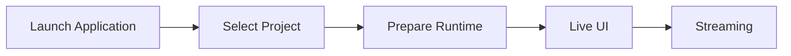
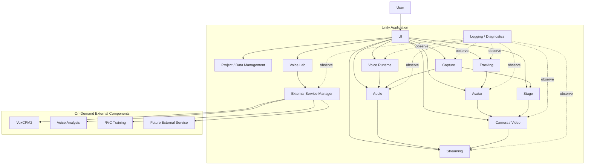
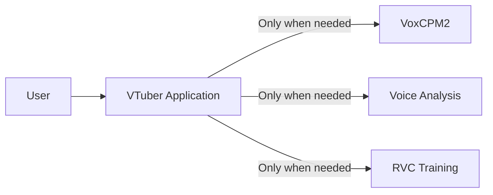
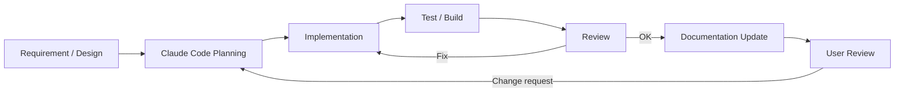
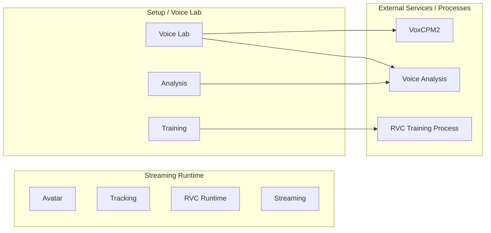
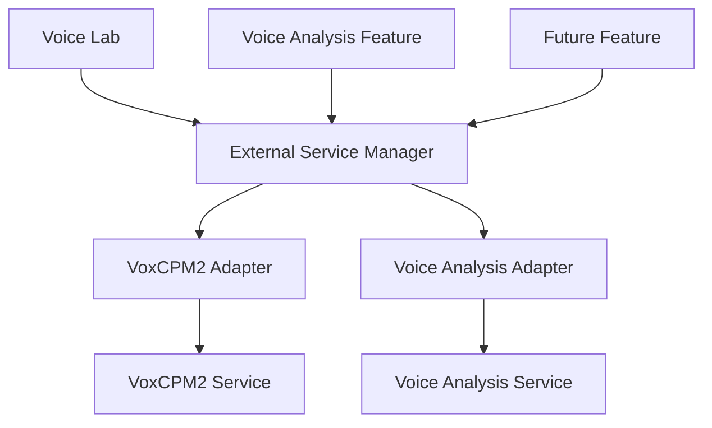
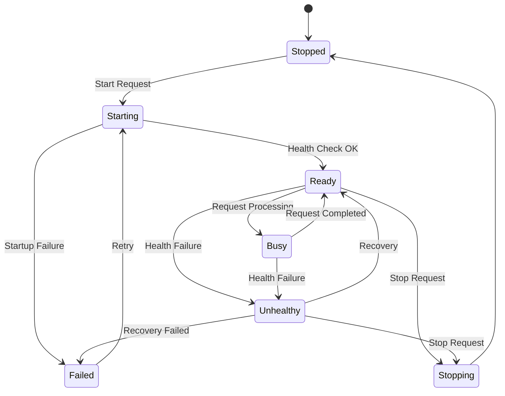
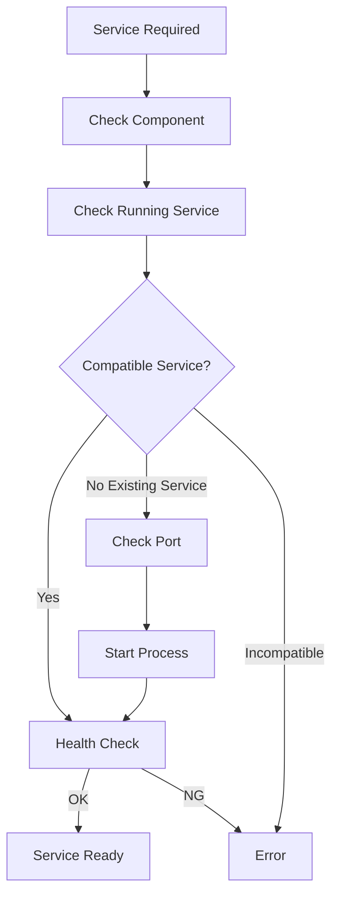

# Virtual Vessel Studio System Design

## Table of Contents

1. System Overview
2. Overall System Architecture
3. Development and Operations
4. External Service Management
5. Logging and Diagnostics
6. Project, Configuration, and Data Management
7. 3D Avatar Control
8. Tracking
9. Voice Conversion
10. Video Input, Camera, and Video Output
11. Stage Management
12. BGM, SE, and Audio Management
13. Voice Model Training and Voice Lab
14. UI and Operation
15. Non-functional Design
16. Future Extension Policy
    
---

# 1. System Overview

## 1.1 Purpose

The purpose of this system is to integrate functions such as 3D avatars, real-time tracking, voice conversion, stages, BGM/SE, video generation, live streaming, and voice model creation, and to provide **an integrated environment in which all operations required for VTuber streaming can be performed from a single application**.

In a typical VTuber streaming environment,

- 3D avatar display
- face / body tracking
- voice conversion
- audio mixing
- streaming
- recording
- voice model training
- external tools

may each be provided by separate applications or scripts.

In that case, the user must launch and configure multiple applications and manage device routing, windows, external processes, and so on.

This system integrates these as far as possible and consolidates what the user operates into **a single VTuber application (Virtual Vessel Studio)**.

The purpose is also not simply to pack multiple functions into one application, but to

- separate responsibilities by function
- limit dependencies on external OSS
- separate the streaming runtime from setup / training
- remain adaptable to future technology changes in tracking, voice, streaming, etc.
- keep a structure that can be continuously developed and maintained as OSS

### Rationale

VTuber streaming involves many technologies and devices. If each function is provided as a separate application, the user has to understand and operate the internal structure.

The fundamental value of this system is to

**absorb the complex internal structure on the application side and provide the user with an integrated operating environment.**

---

## 1.2 Scope

This system mainly covers the following functions.

### 3D Avatar

- VRM 1.0 and later
- FBX
- avatar registration
- avatar switching
- pose control
- expression control
- extension bone control
- extension elements such as cat ears and tails

### Tracking

- camera-based tracking
- face tracking
- body tracking
- hand tracking
- MediaPipe
- future tracking providers such as mocopi

### Voice Conversion

- microphone input
- real-time voice conversion with RVC
- post-processing such as pitch
- voice model selection
- output to virtual microphones, etc.

### Voice Lab

- voice generation
- voice clone
- dataset creation
- voice analysis
- RVC training
- training history
- model evaluation
- registering voice models for runtime

### Stage

- 3D stages
- stage switching
- camera points
- avatar spawn points
- lighting
- stage effects
- screen surfaces that display capture textures

### Audio

- voice
- BGM
- SE
- game / capture audio
- audio mixing
- monitor output
- stream audio

### Capture

- capture-board video and audio input via GameCapture
- sub-monitor video input via SubScreenCapture
- preview and on/off of capture sources
- supplying video to screen surfaces on the stage

### Camera / Video

- main camera
- camera point switching
- streaming render target
- diagnostic camera
- video encoding
- recording

### Streaming

- YouTube Live
- audio / video synchronization
- streaming via RTMPS, etc.
- streaming state management

### Project / Data

- project
- profile
- asset
- Data Root
- backup
- import / export
- migration
- credential management

### Developer / Diagnostics

- logging
- runtime diagnostics
- performance monitoring
- external process monitoring
- diagnostic camera
- diagnostics export

---

Items outside the scope of this system, or not required for the initial implementation, are treated as future extensions.

Examples:

- simultaneous multi-person streaming
- a complete plugin SDK
- simultaneous support for many streaming services
- support for every 3D model format
- support for every motion capture device

### Rationale

Implementing every future function from the start would make the system excessively complex relative to the functions currently needed.

Therefore, the implementation focuses on currently needed functions while providing extensible boundaries where future changes are expected.

---

## 1.3 Basic Policies

The basic policies of this system are as follows.

### Provide a Single Application

From a normal user's point of view, the system is provided as one Unity application.

Even when Python services or external OSS are used internally, normal users are not made aware of

- the command prompt
- Python
- venv
- ports
- Git
- the internal structure of external OSS

---

### Unity at the Center of the Runtime

The main functions required during streaming run centered on Unity.

Examples:

- avatar
- tracking
- voice conversion
- audio
- camera
- stage
- streaming
- UI

In particular, real-time voice conversion with RVC runs inside the Unity runtime, and no Python service is required during streaming.

---

### Python Mainly for Setup, Training, and Analysis

Python is mainly used for:

- voice generation
- voice clone
- RVC training
- voice analysis
- model conversion
- external OSS setup

These are started only when needed.

---

### Separate Setup and Runtime

For each function,

- registration
- analysis
- training
- mapping
- detailed configuration

and similar work are performed on the setup side.

The streaming runtime loads assets and profiles that have already been set up and performs processing that is as lightweight as possible.

---

### Do Not Expose External OSS Directly in the Application Design

External OSS such as RVC and VoxCPM2 is used through boundaries such as adapters / wrappers.

Modifying external OSS itself is avoided as far as possible.

---

### Separate Responsibilities by Module

The whole application is not consolidated into a giant manager.

Avatar, Tracking, Voice, Streaming, etc. are treated as independent modules that cooperate through clear interfaces and data contracts.

---

### Separate Information for Normal Users and Developers

Normal users see only the necessary state and operations.

Developers can sufficiently observe

- detailed logs
- performance
- internal state
- external processes
- versions
- exceptions

and similar information.

---

### Consider Future Extensions

Without making the initial implementation excessively complex, the structure remains extensible to

- new tracking providers
- new voice converters
- new avatar formats
- new streaming services
- new locales
- multiple avatars

and so on.

---

### Maintainable as OSS

This system is intended to be published as OSS on GitHub or similar.

Therefore,

- module boundaries
- documentation
- tests
- logging
- external dependencies
- version management
- migration

and similar concerns are considered from the design stage.

---

## 1.4 Expected Usage Patterns

This system broadly assumes the following usage patterns.

### Normal Streaming

The user loads already registered

- avatar
- tracking profile
- voice model
- stage
- streaming profile

and so on from a project and starts streaming.

The basic flow is as follows.



During normal streaming, there is no need to start Python or the Voice Lab environment.

---

### Pre-stream Setup

Avatar, Tracking, Voice, Stage, Streaming, etc. are configured.

Example:

```text
Avatar Import
Tracking Setup
Voice Setup
Stage Setup
Camera Setup
Audio Setup
Streaming Setup
Project Save
```

Each setup screen provides previews and tests where practical.

---

### Voice Lab

Used when creating a new voice model.

The basic flow is as follows.

```text
Generate
   ↓
Clone
   ↓
Dataset
   ↓
Train RVC
   ↓
Evaluate
   ↓
Register for Runtime
```

Only while Voice Lab is in use are external services / processes such as VoxCPM2, voice analysis, and RVC training started as needed.

---

### Developer / Diagnostics

In Developer Mode, the following can be checked:

- runtime state
- logging
- diagnostic camera
- tracking information
- audio information
- streaming information
- external service state

Normal users are not required to understand this internal structure.

---

---

# 2. Overall System Architecture

## 2.1 Overall Architecture

This system is built around a Unity application.

The main streaming runtime functions are placed inside Unity, and local external services / processes are used as needed for training, generation, analysis, etc.

The conceptual overall structure is shown below.



The arrows in the diagram mainly indicate

- control requests
- data transfer
- state references

and do not necessarily mean direct references between classes.

### Rationale

Placing Unity at the center of the application allows functions that cooperate during streaming, such as

- 3D rendering
- tracking
- audio
- UI
- streaming

to be handled on the same runtime.

At the same time, separating heavy setup processing such as training into external services avoids bringing unnecessary Python dependencies into the streaming runtime.

---

## 2.2 Division of Roles Between Unity and External Services

The responsibilities of Unity and external services are clearly separated.

### Unity Side

Mainly responsible for:

- application lifecycle
- UI
- project management
- avatar
- tracking
- runtime voice conversion
- audio mixing
- video input such as GameCapture / SubScreenCapture
- stage
- camera
- rendering
- streaming
- recording
- diagnostics
- external service lifecycle management

### External Service / Process Side

Mainly responsible for:

- voice generation
- voice clone
- voice analysis
- RVC training
- dataset processing
- model conversion
- other setup / analysis processing

### Basic Principle

Except for processing that can only be performed by an external service, the main streaming runtime does not depend on external services.

### Rationale

Separating the streaming runtime from the training environment limits the impact on normal streaming with registered assets even when

- Python environment failures
- external service failures
- dependency errors

occur.

---

## 2.3 Single-application UX with Internal Multi-service Structure

From the user's point of view, the system is a single application.

Internally, multiple processes such as

- the Unity runtime
- the VoxCPM2 service
- the voice analysis service
- the RVC training process

may exist.

However, normal users do not need to start or stop them individually.



The normal UI does not display

- ports
- PIDs
- venv
- Python commands

and similar details.

For example, when voice generation is started, it is displayed as user-facing states such as

```text
Preparing the voice generation service
        ↓
Available
        ↓
Generating voice
```

### Rationale

Even if the internal structure is complex, the way the application is used does not have to be complex.

Maintaining a single-application UX reduces the user's burden of environment setup and operation.

---

## 2.4 Module Division Policy

The inside of the system is divided into modules by responsibility.

The main modules are assumed to be:

```text
Application
Project / Data
Avatar
Tracking
Voice
Audio
Capture
Stage
Video
Streaming
VoiceLab
ExternalServices
Diagnostics
UI
```

Each module manages the internal implementation required for its responsibility.

For example, the Avatar module internally has

- avatar loading
- avatar runtime
- skeleton
- pose
- expression
- extension motion

The Tracking module manages

- providers
- normalization
- filtering
- calibration

The Capture module manages

- capture sources
- the GameCapture adapter
- the SubScreenCapture adapter
- capture state
- passing capture textures / audio

### Module Division Principles

The basics are:

1. One module does not directly manage the internal implementation of multiple functions.
2. A module does not freely depend on the internal classes of other modules.
3. The externally exposed interface is limited.
4. Internal changes in a module do not propagate to other modules.
5. No giant global manager is created.

### Rationale

Consolidating everything into a single application manager or similar

- makes responsibilities unclear
- makes unit testing difficult
- widens the impact of changes
- makes it harder for Claude Code to determine the scope of a change

---

## 2.5 Inter-module Cooperation

Inter-module cooperation uses the following according to purpose:

- interface
- data contract
- command
- event
- service
- runtime state

Directly referencing concrete classes inside a module is not the default.

---

### Interface

Used as a stable boundary for using functions from other modules.

Examples:

```text
IAvatarLoader
ITrackingProvider
IVoiceConverter
IVideoCaptureSource
IAudioCaptureSource
IVideoEncoder
IStreamPublisher
```

### Data Contract

Used when passing data between modules.

Examples:

```text
TrackingFrame
AvatarPose
ExpressionSignal
CaptureSourceInfo
CaptureFrameInfo
FinalStreamAudio
```

### Command

Passes operation requests from user operations or external input to the runtime.

Examples:

```text
SwitchAvatarCommand
SwitchCameraCommand
PlaySeCommand
ToggleMuteCommand
```

### Event

Used when state changes and similar need to be notified to multiple modules.

Examples:

```text
ProjectChanged
AvatarChanged
StageChanged
StreamingStateChanged
```

### Runtime State

Used to expose the current state to the UI and diagnostics.

The UI does not directly reference internal variables of modules.

---

### Suppressing Direct Dependencies

For example, the UI does not directly call a concrete implementation, as in

```text
Button
  ↓
VrmAvatarLoader
```

Instead, it uses

```text
Button
  ↓
Command
  ↓
Avatar Module
  ↓
Internal implementation
```

### Rationale

This allows the same processing to be reused from different input sources such as the UI, external devices, and automation.

Reducing dependencies on concrete classes also limits the impact of internal implementation changes.

---

## 2.6 Common Data Formats and Abstraction Policy

Data used between modules avoids, as far as possible, directly using formats specific to a particular library or external OSS.

Data is converted into system-wide data contracts before use.

### Tracking

For example, MediaPipe-specific landmark information is not passed directly to the Avatar module.

```text
MediaPipe Data
      ↓
Tracking Provider
      ↓
TrackingFrame
      ↓
Avatar Module
```

### Avatar

VRM- or FBX-specific bone structures are not exposed to the Tracking module.

```text
VRM / FBX
   ↓
Skeleton Mapping
   ↓
Common Avatar Bone
```

### Expression

VRM expressions and FBX blend shapes are not handled directly on the face tracking side.

```text
Face Tracking
      ↓
Expression Signal
      ↓
Expression Mapping
      ↓
VRM / FBX
```

### Voice

RVC-specific processing is not exposed to the audio mixer, etc.

```text
Audio Input
    ↓
IVoiceConverter
    ↓
Converted Audio
    ↓
Audio Processing
```

### Capture

Concrete capture implementations such as GameCaptureUnityPlugin and DXGI Desktop Duplication are not exposed directly to the Stage or Video modules.

```text
Capture Board / DXGI Desktop Duplication
      ↓
Capture Adapter
      ↓
IVideoCaptureSource / IAudioCaptureSource
      ↓
Capture Texture / Capture Audio
      ↓
Stage / Audio Module
```

GameCapture is treated as a capture source that can provide both video and audio, and SubScreenCapture provides only video in the initial implementation.

A capture source is responsible only for acquiring video. Where on the stage the acquired video is displayed is the responsibility of the Stage module, and how the final video is streamed or recorded is the responsibility of the Video / Streaming modules.

### Streaming

Streaming-service-specific processing is not exposed to rendering.

```text
Render / Audio
      ↓
Encoder
      ↓
Encoded Stream
      ↓
IStreamPublisher
```

---

### Principles of Common Data Formats

Common data contracts are kept as independent as possible from specific technologies such as

- model format
- tracking library
- voice engine
- capture backend
- streaming service

They also include, as needed,

- timestamp
- confidence
- state
- version

### Rationale

If external library types are used directly at module boundaries, changing that library requires changing many modules.

Converting from specific technologies into a common representation once limits the scope of changes.

---

---

# 3. Development and Operations

## 3.1 Basic Development Policy

This system is developed on the assumption of long-term feature additions and publication as OSS.

Development continuously performs

- design
- implementation
- testing
- review
- documentation
- refactoring

The emphasis is not only on adding features but also on maintaining module boundaries and design rules.

Development agents such as Claude Code are also actively used.

### Basic Principles

1. Implement based on the system design.
2. Respect module responsibilities.
3. Minimize changes to external OSS.
4. Add tests together with the implementation.
5. Treat logging / diagnostics as part of feature implementation.
6. Update documentation when specifications change.
7. Consider performance regressions.
8. Include security / privacy in reviews.
9. Avoid concentration in giant classes or global singletons.
10. Delegate automatable work to development agents.

### Rationale

In a system with many functions, repeated ad hoc implementation tends to break the design.

Building implementation rules and design documents into the development process prevents quality from declining as features are added.

---

## 3.2 Development Automation with Claude Code

Claude Code is used as the main development agent for this system.

Claude Code is responsible not only for simple code generation but also for the following work:

- checking existing designs
- creating implementation plans
- code implementation
- refactoring
- unit tests
- integration tests
- build verification
- code review
- performance verification
- logging / diagnostics verification
- documentation updates
- UI design
- UI implementation
- visual review
- bug fixes

The conceptual development cycle is as follows.



### Rationale

This system spans many technical domains, such as

- Unity
- C#
- Python
- external OSS
- voice models
- UI
- streaming

Sharing the design rules with a development agent and having it consistently carry out implementation, testing, review, and documentation makes development more efficient.

However, results generated by Claude Code are not adopted unconditionally.

The user also checks the architecture, major specifications, UI, perceived quality, and so on.

---

## 3.3 Repository Structure

The repository is structured so that functional responsibilities and the boundaries between the runtime and external services are easy to understand.

A conceptual example is shown below.

```text
virtual-vessel-studio/
├─ CLAUDE.md
├─ README.md
│
├─ docs/
│  ├─ ja/
│  │  ├─ architecture/
│  │  ├─ detailed-design/
│  │  ├─ development/
│  │  ├─ decisions/
│  │  └─ ui/
│  │     ├─ design-system.md
│  │     ├─ ui-guidelines.md
│  │     ├─ components.md
│  │     └─ screens/
│  │
│  └─ en/
│     └─ (same structure as ja)
│
├─ unity/
│  └─ VirtualVesselStudio/
│     ├─ Assets/
│     │  ├─ Application/
│     │  ├─ Project/
│     │  ├─ Avatar/
│     │  ├─ Tracking/
│     │  ├─ Voice/
│     │  ├─ Audio/
│     │  ├─ Capture/
│     │  ├─ Stage/
│     │  ├─ Video/
│     │  ├─ Streaming/
│     │  ├─ VoiceLab/
│     │  ├─ ExternalServices/
│     │  ├─ Diagnostics/
│     │  └─ UI/
│     ├─ Packages/
│     └─ ProjectSettings/
│
├─ native/
│
├─ services/
│  ├─ voxcpm/
│  ├─ voice-analysis/
│  └─ adapters/
│
├─ tests/
│  ├─ unit/
│  ├─ integration/
│  ├─ system/
│  └─ performance/
│
└─ tools/
```

The actual Unity project structure, etc. will be adjusted during implementation.

What matters is not the directories themselves but that responsibility boundaries can be understood from the repository structure.

---

### docs

Holds designs, specifications, rationale for decisions, etc.

The Japanese version is placed in `docs/ja/` and the English version in `docs/en/`, and the same document uses the same relative path.

### unity

Holds the main body of the Unity application.

The Unity project root is `unity/VirtualVesselStudio/`.

Responsibilities are separated by functional module.

### native

Holds project-owned native Windows code and native plugins.

### services

Holds project-managed wrappers, adapters, launchers, etc. for external services.

External OSS itself is not mixed with project-owned code.

### tests

Manages unit, integration, and system tests by purpose.

Product performance measurements such as RVC latency, capture performance, and long-run operation are placed under `tests/performance/`.

Historical benchmark / prototype implementations are reference snapshots outside the repository and are not copied into this repository.

### tools

Manages auxiliary tools for build, setup, conversion, development support, etc.

### Rationale

Bringing the repository structure close to the architecture structure makes it easier for developers and Claude Code to determine what to change.

---

## 3.4 CLAUDE.md

A `CLAUDE.md` is placed at the repository root to define common rules that Claude Code always follows during development.

`CLAUDE.md` describes at least the following.

### Architecture Rule

- the application is Unity-centered
- separate setup and runtime
- respect module boundaries
- use external OSS through adapters / wrappers
- other modules do not depend directly on a module's internal implementation

### Code Rule

- do not create giant managers
- do not create unnecessary singletons
- prefer interfaces / data contracts
- keep the public API to the necessary minimum
- add comments that explain the design intent of non-obvious processing

### External OSS Rule

- do not change external OSS itself as far as possible
- place required custom processing on the application side
- pin and manage versions
- if a custom patch is required, record the reason in the documentation

### Test Rule

- add the required tests for new features
- add regression tests for bug fixes where practical
- prefer module-level tests
- check for performance degradation in performance-critical processing

### Diagnostics Rule

- leave sufficient developer context on errors
- separate user notifications from developer logs
- do not output secrets to logs
- do not output excessive logs in high-frequency processing

### UI Rule

- follow the design system
- prefer existing components
- use Unity Localization
- check in Japanese / English
- do not specify fonts individually
- perform visual review with screenshots

### Documentation Rule

- update related documents when the architecture changes
- add new design patterns to the documentation when introduced
- do not leave mismatches between implementation and documentation

### Rationale

Explaining architecture rules to Claude Code in each individual prompt tends to cause missed instructions and inconsistent decisions.

Placing them in the repository as persistent development rules increases consistency when making changes.

---

## 3.5 Testing, Review, and Documentation Updates

The condition for completing a feature implementation is not only that the code works.

As a rule, one development cycle runs through

```text
Implementation
      ↓
Build
      ↓
Test
      ↓
Review
      ↓
Documentation
      ↓
User confirmation
```

---

### Unit Test

Verifies individual classes and algorithms.

Examples:

- data conversion
- profile validation
- mapping
- state transitions
- commands

---

### Integration Test

Verifies cooperation between modules.

Examples:

```text
Tracking → Avatar
Voice → Audio
GameCapture → Capture / Audio
SubScreenCapture → Capture / Stage
Audio → Streaming
Project → Runtime
Voice Lab → External Service
```

---

### System Test

Verifies the Unity application as a whole.

Examples:

- application startup
- project load
- avatar display
- tracking
- voice conversion
- stage
- streaming
- recording

---

### Performance Test

For real-time processing, performance is also verified as needed.

Examples:

- RVC latency
- tracking processing time
- frame time
- encoding time

---

### Review

Self review by Claude Code checks at least the following:

- architecture compliance
- module boundaries
- code quality
- error handling
- diagnostics
- security
- privacy
- performance
- test coverage
- documentation

---

### UI Review

For the UI, the actual screens are checked with screenshots, etc., and Claude Code itself also reviews

- spacing
- alignment
- visual hierarchy
- Japanese
- English
- fonts
- design system compliance

and so on.

Ultimately, the user also checks the UI.

---

### Documentation Updates

When any of the following changes, related documents are also updated.

- interfaces
- data formats
- directory structure
- setup approach
- UI
- external components
- project format
- architecture

### Rationale

If only the implementation is updated and the documentation becomes stale, later developers and Claude Code may make changes based on incorrect assumptions.

Documentation is also treated as a component of the system.

---

## 3.6 Development Policy as OSS

This system assumes a structure that can be published as OSS.

Therefore, states that only a specific development environment or developer can understand are avoided as far as possible.

---

### Making External Dependencies Explicit

For the external libraries, OSS, and tools used,

- name
- version
- license
- purpose of use

can be identified.

---

### Separation from External OSS

External OSS itself, such as RVC and VoxCPM2, is clearly separated from this system's own implementation.

Project-specific functions are, as a rule, implemented as

- adapters
- wrappers
- launchers
- application-side processing

### Rationale

Heavily modifying external OSS directly makes it difficult to follow upstream versions.

---

### Reproducible Development and Distribution Environments

For external components that use Python, the **development environment** and the **distribution environment for normal users** are managed separately.

In the development environment, for each component,

- external OSS version / commit
- Python version
- dependency definition / lock
- venv
- build procedure
- test procedure

are made explicit, and excessive dependence on each developer's global Python environment is avoided.

For normal users, a portable runtime package or standalone executable generated from the development environment by the build pipeline is provided, in which

- runtime package version
- Python runtime version
- dependency versions
- external OSS version / commit
- adapter version
- build ID
- package hash

and so on can be identified.

Normal users are not required to install or operate Python itself, venv, pip, etc.

venv is mainly an environment for development, testing, and builds, and is kept separate from how the distribution for normal users runs.

Docker is also not a required dependency of the standard development and distribution approach.

---

### Investigability of Issues

To respond to failure reports from users,

- application version
- external component versions
- logs
- diagnostics
- environment

and so on can be checked.

A diagnostics export that does not contain secrets can be provided.

---

### Structure Easy for Contributors to Understand

The goal is that, within the repository, one can check

- architecture
- module responsibilities
- setup
- build
- test
- coding rules
- external dependencies

---

### Preventing Secrets from Entering the Repository

The following are not committed to the repository.

- stream keys
- OAuth tokens
- passwords
- API keys
- personal credentials

The application runtime also does not store secrets in normal configuration files or logs.

---

### Patch Management

If a custom patch to external OSS becomes necessary,

- the patch content
- the reason for the patch
- the target version
- the difference from upstream
- whether it can be removed in the future

are recorded in the documentation.

### Rationale

This makes it possible to determine, when updating external OSS in the future, whether the custom changes are still needed.

---

### Recording Development Decisions

For important architecture changes, design decisions are recorded as needed in

```text
docs/<lang>/decisions/
```

or similar.

Examples:

- why RVC runs in the Unity runtime
- why the streaming runtime does not depend on Python
- why external OSS is not modified
- why UI Toolkit was adopted

### Rationale

Over time, "why this structure exists" tends to be lost.

Recording not only the final structure but also the main reasons for decisions makes future change decisions easier.

---

### Basic Principles of OSS Development

This system adopts the following basic principles for development as OSS.

1. Document the architecture and module responsibilities.
2. Clearly separate external OSS from project-owned implementation.
3. Minimize direct modification of external OSS.
4. Manage the versions of external dependencies.
5. Reduce dependence on global development environments.
6. Maintain a testable module structure.
7. Provide sufficient logging / diagnostics.
8. Do not include secrets in the repository, logs, or diagnostics.
9. Update documentation when the architecture changes.
10. Make changes by Claude Code follow the same development rules.
11. Besides automated review by Claude Code, have the user check the results as needed.
12. Maintain a structure that future contributors can understand and change.


---

---

# 4. External Service Management

## 4.1 Basic Policy

This system uses local services or external processes implemented in Python, etc. for some processing that the Unity application does not perform by itself.

The following are assumed as examples:

- VoxCPM2
- voice analysis
- RVC training
- audio analysis processing
- model conversion processing
- other external tools added in the future

However, normal users are not made aware of

- installing Python
- starting Python
- creating / activating a venv
- installing dependency packages with pip, etc.
- typing commands
- port numbers
- process IDs
- the directory structure of external OSS

and similar matters.

Components that use Python are, as a rule, distributed to normal users as built portable runtime packages or standalone executables.

When the Unity application requests a required operation, it checks the installed runtime package and automatically prepares and starts the required external service or external process so that it can be used.

Developers can run and test each component directly from a native Python + venv environment using the same source and dependency definition / lock.

External services that are not needed by the streaming runtime are not kept running at all times.

### Rationale

This system aims to behave as a single application from the user's point of view.

Even if Python and external OSS are used internally, exposing that structure to users

- complicates startup procedures
- requires knowledge of Python environments
- causes forgotten startups or wrong startup order
- requires port and process management

and greatly increases the burden of use.

Therefore, the lifecycle of external services is managed by the application.

---

## 4.2 Classification of External Processing

External processing is broadly classified into the following two types.

### Managed Local Service

A local service that stays running for a certain period and accepts multiple requests from Unity.

Examples:

- VoxCPM2 service
- voice analysis service
- analysis services added in the future

Mainly uses local IPC such as HTTP.

### Managed External Process

An external process started to perform specific processing and terminated after the processing completes.

Examples:

- RVC training
- dataset preprocessing
- model conversion
- setup scripts
- other batch processing

### Rationale

Long-running services and processes that finish after a single job have different lifecycles.

Instead of forcing both into the same approach,

- service lifecycle
- process execution

are handled separately.

---

## 4.3 Separation from the Streaming Runtime

Python local services are not required for the normal streaming runtime.

During normal streaming, only functions needed on the Unity runtime, such as

- avatar
- tracking
- RVC runtime
- audio
- stage
- camera
- streaming

are used.

In particular, real-time voice conversion with RVC runs in the Unity-side runtime and does not depend on a Python service.

On the other hand, the required services or processes are started only when using

- Voice Lab
- RVC training
- voice clone
- voice analysis
- external OSS setup

and so on.



### Rationale

This allows normal streaming with already registered models to continue even if problems occur in Voice Lab or the training environment.

---

## 4.4 External Service Manager

An `External Service Manager` is provided as a common function that manages the lifecycle of external services.

The External Service Manager is mainly responsible for:

- managing service registration information
- requesting startup of required services
- detecting already-running services
- reusing services
- checking ports
- starting processes
- health checks
- waiting for readiness
- managing service state
- stopping services
- detecting failures

Feature modules do not start Python processes directly.



### Rationale

If each module individually implements

- process startup
- port checks
- health checks
- shutdown

the same processing is duplicated and different lifecycle management approaches are mixed.

Consolidating them into a common manager unifies the service management approach.

---

## 4.5 Service Adapter Approach

The External Service Manager is structured so that it does not need to know too much about each external service's specific API or internal specifications.

Service-specific processing is separated into adapters.

Conceptually, the following interface is assumed.

```text
IExternalServiceAdapter

- GetServiceInfo()
- StartAsync()
- CheckHealthAsync()
- StopAsync()
- GetStatusAsync()
```

Concrete implementations such as

- VoxCpmServiceAdapter
- VoiceAnalysisServiceAdapter
- FutureServiceAdapter

are provided.

### Rationale

Each external service differs in

- how it is started
- health checks
- API specifications
- how its version is obtained
- how it is shut down

and so on.

If these are written directly into the External Service Manager, the manager has to be modified every time a service is added.

Confining service-specific processing to adapters limits the impact of adding external services.

---

## 4.6 Service Descriptor

For each external service, the information needed for management is held as a service descriptor.

The assumed information is as follows.

| Item | Content |
|---|---|
| ServiceId | Service identifier |
| DisplayName | Display name |
| ComponentId | Corresponding external component |
| SupportedVersion | Supported version |
| AdapterVersion | Adapter version |
| Executable | Startup target |
| WorkingDirectory | Working directory |
| DefaultPort | Default port |
| HealthEndpoint | Health check target |
| InfoEndpoint | Service information endpoint |
| StartupTimeout | Maximum startup wait |
| ShutdownPolicy | Shutdown method |

The concrete storage format is decided in the detailed design.

### Rationale

If service information is scattered throughout C# code, changes to versions or startup methods require modifying many places.

Holding service management information as a clear unit makes management and diagnostics easier.

---

## 4.7 Service Lifecycle

A managed local service conceptually has the following states.



The UI displays these internal states in a simplified form as needed.

### Rationale

Simple running / stopped states cannot distinguish

- the process is starting
- the API is being prepared
- processing is in progress
- the process exists but does not respond

and so on.

Making the service lifecycle explicit makes state management and failure diagnosis easier.

---

## 4.8 Service Startup Flow

When a startup request is received from a function that requires a service, processing conceptually proceeds in the following order.



The main steps are:

1. Check whether the required external component is available.
2. Check whether the target service is already running.
3. Check whether an already-running service is compatible.
4. Check whether the required port is available.
5. Start the service process.
6. Repeat health checks.
7. Confirm that the service has reached the Ready state.
8. Return the available state to the caller.

### Rationale

If a request is sent immediately after the process starts, model loading, etc. inside the service may not have completed.

Instead of simply starting the process, startup is confirmed until the service can actually process requests.

---

## 4.9 Reusing Already-running Services

If the target service is already running, a new process is not started immediately.

First,

- service identity
- version
- API compatibility
- health
- target port

and so on are checked.

If the service is compatible, it can be reused.

### Rationale

Starting multiple instances of the same service causes

- port conflicts
- duplicate GPU memory usage
- duplicate model loading
- unnecessary memory consumption

and so on.

Safely reusing existing services reduces resource consumption.

---

## 4.10 Service Identity Verification

The target service is not judged to be running merely because the port is in use.

Where possible, the service is queried to check

- ServiceId
- version
- API version
- health

and so on.

For example, endpoints such as

```text
/health
/info
```

are used through the service adapter.

### Rationale

Another application may be using the target port.

Judging "port is open = target service exists" risks sending requests to the wrong service.

---

## 4.11 Port Management

A default port can be assigned to each service.

The current configuration uses, for example:

| Service | Default port |
|---|---:|
| VoxCPM2 Reference Service | 8765 |
| Voice Analysis Service | 8766 |

However, normal users are not normally expected to configure port numbers directly.

Port numbers are managed as service descriptors or application settings.

### Rationale

Port numbers are necessary for the internal implementation but are not meaningful settings for normal users.

They are managed as internal structure and can be checked from developer diagnostics only when needed.

---

## 4.12 Port Conflicts

If the intended port is used by another process, it is checked whether that process is a compatible service.

If it is not a compatible service, the application does not terminate the process or operate on the other application without permission.

Normal users are shown, for example:

> The voice generation service could not be started.  
> A required communication port is being used by another application.

Developer diagnostics record

- ServiceId
- port
- target process information
- health check results
- service identity determination

and so on.

### Rationale

Terminating unrelated processes to resolve a port conflict may affect other applications.

The application errs on the safe side and notifies the user of the conflict.

---

## 4.13 Process Ownership

The External Service Manager distinguishes between

**processes it started itself**

and

**processes that were already running and were reused**

When starting a process, it records as needed

- PID
- application session
- ServiceId
- start time

and so on.

### Rationale

When an existing service is reused, that process may have been started by another application or another session.

Such a service must not be stopped without permission when this application exits.

---

## 4.14 Service Shutdown

Services started by the application can be stopped when their use ends or when the application exits.

When stopping, where possible, the following order is used:

1. graceful shutdown request
2. wait for process exit
3. forced termination if necessary

However, when an already-running service was merely reused, it is, as a rule, not stopped.

### Rationale

This avoids affecting processes this system does not own.

Also, using forced termination from the start may corrupt data that the service is saving.

---

## 4.15 On-demand Startup

External services are not all started when the application starts.

They are started when needed.

Examples:

- using the voice clone screen → start VoxCPM2
- starting voice analysis → start voice analysis
- starting RVC training → start the training process

### Rationale

Keeping everything running at all times leads to

- longer startup time
- memory consumption
- GPU memory consumption
- an increase in unnecessary processes

In particular, many services are not used during normal streaming, so they are started only when needed.

---

## 4.16 Delayed Service Shutdown

Instead of always terminating a service immediately after use ends, an approach that keeps it reusable for a certain period is also permitted as needed.

For example, in Voice Lab, when repeating

- voice generation
- preview listening
- regeneration
- generation with a different prompt

VoxCPM2 is not restarted each time.

The concrete shutdown timing is decided in the detailed design, considering the characteristics of each service.

### Rationale

For services whose model loading takes time, starting and stopping each time greatly reduces usability.

On-demand startup and reuse are combined.

---

## 4.17 External Process Execution

Temporary processing such as RVC training is executed as a managed external process.

Process execution manages at least the following:

- process ID
- command
- working directory
- environment
- start time
- end time
- exit code
- stdout
- stderr
- cancellation state

External processes are not started directly from the UI but through the adapter or manager of the relevant function.

### Rationale

External process execution also needs to be state-managed as part of the application's processing.

Simply starting a process does not allow the application to track progress or reasons for failure.

---

## 4.18 Python Execution Environment

External services / processes that use Python are started by explicitly specifying the execution environment managed as described in Chapter 13.

They do not depend on the OS global Python or the environment currently activated in the shell.

In the distribution environment for normal users, the launcher / executable indicated by the runtime package's `manifest.json` is started (see 13.6 and 13.7).

```text
External/<Component>/<RuntimePackageVersion>/manifest.json
        ↓
Launcher / Executable
```

In the development environment, the Python of the per-component, per-version development venv can be explicitly specified for startup.

```text
<ExternalComponent>/<Version>/.venv/Scripts/python.exe
```

In both cases, the path and version of the execution environment used for startup can be checked from diagnostics.

### Rationale

Depending on the global Python causes

- Python version
- package versions
- CUDA support
- dependencies

to vary by user environment, and reproducibility is lost.

The environment managed by the application is used explicitly.

---

## 4.19 Separation of Responsibilities from External Component Management

The External Service Manager is basically responsible for **the execution lifecycle of installed components**.

The following are the responsibilities of external component management in Chapter 13:

- external OSS / source version management
- dependency definition / lock management
- developer venv setup procedures
- runtime package build information management
- obtaining runtime packages
- package hash / integrity verification
- extracting and registering runtime packages
- update
- rollback
- capability / dependency verification

Setup for normal users does not, as a rule, build a venv from source but installs a built runtime package.

If the External Service Manager cannot find a component, it guides processing to the setup function.


### Rationale

Separating "the responsibility to build the environment" from "the responsibility to start the built environment" simplifies management.

---

## 4.20 Version Compatibility

Before using an external service, it is checked whether the version is supported by this application and the adapter.

At least the compatibility of

- external component version
- API version
- adapter version

and so on can be checked.

If an unsupported version is detected, it is not used unconditionally.

### Rationale

Even if a process starts normally, it may not work correctly if the API specification or output format has changed.

"Being able to start" and "being compatible" are separated.

---

## 4.21 Service Health Check

A health check mechanism is provided for managed local services.

Health checks verify the following as needed:

- process existence
- API response
- service identity
- service version
- internal initialization state
- load state of required models

Health check results are converted into common states such as

- Ready
- Busy
- Unhealthy
- Failed

### Rationale

Even if a process exists, it may be unable to process requests due to

- model load failure
- GPU initialization failure
- dependency errors

and so on.

Therefore, not only process existence but also availability as a service is verified.

---

## 4.22 Startup Timeout

A timeout is set for service startup processing.

For services whose model loading, etc. takes time, an appropriate startup timeout can be set per service.

When a timeout occurs,

- process state
- health check results
- stdout
- stderr

and so on are recorded in the diagnostic information.

### Rationale

This prevents the Unity side from waiting indefinitely when an external service does not respond.

---

## 4.23 Detecting Abnormal Termination

If an external service / process started by the application terminates unexpectedly, that state is detected.

For example, the following are recorded:

- process ID
- exit time
- exit code
- last stdout
- last stderr
- the processing that was in progress

### Rationale

If an external process terminates abnormally, simply treating it as a communication error on the Unity side makes the cause hard to identify.

The process lifecycle and communication state are managed in association.

---

## 4.24 Automatic Recovery

For temporary failures, restart can be attempted for services that support automatic recovery.

However,

- unlimited restarts
- repeated restarts in a short time

are not performed.

The retry count and conditions are managed per service.

For external processes whose results are affected by restarting, such as training, automatic re-execution is, as a rule, not performed.

### Rationale

Service-type processing may automatically recover from temporary failures, while re-executing training, etc. without permission may cause duplicate processing or artifact inconsistencies.

The recovery policy is separated according to the processing characteristics.

---

## 4.25 Concurrent Request Control

External services do not necessarily support processing multiple requests concurrently.

For each service, execution characteristics such as

- Concurrent
- Serialized
- Single Job

can be defined.

The application manages a request queue as needed.

### Rationale

In particular, for services that use GPU models, running multiple jobs simultaneously may cause

- insufficient GPU memory
- reduced processing speed
- service crashes

and so on.

The degree of parallelism is controlled according to the service's capability.

---

## 4.26 Request Cancellation

For long-running requests, cancellation can be handled if the target service supports it.

For external processing that cannot be cancelled, this is made clear in the UI.

Treating forced process termination as cancellation is decided case by case, considering the possibility of data corruption.

### Rationale

Even if the Unity side receives a cancellation request, the external service cannot necessarily stop safely.

The meaning of cancellation is made clear per service.

---

## 4.27 Not Exposing Internal Structure to the UI

The normal UI, as a rule, does not display

- port numbers
- PIDs
- runtime package paths / developer venv paths
- Python commands
- health endpoints

and so on.

The normal UI converts these into user-facing states such as

- preparing
- available
- processing
- setup required
- error

Developer Mode can display detailed information.

### Rationale

What normal users need is not the internal service structure but "whether the function can be used."

Internal information is separated into the developer diagnostics defined in Chapter 5.

---

## 4.28 Service Setup Guidance

If a required external component has not been set up, normal users are not required to operate Python or Git manually.

For example,

> Initial setup is required for the voice generation function.

is displayed, and environment setup can be started from the setup UI.

### Rationale

Emphasis is placed on being able to start using a function without understanding internal dependencies.

---

## 4.29 Security

Managed local services, as a rule, listen only on localhost.

Being accessible from external networks is not the default.

Necessary validation is also performed on paths, parameters, etc. passed to external services.

### Rationale

There is normally no need to expose services for Voice Lab, etc. to external networks.

The attack surface is not increased unnecessarily.

---

## 4.30 Secrets

If secrets need to be passed to an external service / process, approaches that do not output them in plain text on the command line or in logs are preferred.

Secrets follow the credential management approach defined in Chapter 6.

Developer logs defined in Chapter 5 also do not record secrets.

### Rationale

Process commands and logs may be shared externally for failure investigation, etc.

---

## 4.31 Integration with Logging and Diagnostics

The External Service Manager and external process management functions use the common logging / diagnostics approach defined in Chapter 5.

The main diagnostic information handled is:

- ServiceId
- component version
- adapter version
- Python version
- venv
- process ID
- port
- process state
- service health
- start / stop time
- exit code
- stdout
- stderr
- health check results
- exception

The display for normal users shows only the necessary information concisely.

### Rationale

For external process failures, information inside Unity alone cannot identify the cause, so the external environment is also made observable.

---

## 4.32 Processing at Application Exit

When the application exits, the external services owned by this application session are stopped.

Services that were merely reused are, as a rule, not stopped.

If an external process is in progress, depending on the nature of the process, one of

- wait for normal completion
- cancel
- ask for exit confirmation

and so on is chosen.

### Rationale

The purpose is to avoid stopping unrelated processes when the application exits and to prevent corruption of data being processed.

---

## 4.33 Services After Abnormal Application Termination

If the application terminates abnormally, external services alone may remain.

At the next startup,

- target port
- service identity
- health
- version

and so on are checked, and the service can be reused if it is compatible.

However, a reused service is not automatically considered owned by the current session.

### Rationale

There is no need to forcibly terminate healthy services left after an abnormal termination every time.

On the other hand, misidentifying ownership may cause another session's process to be terminated, so ownership is separated in the lifecycle.

---

## 4.34 Adding External Services

When adding a new external service, the following are added as a rule:

1. external component definition
2. service descriptor
3. service adapter
4. health check
5. version compatibility definition
6. setup information
7. diagnostics information

The goal is a structure in which services can be added without changing the main logic of the existing External Service Manager.

### Rationale

Changing the common lifecycle processing every time an external service is added tends to cause regressions in existing services.

---

## 4.35 Separation of Setup and Runtime Responsibilities

Setup and runtime are also separated for external-service-related processing.

### Setup

Setup for normal users mainly performs:

- checking the external component manifest
- version selection
- obtaining built runtime packages
- package hash / integrity verification
- extracting and registering runtime packages
- obtaining required models / assets
- capability / environment verification
- service startup test
- health check test

Separately, the developer environment allows running and testing directly from source using native Python + venv.

### Runtime / When Using Voice Lab

- detecting required services
- startup
- reusing already-running services
- health checks
- requests
- state monitoring
- stopping as needed

### Rationale

Running environment setup processing during normal use complicates the processing needed before a function can start.

Environment setup and actual service use are separated.

---

## 4.36 Internal Division of Responsibilities

Conceptually, the following structure is assumed.

```text
ExternalServices/
├─ Core/
│  ├─ ServiceDescriptor
│  ├─ ServiceState
│  ├─ ServiceInstance
│  └─ ServiceId
│
├─ Management/
│  ├─ ExternalServiceManager
│  ├─ ServiceRegistry
│  ├─ ServiceLifecycleManager
│  └─ ServiceRequestCoordinator
│
├─ Process/
│  ├─ ExternalProcessRunner
│  ├─ ProcessOwnership
│  └─ ProcessResult
│
├─ Network/
│  ├─ PortChecker
│  └─ ServiceIdentityChecker
│
├─ Health/
│  ├─ HealthChecker
│  └─ ServiceHealth
│
├─ Adapters/
│  ├─ VoxCpmServiceAdapter
│  ├─ VoiceAnalysisServiceAdapter
│  └─ FutureServiceAdapter
│
└─ Diagnostics/
   └─ ExternalServiceDiagnostics
```

External OSS source, venv, versions, updates, etc. are separated into the external component management function in Chapter 13.

### Rationale

Concentrating process startup, port management, health checks, service-specific APIs, version management, etc. in one giant manager makes responsibilities unclear.

Separating the common lifecycle from service-specific processing ensures maintainability.

---

## 4.37 Basic Principles of External Service Management

This system adopts the following basic principles for external service management.

1. Do not make normal users aware of internal structures such as Python and ports.
2. The streaming runtime does not depend on Python local services.
3. External services are started on demand only when needed.
4. Distinguish services from temporary external processes.
5. Service lifecycles are managed in common by the External Service Manager.
6. Service-specific processing is separated into adapters.
7. Startup includes completing health checks, not just starting the process.
8. Reuse already-running services if they are compatible.
9. Do not judge a service to be the target merely because its port is in use.
10. Verify service identity and version.
11. As a rule, do not expose port numbers to normal users.
12. Do not terminate other applications without permission on port conflicts.
13. Distinguish processes started by the application from reused processes.
14. Do not stop processes that are not owned without permission.
15. Run Python by explicitly specifying the execution environment managed by the application (the runtime package in distribution, the development venv in development).
16. Separate obtaining / updating external components from the service lifecycle.
17. Verify compatibility between service versions and adapter versions.
18. Distinguish process existence from service health.
19. Set a timeout for service startup.
20. Obtain stdout / stderr / exit codes of external processes.
21. Separate recovery approaches for service-type processing and batch processing.
22. Control the number of concurrent requests according to service capability.
23. Managed local services are, as a rule, exposed only on localhost.
24. Do not carelessly output secrets to commands or logs.
25. Detailed information about external services can be checked from developer diagnostics.
26. New services are added basically by adding a descriptor and an adapter.
27. Separate setup from the actual service usage lifecycle.


---

---

