# Virtual Vessel Studio System Design

## Table of Contents

1. System Overview
2. Overall System Architecture
3. Development and Operations
4. External Service Management
5. Logging and Diagnostics
6. Project, Configuration, and Data Management
7. 3D Avatar Control
8. Tracking
9. Voice Conversion
10. Video Input, Camera, and Video Output
11. Stage Management
12. BGM, SE, and Audio Management
13. Voice Model Training and Voice Lab
14. UI and Operation
15. Non-functional Design
16. Future Extension Policy
    
---

# 1. System Overview

## 1.1 Purpose

The purpose of this system is to integrate functions such as 3D avatars, real-time tracking, voice conversion, stages, BGM/SE, video generation, live streaming, and voice model creation, and to provide **an integrated environment in which all operations required for VTuber streaming can be performed from a single application**.

In a typical VTuber streaming environment,

- 3D avatar display
- face / body tracking
- voice conversion
- audio mixing
- streaming
- recording
- voice model training
- external tools

may each be provided by separate applications or scripts.

In that case, the user must launch and configure multiple applications and manage device routing, windows, external processes, and so on.

This system integrates these as far as possible and consolidates what the user operates into **a single VTuber application (Virtual Vessel Studio)**.

The purpose is also not simply to pack multiple functions into one application, but to

- separate responsibilities by function
- limit dependencies on external OSS
- separate the streaming runtime from setup / training
- remain adaptable to future technology changes in tracking, voice, streaming, etc.
- keep a structure that can be continuously developed and maintained as OSS

### Rationale

VTuber streaming involves many technologies and devices. If each function is provided as a separate application, the user has to understand and operate the internal structure.

The fundamental value of this system is to

**absorb the complex internal structure on the application side and provide the user with an integrated operating environment.**

---

## 1.2 Scope

This system mainly covers the following functions.

### 3D Avatar

- VRM 1.0 and later
- FBX
- avatar registration
- avatar switching
- pose control
- expression control
- extension bone control
- extension elements such as cat ears and tails

### Tracking

- camera-based tracking
- face tracking
- body tracking
- hand tracking
- MediaPipe
- future tracking providers such as mocopi

### Voice Conversion

- microphone input
- real-time voice conversion with RVC
- post-processing such as pitch
- voice model selection
- output to virtual microphones, etc.

### Voice Lab

- voice generation
- voice clone
- dataset creation
- voice analysis
- RVC training
- training history
- model evaluation
- registering voice models for runtime

### Stage

- 3D stages
- stage switching
- camera points
- avatar spawn points
- lighting
- stage effects
- screen surfaces that display capture textures

### Audio

- voice
- BGM
- SE
- game / capture audio
- audio mixing
- monitor output
- stream audio

### Capture

- capture-board video and audio input via GameCapture
- sub-monitor video input via SubScreenCapture
- preview and on/off of capture sources
- supplying video to screen surfaces on the stage

### Camera / Video

- main camera
- camera point switching
- streaming render target
- diagnostic camera
- video encoding
- recording

### Streaming

- YouTube Live
- audio / video synchronization
- streaming via RTMPS, etc.
- streaming state management

### Project / Data

- project
- profile
- asset
- Data Root
- backup
- import / export
- migration
- credential management

### Developer / Diagnostics

- logging
- runtime diagnostics
- performance monitoring
- external process monitoring
- diagnostic camera
- diagnostics export

---

Items outside the scope of this system, or not required for the initial implementation, are treated as future extensions.

Examples:

- simultaneous multi-person streaming
- a complete plugin SDK
- simultaneous support for many streaming services
- support for every 3D model format
- support for every motion capture device

### Rationale

Implementing every future function from the start would make the system excessively complex relative to the functions currently needed.

Therefore, the implementation focuses on currently needed functions while providing extensible boundaries where future changes are expected.

---

## 1.3 Basic Policies

The basic policies of this system are as follows.

### Provide a Single Application

From a normal user's point of view, the system is provided as one Unity application.

Even when Python services or external OSS are used internally, normal users are not made aware of

- the command prompt
- Python
- venv
- ports
- Git
- the internal structure of external OSS

---

### Unity at the Center of the Runtime

The main functions required during streaming run centered on Unity.

Examples:

- avatar
- tracking
- voice conversion
- audio
- camera
- stage
- streaming
- UI

In particular, real-time voice conversion with RVC runs inside the Unity runtime, and no Python service is required during streaming.

---

### Python Mainly for Setup, Training, and Analysis

Python is mainly used for:

- voice generation
- voice clone
- RVC training
- voice analysis
- model conversion
- external OSS setup

These are started only when needed.

---

### Separate Setup and Runtime

For each function,

- registration
- analysis
- training
- mapping
- detailed configuration

and similar work are performed on the setup side.

The streaming runtime loads assets and profiles that have already been set up and performs processing that is as lightweight as possible.

---

### Do Not Expose External OSS Directly in the Application Design

External OSS such as RVC and VoxCPM2 is used through boundaries such as adapters / wrappers.

Modifying external OSS itself is avoided as far as possible.

---

### Separate Responsibilities by Module

The whole application is not consolidated into a giant manager.

Avatar, Tracking, Voice, Streaming, etc. are treated as independent modules that cooperate through clear interfaces and data contracts.

---

### Separate Information for Normal Users and Developers

Normal users see only the necessary state and operations.

Developers can sufficiently observe

- detailed logs
- performance
- internal state
- external processes
- versions
- exceptions

and similar information.

---

### Consider Future Extensions

Without making the initial implementation excessively complex, the structure remains extensible to

- new tracking providers
- new voice converters
- new avatar formats
- new streaming services
- new locales
- multiple avatars

and so on.

---

### Maintainable as OSS

This system is intended to be published as OSS on GitHub or similar.

Therefore,

- module boundaries
- documentation
- tests
- logging
- external dependencies
- version management
- migration

and similar concerns are considered from the design stage.

---

## 1.4 Expected Usage Patterns

This system broadly assumes the following usage patterns.

### Normal Streaming

The user loads already registered

- avatar
- tracking profile
- voice model
- stage
- streaming profile

and so on from a project and starts streaming.

The basic flow is as follows.

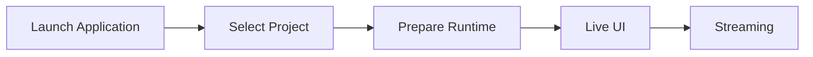

During normal streaming, there is no need to start Python or the Voice Lab environment.

---

### Pre-stream Setup

Avatar, Tracking, Voice, Stage, Streaming, etc. are configured.

Example:

```text
Avatar Import
Tracking Setup
Voice Setup
Stage Setup
Camera Setup
Audio Setup
Streaming Setup
Project Save
```

Each setup screen provides previews and tests where practical.

---

### Voice Lab

Used when creating a new voice model.

The basic flow is as follows.

```text
Generate
   ↓
Clone
   ↓
Dataset
   ↓
Train RVC
   ↓
Evaluate
   ↓
Register for Runtime
```

Only while Voice Lab is in use are external services / processes such as VoxCPM2, voice analysis, and RVC training started as needed.

---

### Developer / Diagnostics

In Developer Mode, the following can be checked:

- runtime state
- logging
- diagnostic camera
- tracking information
- audio information
- streaming information
- external service state

Normal users are not required to understand this internal structure.

---

---

# 2. Overall System Architecture

## 2.1 Overall Architecture

This system is built around a Unity application.

The main streaming runtime functions are placed inside Unity, and local external services / processes are used as needed for training, generation, analysis, etc.

The conceptual overall structure is shown below.

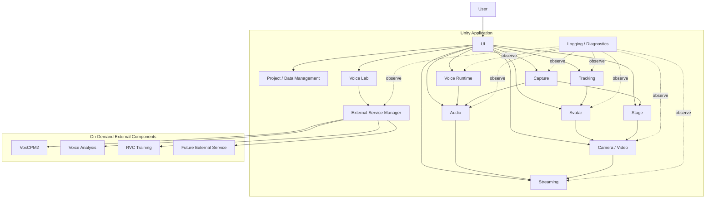

The arrows in the diagram mainly indicate

- control requests
- data transfer
- state references

and do not necessarily mean direct references between classes.

### Rationale

Placing Unity at the center of the application allows functions that cooperate during streaming, such as

- 3D rendering
- tracking
- audio
- UI
- streaming

to be handled on the same runtime.

At the same time, separating heavy setup processing such as training into external services avoids bringing unnecessary Python dependencies into the streaming runtime.

---

## 2.2 Division of Roles Between Unity and External Services

The responsibilities of Unity and external services are clearly separated.

### Unity Side

Mainly responsible for:

- application lifecycle
- UI
- project management
- avatar
- tracking
- runtime voice conversion
- audio mixing
- video input such as GameCapture / SubScreenCapture
- stage
- camera
- rendering
- streaming
- recording
- diagnostics
- external service lifecycle management

### External Service / Process Side

Mainly responsible for:

- voice generation
- voice clone
- voice analysis
- RVC training
- dataset processing
- model conversion
- other setup / analysis processing

### Basic Principle

Except for processing that can only be performed by an external service, the main streaming runtime does not depend on external services.

### Rationale

Separating the streaming runtime from the training environment limits the impact on normal streaming with registered assets even when

- Python environment failures
- external service failures
- dependency errors

occur.

---

## 2.3 Single-application UX with Internal Multi-service Structure

From the user's point of view, the system is a single application.

Internally, multiple processes such as

- the Unity runtime
- the VoxCPM2 service
- the voice analysis service
- the RVC training process

may exist.

However, normal users do not need to start or stop them individually.

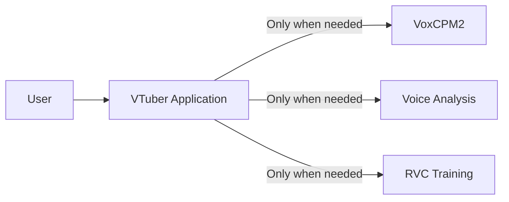

The normal UI does not display

- ports
- PIDs
- venv
- Python commands

and similar details.

For example, when voice generation is started, it is displayed as user-facing states such as

```text
Preparing the voice generation service
        ↓
Available
        ↓
Generating voice
```

### Rationale

Even if the internal structure is complex, the way the application is used does not have to be complex.

Maintaining a single-application UX reduces the user's burden of environment setup and operation.

---

## 2.4 Module Division Policy

The inside of the system is divided into modules by responsibility.

The main modules are assumed to be:

```text
Application
Project / Data
Avatar
Tracking
Voice
Audio
Capture
Stage
Video
Streaming
VoiceLab
ExternalServices
Diagnostics
UI
```

Each module manages the internal implementation required for its responsibility.

For example, the Avatar module internally has

- avatar loading
- avatar runtime
- skeleton
- pose
- expression
- extension motion

The Tracking module manages

- providers
- normalization
- filtering
- calibration

The Capture module manages

- capture sources
- the GameCapture adapter
- the SubScreenCapture adapter
- capture state
- passing capture textures / audio

### Module Division Principles

The basics are:

1. One module does not directly manage the internal implementation of multiple functions.
2. A module does not freely depend on the internal classes of other modules.
3. The externally exposed interface is limited.
4. Internal changes in a module do not propagate to other modules.
5. No giant global manager is created.

### Rationale

Consolidating everything into a single application manager or similar

- makes responsibilities unclear
- makes unit testing difficult
- widens the impact of changes
- makes it harder for Claude Code to determine the scope of a change

---

## 2.5 Inter-module Cooperation

Inter-module cooperation uses the following according to purpose:

- interface
- data contract
- command
- event
- service
- runtime state

Directly referencing concrete classes inside a module is not the default.

---

### Interface

Used as a stable boundary for using functions from other modules.

Examples:

```text
IAvatarLoader
ITrackingProvider
IVoiceConverter
IVideoCaptureSource
IAudioCaptureSource
IVideoEncoder
IStreamPublisher
```

### Data Contract

Used when passing data between modules.

Examples:

```text
TrackingFrame
AvatarPose
ExpressionSignal
CaptureSourceInfo
CaptureFrameInfo
FinalStreamAudio
```

### Command

Passes operation requests from user operations or external input to the runtime.

Examples:

```text
SwitchAvatarCommand
SwitchCameraCommand
PlaySeCommand
ToggleMuteCommand
```

### Event

Used when state changes and similar need to be notified to multiple modules.

Examples:

```text
ProjectChanged
AvatarChanged
StageChanged
StreamingStateChanged
```

### Runtime State

Used to expose the current state to the UI and diagnostics.

The UI does not directly reference internal variables of modules.

---

### Suppressing Direct Dependencies

For example, the UI does not directly call a concrete implementation, as in

```text
Button
  ↓
VrmAvatarLoader
```

Instead, it uses

```text
Button
  ↓
Command
  ↓
Avatar Module
  ↓
Internal implementation
```

### Rationale

This allows the same processing to be reused from different input sources such as the UI, external devices, and automation.

Reducing dependencies on concrete classes also limits the impact of internal implementation changes.

---

## 2.6 Common Data Formats and Abstraction Policy

Data used between modules avoids, as far as possible, directly using formats specific to a particular library or external OSS.

Data is converted into system-wide data contracts before use.

### Tracking

For example, MediaPipe-specific landmark information is not passed directly to the Avatar module.

```text
MediaPipe Data
      ↓
Tracking Provider
      ↓
TrackingFrame
      ↓
Avatar Module
```

### Avatar

VRM- or FBX-specific bone structures are not exposed to the Tracking module.

```text
VRM / FBX
   ↓
Skeleton Mapping
   ↓
Common Avatar Bone
```

### Expression

VRM expressions and FBX blend shapes are not handled directly on the face tracking side.

```text
Face Tracking
      ↓
Expression Signal
      ↓
Expression Mapping
      ↓
VRM / FBX
```

### Voice

RVC-specific processing is not exposed to the audio mixer, etc.

```text
Audio Input
    ↓
IVoiceConverter
    ↓
Converted Audio
    ↓
Audio Processing
```

### Capture

Concrete capture implementations such as GameCaptureUnityPlugin and DXGI Desktop Duplication are not exposed directly to the Stage or Video modules.

```text
Capture Board / DXGI Desktop Duplication
      ↓
Capture Adapter
      ↓
IVideoCaptureSource / IAudioCaptureSource
      ↓
Capture Texture / Capture Audio
      ↓
Stage / Audio Module
```

GameCapture is treated as a capture source that can provide both video and audio, and SubScreenCapture provides only video in the initial implementation.

A capture source is responsible only for acquiring video. Where on the stage the acquired video is displayed is the responsibility of the Stage module, and how the final video is streamed or recorded is the responsibility of the Video / Streaming modules.

### Streaming

Streaming-service-specific processing is not exposed to rendering.

```text
Render / Audio
      ↓
Encoder
      ↓
Encoded Stream
      ↓
IStreamPublisher
```

---

### Principles of Common Data Formats

Common data contracts are kept as independent as possible from specific technologies such as

- model format
- tracking library
- voice engine
- capture backend
- streaming service

They also include, as needed,

- timestamp
- confidence
- state
- version

### Rationale

If external library types are used directly at module boundaries, changing that library requires changing many modules.

Converting from specific technologies into a common representation once limits the scope of changes.

---

---

# 3. Development and Operations

## 3.1 Basic Development Policy

This system is developed on the assumption of long-term feature additions and publication as OSS.

Development continuously performs

- design
- implementation
- testing
- review
- documentation
- refactoring

The emphasis is not only on adding features but also on maintaining module boundaries and design rules.

Development agents such as Claude Code are also actively used.

### Basic Principles

1. Implement based on the system design.
2. Respect module responsibilities.
3. Minimize changes to external OSS.
4. Add tests together with the implementation.
5. Treat logging / diagnostics as part of feature implementation.
6. Update documentation when specifications change.
7. Consider performance regressions.
8. Include security / privacy in reviews.
9. Avoid concentration in giant classes or global singletons.
10. Delegate automatable work to development agents.

### Rationale

In a system with many functions, repeated ad hoc implementation tends to break the design.

Building implementation rules and design documents into the development process prevents quality from declining as features are added.

---

## 3.2 Development Automation with Claude Code

Claude Code is used as the main development agent for this system.

Claude Code is responsible not only for simple code generation but also for the following work:

- checking existing designs
- creating implementation plans
- code implementation
- refactoring
- unit tests
- integration tests
- build verification
- code review
- performance verification
- logging / diagnostics verification
- documentation updates
- UI design
- UI implementation
- visual review
- bug fixes

The conceptual development cycle is as follows.

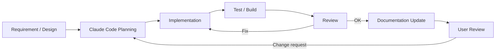

### Rationale

This system spans many technical domains, such as

- Unity
- C#
- Python
- external OSS
- voice models
- UI
- streaming

Sharing the design rules with a development agent and having it consistently carry out implementation, testing, review, and documentation makes development more efficient.

However, results generated by Claude Code are not adopted unconditionally.

The user also checks the architecture, major specifications, UI, perceived quality, and so on.

---

## 3.3 Repository Structure

The repository is structured so that functional responsibilities and the boundaries between the runtime and external services are easy to understand.

A conceptual example is shown below.

```text
virtual-vessel-studio/
├─ CLAUDE.md
├─ README.md
│
├─ docs/
│  ├─ ja/
│  │  ├─ architecture/
│  │  ├─ detailed-design/
│  │  ├─ development/
│  │  ├─ decisions/
│  │  └─ ui/
│  │     ├─ design-system.md
│  │     ├─ ui-guidelines.md
│  │     ├─ components.md
│  │     └─ screens/
│  │
│  └─ en/
│     └─ (same structure as ja)
│
├─ unity/
│  └─ VirtualVesselStudio/
│     ├─ Assets/
│     │  ├─ Application/
│     │  ├─ Project/
│     │  ├─ Avatar/
│     │  ├─ Tracking/
│     │  ├─ Voice/
│     │  ├─ Audio/
│     │  ├─ Capture/
│     │  ├─ Stage/
│     │  ├─ Video/
│     │  ├─ Streaming/
│     │  ├─ VoiceLab/
│     │  ├─ ExternalServices/
│     │  ├─ Diagnostics/
│     │  └─ UI/
│     ├─ Packages/
│     └─ ProjectSettings/
│
├─ native/
│
├─ services/
│  ├─ voxcpm/
│  ├─ voice-analysis/
│  └─ adapters/
│
├─ tests/
│  ├─ unit/
│  ├─ integration/
│  ├─ system/
│  └─ performance/
│
└─ tools/
```

The actual Unity project structure, etc. will be adjusted during implementation.

What matters is not the directories themselves but that responsibility boundaries can be understood from the repository structure.

---

### docs

Holds designs, specifications, rationale for decisions, etc.

The Japanese version is placed in `docs/ja/` and the English version in `docs/en/`, and the same document uses the same relative path.

### unity

Holds the main body of the Unity application.

The Unity project root is `unity/VirtualVesselStudio/`.

Responsibilities are separated by functional module.

### native

Holds project-owned native Windows code and native plugins.

### services

Holds project-managed wrappers, adapters, launchers, etc. for external services.

External OSS itself is not mixed with project-owned code.

### tests

Manages unit, integration, and system tests by purpose.

Product performance measurements such as RVC latency, capture performance, and long-run operation are placed under `tests/performance/`.

Historical benchmark / prototype implementations are reference snapshots outside the repository and are not copied into this repository.

### tools

Manages auxiliary tools for build, setup, conversion, development support, etc.

### Rationale

Bringing the repository structure close to the architecture structure makes it easier for developers and Claude Code to determine what to change.

---

## 3.4 CLAUDE.md

A `CLAUDE.md` is placed at the repository root to define common rules that Claude Code always follows during development.

`CLAUDE.md` describes at least the following.

### Architecture Rule

- the application is Unity-centered
- separate setup and runtime
- respect module boundaries
- use external OSS through adapters / wrappers
- other modules do not depend directly on a module's internal implementation

### Code Rule

- do not create giant managers
- do not create unnecessary singletons
- prefer interfaces / data contracts
- keep the public API to the necessary minimum
- add comments that explain the design intent of non-obvious processing

### External OSS Rule

- do not change external OSS itself as far as possible
- place required custom processing on the application side
- pin and manage versions
- if a custom patch is required, record the reason in the documentation

### Test Rule

- add the required tests for new features
- add regression tests for bug fixes where practical
- prefer module-level tests
- check for performance degradation in performance-critical processing

### Diagnostics Rule

- leave sufficient developer context on errors
- separate user notifications from developer logs
- do not output secrets to logs
- do not output excessive logs in high-frequency processing

### UI Rule

- follow the design system
- prefer existing components
- use Unity Localization
- check in Japanese / English
- do not specify fonts individually
- perform visual review with screenshots

### Documentation Rule

- update related documents when the architecture changes
- add new design patterns to the documentation when introduced
- do not leave mismatches between implementation and documentation

### Rationale

Explaining architecture rules to Claude Code in each individual prompt tends to cause missed instructions and inconsistent decisions.

Placing them in the repository as persistent development rules increases consistency when making changes.

---

## 3.5 Testing, Review, and Documentation Updates

The condition for completing a feature implementation is not only that the code works.

As a rule, one development cycle runs through

```text
Implementation
      ↓
Build
      ↓
Test
      ↓
Review
      ↓
Documentation
      ↓
User confirmation
```

---

### Unit Test

Verifies individual classes and algorithms.

Examples:

- data conversion
- profile validation
- mapping
- state transitions
- commands

---

### Integration Test

Verifies cooperation between modules.

Examples:

```text
Tracking → Avatar
Voice → Audio
GameCapture → Capture / Audio
SubScreenCapture → Capture / Stage
Audio → Streaming
Project → Runtime
Voice Lab → External Service
```

---

### System Test

Verifies the Unity application as a whole.

Examples:

- application startup
- project load
- avatar display
- tracking
- voice conversion
- stage
- streaming
- recording

---

### Performance Test

For real-time processing, performance is also verified as needed.

Examples:

- RVC latency
- tracking processing time
- frame time
- encoding time

---

### Review

Self review by Claude Code checks at least the following:

- architecture compliance
- module boundaries
- code quality
- error handling
- diagnostics
- security
- privacy
- performance
- test coverage
- documentation

---

### UI Review

For the UI, the actual screens are checked with screenshots, etc., and Claude Code itself also reviews

- spacing
- alignment
- visual hierarchy
- Japanese
- English
- fonts
- design system compliance

and so on.

Ultimately, the user also checks the UI.

---

### Documentation Updates

When any of the following changes, related documents are also updated.

- interfaces
- data formats
- directory structure
- setup approach
- UI
- external components
- project format
- architecture

### Rationale

If only the implementation is updated and the documentation becomes stale, later developers and Claude Code may make changes based on incorrect assumptions.

Documentation is also treated as a component of the system.

---

## 3.6 Development Policy as OSS

This system assumes a structure that can be published as OSS.

Therefore, states that only a specific development environment or developer can understand are avoided as far as possible.

---

### Making External Dependencies Explicit

For the external libraries, OSS, and tools used,

- name
- version
- license
- purpose of use

can be identified.

---

### Separation from External OSS

External OSS itself, such as RVC and VoxCPM2, is clearly separated from this system's own implementation.

Project-specific functions are, as a rule, implemented as

- adapters
- wrappers
- launchers
- application-side processing

### Rationale

Heavily modifying external OSS directly makes it difficult to follow upstream versions.

---

### Reproducible Development and Distribution Environments

For external components that use Python, the **development environment** and the **distribution environment for normal users** are managed separately.

In the development environment, for each component,

- external OSS version / commit
- Python version
- dependency definition / lock
- venv
- build procedure
- test procedure

are made explicit, and excessive dependence on each developer's global Python environment is avoided.

For normal users, a portable runtime package or standalone executable generated from the development environment by the build pipeline is provided, in which

- runtime package version
- Python runtime version
- dependency versions
- external OSS version / commit
- adapter version
- build ID
- package hash

and so on can be identified.

Normal users are not required to install or operate Python itself, venv, pip, etc.

venv is mainly an environment for development, testing, and builds, and is kept separate from how the distribution for normal users runs.

Docker is also not a required dependency of the standard development and distribution approach.

---

### Investigability of Issues

To respond to failure reports from users,

- application version
- external component versions
- logs
- diagnostics
- environment

and so on can be checked.

A diagnostics export that does not contain secrets can be provided.

---

### Structure Easy for Contributors to Understand

The goal is that, within the repository, one can check

- architecture
- module responsibilities
- setup
- build
- test
- coding rules
- external dependencies

---

### Preventing Secrets from Entering the Repository

The following are not committed to the repository.

- stream keys
- OAuth tokens
- passwords
- API keys
- personal credentials

The application runtime also does not store secrets in normal configuration files or logs.

---

### Patch Management

If a custom patch to external OSS becomes necessary,

- the patch content
- the reason for the patch
- the target version
- the difference from upstream
- whether it can be removed in the future

are recorded in the documentation.

### Rationale

This makes it possible to determine, when updating external OSS in the future, whether the custom changes are still needed.

---

### Recording Development Decisions

For important architecture changes, design decisions are recorded as needed in

```text
docs/<lang>/decisions/
```

or similar.

Examples:

- why RVC runs in the Unity runtime
- why the streaming runtime does not depend on Python
- why external OSS is not modified
- why UI Toolkit was adopted

### Rationale

Over time, "why this structure exists" tends to be lost.

Recording not only the final structure but also the main reasons for decisions makes future change decisions easier.

---

### Basic Principles of OSS Development

This system adopts the following basic principles for development as OSS.

1. Document the architecture and module responsibilities.
2. Clearly separate external OSS from project-owned implementation.
3. Minimize direct modification of external OSS.
4. Manage the versions of external dependencies.
5. Reduce dependence on global development environments.
6. Maintain a testable module structure.
7. Provide sufficient logging / diagnostics.
8. Do not include secrets in the repository, logs, or diagnostics.
9. Update documentation when the architecture changes.
10. Make changes by Claude Code follow the same development rules.
11. Besides automated review by Claude Code, have the user check the results as needed.
12. Maintain a structure that future contributors can understand and change.


---

---

# 4. External Service Management

## 4.1 Basic Policy

This system uses local services or external processes implemented in Python, etc. for some processing that the Unity application does not perform by itself.

The following are assumed as examples:

- VoxCPM2
- voice analysis
- RVC training
- audio analysis processing
- model conversion processing
- other external tools added in the future

However, normal users are not made aware of

- installing Python
- starting Python
- creating / activating a venv
- installing dependency packages with pip, etc.
- typing commands
- port numbers
- process IDs
- the directory structure of external OSS

and similar matters.

Components that use Python are, as a rule, distributed to normal users as built portable runtime packages or standalone executables.

When the Unity application requests a required operation, it checks the installed runtime package and automatically prepares and starts the required external service or external process so that it can be used.

Developers can run and test each component directly from a native Python + venv environment using the same source and dependency definition / lock.

External services that are not needed by the streaming runtime are not kept running at all times.

### Rationale

This system aims to behave as a single application from the user's point of view.

Even if Python and external OSS are used internally, exposing that structure to users

- complicates startup procedures
- requires knowledge of Python environments
- causes forgotten startups or wrong startup order
- requires port and process management

and greatly increases the burden of use.

Therefore, the lifecycle of external services is managed by the application.

---

## 4.2 Classification of External Processing

External processing is broadly classified into the following two types.

### Managed Local Service

A local service that stays running for a certain period and accepts multiple requests from Unity.

Examples:

- VoxCPM2 service
- voice analysis service
- analysis services added in the future

Mainly uses local IPC such as HTTP.

### Managed External Process

An external process started to perform specific processing and terminated after the processing completes.

Examples:

- RVC training
- dataset preprocessing
- model conversion
- setup scripts
- other batch processing

### Rationale

Long-running services and processes that finish after a single job have different lifecycles.

Instead of forcing both into the same approach,

- service lifecycle
- process execution

are handled separately.

---

## 4.3 Separation from the Streaming Runtime

Python local services are not required for the normal streaming runtime.

During normal streaming, only functions needed on the Unity runtime, such as

- avatar
- tracking
- RVC runtime
- audio
- stage
- camera
- streaming

are used.

In particular, real-time voice conversion with RVC runs in the Unity-side runtime and does not depend on a Python service.

On the other hand, the required services or processes are started only when using

- Voice Lab
- RVC training
- voice clone
- voice analysis
- external OSS setup

and so on.

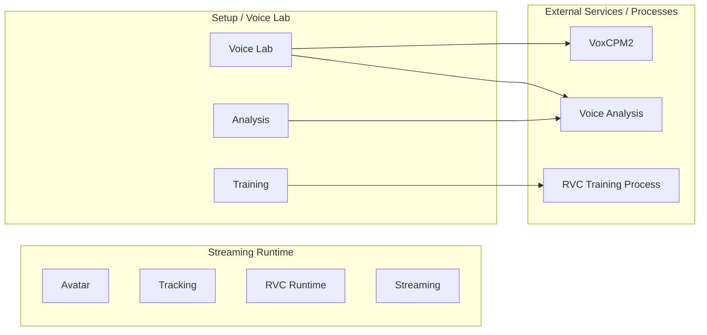

### Rationale

This allows normal streaming with already registered models to continue even if problems occur in Voice Lab or the training environment.

---

## 4.4 External Service Manager

An `External Service Manager` is provided as a common function that manages the lifecycle of external services.

The External Service Manager is mainly responsible for:

- managing service registration information
- requesting startup of required services
- detecting already-running services
- reusing services
- checking ports
- starting processes
- health checks
- waiting for readiness
- managing service state
- stopping services
- detecting failures

Feature modules do not start Python processes directly.

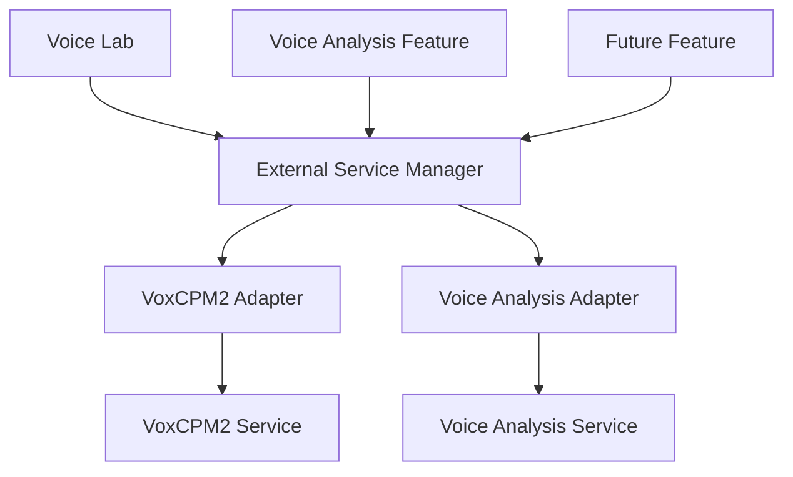

### Rationale

If each module individually implements

- process startup
- port checks
- health checks
- shutdown

the same processing is duplicated and different lifecycle management approaches are mixed.

Consolidating them into a common manager unifies the service management approach.

---

## 4.5 Service Adapter Approach

The External Service Manager is structured so that it does not need to know too much about each external service's specific API or internal specifications.

Service-specific processing is separated into adapters.

Conceptually, the following interface is assumed.

```text
IExternalServiceAdapter

- GetServiceInfo()
- StartAsync()
- CheckHealthAsync()
- StopAsync()
- GetStatusAsync()
```

Concrete implementations such as

- VoxCpmServiceAdapter
- VoiceAnalysisServiceAdapter
- FutureServiceAdapter

are provided.

### Rationale

Each external service differs in

- how it is started
- health checks
- API specifications
- how its version is obtained
- how it is shut down

and so on.

If these are written directly into the External Service Manager, the manager has to be modified every time a service is added.

Confining service-specific processing to adapters limits the impact of adding external services.

---

## 4.6 Service Descriptor

For each external service, the information needed for management is held as a service descriptor.

The assumed information is as follows.

| Item | Content |
|---|---|
| ServiceId | Service identifier |
| DisplayName | Display name |
| ComponentId | Corresponding external component |
| SupportedVersion | Supported version |
| AdapterVersion | Adapter version |
| Executable | Startup target |
| WorkingDirectory | Working directory |
| DefaultPort | Default port |
| HealthEndpoint | Health check target |
| InfoEndpoint | Service information endpoint |
| StartupTimeout | Maximum startup wait |
| ShutdownPolicy | Shutdown method |

The concrete storage format is decided in the detailed design.

### Rationale

If service information is scattered throughout C# code, changes to versions or startup methods require modifying many places.

Holding service management information as a clear unit makes management and diagnostics easier.

---

## 4.7 Service Lifecycle

A managed local service conceptually has the following states.

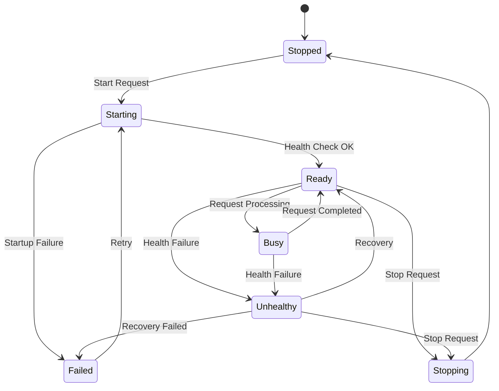

The UI displays these internal states in a simplified form as needed.

### Rationale

Simple running / stopped states cannot distinguish

- the process is starting
- the API is being prepared
- processing is in progress
- the process exists but does not respond

and so on.

Making the service lifecycle explicit makes state management and failure diagnosis easier.

---

## 4.8 Service Startup Flow

When a startup request is received from a function that requires a service, processing conceptually proceeds in the following order.

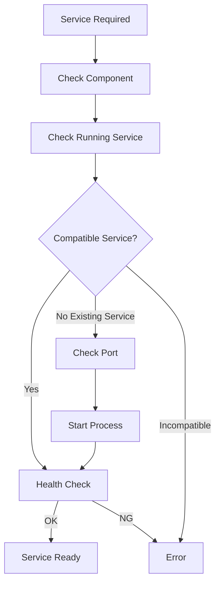

The main steps are:

1. Check whether the required external component is available.
2. Check whether the target service is already running.
3. Check whether an already-running service is compatible.
4. Check whether the required port is available.
5. Start the service process.
6. Repeat health checks.
7. Confirm that the service has reached the Ready state.
8. Return the available state to the caller.

### Rationale

If a request is sent immediately after the process starts, model loading, etc. inside the service may not have completed.

Instead of simply starting the process, startup is confirmed until the service can actually process requests.

---

## 4.9 Reusing Already-running Services

If the target service is already running, a new process is not started immediately.

First,

- service identity
- version
- API compatibility
- health
- target port

and so on are checked.

If the service is compatible, it can be reused.

### Rationale

Starting multiple instances of the same service causes

- port conflicts
- duplicate GPU memory usage
- duplicate model loading
- unnecessary memory consumption

and so on.

Safely reusing existing services reduces resource consumption.

---

## 4.10 Service Identity Verification

The target service is not judged to be running merely because the port is in use.

Where possible, the service is queried to check

- ServiceId
- version
- API version
- health

and so on.

For example, endpoints such as

```text
/health
/info
```

are used through the service adapter.

### Rationale

Another application may be using the target port.

Judging "port is open = target service exists" risks sending requests to the wrong service.

---

## 4.11 Port Management

A default port can be assigned to each service.

The current configuration uses, for example:

| Service | Default port |
|---|---:|
| VoxCPM2 Reference Service | 8765 |
| Voice Analysis Service | 8766 |

However, normal users are not normally expected to configure port numbers directly.

Port numbers are managed as service descriptors or application settings.

### Rationale

Port numbers are necessary for the internal implementation but are not meaningful settings for normal users.

They are managed as internal structure and can be checked from developer diagnostics only when needed.

---

## 4.12 Port Conflicts

If the intended port is used by another process, it is checked whether that process is a compatible service.

If it is not a compatible service, the application does not terminate the process or operate on the other application without permission.

Normal users are shown, for example:

> The voice generation service could not be started.  
> A required communication port is being used by another application.

Developer diagnostics record

- ServiceId
- port
- target process information
- health check results
- service identity determination

and so on.

### Rationale

Terminating unrelated processes to resolve a port conflict may affect other applications.

The application errs on the safe side and notifies the user of the conflict.

---

## 4.13 Process Ownership

The External Service Manager distinguishes between

**processes it started itself**

and

**processes that were already running and were reused**

When starting a process, it records as needed

- PID
- application session
- ServiceId
- start time

and so on.

### Rationale

When an existing service is reused, that process may have been started by another application or another session.

Such a service must not be stopped without permission when this application exits.

---

## 4.14 Service Shutdown

Services started by the application can be stopped when their use ends or when the application exits.

When stopping, where possible, the following order is used:

1. graceful shutdown request
2. wait for process exit
3. forced termination if necessary

However, when an already-running service was merely reused, it is, as a rule, not stopped.

### Rationale

This avoids affecting processes this system does not own.

Also, using forced termination from the start may corrupt data that the service is saving.

---

## 4.15 On-demand Startup

External services are not all started when the application starts.

They are started when needed.

Examples:

- using the voice clone screen → start VoxCPM2
- starting voice analysis → start voice analysis
- starting RVC training → start the training process

### Rationale

Keeping everything running at all times leads to

- longer startup time
- memory consumption
- GPU memory consumption
- an increase in unnecessary processes

In particular, many services are not used during normal streaming, so they are started only when needed.

---

## 4.16 Delayed Service Shutdown

Instead of always terminating a service immediately after use ends, an approach that keeps it reusable for a certain period is also permitted as needed.

For example, in Voice Lab, when repeating

- voice generation
- preview listening
- regeneration
- generation with a different prompt

VoxCPM2 is not restarted each time.

The concrete shutdown timing is decided in the detailed design, considering the characteristics of each service.

### Rationale

For services whose model loading takes time, starting and stopping each time greatly reduces usability.

On-demand startup and reuse are combined.

---

## 4.17 External Process Execution

Temporary processing such as RVC training is executed as a managed external process.

Process execution manages at least the following:

- process ID
- command
- working directory
- environment
- start time
- end time
- exit code
- stdout
- stderr
- cancellation state

External processes are not started directly from the UI but through the adapter or manager of the relevant function.

### Rationale

External process execution also needs to be state-managed as part of the application's processing.

Simply starting a process does not allow the application to track progress or reasons for failure.

---

## 4.18 Python Execution Environment

External services / processes that use Python are started by explicitly specifying the execution environment managed as described in Chapter 13.

They do not depend on the OS global Python or the environment currently activated in the shell.

In the distribution environment for normal users, the launcher / executable indicated by the runtime package's `manifest.json` is started (see 13.6 and 13.7).

```text
External/<Component>/<RuntimePackageVersion>/manifest.json
        ↓
Launcher / Executable
```

In the development environment, the Python of the per-component, per-version development venv can be explicitly specified for startup.

```text
<ExternalComponent>/<Version>/.venv/Scripts/python.exe
```

In both cases, the path and version of the execution environment used for startup can be checked from diagnostics.

### Rationale

Depending on the global Python causes

- Python version
- package versions
- CUDA support
- dependencies

to vary by user environment, and reproducibility is lost.

The environment managed by the application is used explicitly.

---

## 4.19 Separation of Responsibilities from External Component Management

The External Service Manager is basically responsible for **the execution lifecycle of installed components**.

The following are the responsibilities of external component management in Chapter 13:

- external OSS / source version management
- dependency definition / lock management
- developer venv setup procedures
- runtime package build information management
- obtaining runtime packages
- package hash / integrity verification
- extracting and registering runtime packages
- update
- rollback
- capability / dependency verification

Setup for normal users does not, as a rule, build a venv from source but installs a built runtime package.

If the External Service Manager cannot find a component, it guides processing to the setup function.

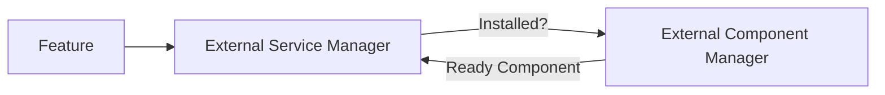

### Rationale

Separating "the responsibility to build the environment" from "the responsibility to start the built environment" simplifies management.

---

## 4.20 Version Compatibility

Before using an external service, it is checked whether the version is supported by this application and the adapter.

At least the compatibility of

- external component version
- API version
- adapter version

and so on can be checked.

If an unsupported version is detected, it is not used unconditionally.

### Rationale

Even if a process starts normally, it may not work correctly if the API specification or output format has changed.

"Being able to start" and "being compatible" are separated.

---

## 4.21 Service Health Check

A health check mechanism is provided for managed local services.

Health checks verify the following as needed:

- process existence
- API response
- service identity
- service version
- internal initialization state
- load state of required models

Health check results are converted into common states such as

- Ready
- Busy
- Unhealthy
- Failed

### Rationale

Even if a process exists, it may be unable to process requests due to

- model load failure
- GPU initialization failure
- dependency errors

and so on.

Therefore, not only process existence but also availability as a service is verified.

---

## 4.22 Startup Timeout

A timeout is set for service startup processing.

For services whose model loading, etc. takes time, an appropriate startup timeout can be set per service.

When a timeout occurs,

- process state
- health check results
- stdout
- stderr

and so on are recorded in the diagnostic information.

### Rationale

This prevents the Unity side from waiting indefinitely when an external service does not respond.

---

## 4.23 Detecting Abnormal Termination

If an external service / process started by the application terminates unexpectedly, that state is detected.

For example, the following are recorded:

- process ID
- exit time
- exit code
- last stdout
- last stderr
- the processing that was in progress

### Rationale

If an external process terminates abnormally, simply treating it as a communication error on the Unity side makes the cause hard to identify.

The process lifecycle and communication state are managed in association.

---

## 4.24 Automatic Recovery

For temporary failures, restart can be attempted for services that support automatic recovery.

However,

- unlimited restarts
- repeated restarts in a short time

are not performed.

The retry count and conditions are managed per service.

For external processes whose results are affected by restarting, such as training, automatic re-execution is, as a rule, not performed.

### Rationale

Service-type processing may automatically recover from temporary failures, while re-executing training, etc. without permission may cause duplicate processing or artifact inconsistencies.

The recovery policy is separated according to the processing characteristics.

---

## 4.25 Concurrent Request Control

External services do not necessarily support processing multiple requests concurrently.

For each service, execution characteristics such as

- Concurrent
- Serialized
- Single Job

can be defined.

The application manages a request queue as needed.

### Rationale

In particular, for services that use GPU models, running multiple jobs simultaneously may cause

- insufficient GPU memory
- reduced processing speed
- service crashes

and so on.

The degree of parallelism is controlled according to the service's capability.

---

## 4.26 Request Cancellation

For long-running requests, cancellation can be handled if the target service supports it.

For external processing that cannot be cancelled, this is made clear in the UI.

Treating forced process termination as cancellation is decided case by case, considering the possibility of data corruption.

### Rationale

Even if the Unity side receives a cancellation request, the external service cannot necessarily stop safely.

The meaning of cancellation is made clear per service.

---

## 4.27 Not Exposing Internal Structure to the UI

The normal UI, as a rule, does not display

- port numbers
- PIDs
- runtime package paths / developer venv paths
- Python commands
- health endpoints

and so on.

The normal UI converts these into user-facing states such as

- preparing
- available
- processing
- setup required
- error

Developer Mode can display detailed information.

### Rationale

What normal users need is not the internal service structure but "whether the function can be used."

Internal information is separated into the developer diagnostics defined in Chapter 5.

---

## 4.28 Service Setup Guidance

If a required external component has not been set up, normal users are not required to operate Python or Git manually.

For example,

> Initial setup is required for the voice generation function.

is displayed, and environment setup can be started from the setup UI.

### Rationale

Emphasis is placed on being able to start using a function without understanding internal dependencies.

---

## 4.29 Security

Managed local services, as a rule, listen only on localhost.

Being accessible from external networks is not the default.

Necessary validation is also performed on paths, parameters, etc. passed to external services.

### Rationale

There is normally no need to expose services for Voice Lab, etc. to external networks.

The attack surface is not increased unnecessarily.

---

## 4.30 Secrets

If secrets need to be passed to an external service / process, approaches that do not output them in plain text on the command line or in logs are preferred.

Secrets follow the credential management approach defined in Chapter 6.

Developer logs defined in Chapter 5 also do not record secrets.

### Rationale

Process commands and logs may be shared externally for failure investigation, etc.

---

## 4.31 Integration with Logging and Diagnostics

The External Service Manager and external process management functions use the common logging / diagnostics approach defined in Chapter 5.

The main diagnostic information handled is:

- ServiceId
- component version
- adapter version
- Python version
- venv
- process ID
- port
- process state
- service health
- start / stop time
- exit code
- stdout
- stderr
- health check results
- exception

The display for normal users shows only the necessary information concisely.

### Rationale

For external process failures, information inside Unity alone cannot identify the cause, so the external environment is also made observable.

---

## 4.32 Processing at Application Exit

When the application exits, the external services owned by this application session are stopped.

Services that were merely reused are, as a rule, not stopped.

If an external process is in progress, depending on the nature of the process, one of

- wait for normal completion
- cancel
- ask for exit confirmation

and so on is chosen.

### Rationale

The purpose is to avoid stopping unrelated processes when the application exits and to prevent corruption of data being processed.

---

## 4.33 Services After Abnormal Application Termination

If the application terminates abnormally, external services alone may remain.

At the next startup,

- target port
- service identity
- health
- version

and so on are checked, and the service can be reused if it is compatible.

However, a reused service is not automatically considered owned by the current session.

### Rationale

There is no need to forcibly terminate healthy services left after an abnormal termination every time.

On the other hand, misidentifying ownership may cause another session's process to be terminated, so ownership is separated in the lifecycle.

---

## 4.34 Adding External Services

When adding a new external service, the following are added as a rule:

1. external component definition
2. service descriptor
3. service adapter
4. health check
5. version compatibility definition
6. setup information
7. diagnostics information

The goal is a structure in which services can be added without changing the main logic of the existing External Service Manager.

### Rationale

Changing the common lifecycle processing every time an external service is added tends to cause regressions in existing services.

---

## 4.35 Separation of Setup and Runtime Responsibilities

Setup and runtime are also separated for external-service-related processing.

### Setup

Setup for normal users mainly performs:

- checking the external component manifest
- version selection
- obtaining built runtime packages
- package hash / integrity verification
- extracting and registering runtime packages
- obtaining required models / assets
- capability / environment verification
- service startup test
- health check test

Separately, the developer environment allows running and testing directly from source using native Python + venv.

### Runtime / When Using Voice Lab

- detecting required services
- startup
- reusing already-running services
- health checks
- requests
- state monitoring
- stopping as needed

### Rationale

Running environment setup processing during normal use complicates the processing needed before a function can start.

Environment setup and actual service use are separated.

---

## 4.36 Internal Division of Responsibilities

Conceptually, the following structure is assumed.

```text
ExternalServices/
├─ Core/
│  ├─ ServiceDescriptor
│  ├─ ServiceState
│  ├─ ServiceInstance
│  └─ ServiceId
│
├─ Management/
│  ├─ ExternalServiceManager
│  ├─ ServiceRegistry
│  ├─ ServiceLifecycleManager
│  └─ ServiceRequestCoordinator
│
├─ Process/
│  ├─ ExternalProcessRunner
│  ├─ ProcessOwnership
│  └─ ProcessResult
│
├─ Network/
│  ├─ PortChecker
│  └─ ServiceIdentityChecker
│
├─ Health/
│  ├─ HealthChecker
│  └─ ServiceHealth
│
├─ Adapters/
│  ├─ VoxCpmServiceAdapter
│  ├─ VoiceAnalysisServiceAdapter
│  └─ FutureServiceAdapter
│
└─ Diagnostics/
   └─ ExternalServiceDiagnostics
```

External OSS source, venv, versions, updates, etc. are separated into the external component management function in Chapter 13.

### Rationale

Concentrating process startup, port management, health checks, service-specific APIs, version management, etc. in one giant manager makes responsibilities unclear.

Separating the common lifecycle from service-specific processing ensures maintainability.

---

## 4.37 Basic Principles of External Service Management

This system adopts the following basic principles for external service management.

1. Do not make normal users aware of internal structures such as Python and ports.
2. The streaming runtime does not depend on Python local services.
3. External services are started on demand only when needed.
4. Distinguish services from temporary external processes.
5. Service lifecycles are managed in common by the External Service Manager.
6. Service-specific processing is separated into adapters.
7. Startup includes completing health checks, not just starting the process.
8. Reuse already-running services if they are compatible.
9. Do not judge a service to be the target merely because its port is in use.
10. Verify service identity and version.
11. As a rule, do not expose port numbers to normal users.
12. Do not terminate other applications without permission on port conflicts.
13. Distinguish processes started by the application from reused processes.
14. Do not stop processes that are not owned without permission.
15. Run Python by explicitly specifying the execution environment managed by the application (the runtime package in distribution, the development venv in development).
16. Separate obtaining / updating external components from the service lifecycle.
17. Verify compatibility between service versions and adapter versions.
18. Distinguish process existence from service health.
19. Set a timeout for service startup.
20. Obtain stdout / stderr / exit codes of external processes.
21. Separate recovery approaches for service-type processing and batch processing.
22. Control the number of concurrent requests according to service capability.
23. Managed local services are, as a rule, exposed only on localhost.
24. Do not carelessly output secrets to commands or logs.
25. Detailed information about external services can be checked from developer diagnostics.
26. New services are added basically by adding a descriptor and an adapter.
27. Separate setup from the actual service usage lifecycle.


---

---

# 5. Logging and Diagnostics

## 5.1 Basic Policy

This system separates state display and error notification for normal users from detailed logs and diagnostic information for developers.

The basic policy is:

**Do not make normal users aware of the internal structure, while allowing developers to sufficiently observe internal state.**

For normal users, the display focuses on

- what is currently happening
- which functions are affected
- what to check or do

For developers, on the other hand,

- module
- processing stage
- configuration values
- version
- timing
- process
- external component
- exception
- stack trace

and so on are recorded in detail.

### Rationale

Showing general users internal information such as

```text
NullReferenceException
CUDA error
HTTP 500
Port 8765 bind failed
```

as-is rarely helps solve the problem.

On the other hand, when developing and maintaining the system as OSS, information such as "it failed" alone cannot identify the cause.

Therefore, user-facing information and developer-facing information are treated as separate responsibilities.

---

## 5.2 Separating Logs from User Notifications

For a single internal event, the system can generate

- a user notification
- a developer log

separately.

Conceptually:

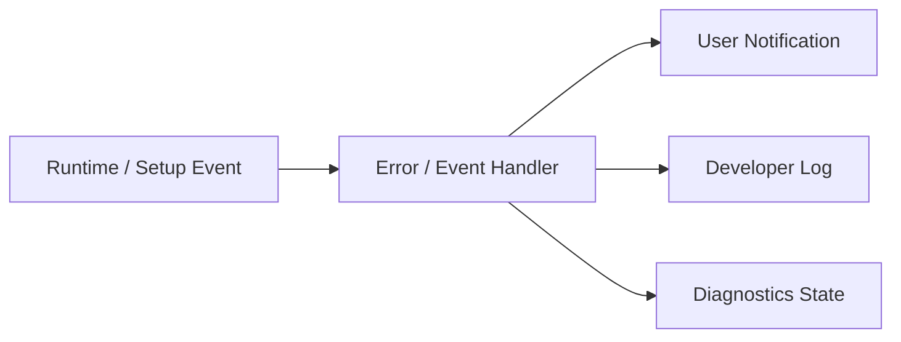

For example, if microphone initialization fails, the normal UI shows

> The microphone could not be used.  
> Check that the selected input device is connected.

and so on.

For developers, on the other hand,

- device name
- device ID
- sample rate
- buffer size
- audio backend
- exception
- stack trace

and so on are recorded.

### Rationale

If the internal log structure is reused as-is in the UI, changes to the internal implementation tend to change the user-facing display as well.

Separating notifications from logs allows each to be designed in a form suited to its purpose.

---

## 5.3 Log Levels

Logs have at least the following levels.

| Level | Purpose |
|---|---|
| Trace | Very detailed processing traces |
| Debug | Internal state needed for development / debugging |
| Information | Records of normal major processing |
| Warning | Processing can continue but attention is needed |
| Error | A specific operation or function has failed |
| Critical | A serious impact on the entire application |

In normal operation, unnecessary trace / debug logs are not output in large volumes.

The level of detail can be changed as needed through Developer Mode or diagnostic settings.

### Rationale

Always recording all internal information causes

- increased log size
- increased file I/O
- important information being buried

and so on.

On the other hand, detailed logs are needed when reproducing failures, so the log level can be switched.

---

## 5.4 Structured Logging

For major logs, structured information is attached where practical, rather than only simple free text.

Conceptual example:

```text
Timestamp
Level
Module
Category
EventId
SessionId
ProjectId
AvatarId
RunId
Message
Properties
Exception
```

This does not mean that every field is required; the necessary context is attached according to the processing.

For example, Voice Lab training processing can record

```text
Module      = VoiceLab
Category    = RvcTraining
RunId       = ...
DatasetId   = ...
RvcVersion  = ...
State       = Training
```

and so on.

### Rationale

With free-text-only logs, it is hard to search later for logs of a specific run, avatar, project, etc.

Attaching context information makes it easier to identify the scope of a failure.

---

## 5.5 Per-module Logs

Each major module uses the common logging mechanism while attaching a module name or category.

Examples:

- Application
- Project
- Avatar
- Tracking
- Voice
- Audio
- Capture
- Video
- Streaming
- Stage
- VoiceLab
- ExternalComponent
- UI
- Diagnostics

Conceptual example:

```text
[Information][Avatar] Avatar loaded.
[Warning][Tracking] Tracking confidence dropped.
[Error][Streaming] Connection failed.
```

### Rationale

In a system where multiple functions run simultaneously, it is hard to tell from the time sequence alone which function a log belongs to.

Classifying by module allows narrowing down to only the target function.

---

## 5.6 Session Identification

Sessions can be identified per application launch as needed.

For example, a SessionId is generated so that

- application start
- project load
- runtime start
- streaming start
- application exit

and so on can be tracked as the same session.

### Rationale

If logs from multiple launches exist in the same file, it may become unclear during which launch a problem occurred.

Identifying sessions makes time-series analysis easier.

---

## 5.7 Correlation per Operation

Long-running operations and operations spanning multiple components can be tracked using a common ID as needed.

Examples:

- project load
- avatar import
- voice model registration
- training run
- external component setup
- streaming session

For example, a training run uses the `RunId` defined in Chapter 13 directly as the diagnostic context.

### Rationale

Even when one operation passes through multiple layers such as

```text
UI
 ↓
Manager
 ↓
Adapter
 ↓
Python Process
 ↓
Artifact Collection
```

its logs can be tracked as the same operation.

---

## 5.8 Log Output Location

Logs are saved in the Logs area within the Data Root defined in Chapter 6 or the application-managed area.

Conceptual example:

```text
DataRoot/
└─ Logs/
   ├─ Application/
   ├─ VoiceLab/
   ├─ ExternalServices/
   └─ Diagnostics/
```

The actual layout is aligned with the overall Data Root structure.

Normal runtime logs and logs belonging to a specific training run, etc. are separated as needed.

For example, logs specific to a training run can be kept in

```text
VoiceLab/
└─ TrainingRuns/
   └─ <RunId>/
      └─ logs/
```

### Rationale

Consolidating all logs into one huge file makes investigation per function or per operation difficult.

Storage locations are separated by purpose.

---

## 5.9 External Process Logs

For external processes such as Python services and external OSS,

- stdout
- stderr
- process start
- process exit
- exit code

can be obtained and saved.

Examples:

- RVC
- VoxCPM2
- voice analysis
- other future external components

stdout / stderr are not shown directly in the normal user UI.

They can be checked from developer diagnostics as needed.

### Rationale

Failures that occur inside an external process may not be identifiable from Unity-side exceptions alone.

Keeping the standard output and standard error of external processes makes problems in external OSS investigable as well.

---

## 5.10 External Process Startup Information

When an external process starts, the following are recorded as needed:

- component name
- component version
- source version / commit
- adapter version
- execution mode (portable runtime / developer venv)
- runtime package version / build ID
- Python version
- runtime package path / venv path
- process ID
- start time
- port
- working directory
- command
- health check results

However, if secrets are included in the command line, they are masked.

### Rationale

For external OSS failures, "which version and which Python environment it ran in" is important for investigating the cause.

---

## 5.11 Service State Diagnostics

For external services, it can be checked not only whether the process exists but also whether the service is in a usable state.

Example states:

```text
Not Installed
Stopped
Starting
Ready
Busy
Unhealthy
Failed
```

If a health check API exists, its results are used.

### Rationale

Even if a process is running, it may not actually be able to process requests due to initialization failure, etc.

Process state and service health are handled separately.

---

## 5.12 Runtime Diagnostic Information

Developer diagnostics can show the state of the main runtime modules.

Examples:

### Avatar

- AvatarId
- model format
- loaded state
- missing bones
- missing expressions
- extension motion state

### Tracking

- provider
- tracking state
- tracking FPS
- confidence
- lost parts
- filtering state

### Voice

- input device
- sample rate
- buffer size
- voice model
- backend
- voice conversion state
- latency
- underrun / overrun

### Capture

- capture source type
- capture device / monitor
- capture state
- input resolution
- input frame rate
- capture frame time
- dropped / missed frames
- GameCapture audio state
- SubScreenCapture backend
- native plugin / adapter state

### Video

- render resolution
- target FPS
- actual FPS
- frame time
- encoder
- encode time
- dropped frames

### Streaming

- connection state
- bitrate
- reconnect state
- queue
- A/V offset

### Audio

- output device
- mixer state
- peak
- clipping
- routing

### Rationale

In real-time systems, problems do not necessarily appear as exceptions.

Making internal state observable makes it easier to identify performance degradation and temporary abnormal states.

---

## 5.13 Performance Diagnostics

For performance information, the following can be measured as needed:

- main thread frame time
- render frame time
- tracking processing time
- voice processing time
- RVC inference time
- pitch estimation time
- video encoding time
- memory usage
- GPU memory usage
- CPU usage
- GPU usage

Not only simple averages but also, as needed,

- current value
- average
- maximum
- drop count

and so on are handled.

### Rationale

Even if the average processing time is normal, temporary spikes may cause audio dropouts or frame drops.

Therefore, the structure allows momentary performance anomalies to be diagnosed as well.

---

## 5.14 Audio Pipeline Diagnostics

For voice conversion, processing time can be checked per pipeline stage defined in Chapter 9.

Example:

```text
Audio Input
   ↓
Input Buffer
   ↓
Feature Extraction
   ↓
Pitch Estimation
   ↓
RVC Inference
   ↓
Post Processing
   ↓
Audio Output
```

The processing time of each stage is recorded as needed.

### Rationale

End-to-end latency alone cannot show which processing is the bottleneck.

Making timing obtainable per processing stage makes it easier to identify where to improve performance.

---

## 5.15 Streaming Diagnostics

For streaming, the following can be checked as needed:

- publisher state
- connection state
- reconnect count
- encoder state
- actual bitrate
- dropped frames
- encoding queue
- network errors
- A/V offset
- stream start time

### Rationale

Streaming failures can be caused in multiple places, such as

- rendering
- encoder
- network
- the streaming service

The state of each stage is made separately observable.

---

## 5.16 Developer Mode

The Developer Mode defined in Chapter 14 is used to display diagnostic functions that are not needed in normal use.

In Developer Mode, for example, the following can be used:

- detailed log viewer
- runtime state viewer
- performance metrics
- diagnostic camera
- tracking visualization
- external service state
- version information
- developer actions

Even with Developer Mode off, the required logging itself is performed; Developer Mode mainly changes the scope of what the UI displays.

### Rationale

Displaying large amounts of internal information in the normal UI makes it hard to use.

On the other hand, during development and failure investigation, internal state must be checkable immediately.

---

## 5.17 Diagnostic Camera

The diagnostic camera defined in Chapters 10 and 14 is treated as part of developer diagnostics.

Examples of what can be displayed:

- camera input
- tracking landmarks
- skeleton
- face landmarks
- avatar
- tracking confidence
- debug text

The input video and the avatar can be checked simultaneously as needed.

The diagnostic camera is not connected to the streaming pipeline.

### Rationale

For example, when the avatar's arm looks unnatural, this makes it easier to visually isolate whether

- the camera input is correct
- the tracking result is correct
- normalization is correct
- retargeting is correct
- avatar bone mapping is correct

It also structurally prevents real camera video from being streamed by mistake.

---

## 5.18 Diagnostic Overlay

As needed, a diagnostic overlay can be displayed on the avatar view, etc. only while in Developer Mode.

Examples:

- bone names
- joint positions
- tracking confidence
- extension bones
- FPS
- frame time

As a rule, the diagnostic overlay is not included in the normal streaming render target.

### Rationale

This prevents diagnostic displays from unintentionally appearing in the streamed video.

---

## 5.19 Log Viewer

Application logs can be checked from the developer / diagnostics UI.

The following filters are provided as needed:

- log level
- module
- category
- session
- keyword
- context such as RunId

### Rationale

Basic failure checks can be done within the application without opening log files in an external editor each time.

---

## 5.20 Diagnostics Snapshot

A **diagnostics snapshot** summarizing the state at the time of a failure can be generated.

The snapshot includes the following as needed:

- application version
- OS
- Unity / runtime information
- basic project information
- module states
- avatar format
- tracking provider
- voice model information
- encoder information
- external component versions
- Python version
- performance metrics
- recent logs
- exception information

### Rationale

This avoids asking users to manually check a large amount of information when reporting a problem.

---

## 5.21 Diagnostics Export

Information needed for failure reports can be exported together from developer diagnostics.

Conceptual example:

```text
diagnostics-<timestamp>/
├─ system-info.json
├─ runtime-state.json
├─ versions.json
├─ recent-logs/
└─ errors.json
```

As needed, these are combined into a single package such as a ZIP.

### Rationale

This makes it easy to share the required diagnostic information when reporting problems via GitHub issues, etc.

---

## 5.22 Privacy of Diagnostics Export

Secrets and unnecessary personal data are not included in the diagnostics export.

At least the following are excluded or masked:

- stream keys
- OAuth tokens
- API keys
- passwords
- credentials
- microphone audio
- voice dataset contents
- camera images / video
- other secrets

If paths contain user names, etc., they are masked as needed.

### Rationale

Diagnostic packages may be published on GitHub issues, etc.

The structure makes them easy to share safely even if users do not check the contents in detail.

---

## 5.23 Prohibiting Secrets in Logs

Secrets are not output to logs, including at the debug level.

In particular, the following are prohibited:

```text
Stream Key = xxxx
OAuth Token = xxxx
Authorization: Bearer xxxx
Password = xxxx
```

Even when needed, only masked information such as

```text
Stream Key = ********
```

is displayed.

### Rationale

Log files may be shared externally for failure investigation or issue reports.

"It is a developer log, so secrets may be output" is not accepted.

---

## 5.24 Handling File Paths

Developer logs may need file paths for failure investigation.

However, for

- diagnostics exports
- logs for external sharing

paths containing personally identifiable information can be normalized / masked as needed.

For example, handling

```text
C:\Users\UserName\...
```

as

```text
%USERPROFILE%\...
```

is considered.

### Rationale

File paths themselves may contain personal information such as user names.

---

## 5.25 Log Rotation

Log files are prevented from growing without limit.

At least one of the following, or a combination, is used:

- rotation by file size
- rotation by date
- number of retained generations
- retention period
- automatic deletion of old logs

### Rationale

In an application used over a long period, logs alone may exhaust storage.

---

## 5.26 Controlling High-frequency Logs

High-frequency processing such as per-frame or per-audio-buffer processing does not log every time during normal operation.

For example, tracking confidence, etc. is recorded

- only on state changes
- at fixed intervals
- only during developer trace

and so on.

### Rationale

Generating file I/O every frame not only affects performance but also buries important logs in large amounts of information.

---

## 5.27 Suppressing Repeated Errors

When the same error occurs in large numbers in a short time, duplicate logs are suppressed as needed.

For example, instead of recording

```text
Camera frame unavailable.
Camera frame unavailable.
Camera frame unavailable.
...
```

without limit, a structure that handles it as

```text
Camera frame unavailable. repeated 128 times.
```

is considered.

### Rationale

This prevents the first error, which is the root cause, from being buried by a large number of duplicate logs.

---

## 5.28 Startup and Exit Logs

At least the following are recorded for the application lifecycle.

### At Startup

- application version
- build information
- OS
- graphics device
- audio device
- Data Root
- Developer Mode
- start time

### At Exit

- normal exit
- exit time
- resource cleanup results as needed

For abnormal termination, an approach that allows identifying at the next startup that the previous session did not exit normally is considered.

### Rationale

This makes environment information and the application lifecycle checkable when a failure occurs.

---

## 5.29 Version Information

The versions of the main components that make up the system can be checked from diagnostics.

Examples:

- application version
- Unity version
- avatar library
- MediaPipe-related versions
- RVC version / commit
- VoxCPM2 version / commit
- voice analysis version
- adapter version
- Python version
- PyTorch version
- CUDA version

### Rationale

Even code that looks the same may behave differently due to differences in external component versions.

Version information is important for reproducing failures.

---

## 5.30 Configuration Diagnostics

As needed, an overview of the settings currently in use can be checked from diagnostics.

However, secrets are excluded.

Examples:

- ProjectId
- ProfileId
- AvatarId
- tracking provider
- voice model
- stage
- encoder
- resolution
- sample rate

### Rationale

"Under which settings the problem occurred" can be checked not only from logs but also from the current state.

---

## 5.31 Integration with Startup Validation

Problems detected at startup or project load, such as

- missing assets
- invalid profiles
- unsupported versions
- missing external components
- invalid credential references

are recorded in diagnostics.

Normal users are notified concisely of only what is needed for use.

### Rationale

Validation errors are important diagnostic information before they become actual runtime errors.

---

## 5.32 Error Recovery Logs

The results of automatic recovery processing are also recorded.

For example, for streaming,

```text
Connection lost.
Reconnect attempt 1 started.
Reconnect attempt 1 failed.
Reconnect attempt 2 started.
Connection restored.
```

and so on can be tracked.

Examples:

- streaming reconnect
- device reinitialization
- tracking provider restart
- external service restart
- voice model reload

### Rationale

Even if recovery eventually succeeds, what happened just before can be checked afterward.

---

## 5.33 User Action Logs

Major operations needed for failure analysis are recorded at the information level as needed.

Examples:

- project switching
- avatar switching
- stage switching
- voice model switching
- streaming start / stop
- recording start / stop
- external service startup

However, keyboard input, text input contents, etc. are not recorded indiscriminately.

### Rationale

Knowing which operations were performed just before a failure makes it easier to identify reproduction conditions.

On the other hand, not recording unnecessary user input protects privacy.

---

## 5.34 Developer Diagnostic Operations

Developer Mode can provide diagnostic operations as needed.

Examples:

- reinitialize the tracking provider
- restart an external service
- reload the voice model
- take a diagnostics snapshot
- open the log directory
- reset performance counters

However, these are limited to the developer UI so that normal users do not operate them by mistake.

### Rationale

This reduces the need to restart the entire application for every failure investigation.

---

## 5.35 Limiting the Runtime Impact of Diagnostics

The diagnostic functions themselves must not significantly change runtime performance.

In particular,

- high-frequency trace logs
- tracking overlays
- performance sampling
- diagnostic camera

and so on are enabled only when needed.

### Rationale

This avoids, as far as possible, situations where enabling diagnostics makes the symptom disappear or, conversely, causes performance problems.

---

## 5.36 Failure Investigation Flow

The basic investigation flow when a failure occurs is as follows.

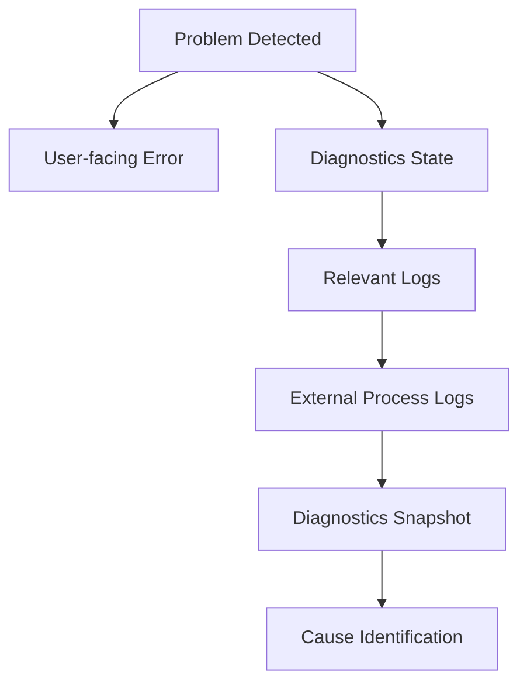

This order is not required for every failure, but the investigation path is kept consistent.

### Rationale

If each module uses a different investigation method, OSS developers find it hard to understand how to investigate failures.

A common diagnostic path is provided.

---

## 5.37 Logging and Diagnostics Implemented by Claude Code

When Claude Code implements a new function, logging and diagnostics are also part of the implementation, not only normal-path processing.

At least the following are checked:

- whether logs are output with the appropriate module / category
- whether there is sufficient context on errors
- whether user notifications and developer logs are separated
- whether secrets are output
- for external processes, whether stdout / stderr are obtained
- whether runtime state is observable from diagnostics
- whether excessive logs are output in high-frequency processing

These rules are written in `CLAUDE.md`, etc.

### Rationale

If diagnostics are postponed when adding new functions, it is easy to notice only after a failure occurs that the means of investigation are insufficient.

Logging / diagnostics are treated as part of feature implementation.

---

## 5.38 Internal Division of Responsibilities

Conceptually, the following structure is assumed.

```text
Diagnostics/
├─ Logging/
│  ├─ Logger
│  ├─ LogEntry
│  ├─ LogContext
│  ├─ LogWriter
│  └─ LogRotation
│
├─ Runtime/
│  ├─ RuntimeDiagnostics
│  ├─ ModuleDiagnostics
│  └─ PerformanceMetrics
│
├─ External/
│  ├─ ProcessLogCollector
│  ├─ ServiceHealthMonitor
│  └─ VersionCollector
│
├─ Snapshot/
│  ├─ DiagnosticsSnapshot
│  └─ DiagnosticsExporter
│
├─ Privacy/
│  ├─ SecretMasker
│  └─ DiagnosticsSanitizer
│
└─ UI/
   └─ DiagnosticsController
```

### Rationale

Separating logging, runtime monitoring, external processes, export, and privacy processing prevents responsibilities from concentrating in a single giant diagnostics manager.

---

## 5.39 Basic Principles of Logging and Diagnostics

This system adopts the following basic principles for logging and diagnostics.

1. Separate notifications for normal users from developer logs.
2. Show users the impact and how to respond, not the internal implementation.
3. Leave sufficient context for failure analysis for developers.
4. Use log levels according to purpose.
5. Make logs identifiable per module / category.
6. Attach correlation information such as session and run as needed.
7. Make stdout / stderr of external processes obtainable.
8. Make the versions and execution environments of external components recordable.
9. Distinguish process state from service health.
10. Make runtime state and performance observable from developer diagnostics.
11. Structurally separate the diagnostic camera from the streaming pipeline.
12. Do not include diagnostic overlays in the normal streamed video.
13. Make it possible to generate a diagnostics export for failure reports.
14. Do not output secrets to logs or diagnostics exports.
15. Mask paths containing personal information as needed.
16. Do not store logs without limit.
17. Avoid excessive log output in high-frequency processing.
18. Suppress large volumes of the same error as needed.
19. Make application versions and external component versions checkable.
20. Keep a history of recovery processing as well.
21. Limit the impact of diagnostic functions themselves on runtime performance.
22. Treat logging / diagnostics as part of each feature implementation.
23. Include logging and diagnostics in reviews even when Claude Code implements.


---

---

# 6. Project, Configuration, and Data Management

## 6.1 Basic Policy

This system not only manages the multiple settings required for streaming individually but also provides a unit called a **project** that groups related settings.

A project holds together the information needed to reproduce a specific streaming configuration.

For example, it associates:

- avatar
- tracking settings
- voice model
- voice settings
- stage
- camera settings
- capture settings
- BGM / SE settings
- streaming settings
- audio routing
- other stream-specific settings

Conceptually, the structure is as follows.

```text
Project
├─ Avatar
├─ Tracking Profile
├─ Voice Profile
├─ Stage
├─ Camera Profile
├─ Capture Profile
├─ Audio Profile
└─ Streaming Profile
```

### Rationale

If the settings of each function are managed completely independently, every time streaming starts the user would need to

- select the avatar
- select the voice model
- select the stage
- configure the camera
- adjust volumes
- select the streaming settings

and so on.

Managing them together as a project makes it easy to reproduce past streaming configurations.

---

## 6.2 Separating Projects and Profiles

A project does not hold every setting value of each function directly; as a rule, it references profiles managed by each function.

Conceptually, the relationship is as follows.

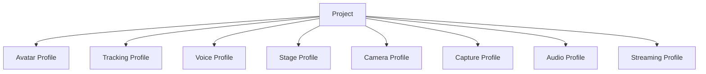

### Rationale

If all setting values are copied into each project, duplication occurs when the same settings are used by multiple projects.

For example, if the same tracking profile is used by multiple projects, every change to the tracking settings would require updating multiple projects.

Therefore,

**reusable function-specific settings are profiles**

**a combination of profiles is a project**

---

## 6.3 Profile Management

Each function can manage its own settings as profiles.

The following are assumed initially.

| Profile | Main settings |
|---|---|
| Avatar Profile | Bones, expressions, body proportion correction, etc. |
| Tracking Profile | Provider, camera, smoothing, calibration, etc. |
| Voice Profile | Voice model, pitch, post-processing, etc. |
| Camera Profile | Camera points, FOV, switching settings, etc. |
| Capture Profile | GameCapture device, sub-screen monitor, capture source settings, etc. |
| Audio Profile | Bus volumes, routing, effects, etc. |
| Streaming Profile | Resolution, FPS, encoder, bitrate, etc. |

A stage may hold information equivalent to a stage profile itself.

### Rationale

The lifecycle of settings differs by function.

For example, the structure avoids having to recreate the entire project just to change the tracking settings.

---

## 6.4 Project Data Structure

A project holds at least the following information.

```text
Project
├─ ProjectId
├─ DisplayName
├─ CreatedAt
├─ UpdatedAt
├─ AvatarId
├─ TrackingProfileId
├─ VoiceProfileId
├─ StageId
├─ CameraProfileId
├─ CaptureProfileId
├─ AudioProfileId
├─ StreamingProfileId
└─ Project-specific Settings
```

Settings needed only for a specific project can be held in the project itself.

### Rationale

Separating everything into profiles would require managing even settings meaningful only to a project as profiles, which would instead complicate the management structure.

Therefore, settings are divided as:

- settings to reuse → profile
- settings meaningful only to that project → project

---

## 6.5 Configuration Data Storage Format

Configuration data such as projects and profiles uses, as a rule, a text format that humans and developers can easily inspect.

The initial implementation uses JSON as the basic format.

SQLite is used for data where search and history management are important, such as the training run history in Chapter 13.

### Rationale

Storing all settings in SQLite makes it difficult for users and developers to check the settings directly.

On the other hand, a database is suited to searching history and large numbers of records.

Therefore, the roles are divided as:

**settings and configuration information in files such as JSON**

**information where history and searchability matter in SQLite**

---

## 6.6 Referencing by ID

Associations between projects and profiles use unique IDs, not display names or file paths.

Example:

```text
Project
  AvatarId = avatar_001
  VoiceProfileId = voice_profile_003
  StageId = stage_room_001
```

Display names are kept separately as user-facing information.

### Rationale

Display names may be changed by the user.

Also, referencing file paths directly may break settings when storage locations change.

Therefore, stable IDs are used for internal references.

---

## 6.7 Basic Policy for Data Storage Areas

This system's data is broadly divided into the following three types by purpose.

1. **basic application settings**
2. **user data, projects, and assets**
3. **secrets**

Each has a separate storage location.

### Rationale

Settings, user data, and secrets differ in

- update frequency
- size
- portability
- security requirements
- backup method

Rather than handling all of them in the same folder or file format, they are separated by role.

---

## 6.8 Storage of Basic Application Settings

Small settings needed to start the application are stored in the OS-standard user data area.

With Windows as the main target, the following initial location is assumed.

```text
%LOCALAPPDATA%/
└─ VirtualVesselStudio/
   ├─ bootstrap.json
   └─ Config/
      ├─ app-settings.json
      └─ ui-settings.json
```

Examples:

- location of the Data Root
- UI settings
- Developer Mode
- default devices
- application-wide settings

### Rationale

Saving user settings in the same location as the application executable or under `Program Files` makes them susceptible to

- write permissions
- application updates
- reinstallation
- version replacement

and so on.

Therefore, the OS-standard user data area is used.

---

## 6.9 Data Root

User data such as projects, avatars, stages, voice models, and datasets is stored in a dedicated managed area called the **Data Root**.

The initial value is, for example:

```text
%LOCALAPPDATA%\VirtualVesselStudio\Data
```

However, the Data Root can be changed by the user.

Example:

```text
D:\VirtualVesselStudioData
```

The actual location of the Data Root is referenced from `bootstrap.json`, etc. placed in the OS-standard area.

Conceptually:

```text
%LOCALAPPDATA%\VirtualVesselStudio\
        ↓
bootstrap.json
        ↓
Data Root
        ↓
D:\VirtualVesselStudioData
```

### Rationale

Avatars, stages, voice models, datasets, training runs, recordings, etc. may become large.

Always storing them in `%LOCALAPPDATA%` may exhaust space on the system drive.

Therefore, only small startup settings remain in the OS-standard area, and the storage location for large data can be changed.

---

## 6.10 Internal Structure of the Data Root

The Data Root is conceptually structured as follows.

```text
DataRoot/
├─ Projects/
│  └─ <ProjectId>/
│     └─ project.json
│
├─ Profiles/
│  ├─ Tracking/
│  ├─ Voice/
│  ├─ Camera/
│  ├─ Capture/
│  ├─ Audio/
│  └─ Streaming/
│
├─ Avatars/
│  └─ <AvatarId>/
│     ├─ model.vrm
│     ├─ avatar-profile.json
│     └─ thumbnail.png
│
├─ Stages/
│
├─ VoiceModels/
│
├─ Audio/
│  ├─ BGM/
│  └─ SE/
│
├─ VoiceLab/
│  ├─ voice-lab.db
│  ├─ Datasets/
│  ├─ TrainingRuns/
│  └─ Models/
│
├─ Cache/
└─ Logs/
```

External OSS such as RVC and VoxCPM2 is managed separately as the external management area defined in Chapter 13.

### Rationale

Separating directories by purpose makes

- backup
- failure investigation
- data deletion
- import / export
- checking capacity

easier.

---

## 6.11 Placement of Assets and Profiles

Profiles strongly tied to a specific asset can be placed in the same managed area as that asset.

For example, an avatar profile is stored as

```text
Avatars/
└─ <AvatarId>/
   ├─ model.vrm
   ├─ avatar-profile.json
   └─ thumbnail.png
```

On the other hand, profiles reused by multiple assets or projects are stored in common areas such as

```text
Profiles/
├─ Tracking/
├─ Voice/
├─ Camera/
├─ Audio/
└─ Streaming/
```

### Rationale

Placing all profiles uniformly in the same location makes it hard to distinguish asset-specific settings from reusable settings.

Therefore:

**asset-specific settings go in the same place as the asset**

**reusable settings go in the common profile area**

---

## 6.12 Importing into the Application-managed Area

Assets registered in this system are, as a rule, copied under the Data Root and managed there.

Examples:

- avatar models
- stages
- voice models
- BGM
- SE
- datasets
- training run artifacts

The path to the original file may be kept as metadata as needed, but it is not a required reference at runtime.

### Rationale

Saving only references to external files may make it impossible to reproduce a project if the original file is moved, renamed, or deleted.

Importing into the system-managed area allows data to be managed entirely within this system after registration.

---

## 6.13 Secret Management

Secrets such as the following are not stored directly in normal project or profile JSON.

- YouTube stream key
- OAuth tokens
- API keys
- other authentication information

Secrets use a secure storage method such as the credential store provided by the OS.

Projects and streaming profiles reference a credential ID as needed.

```text
Streaming Profile
        ↓
CredentialId
        ↓
OS Credential Store
```

### Rationale

Projects and profiles may be taken outside through

- backups
- import / export
- GitHub issues
- sharing between users

and so on.

Storing secrets in the same files risks unintended external leakage.

---

## 6.14 Configuration Schema Versioning

Projects and profiles have a schema version for their configuration format.

Example:

```json
{
  "schemaVersion": 3,
  "projectId": "project_001"
}
```

When the configuration structure changes due to an application update, old settings can be converted into the new settings.

### Rationale

When the system is continuously updated as OSS, configuration items and data structures are likely to change.

Making the schema version explicit allows the format of old data to be determined.

---

## 6.15 Migration

When the configuration schema changes, migration processing from the old format to the new format is provided.

Conceptually, the flow is:

```text
Load Data
    ↓
Check Schema Version
    ↓
Old Version?
    ├─ No → Load
    │
    └─ Yes
         ↓
      Migration
         ↓
      Validation
         ↓
        Load
```

Migration is performed step by step as far as possible.

```text
v1 → v2 → v3
```

### Rationale

Providing a dedicated conversion from every old version directly to the latest one makes migration processing grow as versions increase.

Step-by-step migration simplifies management.

---

## 6.16 Data Validation

When loading projects and profiles, setting values and reference targets are validated.

Examples:

- whether the AvatarId exists
- whether the StageId exists
- whether the voice model exists
- whether the profile format is correct
- whether required fields exist
- whether the schema version is supported
- whether credential references are valid

Invalid settings are not passed to the runtime as-is.

### Rationale

Configuration files may become inconsistent due to

- application updates
- manual editing
- file corruption
- import
- asset deletion

and so on.

Detecting problems at the loading stage presents the cause more clearly than failing after the runtime has started.

---

## 6.17 Project Loading

When loading a project, related profiles and assets are resolved and applied to the runtime.

```text
Project Load
    ↓
Project Validation
    ↓
Profile Resolution
    ↓
Asset Validation
    ↓
Runtime Configuration
    ↓
Avatar / Tracking / Voice / Stage / Camera / Audio
```

Applying individual settings is delegated to each module.

### Rationale

If the project manager directly operates on the internal implementation of Avatar, Tracking, Voice, etc., the project management function becomes strongly dependent on all modules.

The project manager is responsible up to

**resolving what to use**

and leaves

**how to apply it**

to each module.

---

## 6.18 Project Switching

Switching projects during streaming does not unconditionally reinitialize everything at once.

The settings that make up a project are classified into

- those that can be safely changed during runtime
- those that require reinitialization

and the required processing is applied in order.

Examples:

- avatar switching
- stage switching
- voice model switching
- camera setting changes
- audio setting changes

### Rationale

Carelessly reinitializing even the streaming encoder, etc. due to a project change could stop the stream.

Therefore, the safe runtime change methods defined by each module are used.

---

## 6.19 Auto-save

When settings are changed on setup screens, etc., auto-save can be used as needed.

However, instead of saving every edit operation immediately as committed data,

- editing state
- committed state

can be separated.

### Rationale

Saving everything immediately may persist even trial settings and mistaken operations.

On the other hand, explicit saving alone may lose changes on abnormal termination.

Therefore, auto-save and committed save are used appropriately depending on the function.

---

## 6.20 Backup

Important data such as projects, profiles, and SQLite databases can be backed up.

The main protected targets are:

- projects
- profiles
- avatar profiles
- voice model information
- the Voice Lab SQLite database
- other settings that are costly to recreate

The structure allows generational backups as needed.

### Rationale

Project settings and training history contain information that takes time to recreate.

This prevents losing everything due to file corruption or migration failure.

---

## 6.21 Import / Export

Projects and related data can be imported and exported.

Export can bundle the following as needed:

- project
- profiles
- avatar
- voice model
- stage
- audio materials

Secrets are excluded from export.

Excluded examples:

- YouTube stream key
- OAuth tokens
- API keys

### Rationale

Demand for migrating projects to another PC or backing them up is expected.

On the other hand, bundling authentication information may unintentionally share secrets.

Therefore, portable data and secrets are separated.

---

## 6.22 Project Deletion

As a rule, deleting a project does not automatically delete the avatars, voice models, stages, etc. it references.

### Rationale

The same asset or profile may be referenced by multiple projects.

Deleting assets when deleting a project may make other projects unusable.

---

## 6.23 Asset Deletion

When deleting an avatar, voice model, stage, etc., the projects and profiles that reference that asset are checked.

If it is referenced, the user is notified of the scope of impact.

### Rationale

Deleting assets without checking references leaves existing projects incomplete.

---

## 6.24 Cache Management

Temporary data that can be regenerated is stored in the cache area.

Examples:

- temporary thumbnail data
- temporary conversion files
- preview data
- temporary analysis results

The cache can be deleted and regenerated as needed.

### Rationale

Mixing persistent and temporary data makes backup targets and deletability unclear.

Separating regenerable data into the cache makes capacity management easier.

---

## 6.25 Log Management

Application logs are stored in a Logs area separate from user data.

The detailed logging approach is defined in the chapter on logging and diagnostics.

### Rationale

This avoids including large amounts of logs when backing up projects and assets.

It also makes it easier to obtain logs from one place during failure investigation.

---

## 6.26 Changing the Data Root

Users can change the Data Root.

When changing it, a structure that allows choosing whether to migrate existing data to the new Data Root or use it as an empty Data Root is considered.

When migrating, the new Data Root is activated after confirming that copying has completed and the data is consistent.

### Rationale

Simply changing the Data Root setting may make existing projects and assets unfindable.

Therefore, changing the storage location and migrating data are clearly distinguished so that switching can be done safely.

---

## 6.27 Separating Setup and Runtime

### Setup

Handles:

- project creation
- project editing
- profile creation / editing
- asset registration
- Data Root settings
- import / export
- backup
- migration
- data management

### Runtime

Handles:

- project loading
- profile resolution
- applying settings to the runtime
- safe setting switching
- holding runtime state

### Rationale

Processing such as file operations, migration, and data migration is separated from the real-time runtime so that it does not affect streaming.

---

## 6.28 Error Handling and Diagnostics

Normal users are shown, for example:

- The project cannot be loaded
- The required avatar cannot be found
- The voice model cannot be found
- The Data Root cannot be accessed
- The settings data is old and will be updated
- The settings file is corrupted
- Data migration failed

Developer diagnostics record the following as needed:

- ProjectId
- ProfileId
- AssetId
- schema version
- migration version
- Data Root
- data path
- missing references
- validation results
- migration results
- exception
- stack trace

Secrets are not output.

### Rationale

Errors in project loading and data migration may arise from reference relationships across multiple modules, profiles, assets, the file system, etc.

Normal users are given the information needed for recovery, and developers are given information that allows tracking which processing caused the problem.

---

## 6.29 Internal Division of Responsibilities

Conceptually, the following structure is assumed.

```text
DataManagement/
├─ Bootstrap/
│  ├─ BootstrapSettings
│  └─ DataRootResolver
│
├─ Project/
│  ├─ ProjectProfile
│  ├─ ProjectManager
│  └─ ProjectValidator
│
├─ Profiles/
│  ├─ ProfileRepository
│  └─ ProfileResolver
│
├─ Assets/
│  ├─ AssetManager
│  └─ AssetRegistry
│
├─ Serialization/
│  └─ JsonSerializer
│
├─ Migration/
│  └─ DataMigrationManager
│
├─ Backup/
│  └─ BackupManager
│
├─ Transfer/
│  ├─ ImportManager
│  └─ ExportManager
│
├─ Credentials/
│  └─ CredentialStore
│
├─ Cache/
│  └─ CacheManager
│
└─ Runtime/
   └─ ProjectRuntimeLoader
```

### Rationale

Consolidating project management, profile management, asset management, the Data Root, migration, import / export, etc. into a single class widens the impact of data structure changes.

Separating them by responsibility makes it easier to independently

- add profiles
- add new assets
- change schemas
- change the Data Root
- add migrations
- extend import / export

and so on.

---

## 6.30 Basic Principles of Data Management

This system adopts the following basic principles for project, configuration, and data management.

1. Manage streaming configurations per project.
2. Separate reusable function settings from projects as profiles.
3. Use unique IDs, not display names or file paths, for internal references.
4. Registered assets are, as a rule, imported into the system-managed area.
5. Store basic application settings in the OS-standard user data area.
6. Store large user data in a changeable Data Root.
7. Resolve the location of the Data Root from the bootstrap settings.
8. Separate secrets from projects and profiles and store them in the OS credential store, etc.
9. Give configuration data a schema version.
10. Make old data convertible to the new format through migration.
11. Validate settings and reference targets before applying them to the runtime.
12. Do not store large assets in SQLite.
13. Use SQLite for information suited to a database, such as history management.
14. Treat project deletion and asset deletion as separate operations.
15. Do not include secrets in import / export.
16. Separate the cache from persistent data.
17. Project changes during streaming use each module's safe change method.
18. When changing the Data Root, switch only after confirming the consistency of existing data.


---

---

# 7. 3D Avatar Control

## 7.1 Purpose

The 3D avatar control function loads, registers, and switches the 3D models used as a VTuber, and manages pose control, expression control, extension bone control, and model-specific settings.

This function is structured so that model-format-specific information such as VRM and FBX is not handled directly by the tracking function or other functions of the application.

An **avatar abstraction layer** is placed between model formats and avatar control processing so that VRM, FBX, and model formats added in the future can be handled by higher-level functions in the same way as far as possible.

Elements not included in the standard humanoid skeleton, such as cat ears and tails, are also handled as extension bones independently of the model format.

As an initial function, expression-linked motion of cat ears and tails is provided, and the motion can be changed by the user.

Furthermore, the structure allows any other extension element besides cat ears and tails to be added by the user registering the target bones and motion conditions.

### Rationale

Each 3D model format differs in how bones are obtained, how expressions are controlled, metadata structure, and so on.

Exposing these differences to the Tracking module, the UI, etc. would require modifying multiple functions every time a model format is added.

Therefore, model-format-specific processing is confined to a limited area, and a common avatar representation is provided on top of it.

Also, implementing cat ears, tails, etc. as dedicated code per model would require program changes every time a new model or extension element is added.

Therefore, a common control approach is also provided for extension bones.

This reduces the scope of changes caused by differences in model formats, the standard human skeleton, and extension elements, ensuring the maintainability and extensibility of the entire system.

---

## 7.2 Avatar Control Architecture

3D avatar control is broadly divided into the following three layers.

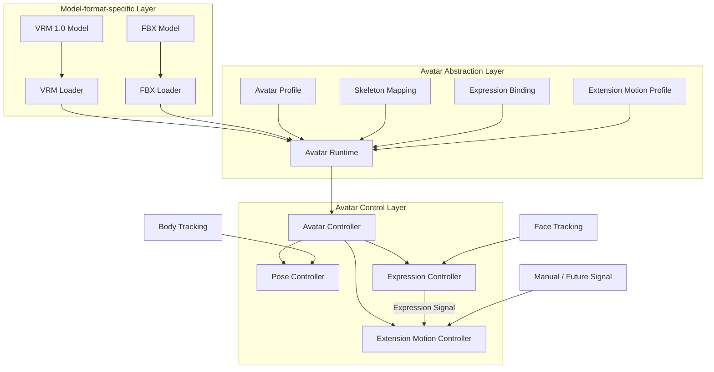

The arrows in the diagram do not represent class inheritance itself but mainly represent:

- data conversion
- passing of information
- flow of control requests

### Model-format-specific Layer

Loads model files such as VRM and FBX and interprets model-format-specific information.

VRM-specific APIs and FBX-specific APIs are, as a rule, confined to this layer.

### Avatar Abstraction Layer

Absorbs differences between model formats so that higher-level control processing can treat them as the same avatar.

Provides standard human bones, extension bones, expressions, extension bone motion settings, model settings, etc. in a format common to this system.

### Avatar Control Layer

Receives tracking results, etc. and applies poses, expressions, and extension bone motion to the abstracted avatar.

It is not aware of the concrete internal structure of VRM or FBX.

### Rationale

Directly connecting model loading to avatar control would require separate control processing for VRM and FBX, and processing would grow with the number of model formats.

Therefore, the boundary

**format-specific processing → common representation → control**

is established.

This limits the impact on other avatar control processing even when changes such as

- changing the VRM library
- changing how FBX is supported
- adding a new 3D model format
- adding new extension bone control

occur.

Clarifying the responsibility of each layer also makes it easier, when a failure occurs, to isolate whether the problem occurred in "loading," "mapping," "pose control," "expression control," or "extension bone control."

---

### Avatar Runtime

The `Avatar Runtime` is the runtime avatar representation used to actually control a loaded 3D model in this system.

It does not mean only the GameObject generated in Unity; it handles together

- the loaded model
- references to standard bones
- references to extension bones
- references to expressions
- the avatar profile
- extension motion settings
- the current avatar state

and so on.

Basically, one Avatar Runtime is created for each loaded avatar.

### Rationale

If only Unity GameObjects are treated as avatars, bone mapping, expression settings, extension bone settings, model-specific settings, etc. tend to be managed in separate places.

Grouping them into a single runtime unit allows

**"the information needed to control this avatar right now"**

to be obtained from one place.

Also, if multiple avatars are handled simultaneously in the future, this can be supported by creating multiple Avatar Runtimes, so the system does not need to assume a single avatar.

---

### Avatar Profile

The `Avatar Profile` is not the model file itself but persistent settings that represent

**how the model is used in this system**

For example, it holds:

- supplementary settings for bone mapping
- extension bone registration information
- expression mapping
- a reference to the extension motion profile
- model scale
- initial position
- initial rotation
- correction information for applying tracking
- model-specific control settings

### Rationale

Writing system-specific information into the model file itself would require modifying the original model.

Also, VRM and FBX differ in what information can be stored inside the model and how.

Therefore, the model file and system-specific settings are separated.

This makes it possible to:

- not modify the original model
- apply different settings to the same model
- change extension bone motion independently of the model file
- update the settings format on the application side alone
- use the same settings management approach regardless of model format

---

### Avatar Controller

The `Avatar Controller` is the high-level control entry point for operating an Avatar Runtime.

Other modules avoid directly operating on Transforms, BlendShapes, VRM APIs, etc. and pass control requests through the Avatar Controller.

Internally, it dispatches processing to the Pose Controller, Expression Controller, Extension Motion Controller, etc.

The Avatar Controller is not designed as a singleton that exists only once in the entire system.

### Rationale

If external modules can freely operate on Unity Transforms, etc., multiple processes may rewrite the same bones, and the processing order and dependencies may become unclear.

Providing a control entry point creates a structure that:

- limits the paths for changing the avatar
- makes control processing traceable
- makes it easy to add control processing in the future
- can support multiple avatars

---

## 7.3 3D Model Loading

Model loading processing is separated by model format.

A common model loading interface is provided, and format-specific loaders are placed as its implementations.

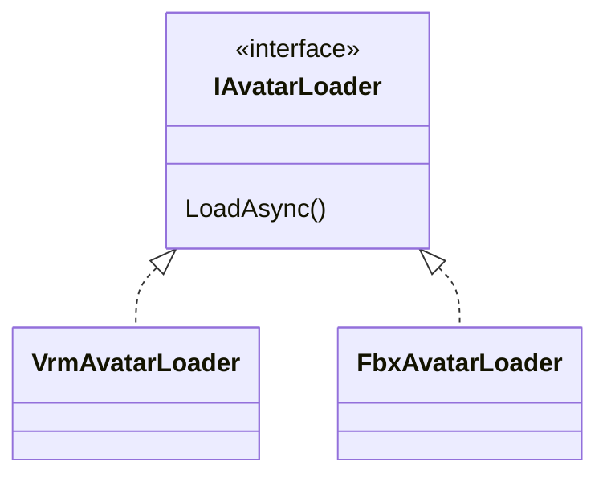

The initially supported formats are as follows.

| Format | Support policy |
|---|---|
| VRM | VRM 1.0 and later are targeted |
| FBX | Supported |

The runtime loading method for FBX, including the library used, is decided in the detailed design.

Loaders load not only standard human bones but also extension bones present in the model, in a state that subsequent processing can reference.

### Rationale

Writing loading processing for each model format directly into common processing would require changing existing code every time a format is added.

Making loaders independent per format allows a new format to be supported, as a rule, simply by adding a loader.

Limiting external dependencies such as the VRM library to the inside of loaders also limits the impact of external library updates.

---

## 7.4 Avatar Profile Management

Model files and system-specific settings are managed separately.

In this system design, these settings are called the **Avatar Profile**.

The name candidates were as follows.

| Name | Meaning / characteristics |
|---|---|
| Avatar Definition | Strongly implies defining the avatar itself and is easily taken to include the model data |
| Avatar Configuration | Clearly settings, but the scope is broad |
| Avatar Descriptor | Means information describing the avatar, but somewhat abstract |
| Avatar Mapping Profile | Expresses bone / expression mapping well, but makes it hard to include other settings |
| **Avatar Profile** | Expresses the full set of per-avatar usage settings well and is easy to distinguish from the model file |

This system adopts **Avatar Profile**.

### Rationale

The name `Definition` strongly suggests "data that defines what the avatar is," that is, including the model itself.

The information to be saved here is

**not the model itself but how the model is used in this system**

Therefore, `Profile`, which readily conveys the meaning of a set of settings, is adopted.

---

## 7.5 Bone Abstraction

Internal Transform structures of VRM, FBX, etc. are not referenced directly from the Tracking module, etc.

The basic human skeleton is based on the humanoid structure and converted into bone identifiers common to this system.

Examples:

- Head
- Neck
- Chest
- Spine
- Hips
- Shoulder
- UpperArm
- LowerArm
- Hand
- UpperLeg
- LowerLeg
- Foot
- each finger joint

On the other hand, the structure can also handle bones not included in the humanoid structure, such as:

- cat ears
- fox ears
- rabbit ears
- tails
- wings
- hair
- clothing
- accessories
- other model-specific bones

Therefore, bones are broadly managed as

- standard human bones
- extension bones

### Initially Supported Extension Bones

As an initial function, the following, which are frequently used in VTuber models, are supported as standard:

- cat ears
- tails

However, the internal implementation is not dedicated to cat ears and tails.

Cat ears and tails also use the common extension motion mechanism described later and are provided as its standard settings.

### User-defined Extension Bones

Any bone present in the model can be additionally registered by the user as an extension bone.

For example,

- fox ears
- rabbit ears
- wings
- ahoge (a single stray strand of hair)
- ribbons
- antennae
- special tails
- other unique accessories

and so on can be registered.

### Rationale

Defining common names for the body parts targeted by human tracking allows control without being aware of the internal structure of VRM or FBX.

On the other hand, forcing cat ears or tails into human bones mixes the meanings of the human skeleton and additional structures.

Therefore, the humanoid structure is made common as standard human bones, and everything else is handled separately as extension bones.

Furthermore, by allowing arbitrary bones to be registered instead of hardcoding only cat ears and tails, the structure can support model-specific features.

---

## 7.6 Pose Application and Absorbing Body Proportion Differences

The human pose obtained from the Tracking module is not applied directly to the model's Transforms.

Tracking results are treated as model-independent pose information and then retargeted to the target avatar.

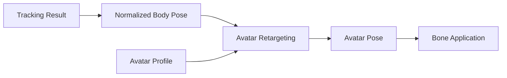

Each model differs in

- height
- arm length
- leg length
- shoulder width
- initial bone pose
- bone rotation axes
- overall model scale

and so on.

These differences are absorbed using model-specific information such as the avatar profile.

### Rationale

The proportions of the actual person and the avatar cannot be expected to match exactly.

Applying tracking values directly to the model may cause

- hands not reaching the correct position
- shoulders deforming unnaturally
- feet floating off the floor
- motion results differing per model

and so on.

Therefore,

**the observed human pose**

and

**the pose applied to the avatar**

are separated.

The concrete algorithm for proportion correction is decided in the detailed design.

Calibration processing, which was independent in an earlier proposal, is also treated as part of this retargeting processing.

---

## 7.7 Expression Control

Expression control is based not mainly on switching expression presets such as smiling or anger but on **continuous expression control through face tracking**.

For example,

- open/close amount of the left and right eyes
- blinking
- open/close amount of the mouth
- mouth shape
- eyebrow movement
- movement of cheeks, etc.

are obtained as continuous values.

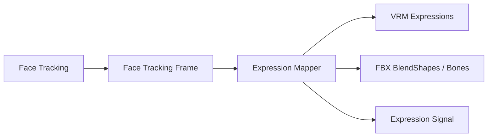

Differences in expression implementation between VRM and FBX are absorbed by expression mapping.

Also, expression presets such as

- Smile
- Angry
- Sad
- Surprised
- user-registered expressions

can be used as an auxiliary function.

The expression control function not only applies expressions to the avatar's face but also provides an **Expression Signal** that other avatar control functions can use.

The Expression Signal represents, for example, expression states such as Smile and Sad and continuous face tracking values for the eyes, mouth, etc. as input values independent of the model format.

### Rationale

For VTuber use, changing expressions continuously to follow actual face movements gives a more natural representation than switching expressions as simple on/off states.

On the other hand, for streaming performances, etc., one may want to switch immediately to a specific expression.

Therefore,

**face tracking is the basis**

while

**preset expressions are an auxiliary function**

and both can be used together.

Also, making it available to other control as an Expression Signal allows cat ears, tails, etc. to move in conjunction with expressions.

---

## 7.8 Extension Bone and Extension Motion Control

An **Extension Motion** mechanism is provided that allows setting motion for extension bones other than standard human bones in response to expressions and other inputs.

Extension motion separates

**what to move**

from

**what to react to and how to move**

```text
Extension Bone
  = what to move

Extension Motion Profile
  = what to react to and how to move
```

### Overall Structure of Extension Motion

Conceptually, the structure is as follows.

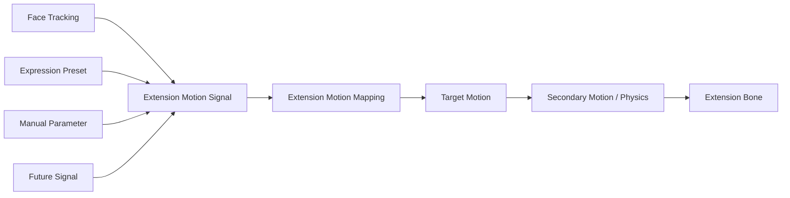

The Extension Motion Controller generates the motion of target extension bones based on input signals and the configured mappings.

---

### Linking with the Expression Signal

The initial function provides expression linking for cat ears and tails.

For example, the following can be used as input:

- Smile
- Angry
- Sad
- Surprised
- Eye Open
- Mouth Open
- other face tracking values
- expression presets
- manual parameters

Input values are handled as normalized signals, such as 0.0 to 1.0, where practical.

### Rationale

Hardcoding specific expression names inside the Extension Motion Controller makes it hard to add new expressions or input signals.

Handling input as common signals allows expression presets, continuous face tracking values, future external input, etc. to be handled by the same mechanism.

---

### Standard Cat Ear Motion

For cat ears, a standard motion profile linked to expressions is provided.

As initial settings, for example,

```text
Smile
 → raise the ears slightly

Sad
 → lay the ears down

Surprised
 → raise the ears strongly

Angry
 → turn the ears slightly backward
```

and so on are assumed.

However, these motions are not fixed specifications.

The user can change at least:

- target bones
- motion axes
- rotation amount
- position change amount
- initial offset
- left/right differences
- response speed
- smoothing
- which signals to react to
- motion amount relative to the signal

### Rationale

Even for the same cat ears, models differ in

- bone axes
- initial pose
- ear size
- preferred motion

The structure provides standard settings while allowing changes according to the model and the user's preference.

---

### Standard Tail Motion

For tails, a standard expression-linked motion profile is also provided.

As initial settings, for example,

```text
Smile
 → wag slowly from side to side

Sad
 → droop downward

Surprised
 → change toward standing up

Angry
 → move more strongly than usual
```

and so on are assumed.

For tails, the structure does not simply convert expressions into fixed angles but allows swaying and physical behavior to be added on top of the base pose and motion amount according to the expression, as in

```text
Expression Signal
      ↓
Base Pose / Motion Parameter
      ↓
Secondary Motion / Physics
      ↓
Final Tail Motion
```

### Rationale

Tails are often composed of multiple bones, and fixed rotations alone make natural motion hard to express.

Changing the base pose and wagging style according to the expression and applying secondary motion on top makes natural motion easier to achieve.

---

### Extension Motion Mapping

Extension motion settings are held as mappings.

Conceptual example:

```text
Extension Motion Mapping
├─ MappingId
├─ Target Extension Element
├─ Input Signal
├─ Input Range
├─ Response Curve
├─ Rotation
├─ Position
├─ Scale
├─ Response Speed
├─ Smoothing
└─ Secondary Motion Settings
```

The detailed data structure is decided in the detailed design.

The structure allows multiple mappings to be set for one extension element.

When multiple signals act on the same element simultaneously,

- blend
- priority
- weight

and so on are also defined in the detailed design.

---

### Extension Motion Profile

A set of extension motion mappings is managed as an **Extension Motion Profile**.

For example, it is held as

```text
Extension Motion Profile
├─ Cat Ear Settings
├─ Tail Settings
└─ User-defined Extension Settings
```

The extension motion profile can be referenced from the avatar profile.

The structure can be extended as needed to duplicate motion profiles, turn them into presets, import / export them, etc.

### Rationale

Separating the extension bones themselves from the motion settings makes it easier to apply different motions to the same model or to change and compare settings.

It also makes future sharing of motion profiles easier to support.

---

### User-defined Extension Elements

Extension elements other than cat ears and tails can also be added by the user from the setup UI.

Conceptually, the following information is set.

```text
Extension Element

Name:
  Fox Tail

Target Bones:
  Tail_01
  Tail_02
  Tail_03

Input:
  Smile

Motion:
  Rotation / Position / Secondary Motion

Response:
  User-defined Settings
```

Targeting bones in the model, the user can register

- extension element name
- target bone or bone chain
- input signal
- motion mapping

This allows

- fox ears
- rabbit ears
- wings
- ahoge
- antennae
- ribbons
- unique accessories

and so on to be added without changing the main code.

### Rationale

3D avatars have additional structures specific to each model.

It is not realistic to predefine every kind in the main application.

Therefore, standard settings are provided for frequently used cat ears and tails, and everything else can be added by the user using the common extension motion mechanism.

---

### Handling Extension Bone Control Failures

Even if a configured extension bone does not exist or there is a problem with a mapping, pose control of standard human bones and expression control are not stopped.

Only the problematic extension element is disabled, and the user is notified.

### Rationale

This prevents abnormal settings of an auxiliary extension element from making the entire avatar unusable.

---

## 7.9 Avatar Management and Switching

Avatars can be switched even during streaming.

The initial implementation mainly targets single-person use, but the internal design does not assume that only one avatar can exist.

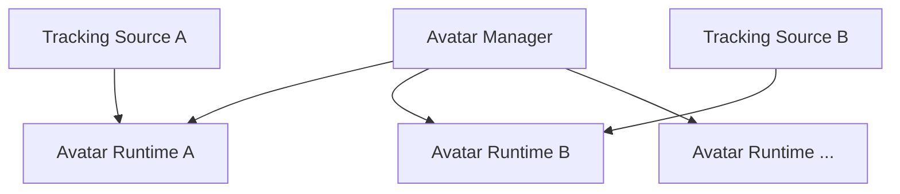

The initial version may limit the number of simultaneously used avatars to one.

### Rationale

Considering only currently needed functions, an implementation that holds a single `CurrentAvatar` is the simplest.

However, if the entire system depends on that structure, supporting multi-person streaming in the future would require a large-scale design change.

Therefore,

**using only one person as an initial function**

and

**the internal structure being dedicated to one person**

are considered separately.

The structure keeps future extensibility while not making the initial implementation more complex than necessary.

---

## 7.10 Scene Structure

Unity scenes are divided into the following two types.

### Persistent Scene

A scene that, as a rule, stays loaded while the application is running.

It mainly contains:

- application management functions
- Avatar Manager
- Avatar Runtime
- tracking-related functions
- audio-related functions
- camera
- UI
- other resident systems

### Stage Scene

Holds stage-specific objects such as backgrounds and 3D spaces.

Stage scenes are switched by additive load / unload.

### Rationale

If avatars, tracking, etc. are placed in the stage scene, they are destroyed and recreated every time the stage changes.

In that case,

- avatar reloading
- tracking reinitialization
- audio processing reinitialization
- loss of UI state
- loss of camera state

and so on may occur.

Therefore,

**systems that should continue regardless of the stage**

and

**the 3D environment replaced when the stage changes**

are separated per scene.

The persistent scene is treated as "the VTuber system itself," and the stage scene as "the stage."

The term `Persistent Scene` is defined within this system design and does not require prior knowledge of past documents.

---

## 7.11 Avatar Data Storage

Models registered by the user are not saved only as references to the original files but are copied into and managed in the system-managed area.

Using the Data Root defined in Chapter 6, they are conceptually stored as follows.

```text
DataRoot/
└─ Avatars/
    └─ <AvatarId>/
        ├─ model.vrm
        ├─ avatar-profile.json
        ├─ extension-motion-profile.json
        └─ thumbnail.png
```

For FBX, required related files are managed in the same way.

Whether the extension motion profile is saved directly inside the avatar profile or managed as a separate file is decided in the detailed design.

### Rationale

Saving only the path to the original file may make a registered avatar unusable due to

- moving the original file
- deletion
- renaming
- an external drive not being connected

and so on.

Copying into the integrated environment allows models to be managed entirely within this system after registration.

It also makes

- backup
- project migration
- export
- diagnostics
- reusing motion profiles
- future sharing functions

easier to implement.

The import source path may be saved as metadata, but it is not depended on at runtime.

---

## 7.12 Separating Setup and Runtime

Processing during avatar registration and configuration is separated from processing during streaming.

### Setup

- model import
- model format detection
- standard bone recognition
- standard bone assignment
- extension bone recognition
- checking cat ear / tail candidates
- registering user-defined extension bones
- expression recognition
- expression mapping
- extension motion mapping settings
- extension motion preview
- model-specific correction
- thumbnail settings
- saving the avatar profile
- saving the extension motion profile

### Runtime

- model loading
- loading the avatar profile
- loading the extension motion profile
- creating the Avatar Runtime
- connecting tracking
- applying poses
- applying expressions
- generating the Expression Signal
- applying extension motion

### Rationale

If bone analysis and extension motion configuration were performed every time during streaming, startup time would increase and user operation would become complex.

By completing analysis and configuration at setup time and saving them, the runtime can use the avatar simply by loading existing settings.

The purpose is to:

- simplify the procedure for starting a stream
- make runtime processing lightweight
- check extension motion in advance
- detect configuration mistakes in advance

---

## 7.13 Error Handling and Diagnostics

Error display for normal users and diagnostic logs for developers are separated.

For example, if model loading fails, the user is shown an easy-to-understand message such as

> Failed to load the avatar.

If there is a problem with the extension bone settings, the scope of impact is made clear, for example:

> The tail motion settings could not be applied. The avatar itself continues to work.

On the other hand, developer logs record the following as needed:

- AvatarId
- model format
- loader
- target file
- missing bones
- missing expressions
- extension element
- extension bone
- extension motion mapping
- input signal
- extension motion application result
- exception
- stack trace

### Rationale

Normal users and developers need different information.

For example, the information

```text
NullReferenceException at VrmAvatarLoader.cs:183
```

is useful to developers but does not help general users solve the problem and gives an unnecessarily complex impression.

Conversely, the information

> Failed to load the model

alone is insufficient for OSS developers to investigate the cause from GitHub issues, etc.

Therefore, the roles are divided:

**the user UI shows "what happened" and "what the user should do"**

while

**developer logs record "what happened internally" in detail**

This ensures both clarity in normal use and failure analysis capability as OSS.

Separating the user-facing display from internal logs also makes it less likely that user messages are dragged along by the internal structure when the internal implementation changes in the future.

---

## 7.14 Internal Division of Responsibilities

The 3D avatar control function does not consolidate processing into a single giant controller but is divided by responsibility.

Conceptually, the following structure is assumed.

```text
Avatar/
├─ Core/
│  ├─ AvatarProfile
│  ├─ AvatarRuntime
│  ├─ AvatarState
│  └─ AvatarBone
│
├─ Loading/
│  ├─ IAvatarLoader
│  ├─ VrmAvatarLoader
│  └─ FbxAvatarLoader
│
├─ Skeleton/
│  ├─ SkeletonMapping
│  └─ ExtensionBone
│
├─ Pose/
│  ├─ AvatarPose
│  ├─ PoseRetargeting
│  └─ PoseController
│
├─ Expression/
│  ├─ FaceTrackingFrame
│  ├─ ExpressionSignal
│  ├─ ExpressionMapping
│  └─ ExpressionController
│
├─ Extension/
│  ├─ ExtensionElement
│  ├─ ExtensionMotionProfile
│  ├─ ExtensionMotionMapping
│  ├─ ExtensionMotionSignal
│  ├─ SecondaryMotionProcessor
│  └─ ExtensionMotionController
│
├─ Runtime/
│  ├─ AvatarController
│  └─ AvatarManager
│
└─ Setup/
   └─ AvatarSetupController
```

### Rationale

Consolidating all processing into one controller makes

- model loading
- pose processing
- expression control
- extension motion
- saving settings
- avatar management

and so on depend on each other, so a change in one place tends to affect other functions.

Separating by responsibility aims to:

- clarify the role of each function
- limit test targets
- reduce the scope of change impact
- make the causes of defects easier to track
- make it easier to add new model formats
- make it easier to add new extension bones
- make it easier to add new extension motion approaches

The directory structure and class names shown here illustrate the approach to dividing responsibilities, and details are adjusted during implementation.


---

---

# 8. Tracking

## 8.1 Basic Policy

The tracking function obtains body, face, and hand/finger movements from cameras, external tracking devices, etc. and converts them into tracking information that can be used in common within this system.

The initial implementation targets camera-based tracking using MediaPipe.

The structure allows external tracking devices such as mocopi and other tracking libraries to be added in the future.

The tracking function does not depend on a specific 3D model format or avatar structure.

### Rationale

If the data format output by tracking libraries such as MediaPipe is passed directly to the Avatar module, the avatar control side depends on MediaPipe-specific landmark structures and coordinate systems.

In that state, switching to mocopi, etc. in the future would require changing the avatar control side as well.

Therefore, a tracking representation common to this system is placed between

**the tracking input method**

and

**the avatar control method**

---

## 8.2 Overall Tracking Structure

Tracking processing conceptually consists of the following flow.

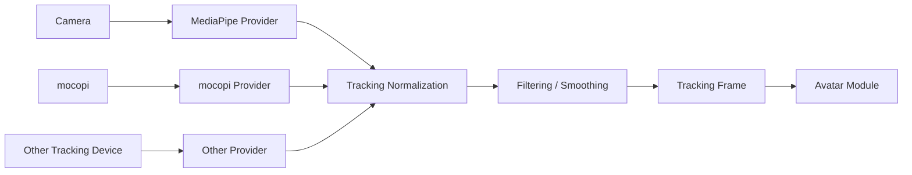

The arrows in the diagram mainly indicate the flow of obtaining, converting, and passing data.

### Rationale

Confining input-device- and library-specific processing inside providers and making subsequent processing common limits the impact of adding or changing input methods.

Separating normalization, smoothing, etc. as common processing also avoids implementing the same processing repeatedly in each provider.

---

## 8.3 Tracking Input Methods

Tracking input is separated into providers by input method.

Conceptually, the structure is as follows.

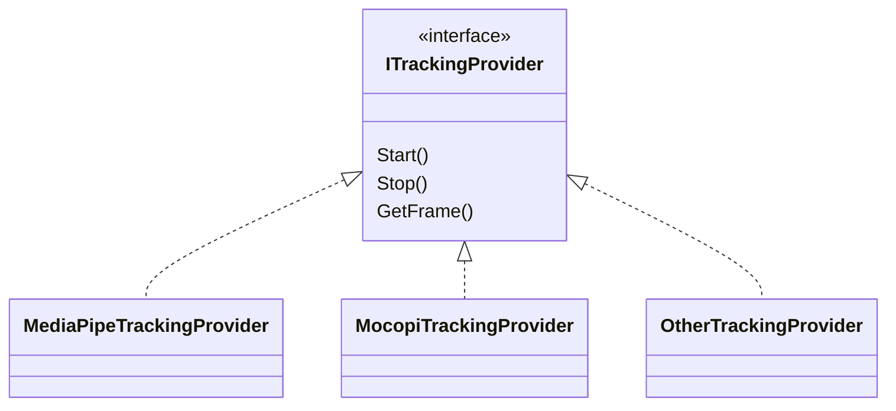

The initial implementation uses MediaPipe.

In the future,

- mocopi
- other camera-based tracking
- motion capture devices
- tracking input over a network

and so on can be added.

### Rationale

Making tracking input a common interface removes the need for higher-level processing to be aware of the library used.

Also, considering the possibility of using multiple input methods simultaneously, providers are not treated as singletons that exist only once in the entire system.

---

## 8.4 Common Tracking Data Format

Information obtained from each provider is converted into `TrackingFrame`, which is common to this system.

TrackingFrame conceptually has the following information:

- body tracking
- hand tracking
- face tracking
- timestamp
- tracking confidence
- tracking source
- tracking status

Body, hand, and face can each be held as independent data structures.

Conceptual example:

```text
TrackingFrame
├─ Timestamp
├─ Body
├─ LeftHand
├─ RightHand
├─ Face
└─ Status
```

### Rationale

Body, hands/fingers, and face may differ in how they are obtained, update frequency, and conditions under which data is missing.

Fixing everything into one giant structure makes it hard to support input methods that use only some tracking.

Therefore, TrackingFrame is a common container that holds the various kinds of tracking information separately inside it.

---

## 8.5 Body Tracking

Body tracking obtains pose information for the head, torso, arms, legs, etc.

The tracking side does not convert this into the specific skeleton structure of an avatar but holds the pose information as observed for a human body.

For example,

- Head
- Neck
- Shoulder
- Elbow
- Wrist
- Hips
- Knee
- Ankle

and so on are treated as human body parts common to this system.

### Rationale

The responsibility of the Tracking module is

**to obtain what pose the person is in**

and not

**how to apply that pose to a specific avatar's skeleton**

Absorbing differences in proportions and bone lengths is done by retargeting on the 3D avatar control side.

This clearly separates the responsibilities of the Tracking module and the Avatar module.

---

## 8.6 Hand and Finger Tracking

Hand and finger tracking obtains the pose of the left and right hands and each finger joint.

When available, joint information for

- wrist
- thumb
- index finger
- middle finger
- ring finger
- little finger

is held.

For input methods where hand/finger tracking is not available, the system can work with body tracking alone.

### Rationale

The amount of information available differs by input method, so making hand/finger tracking a requirement would limit the supported providers.

Therefore, body, hand, and face are treated as independent capabilities, and the structure uses only the information that is available.

---

## 8.7 Face Tracking

Face tracking obtains not only the face direction but also movements of the eyes, mouth, eyebrows, etc.

Basically, as continuous values,

- open/close amount of the left and right eyes
- open/close amount of the mouth
- mouth shape
- eyebrow movement
- face direction
- other available facial features

are held.

The Tracking module outputs these as model-independent face information, and conversion into VRM expressions, FBX blend shapes, etc. is done on the Avatar module side.

### Rationale

Converting face tracking information directly into VRM expression names, etc. would make the Tracking module depend on the model format.

Therefore, the Tracking module represents only "how the person's face is moving," and how to express that movement on the model is left to the Avatar module.

---

## 8.8 Coordinate Systems and Pose Representation

Coordinate systems obtained from each provider are not passed as-is to higher-level processing but are converted into the coordinate system common to this system.

Because each provider may differ in

- right-handed / left-handed systems
- axis directions
- origin position
- units
- quaternion definitions

and so on, these are unified within the provider or normalization processing.

### Rationale

Leaving coordinate system conversion to the Avatar module side would require individual processing for each combination of provider and avatar.

Unifying the coordinate system at the point of tracking output allows the Avatar module to process data without being aware of the input source.

---

## 8.9 Handling Confidence and Missing Data

Tracking data can hold confidence and tracking state for each body part.

For example, states such as

- Tracked
- LowConfidence
- Lost
- NotSupported

can be represented.

When the tracking target is temporarily lost, invalid values are not forcibly applied; holding the previous value, fading, stopping control, etc. can be chosen.

### Rationale

In camera-based tracking, some landmarks may become unavailable due to occlusion or moving out of the field of view.

If missing data is not distinguished from normal values, the avatar may suddenly move into an unnatural pose.

Therefore, not only position and rotation values but also whether those values are reliable are handled as common data.

---

## 8.10 Filtering and Smoothing

Smoothing is performed as needed to suppress small jitter and noise in tracking values.

Smoothing is separated from provider-specific processing and placed as tracking processing common to this system.

Targets assumed include

- position
- rotation
- facial expression values
- hand/finger pose

and so on.

### Rationale

Reflecting tracking results directly on the avatar may make the model constantly tremble slightly due to tiny fluctuations in detected values.

On the other hand, too much smoothing increases control latency.

Therefore, smoothing is made independent, and the structure allows its targets and strength to be adjusted.

The specific filter method is decided in the detailed design.

---

## 8.11 Calibration

The Tracking module handles calibration related to the tracking input itself.

For example,

- setting the forward direction
- reference pose relative to the camera position
- origin setting
- sensor-specific correction

and so on are covered.

On the other hand, absorbing differences such as

- avatar height
- arm length
- shoulder width
- model-specific initial pose

is handled on the Avatar module side.

### Rationale

The word "calibration" tends to include both correction of the input device and correction of avatar proportion differences.

Combining these into the same function makes responsibilities ambiguous.

Therefore,

**correction to observe the input system correctly**

belongs to the Tracking module, and

**correction to fit the observed results to the target avatar**

belongs to the Avatar module.

---

## 8.12 Support for Multi-person Tracking

The initial implementation mainly targets use by one person.

However, the internal design of TrackingFrame, providers, etc. does not assume that only one person can exist.

In the future, the structure can be extended to handle multiple targets, as in

```text
Tracking Session
├─ Person A
│  └─ TrackingFrame
├─ Person B
│  └─ TrackingFrame
└─ Person ...
```

### Rationale

Fully implementing multi-person tracking from the initial stage increases complexity.

On the other hand, a structure that can hold only a single global TrackingFrame would require major changes to support multiple people later.

Therefore, the policy is

**one person as the initial function**

while

**the design is not dedicated to one person**

---

## 8.13 Separating Setup and Runtime

Setup and runtime are also separated for tracking.

### Setup

Mainly handles:

- selecting the provider to use
- selecting the camera
- calibration
- checking the tracking range
- smoothing settings
- debug display
- enabling / disabling each tracking function

### Runtime

Mainly performs:

- starting the provider
- obtaining tracking
- converting to the common format
- normalization
- smoothing
- outputting TrackingFrame

### Rationale

If the input method and detailed parameters had to be configured every time during streaming, operation would become complex.

The structure saves the required settings at setup time and uses the saved settings at runtime to start tracking quickly.

---

## 8.14 Error Handling and Diagnostics

Display for normal users and developer logs are separated.

Normal users are shown easy-to-understand states such as

- the camera cannot be found
- tracking cannot be started
- the target person cannot be detected

and so on.

Developer logs record, as needed,

- provider name
- provider version
- input device
- frame rate
- detection state
- tracking confidence
- reason for initialization failure
- exception
- stack trace

and so on.

### Rationale

Showing internal library errors, etc. directly to normal users rarely helps solve the problem.

On the other hand, investigating failures as OSS requires internal state and error details.

Therefore, as with 3D avatar control,

**actionable information for users**

and

**information allowing cause analysis for developers**

are provided.

---

## 8.15 Internal Division of Responsibilities

The tracking function separates input, normalization, smoothing, state management, etc. by responsibility.

Conceptually, the following structure is assumed.

```text
Tracking/
├─ Core/
│  ├─ TrackingFrame
│  ├─ BodyTrackingData
│  ├─ HandTrackingData
│  ├─ FaceTrackingData
│  └─ TrackingStatus
│
├─ Providers/
│  ├─ ITrackingProvider
│  ├─ MediaPipeTrackingProvider
│  └─ MocopiTrackingProvider
│
├─ Processing/
│  ├─ CoordinateNormalizer
│  ├─ TrackingFilter
│  └─ ConfidenceProcessor
│
├─ Calibration/
│  └─ TrackingCalibration
│
├─ Runtime/
│  └─ TrackingManager
│
└─ Setup/
   └─ TrackingSetupController
```

### Rationale

Consolidating provider-specific processing, coordinate conversion, smoothing, etc. into a single class widens the scope of changes when adding input methods.

Separating by responsibility makes it easier to independently

- add providers
- change filter methods
- change coordinate systems
- add debugging functions

and so on.

The class names and directory structure shown here illustrate the approach to dividing responsibilities, and details are adjusted during implementation.


---

---

# 9. Voice Conversion

## 9.1 Basic Policy

The voice conversion function obtains the user's microphone audio in real time, converts it into a different voice using a voice conversion model such as RVC, and outputs it as monitoring audio and streaming audio.

Real-time voice conversion during streaming is, as a rule, completed inside the Unity application and does not depend on Python processes or local Python services.

Processing that requires Python is limited to setup uses such as model training, voice analysis, and voice generation.

### Rationale

Depending on a Python service during streaming means that

- abnormal termination of the Python process
- corruption of the Python environment
- port conflicts
- IPC or HTTP communication latency
- waiting for service startup
- dependency problems between Python and CUDA libraries

and so on directly lead to audio stopping during the stream.

Real-time voice conversion is a key function of VTuber streaming, and it is important that it is not easily affected by external service failures during streaming.

Therefore, the training environment and the inference environment are separated, and inference during streaming runs inside Unity.

---

## 9.2 Overall Audio Processing Structure

Audio processing is conceptually structured as the following pipeline.

```mermaid
flowchart LR

    Mic["Microphone Input"]
    Input["Audio Input"]
    Pre["Pre Processing"]
    VC["Voice Conversion"]
    Post["Post Processing"]
    Monitor["Monitor Output"]
    Stream["Virtual Microphone / Stream Output"]

    Mic --> Input
    Input --> Pre
    Pre --> VC
    VC --> Post

    Post --> Monitor
    Post --> Stream
```

The main processing stages are:

1. obtaining microphone audio
2. pre-processing the input audio
3. voice conversion
4. post-processing the converted audio
5. monitoring output
6. streaming audio output

### Rationale

Combining microphone input, RVC, pitch changes, volume adjustment, output, etc. into one process makes it difficult to disable or replace only specific processing.

Separating stages as an audio pipeline allows changes such as

- disabling only voice conversion
- changing only post-processing
- changing to a different voice conversion approach
- changing the input device
- changing the output method

to be made independently of other processing.

---

## 9.3 Audio Pipeline Abstraction

Each audio process handles common audio data as input and output as far as possible.

Conceptually, audio processes can be connected as follows.

```text
Audio Input
    ↓
Noise / Input Processing
    ↓
Voice Conversion
    ↓
Pitch Processing
    ↓
EQ / Gain
    ↓
Audio Output
```

The structure allows each process to be handled as an independent audio processor.

When voice conversion is disabled, the voice conversion process is switched to pass-through so that the audio pipeline itself is maintained.

### Rationale

A structure that recreates the audio I/O itself depending on whether RVC is enabled may cause audio to drop out or require device reinitialization when switching.

Always maintaining the same pipeline and replacing only processing stages makes it easier to implement

- voice conversion on/off
- model switching
- adding effects
- pass-through for debugging

and so on.

---

## 9.4 Audio Input and Output

Audio input is obtained from the microphone device selected by the user.

For output destinations, at least the following are handled separately:

- monitor output for the user to check themselves
- output passed to streaming software such as OBS

For streaming output, the basic approach is to use a virtual microphone, etc. so that other applications can use it as a normal audio input device.

### Rationale

Monitor output and streaming output have different purposes.

Fixing both as the same output makes it hard to support requirements such as

- wanting to hear it oneself but not stream it
- wanting to stream it but not needing to monitor it oneself
- wanting to adjust volumes separately

Therefore, output destinations are separated at the end of the audio pipeline.

---

## 9.5 Real-time Voice Conversion

RVC is used for real-time voice conversion.

Inference runs inside Unity; processing is not requested in real time from the Python version of RVC.

On the Unity side, the inference model is loaded, and the required pre-processing, feature extraction, F0 estimation, RVC inference, etc. are executed.

The current configuration is based on inference with Unity Inference Engine (formerly Unity Sentis).

### Rationale

Using the Python implementation of RVC as-is during streaming creates a large dependency on the Python runtime and PyTorch environment.

On the other hand, converting trained models into an inference-only format and handling them on the Unity side has the advantages that

- the Python environment does not need to be running on the streaming PC at all times
- streaming processing can be performed by the Unity application alone
- the runtime can be separated to some extent from updates to the Python-side RVC
- general users can use it without being aware of the Python environment

---

## 9.6 Abstraction of the Voice Conversion Engine

Although the initial implementation uses RVC, the structure ensures that the higher-level audio pipeline does not depend directly on the RVC-specific implementation.

Conceptually, the voice conversion engine is abstracted as

```mermaid
classDiagram

    class IVoiceConverter {
        <<interface>>
        Process()
        LoadModel()
        Enable()
        Disable()
    }

    class RvcVoiceConverter
    class PassThroughVoiceConverter
    class FutureVoiceConverter

    IVoiceConverter <|.. RvcVoiceConverter
    IVoiceConverter <|.. PassThroughVoiceConverter
    IVoiceConverter <|.. FutureVoiceConverter
```

### Rationale

Even if RVC is suitable now, higher-quality or lower-latency voice conversion approaches may become available in the future.

If the audio pipeline itself is made RVC-specific, changing the voice conversion approach would require changing the input/output processing as well.

Therefore, the audio pipeline and the voice conversion engine are separated.

---

## 9.7 Voice Model Management

RVC models used during streaming are not referenced directly from the training environment but are managed as inference models registered in this system.

Conceptually, they are handled as units such as

```text
Voice Model
├─ Model Metadata
├─ RVC Model
├─ Feature Model / Index
├─ Pitch Settings
└─ Runtime Settings
```

The runtime is not aware of the folder structure used during training or the internal directory structure of the Python version of RVC.

### Rationale

If the training environment and the runtime depend on the same file structure, updates to RVC or changes to training tools affect the streaming functions as well.

Therefore,

**training artifacts**

and

**models registered for streaming**

are separated.

At model registration, models are converted into and validated in the format required by the runtime, and only registered models are used during streaming.

---

## 9.8 Model Switching

The voice model used during streaming can be switched.

When switching models, the audio I/O is not stopped as far as possible; only the inference model inside the voice conversion engine is switched.

During switching, the structure allows choosing as needed among

- pass-through
- keeping the previous model
- temporary mute

and so on.

### Rationale

Reinitializing the microphone device and audio output every time the model is switched may interrupt streaming audio for a long time.

Separating the audio pipeline from the model lifecycle minimizes the impact of switching models during streaming.

---

## 9.9 Pitch and Audio Post-processing

Additional post-processing can be applied on the Unity side to the audio after RVC conversion.

Examples include

- pitch
- gain
- EQ
- limiter
- other audio adjustments

and so on.

The voice conversion settings of the RVC model itself and the final audio adjustments for streaming are managed as separate settings.

### Rationale

Even after the voice has been converted by RVC, final adjustments may be needed to suit the actual streaming environment and the user's voice.

Building these into RVC inference processing would require changing the voice conversion implementation even for simple pitch changes.

Therefore, voice conversion and post-processing are separated.

---

## 9.10 Low-latency Processing

In real-time voice conversion, end-to-end latency, not only audio quality, is treated as an important quality metric.

Processing time is conceptually evaluated as the sum of

```text
Microphone Input
      +
Audio Buffering
      +
Feature Extraction
      +
Pitch Estimation
      +
Voice Conversion
      +
Post Processing
      +
Audio Output
```

The processing time of each process can be measured independently as far as possible.

### Rationale

Measuring only the total latency makes it hard to identify the cause when performance degrades.

Making the time of each processing stage observable allows isolating causes such as

- slow audio I/O
- slow F0 estimation
- slow RVC inference
- the GPU backend not being used as expected

It also allows the trade-off between quality and latency to be evaluated when audio quality improvements increase processing time.

---

## 9.11 Separating Real-time Processing from UI Processing

Audio processing is structured to be affected as little as possible by temporary processing load from UI rendering and the normal Unity game loop.

The processing responsibilities of audio I/O, inference, UI updates, etc. are separated.

The UI displays and changes

- the current model
- voice conversion on/off
- volume
- pitch
- processing state

and so on, but the UI code itself is not responsible for audio buffer processing.

### Rationale

Real-time audio needs to keep supplying audio at a fixed period.

If audio processing stalls for a long time due to UI rendering, scene loading, or other Unity processing, it leads to

- audio dropouts
- noise
- buffer starvation
- increased latency

Therefore, the audio runtime and the UI are clearly separated.

---

## 9.12 GPU Usage

Inference processing such as RVC uses the GPU in environments where it is available.

On the other hand, dependencies on specific GPU vendors or specific execution backends are not exposed to the entire audio pipeline.

Selection of the inference backend and GPU availability are handled inside the voice conversion engine.

### Rationale

GPU environments differ from user to user.

Spreading GPU-specific processing into the UI or audio I/O widens the impact of backend changes.

Therefore, hardware differences are absorbed inside the inference implementation as far as possible.

---

## 9.13 Behavior on Failure

Even if an error occurs in inference processing during real-time voice conversion, the structure does not stop the entire application.

Depending on the type of error,

- disabling voice conversion and switching to pass-through
- temporarily muting
- reloading the model
- notifying the user of the error

and so on are performed.

### Rationale

A failure in voice conversion processing alone during streaming should not stop the avatar display, tracking, the streaming screen, etc.

Also, when voice conversion fails, passing through the original voice, if the user has allowed it, makes it easier to continue streaming than always going silent.

Therefore, failures of the voice conversion function are isolated from the entire system.

Because automatically using pass-through and muting have different privacy implications, this is configurable by the user.

---

## 9.14 Separating Setup and Runtime

Configuration / preparation processing and processing during streaming are also separated for voice conversion.

### Setup

Mainly handles:

- microphone selection
- monitor output selection
- streaming output selection
- voice model registration
- voice model selection
- adjusting pitch, etc.
- test playback
- checking the inference backend
- checking latency

### Runtime

Mainly performs:

- starting audio devices
- loading registered voice models
- voice conversion
- post-processing
- monitor output
- streaming output

### Rationale

Running processing such as model conversion and detailed diagnostics every time streaming starts increases startup time and the number of places where failures can occur.

Checking runtime usability at the setup stage and having the runtime only load validated settings makes starting a stream simple and stable.

---

## 9.15 Error Handling and Diagnostics

The UI for normal users and diagnostic information for developers are separated.

Users are shown information they can easily understand and act on, for example:

- the microphone cannot be used
- the voice model cannot be loaded
- voice conversion cannot be started
- the output device is not available

For developers, as needed,

- input device
- output device
- sample rate
- buffer size
- voice model
- inference backend
- feature extraction time
- pitch estimation time
- inference time
- total processing time
- buffer underruns
- exception
- stack trace

and so on are recorded.

### Rationale

Showing general users the inference backend name or internal buffer state normally does not help solve the problem.

On the other hand, this internal information is very important when investigating audio dropout or latency problems as OSS.

Therefore,

**users are given information to continue using and recover**

and

**developers are given information to analyze performance and failure causes**

---

## 9.16 Internal Division of Responsibilities

The voice conversion function separates audio I/O, voice conversion, post-processing, model management, etc. by responsibility.

Conceptually, the following structure is assumed.

```text
Voice/
├─ Core/
│  ├─ AudioFrame
│  ├─ VoiceState
│  └─ VoiceModelProfile
│
├─ Input/
│  ├─ IAudioInput
│  └─ MicrophoneInput
│
├─ Conversion/
│  ├─ IVoiceConverter
│  ├─ RvcVoiceConverter
│  └─ PassThroughVoiceConverter
│
├─ Processing/
│  ├─ PitchProcessor
│  ├─ GainProcessor
│  └─ AudioProcessorPipeline
│
├─ Model/
│  ├─ VoiceModelManager
│  └─ VoiceModelLoader
│
├─ Output/
│  ├─ MonitorOutput
│  └─ StreamOutput
│
├─ Runtime/
│  └─ VoiceRuntime
│
└─ Setup/
   └─ VoiceSetupController
```

### Rationale

Consolidating real-time audio processing into a single class makes changes to audio devices, RVC, pitch processing, etc. likely to affect each other.

Separating by responsibility makes it easier to independently

- add conversion approaches other than RVC
- change the audio I/O approach
- add post-processing
- change the model management approach
- measure performance

The class names and directory structure shown here illustrate the approach to dividing responsibilities, and details are adjusted during implementation.


---

---

# 10. Video Input, Camera, and Video Output

## 10.1 Basic Policy

The video input, camera, and video output functions obtain external video from GameCapture, SubScreenCapture, etc., combine it with the avatar, stage, and various video elements built in Unity, and generate the streaming video within the application.

External video input is treated as a common capture source and can be assigned to screen surfaces, etc. on the stage. The final generated video can be output for the following uses:

- in-application preview
- live streaming to YouTube, etc.
- recording to video files
- future video output to external applications

This system does not require external streaming software such as OBS; the basic structure **allows everything from video input, video compositing in Unity, video encoding, and synchronization with audio to live streaming to be completed within this application**.

### Rationale

If OBS, etc. were required, users would need to configure, separately from this application,

- video capture settings
- audio input settings
- resolution settings
- streaming destination settings
- scene settings

and so on.

Because this system aims to integrate the functions required for VTuber activities, being able to start normal streaming with the application alone reduces the user's configuration burden.

On the other hand, for users who want to integrate with external applications in the future, the structure keeps it possible to add external video output via Spout, etc.

---

## 10.2 Overall Structure

Video output processing is conceptually structured as follows.

```mermaid
flowchart LR

    GameDevice["Capture Board / Game Device"]
    SubMonitor["Sub Monitor"]

    GameCapture["GameCapture Source"]
    ScreenCapture["SubScreenCapture Source"]
    CaptureTexture["Capture Texture"]
    CaptureAudio["Game / Capture Audio"]

    StageSurface["Stage Screen Surface"]
    Scene["Unity Scene"]
    Camera["Main Camera"]
    Render["Stream Render Target"]
    Preview["Application Preview"]

    VideoEncoder["Video Encoder"]

    Audio["Final Stream Audio"]
    AudioEncoder["Audio Encoder"]

    Sync["A/V Synchronization"]
    Mux["Stream Muxer"]

    Publisher["Stream Publisher"]
    YouTube["YouTube"]

    Recorder["Recorder"]
    External["External Video Output"]

    GameDevice --> GameCapture
    SubMonitor --> ScreenCapture

    GameCapture --> CaptureTexture
    ScreenCapture --> CaptureTexture
    GameCapture --> CaptureAudio

    CaptureTexture --> StageSurface
    StageSurface --> Scene
    CaptureAudio --> Audio

    Scene --> Camera
    Camera --> Render

    Render --> Preview
    Render --> VideoEncoder

    Audio --> AudioEncoder

    VideoEncoder --> Sync
    AudioEncoder --> Sync

    Sync --> Mux
    Mux --> Publisher
    Publisher --> YouTube
    Mux --> Recorder
    Render --> External
```

The arrows in the diagram indicate the flow of video / audio data and control information.

Video input, display on the stage, video generation, encoding, audio synchronization, and sending to the streaming destination are each treated as independent responsibilities.

Video obtained from GameCapture / SubScreenCapture is, as a rule, not sent directly to the video encoder; it is handled as a display element in the Unity scene, and the final streaming video is then generated from the main camera.

### Rationale

Directly coupling camera control with YouTube streaming would require changing camera control whenever the streaming method changes.

Therefore,

**the processing that generates video**

and

**how the generated video is used**

are separated.

This allows the same video to be used for

- preview
- streaming
- recording
- external output

---

## 10.3 Camera Management

A **main camera** is provided as the reference camera for generating VTuber video.

The main camera is placed in an area that is not destroyed by stage switching and, as a rule, is used continuously while the application is running.

The stage side places not cameras themselves but **camera points**, which indicate candidate camera placements.

A camera point has, for example, the following information:

- position
- rotation
- field of view
- camera point name
- additional camera settings as needed

Per-stage camera positions are achieved by moving the main camera to the selected camera point.

```mermaid
flowchart LR

    Stage["Stage Scene"]

    Stage --> CP1["Camera Point: Front"]
    Stage --> CP2["Camera Point: Close"]
    Stage --> CP3["Camera Point: Wide"]

    CP1 --> Main["Main Camera"]
    CP2 --> Main
    CP3 --> Main

    Main --> Output["Video Output"]
```

### Rationale

Giving each stage its own camera component causes problems such as

- camera settings differing per stage
- needing to switch the output camera
- duplicated post-processing settings, etc.
- streaming processing needing to track the currently active camera

Making the main camera itself common and giving stage scenes only camera points results in a structure based on

**"where to place the camera" rather than "which camera to use"**

This allows the video output to always reference the same main camera.

---

## 10.4 Camera Switching

Camera points can be changed even during streaming.

The structure can handle at least the following camera switching methods:

- immediate switching
- interpolated movement
- future switching with effects

Camera point switching and streaming processing are independent, and the video output pipeline itself does not stop even while the camera is moving.

### Rationale

Reinitializing the render target or video encoder every time the camera is switched may cause temporary video stalls or stream disconnection.

Keeping the main camera and changing only its transform, etc. allows camera effects while the video pipeline continues.

---

## 10.5 Video Generation

The rendering result of the main camera is not used only for direct screen display but is output to a render target that can be used as streaming video.

In Unity, RenderTexture, etc. is expected to be used and handled as a common video source as follows.

```text
Main Camera
     ↓
Render Target
     ├─ Application Preview
     ├─ Video Encoder
     ├─ Recorder
     └─ External Output
```

The resolution of the render target can be managed from the streaming settings.

For example,

- 1280 × 720
- 1920 × 1080
- 2560 × 1440

and so on can be selected.

### Rationale

Treating the resolution of the Game view or display as-is as the streaming video may cause the streaming resolution to change with the application window size.

Making the streaming render target independent separates

**the display size of the application UI**

from

**the size of the video actually streamed**

This ensures that resizing the application window does not affect the streamed video.

---

## 10.6 Preview Display

The generated streaming video can be previewed within the application.

As a rule, the preview uses the same render target as the video actually sent to the video encoder.

### Rationale

Using Unity's scene view or a separate camera as the preview may cause

**the video the user is watching**

and

**the video actually being streamed**

to differ.

Previewing the same video as the actual streaming video source gives the easy-to-understand behavior that

"what is shown on the screen is exactly what is streamed"

---

## 10.7 Video Encoding

Streaming video is encoded in real time by a video encoder.

The initial implementation assumes H.264 as the basic video codec, considering compatibility with YouTube.

YouTube Live currently supports H.264, H.265, AV1, etc. for RTMP/RTMPS streaming. The initial implementation uses the widely supported H.264 as the basis, and the structure allows other codecs to be added in the future.

The video encoder is abstracted, and a specific encoder implementation is not exposed to the entire video pipeline.

Conceptually, the structure is as follows.

```text
IVideoEncoder
├─ HardwareVideoEncoder
└─ SoftwareVideoEncoder
```

In environments where it is available, hardware encoding provided by the GPU, etc. can be used preferentially.

### Rationale

A VTuber application simultaneously runs

- 3D rendering in Unity
- tracking
- voice conversion
- other real-time processing

Processing video encoding with the CPU alone may affect other real-time processing.

Therefore, hardware encoding can be used in environments where it is available.

On the other hand, GPUs and available encoders differ from PC to PC, so the entire system does not depend directly on a specific GPU vendor's implementation.

---

## 10.8 Audio Input for Streaming

The audio sent to the live stream is the **final streaming audio** generated by the voice conversion function.

Conceptually, the flow is as follows.

```text
Microphone
    ↓
Voice Conversion
    ↓
Post Processing
    ↓
Final Stream Audio
    ↓
Audio Encoder
    ↓
Streaming
```

The camera / video output functions do not perform voice conversion processing such as RVC.

### Rationale

Separating the voice conversion approach from the video streaming approach means the streaming function only needs to receive

**"the audio that should ultimately be streamed"**

This means that even if RVC is replaced with a different voice conversion approach, the streaming side does not need to change.

---

## 10.9 Audio / Video Synchronization

In live streaming, video and audio are synchronized based on a common timeline.

In particular, because real-time voice conversion introduces processing latency on the audio side in this system, delay can be added to the video side as needed to adjust the final synchronization of video and audio.

Conceptually, the structure is as follows.

```text
Video
Camera
 ↓
Video Buffer ─────────┐
                      │
                      ├─ A/V Synchronization
                      │
Audio                 │
Voice Runtime         │
 ↓                    │
Audio Buffer ─────────┘
          ↓
      Stream Output
```

Timestamps are attached to video and audio, and the synchronization processing manages the time relationship between them.

### Rationale

Real-time audio processing such as RVC requires a certain amount of processing time.

If video is streamed immediately and only the audio is streamed late, the avatar's mouth movements and the actual audio no longer match.

Therefore, instead of simply sending video and audio separately, synchronization is managed just before the final output.

The structure can also handle changes in latency when the audio processing approach changes.

---

## 10.10 Live Streaming

Live streaming can be sent directly from this system to the streaming service without going through an external streaming application.

YouTube Live is assumed as the initial target service.

RTMPS is the basis for sending to YouTube.

YouTube supports live input via RTMPS, which is RTMP communication encrypted with TLS. YouTube also recommends using RTMPS for normal live streaming.

Conceptually, the structure is as follows.

```text
Video Encoder
      \
       \
        → A/V Muxer
       /
      /
Audio Encoder
       ↓
Stream Publisher
       ↓
RTMPS
       ↓
YouTube Live
```

### Rationale

Implementing the connection to the streaming service directly in the video encoder would require changing the encoder when adding destinations other than YouTube.

Therefore,

- encode
- multiplex
- publish

are separated.

This allows streaming destinations to be added without changing how video and audio are generated.

---

## 10.11 YouTube Integration

In the initial stage, the basic approach is to obtain

- the RTMPS ingestion URL
- the stream key

from the streaming settings created on the YouTube side, register them in this system, and stream.

It is also possible to obtain the RTMPS ingestion URL, etc. from the YouTube Live Streaming API.

In the future, extending the structure through YouTube API integration so that the application can perform

- YouTube account authentication
- creating broadcasts
- setting titles
- setting visibility
- obtaining streaming state
- managing stream start / end

and so on is considered.

### Rationale

Implementing YouTube API authentication and broadcast management from the initial implementation would require OAuth authentication, API permission management, streaming state management, etc., introducing complexity separate from the video streaming function itself.

By first making direct streaming with the stream URL and stream key work, the core function

**video generation → encoding → RTMPS transmission**

is completed first.

YouTube API integration is then added as a function to further simplify user operation.

---

## 10.12 Management of Streaming Credentials

Streaming credentials such as the stream key are treated as secrets.

The following are the principles:

- do not write them in source code
- do not save them in the Git repository
- do not output them to normal logs
- do not display the values as-is even in developer diagnostics
- mask them in the UI as a rule
- do not include them in diagnostics exports

### Rationale

This system is intended to be published on GitHub as OSS.

If the stream key leaks externally through logs, configuration samples, issue attachments, etc., a third party may stream without authorization.

Therefore,

**providing sufficient diagnostic information for developers**

and

**outputting secrets**

are clearly distinguished.

For example, logs record only state information such as

```text
Publisher     : YouTube RTMPS
Server        : Connected
Authentication: Configured
Stream Key    : ********
```

---

## 10.13 Recording

Recording to local video files is possible using the video and audio generated for live streaming.

Recording processing is independent of live streaming processing, and the structure allows choosing

- streaming only
- recording only
- streaming + recording

### Rationale

The video and audio generation processing itself is common to streaming and recording.

On the other hand, even if live streaming stops due to a network failure, local recording does not need to stop.

Therefore, Streaming and Recording are separated as output destinations while using common encoding results or video / audio sources.

---

## 10.14 External Video Output

External software such as OBS is not a required part of this system.

However, for integration with other applications, the structure allows video output via Spout, etc. to be used in the future.

External output branches from the main camera's render target and is independent of the live streaming function.

### Rationale

While the aim is for normal users to complete streaming within this system, advanced streaming environments may need external mixers, special streaming software, video transfer to another PC, etc.

Therefore, the structure is

**one that does not require external integration but is not a closed system either**

---

## 10.15 Changing Settings During Streaming

Settings that can be changed safely are allowed to change even during streaming.

For example,

- camera point
- camera FOV
- some image quality settings
- streaming volume

and so on are assumed.

On the other hand, changes to settings that require reinitializing the encoder or the communication connection, such as

- resolution
- video codec
- encoder
- some streaming protocol settings

are restricted during streaming.

### Rationale

Allowing all settings to change during streaming may unintentionally disconnect the stream due to encoder recreation or network reconnection.

Therefore, settings are classified into

**settings that can be changed safely during runtime**

and

**settings that can be changed only after streaming stops**

---

## 10.16 Behavior on Failure

Even if a failure occurs in video output or live streaming processing, other functions such as the 3D avatar, tracking, and voice conversion are not stopped as far as possible.

For example,

- YouTube connection failure
- network disconnection
- encoder initialization failure
- encoder processing errors
- recording file write failure

and so on are detected individually.

When the live streaming connection is lost, the structure allows

- reconnection
- notifying the user
- continuing local recording

and so on.

### Rationale

Stopping the entire VTuber application due to a live streaming failure would also lose the avatar state and tracking state.

Isolating failures of each output function from other functions makes it easier to resume only the stream after the problem is resolved.

---

## 10.17 Separating Setup and Runtime

Advance configuration and processing during streaming are also separated for the camera and video output functions.

### Setup

Mainly handles:

- streaming resolution
- frame rate
- video encoder
- video codec
- bitrate
- audio codec
- camera point settings
- YouTube connection settings
- stream key registration
- recording settings
- streaming test

### Runtime

Mainly performs:

- main camera rendering
- render target generation
- video encoding
- audio encoding
- A/V synchronization
- live streaming
- recording
- preview

### Rationale

Instead of building the encoder and streaming destination settings every time streaming starts, checking settings and availability at the setup stage keeps the stream start operation simple at runtime.

Separating the settings screens from real-time video processing also limits the impact of UI processing on streaming.

---

## 10.18 Error Handling and Diagnostics

The UI for normal users and diagnostic information for developers are separated.

Users are shown easy-to-understand messages, for example:

- Streaming could not be started
- Cannot connect to YouTube
- Recording cannot be started
- The video encoder cannot be used

As needed, actions the user should take, such as changing settings or reconnecting, are presented.

Developer logs record, as needed,

- resolution
- frame rate
- render format
- video encoder
- video codec
- video bitrate
- audio codec
- encode time
- dropped frames
- A/V sync offset
- publisher
- connection state
- reconnection count
- exception
- stack trace

and so on.

Secrets such as the stream key are not output.

### Rationale

Showing normal users internal encoder errors or stack traces of network libraries rarely helps solve the problem.

On the other hand, because this system is published as OSS, information is needed to investigate environment-dependent problems such as

- choppy video
- audio and video out of sync
- the encoder not working on a specific GPU
- being unable to connect to YouTube

Therefore,

**users are given an overview of the problem and how to respond**

and

**developers are given internal state and information for cause analysis**

---

## 10.19 Internal Division of Responsibilities

The camera and video output functions separate camera control, video generation, encoding, synchronization, streaming, etc. by responsibility.

Conceptually, the following structure is assumed.

```text
Video/
├─ InputCapture/
│  ├─ IVideoCaptureSource
│  ├─ IAudioCaptureSource
│  ├─ CaptureSourceManager
│  ├─ GameCaptureSource
│  ├─ GameCaptureAdapter
│  ├─ SubScreenCaptureSource
│  └─ DesktopDuplicationAdapter
│
├─ Camera/
│  ├─ CameraManager
│  ├─ MainCameraController
│  └─ CameraPoint
│
├─ RenderCapture/
│  └─ StreamRenderTarget
│
├─ Encoding/
│  ├─ IVideoEncoder
│  ├─ VideoEncoder
│  └─ AudioEncoder
│
├─ Synchronization/
│  └─ AvSynchronizer
│
├─ Streaming/
│  ├─ IStreamPublisher
│  ├─ RtmpsPublisher
│  └─ StreamMuxer
│
├─ Recording/
│  └─ VideoRecorder
│
├─ ExternalOutput/
│  └─ ExternalVideoOutput
│
├─ Runtime/
│  └─ VideoRuntime
│
└─ Setup/
   └─ VideoSetupController
```

### Rationale

Consolidating everything from camera control to YouTube communication into a single class makes

- changes to the camera approach
- encoder changes
- adding streaming destinations other than YouTube
- adding recording functions
- adding external video output

and so on affect each other.

Separating each as an independent responsibility limits the impact of adding or changing functions.

The class names and directory structure shown here illustrate the approach to dividing responsibilities, and the detailed implementation structure is decided in later design and implementation.

---

## 10.20 Common Capture Source Approach

External video input such as GameCapture and SubScreenCapture is treated by higher-level functions as a common **capture source**.

For video input, `IVideoCaptureSource` is conceptually provided, and the structure can handle at least:

- start / stop
- obtaining source information
- obtaining capture state
- input resolution
- frame rate
- obtaining a video texture usable in Unity

For capture sources that provide audio, audio responsibilities are not mixed into the video interface; a separate boundary such as `IAudioCaptureSource` is used.

```text
GameCaptureSource
├─ IVideoCaptureSource
└─ IAudioCaptureSource

SubScreenCaptureSource
└─ IVideoCaptureSource
```

### Rationale

GameCapture and SubScreenCapture differ in input devices and native implementation.

If the stage or UI handles them directly, higher-level functions must be modified every time the capture approach changes.

Abstracting them as capture sources allows the stage side to handle only "which video texture to display."

---

## 10.21 GameCapture

GameCapture is a function that obtains video and audio from external game devices such as the Nintendo Switch using a capture board and uses them in Unity.

The initial implementation uses the existing `GameCaptureUnityPlugin`.

- Repository: https://github.com/Yupopyoi/GameCaptureUnityPlugin

Conceptually, the structure is as follows.

```text
Game Device
    ↓
Capture Board
    ↓
GameCaptureUnityPlugin
    ↓
GameCapture Adapter
    ├─ Video → Capture Texture
    └─ Audio → Audio Module
```

GameCaptureUnityPlugin-specific APIs are not used directly from the stage, audio, UI, etc. but are confined inside `GameCaptureAdapter`.

GameCapture video is not sent directly to the streaming encoder but is passed to the Unity scene as a capture texture.

GameCapture audio is input to the audio mixer defined in Chapter 12 and mixed into the final streaming audio in the same way as voice, BGM, SE, etc.

### Rationale

Bringing game video into the Unity scene allows

- the 3D avatar
- the stage
- the game screen
- overlays
- other effects

to be composed together in Unity.

Also, limiting the dependency on the video / audio acquisition plugin to the inside of the adapter reduces the impact if the plugin implementation changes in the future.

---

## 10.22 SubScreenCapture

SubScreenCapture is a function that obtains the video displayed on a PC's sub-monitor and uses it in the Unity scene.

The initial implementation uses Windows D3D11 / DXGI Desktop Duplication.

The current implementation conceptually performs the following processing.

```text
Selected Monitor
      ↓
DXGI Desktop Duplication
      ↓
D3D11 Texture
      ↓
Capture Backend
      ↓
Unity-side Capture Adapter
      ↓
Capture Texture
```

The current native implementation selects the target output with `monitorIndex` and obtains frames with the Desktop Duplication API.

The native side may internally use CPU readback, shared memory, etc., but that specific method is not exposed above `SubScreenCaptureSource`.

The initial SubScreenCapture targets **video only**, and obtaining desktop audio is not a required function.

### Rationale

The native capture approach may change due to performance improvements, etc.

For example, even if the shared memory approach is changed to a GPU texture sharing approach in the future, maintaining the external interface of the capture source avoids changing the stage or UI.

---

## 10.23 Integrating Captured Video with the Stage

The Capture module is responsible only for obtaining video; where the obtained video is placed on screen is the responsibility of the Stage module.

```text
Capture Source
     ↓
Capture Texture
     ↓
Stage Screen Surface
     ↓
Main Camera
     ↓
Stream Render Target
```

On the stage side, a `CaptureSourceId` or an equivalent reference can be set on screen surfaces, etc.

This allows the same GameCapture video to be used differently per stage, for example as

- the full background
- a large monitor in the stage
- a screen next to the avatar

### Rationale

Giving video acquisition processing knowledge of display positions or stage structure tightly couples the Capture module and the Stage module.

The separation of responsibilities **Capture = obtain video**, **Stage = decide where to display the obtained video**, **Video = generate the final video from the whole scene** is maintained.

---

## 10.24 Capture State Management

A capture source can have at least the following states.

```text
Stopped
Starting
Ready
Capturing
Unavailable
Error
```

GameCapture checks the connection state of the capture board, and SubScreenCapture checks the availability of the target monitor and Desktop Duplication, etc.

Abnormalities in a capture source do not stop other functions such as avatar, tracking, voice, and streaming.

### Rationale

Capture device disconnection and display configuration changes can occur even during streaming.

The structure prevents input video failures from spreading into failures of the entire application.

---

## 10.25 Capture Setup

Setup allows at least the following to be configured and checked.

### GameCapture

- capture device
- video input
- input resolution
- frame rate
- audio input state
- preview

### SubScreenCapture

- target monitor
- input resolution
- capture state
- preview

After setup is complete, the settings can be restored from the project / capture profile, etc.

### Rationale

This prevents noticing a wrongly selected capture device or a video acquisition failure only after streaming has started.

---

## 10.26 Capture Diagnostics

Developer diagnostics can show the following as needed:

- capture source type
- device / monitor identification information
- backend
- input resolution
- frame rate
- capture frame time
- missed / dropped frames
- native plugin state
- GameCapture audio state
- exception

Normal users are shown easy-to-understand states such as

- available
- device not connected
- monitor not found
- capture start failed

and so on.

### Rationale

Capture processing is affected by environmental differences such as devices, drivers, GPUs, and display configurations, so information that allows failures to be investigated as OSS must be kept.

---

## 10.27 Basic Principles of Capture

The capture function adopts the following basic principles.

1. Treat GameCapture and SubScreenCapture as a common capture source.
2. Separate video and audio responsibilities as needed.
3. GameCapture provides video and audio; SubScreenCapture provides video in the initial stage.
4. Confine capture-implementation-specific APIs inside adapters.
5. Do not send raw captured video directly to the streaming encoder; as a rule, it goes through the Unity scene.
6. Capture handles video acquisition, Stage handles display position, and Video handles final video generation.
7. Do not let capture failures spread to other runtime modules.
8. Allow capture device / monitor selection and preview from setup.
9. Maintain a structure in which backend changes do not change higher-level modules.
10. Make capture performance and state checkable from developer diagnostics.


---

---

# 11. Stage Management

## 11.1 Basic Policy

The stage management function manages the 3D backgrounds, lighting, camera placement information, avatar placement positions, etc. used for VTuber streaming.

This system separates the system itself, such as avatars, tracking, audio processing, and UI, from the stage environment used for streaming.

Stages are managed as Unity scenes and loaded / unloaded additively as needed.

### Rationale

Placing the stage in the same scene as avatars, tracking, etc. may cause the system itself to be recreated when the stage changes.

Therefore,

**the VTuber system itself**

and

**the stage used for streaming**

are separated per scene.

This allows only the stage to be changed while keeping avatar and tracking states.

---

## 11.2 Scene Structure

Unity scenes are broadly classified into the following two types.

### Persistent Scene

A scene that, as a rule, stays loaded while the application is running.

The system itself is placed here, for example:

- application management
- Avatar Manager
- tracking
- voice runtime
- camera
- UI
- streaming
- audio management

### Stage Scene

A scene used as the stage for streaming.

Stage-specific elements are placed here, for example:

- background objects
- buildings
- furniture
- small props
- lighting
- environment
- camera points
- avatar spawn points
- stage-specific effects

```mermaid
flowchart TB

    subgraph Persistent["Persistent Scene"]
        App["Application"]
        Avatar["Avatar"]
        Tracking["Tracking"]
        Voice["Voice"]
        Camera["Main Camera"]
        UI["UI"]
    end

    subgraph Stage["Stage Scene"]
        Environment["Environment"]
        Lighting["Lighting"]
        CameraPoints["Camera Points"]
        SpawnPoints["Avatar Spawn Points"]
        Effects["Stage Effects"]
    end

    Persistent --- Stage
```

### Rationale

Clearly dividing the roles of scenes makes it easier to handle

- stage changes
- avatar changes
- tracking reinitialization
- UI state
- audio state

and so on independently of each other.

---

## 11.3 Stage Scene Loading

Stage scenes are added to the persistent scene by additive load.

When switching stages, the following processing is performed as a rule:

1. load the new stage scene
2. obtain stage information
3. initialize camera points, etc.
4. check avatar spawn points
5. start displaying the new stage
6. unload the old stage scene

As needed, the new stage is loaded before the old stage is destroyed to minimize blank time during switching.

### Rationale

If normal scene switching destroys even the persistent scene, avatars, audio, etc. must be reinitialized.

Using additive load allows only the stage to be replaced while keeping the system itself.

---

## 11.4 Stage Definition

A stage scene has the information needed to treat that scene as a stage in this system.

Conceptually, the following information is managed.

```text
Stage
├─ StageId
├─ DisplayName
├─ Version
├─ Camera Points
├─ Avatar Spawn Points
├─ Environment Settings
└─ Stage-specific Settings
```

The stage management function does not directly search for arbitrary GameObjects inside the scene; it obtains stage information from an explicit entry point such as a stage root.

### Rationale

Searching the scene by name, etc. makes stage loading easily broken by

- GameObject name changes
- hierarchy changes
- added objects

Explicitly registering the information needed as a stage reduces dependence on the internal structure of the scene.

---

## 11.5 Camera Point Management

Camera points, which are candidate placements for the main camera, are placed in stage scenes.

A camera point can hold at least:

- ID
- display name
- position
- rotation
- field of view

Additional camera settings can be held as needed.

The main camera itself exists on the persistent scene side and is placed using the information of the selected camera point.

### Rationale

By giving the stage side only placement information instead of creating a camera per stage scene, the video output pipeline can always use the same main camera.

This allows camera switching and streaming processing to be separated.

---

## 11.6 Avatar Spawn Point Management

Avatar spawn points can be set in stage scenes as reference positions for placing avatars.

A spawn point holds at least:

- ID
- display name
- position
- rotation

Considering future multi-person support, multiple spawn points can be placed in one stage.

Example:

```text
Stage
├─ SpawnPoint_A
├─ SpawnPoint_B
└─ SpawnPoint_C
```

The initial implementation may use only one.

### Rationale

Writing avatar positions directly into code as fixed coordinates per stage would require program changes every time a stage is added.

Defining them on the stage side as spawn points allows stage creators to adjust placement in the Unity Editor.

Allowing multiple spawn points also prepares for future multi-avatar support.

---

## 11.7 Lighting and Environment Management

Lighting and environmental representation are, as a rule, managed on the stage scene side.

Examples:

- directional light
- point light
- spot light
- environment lighting
- skybox
- reflection probe
- fog
- post-processing-related settings

However, rendering settings that should be managed uniformly across the application are managed on the persistent side or in common rendering settings.

### Rationale

Lighting is an element that constitutes the appearance of the stage itself and differs per stage.

On the other hand, if each stage freely changes even render pipeline settings, rendering conditions change greatly on stage switching, and compatibility problems are likely.

Therefore,

**what should be changed as a stage effect**

and

**rendering settings that should be uniform across the system**

are separated.

---

## 11.8 Stage-specific Effects

Stage scenes can have stage-specific effects as needed.

Examples:

- turning on lights
- particles
- background animation
- object movement
- weather effects

However, stage-specific scripts avoid directly operating on the Avatar Runtime, Tracking Runtime, etc.

Required integration is done through published events and control interfaces.

### Rationale

A structure in which stage-specific scripts can freely access the system internals may cause the system itself to break when stages are added.

Restricting dependencies becomes especially important if user-created stages, etc. are handled in the future.

---

## 11.9 Stage Switching

Stages can be switched even during streaming.

During stage switching, the following are kept as far as possible:

- Avatar Runtime
- tracking
- voice runtime
- streaming
- main camera
- UI

Effects such as screen fades can be used as needed.

### Rationale

Tying stage switching to stopping streaming functions would require reinitializing audio and streaming just to change the background.

Treating the stage as an independent unit allows only the stage to be changed while streaming continues.

---

## 11.10 Stage Data Management

Stages added by users are registered in units that this system can manage.

Conceptually, the following information is managed.

```text
Stages/
└─ <StageId>/
    ├─ Stage Data
    ├─ stage-profile.json
    └─ thumbnail.png
```

The specific distribution and loading method, such as Unity scenes or AssetBundles, is decided in the detailed design.

### Rationale

Treating a stage merely as a Unity scene file makes it difficult to manage

- display name
- version
- thumbnail
- supported application version
- author information

and so on.

Therefore, stages are treated as managed objects in this system.

---

## 11.11 Separating Setup and Runtime

### Setup

Mainly handles:

- stage registration
- camera point settings
- spawn point settings
- checking lighting
- stage settings
- thumbnail settings
- operation checks

### Runtime

Mainly performs:

- loading stage scenes
- obtaining camera points
- obtaining spawn points
- stage switching
- executing stage-specific effects
- releasing stage scenes

### Rationale

Separating stage editing from stage use during streaming allows registered stages to be used at runtime simply by selecting them.

---

## 11.12 Error Handling and Diagnostics

Normal users are shown easy-to-understand information such as:

- The stage cannot be loaded
- The stage data is corrupted
- No camera point is set
- The stage is not supported

Developer logs record the following as needed:

- StageId
- stage version
- scene
- load time
- number of camera points
- number of spawn points
- missing objects
- exception
- stack trace

### Rationale

If adding and creating stages is opened to outside parties in the future, problems due to environment dependence or incomplete data become more likely.

Separating user-facing messages from developer diagnostic information achieves both clarity in normal use and investigability in OSS development.

---

## 11.13 Internal Division of Responsibilities

Conceptually, the following structure is assumed.

```text
Stage/
├─ Core/
│  ├─ StageProfile
│  └─ StageState
│
├─ Loading/
│  └─ StageLoader
│
├─ Camera/
│  └─ CameraPoint
│
├─ Avatar/
│  └─ AvatarSpawnPoint
│
├─ Runtime/
│  └─ StageManager
│
└─ Setup/
   └─ StageSetupController
```

### Rationale

Separating stage loading, camera settings, avatar placement, etc. by responsibility instead of consolidating them into a single class limits the scope of changes when adding stage functions.

---


## 11.14 Capture Screen Surface

Screen surfaces for displaying capture textures obtained from GameCapture, SubScreenCapture, etc. can be placed in stage scenes.

A screen surface is a stage-specific display element and does not perform capture processing itself.

Conceptually:

```text
Capture Module
    ↓
Capture Texture
    ↓
Stage Screen Surface
    ↓
Main Camera
```

A screen surface can specify the `CaptureSourceId`, etc. to display as needed.

This allows each stage to change its configuration, for example to

- display the game screen as the full background
- display it on a large monitor
- display the sub-screen on a small screen

### Rationale

Giving the capture side knowledge of positions on the stage or material configuration tightly couples video input and stage representation.

The separation of responsibilities, with the Capture module handling video acquisition and the Stage module handling video placement, is maintained.

---

---

# 12. BGM, SE, and Audio Management

## 12.1 Basic Policy

The BGM, SE, and audio management function manages BGM, SE, and other audio materials used during streaming, and plays, stops, adjusts volume, and mixes them into the streaming audio as needed.

Playback of audio materials is managed as a function independent of voice conversion such as RVC.

Ultimately,

- converted microphone audio
- BGM
- SE
- game / capture audio
- other audio sources

are mixed into the streaming audio.

---

## 12.2 Audio Structure

Conceptually, the audio mixer is structured as follows.

```mermaid
flowchart LR

    Voice["Voice Runtime"]
    BGM["BGM"]
    SE["SE"]
    Game["Game / Capture Audio"]
    Other["Other Audio"]

    Mixer["Audio Mixer"]

    Monitor["Monitor Output"]
    Stream["Final Stream Audio"]
    Recording["Recording Audio"]

    Voice --> Mixer
    BGM --> Mixer
    SE --> Mixer
    Game --> Mixer
    Other --> Mixer

    Mixer --> Monitor
    Mixer --> Stream
    Mixer --> Recording
```

### Rationale

Sending voice, BGM, and SE each directly to the streaming output makes it impossible to manage volume balance and mute states centrally.

Providing a final audio mixer manages each audio source uniformly.

---

## 12.3 Audio Buses

Audio sources are classified into audio buses by purpose.

The initial configuration assumes, for example:

```text
Master
├─ Voice
├─ Game / Capture
├─ BGM
├─ SE
└─ System
```

For each bus, the following can be managed individually:

- volume
- mute
- audio effects as needed

### Rationale

Managing volume settings per individual AudioSource makes adjusting the overall audio balance of the stream difficult.

Providing buses by purpose makes it easy to

"lower only the BGM a little"

"mute only the SE"

and so on.

---

## 12.4 BGM Management

Users can register BGM files to use in this system.

At least the following are managed for BGM:

- ID
- display name
- audio file
- volume
- loop setting

The following may be added in the future as needed:

- playlist
- shuffle
- fade in
- fade out
- repeat

### Rationale

A structure that plays audio files by specifying their paths directly may break settings when files are moved, etc.

Therefore, they are registered and managed as audio materials within the application.

---

## 12.5 SE Management

SE are also registered in this system and can be played immediately during streaming.

SE are assumed to be playable from, for example:

- UI buttons
- keyboard shortcuts
- future external devices
- future event integrations

Simultaneous playback of multiple SE is allowed.

### Rationale

Unlike BGM, it is important that SE play with low latency in response to operations during streaming.

The structure is not limited to exactly the same control approach as BGM playback and allows short audio to be played immediately.

---

## 12.6 Audio Material Storage

Registered BGM and SE are, as a rule, copied into the system-managed area rather than only referencing the original files.

Conceptual example:

```text
Data/
└─ Audio/
    ├─ BGM/
    │  └─ <AudioId>/
    │      ├─ audio.*
    │      └─ audio-profile.json
    │
    └─ SE/
       └─ <AudioId>/
           ├─ audio.*
           └─ audio-profile.json
```

### Rationale

As with avatar models, this prevents streaming settings from breaking due to moving or deleting the original files.

It also makes backing up and migrating projects easier.

---

## 12.7 Separating Monitor Audio from Streaming Audio

For each audio bus, as needed,

- monitoring for the user
- output to the streaming audio

can be controlled separately.

For example, a configuration such as

```text
BGM
├─ Monitor : OFF
└─ Stream  : ON
```

is possible.

### Rationale

The user does not necessarily need to hear all sounds at all times.

For example, the user may want to stream the BGM but not hear it in their own headphones.

Therefore, audio sources are not tied directly to physical output destinations but are controlled by routing.

---

## 12.8 Generating Streaming Audio

The final streaming audio mixed by the audio mixer is passed to the camera / video output function in Chapter 10.

```text
Voice
BGM
SE
 ↓
Audio Mixer
 ↓
Final Stream Audio
 ↓
Streaming Module
```

The streaming module side is not aware of voice, BGM, and SE individually and receives only the completed `Final Stream Audio`.

### Rationale

If the streaming module were aware of the composition of each audio source, adding BGM or SE would require changing the streaming side as well.

Therefore, responsibility for the audio composition is consolidated on the audio side.

---

## 12.9 Volume Management

Volume is managed at least at the following levels:

- master volume
- voice volume
- BGM volume
- SE volume
- monitor volume

Gain per individual source can also be set as needed.

### Rationale

The master volume alone cannot balance voice and BGM.

On the other hand, providing only overly fine-grained settings complicates operation.

Therefore, buses by purpose are the basic unit, and individual settings can be made only when needed.

---

## 12.10 Audio Effects

The structure allows audio effects to be applied to BGM, SE, voice, etc. as needed.

Examples:

- gain
- EQ
- compressor
- limiter

However, these are separated from voice conversion processing such as RVC inference.

### Rationale

Volume and tone adjustments on the audio mixer and voice conversion itself have different purposes.

Separating them allows the overall audio mixing processing of the stream to be maintained even when the voice conversion approach changes.

---

## 12.11 Operation During Streaming

At least the following can be operated during streaming:

- BGM playback
- BGM stop
- BGM change
- SE playback
- bus volume changes
- mute / unmute

The structure does not reinitialize the audio pipeline itself because of these operations.

### Rationale

BGM and SE are functions operated frequently during streaming, so a structure in which playback operations stop the voice runtime or streaming audio is avoided.

---

## 12.12 Preventing Audio Clipping

Even when multiple audio sources are mixed simultaneously, the structure makes extreme clipping in the final output unlikely.

A limiter, etc. can be applied to the master bus as needed.

### Rationale

If voice, BGM, and SE play loudly at the same time, the mixed signal may exceed the allowable range and distort.

The structure provides protective processing at the final output stage.

---

## 12.13 Separating Setup and Runtime

### Setup

Mainly handles:

- BGM registration
- SE registration
- volume settings
- loop settings
- audio routing
- audio effect settings
- test playback

### Runtime

Mainly performs:

- BGM playback
- SE playback
- mixer processing
- volume changes
- mute
- monitor output
- generating the final stream audio

### Rationale

This separates audio material registration and routing settings from normal operations during streaming so that the live UI is not complicated.

---

## 12.14 Error Handling and Diagnostics

Normal users are shown easy-to-understand errors such as:

- The audio file cannot be loaded
- The BGM cannot be played
- The output device cannot be used

Developer logs record the following as needed:

- AudioId
- audio format
- sample rate
- channels
- playback state
- output device
- audio bus
- buffer state
- exception
- stack trace

### Rationale

Audio failures may be caused by multiple factors such as file formats, audio devices, and routing.

Normal users are shown actionable information, and internal information needed to investigate causes is recorded for developers.

---

## 12.15 Internal Division of Responsibilities

Conceptually, the following structure is assumed.

```text
Audio/
├─ Core/
│  ├─ AudioProfile
│  └─ AudioState
│
├─ BGM/
│  └─ BgmPlayer
│
├─ SE/
│  └─ SePlayer
│
├─ Mixer/
│  ├─ AudioBus
│  └─ AudioMixerController
│
├─ Routing/
│  └─ AudioRouter
│
├─ Runtime/
│  └─ AudioRuntime
│
└─ Setup/
   └─ AudioSetupController
```

### Rationale

Separating BGM playback, SE playback, mixing, routing, etc. by responsibility limits the impact of adding audio functions in the future.

The class names and directory structure shown in this chapter illustrate the approach to dividing responsibilities, and details are adjusted during implementation.

---

## 12.16 Game / Capture Audio

Game audio provided by GameCapture is not sent directly from the capture plugin to streaming but is input to the Audio module.

Conceptually:

```text
Capture Board
     ↓
GameCapture Source
     ↓
Game / Capture Audio Bus
     ↓
Audio Mixer
     ├─ Monitor Output
     ├─ Final Stream Audio
     └─ Recording Audio
```

For game / capture audio, at least the following can be controlled:

- volume
- mute
- monitor routing
- stream routing
- recording routing
- effects as needed

SubScreenCapture targets video only in the initial implementation, and a function that automatically obtains desktop audio is not required.

### Rationale

Sending game audio directly from the video capture function to the stream makes it impossible to centrally manage volume balance and routing with voice, BGM, and SE.

Integrating it into the audio mixer allows game audio to be managed in the same way as other audio sources.


---

---

# 13. Voice Model Training and Voice Lab

## 13.1 Basic Policy

The voice model training and Voice Lab function creates, evaluates, and adjusts the voice conversion models used in VTuber streaming, and registers them as runtime models.

This function is separated from real-time voice conversion during streaming and is mainly provided for setup use.

Processing that requires a Python environment, such as RVC training, voice generation with VoxCPM2, and voice analysis, is not built directly into the Unity application but is started as a local service or external process as needed.

The structure does not require these Python services during streaming.

Also, for external OSS such as RVC and VoxCPM2, the basic policy is **not to add system-specific code to the external OSS itself as far as possible**.

Training history is managed in this system's SQLite database, without using external experiment management systems such as MLflow.

### Rationale

The voice model training environment has many external dependencies, such as

- Python
- PyTorch
- CUDA
- RVC
- VoxCPM2
- various audio processing libraries

Building these directly into the Unity application makes changes to the training environment likely to affect the streaming runtime.

Also, adding things such as

- saving training history
- database access
- UI integration
- custom APIs
- model management processing

directly inside external OSS such as RVC requires resolving differences with the custom changes when the upstream OSS is updated.

Therefore, the basis is

**separating the streaming runtime from the training environment**

and

**using external OSS from the outside rather than changing it**

---

## 13.2 Overall Structure

The voice model training and Voice Lab function is conceptually structured as follows.

```mermaid
flowchart LR

    UI["Unity Application / Voice Lab UI"]
    Manager["Voice Lab Manager"]

    Service["Local Service Layer"]

    RvcAdapter["RVC Adapter"]
    VoxAdapter["VoxCPM2 Adapter"]
    AnalysisAdapter["Voice Analysis Adapter"]

    RVC["RVC"]
    Vox["VoxCPM2"]
    Analysis["Voice Analysis"]

    DB["SQLite Training History DB"]
    Storage["Dataset / Model Storage"]

    UI --> Manager
    Manager --> Service

    Service --> RvcAdapter
    Service --> VoxAdapter
    Service --> AnalysisAdapter

    RvcAdapter --> RVC
    VoxAdapter --> Vox
    AnalysisAdapter --> Analysis

    Manager --> DB
    Manager --> Storage

    RVC --> Storage
    Vox --> Storage
    Analysis --> Manager
```

The Unity side does not directly operate on the internal implementation of RVC, VoxCPM2, etc.; it uses them through adapters or local services.

### Rationale

If the Unity side depends directly on the CLI, Python API, internal directory structure, etc. of external OSS, the impact of external OSS updates spreads to the Unity side.

Providing an adapter layer absorbs

- command-line argument changes
- Python API changes
- output location changes
- file name changes
- version differences

and so on in a limited place.

---

## 13.3 Policy of Not Modifying External OSS

External OSS such as RVC and VoxCPM2 is, as a rule, used without modifying its source code.

System-specific processing is placed as external components such as:

- wrappers
- adapters
- launchers
- API servers
- post-processing
- management processing before and after training
- file monitoring
- result collection

If external OSS must be modified unavoidably, the changes are kept to a minimum, and the reason for the change and the difference from upstream are made explicit.

### Rationale

Directly modifying external OSS may be easy to implement at the time, but it raises the cost of following future upstream updates.

RVC in particular has many closely related functions, such as

- preprocessing
- training
- F0 processing
- index generation
- inference
- WebUI

Adding custom processing inside it means that structural changes in RVC require modifying system-specific code as well.

Therefore, a clear boundary is kept between external OSS and project-owned code.

---

## 13.4 Obtaining External OSS and Runtime Packages

For external components that use Python, such as RVC and VoxCPM2, normal users are not required to perform manual setup such as Git operations, installing Python, creating a venv, or running pip.

During development, the source of external OSS is obtained and verified using a pinned version / commit and dependency definition / lock.

For normal users, the basis is to distribute a **component runtime package** generated by the build pipeline from that source and dependency environment.

Depending on the characteristics of the component, the component runtime package includes

- the Python runtime for execution
- Python dependencies
- this system's service / adapter implementation
- external OSS code required for execution
- launcher / executable
- runtime package manifest

and so on.

Large data such as model weights, datasets, and training artifacts can be managed separately from the runtime package itself and obtained / registered separately as needed.

The installation flow for normal users is conceptually as follows.

```text
First launch of Voice Lab
        ↓
Check required components
        ↓
Check component manifest
        ↓
Detect missing runtime packages
        ↓
Obtain runtime packages
        ↓
Verify package hash / integrity
        ↓
Extract into the application-managed area
        ↓
Check capability / environment
        ↓
Confirm service startup
        ↓
Health check
        ↓
Voice Lab available
```

Having normal users manually run

```text
git clone ...
python -m venv ...
pip install ...
```

and so on is not part of the normal usage procedure.

### Rationale

The purpose of this system is to provide an integrated VTuber environment (Virtual Vessel Studio), and requiring general users to have knowledge of Git or Python environment setup is undesirable.

Also, building dependencies from source in each user environment tends to cause differences in

- Python version
- PyTorch version
- CUDA-related libraries
- package resolution
- external OSS version

and so on, reducing the reproducibility of defects.

Making verified runtime packages the unit of distribution reduces the setup burden on normal users while limiting differences from the environment verified during development and testing.

---

## 13.5 External OSS Version Management

External OSS is not obtained by unconditionally fetching the latest code on GitHub.

The

- release
- tag
- commit

and so on that this system has verified are explicitly specified when obtaining it.

Support information for external components is managed in a manifest, etc.

Conceptual example:

```text
External Components Manifest

RVC
  SourceVersion: <supported version>
  Commit: <commit>
  AdapterVersion: <version>
  RuntimePackageVersion: <version>
  PythonRuntimeVersion: <version>
  DependencyLockVersion: <version>
  BuildId: <build id>
  PackageHash: <hash>

VoxCPM2
  SourceVersion: <supported version>
  Commit: <commit>
  AdapterVersion: <version>
  RuntimePackageVersion: <version>
  PythonRuntimeVersion: <version>
  DependencyLockVersion: <version>
  BuildId: <build id>
  PackageHash: <hash>

VoiceAnalysis
  SourceVersion: <version>
  RuntimePackageVersion: <version>
  BuildId: <build id>
  PackageHash: <hash>
```

As needed, the contents of obtained files can be verified using hashes, etc.

### Rationale

The latest version of external OSS is not always compatible with this system.

Automatically updating to the latest version in user environments may suddenly break Voice Lab due to changes on the external OSS side.

Therefore,

**the latest upstream OSS version**

and

**the version this system has verified**

are distinguished.

---

## 13.6 Python Development and Distribution Environments

For external components that use Python, the **developer execution environment** and the **distribution environment for normal users** are separated.

### Developer Environment

Developers can run and test each component directly from source using native Python + `venv`.

As a rule, environments are separated per external component and per version.

Conceptually, the structure is as follows.

```text
Development/
├─ RVC/
│  └─ <Version>/
│     ├─ source/
│     └─ .venv/
│
├─ VoxCPM2/
│  └─ <Version>/
│     ├─ source/
│     └─ .venv/
│
└─ VoiceAnalysis/
   └─ <Version>/
      ├─ source/
      └─ .venv/
```

Dependencies are managed by explicit definitions such as `pyproject.toml`, requirements files, and lock files, and do not depend on an unpinned global environment.

Developers can use the venv to run

- debugging
- unit tests
- integration tests
- compatibility tests
- builds
- benchmarks

Docker is not required as the standard development approach.

### Environment for Normal Users

Normal users are not required to have Python itself or a venv.

A portable runtime package or standalone executable generated by the build pipeline is placed in the application-managed area, and the Unity application explicitly starts its launcher / executable.

Conceptually, the following structure is assumed.

```text
External/
├─ RVC/
│  └─ <RuntimePackageVersion>/
│     ├─ runtime/
│     ├─ component/
│     └─ manifest.json
│
├─ VoxCPM2/
│  └─ <RuntimePackageVersion>/
│     ├─ runtime/
│     ├─ component/
│     └─ manifest.json
│
└─ VoiceAnalysis/
   └─ <RuntimePackageVersion>/
      ├─ runtime/
      ├─ component/
      └─ manifest.json
```

Depending on the component's approach, `runtime/` contains

- an embedded Python runtime
- required Python packages
- native libraries
- other runtime dependencies

and so on.

The structure does not have normal users activate a venv or run `pip install`.

### Correspondence Between Development and Distribution Environments

The development venv and the distribution runtime package are separate things, but they are generated based on, as far as possible, the same

- source version / commit
- Python version
- dependency definition / lock
- adapter / service code
- tests

This maintains the relationship

```text
Source + Dependency Lock
          ↓
   Developer venv
          ↓
      Test / Build
          ↓
 Runtime Package
          ↓
      End User
```

### Rationale

RVC, VoxCPM2, and voice analysis may each require different versions of Python, PyTorch, CUDA-related libraries, NumPy, audio libraries, etc.

Providing developers with an environment verifiable from source while not requiring normal users to set up environments achieves

- ease of debugging during development
- ease of installation for normal users
- dependency reproducibility
- per-component update / rollback

at the same time.

---

## 13.7 Python Component Build and Distribution

Python components have a build pipeline that can generate runtime packages for normal users from development source.

The conceptual build flow is as follows.

```text
Source
  +
External OSS Version / Commit
  +
Dependency Definition / Lock
        ↓
Developer venv
        ↓
Build / Unit Test / Integration Test
        ↓
Generate runtime package
        ↓
Package startup test
        ↓
Health Check / Compatibility Test
        ↓
Generate hash
        ↓
Update manifest
        ↓
Release Artifact
```

### Lightweight Components

For services / tools with relatively simple dependencies, a standalone bundle using PyInstaller, etc. can be adopted.

Approaches with an extracted directory are basically preferred, and making a single executable is not required.

### Heavyweight Components

For VoxCPM2, RVC training, etc., which include PyTorch, CUDA-related libraries, many dynamic imports, etc., a portable runtime approach that bundles the Python runtime and dependencies per component can be adopted.

Packing Python entirely into a single executable is not an architectural requirement.

### Choosing Build Tools

The specific build tool is decided in the detailed design, considering the characteristics of each component.

Candidate examples:

- PyInstaller
- a portable runtime using the CPython embedded distribution
- other standalone / portable packaging approaches

What the system design fixes is not a specific tool but that

1. normal users are not required to install Python
2. versions can be identified per build artifact
3. the correspondence with source / dependencies can be traced
4. updates / rollbacks are possible per component
5. the runtime version can be checked from diagnostics

### Separation from Models / Datasets

Model weights, datasets, training artifacts, etc. are managed separately from the runtime package.

A structure that redistributes large models or datasets every time the runtime package is updated is avoided.

### Rationale

Lightweight services and heavyweight components including PyTorch / CUDA suit different packaging approaches.

Rather than forcing everything into the same format, the execution approach and version management approach seen by users are unified, while leaving appropriate choices for packaging inside each component.

---

## 13.8 Updating External Components

When updating an installed external component, the basis is not to overwrite the existing runtime package directly.

For example, the new version is extracted into a separate directory, as in

```text
RVC/
├─ RuntimePackageA/
│  ├─ runtime/
│  ├─ component/
│  └─ manifest.json
│
└─ RuntimePackageB/
   ├─ runtime/
   ├─ component/
   └─ manifest.json
```

When updating, conceptually the following is performed:

1. obtain new runtime package information
2. download the package
3. verify hash / integrity
4. extract into the directory for the new version
5. check capability / environment
6. confirm service startup
7. perform a health check
8. check adapter / API compatibility
9. switch the version in use

If problems occur, the structure allows reverting to the old runtime package.

Updating the developer source / venv is treated as development work separate from updating the runtime package for normal users.

### Rationale

Applying updates directly to the existing environment may make even the previously working Voice Lab unusable if the update fails.

Separating runtime packages per version makes

- isolating update failures
- rollback
- A/B comparison
- compatibility testing

easier.

---

## 13.9 RVC Training

RVC training runs in a Python environment.

The Unity application does not implement the RVC training algorithm itself; it starts the RVC training environment as a local service or external process and sends training requests.

Conceptually, the flow is as follows.

```text
Voice Lab UI
    ↓
Training Request
    ↓
RVC Adapter
    ↓
RVC Training Process
    ↓
Training Artifacts
    ↓
Result Collection
    ↓
Training History DB
```

The RVC adapter is responsible for the boundary between this system and RVC's CLI, training scripts, output file structure, etc.

### Rationale

Porting the RVC training logic to the Unity side would require tracking implementation differences whenever RVC is updated.

Using RVC as-is as far as possible and starting it through an adapter makes following upstream updates easier.

---

## 13.10 On-demand Startup of Training Processing

Python services such as the RVC training service, VoxCPM2, and voice analysis are not kept running at all times and are started only when the relevant function is used.

They can be stopped after processing completes as needed.

### Rationale

These environments may use many resources, such as

- Python processes
- GPU memory
- PyTorch
- CUDA
- temporary files

They are not needed during streaming, so there is little benefit in keeping them running at all times.

This also isolates Python environment failures from the runtime.

---

## 13.11 Dataset Management

Audio datasets used for RVC training are managed on the system side.

Conceptually, the following information is held.

```text
Dataset
├─ DatasetId
├─ Name
├─ CreatedAt
├─ Source
├─ Audio Files
├─ Preprocess Settings
└─ Metadata
```

Datasets are a management unit separate from training runs, and the same dataset can be reused in multiple trainings.

### Rationale

Combining datasets and training results would duplicate audio data every time different training conditions are compared with the same dataset.

Managing datasets independently makes

- comparing conditions with the same dataset
- retraining
- updating datasets
- checking dataset quality

easier.

---

## 13.12 Training History Database

**SQLite is adopted** for training history management.

One training is managed as one `Training Run`.

SQLite stores at least:

- RunId
- execution date and time
- DatasetId
- RVC version used
- adapter version used
- training settings
- number of epochs
- batch size
- sample rate
- F0 method
- execution environment such as the GPU used
- Python version
- PyTorch version
- CUDA version
- training start time
- training end time
- training state
- reference to the output model
- reference to the index file
- reference to log files
- evaluation results
- error information
- user comments

As a rule, the Python side does not operate on SQLite directly.

The system side receives training results and saves them to SQLite through a repository, etc.

### Rationale

As models increase, it easily becomes unclear

**which dataset, settings, and external OSS version a model was made with**

On the other hand, adding logging processing inside RVC to use MLflow, etc. increases custom changes to external OSS and makes following updates difficult.

SQLite has the advantages that

- no database server is needed
- it is self-contained in a local application
- it is easy to introduce
- it is easy to back up
- it is easy to handle from C#

Therefore, sufficient training history management is implemented on the system side.

---

## 13.13 Separating the Training History Database from Artifacts

Large files such as models, datasets, and logs themselves are not stored in SQLite.

SQLite stores

- metadata
- state
- settings
- references to artifacts

The actual files are managed on the file system.

Conceptual example:

```text
VoiceLab/
├─ voice-lab.db
│
├─ Datasets/
│
├─ TrainingRuns/
│
└─ Models/
```

### Rationale

Storing large data such as models and datasets in SQLite leads to

- increased database size
- increased backup load
- greater impact when the database is corrupted
- more complex file operations

Therefore, SQLite is limited to management information.

---

## 13.14 Training Run Directories

A dedicated management directory is created for each training run.

Conceptual example:

```text
TrainingRuns/
└─ <RunId>/
    ├─ run.json
    ├─ logs/
    ├─ checkpoints/
    ├─ output/
    │  ├─ model.pth
    │  └─ model.index
    └─ diagnostics/
```

If this differs from RVC's own output directory, the required artifacts are collected or copied into the system-managed area after training ends.

### Rationale

RVC's internal directory structure may change in the future.

Rather than adopting the internal structure of external OSS as-is as the persistent management format, it is organized into a stable management format on the system side.

---

## 13.15 Training State Management

Training runs have training states common to this system.

Example:

```text
Pending
Preparing
Preprocessing
Training
PostProcessing
Completed
Failed
Cancelled
```

The Unity UI does not use RVC's internal log strings as-is for state display but converts them into the common training state.

### Rationale

Log formats and progress representation differ for each external OSS.

Making the UI depend on raw logs of external OSS would require modifying the UI when versions change.

Therefore, external states are converted into states common to this system.

---

## 13.16 Obtaining Training Logs

The standard output and standard error of the RVC training process are obtained and saved as logs per training run.

The UI for normal users shows concise information such as

- preprocessing
- training
- generating the model
- completed
- failed

Developer diagnostics allow detailed Python and RVC logs to be checked.

### Rationale

Detailed Python logs are needed to investigate the causes of RVC training failures.

On the other hand, showing all logs to normal users complicates the UI and makes necessary information hard to see.

Therefore, user-facing state display and raw developer logs are separated.

---

## 13.17 Evaluating Training Results

After a training run completes, model evaluation can be run as needed.

Evaluation processing is not embedded in the RVC training itself but runs as independent processing after training completes.

Evaluation results are associated with the training run and saved in SQLite.

In the future, the following evaluation targets may be used:

- reference similarity
- pitch characteristics
- silence ratio
- amount of noise
- audio quality metrics
- comparison with test prompts
- subjective evaluation by the user

### Rationale

Building evaluation logic into the RVC training itself makes following RVC updates difficult.

Separating training and evaluation allows

- changing evaluation algorithms
- adding metrics
- re-evaluating past models

to be done without touching RVC itself.

---

## 13.18 VoxCPM2 Integration

VoxCPM2 is used in Voice Lab for purposes such as generating reference audio and voice cloning.

VoxCPM2 is started as a local Python service and used from Unity via an API.

The Unity side does not depend directly on VoxCPM2's internal Python implementation.

### Rationale

VoxCPM2 is also external OSS, and its models and implementation approach may change in the future.

Providing an adapter / service boundary localizes the impact of external changes.

---

## 13.19 Voice Analysis

Voice analysis processing is also treated as an independent local service.

Examples:

- audio length
- silence ratio
- pitch
- volume
- reference similarity
- other quality evaluations

Analysis results are used for

- checking dataset quality
- the Voice Lab UI
- evaluating training runs
- comparing generated audio

and so on.

### Rationale

Separating analysis logic from RVC training logic keeps changes in evaluation methods from affecting training code.

The same analysis function can also be reused for pre-training datasets and past model outputs.

---

## 13.20 Voice Lab

Voice Lab is provided as a setup function that integrates the work required to create voice models.

Examples:

- preparing audio datasets
- generating reference audio
- comparing voice candidates
- checking dataset quality
- RVC training
- checking training runs
- model evaluation
- listening to models
- registering models for runtime

Voice Lab is separated from the live UI used during streaming.

### Rationale

Creating voice models requires many settings and much trial and error.

Including these in the live UI would complicate operation during normal streaming, so it is provided as an independent work area.

---

## 13.21 Registering Models for Runtime

As a rule, an RVC model that has finished training is not used directly from the runtime.

It is explicitly **registered as a runtime model** from Voice Lab.

At registration, the following are performed as needed:

- model validation
- checking required files
- checking the index
- conversion to the runtime format
- model conversion for Unity Inference Engine (formerly Unity Sentis)
- metadata generation
- settings such as recommended pitch
- copying into the runtime-managed area

Conceptually, the flow is as follows.

```text
Training Run
     ↓
Model Evaluation
     ↓
Register for Runtime
     ↓
Runtime Model Conversion
     ↓
Voice Model Library
     ↓
Voice Runtime
```

### Rationale

Directly connecting models in the training environment to the streaming runtime may break the runtime due to updates, folder changes, deletion, etc. in the RVC training environment.

Managing runtime models independently separates the lifecycles of the training environment and the streaming environment.

---

## 13.22 Training Cancellation and Abnormal Termination

Users can cancel a running training run.

Even when cancelled or terminated abnormally, the run information is not deleted but kept in SQLite with states such as

- Cancelled
- Failed

Logs and artifacts generated midway can also be kept as needed.

### Rationale

Failed trainings are also important history for checking

- with which settings it failed
- how far processing progressed
- whether the same failure is being repeated

Saving only successful runs loses the history of trial and error.

---

## 13.23 Separating Setup and Runtime

### Setup / Voice Lab

Handles:

- external OSS setup
- Python environment setup
- dataset management
- RVC training
- VoxCPM2
- voice analysis
- training run management
- model comparison
- model evaluation
- runtime model registration

### Runtime

The runtime does not use the Python services for Voice Lab.

Real-time voice conversion is performed using only registered voice models.

### Rationale

The training environment has many dependencies and many failure factors.

Separating it from the streaming runtime allows streaming with already registered models even if the Python training environment is broken.

---

## 13.24 Error Handling and Diagnostics

Normal users are shown information such as:

- Required components could not be obtained
- Required Voice Lab components could not be prepared
- There is a problem with the dataset
- Training could not be started
- Training failed
- Registration as a runtime model failed

Developer diagnostics allow the following to be checked as needed:

- RunId
- external OSS name
- external OSS version / commit
- adapter version
- execution mode (portable runtime / developer venv)
- runtime package version / build ID
- Python version
- runtime package path / venv path
- PyTorch version
- CUDA version
- package versions
- executed command
- process ID
- exit code
- stdout
- stderr
- training time
- output artifacts
- health check results
- exception
- stack trace

### Rationale

In the Python training environment, failures occur due to many factors such as external OSS, Python, GPUs, and dependency libraries.

General users are presented with information needed for recovery, and OSS developers are given information needed to trace causes.

---

## 13.25 Internal Division of Responsibilities

Conceptually, the following structure is assumed.

```text
VoiceLab/
├─ Core/
│  ├─ TrainingRun
│  ├─ TrainingState
│  └─ DatasetProfile
│
├─ External/
│  ├─ ExternalComponentManager
│  ├─ ExternalComponentManifest
│  └─ PythonEnvironmentManager
│
├─ Dataset/
│  └─ DatasetManager
│
├─ Training/
│  ├─ TrainingManager
│  └─ RvcAdapter
│
├─ Generation/
│  └─ VoxCpmAdapter
│
├─ Analysis/
│  └─ VoiceAnalysisAdapter
│
├─ Evaluation/
│  └─ VoiceModelEvaluator
│
├─ History/
│  ├─ TrainingHistoryRepository
│  └─ SQLiteTrainingHistoryDatabase
│
├─ ModelRegistration/
│  └─ RuntimeModelRegistrar
│
├─ Services/
│  └─ VoiceLabServiceManager
│
└─ Setup/
   └─ VoiceLabSetupController
```

### Rationale

Separating external OSS management, Python environment management, datasets, training, analysis, evaluation, history management, and runtime registration prevents changes in a specific external OSS from spreading to the entire system.

In particular, separating external OSS such as RVC from training history management with SQLite allows past training run information to continue to be managed even when the external OSS is updated.

---

## 13.26 Basic Principles of External OSS Management

This system adopts the following basic principles for external OSS and Python components.

1. Do not modify external OSS itself as far as possible.
2. Place system-specific processing outside as adapters / wrappers.
3. Do not require general users to perform Git operations.
4. Do not require general users to install Python, create / activate a venv, or run pip.
5. Use the version / commit of external OSS that this system has verified.
6. For developers, provide an environment verifiable with native Python + venv per external component and per version.
7. For normal users, provide built runtime packages or standalone executables.
8. Base the development venv and the distribution runtime package on the same source version, Python version, and dependency definition / lock as far as possible.
9. Manage runtime packages per component and per version.
10. Do not overwrite existing runtime packages directly when updating external components.
11. Allow reverting to the old runtime package if an update fails.
12. Separate large data such as model weights, datasets, and training artifacts from runtime packages.
13. Do not expose internal structures such as Python, venv, ports, and processes to the user UI more than necessary.
14. Allow developers to sufficiently check external OSS, runtime packages, Python, dependencies, processes, logs, etc.
15. Manage training history in SQLite rather than on the external OSS side.
16. Do not store large artifacts in the database; manage them on the file system.
17. Clearly separate the training environment from the streaming runtime.
18. Docker is not a required dependency of the standard development and distribution approach.


---

---

# 14. UI and Operation

## 14.1 Basic Policy

The UI of this system is broadly divided into the following areas according to purpose:

- Live UI
- Setup UI
- Voice Lab UI
- Developer / Diagnostics UI

Operations used during normal streaming are not mixed on the same screen with advance configuration, voice model creation, and development / diagnostic operations.

Conceptually, the structure is as follows.

```mermaid
flowchart TB

    App["VTuber Application"]

    Live["Live UI"]
    Setup["Setup UI"]
    VoiceLab["Voice Lab UI"]
    Diagnostics["Developer / Diagnostics UI"]

    App --> Live
    App --> Setup
    App --> VoiceLab
    App --> Diagnostics
```

### Rationale

This system has many functions, such as

- avatar
- tracking
- voice conversion
- streaming
- stage
- audio
- Voice Lab
- developer diagnostics

Showing everything on one screen would display settings unnecessary during normal streaming and complicate operation.

Therefore, screens are separated by purpose so that users can focus on the operations they need.

---

## 14.2 Basic UI Classification

### Live UI

Handles operations used frequently during streaming.

The main targets are:

- start / stop streaming
- start / stop recording
- avatar switching
- stage switching
- camera switching
- GameCapture / SubScreenCapture on / off
- checking capture source state
- voice model switching
- voice conversion on / off
- BGM / SE operation
- volume
- mute
- tracking state
- streaming state

### Setup UI

Handles pre-stream settings and registration / adjustment of each function.

The main targets are:

- project
- avatar
- tracking
- voice
- stage
- camera
- capture
- audio
- streaming
- external components
- application
- Data Root

### Voice Lab UI

Handles work related to voice model creation.

The main targets are:

- voice generation
- voice clone
- dataset
- voice analysis
- RVC training
- training runs
- model evaluation
- runtime model registration

### Developer / Diagnostics UI

Handles diagnostics and internal state checks for developers.

The main targets are:

- detailed logs
- diagnostic camera
- tracking overlay
- skeleton display
- face tracking values
- FPS
- frame time
- audio buffers
- RVC inference time
- streaming state
- Python service state
- external OSS information
- venv information

### Rationale

Dividing the UI not by type of function but by **the situation in which it is used** makes the operation system easier to understand.

---

## 14.3 UI Implementation

The normal runtime UI of this system, as a rule, uses **Unity UI Toolkit**.

The following UI responsibilities are separated.

```text
UXML
  └─ UI structure

USS / Theme Style Sheet
  └─ Appearance such as layout, colors, and fonts

C#
  └─ State management, commands, runtime integration
```

UI Builder can also be used to check screen structure and layout.

### Rationale

Separating screen structure, visual design, and runtime processing makes it easier to independently

- change only the appearance of the UI
- change the layout
- change the theme
- change runtime processing

It also makes it easier to use common styles across many settings screens.

---

## 14.4 Design System

The approach is not to create a unique design for each screen when implementing it.

An application-wide **design system** is defined.

The design system manages at least the following.

### Color

- Background
- Surface
- Primary
- Secondary
- Text
- Disabled
- Success
- Warning
- Error

### Typography

- Heading
- Body
- Caption
- Button
- Numeric
- Monospace

### Spacing

- XS
- S
- M
- L
- XL

### Shape

- Corner Radius
- Border
- Divider

### UI Component

- Primary Button
- Secondary Button
- Icon Button
- Toggle
- Slider
- Dropdown
- Text Field
- Numeric Field
- Tab
- Card
- Dialog
- Notification
- Status Indicator
- Progress Bar
- Navigation Item
- Setting Row

Conceptually:

```text
Design Tokens
      ↓
USS / Theme
      ↓
Common UI Components
      ↓
Application Screens
```

### Rationale

Creating designs per screen tends to cause

- button shapes not being unified
- margins differing per screen
- inconsistent font sizes
- the meaning of status colors changing

and so on.

Making the design system common keeps the design quality of the whole application consistent.

---

## 14.5 Common UI Components

Frequently used UI is implemented as reusable common components.

Conceptual example:

```text
UI/
└─ Components/
   ├─ PrimaryButton
   ├─ SecondaryButton
   ├─ SettingRow
   ├─ SectionHeader
   ├─ StatusBadge
   ├─ DeviceSelector
   ├─ ModelSelector
   ├─ ProgressPanel
   ├─ ErrorPanel
   └─ ConfirmDialog
```

Each screen is built by combining common components as far as possible.

### Rationale

Implementing buttons, setting rows, etc. from scratch on each screen causes differences not only in appearance but also in behavior.

Making them common components unifies visual design, usability, and maintainability.

---

## 14.6 UI Localization

The UI provides the following as initial languages:

- Japanese
- English

The **Unity Localization package** is used for localization.

The implementation does not assume only Japanese and English, and the structure allows new locales to be added in the future.

As a rule, UI strings are not written directly in C# or UXML; localization keys are used.

Conceptually:

```text
UI Element
    ↓
Localization Key
    ↓
String Table
    ├─ ja
    ├─ en
    └─ Future Locale
```

Example:

```text
ui.streaming.start

ja:
配信開始

en:
Start Streaming
```

The language can be switched while the application is running, and after switching, the UI is updated to the corresponding locale.

### Rationale

Writing display strings directly inside UI code requires program changes every time a language is added.

Separating them into localization tables separates adding translations from implementing functions.

---

## 14.7 Layout Considering Localization

UI layouts are not created based on Japanese alone.

The following are considered:

- longer strings in English
- languages added in the future
- UI scale
- font changes
- OS display scaling

Heavy use of fixed-width labels is avoided, and flexible layouts are used where practical.

### Rationale

Labels that are short in Japanese may become much longer in English.

To avoid redesigning screens every time a locale is added, changes in string length are considered from the initial stage.

---

## 14.8 Font Management

Fonts are not specified individually on UI elements.

They are managed in common using UI Toolkit font assets and USS / theme style sheets.

Conceptually:

```text
Theme
   ↓
Typography
   ├─ Heading
   ├─ Body
   ├─ Caption
   ├─ Button
   ├─ Numeric
   └─ Monospace
        ↓
     UI Elements
```

Each UI element uses a common typography style rather than a specific font name.

This allows the font of the entire application to be changed at once by changing the theme or typography settings.

Font assets or theme style sheets can also be switched per locale as needed.

### Rationale

Specifying fonts directly on each UI element requires modifying many UXML / USS files when changing fonts.

Consolidating them into a common theme allows

- font changes
- font size changes
- weight changes
- per-locale fonts
- theme changes

to be done at once.

---

## 14.9 Font Fallback

It is not assumed that the font used has every character glyph.

Fallback fonts are configured as needed.

Conceptual example:

```text
Primary Font
      ↓
Japanese Fallback
      ↓
Symbol / Other Language Fallback
```

### Rationale

This prevents missing characters even when the font lacks the required glyphs for future languages or symbol display.

---

## 14.10 Live UI

The live UI prioritizes being able to perform operations needed during streaming in few steps.

It focuses on frequently changed items rather than displaying many detailed settings.

The main targets are:

- streaming state
- recording state
- avatar
- stage
- camera
- voice
- BGM
- SE
- volume
- mute
- tracking state

### Rationale

During streaming, the user also pays attention to conversation, games, etc.

Therefore, the structure does not require complex operations like a settings screen and allows key operations to be performed immediately.

---

## 14.11 Separating the Live UI from the Setup UI

As a rule, detailed parameters are not changed directly from the live UI.

For example, the following are handled in the setup UI:

- tracking filter coefficients
- detailed encoder settings
- audio device settings
- external component settings

The live UI mainly handles:

- selection
- switching
- on / off
- volume
- mute

### Rationale

Changing detailed settings during streaming may lead to reinitialization of functions or unexpected stops.

Therefore, normal operations and detailed settings are separated.

---

## 14.12 Setup UI

The setup UI configures and verifies each function before streaming.

Conceptual example:

```text
Setup
├─ Project
├─ Avatar
├─ Tracking
├─ Voice
├─ Stage
├─ Camera
├─ Capture
├─ Audio
├─ Streaming
├─ External Components
└─ Application
```

Each setup screen provides test functions where practical.

Examples:

- avatar preview
- tracking preview
- microphone test
- voice conversion test
- camera preview
- capture preview
- audio test
- streaming connection test

### Rationale

Entering setting values alone may not tell whether a function actually works correctly.

Allowing each function to be checked before streaming reduces trouble during the actual stream.

---

## 14.13 Basic Voice Lab UI

Voice Lab does not display only the RVC training function on its own; it clearly shows **the whole flow up to creating the final runtime voice model**.

The basic flow is as follows.

```text
Voice generation
   ↓
Voice clone
   ↓
Candidate voice selection
   ↓
Dataset creation
   ↓
Dataset review / analysis
   ↓
RVC training
   ↓
Model evaluation / listening
   ↓
Runtime model registration
```

In the UI, this is shown as a workflow or steps.

Conceptual example:

```text
Voice Lab

[1. Generate]
      ↓
[2. Clone]
      ↓
[3. Dataset]
      ↓
[4. Train RVC]
      ↓
[5. Evaluate]
      ↓
[6. Register]
```

Each step can navigate to a detailed screen.

### Rationale

Simply listing voice generation, voice clone, dataset, and RVC as independent functions makes it hard for users to understand what to do next.

This system treats everything up to creating the final runtime voice model as one piece of work.

---

## 14.14 Voice Lab — Voice Generation UI

The voice generation step mainly handles:

- prompt input
- prompt management
- voice generation with VoxCPM2
- generation conditions such as seed
- style_instruction
- generating multiple candidates
- listening to generated audio

### Rationale

Grouping candidate voice generation before dataset creation into one work area makes it easier to check the relationship between generation conditions and results.

---

## 14.15 Voice Lab — Clone and Candidate Selection UI

The clone step mainly handles:

- selecting reference audio
- running voice clone
- comparing multiple candidates
- reference similarity
- hard gate results
- adopted candidates
- listening
- adopting into the corpus

### Rationale

Providing the process of selecting good audio from many generated candidates as an independent screen clarifies the responsibilities of generation and selection.

---

## 14.16 Voice Lab — Dataset UI

The dataset step mainly handles:

- audio list
- adopting / excluding
- silence ratio
- analysis results such as pitch
- audio length
- dataset information
- dataset creation
- dataset history

### Rationale

This allows the quality of the dataset actually used to be checked before starting RVC training.

---

## 14.17 Voice Lab — RVC Training UI

The RVC training step mainly handles:

- dataset selection
- training settings
- starting training
- training state
- progress
- training runs
- cancelling training
- checking results

Normal users are not required to perform Python operations inside RVC.

### Rationale

Providing it as this system's training workflow instead of operating RVC directly allows use without being aware of the internal structure of the training environment.

---

## 14.18 Voice Lab — Evaluation and Runtime Registration UI

The evaluation step mainly handles:

- list of trained models
- listening to models
- reference similarity
- pitch
- other evaluation metrics
- model comparison
- user evaluation

Runtime model registration can be performed for the model to be finally used.

### Rationale

Separating training completion from actual runtime adoption allows the model to be adopted after comparing multiple training results.

---

## 14.19 Project Selection

After the application starts, the project to use can be selected.

The previously used project may be shown as the initial candidate.

After a project is selected, the related profiles and assets defined in Chapter 6 are loaded.

### Rationale

This restores the streaming environment starting from a project instead of selecting every setting individually each time.

---

## 14.20 State Display

For the main functions, users can easily check the current state.

Examples:

- tracking
- microphone
- voice conversion
- streaming
- recording
- Python service
- external component

Internal implementation states are not displayed as-is but converted into user-facing states.

Examples:

```text
Tracking
  Ready
  Tracking
  Person Lost
  Error
```

```text
Streaming
  Offline
  Connecting
  Live
  Reconnecting
  Error
```

### Rationale

What users need is not internal class names but whether a function can be used now.

---

## 14.21 Error Notification

Errors and notifications are classified by severity:

- Information
- Warning
- Error
- Critical

User-facing errors, as a rule, show:

1. what happened
2. which functions are affected
3. what can be tried

Exceptions, stack traces, etc. are recorded in developer diagnostics.

### Rationale

User-facing information and developer-facing information require different levels of detail.

---

## 14.22 Developer Mode

A Developer Mode is provided to display development functions not needed in normal use.

Enabling Developer Mode gives access to the developer / diagnostics UI.

The on / off state of Developer Mode is saved as a UI-specific setting.

### Rationale

Development and maintenance as OSS require checking detailed internal state, while normal users do not need it.

---

## 14.23 Impact of Developer Mode on the Runtime

As a rule, enabling Developer Mode does not change the normal runtime pipeline itself.

For example, even when the diagnostic camera is displayed, the structure of

- the stream render target
- the streaming pipeline
- the voice runtime
- the tracking pipeline

is not changed.

### Rationale

This avoids behavior differing from the normal runtime merely because diagnostic functions are enabled.

---

## 14.24 Diagnostic Camera UI

The diagnostic camera is used from the developer / diagnostics UI.

As needed, the following can be displayed simultaneously:

- real camera input
- avatar preview
- skeleton
- tracking overlay
- face landmarks
- tracking confidence

The diagnostic camera and real camera video are not connected to the streaming pipeline.

### Rationale

Comparing the input video with the avatar output makes it easier to check whether the problem is in

- tracking
- normalization
- retargeting
- avatar control

---

## 14.25 UI for Long-running Processing

For long-running processing such as the following, the processing state is shown in the UI:

- obtaining external OSS
- setting up Python environments
- dataset preprocessing
- RVC training
- model conversion
- import / export

As needed, the following are displayed:

- current processing stage
- progress
- start time
- whether it can be cancelled
- error state

Displaying large amounts of raw external OSS logs on normal screens is avoided.

### Rationale

This allows users to judge whether processing is progressing normally while separating internal logs from user-facing state display.

---

## 14.26 Operation Control During Streaming

The whole UI is aware that streaming is in progress.

For settings that are dangerous to change during runtime,

- prohibiting the operation
- warning
- applying after streaming ends

and so on are performed.

Examples:

- encoder changes
- streaming resolution changes
- audio device reinitialization
- Data Root changes

On the other hand, the following, for which safe runtime change methods are provided, can be operated from the live UI:

- avatar
- stage
- camera point
- voice model
- BGM
- SE
- volume
- mute

### Rationale

Being operable from the UI and being safely changeable during runtime are different things.

The design constraints of each module are also respected on the UI side.

---

## 14.27 Operation Shortcuts

The structure allows keyboard shortcuts, etc. to be assigned to operations used frequently during streaming.

Examples:

- SE playback
- BGM operation
- camera switching
- stage switching
- mute
- expression presets
- avatar switching

The structure will allow the same operations to be performed from external input devices in the future.

---

## 14.28 Abstraction of Operation Commands

UI buttons and keyboard shortcuts do not call runtime processing directly; operations are converted into a common representation such as commands.

```text
UI Button
Keyboard Shortcut
External Device
       ↓
     Command
       ↓
Application Runtime
```

Examples:

```text
SwitchCameraCommand
PlaySeCommand
ToggleMuteCommand
SwitchAvatarCommand
```

### Rationale

Separating operation input from actual functions reduces the need to change the runtime side when adding new input methods.

---

## 14.29 Separating UI State from Runtime State

What is displayed on the UI is not treated as the system state itself.

The runtime state is authoritative and is reflected in the UI.

```text
User Operation
     ↓
Command
     ↓
Runtime
     ↓
Runtime State
     ↓
UI Update
```

### Rationale

This prevents state mismatches such as the UI showing on while the function actually failed to start.

---

## 14.30 Asynchronous UI

Time-consuming processing does not freeze the entire UI.

Examples:

- avatar loading
- stage loading
- project loading
- Python service startup
- obtaining external OSS
- starting training runs

The UI itself stays responsive, and only the operations of the affected functions are restricted.

### Rationale

This prevents UI processing from affecting runtime processing such as tracking, voice, and streaming.

---

## 14.31 Applying Setting Changes

The following are used depending on the nature of the setting.

### Immediate Application

Examples:

- volume
- preview settings
- some tracking filters

### Application with an Apply Operation

When multiple settings should be applied together.

### Application on Reinitialization

Examples:

- audio devices
- encoder
- some external component settings

### Rationale

Handling all setting changes in the same way reduces usability or safety.

---

## 14.32 First-time Setup

At first launch, the minimum settings required for normal use can be guided in order.

Conceptual example:

1. Data Root
2. avatar registration
3. camera / tracking
4. microphone
5. voice
6. streaming
7. project creation

Optional functions can be skipped.

### Rationale

Because there are many functions, this prevents not knowing where to start configuring on first use.

---

## 14.33 UI Design Development

For UI information design, wireframes, visual design, the design system, common components, and the Unity UI implementation, **Claude Code is used as the main development agent**.

Based on UI requirements, Claude Code performs:

- information architecture design
- navigation design
- creating wireframes
- visual design
- maintaining the design system
- designing common components
- UXML implementation
- USS implementation
- C# integration
- localization support
- font / theme support
- responsive layout adjustment
- design review with screenshots
- UI improvement

### Rationale

Rather than implementing UI by hand one screen at a time, repeating implementation and review by Claude Code on top of a documented design system and screen specifications aims to achieve both development speed and consistency.

However, Claude Code is not allowed to implement each screen with a free design; compliance with the common design system and UI guidelines is required.

---

## 14.34 Managing UI Design Specifications

UI design rules are not kept only in the Unity implementation but are managed as documents in the repository.

Conceptual example:

```text
docs/<lang>/
└─ ui/
   ├─ design-system.md
   ├─ ui-guidelines.md
   ├─ components.md
   │
   └─ screens/
      ├─ live-ui.md
      ├─ setup-ui.md
      ├─ voice-lab-ui.md
      └─ diagnostics-ui.md
```

### design-system.md

Mainly defines:

- color
- typography
- spacing
- shape
- theme
- status colors
- icon policy

### components.md

Defines the visual design and usage of common components.

### screens/

Manages the following for each screen:

- purpose
- displayed content
- main operations
- navigation
- layout
- components used
- state changes
- error display

### Rationale

Managing UI specifications only in UXML / USS makes it hard to understand the design intent of screens and design rules.

Keeping the design system as documentation makes it easier to maintain quality even as Claude Code continuously adds screens.

---

## 14.35 UI Review by Claude Code

After UI implementation, the screen is actually displayed in Unity, and a visual review is performed using screenshots, etc.

The conceptual development cycle is as follows.

```text
UI Requirement
      ↓
Design by Claude Code
      ↓
UXML / USS / C# implementation
      ↓
Display in Unity
      ↓
Take screenshot
      ↓
Visual review by Claude Code
      ↓
UI fixes
      ↓
Recheck
```

Review by Claude Code checks, for example:

- consistency of spacing
- visual hierarchy
- button priority
- amount of information
- alignment
- font size
- Japanese display
- English display
- truncated text
- status representation
- design system compliance
- consistency between screens

### Rationale

Even if there are no problems in the UI code, layout or design problems may occur when it is actually displayed.

Providing a review cycle that checks the actual display allows improvement based on the actual appearance.

---

## 14.36 UI Review by the User

The UI is not finalized only by automated design, implementation, and review by Claude Code.

For major screens and large UI changes, **the user checks the actual screens and reviews the final design and usability**.

The user review checks, for example:

- appearance
- clarity of information
- ease of operation
- ease of use during streaming
- whether necessary information is displayed appropriately
- whether there is too much unnecessary information
- whether screen transitions are natural
- whether the Voice Lab workflow is easy to understand

As needed, change requests are made, and Claude Code reimplements.

Conceptually:

```text
Claude Code
  Design / implementation / self review
          ↓
      UI Candidate
          ↓
      User Review
          ↓
   OK          Fix
                ↓
           Claude Code
                ↓
            Re-review
```

### Rationale

Design quality and usability have subjective elements, and ultimately the judgment of the user who actually uses it is important.

Therefore, while using advanced automation with Claude Code, final UI decisions are made after human review.

---

## 14.37 UI Development Rules for Claude Code

When Claude Code adds new screens or components, it follows at least the following:

1. Check the existing design system.
2. Prefer existing common components.
3. Use localization instead of embedding UI strings directly.
4. Use common typography instead of specifying fonts individually.
5. Check the display in both Japanese and English.
6. Do not confuse runtime state with UI state.
7. Use boundaries such as commands instead of operating runtime functions directly from the UI.
8. Separate error display for users and for developers.
9. When introducing a new design pattern, reflect it in the design system.
10. After implementation, perform a visual review using screenshots, etc.

These rules are written in `CLAUDE.md` and the UI design documents.

### Rationale

Even when delegating design to Claude Code, having it design within system-wide constraints rather than making independent decisions per screen ensures long-term consistency.

---

## 14.38 Saving UI-specific Settings

Settings about the UI itself are saved as the basic application settings defined in Chapter 6.

Examples:

- UI language
- window position
- window size
- UI scale
- Developer Mode
- theme
- font settings
- the last opened screen

These are separated from project settings.

### Rationale

UI language, window size, etc. belong not to the content of a streaming project but to the environment in which the application is used.

---

## 14.39 Accessibility

The following are considered where practical:

- UI scale
- sufficient text size
- state display that does not rely on color alone
- keyboard operation
- tooltips
- clear labels
- preventing truncated text when localized

### Rationale

This system handles a lot of information, so visibility and operability must be ensured.

---

## 14.40 Internal Division of Responsibilities

Conceptually, the following structure is assumed.

```text
UI/
├─ DesignSystem/
│  ├─ Theme/
│  ├─ Typography/
│  ├─ Colors/
│  ├─ Spacing/
│  └─ Components/
│
├─ Localization/
│  ├─ Japanese/
│  ├─ English/
│  └─ LocaleManager
│
├─ Screens/
│  ├─ Live/
│  ├─ Setup/
│  ├─ VoiceLab/
│  └─ Diagnostics/
│
├─ Commands/
│  ├─ CommandDispatcher
│  └─ ShortcutManager
│
├─ Notifications/
│  ├─ NotificationManager
│  └─ ErrorPresenter
│
├─ State/
│  └─ RuntimeStatePresenter
│
└─ Core/
   ├─ UiState
   └─ Navigation
```

### Rationale

Separating visual design, localization, screens, commands, and runtime state makes it easier to independently

- change the design
- change fonts
- add languages
- improve components
- change runtime processing

---


## 14.41 Capture UI

For the capture function, detailed settings are separated into the setup UI, and operations needed during streaming into the live UI.

### Capture Setup UI

For GameCapture, it mainly handles:

- capture board / device selection
- video input state
- input resolution
- frame rate
- game audio state
- preview

For SubScreenCapture, it mainly handles:

- target monitor selection
- input resolution
- capture state
- preview

The UI for normal users does not display backend internals such as DXGI, D3D11, and shared memory.

### Live UI

During streaming, the following can mainly be operated:

- capture source on / off
- checking capture state
- game / capture audio volume
- game / capture audio mute

Detailed device settings and backend settings of capture sources are separated into the setup UI.

### Rationale

Selecting capture devices and monitors needs to be checked with a preview before streaming, while they are not changed frequently during streaming.

Separating setup and live keeps operation during streaming simple.

---

## 14.42 Basic Principles of UI and Operation

This system adopts the following basic principles for UI and operation.

1. Separate Live, Setup, Voice Lab, and Developer / Diagnostics.
2. Consolidate the operations needed during normal streaming in the live UI.
3. Separate detailed settings into the setup UI.
4. Voice Lab makes the workflow from voice generation to runtime voice model registration explicit.
5. Use Unity UI Toolkit as the basis for UI implementation.
6. Manage visual design with a common design system.
7. Prefer reusing common components.
8. Japanese and English are the initial languages.
9. Use the Unity Localization package for localization.
10. Use a structure that considers adding locales in the future.
11. Manage fonts collectively with UI Toolkit font assets and USS / theme style sheets.
12. Allow fonts to be switched per locale or theme.
13. Runtime state, not UI display, is authoritative.
14. UI input is passed to the runtime through commands, etc.
15. Enabling Developer Mode does not change the runtime pipeline itself as far as possible.
16. Do not freeze the entire UI with long-running processing.
17. Prevent operations that are dangerous during streaming on the UI side as well.
18. Separate user-facing errors from detailed developer information.
19. Actively use Claude Code for UI design, visual design, implementation, and self review.
20. Claude Code follows the existing design system and UI guidelines.
21. Perform visual review using actual screens after implementation.
22. The user also ultimately checks and reviews major UI.
23. Finalize the UI by reflecting the results of the user's review.
24. Capture device / monitor selection can be previewed in the setup UI.
25. Do not expose the internal technology of the capture backend to normal users.


---

---

# 15. Non-functional Design

## 15.1 Basic Policy

This system is a real-time application that simultaneously runs 3D avatar control, real-time tracking, voice conversion, video generation, live streaming, etc.

Therefore, beyond each function simply working, the following are treated as important non-functional requirements:

- performance
- real-time behavior
- stability
- failure isolation
- extensibility
- maintainability
- security
- privacy
- data integrity
- compatibility
- observability
- ease of installation in user environments

Each function is not only optimized independently; the use of CPU, GPU, memory, audio, storage, network, etc. across the entire system is considered.

### Rationale

In this system, heavy processing such as

- Unity rendering
- tracking
- RVC
- video encoding
- audio processing
- streaming

runs simultaneously.

If performance is designed only on the basis of individual functions, frame drops or audio dropouts may occur on integration even if each works fine alone.

Therefore, the entire system is treated as one real-time pipeline.

---

## 15.2 Performance

Performance is judged not only by raw processing speed but by whether each runtime pipeline can complete its processing within the required time.

The main monitoring targets are:

- rendering frame time
- tracking processing time
- voice conversion processing time
- capture processing time / capture frame rate
- audio buffer state
- video encoding time
- streaming queue
- memory usage
- GPU usage
- CPU usage

These can be checked from developer diagnostics as needed.

### Rationale

A single metric such as CPU usage cannot judge the quality of real-time processing.

For example, even if CPU usage is low, a momentary delay in just one process can cause audio dropouts.

Therefore, processing time per pipeline is also measured.

---

## 15.3 Real-time Behavior

Real-time behavior is especially emphasized for the following processing:

- tracking
- avatar pose
- face expression
- voice conversion
- audio mixing
- GameCapture / SubScreenCapture
- rendering
- video encoding

For each process, not only the average processing time but also the variation in processing time is considered.

### Rationale

In real-time streaming, even if average performance is sufficient, quality degrades if extremely slow frames recur.

Therefore, the structure allows checking

- average values
- maximum values
- latency distribution
- occurrence of drops

and so on.

---

## 15.4 Real-time Audio Performance

Audio processing is more susceptible than video processing to momentary processing stalls, so real-time behavior is secured with priority.

In the voice conversion pipeline including RVC, end-to-end latency is treated as the main performance metric.

The current design uses **within 200 ms** as one reference for the processing deadline of real-time voice conversion.

However, rather than measuring only the total latency, it can be broken down and measured into

- input buffer
- feature extraction
- pitch estimation
- RVC inference
- post-processing
- output buffer

and so on.

### Rationale

Making the causes of latency identifiable makes it easier to decide which processing to improve when performance degrades.

Also, the structure in which audio processing is not stalled by other UI or scene processing is maintained.

---

## 15.5 Real-time Video Performance

For GameCapture / SubScreenCapture, rendering, video encoding, and streaming, the goal is to continuously maintain the configured frame rate.

When frame generation cannot keep up, that state is detected and

- capture dropped / missed frames
- dropped frames
- encode delay
- streaming queue growth

and so on are recorded in developer diagnostics.

### Rationale

If video processing delays accumulate, the stream may gradually fall behind real time.

Therefore, maintaining real-time behavior is prioritized over a structure that keeps accumulating processing delay.

---

## 15.6 Audio and Video Synchronization

Audio and video are synchronized based on a common time reference.

When latency arises on the audio side due to voice conversion, etc., the A/V synchronization function defined in Chapter 10 delays the video side as needed.

The A/V offset can be measured for the synchronization state.

### Rationale

Even if audio and video are each processed in real time, if their latencies differ, viewers perceive a mismatch between mouth movements and audio.

Therefore, not only individual performance but also the final synchronization quality is treated as a non-functional requirement.

---

## 15.7 Limiting Main Thread Load

Time-consuming processing is not concentrated on the Unity main thread.

Examples:

- file I/O
- downloading external OSS
- starting Python services
- model loading
- dataset processing
- network communication
- long-running analysis

Where possible, processing is separated into asynchronous processing or appropriate worker processing.

### Rationale

If the main thread is occupied for a long time,

- the UI freezes
- rendering stops
- tracking updates stop

and so on.

In the streaming runtime in particular, one heavy process must not stop the entire system.

---

## 15.8 Resource Management

Each function is designed considering the resource usage of CPU, GPU, memory, etc.

For the GPU in particular, it may be used simultaneously by

- Unity rendering
- tracking
- RVC
- video encoding

and so on.

Each function does not keep holding large amounts of GPU resources individually.

### Rationale

Because the GPU is shared for multiple purposes in this system, optimizing a single function alone cannot guarantee the performance of the whole system.

Resource usage can be shown in developer diagnostics as needed.

---

## 15.9 Releasing Unneeded Resources

Unused resources such as the following can be released at appropriate times:

- unused avatars
- unloaded stages
- voice models no longer in use
- diagnostic render targets
- capture textures / native capture resources
- Python services
- temporary audio buffers
- preview resources

### Rationale

In an application used for long streams, even a small resource leak can become a major problem after several hours.

Long-term operation is assumed, not just correct behavior over a short time.

---

## 15.10 Stability

Even if an abnormality occurs in some functions, the entire application is not stopped as far as possible.

For example,

- streaming connection failure
- recording failure
- voice conversion failure
- tracking lost
- Python service stopped

and so on are handled individually.

### Rationale

If the entire application exits during a stream because of the failure of a single function, the impact is large.

Therefore, failures of each module are confined within that module as far as possible.

---

## 15.11 Failure Isolation

Major modules cooperate through clear interfaces and data boundaries rather than directly rewriting internal state.

Conceptually, this is handled as follows.

```text
Tracking Failure
      ↓
Tracking Module Error
      ↓
Avatar Runtime can continue

Streaming Failure
      ↓
Streaming Module Error
      ↓
Avatar / Voice / Recording can continue
```

### Rationale

When modules are tightly coupled, a single exception tends to cascade into multiple functions.

Clarifying responsibility boundaries limits the scope of failure impact.

---

## 15.12 Graceful Degradation

Even when some functions are unavailable, degraded operation is performed where possible.

Examples:

- RVC unavailable → pass-through or mute
- hand tracking unavailable → body tracking only
- face tracking unavailable → body tracking only
- YouTube connection failure → continue local recording
- capture device disconnected → stop only the affected capture source
- diagnostic function failure → normal runtime continues

When the degradation method requires the user's choice, it is configurable.

### Rationale

This avoids a structure in which the application cannot be used unless every function is completely healthy.

---

## 15.13 Recovery

For recoverable failures, recovery methods that do not require restarting the entire application are provided where practical.

Examples:

- streaming reconnection
- tracking provider reinitialization
- audio device reinitialization
- voice model reload
- Python service restart

### Rationale

Even if a temporary failure occurs during a long stream, recovery is possible while limiting the scope of impact as far as possible.

---

## 15.14 Long-term Operation

This system assumes continuous streams of several hours or more.

For long-term operation, the following are considered:

- memory leaks
- GPU memory leaks
- buffer accumulation
- growth in log size
- growth in temporary files
- network reconnection
- device disconnection / reconnection

### Rationale

Problems that cannot be detected in short tests may surface during long-term operation.

Therefore, system tests also include long-run tests.

---

## 15.15 Extensibility

The basic structure is one in which adding new functions does not significantly change existing modules.

Examples:

- new 3D model formats
- new tracking providers
- new voice conversion engines
- new streaming services
- new video encoders
- new locales
- new stage formats
- new external input devices

### Rationale

This system is expected to support more external technologies in the future.

Therefore, the specific technologies currently used are not placed at the center of the system.

---

## 15.16 Interfaces and Adapters

Interfaces or adapters are provided at boundaries with external technologies as needed.

Examples:

```text
IAvatarLoader
ITrackingProvider
IVoiceConverter
IVideoEncoder
IStreamPublisher
```

External OSS is also handled basically through adapters / wrappers.

### Rationale

This prevents changes in external technologies from spreading to the entire system.

---

## 15.17 Resilience to External OSS Updates

Custom modification of external OSS itself is avoided as far as possible.

For RVC, etc., the following defined in Chapter 13 are used:

- version pinning
- adapters
- version separation of source + venv
- parallel installation of new versions
- rollback

### Rationale

Heavily modifying external OSS makes following upstream updates difficult.

A clear boundary between external code and project-owned code is maintained.

---

## 15.18 Maintainability

Responsibilities are separated per function, and processing is not concentrated in giant managers or controllers.

The direction of dependencies between modules is made clear.

As far as possible,

- core data
- interfaces
- runtime
- setup
- adapters
- UI

and so on are separated.

### Rationale

This makes it easier to understand the scope of impact when adding or fixing functions.

---

## 15.19 Code Readability

Code is valued not only for working but for allowing its responsibilities and design intent to be understood later.

In particular, necessary comments and documentation are left for

- class responsibilities
- public APIs
- complex control
- non-obvious processing
- boundaries with external OSS

### Rationale

As OSS, the code may be read by multiple developers, and continuous changes by automated development agents are also expected.

---

## 15.20 Testability

Each module is structured to be testable independently as far as practical.

Tests are broadly classified as follows.

```text
Tests/
├─ Unit/
├─ Integration/
└─ System/
```

### Unit Test

Verifies individual processing.

### Integration Test

Verifies cooperation between multiple modules.

### System Test

Verifies, as the actual Unity application, an integration of

- tracking
- avatar
- voice
- streaming

and so on.

### Rationale

A structure that can only be verified with the entire Unity application makes isolating the causes of failures difficult.

---

## 15.21 Performance Regression Tests

For processing where real-time behavior is important, not only correct behavior but also performance degradation can be detected.

Examples:

- voice conversion latency
- tracking processing time
- render frame time
- video encoding time

### Rationale

Refactoring or adding functions may worsen only the processing time while the results stay the same.

In a real-time application, performance degradation is also treated as a regression.

---

## 15.22 Basic Security Policy

The basis is not to trust external input or secrets.

Examples:

- project import
- avatar files
- stages
- audio files
- external component downloads
- streaming credentials
- Python processes
- local APIs

Necessary validation is performed on input values and files.

### Rationale

This application is distributed as OSS, and users may load files obtained from outside.

This prevents invalid or corrupted input from destabilizing the entire system.

---

## 15.23 Protecting Secrets

The following information is treated as secret:

- stream keys
- OAuth tokens
- API keys
- other credentials

Secrets are not output to

- normal JSON
- logs
- diagnostics exports
- displays intended for screenshots
- the Git repository

For storage, the OS credential store, etc. defined in Chapter 6 is used.

### Rationale

In OSS development, logs and configuration files may be attached to issues, etc.

Separating secrets from normal data reduces the risk of leakage.

---

## 15.24 Safety of External Downloads

When external components such as RVC are obtained automatically, the source and version are managed in a manifest.

Verification with hashes, etc. is performed as needed.

### Rationale

With automatic setup, users are not aware of what is actually being obtained.

Therefore, the application can confirm that it is obtaining the intended component.

---

## 15.25 Exposure Scope of Local Services

Python local services, etc. are, as a rule, not made accessible from external networks.

Unless necessary, they listen only on localhost.

### Rationale

There is normally no need to expose training / analysis services to the LAN or the internet.

The attack surface is not increased unnecessarily.

---

## 15.26 Basic Privacy Policy

This system handles data important to users, such as

- camera video
- screen video obtained by GameCapture / SubScreenCapture
- microphone audio
- voice datasets
- voice models
- tracking data

The basis is not to send these externally unintentionally.

### Rationale

Real camera video and voice datasets in particular have a large impact if sent externally.

Functions that can be processed locally are processed locally as the basis.

---

## 15.27 Privacy of the Diagnostic Camera

The diagnostic camera and camera input video are structurally separated from the streaming pipeline as defined in Chapters 10 and 14.

### Rationale

This prevents real camera video or tracking debug displays from being sent to YouTube by an operational mistake.

The separation is achieved by the pipeline structure, not merely by a setting.

---

## 15.28 Privacy of Diagnostic Information

Developer diagnostics and diagnostics exports do not output the following as-is:

- stream keys
- OAuth tokens
- API keys
- passwords
- unnecessary camera images
- unnecessary microphone audio

For necessary paths, etc., masking is considered in the future where they may contain personal information.

### Rationale

When attaching diagnostic information to an OSS issue, users may publish it without checking the contents in detail.

---

## 15.29 Data Integrity

When updating important data such as projects, profiles, and the Voice Lab database, approaches that are as resistant to corruption as possible are adopted even if the application exits midway.

For configuration file updates, as needed,

```text
Temporary File
      ↓
Validation
      ↓
Atomic Replace
```

and similar approaches are used.

### Rationale

If the application exits while writing a configuration file, even the original data may be lost.

---

## 15.30 Safety of Backup and Migration

Processing that changes large amounts of data, such as migration and Data Root moves, does not immediately discard existing data.

The switch to new data happens after conversion, copying, and validation are complete.

### Rationale

This prevents a migration failure from losing even existing data that was working correctly.

---

## 15.31 Compatibility

Even after application updates, the structure allows projects, profiles, etc. from older versions to be loaded as far as practical.

The schema versions and migration defined in Chapter 6 are used.

### Rationale

A structure that requires recreating existing projects with every application update places a large burden on users.

---

## 15.32 Compatibility with External Environments

The following environmental differences are considered:

- GPU
- GPU driver
- display resolution
- audio devices
- camera devices
- capture boards
- display / monitor configuration
- Desktop Duplication support
- CUDA environment
- Python environment
- external OSS versions

When using functions that exist only in specific environments, capability is checked at startup or during setup.

### Rationale

A configuration that worked in the development environment is not necessarily usable in every user environment.

Rather than failing only when a function is used, problems are detected in advance where practical.

---

## 15.33 Capability Detection

The availability of hardware and runtime functions can be detected.

Examples:

- GPU availability
- hardware video encoder
- camera
- microphone
- capture board
- SubScreenCapture / Desktop Duplication
- tracking provider
- Python service
- external component

The UI does not simply let unavailable functions fail but shows them as states such as

- unavailable
- not set up
- not supported

### Rationale

Explicitly managing environment-dependent functions makes it easier for users to understand the cause of problems.

---

## 15.34 Observability

Important internal states of the system are observable from developer diagnostics.

Examples:

- frame time
- tracking FPS
- tracking confidence
- voice latency
- audio buffers
- encoder time
- dropped frames
- A/V offset
- memory
- GPU
- external service state

### Rationale

Problems in real-time systems often do not appear as simple exceptions.

Making internal state observable makes it easier to analyze performance problems and temporary anomalies.

---

## 15.35 Logging

Logs have at least the following levels.

```text
Trace
Debug
Information
Warning
Error
Critical
```

In the normal runtime, debug logs are not output in larger volumes than necessary.

The level of detail can be changed through Developer Mode, etc.

### Rationale

Always outputting large volumes of logs increases storage usage and I/O load.

On the other hand, detailed logs are needed for failure analysis, so they are switched according to purpose.

---

## 15.36 Log Rotation

Log files are prevented from growing without limit.

Approaches such as the following can be used:

- rotation by file size
- rotation by date
- number of retained generations
- automatic deletion of old logs

### Rationale

This prevents logs alone from exhausting storage through long sessions or long-term use.

---

## 15.37 Ease of Installation

General users are not required, as part of normal use, to perform

- Git operations
- installing Python / choosing a Python version
- creating / activating a venv
- pip install
- internal RVC settings
- port settings

and so on.

Required Python components are provided as built runtime packages, and the structure allows them to be obtained, verified, and registered from the application's setup function.

### Rationale

Even though the system uses multiple technologies internally, the basis is not to expose that complexity to general users.

---

## 15.38 Minimizing Runtime Dependencies

The streaming runtime can operate with as few external dependencies as possible.

In particular, even if the Python environment for Voice Lab is unavailable, the structure keeps normal streaming possible using already registered

- avatars
- stages
- voice models
- projects

### Rationale

This prevents problems in the setup or training environment from making even normal streaming impossible.

---

## 15.39 Maintaining Quality with Claude Code

In development with Claude Code, existing non-functional requirements are checked when adding functions.

In particular, the following are review targets:

- module boundaries
- main thread blocking
- resource leaks
- error handling
- security
- secret output
- localization
- performance
- tests
- documentation

Necessary rules are written in `CLAUDE.md` and each design document.

### Rationale

Even in automated development, it is necessary to prevent non-functional requirements from degrading while only functional requirements are satisfied.

---

## 15.40 Quality Checks by the User

Final quality is not judged only by automated tests and review by Claude Code.

In the actual usage environment, the user also checks

- voice quality
- tracking quality
- UI
- latency
- streaming
- stability

and so on.

For functions where perceived quality is especially important, human evaluation is included in the final judgment.

### Rationale

Audio quality, the naturalness of the avatar, the feel of UI operation, etc. cannot be fully evaluated with numerical metrics alone.

---

## 15.41 Non-functional Tests

Before release, the following are verified as needed:

- long-run operation
- memory usage
- GPU memory usage
- voice latency
- frame rate
- A/V sync
- continuous acquisition with GameCapture / SubScreenCapture
- behavior on capture device / monitor disconnection
- streaming reconnection
- device disconnection / reconnection
- project migration
- Data Root move
- external OSS setup
- Japanese / English UI
- non-output of secrets

### Rationale

Simple normal-path functional tests alone cannot detect problems caused by actual long streams or environmental differences.

---

## 15.42 Basic Principles of Non-functional Design

This system adopts the following basic principles for non-functional requirements.

1. Consider the real-time performance of the whole system, not each function alone.
2. Protect time-constrained processing such as audio, tracking, and rendering from heavy processing on the main thread.
3. Isolate failures per module.
4. Perform degraded operation as far as possible when some functions fail.
5. Prevent resource leaks on the assumption of long streams.
6. Use external technologies through interfaces / adapters.
7. Minimize changes to external OSS itself.
8. Treat performance regressions as defects too.
9. Prevent corruption of projects and configuration data.
10. Do not output secrets to normal settings, logs, or diagnostic information.
11. Protect the privacy of camera, microphone, datasets, etc.
12. Do not expose local services to external networks unnecessarily.
13. Maintain compatibility with old projects and profiles through migration.
14. Handle hardware / device differences with capability detection.
15. Make internal state sufficiently observable through developer diagnostics.
16. Do not accumulate logs without limit.
17. Do not require general users to deal with internal complexity such as Git or Python environment setup.
18. The normal streaming runtime remains usable even if the training environment is unavailable.
19. Include non-functional requirements in reviews even when Claude Code implements.
20. Perceived quality is also checked by the user.
21. Treat capture processing load, frame drops, and device disconnection as non-functional requirements.
22. Confine capture-backend-specific constraints inside capability detection and adapters.

---

