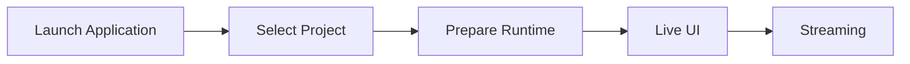
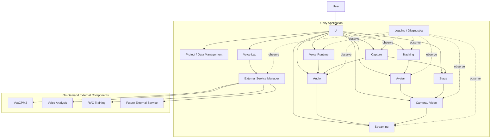
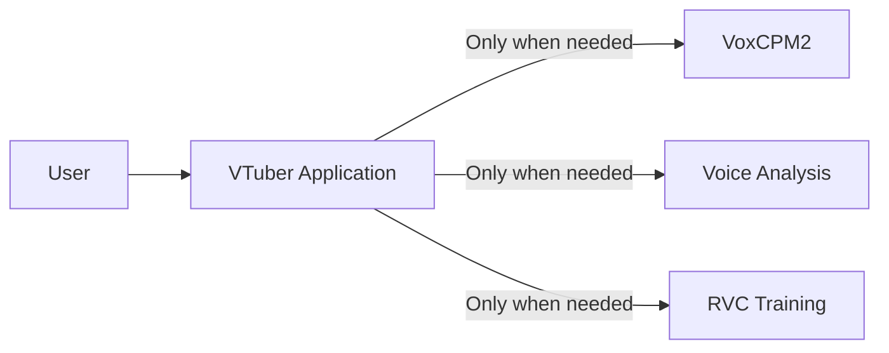
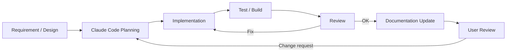

# Virtual Vessel Studio System Design

## Table of Contents

1. System Overview
2. Overall System Architecture
3. Development and Operations
4. External Service Management
5. Logging and Diagnostics
6. Project, Configuration, and Data Management
7. 3D Avatar Control
8. Tracking
9. Voice Conversion
10. Video Input, Camera, and Video Output
11. Stage Management
12. BGM, SE, and Audio Management
13. Voice Model Training and Voice Lab
14. UI and Operation
15. Non-functional Design
16. Future Extension Policy
    
---

# 1. System Overview

## 1.1 Purpose

The purpose of this system is to integrate functions such as 3D avatars, real-time tracking, voice conversion, stages, BGM/SE, video generation, live streaming, and voice model creation, and to provide **an integrated environment in which all operations required for VTuber streaming can be performed from a single application**.

In a typical VTuber streaming environment,

- 3D avatar display
- face / body tracking
- voice conversion
- audio mixing
- streaming
- recording
- voice model training
- external tools

may each be provided by separate applications or scripts.

In that case, the user must launch and configure multiple applications and manage device routing, windows, external processes, and so on.

This system integrates these as far as possible and consolidates what the user operates into **a single VTuber application (Virtual Vessel Studio)**.

The purpose is also not simply to pack multiple functions into one application, but to

- separate responsibilities by function
- limit dependencies on external OSS
- separate the streaming runtime from setup / training
- remain adaptable to future technology changes in tracking, voice, streaming, etc.
- keep a structure that can be continuously developed and maintained as OSS

### Rationale

VTuber streaming involves many technologies and devices. If each function is provided as a separate application, the user has to understand and operate the internal structure.

The fundamental value of this system is to

**absorb the complex internal structure on the application side and provide the user with an integrated operating environment.**

---

## 1.2 Scope

This system mainly covers the following functions.

### 3D Avatar

- VRM 1.0 and later
- FBX
- avatar registration
- avatar switching
- pose control
- expression control
- extension bone control
- extension elements such as cat ears and tails

### Tracking

- camera-based tracking
- face tracking
- body tracking
- hand tracking
- MediaPipe
- future tracking providers such as mocopi

### Voice Conversion

- microphone input
- real-time voice conversion with RVC
- post-processing such as pitch
- voice model selection
- output to virtual microphones, etc.

### Voice Lab

- voice generation
- voice clone
- dataset creation
- voice analysis
- RVC training
- training history
- model evaluation
- registering voice models for runtime

### Stage

- 3D stages
- stage switching
- camera points
- avatar spawn points
- lighting
- stage effects
- screen surfaces that display capture textures

### Audio

- voice
- BGM
- SE
- game / capture audio
- audio mixing
- monitor output
- stream audio

### Capture

- capture-board video and audio input via GameCapture
- sub-monitor video input via SubScreenCapture
- preview and on/off of capture sources
- supplying video to screen surfaces on the stage

### Camera / Video

- main camera
- camera point switching
- streaming render target
- diagnostic camera
- video encoding
- recording

### Streaming

- YouTube Live
- audio / video synchronization
- streaming via RTMPS, etc.
- streaming state management

### Project / Data

- project
- profile
- asset
- Data Root
- backup
- import / export
- migration
- credential management

### Developer / Diagnostics

- logging
- runtime diagnostics
- performance monitoring
- external process monitoring
- diagnostic camera
- diagnostics export

---

Items outside the scope of this system, or not required for the initial implementation, are treated as future extensions.

Examples:

- simultaneous multi-person streaming
- a complete plugin SDK
- simultaneous support for many streaming services
- support for every 3D model format
- support for every motion capture device

### Rationale

Implementing every future function from the start would make the system excessively complex relative to the functions currently needed.

Therefore, the implementation focuses on currently needed functions while providing extensible boundaries where future changes are expected.

---

## 1.3 Basic Policies

The basic policies of this system are as follows.

### Provide a Single Application

From a normal user's point of view, the system is provided as one Unity application.

Even when Python services or external OSS are used internally, normal users are not made aware of

- the command prompt
- Python
- venv
- ports
- Git
- the internal structure of external OSS

---

### Unity at the Center of the Runtime

The main functions required during streaming run centered on Unity.

Examples:

- avatar
- tracking
- voice conversion
- audio
- camera
- stage
- streaming
- UI

In particular, real-time voice conversion with RVC runs inside the Unity runtime, and no Python service is required during streaming.

---

### Python Mainly for Setup, Training, and Analysis

Python is mainly used for:

- voice generation
- voice clone
- RVC training
- voice analysis
- model conversion
- external OSS setup

These are started only when needed.

---

### Separate Setup and Runtime

For each function,

- registration
- analysis
- training
- mapping
- detailed configuration

and similar work are performed on the setup side.

The streaming runtime loads assets and profiles that have already been set up and performs processing that is as lightweight as possible.

---

### Do Not Expose External OSS Directly in the Application Design

External OSS such as RVC and VoxCPM2 is used through boundaries such as adapters / wrappers.

Modifying external OSS itself is avoided as far as possible.

---

### Separate Responsibilities by Module

The whole application is not consolidated into a giant manager.

Avatar, Tracking, Voice, Streaming, etc. are treated as independent modules that cooperate through clear interfaces and data contracts.

---

### Separate Information for Normal Users and Developers

Normal users see only the necessary state and operations.

Developers can sufficiently observe

- detailed logs
- performance
- internal state
- external processes
- versions
- exceptions

and similar information.

---

### Consider Future Extensions

Without making the initial implementation excessively complex, the structure remains extensible to

- new tracking providers
- new voice converters
- new avatar formats
- new streaming services
- new locales
- multiple avatars

and so on.

---

### Maintainable as OSS

This system is intended to be published as OSS on GitHub or similar.

Therefore,

- module boundaries
- documentation
- tests
- logging
- external dependencies
- version management
- migration

and similar concerns are considered from the design stage.

---

## 1.4 Expected Usage Patterns

This system broadly assumes the following usage patterns.

### Normal Streaming

The user loads already registered

- avatar
- tracking profile
- voice model
- stage
- streaming profile

and so on from a project and starts streaming.

The basic flow is as follows.



During normal streaming, there is no need to start Python or the Voice Lab environment.

---

### Pre-stream Setup

Avatar, Tracking, Voice, Stage, Streaming, etc. are configured.

Example:

```text
Avatar Import
Tracking Setup
Voice Setup
Stage Setup
Camera Setup
Audio Setup
Streaming Setup
Project Save
```

Each setup screen provides previews and tests where practical.

---

### Voice Lab

Used when creating a new voice model.

The basic flow is as follows.

```text
Generate
   ↓
Clone
   ↓
Dataset
   ↓
Train RVC
   ↓
Evaluate
   ↓
Register for Runtime
```

Only while Voice Lab is in use are external services / processes such as VoxCPM2, voice analysis, and RVC training started as needed.

---

### Developer / Diagnostics

In Developer Mode, the following can be checked:

- runtime state
- logging
- diagnostic camera
- tracking information
- audio information
- streaming information
- external service state

Normal users are not required to understand this internal structure.

---

---

# 2. Overall System Architecture

## 2.1 Overall Architecture

This system is built around a Unity application.

The main streaming runtime functions are placed inside Unity, and local external services / processes are used as needed for training, generation, analysis, etc.

The conceptual overall structure is shown below.



The arrows in the diagram mainly indicate

- control requests
- data transfer
- state references

and do not necessarily mean direct references between classes.

### Rationale

Placing Unity at the center of the application allows functions that cooperate during streaming, such as

- 3D rendering
- tracking
- audio
- UI
- streaming

to be handled on the same runtime.

At the same time, separating heavy setup processing such as training into external services avoids bringing unnecessary Python dependencies into the streaming runtime.

---

## 2.2 Division of Roles Between Unity and External Services

The responsibilities of Unity and external services are clearly separated.

### Unity Side

Mainly responsible for:

- application lifecycle
- UI
- project management
- avatar
- tracking
- runtime voice conversion
- audio mixing
- video input such as GameCapture / SubScreenCapture
- stage
- camera
- rendering
- streaming
- recording
- diagnostics
- external service lifecycle management

### External Service / Process Side

Mainly responsible for:

- voice generation
- voice clone
- voice analysis
- RVC training
- dataset processing
- model conversion
- other setup / analysis processing

### Basic Principle

Except for processing that can only be performed by an external service, the main streaming runtime does not depend on external services.

### Rationale

Separating the streaming runtime from the training environment limits the impact on normal streaming with registered assets even when

- Python environment failures
- external service failures
- dependency errors

occur.

---

## 2.3 Single-application UX with Internal Multi-service Structure

From the user's point of view, the system is a single application.

Internally, multiple processes such as

- the Unity runtime
- the VoxCPM2 service
- the voice analysis service
- the RVC training process

may exist.

However, normal users do not need to start or stop them individually.



The normal UI does not display

- ports
- PIDs
- venv
- Python commands

and similar details.

For example, when voice generation is started, it is displayed as user-facing states such as

```text
Preparing the voice generation service
        ↓
Available
        ↓
Generating voice
```

### Rationale

Even if the internal structure is complex, the way the application is used does not have to be complex.

Maintaining a single-application UX reduces the user's burden of environment setup and operation.

---

## 2.4 Module Division Policy

The inside of the system is divided into modules by responsibility.

The main modules are assumed to be:

```text
Application
Project / Data
Avatar
Tracking
Voice
Audio
Capture
Stage
Video
Streaming
VoiceLab
ExternalServices
Diagnostics
UI
```

Each module manages the internal implementation required for its responsibility.

For example, the Avatar module internally has

- avatar loading
- avatar runtime
- skeleton
- pose
- expression
- extension motion

The Tracking module manages

- providers
- normalization
- filtering
- calibration

The Capture module manages

- capture sources
- the GameCapture adapter
- the SubScreenCapture adapter
- capture state
- passing capture textures / audio

### Module Division Principles

The basics are:

1. One module does not directly manage the internal implementation of multiple functions.
2. A module does not freely depend on the internal classes of other modules.
3. The externally exposed interface is limited.
4. Internal changes in a module do not propagate to other modules.
5. No giant global manager is created.

### Rationale

Consolidating everything into a single application manager or similar

- makes responsibilities unclear
- makes unit testing difficult
- widens the impact of changes
- makes it harder for Claude Code to determine the scope of a change

---

## 2.5 Inter-module Cooperation

Inter-module cooperation uses the following according to purpose:

- interface
- data contract
- command
- event
- service
- runtime state

Directly referencing concrete classes inside a module is not the default.

---

### Interface

Used as a stable boundary for using functions from other modules.

Examples:

```text
IAvatarLoader
ITrackingProvider
IVoiceConverter
IVideoCaptureSource
IAudioCaptureSource
IVideoEncoder
IStreamPublisher
```

### Data Contract

Used when passing data between modules.

Examples:

```text
TrackingFrame
AvatarPose
ExpressionSignal
CaptureSourceInfo
CaptureFrameInfo
FinalStreamAudio
```

### Command

Passes operation requests from user operations or external input to the runtime.

Examples:

```text
SwitchAvatarCommand
SwitchCameraCommand
PlaySeCommand
ToggleMuteCommand
```

### Event

Used when state changes and similar need to be notified to multiple modules.

Examples:

```text
ProjectChanged
AvatarChanged
StageChanged
StreamingStateChanged
```

### Runtime State

Used to expose the current state to the UI and diagnostics.

The UI does not directly reference internal variables of modules.

---

### Suppressing Direct Dependencies

For example, the UI does not directly call a concrete implementation, as in

```text
Button
  ↓
VrmAvatarLoader
```

Instead, it uses

```text
Button
  ↓
Command
  ↓
Avatar Module
  ↓
Internal implementation
```

### Rationale

This allows the same processing to be reused from different input sources such as the UI, external devices, and automation.

Reducing dependencies on concrete classes also limits the impact of internal implementation changes.

---

## 2.6 Common Data Formats and Abstraction Policy

Data used between modules avoids, as far as possible, directly using formats specific to a particular library or external OSS.

Data is converted into system-wide data contracts before use.

### Tracking

For example, MediaPipe-specific landmark information is not passed directly to the Avatar module.

```text
MediaPipe Data
      ↓
Tracking Provider
      ↓
TrackingFrame
      ↓
Avatar Module
```

### Avatar

VRM- or FBX-specific bone structures are not exposed to the Tracking module.

```text
VRM / FBX
   ↓
Skeleton Mapping
   ↓
Common Avatar Bone
```

### Expression

VRM expressions and FBX blend shapes are not handled directly on the face tracking side.

```text
Face Tracking
      ↓
Expression Signal
      ↓
Expression Mapping
      ↓
VRM / FBX
```

### Voice

RVC-specific processing is not exposed to the audio mixer, etc.

```text
Audio Input
    ↓
IVoiceConverter
    ↓
Converted Audio
    ↓
Audio Processing
```

### Capture

Concrete capture implementations such as GameCaptureUnityPlugin and DXGI Desktop Duplication are not exposed directly to the Stage or Video modules.

```text
Capture Board / DXGI Desktop Duplication
      ↓
Capture Adapter
      ↓
IVideoCaptureSource / IAudioCaptureSource
      ↓
Capture Texture / Capture Audio
      ↓
Stage / Audio Module
```

GameCapture is treated as a capture source that can provide both video and audio, and SubScreenCapture provides only video in the initial implementation.

A capture source is responsible only for acquiring video. Where on the stage the acquired video is displayed is the responsibility of the Stage module, and how the final video is streamed or recorded is the responsibility of the Video / Streaming modules.

### Streaming

Streaming-service-specific processing is not exposed to rendering.

```text
Render / Audio
      ↓
Encoder
      ↓
Encoded Stream
      ↓
IStreamPublisher
```

---

### Principles of Common Data Formats

Common data contracts are kept as independent as possible from specific technologies such as

- model format
- tracking library
- voice engine
- capture backend
- streaming service

They also include, as needed,

- timestamp
- confidence
- state
- version

### Rationale

If external library types are used directly at module boundaries, changing that library requires changing many modules.

Converting from specific technologies into a common representation once limits the scope of changes.

---

---

# 3. Development and Operations

## 3.1 Basic Development Policy

This system is developed on the assumption of long-term feature additions and publication as OSS.

Development continuously performs

- design
- implementation
- testing
- review
- documentation
- refactoring

The emphasis is not only on adding features but also on maintaining module boundaries and design rules.

Development agents such as Claude Code are also actively used.

### Basic Principles

1. Implement based on the system design.
2. Respect module responsibilities.
3. Minimize changes to external OSS.
4. Add tests together with the implementation.
5. Treat logging / diagnostics as part of feature implementation.
6. Update documentation when specifications change.
7. Consider performance regressions.
8. Include security / privacy in reviews.
9. Avoid concentration in giant classes or global singletons.
10. Delegate automatable work to development agents.

### Rationale

In a system with many functions, repeated ad hoc implementation tends to break the design.

Building implementation rules and design documents into the development process prevents quality from declining as features are added.

---

## 3.2 Development Automation with Claude Code

Claude Code is used as the main development agent for this system.

Claude Code is responsible not only for simple code generation but also for the following work:

- checking existing designs
- creating implementation plans
- code implementation
- refactoring
- unit tests
- integration tests
- build verification
- code review
- performance verification
- logging / diagnostics verification
- documentation updates
- UI design
- UI implementation
- visual review
- bug fixes

The conceptual development cycle is as follows.



### Rationale

This system spans many technical domains, such as

- Unity
- C#
- Python
- external OSS
- voice models
- UI
- streaming

Sharing the design rules with a development agent and having it consistently carry out implementation, testing, review, and documentation makes development more efficient.

However, results generated by Claude Code are not adopted unconditionally.

The user also checks the architecture, major specifications, UI, perceived quality, and so on.

---

## 3.3 Repository Structure

The repository is structured so that functional responsibilities and the boundaries between the runtime and external services are easy to understand.

A conceptual example is shown below.

```text
virtual-vessel-studio/
├─ CLAUDE.md
├─ README.md
│
├─ docs/
│  ├─ ja/
│  │  ├─ architecture/
│  │  ├─ detailed-design/
│  │  ├─ development/
│  │  ├─ decisions/
│  │  └─ ui/
│  │     ├─ design-system.md
│  │     ├─ ui-guidelines.md
│  │     ├─ components.md
│  │     └─ screens/
│  │
│  └─ en/
│     └─ (same structure as ja)
│
├─ unity/
│  └─ VirtualVesselStudio/
│     ├─ Assets/
│     │  ├─ Application/
│     │  ├─ Project/
│     │  ├─ Avatar/
│     │  ├─ Tracking/
│     │  ├─ Voice/
│     │  ├─ Audio/
│     │  ├─ Capture/
│     │  ├─ Stage/
│     │  ├─ Video/
│     │  ├─ Streaming/
│     │  ├─ VoiceLab/
│     │  ├─ ExternalServices/
│     │  ├─ Diagnostics/
│     │  └─ UI/
│     ├─ Packages/
│     └─ ProjectSettings/
│
├─ native/
│
├─ services/
│  ├─ voxcpm/
│  ├─ voice-analysis/
│  └─ adapters/
│
├─ tests/
│  ├─ unit/
│  ├─ integration/
│  ├─ system/
│  └─ performance/
│
└─ tools/
```

The actual Unity project structure, etc. will be adjusted during implementation.

What matters is not the directories themselves but that responsibility boundaries can be understood from the repository structure.

---

### docs

Holds designs, specifications, rationale for decisions, etc.

The Japanese version is placed in `docs/ja/` and the English version in `docs/en/`, and the same document uses the same relative path.

### unity

Holds the main body of the Unity application.

The Unity project root is `unity/VirtualVesselStudio/`.

Responsibilities are separated by functional module.

### native

Holds project-owned native Windows code and native plugins.

### services

Holds project-managed wrappers, adapters, launchers, etc. for external services.

External OSS itself is not mixed with project-owned code.

### tests

Manages unit, integration, and system tests by purpose.

Product performance measurements such as RVC latency, capture performance, and long-run operation are placed under `tests/performance/`.

Historical benchmark / prototype implementations are reference snapshots outside the repository and are not copied into this repository.

### tools

Manages auxiliary tools for build, setup, conversion, development support, etc.

### Rationale

Bringing the repository structure close to the architecture structure makes it easier for developers and Claude Code to determine what to change.

---

## 3.4 CLAUDE.md

A `CLAUDE.md` is placed at the repository root to define common rules that Claude Code always follows during development.

`CLAUDE.md` describes at least the following.

### Architecture Rule

- the application is Unity-centered
- separate setup and runtime
- respect module boundaries
- use external OSS through adapters / wrappers
- other modules do not depend directly on a module's internal implementation

### Code Rule

- do not create giant managers
- do not create unnecessary singletons
- prefer interfaces / data contracts
- keep the public API to the necessary minimum
- add comments that explain the design intent of non-obvious processing

### External OSS Rule

- do not change external OSS itself as far as possible
- place required custom processing on the application side
- pin and manage versions
- if a custom patch is required, record the reason in the documentation

### Test Rule

- add the required tests for new features
- add regression tests for bug fixes where practical
- prefer module-level tests
- check for performance degradation in performance-critical processing

### Diagnostics Rule

- leave sufficient developer context on errors
- separate user notifications from developer logs
- do not output secrets to logs
- do not output excessive logs in high-frequency processing

### UI Rule

- follow the design system
- prefer existing components
- use Unity Localization
- check in Japanese / English
- do not specify fonts individually
- perform visual review with screenshots

### Documentation Rule

- update related documents when the architecture changes
- add new design patterns to the documentation when introduced
- do not leave mismatches between implementation and documentation

### Rationale

Explaining architecture rules to Claude Code in each individual prompt tends to cause missed instructions and inconsistent decisions.

Placing them in the repository as persistent development rules increases consistency when making changes.

---

## 3.5 Testing, Review, and Documentation Updates

The condition for completing a feature implementation is not only that the code works.

As a rule, one development cycle runs through

```text
Implementation
      ↓
Build
      ↓
Test
      ↓
Review
      ↓
Documentation
      ↓
User confirmation
```

---

### Unit Test

Verifies individual classes and algorithms.

Examples:

- data conversion
- profile validation
- mapping
- state transitions
- commands

---

### Integration Test

Verifies cooperation between modules.

Examples:

```text
Tracking → Avatar
Voice → Audio
GameCapture → Capture / Audio
SubScreenCapture → Capture / Stage
Audio → Streaming
Project → Runtime
Voice Lab → External Service
```

---

### System Test

Verifies the Unity application as a whole.

Examples:

- application startup
- project load
- avatar display
- tracking
- voice conversion
- stage
- streaming
- recording

---

### Performance Test

For real-time processing, performance is also verified as needed.

Examples:

- RVC latency
- tracking processing time
- frame time
- encoding time

---

### Review

Self review by Claude Code checks at least the following:

- architecture compliance
- module boundaries
- code quality
- error handling
- diagnostics
- security
- privacy
- performance
- test coverage
- documentation

---

### UI Review

For the UI, the actual screens are checked with screenshots, etc., and Claude Code itself also reviews

- spacing
- alignment
- visual hierarchy
- Japanese
- English
- fonts
- design system compliance

and so on.

Ultimately, the user also checks the UI.

---

### Documentation Updates

When any of the following changes, related documents are also updated.

- interfaces
- data formats
- directory structure
- setup approach
- UI
- external components
- project format
- architecture

### Rationale

If only the implementation is updated and the documentation becomes stale, later developers and Claude Code may make changes based on incorrect assumptions.

Documentation is also treated as a component of the system.

---

## 3.6 Development Policy as OSS

This system assumes a structure that can be published as OSS.

Therefore, states that only a specific development environment or developer can understand are avoided as far as possible.

---

### Making External Dependencies Explicit

For the external libraries, OSS, and tools used,

- name
- version
- license
- purpose of use

can be identified.

---

### Separation from External OSS

External OSS itself, such as RVC and VoxCPM2, is clearly separated from this system's own implementation.

Project-specific functions are, as a rule, implemented as

- adapters
- wrappers
- launchers
- application-side processing

### Rationale

Heavily modifying external OSS directly makes it difficult to follow upstream versions.

---

### Reproducible Development and Distribution Environments

For external components that use Python, the **development environment** and the **distribution environment for normal users** are managed separately.

In the development environment, for each component,

- external OSS version / commit
- Python version
- dependency definition / lock
- venv
- build procedure
- test procedure

are made explicit, and excessive dependence on each developer's global Python environment is avoided.

For normal users, a portable runtime package or standalone executable generated from the development environment by the build pipeline is provided, in which

- runtime package version
- Python runtime version
- dependency versions
- external OSS version / commit
- adapter version
- build ID
- package hash

and so on can be identified.

Normal users are not required to install or operate Python itself, venv, pip, etc.

venv is mainly an environment for development, testing, and builds, and is kept separate from how the distribution for normal users runs.

Docker is also not a required dependency of the standard development and distribution approach.

---

### Investigability of Issues

To respond to failure reports from users,

- application version
- external component versions
- logs
- diagnostics
- environment

and so on can be checked.

A diagnostics export that does not contain secrets can be provided.

---

### Structure Easy for Contributors to Understand

The goal is that, within the repository, one can check

- architecture
- module responsibilities
- setup
- build
- test
- coding rules
- external dependencies

---

### Preventing Secrets from Entering the Repository

The following are not committed to the repository.

- stream keys
- OAuth tokens
- passwords
- API keys
- personal credentials

The application runtime also does not store secrets in normal configuration files or logs.

---

### Patch Management

If a custom patch to external OSS becomes necessary,

- the patch content
- the reason for the patch
- the target version
- the difference from upstream
- whether it can be removed in the future

are recorded in the documentation.

### Rationale

This makes it possible to determine, when updating external OSS in the future, whether the custom changes are still needed.

---

### Recording Development Decisions

For important architecture changes, design decisions are recorded as needed in

```text
docs/<lang>/decisions/
```

or similar.

Examples:

- why RVC runs in the Unity runtime
- why the streaming runtime does not depend on Python
- why external OSS is not modified
- why UI Toolkit was adopted

### Rationale

Over time, "why this structure exists" tends to be lost.

Recording not only the final structure but also the main reasons for decisions makes future change decisions easier.

---

### Basic Principles of OSS Development

This system adopts the following basic principles for development as OSS.

1. Document the architecture and module responsibilities.
2. Clearly separate external OSS from project-owned implementation.
3. Minimize direct modification of external OSS.
4. Manage the versions of external dependencies.
5. Reduce dependence on global development environments.
6. Maintain a testable module structure.
7. Provide sufficient logging / diagnostics.
8. Do not include secrets in the repository, logs, or diagnostics.
9. Update documentation when the architecture changes.
10. Make changes by Claude Code follow the same development rules.
11. Besides automated review by Claude Code, have the user check the results as needed.
12. Maintain a structure that future contributors can understand and change.


---

---

