# Virtual Vessel Studio System Design

## Table of Contents

1. System Overview
2. Overall System Architecture
3. Development and Operations
4. External Service Management
5. Logging and Diagnostics
6. Project, Configuration, and Data Management
7. 3D Avatar Control
8. Tracking
9. Voice Conversion
10. Video Input, Camera, and Video Output
11. Stage Management
12. BGM, SE, and Audio Management
13. Voice Model Training and Voice Lab
14. UI and Operation
15. Non-functional Design
16. Future Extension Policy
    
---

# 1. System Overview

## 1.1 Purpose

The purpose of this system is to integrate functions such as 3D avatars, real-time tracking, voice conversion, stages, BGM/SE, video generation, live streaming, and voice model creation, and to provide **an integrated environment in which all operations required for VTuber streaming can be performed from a single application**.

In a typical VTuber streaming environment,

- 3D avatar display
- face / body tracking
- voice conversion
- audio mixing
- streaming
- recording
- voice model training
- external tools

may each be provided by separate applications or scripts.

In that case, the user must launch and configure multiple applications and manage device routing, windows, external processes, and so on.

This system integrates these as far as possible and consolidates what the user operates into **a single VTuber application (Virtual Vessel Studio)**.

The purpose is also not simply to pack multiple functions into one application, but to

- separate responsibilities by function
- limit dependencies on external OSS
- separate the streaming runtime from setup / training
- remain adaptable to future technology changes in tracking, voice, streaming, etc.
- keep a structure that can be continuously developed and maintained as OSS

### Rationale

VTuber streaming involves many technologies and devices. If each function is provided as a separate application, the user has to understand and operate the internal structure.

The fundamental value of this system is to

**absorb the complex internal structure on the application side and provide the user with an integrated operating environment.**

---

## 1.2 Scope

This system mainly covers the following functions.

### 3D Avatar

- VRM 1.0 and later
- FBX
- avatar registration
- avatar switching
- pose control
- expression control
- extension bone control
- extension elements such as cat ears and tails

### Tracking

- camera-based tracking
- face tracking
- body tracking
- hand tracking
- MediaPipe
- future tracking providers such as mocopi

### Voice Conversion

- microphone input
- real-time voice conversion with RVC
- post-processing such as pitch
- voice model selection
- output to virtual microphones, etc.

### Voice Lab

- voice generation
- voice clone
- dataset creation
- voice analysis
- RVC training
- training history
- model evaluation
- registering voice models for runtime

### Stage

- 3D stages
- stage switching
- camera points
- avatar spawn points
- lighting
- stage effects
- screen surfaces that display capture textures

### Audio

- voice
- BGM
- SE
- game / capture audio
- audio mixing
- monitor output
- stream audio

### Capture

- capture-board video and audio input via GameCapture
- sub-monitor video input via SubScreenCapture
- preview and on/off of capture sources
- supplying video to screen surfaces on the stage

### Camera / Video

- main camera
- camera point switching
- streaming render target
- diagnostic camera
- video encoding
- recording

### Streaming

- YouTube Live
- audio / video synchronization
- streaming via RTMPS, etc.
- streaming state management

### Project / Data

- project
- profile
- asset
- Data Root
- backup
- import / export
- migration
- credential management

### Developer / Diagnostics

- logging
- runtime diagnostics
- performance monitoring
- external process monitoring
- diagnostic camera
- diagnostics export

---

Items outside the scope of this system, or not required for the initial implementation, are treated as future extensions.

Examples:

- simultaneous multi-person streaming
- a complete plugin SDK
- simultaneous support for many streaming services
- support for every 3D model format
- support for every motion capture device

### Rationale

Implementing every future function from the start would make the system excessively complex relative to the functions currently needed.

Therefore, the implementation focuses on currently needed functions while providing extensible boundaries where future changes are expected.

---

## 1.3 Basic Policies

The basic policies of this system are as follows.

### Provide a Single Application

From a normal user's point of view, the system is provided as one Unity application.

Even when Python services or external OSS are used internally, normal users are not made aware of

- the command prompt
- Python
- venv
- ports
- Git
- the internal structure of external OSS

---

### Unity at the Center of the Runtime

The main functions required during streaming run centered on Unity.

Examples:

- avatar
- tracking
- voice conversion
- audio
- camera
- stage
- streaming
- UI

In particular, real-time voice conversion with RVC runs inside the Unity runtime, and no Python service is required during streaming.

---

### Python Mainly for Setup, Training, and Analysis

Python is mainly used for:

- voice generation
- voice clone
- RVC training
- voice analysis
- model conversion
- external OSS setup

These are started only when needed.

---

### Separate Setup and Runtime

For each function,

- registration
- analysis
- training
- mapping
- detailed configuration

and similar work are performed on the setup side.

The streaming runtime loads assets and profiles that have already been set up and performs processing that is as lightweight as possible.

---

### Do Not Expose External OSS Directly in the Application Design

External OSS such as RVC and VoxCPM2 is used through boundaries such as adapters / wrappers.

Modifying external OSS itself is avoided as far as possible.

---

### Separate Responsibilities by Module

The whole application is not consolidated into a giant manager.

Avatar, Tracking, Voice, Streaming, etc. are treated as independent modules that cooperate through clear interfaces and data contracts.

---

### Separate Information for Normal Users and Developers

Normal users see only the necessary state and operations.

Developers can sufficiently observe

- detailed logs
- performance
- internal state
- external processes
- versions
- exceptions

and similar information.

---

### Consider Future Extensions

Without making the initial implementation excessively complex, the structure remains extensible to

- new tracking providers
- new voice converters
- new avatar formats
- new streaming services
- new locales
- multiple avatars

and so on.

---

### Maintainable as OSS

This system is intended to be published as OSS on GitHub or similar.

Therefore,

- module boundaries
- documentation
- tests
- logging
- external dependencies
- version management
- migration

and similar concerns are considered from the design stage.

---

## 1.4 Expected Usage Patterns

This system broadly assumes the following usage patterns.

### Normal Streaming

The user loads already registered

- avatar
- tracking profile
- voice model
- stage
- streaming profile

and so on from a project and starts streaming.

The basic flow is as follows.

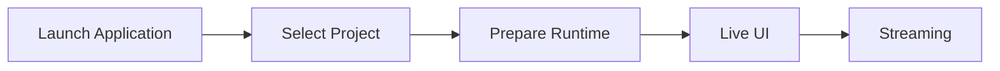

During normal streaming, there is no need to start Python or the Voice Lab environment.

---

### Pre-stream Setup

Avatar, Tracking, Voice, Stage, Streaming, etc. are configured.

Example:

```text
Avatar Import
Tracking Setup
Voice Setup
Stage Setup
Camera Setup
Audio Setup
Streaming Setup
Project Save
```

Each setup screen provides previews and tests where practical.

---

### Voice Lab

Used when creating a new voice model.

The basic flow is as follows.

```text
Generate
   ↓
Clone
   ↓
Dataset
   ↓
Train RVC
   ↓
Evaluate
   ↓
Register for Runtime
```

Only while Voice Lab is in use are external services / processes such as VoxCPM2, voice analysis, and RVC training started as needed.

---

### Developer / Diagnostics

In Developer Mode, the following can be checked:

- runtime state
- logging
- diagnostic camera
- tracking information
- audio information
- streaming information
- external service state

Normal users are not required to understand this internal structure.

---

---

# 2. Overall System Architecture

## 2.1 Overall Architecture

This system is built around a Unity application.

The main streaming runtime functions are placed inside Unity, and local external services / processes are used as needed for training, generation, analysis, etc.

The conceptual overall structure is shown below.

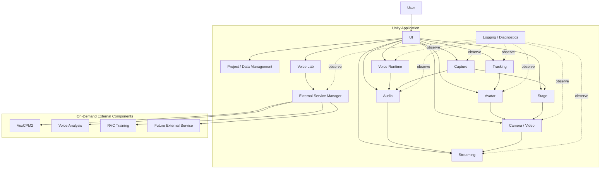

The arrows in the diagram mainly indicate

- control requests
- data transfer
- state references

and do not necessarily mean direct references between classes.

### Rationale

Placing Unity at the center of the application allows functions that cooperate during streaming, such as

- 3D rendering
- tracking
- audio
- UI
- streaming

to be handled on the same runtime.

At the same time, separating heavy setup processing such as training into external services avoids bringing unnecessary Python dependencies into the streaming runtime.

---

## 2.2 Division of Roles Between Unity and External Services

The responsibilities of Unity and external services are clearly separated.

### Unity Side

Mainly responsible for:

- application lifecycle
- UI
- project management
- avatar
- tracking
- runtime voice conversion
- audio mixing
- video input such as GameCapture / SubScreenCapture
- stage
- camera
- rendering
- streaming
- recording
- diagnostics
- external service lifecycle management

### External Service / Process Side

Mainly responsible for:

- voice generation
- voice clone
- voice analysis
- RVC training
- dataset processing
- model conversion
- other setup / analysis processing

### Basic Principle

Except for processing that can only be performed by an external service, the main streaming runtime does not depend on external services.

### Rationale

Separating the streaming runtime from the training environment limits the impact on normal streaming with registered assets even when

- Python environment failures
- external service failures
- dependency errors

occur.

---

## 2.3 Single-application UX with Internal Multi-service Structure

From the user's point of view, the system is a single application.

Internally, multiple processes such as

- the Unity runtime
- the VoxCPM2 service
- the voice analysis service
- the RVC training process

may exist.

However, normal users do not need to start or stop them individually.

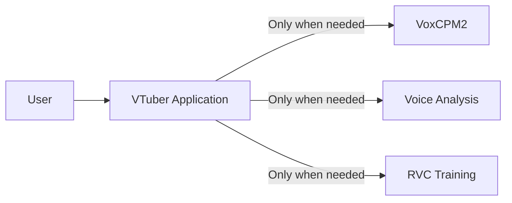

The normal UI does not display

- ports
- PIDs
- venv
- Python commands

and similar details.

For example, when voice generation is started, it is displayed as user-facing states such as

```text
Preparing the voice generation service
        ↓
Available
        ↓
Generating voice
```

### Rationale

Even if the internal structure is complex, the way the application is used does not have to be complex.

Maintaining a single-application UX reduces the user's burden of environment setup and operation.

---

## 2.4 Module Division Policy

The inside of the system is divided into modules by responsibility.

The main modules are assumed to be:

```text
Application
Project / Data
Avatar
Tracking
Voice
Audio
Capture
Stage
Video
Streaming
VoiceLab
ExternalServices
Diagnostics
UI
```

Each module manages the internal implementation required for its responsibility.

For example, the Avatar module internally has

- avatar loading
- avatar runtime
- skeleton
- pose
- expression
- extension motion

The Tracking module manages

- providers
- normalization
- filtering
- calibration

The Capture module manages

- capture sources
- the GameCapture adapter
- the SubScreenCapture adapter
- capture state
- passing capture textures / audio

### Module Division Principles

The basics are:

1. One module does not directly manage the internal implementation of multiple functions.
2. A module does not freely depend on the internal classes of other modules.
3. The externally exposed interface is limited.
4. Internal changes in a module do not propagate to other modules.
5. No giant global manager is created.

### Rationale

Consolidating everything into a single application manager or similar

- makes responsibilities unclear
- makes unit testing difficult
- widens the impact of changes
- makes it harder for Claude Code to determine the scope of a change

---

## 2.5 Inter-module Cooperation

Inter-module cooperation uses the following according to purpose:

- interface
- data contract
- command
- event
- service
- runtime state

Directly referencing concrete classes inside a module is not the default.

---

### Interface

Used as a stable boundary for using functions from other modules.

Examples:

```text
IAvatarLoader
ITrackingProvider
IVoiceConverter
IVideoCaptureSource
IAudioCaptureSource
IVideoEncoder
IStreamPublisher
```

### Data Contract

Used when passing data between modules.

Examples:

```text
TrackingFrame
AvatarPose
ExpressionSignal
CaptureSourceInfo
CaptureFrameInfo
FinalStreamAudio
```

### Command

Passes operation requests from user operations or external input to the runtime.

Examples:

```text
SwitchAvatarCommand
SwitchCameraCommand
PlaySeCommand
ToggleMuteCommand
```

### Event

Used when state changes and similar need to be notified to multiple modules.

Examples:

```text
ProjectChanged
AvatarChanged
StageChanged
StreamingStateChanged
```

### Runtime State

Used to expose the current state to the UI and diagnostics.

The UI does not directly reference internal variables of modules.

---

### Suppressing Direct Dependencies

For example, the UI does not directly call a concrete implementation, as in

```text
Button
  ↓
VrmAvatarLoader
```

Instead, it uses

```text
Button
  ↓
Command
  ↓
Avatar Module
  ↓
Internal implementation
```

### Rationale

This allows the same processing to be reused from different input sources such as the UI, external devices, and automation.

Reducing dependencies on concrete classes also limits the impact of internal implementation changes.

---

## 2.6 Common Data Formats and Abstraction Policy

Data used between modules avoids, as far as possible, directly using formats specific to a particular library or external OSS.

Data is converted into system-wide data contracts before use.

### Tracking

For example, MediaPipe-specific landmark information is not passed directly to the Avatar module.

```text
MediaPipe Data
      ↓
Tracking Provider
      ↓
TrackingFrame
      ↓
Avatar Module
```

### Avatar

VRM- or FBX-specific bone structures are not exposed to the Tracking module.

```text
VRM / FBX
   ↓
Skeleton Mapping
   ↓
Common Avatar Bone
```

### Expression

VRM expressions and FBX blend shapes are not handled directly on the face tracking side.

```text
Face Tracking
      ↓
Expression Signal
      ↓
Expression Mapping
      ↓
VRM / FBX
```

### Voice

RVC-specific processing is not exposed to the audio mixer, etc.

```text
Audio Input
    ↓
IVoiceConverter
    ↓
Converted Audio
    ↓
Audio Processing
```

### Capture

Concrete capture implementations such as GameCaptureUnityPlugin and DXGI Desktop Duplication are not exposed directly to the Stage or Video modules.

```text
Capture Board / DXGI Desktop Duplication
      ↓
Capture Adapter
      ↓
IVideoCaptureSource / IAudioCaptureSource
      ↓
Capture Texture / Capture Audio
      ↓
Stage / Audio Module
```

GameCapture is treated as a capture source that can provide both video and audio, and SubScreenCapture provides only video in the initial implementation.

A capture source is responsible only for acquiring video. Where on the stage the acquired video is displayed is the responsibility of the Stage module, and how the final video is streamed or recorded is the responsibility of the Video / Streaming modules.

### Streaming

Streaming-service-specific processing is not exposed to rendering.

```text
Render / Audio
      ↓
Encoder
      ↓
Encoded Stream
      ↓
IStreamPublisher
```

---

### Principles of Common Data Formats

Common data contracts are kept as independent as possible from specific technologies such as

- model format
- tracking library
- voice engine
- capture backend
- streaming service

They also include, as needed,

- timestamp
- confidence
- state
- version

### Rationale

If external library types are used directly at module boundaries, changing that library requires changing many modules.

Converting from specific technologies into a common representation once limits the scope of changes.

---

---

# 3. Development and Operations

## 3.1 Basic Development Policy

This system is developed on the assumption of long-term feature additions and publication as OSS.

Development continuously performs

- design
- implementation
- testing
- review
- documentation
- refactoring

The emphasis is not only on adding features but also on maintaining module boundaries and design rules.

Development agents such as Claude Code are also actively used.

### Basic Principles

1. Implement based on the system design.
2. Respect module responsibilities.
3. Minimize changes to external OSS.
4. Add tests together with the implementation.
5. Treat logging / diagnostics as part of feature implementation.
6. Update documentation when specifications change.
7. Consider performance regressions.
8. Include security / privacy in reviews.
9. Avoid concentration in giant classes or global singletons.
10. Delegate automatable work to development agents.

### Rationale

In a system with many functions, repeated ad hoc implementation tends to break the design.

Building implementation rules and design documents into the development process prevents quality from declining as features are added.

---

## 3.2 Development Automation with Claude Code

Claude Code is used as the main development agent for this system.

Claude Code is responsible not only for simple code generation but also for the following work:

- checking existing designs
- creating implementation plans
- code implementation
- refactoring
- unit tests
- integration tests
- build verification
- code review
- performance verification
- logging / diagnostics verification
- documentation updates
- UI design
- UI implementation
- visual review
- bug fixes

The conceptual development cycle is as follows.

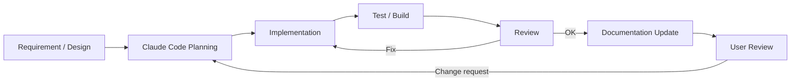

### Rationale

This system spans many technical domains, such as

- Unity
- C#
- Python
- external OSS
- voice models
- UI
- streaming

Sharing the design rules with a development agent and having it consistently carry out implementation, testing, review, and documentation makes development more efficient.

However, results generated by Claude Code are not adopted unconditionally.

The user also checks the architecture, major specifications, UI, perceived quality, and so on.

---

## 3.3 Repository Structure

The repository is structured so that functional responsibilities and the boundaries between the runtime and external services are easy to understand.

A conceptual example is shown below.

```text
virtual-vessel-studio/
├─ CLAUDE.md
├─ README.md
│
├─ docs/
│  ├─ ja/
│  │  ├─ architecture/
│  │  ├─ detailed-design/
│  │  ├─ development/
│  │  ├─ decisions/
│  │  └─ ui/
│  │     ├─ design-system.md
│  │     ├─ ui-guidelines.md
│  │     ├─ components.md
│  │     └─ screens/
│  │
│  └─ en/
│     └─ (same structure as ja)
│
├─ unity/
│  └─ VirtualVesselStudio/
│     ├─ Assets/
│     │  ├─ Application/
│     │  ├─ Project/
│     │  ├─ Avatar/
│     │  ├─ Tracking/
│     │  ├─ Voice/
│     │  ├─ Audio/
│     │  ├─ Capture/
│     │  ├─ Stage/
│     │  ├─ Video/
│     │  ├─ Streaming/
│     │  ├─ VoiceLab/
│     │  ├─ ExternalServices/
│     │  ├─ Diagnostics/
│     │  └─ UI/
│     ├─ Packages/
│     └─ ProjectSettings/
│
├─ native/
│
├─ services/
│  ├─ voxcpm/
│  ├─ voice-analysis/
│  └─ adapters/
│
├─ tests/
│  ├─ unit/
│  ├─ integration/
│  ├─ system/
│  └─ performance/
│
└─ tools/
```

The actual Unity project structure, etc. will be adjusted during implementation.

What matters is not the directories themselves but that responsibility boundaries can be understood from the repository structure.

---

### docs

Holds designs, specifications, rationale for decisions, etc.

The Japanese version is placed in `docs/ja/` and the English version in `docs/en/`, and the same document uses the same relative path.

### unity

Holds the main body of the Unity application.

The Unity project root is `unity/VirtualVesselStudio/`.

Responsibilities are separated by functional module.

### native

Holds project-owned native Windows code and native plugins.

### services

Holds project-managed wrappers, adapters, launchers, etc. for external services.

External OSS itself is not mixed with project-owned code.

### tests

Manages unit, integration, and system tests by purpose.

Product performance measurements such as RVC latency, capture performance, and long-run operation are placed under `tests/performance/`.

Historical benchmark / prototype implementations are reference snapshots outside the repository and are not copied into this repository.

### tools

Manages auxiliary tools for build, setup, conversion, development support, etc.

### Rationale

Bringing the repository structure close to the architecture structure makes it easier for developers and Claude Code to determine what to change.

---

## 3.4 CLAUDE.md

A `CLAUDE.md` is placed at the repository root to define common rules that Claude Code always follows during development.

`CLAUDE.md` describes at least the following.

### Architecture Rule

- the application is Unity-centered
- separate setup and runtime
- respect module boundaries
- use external OSS through adapters / wrappers
- other modules do not depend directly on a module's internal implementation

### Code Rule

- do not create giant managers
- do not create unnecessary singletons
- prefer interfaces / data contracts
- keep the public API to the necessary minimum
- add comments that explain the design intent of non-obvious processing

### External OSS Rule

- do not change external OSS itself as far as possible
- place required custom processing on the application side
- pin and manage versions
- if a custom patch is required, record the reason in the documentation

### Test Rule

- add the required tests for new features
- add regression tests for bug fixes where practical
- prefer module-level tests
- check for performance degradation in performance-critical processing

### Diagnostics Rule

- leave sufficient developer context on errors
- separate user notifications from developer logs
- do not output secrets to logs
- do not output excessive logs in high-frequency processing

### UI Rule

- follow the design system
- prefer existing components
- use Unity Localization
- check in Japanese / English
- do not specify fonts individually
- perform visual review with screenshots

### Documentation Rule

- update related documents when the architecture changes
- add new design patterns to the documentation when introduced
- do not leave mismatches between implementation and documentation

### Rationale

Explaining architecture rules to Claude Code in each individual prompt tends to cause missed instructions and inconsistent decisions.

Placing them in the repository as persistent development rules increases consistency when making changes.

---

## 3.5 Testing, Review, and Documentation Updates

The condition for completing a feature implementation is not only that the code works.

As a rule, one development cycle runs through

```text
Implementation
      ↓
Build
      ↓
Test
      ↓
Review
      ↓
Documentation
      ↓
User confirmation
```

---

### Unit Test

Verifies individual classes and algorithms.

Examples:

- data conversion
- profile validation
- mapping
- state transitions
- commands

---

### Integration Test

Verifies cooperation between modules.

Examples:

```text
Tracking → Avatar
Voice → Audio
GameCapture → Capture / Audio
SubScreenCapture → Capture / Stage
Audio → Streaming
Project → Runtime
Voice Lab → External Service
```

---

### System Test

Verifies the Unity application as a whole.

Examples:

- application startup
- project load
- avatar display
- tracking
- voice conversion
- stage
- streaming
- recording

---

### Performance Test

For real-time processing, performance is also verified as needed.

Examples:

- RVC latency
- tracking processing time
- frame time
- encoding time

---

### Review

Self review by Claude Code checks at least the following:

- architecture compliance
- module boundaries
- code quality
- error handling
- diagnostics
- security
- privacy
- performance
- test coverage
- documentation

---

### UI Review

For the UI, the actual screens are checked with screenshots, etc., and Claude Code itself also reviews

- spacing
- alignment
- visual hierarchy
- Japanese
- English
- fonts
- design system compliance

and so on.

Ultimately, the user also checks the UI.

---

### Documentation Updates

When any of the following changes, related documents are also updated.

- interfaces
- data formats
- directory structure
- setup approach
- UI
- external components
- project format
- architecture

### Rationale

If only the implementation is updated and the documentation becomes stale, later developers and Claude Code may make changes based on incorrect assumptions.

Documentation is also treated as a component of the system.

---

## 3.6 Development Policy as OSS

This system assumes a structure that can be published as OSS.

Therefore, states that only a specific development environment or developer can understand are avoided as far as possible.

---

### Making External Dependencies Explicit

For the external libraries, OSS, and tools used,

- name
- version
- license
- purpose of use

can be identified.

---

### Separation from External OSS

External OSS itself, such as RVC and VoxCPM2, is clearly separated from this system's own implementation.

Project-specific functions are, as a rule, implemented as

- adapters
- wrappers
- launchers
- application-side processing

### Rationale

Heavily modifying external OSS directly makes it difficult to follow upstream versions.

---

### Reproducible Development and Distribution Environments

For external components that use Python, the **development environment** and the **distribution environment for normal users** are managed separately.

In the development environment, for each component,

- external OSS version / commit
- Python version
- dependency definition / lock
- venv
- build procedure
- test procedure

are made explicit, and excessive dependence on each developer's global Python environment is avoided.

For normal users, a portable runtime package or standalone executable generated from the development environment by the build pipeline is provided, in which

- runtime package version
- Python runtime version
- dependency versions
- external OSS version / commit
- adapter version
- build ID
- package hash

and so on can be identified.

Normal users are not required to install or operate Python itself, venv, pip, etc.

venv is mainly an environment for development, testing, and builds, and is kept separate from how the distribution for normal users runs.

Docker is also not a required dependency of the standard development and distribution approach.

---

### Investigability of Issues

To respond to failure reports from users,

- application version
- external component versions
- logs
- diagnostics
- environment

and so on can be checked.

A diagnostics export that does not contain secrets can be provided.

---

### Structure Easy for Contributors to Understand

The goal is that, within the repository, one can check

- architecture
- module responsibilities
- setup
- build
- test
- coding rules
- external dependencies

---

### Preventing Secrets from Entering the Repository

The following are not committed to the repository.

- stream keys
- OAuth tokens
- passwords
- API keys
- personal credentials

The application runtime also does not store secrets in normal configuration files or logs.

---

### Patch Management

If a custom patch to external OSS becomes necessary,

- the patch content
- the reason for the patch
- the target version
- the difference from upstream
- whether it can be removed in the future

are recorded in the documentation.

### Rationale

This makes it possible to determine, when updating external OSS in the future, whether the custom changes are still needed.

---

### Recording Development Decisions

For important architecture changes, design decisions are recorded as needed in

```text
docs/<lang>/decisions/
```

or similar.

Examples:

- why RVC runs in the Unity runtime
- why the streaming runtime does not depend on Python
- why external OSS is not modified
- why UI Toolkit was adopted

### Rationale

Over time, "why this structure exists" tends to be lost.

Recording not only the final structure but also the main reasons for decisions makes future change decisions easier.

---

### Basic Principles of OSS Development

This system adopts the following basic principles for development as OSS.

1. Document the architecture and module responsibilities.
2. Clearly separate external OSS from project-owned implementation.
3. Minimize direct modification of external OSS.
4. Manage the versions of external dependencies.
5. Reduce dependence on global development environments.
6. Maintain a testable module structure.
7. Provide sufficient logging / diagnostics.
8. Do not include secrets in the repository, logs, or diagnostics.
9. Update documentation when the architecture changes.
10. Make changes by Claude Code follow the same development rules.
11. Besides automated review by Claude Code, have the user check the results as needed.
12. Maintain a structure that future contributors can understand and change.


---

---

# 4. External Service Management

## 4.1 Basic Policy

This system uses local services or external processes implemented in Python, etc. for some processing that the Unity application does not perform by itself.

The following are assumed as examples:

- VoxCPM2
- voice analysis
- RVC training
- audio analysis processing
- model conversion processing
- other external tools added in the future

However, normal users are not made aware of

- installing Python
- starting Python
- creating / activating a venv
- installing dependency packages with pip, etc.
- typing commands
- port numbers
- process IDs
- the directory structure of external OSS

and similar matters.

Components that use Python are, as a rule, distributed to normal users as built portable runtime packages or standalone executables.

When the Unity application requests a required operation, it checks the installed runtime package and automatically prepares and starts the required external service or external process so that it can be used.

Developers can run and test each component directly from a native Python + venv environment using the same source and dependency definition / lock.

External services that are not needed by the streaming runtime are not kept running at all times.

### Rationale

This system aims to behave as a single application from the user's point of view.

Even if Python and external OSS are used internally, exposing that structure to users

- complicates startup procedures
- requires knowledge of Python environments
- causes forgotten startups or wrong startup order
- requires port and process management

and greatly increases the burden of use.

Therefore, the lifecycle of external services is managed by the application.

---

## 4.2 Classification of External Processing

External processing is broadly classified into the following two types.

### Managed Local Service

A local service that stays running for a certain period and accepts multiple requests from Unity.

Examples:

- VoxCPM2 service
- voice analysis service
- analysis services added in the future

Mainly uses local IPC such as HTTP.

### Managed External Process

An external process started to perform specific processing and terminated after the processing completes.

Examples:

- RVC training
- dataset preprocessing
- model conversion
- setup scripts
- other batch processing

### Rationale

Long-running services and processes that finish after a single job have different lifecycles.

Instead of forcing both into the same approach,

- service lifecycle
- process execution

are handled separately.

---

## 4.3 Separation from the Streaming Runtime

Python local services are not required for the normal streaming runtime.

During normal streaming, only functions needed on the Unity runtime, such as

- avatar
- tracking
- RVC runtime
- audio
- stage
- camera
- streaming

are used.

In particular, real-time voice conversion with RVC runs in the Unity-side runtime and does not depend on a Python service.

On the other hand, the required services or processes are started only when using

- Voice Lab
- RVC training
- voice clone
- voice analysis
- external OSS setup

and so on.

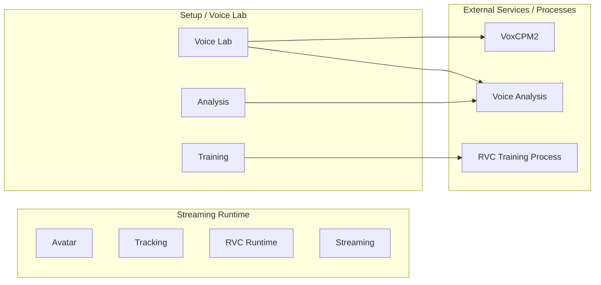

### Rationale

This allows normal streaming with already registered models to continue even if problems occur in Voice Lab or the training environment.

---

## 4.4 External Service Manager

An `External Service Manager` is provided as a common function that manages the lifecycle of external services.

The External Service Manager is mainly responsible for:

- managing service registration information
- requesting startup of required services
- detecting already-running services
- reusing services
- checking ports
- starting processes
- health checks
- waiting for readiness
- managing service state
- stopping services
- detecting failures

Feature modules do not start Python processes directly.

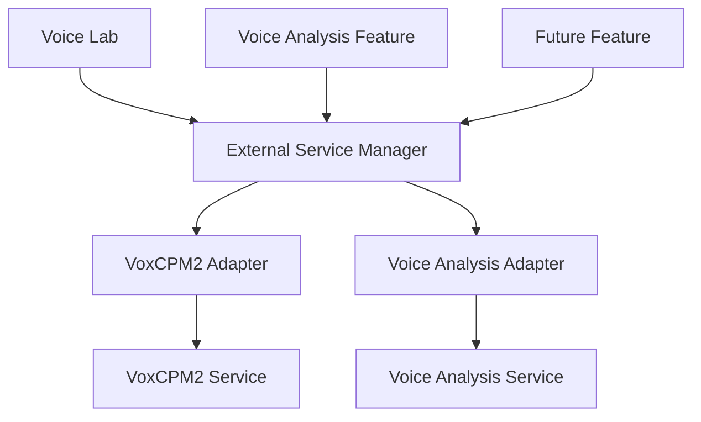

### Rationale

If each module individually implements

- process startup
- port checks
- health checks
- shutdown

the same processing is duplicated and different lifecycle management approaches are mixed.

Consolidating them into a common manager unifies the service management approach.

---

## 4.5 Service Adapter Approach

The External Service Manager is structured so that it does not need to know too much about each external service's specific API or internal specifications.

Service-specific processing is separated into adapters.

Conceptually, the following interface is assumed.

```text
IExternalServiceAdapter

- GetServiceInfo()
- StartAsync()
- CheckHealthAsync()
- StopAsync()
- GetStatusAsync()
```

Concrete implementations such as

- VoxCpmServiceAdapter
- VoiceAnalysisServiceAdapter
- FutureServiceAdapter

are provided.

### Rationale

Each external service differs in

- how it is started
- health checks
- API specifications
- how its version is obtained
- how it is shut down

and so on.

If these are written directly into the External Service Manager, the manager has to be modified every time a service is added.

Confining service-specific processing to adapters limits the impact of adding external services.

---

## 4.6 Service Descriptor

For each external service, the information needed for management is held as a service descriptor.

The assumed information is as follows.

| Item | Content |
|---|---|
| ServiceId | Service identifier |
| DisplayName | Display name |
| ComponentId | Corresponding external component |
| SupportedVersion | Supported version |
| AdapterVersion | Adapter version |
| Executable | Startup target |
| WorkingDirectory | Working directory |
| DefaultPort | Default port |
| HealthEndpoint | Health check target |
| InfoEndpoint | Service information endpoint |
| StartupTimeout | Maximum startup wait |
| ShutdownPolicy | Shutdown method |

The concrete storage format is decided in the detailed design.

### Rationale

If service information is scattered throughout C# code, changes to versions or startup methods require modifying many places.

Holding service management information as a clear unit makes management and diagnostics easier.

---

## 4.7 Service Lifecycle

A managed local service conceptually has the following states.

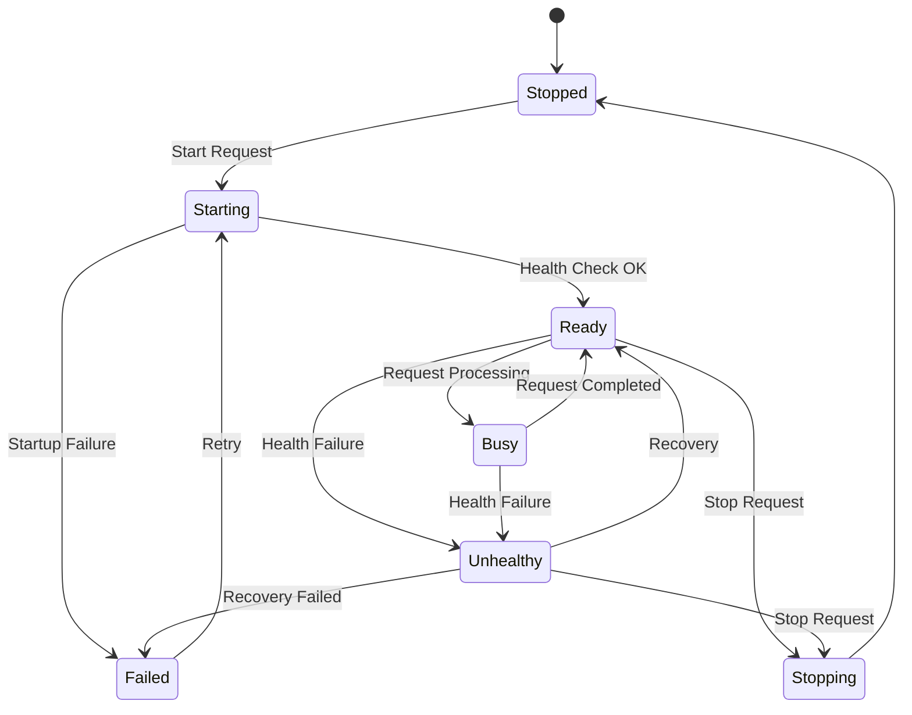

The UI displays these internal states in a simplified form as needed.

### Rationale

Simple running / stopped states cannot distinguish

- the process is starting
- the API is being prepared
- processing is in progress
- the process exists but does not respond

and so on.

Making the service lifecycle explicit makes state management and failure diagnosis easier.

---

## 4.8 Service Startup Flow

When a startup request is received from a function that requires a service, processing conceptually proceeds in the following order.

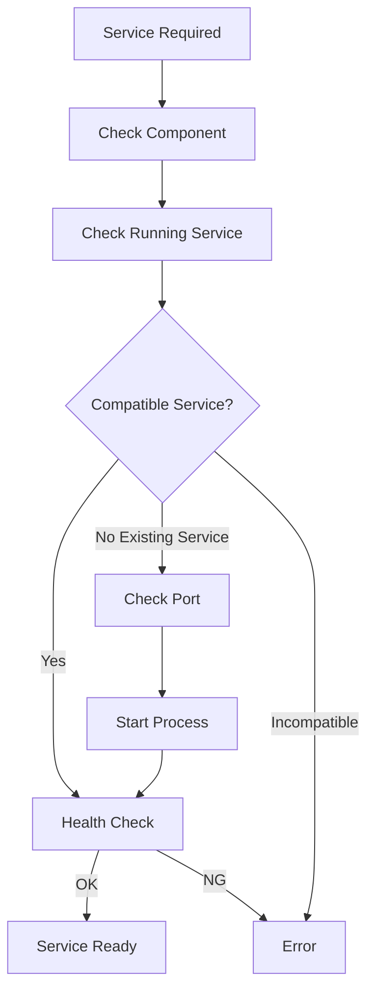

The main steps are:

1. Check whether the required external component is available.
2. Check whether the target service is already running.
3. Check whether an already-running service is compatible.
4. Check whether the required port is available.
5. Start the service process.
6. Repeat health checks.
7. Confirm that the service has reached the Ready state.
8. Return the available state to the caller.

### Rationale

If a request is sent immediately after the process starts, model loading, etc. inside the service may not have completed.

Instead of simply starting the process, startup is confirmed until the service can actually process requests.

---

## 4.9 Reusing Already-running Services

If the target service is already running, a new process is not started immediately.

First,

- service identity
- version
- API compatibility
- health
- target port

and so on are checked.

If the service is compatible, it can be reused.

### Rationale

Starting multiple instances of the same service causes

- port conflicts
- duplicate GPU memory usage
- duplicate model loading
- unnecessary memory consumption

and so on.

Safely reusing existing services reduces resource consumption.

---

## 4.10 Service Identity Verification

The target service is not judged to be running merely because the port is in use.

Where possible, the service is queried to check

- ServiceId
- version
- API version
- health

and so on.

For example, endpoints such as

```text
/health
/info
```

are used through the service adapter.

### Rationale

Another application may be using the target port.

Judging "port is open = target service exists" risks sending requests to the wrong service.

---

## 4.11 Port Management

A default port can be assigned to each service.

The current configuration uses, for example:

| Service | Default port |
|---|---:|
| VoxCPM2 Reference Service | 8765 |
| Voice Analysis Service | 8766 |

However, normal users are not normally expected to configure port numbers directly.

Port numbers are managed as service descriptors or application settings.

### Rationale

Port numbers are necessary for the internal implementation but are not meaningful settings for normal users.

They are managed as internal structure and can be checked from developer diagnostics only when needed.

---

## 4.12 Port Conflicts

If the intended port is used by another process, it is checked whether that process is a compatible service.

If it is not a compatible service, the application does not terminate the process or operate on the other application without permission.

Normal users are shown, for example:

> The voice generation service could not be started.  
> A required communication port is being used by another application.

Developer diagnostics record

- ServiceId
- port
- target process information
- health check results
- service identity determination

and so on.

### Rationale

Terminating unrelated processes to resolve a port conflict may affect other applications.

The application errs on the safe side and notifies the user of the conflict.

---

## 4.13 Process Ownership

The External Service Manager distinguishes between

**processes it started itself**

and

**processes that were already running and were reused**

When starting a process, it records as needed

- PID
- application session
- ServiceId
- start time

and so on.

### Rationale

When an existing service is reused, that process may have been started by another application or another session.

Such a service must not be stopped without permission when this application exits.

---

## 4.14 Service Shutdown

Services started by the application can be stopped when their use ends or when the application exits.

When stopping, where possible, the following order is used:

1. graceful shutdown request
2. wait for process exit
3. forced termination if necessary

However, when an already-running service was merely reused, it is, as a rule, not stopped.

### Rationale

This avoids affecting processes this system does not own.

Also, using forced termination from the start may corrupt data that the service is saving.

---

## 4.15 On-demand Startup

External services are not all started when the application starts.

They are started when needed.

Examples:

- using the voice clone screen → start VoxCPM2
- starting voice analysis → start voice analysis
- starting RVC training → start the training process

### Rationale

Keeping everything running at all times leads to

- longer startup time
- memory consumption
- GPU memory consumption
- an increase in unnecessary processes

In particular, many services are not used during normal streaming, so they are started only when needed.

---

## 4.16 Delayed Service Shutdown

Instead of always terminating a service immediately after use ends, an approach that keeps it reusable for a certain period is also permitted as needed.

For example, in Voice Lab, when repeating

- voice generation
- preview listening
- regeneration
- generation with a different prompt

VoxCPM2 is not restarted each time.

The concrete shutdown timing is decided in the detailed design, considering the characteristics of each service.

### Rationale

For services whose model loading takes time, starting and stopping each time greatly reduces usability.

On-demand startup and reuse are combined.

---

## 4.17 External Process Execution

Temporary processing such as RVC training is executed as a managed external process.

Process execution manages at least the following:

- process ID
- command
- working directory
- environment
- start time
- end time
- exit code
- stdout
- stderr
- cancellation state

External processes are not started directly from the UI but through the adapter or manager of the relevant function.

### Rationale

External process execution also needs to be state-managed as part of the application's processing.

Simply starting a process does not allow the application to track progress or reasons for failure.

---

## 4.18 Python Execution Environment

External services / processes that use Python are started by explicitly specifying the execution environment managed as described in Chapter 13.

They do not depend on the OS global Python or the environment currently activated in the shell.

In the distribution environment for normal users, the launcher / executable indicated by the runtime package's `manifest.json` is started (see 13.6 and 13.7).

```text
External/<Component>/<RuntimePackageVersion>/manifest.json
        ↓
Launcher / Executable
```

In the development environment, the Python of the per-component, per-version development venv can be explicitly specified for startup.

```text
<ExternalComponent>/<Version>/.venv/Scripts/python.exe
```

In both cases, the path and version of the execution environment used for startup can be checked from diagnostics.

### Rationale

Depending on the global Python causes

- Python version
- package versions
- CUDA support
- dependencies

to vary by user environment, and reproducibility is lost.

The environment managed by the application is used explicitly.

---

## 4.19 Separation of Responsibilities from External Component Management

The External Service Manager is basically responsible for **the execution lifecycle of installed components**.

The following are the responsibilities of external component management in Chapter 13:

- external OSS / source version management
- dependency definition / lock management
- developer venv setup procedures
- runtime package build information management
- obtaining runtime packages
- package hash / integrity verification
- extracting and registering runtime packages
- update
- rollback
- capability / dependency verification

Setup for normal users does not, as a rule, build a venv from source but installs a built runtime package.

If the External Service Manager cannot find a component, it guides processing to the setup function.

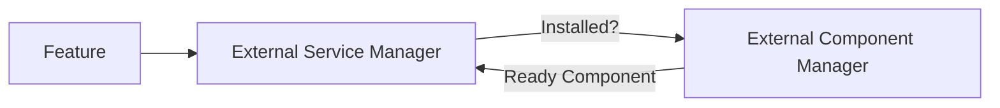

### Rationale

Separating "the responsibility to build the environment" from "the responsibility to start the built environment" simplifies management.

---

## 4.20 Version Compatibility

Before using an external service, it is checked whether the version is supported by this application and the adapter.

At least the compatibility of

- external component version
- API version
- adapter version

and so on can be checked.

If an unsupported version is detected, it is not used unconditionally.

### Rationale

Even if a process starts normally, it may not work correctly if the API specification or output format has changed.

"Being able to start" and "being compatible" are separated.

---

## 4.21 Service Health Check

A health check mechanism is provided for managed local services.

Health checks verify the following as needed:

- process existence
- API response
- service identity
- service version
- internal initialization state
- load state of required models

Health check results are converted into common states such as

- Ready
- Busy
- Unhealthy
- Failed

### Rationale

Even if a process exists, it may be unable to process requests due to

- model load failure
- GPU initialization failure
- dependency errors

and so on.

Therefore, not only process existence but also availability as a service is verified.

---

## 4.22 Startup Timeout

A timeout is set for service startup processing.

For services whose model loading, etc. takes time, an appropriate startup timeout can be set per service.

When a timeout occurs,

- process state
- health check results
- stdout
- stderr

and so on are recorded in the diagnostic information.

### Rationale

This prevents the Unity side from waiting indefinitely when an external service does not respond.

---

## 4.23 Detecting Abnormal Termination

If an external service / process started by the application terminates unexpectedly, that state is detected.

For example, the following are recorded:

- process ID
- exit time
- exit code
- last stdout
- last stderr
- the processing that was in progress

### Rationale

If an external process terminates abnormally, simply treating it as a communication error on the Unity side makes the cause hard to identify.

The process lifecycle and communication state are managed in association.

---

## 4.24 Automatic Recovery

For temporary failures, restart can be attempted for services that support automatic recovery.

However,

- unlimited restarts
- repeated restarts in a short time

are not performed.

The retry count and conditions are managed per service.

For external processes whose results are affected by restarting, such as training, automatic re-execution is, as a rule, not performed.

### Rationale

Service-type processing may automatically recover from temporary failures, while re-executing training, etc. without permission may cause duplicate processing or artifact inconsistencies.

The recovery policy is separated according to the processing characteristics.

---

## 4.25 Concurrent Request Control

External services do not necessarily support processing multiple requests concurrently.

For each service, execution characteristics such as

- Concurrent
- Serialized
- Single Job

can be defined.

The application manages a request queue as needed.

### Rationale

In particular, for services that use GPU models, running multiple jobs simultaneously may cause

- insufficient GPU memory
- reduced processing speed
- service crashes

and so on.

The degree of parallelism is controlled according to the service's capability.

---

## 4.26 Request Cancellation

For long-running requests, cancellation can be handled if the target service supports it.

For external processing that cannot be cancelled, this is made clear in the UI.

Treating forced process termination as cancellation is decided case by case, considering the possibility of data corruption.

### Rationale

Even if the Unity side receives a cancellation request, the external service cannot necessarily stop safely.

The meaning of cancellation is made clear per service.

---

## 4.27 Not Exposing Internal Structure to the UI

The normal UI, as a rule, does not display

- port numbers
- PIDs
- runtime package paths / developer venv paths
- Python commands
- health endpoints

and so on.

The normal UI converts these into user-facing states such as

- preparing
- available
- processing
- setup required
- error

Developer Mode can display detailed information.

### Rationale

What normal users need is not the internal service structure but "whether the function can be used."

Internal information is separated into the developer diagnostics defined in Chapter 5.

---

## 4.28 Service Setup Guidance

If a required external component has not been set up, normal users are not required to operate Python or Git manually.

For example,

> Initial setup is required for the voice generation function.

is displayed, and environment setup can be started from the setup UI.

### Rationale

Emphasis is placed on being able to start using a function without understanding internal dependencies.

---

## 4.29 Security

Managed local services, as a rule, listen only on localhost.

Being accessible from external networks is not the default.

Necessary validation is also performed on paths, parameters, etc. passed to external services.

### Rationale

There is normally no need to expose services for Voice Lab, etc. to external networks.

The attack surface is not increased unnecessarily.

---

## 4.30 Secrets

If secrets need to be passed to an external service / process, approaches that do not output them in plain text on the command line or in logs are preferred.

Secrets follow the credential management approach defined in Chapter 6.

Developer logs defined in Chapter 5 also do not record secrets.

### Rationale

Process commands and logs may be shared externally for failure investigation, etc.

---

## 4.31 Integration with Logging and Diagnostics

The External Service Manager and external process management functions use the common logging / diagnostics approach defined in Chapter 5.

The main diagnostic information handled is:

- ServiceId
- component version
- adapter version
- Python version
- venv
- process ID
- port
- process state
- service health
- start / stop time
- exit code
- stdout
- stderr
- health check results
- exception

The display for normal users shows only the necessary information concisely.

### Rationale

For external process failures, information inside Unity alone cannot identify the cause, so the external environment is also made observable.

---

## 4.32 Processing at Application Exit

When the application exits, the external services owned by this application session are stopped.

Services that were merely reused are, as a rule, not stopped.

If an external process is in progress, depending on the nature of the process, one of

- wait for normal completion
- cancel
- ask for exit confirmation

and so on is chosen.

### Rationale

The purpose is to avoid stopping unrelated processes when the application exits and to prevent corruption of data being processed.

---

## 4.33 Services After Abnormal Application Termination

If the application terminates abnormally, external services alone may remain.

At the next startup,

- target port
- service identity
- health
- version

and so on are checked, and the service can be reused if it is compatible.

However, a reused service is not automatically considered owned by the current session.

### Rationale

There is no need to forcibly terminate healthy services left after an abnormal termination every time.

On the other hand, misidentifying ownership may cause another session's process to be terminated, so ownership is separated in the lifecycle.

---

## 4.34 Adding External Services

When adding a new external service, the following are added as a rule:

1. external component definition
2. service descriptor
3. service adapter
4. health check
5. version compatibility definition
6. setup information
7. diagnostics information

The goal is a structure in which services can be added without changing the main logic of the existing External Service Manager.

### Rationale

Changing the common lifecycle processing every time an external service is added tends to cause regressions in existing services.

---

## 4.35 Separation of Setup and Runtime Responsibilities

Setup and runtime are also separated for external-service-related processing.

### Setup

Setup for normal users mainly performs:

- checking the external component manifest
- version selection
- obtaining built runtime packages
- package hash / integrity verification
- extracting and registering runtime packages
- obtaining required models / assets
- capability / environment verification
- service startup test
- health check test

Separately, the developer environment allows running and testing directly from source using native Python + venv.

### Runtime / When Using Voice Lab

- detecting required services
- startup
- reusing already-running services
- health checks
- requests
- state monitoring
- stopping as needed

### Rationale

Running environment setup processing during normal use complicates the processing needed before a function can start.

Environment setup and actual service use are separated.

---

## 4.36 Internal Division of Responsibilities

Conceptually, the following structure is assumed.

```text
ExternalServices/
├─ Core/
│  ├─ ServiceDescriptor
│  ├─ ServiceState
│  ├─ ServiceInstance
│  └─ ServiceId
│
├─ Management/
│  ├─ ExternalServiceManager
│  ├─ ServiceRegistry
│  ├─ ServiceLifecycleManager
│  └─ ServiceRequestCoordinator
│
├─ Process/
│  ├─ ExternalProcessRunner
│  ├─ ProcessOwnership
│  └─ ProcessResult
│
├─ Network/
│  ├─ PortChecker
│  └─ ServiceIdentityChecker
│
├─ Health/
│  ├─ HealthChecker
│  └─ ServiceHealth
│
├─ Adapters/
│  ├─ VoxCpmServiceAdapter
│  ├─ VoiceAnalysisServiceAdapter
│  └─ FutureServiceAdapter
│
└─ Diagnostics/
   └─ ExternalServiceDiagnostics
```

External OSS source, venv, versions, updates, etc. are separated into the external component management function in Chapter 13.

### Rationale

Concentrating process startup, port management, health checks, service-specific APIs, version management, etc. in one giant manager makes responsibilities unclear.

Separating the common lifecycle from service-specific processing ensures maintainability.

---

## 4.37 Basic Principles of External Service Management

This system adopts the following basic principles for external service management.

1. Do not make normal users aware of internal structures such as Python and ports.
2. The streaming runtime does not depend on Python local services.
3. External services are started on demand only when needed.
4. Distinguish services from temporary external processes.
5. Service lifecycles are managed in common by the External Service Manager.
6. Service-specific processing is separated into adapters.
7. Startup includes completing health checks, not just starting the process.
8. Reuse already-running services if they are compatible.
9. Do not judge a service to be the target merely because its port is in use.
10. Verify service identity and version.
11. As a rule, do not expose port numbers to normal users.
12. Do not terminate other applications without permission on port conflicts.
13. Distinguish processes started by the application from reused processes.
14. Do not stop processes that are not owned without permission.
15. Run Python by explicitly specifying the execution environment managed by the application (the runtime package in distribution, the development venv in development).
16. Separate obtaining / updating external components from the service lifecycle.
17. Verify compatibility between service versions and adapter versions.
18. Distinguish process existence from service health.
19. Set a timeout for service startup.
20. Obtain stdout / stderr / exit codes of external processes.
21. Separate recovery approaches for service-type processing and batch processing.
22. Control the number of concurrent requests according to service capability.
23. Managed local services are, as a rule, exposed only on localhost.
24. Do not carelessly output secrets to commands or logs.
25. Detailed information about external services can be checked from developer diagnostics.
26. New services are added basically by adding a descriptor and an adapter.
27. Separate setup from the actual service usage lifecycle.


---

---

# 5. Logging and Diagnostics

## 5.1 Basic Policy

This system separates state display and error notification for normal users from detailed logs and diagnostic information for developers.

The basic policy is:

**Do not make normal users aware of the internal structure, while allowing developers to sufficiently observe internal state.**

For normal users, the display focuses on

- what is currently happening
- which functions are affected
- what to check or do

For developers, on the other hand,

- module
- processing stage
- configuration values
- version
- timing
- process
- external component
- exception
- stack trace

and so on are recorded in detail.

### Rationale

Showing general users internal information such as

```text
NullReferenceException
CUDA error
HTTP 500
Port 8765 bind failed
```

as-is rarely helps solve the problem.

On the other hand, when developing and maintaining the system as OSS, information such as "it failed" alone cannot identify the cause.

Therefore, user-facing information and developer-facing information are treated as separate responsibilities.

---

## 5.2 Separating Logs from User Notifications

For a single internal event, the system can generate

- a user notification
- a developer log

separately.

Conceptually:

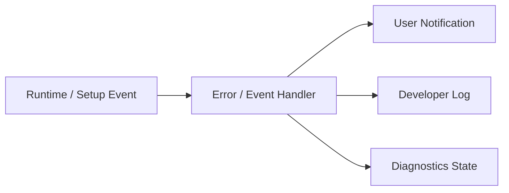

For example, if microphone initialization fails, the normal UI shows

> The microphone could not be used.  
> Check that the selected input device is connected.

and so on.

For developers, on the other hand,

- device name
- device ID
- sample rate
- buffer size
- audio backend
- exception
- stack trace

and so on are recorded.

### Rationale

If the internal log structure is reused as-is in the UI, changes to the internal implementation tend to change the user-facing display as well.

Separating notifications from logs allows each to be designed in a form suited to its purpose.

---

## 5.3 Log Levels

Logs have at least the following levels.

| Level | Purpose |
|---|---|
| Trace | Very detailed processing traces |
| Debug | Internal state needed for development / debugging |
| Information | Records of normal major processing |
| Warning | Processing can continue but attention is needed |
| Error | A specific operation or function has failed |
| Critical | A serious impact on the entire application |

In normal operation, unnecessary trace / debug logs are not output in large volumes.

The level of detail can be changed as needed through Developer Mode or diagnostic settings.

### Rationale

Always recording all internal information causes

- increased log size
- increased file I/O
- important information being buried

and so on.

On the other hand, detailed logs are needed when reproducing failures, so the log level can be switched.

---

## 5.4 Structured Logging

For major logs, structured information is attached where practical, rather than only simple free text.

Conceptual example:

```text
Timestamp
Level
Module
Category
EventId
SessionId
ProjectId
AvatarId
RunId
Message
Properties
Exception
```

This does not mean that every field is required; the necessary context is attached according to the processing.

For example, Voice Lab training processing can record

```text
Module      = VoiceLab
Category    = RvcTraining
RunId       = ...
DatasetId   = ...
RvcVersion  = ...
State       = Training
```

and so on.

### Rationale

With free-text-only logs, it is hard to search later for logs of a specific run, avatar, project, etc.

Attaching context information makes it easier to identify the scope of a failure.

---

## 5.5 Per-module Logs

Each major module uses the common logging mechanism while attaching a module name or category.

Examples:

- Application
- Project
- Avatar
- Tracking
- Voice
- Audio
- Capture
- Video
- Streaming
- Stage
- VoiceLab
- ExternalComponent
- UI
- Diagnostics

Conceptual example:

```text
[Information][Avatar] Avatar loaded.
[Warning][Tracking] Tracking confidence dropped.
[Error][Streaming] Connection failed.
```

### Rationale

In a system where multiple functions run simultaneously, it is hard to tell from the time sequence alone which function a log belongs to.

Classifying by module allows narrowing down to only the target function.

---

## 5.6 Session Identification

Sessions can be identified per application launch as needed.

For example, a SessionId is generated so that

- application start
- project load
- runtime start
- streaming start
- application exit

and so on can be tracked as the same session.

### Rationale

If logs from multiple launches exist in the same file, it may become unclear during which launch a problem occurred.

Identifying sessions makes time-series analysis easier.

---

## 5.7 Correlation per Operation

Long-running operations and operations spanning multiple components can be tracked using a common ID as needed.

Examples:

- project load
- avatar import
- voice model registration
- training run
- external component setup
- streaming session

For example, a training run uses the `RunId` defined in Chapter 13 directly as the diagnostic context.

### Rationale

Even when one operation passes through multiple layers such as

```text
UI
 ↓
Manager
 ↓
Adapter
 ↓
Python Process
 ↓
Artifact Collection
```

its logs can be tracked as the same operation.

---

## 5.8 Log Output Location

Logs are saved in the Logs area within the Data Root defined in Chapter 6 or the application-managed area.

Conceptual example:

```text
DataRoot/
└─ Logs/
   ├─ Application/
   ├─ VoiceLab/
   ├─ ExternalServices/
   └─ Diagnostics/
```

The actual layout is aligned with the overall Data Root structure.

Normal runtime logs and logs belonging to a specific training run, etc. are separated as needed.

For example, logs specific to a training run can be kept in

```text
VoiceLab/
└─ TrainingRuns/
   └─ <RunId>/
      └─ logs/
```

### Rationale

Consolidating all logs into one huge file makes investigation per function or per operation difficult.

Storage locations are separated by purpose.

---

## 5.9 External Process Logs

For external processes such as Python services and external OSS,

- stdout
- stderr
- process start
- process exit
- exit code

can be obtained and saved.

Examples:

- RVC
- VoxCPM2
- voice analysis
- other future external components

stdout / stderr are not shown directly in the normal user UI.

They can be checked from developer diagnostics as needed.

### Rationale

Failures that occur inside an external process may not be identifiable from Unity-side exceptions alone.

Keeping the standard output and standard error of external processes makes problems in external OSS investigable as well.

---

## 5.10 External Process Startup Information

When an external process starts, the following are recorded as needed:

- component name
- component version
- source version / commit
- adapter version
- execution mode (portable runtime / developer venv)
- runtime package version / build ID
- Python version
- runtime package path / venv path
- process ID
- start time
- port
- working directory
- command
- health check results

However, if secrets are included in the command line, they are masked.

### Rationale

For external OSS failures, "which version and which Python environment it ran in" is important for investigating the cause.

---

## 5.11 Service State Diagnostics

For external services, it can be checked not only whether the process exists but also whether the service is in a usable state.

Example states:

```text
Not Installed
Stopped
Starting
Ready
Busy
Unhealthy
Failed
```

If a health check API exists, its results are used.

### Rationale

Even if a process is running, it may not actually be able to process requests due to initialization failure, etc.

Process state and service health are handled separately.

---

## 5.12 Runtime Diagnostic Information

Developer diagnostics can show the state of the main runtime modules.

Examples:

### Avatar

- AvatarId
- model format
- loaded state
- missing bones
- missing expressions
- extension motion state

### Tracking

- provider
- tracking state
- tracking FPS
- confidence
- lost parts
- filtering state

### Voice

- input device
- sample rate
- buffer size
- voice model
- backend
- voice conversion state
- latency
- underrun / overrun

### Capture

- capture source type
- capture device / monitor
- capture state
- input resolution
- input frame rate
- capture frame time
- dropped / missed frames
- GameCapture audio state
- SubScreenCapture backend
- native plugin / adapter state

### Video

- render resolution
- target FPS
- actual FPS
- frame time
- encoder
- encode time
- dropped frames

### Streaming

- connection state
- bitrate
- reconnect state
- queue
- A/V offset

### Audio

- output device
- mixer state
- peak
- clipping
- routing

### Rationale

In real-time systems, problems do not necessarily appear as exceptions.

Making internal state observable makes it easier to identify performance degradation and temporary abnormal states.

---

## 5.13 Performance Diagnostics

For performance information, the following can be measured as needed:

- main thread frame time
- render frame time
- tracking processing time
- voice processing time
- RVC inference time
- pitch estimation time
- video encoding time
- memory usage
- GPU memory usage
- CPU usage
- GPU usage

Not only simple averages but also, as needed,

- current value
- average
- maximum
- drop count

and so on are handled.

### Rationale

Even if the average processing time is normal, temporary spikes may cause audio dropouts or frame drops.

Therefore, the structure allows momentary performance anomalies to be diagnosed as well.

---

## 5.14 Audio Pipeline Diagnostics

For voice conversion, processing time can be checked per pipeline stage defined in Chapter 9.

Example:

```text
Audio Input
   ↓
Input Buffer
   ↓
Feature Extraction
   ↓
Pitch Estimation
   ↓
RVC Inference
   ↓
Post Processing
   ↓
Audio Output
```

The processing time of each stage is recorded as needed.

### Rationale

End-to-end latency alone cannot show which processing is the bottleneck.

Making timing obtainable per processing stage makes it easier to identify where to improve performance.

---

## 5.15 Streaming Diagnostics

For streaming, the following can be checked as needed:

- publisher state
- connection state
- reconnect count
- encoder state
- actual bitrate
- dropped frames
- encoding queue
- network errors
- A/V offset
- stream start time

### Rationale

Streaming failures can be caused in multiple places, such as

- rendering
- encoder
- network
- the streaming service

The state of each stage is made separately observable.

---

## 5.16 Developer Mode

The Developer Mode defined in Chapter 14 is used to display diagnostic functions that are not needed in normal use.

In Developer Mode, for example, the following can be used:

- detailed log viewer
- runtime state viewer
- performance metrics
- diagnostic camera
- tracking visualization
- external service state
- version information
- developer actions

Even with Developer Mode off, the required logging itself is performed; Developer Mode mainly changes the scope of what the UI displays.

### Rationale

Displaying large amounts of internal information in the normal UI makes it hard to use.

On the other hand, during development and failure investigation, internal state must be checkable immediately.

---

## 5.17 Diagnostic Camera

The diagnostic camera defined in Chapters 10 and 14 is treated as part of developer diagnostics.

Examples of what can be displayed:

- camera input
- tracking landmarks
- skeleton
- face landmarks
- avatar
- tracking confidence
- debug text

The input video and the avatar can be checked simultaneously as needed.

The diagnostic camera is not connected to the streaming pipeline.

### Rationale

For example, when the avatar's arm looks unnatural, this makes it easier to visually isolate whether

- the camera input is correct
- the tracking result is correct
- normalization is correct
- retargeting is correct
- avatar bone mapping is correct

It also structurally prevents real camera video from being streamed by mistake.

---

## 5.18 Diagnostic Overlay

As needed, a diagnostic overlay can be displayed on the avatar view, etc. only while in Developer Mode.

Examples:

- bone names
- joint positions
- tracking confidence
- extension bones
- FPS
- frame time

As a rule, the diagnostic overlay is not included in the normal streaming render target.

### Rationale

This prevents diagnostic displays from unintentionally appearing in the streamed video.

---

## 5.19 Log Viewer

Application logs can be checked from the developer / diagnostics UI.

The following filters are provided as needed:

- log level
- module
- category
- session
- keyword
- context such as RunId

### Rationale

Basic failure checks can be done within the application without opening log files in an external editor each time.

---

## 5.20 Diagnostics Snapshot

A **diagnostics snapshot** summarizing the state at the time of a failure can be generated.

The snapshot includes the following as needed:

- application version
- OS
- Unity / runtime information
- basic project information
- module states
- avatar format
- tracking provider
- voice model information
- encoder information
- external component versions
- Python version
- performance metrics
- recent logs
- exception information

### Rationale

This avoids asking users to manually check a large amount of information when reporting a problem.

---

## 5.21 Diagnostics Export

Information needed for failure reports can be exported together from developer diagnostics.

Conceptual example:

```text
diagnostics-<timestamp>/
├─ system-info.json
├─ runtime-state.json
├─ versions.json
├─ recent-logs/
└─ errors.json
```

As needed, these are combined into a single package such as a ZIP.

### Rationale

This makes it easy to share the required diagnostic information when reporting problems via GitHub issues, etc.

---

## 5.22 Privacy of Diagnostics Export

Secrets and unnecessary personal data are not included in the diagnostics export.

At least the following are excluded or masked:

- stream keys
- OAuth tokens
- API keys
- passwords
- credentials
- microphone audio
- voice dataset contents
- camera images / video
- other secrets

If paths contain user names, etc., they are masked as needed.

### Rationale

Diagnostic packages may be published on GitHub issues, etc.

The structure makes them easy to share safely even if users do not check the contents in detail.

---

## 5.23 Prohibiting Secrets in Logs

Secrets are not output to logs, including at the debug level.

In particular, the following are prohibited:

```text
Stream Key = xxxx
OAuth Token = xxxx
Authorization: Bearer xxxx
Password = xxxx
```

Even when needed, only masked information such as

```text
Stream Key = ********
```

is displayed.

### Rationale

Log files may be shared externally for failure investigation or issue reports.

"It is a developer log, so secrets may be output" is not accepted.

---

## 5.24 Handling File Paths

Developer logs may need file paths for failure investigation.

However, for

- diagnostics exports
- logs for external sharing

paths containing personally identifiable information can be normalized / masked as needed.

For example, handling

```text
C:\Users\UserName\...
```

as

```text
%USERPROFILE%\...
```

is considered.

### Rationale

File paths themselves may contain personal information such as user names.

---

## 5.25 Log Rotation

Log files are prevented from growing without limit.

At least one of the following, or a combination, is used:

- rotation by file size
- rotation by date
- number of retained generations
- retention period
- automatic deletion of old logs

### Rationale

In an application used over a long period, logs alone may exhaust storage.

---

## 5.26 Controlling High-frequency Logs

High-frequency processing such as per-frame or per-audio-buffer processing does not log every time during normal operation.

For example, tracking confidence, etc. is recorded

- only on state changes
- at fixed intervals
- only during developer trace

and so on.

### Rationale

Generating file I/O every frame not only affects performance but also buries important logs in large amounts of information.

---

## 5.27 Suppressing Repeated Errors

When the same error occurs in large numbers in a short time, duplicate logs are suppressed as needed.

For example, instead of recording

```text
Camera frame unavailable.
Camera frame unavailable.
Camera frame unavailable.
...
```

without limit, a structure that handles it as

```text
Camera frame unavailable. repeated 128 times.
```

is considered.

### Rationale

This prevents the first error, which is the root cause, from being buried by a large number of duplicate logs.

---

## 5.28 Startup and Exit Logs

At least the following are recorded for the application lifecycle.

### At Startup

- application version
- build information
- OS
- graphics device
- audio device
- Data Root
- Developer Mode
- start time

### At Exit

- normal exit
- exit time
- resource cleanup results as needed

For abnormal termination, an approach that allows identifying at the next startup that the previous session did not exit normally is considered.

### Rationale

This makes environment information and the application lifecycle checkable when a failure occurs.

---

## 5.29 Version Information

The versions of the main components that make up the system can be checked from diagnostics.

Examples:

- application version
- Unity version
- avatar library
- MediaPipe-related versions
- RVC version / commit
- VoxCPM2 version / commit
- voice analysis version
- adapter version
- Python version
- PyTorch version
- CUDA version

### Rationale

Even code that looks the same may behave differently due to differences in external component versions.

Version information is important for reproducing failures.

---

## 5.30 Configuration Diagnostics

As needed, an overview of the settings currently in use can be checked from diagnostics.

However, secrets are excluded.

Examples:

- ProjectId
- ProfileId
- AvatarId
- tracking provider
- voice model
- stage
- encoder
- resolution
- sample rate

### Rationale

"Under which settings the problem occurred" can be checked not only from logs but also from the current state.

---

## 5.31 Integration with Startup Validation

Problems detected at startup or project load, such as

- missing assets
- invalid profiles
- unsupported versions
- missing external components
- invalid credential references

are recorded in diagnostics.

Normal users are notified concisely of only what is needed for use.

### Rationale

Validation errors are important diagnostic information before they become actual runtime errors.

---

## 5.32 Error Recovery Logs

The results of automatic recovery processing are also recorded.

For example, for streaming,

```text
Connection lost.
Reconnect attempt 1 started.
Reconnect attempt 1 failed.
Reconnect attempt 2 started.
Connection restored.
```

and so on can be tracked.

Examples:

- streaming reconnect
- device reinitialization
- tracking provider restart
- external service restart
- voice model reload

### Rationale

Even if recovery eventually succeeds, what happened just before can be checked afterward.

---

## 5.33 User Action Logs

Major operations needed for failure analysis are recorded at the information level as needed.

Examples:

- project switching
- avatar switching
- stage switching
- voice model switching
- streaming start / stop
- recording start / stop
- external service startup

However, keyboard input, text input contents, etc. are not recorded indiscriminately.

### Rationale

Knowing which operations were performed just before a failure makes it easier to identify reproduction conditions.

On the other hand, not recording unnecessary user input protects privacy.

---

## 5.34 Developer Diagnostic Operations

Developer Mode can provide diagnostic operations as needed.

Examples:

- reinitialize the tracking provider
- restart an external service
- reload the voice model
- take a diagnostics snapshot
- open the log directory
- reset performance counters

However, these are limited to the developer UI so that normal users do not operate them by mistake.

### Rationale

This reduces the need to restart the entire application for every failure investigation.

---

## 5.35 Limiting the Runtime Impact of Diagnostics

The diagnostic functions themselves must not significantly change runtime performance.

In particular,

- high-frequency trace logs
- tracking overlays
- performance sampling
- diagnostic camera

and so on are enabled only when needed.

### Rationale

This avoids, as far as possible, situations where enabling diagnostics makes the symptom disappear or, conversely, causes performance problems.

---

## 5.36 Failure Investigation Flow

The basic investigation flow when a failure occurs is as follows.

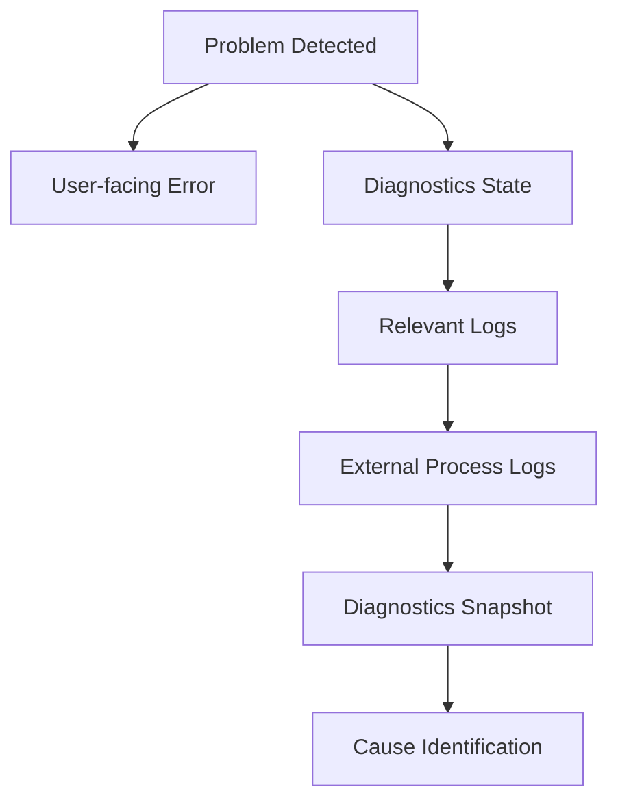

This order is not required for every failure, but the investigation path is kept consistent.

### Rationale

If each module uses a different investigation method, OSS developers find it hard to understand how to investigate failures.

A common diagnostic path is provided.

---

## 5.37 Logging and Diagnostics Implemented by Claude Code

When Claude Code implements a new function, logging and diagnostics are also part of the implementation, not only normal-path processing.

At least the following are checked:

- whether logs are output with the appropriate module / category
- whether there is sufficient context on errors
- whether user notifications and developer logs are separated
- whether secrets are output
- for external processes, whether stdout / stderr are obtained
- whether runtime state is observable from diagnostics
- whether excessive logs are output in high-frequency processing

These rules are written in `CLAUDE.md`, etc.

### Rationale

If diagnostics are postponed when adding new functions, it is easy to notice only after a failure occurs that the means of investigation are insufficient.

Logging / diagnostics are treated as part of feature implementation.

---

## 5.38 Internal Division of Responsibilities

Conceptually, the following structure is assumed.

```text
Diagnostics/
├─ Logging/
│  ├─ Logger
│  ├─ LogEntry
│  ├─ LogContext
│  ├─ LogWriter
│  └─ LogRotation
│
├─ Runtime/
│  ├─ RuntimeDiagnostics
│  ├─ ModuleDiagnostics
│  └─ PerformanceMetrics
│
├─ External/
│  ├─ ProcessLogCollector
│  ├─ ServiceHealthMonitor
│  └─ VersionCollector
│
├─ Snapshot/
│  ├─ DiagnosticsSnapshot
│  └─ DiagnosticsExporter
│
├─ Privacy/
│  ├─ SecretMasker
│  └─ DiagnosticsSanitizer
│
└─ UI/
   └─ DiagnosticsController
```

### Rationale

Separating logging, runtime monitoring, external processes, export, and privacy processing prevents responsibilities from concentrating in a single giant diagnostics manager.

---

## 5.39 Basic Principles of Logging and Diagnostics

This system adopts the following basic principles for logging and diagnostics.

1. Separate notifications for normal users from developer logs.
2. Show users the impact and how to respond, not the internal implementation.
3. Leave sufficient context for failure analysis for developers.
4. Use log levels according to purpose.
5. Make logs identifiable per module / category.
6. Attach correlation information such as session and run as needed.
7. Make stdout / stderr of external processes obtainable.
8. Make the versions and execution environments of external components recordable.
9. Distinguish process state from service health.
10. Make runtime state and performance observable from developer diagnostics.
11. Structurally separate the diagnostic camera from the streaming pipeline.
12. Do not include diagnostic overlays in the normal streamed video.
13. Make it possible to generate a diagnostics export for failure reports.
14. Do not output secrets to logs or diagnostics exports.
15. Mask paths containing personal information as needed.
16. Do not store logs without limit.
17. Avoid excessive log output in high-frequency processing.
18. Suppress large volumes of the same error as needed.
19. Make application versions and external component versions checkable.
20. Keep a history of recovery processing as well.
21. Limit the impact of diagnostic functions themselves on runtime performance.
22. Treat logging / diagnostics as part of each feature implementation.
23. Include logging and diagnostics in reviews even when Claude Code implements.


---

---

# 6. Project, Configuration, and Data Management

## 6.1 Basic Policy

This system not only manages the multiple settings required for streaming individually but also provides a unit called a **project** that groups related settings.

A project holds together the information needed to reproduce a specific streaming configuration.

For example, it associates:

- avatar
- tracking settings
- voice model
- voice settings
- stage
- camera settings
- capture settings
- BGM / SE settings
- streaming settings
- audio routing
- other stream-specific settings

Conceptually, the structure is as follows.

```text
Project
├─ Avatar
├─ Tracking Profile
├─ Voice Profile
├─ Stage
├─ Camera Profile
├─ Capture Profile
├─ Audio Profile
└─ Streaming Profile
```

### Rationale

If the settings of each function are managed completely independently, every time streaming starts the user would need to

- select the avatar
- select the voice model
- select the stage
- configure the camera
- adjust volumes
- select the streaming settings

and so on.

Managing them together as a project makes it easy to reproduce past streaming configurations.

---

## 6.2 Separating Projects and Profiles

A project does not hold every setting value of each function directly; as a rule, it references profiles managed by each function.

Conceptually, the relationship is as follows.

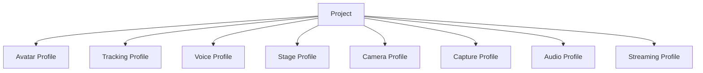

### Rationale

If all setting values are copied into each project, duplication occurs when the same settings are used by multiple projects.

For example, if the same tracking profile is used by multiple projects, every change to the tracking settings would require updating multiple projects.

Therefore,

**reusable function-specific settings are profiles**

**a combination of profiles is a project**

---

## 6.3 Profile Management

Each function can manage its own settings as profiles.

The following are assumed initially.

| Profile | Main settings |
|---|---|
| Avatar Profile | Bones, expressions, body proportion correction, etc. |
| Tracking Profile | Provider, camera, smoothing, calibration, etc. |
| Voice Profile | Voice model, pitch, post-processing, etc. |
| Camera Profile | Camera points, FOV, switching settings, etc. |
| Capture Profile | GameCapture device, sub-screen monitor, capture source settings, etc. |
| Audio Profile | Bus volumes, routing, effects, etc. |
| Streaming Profile | Resolution, FPS, encoder, bitrate, etc. |

A stage may hold information equivalent to a stage profile itself.

### Rationale

The lifecycle of settings differs by function.

For example, the structure avoids having to recreate the entire project just to change the tracking settings.

---

## 6.4 Project Data Structure

A project holds at least the following information.

```text
Project
├─ ProjectId
├─ DisplayName
├─ CreatedAt
├─ UpdatedAt
├─ AvatarId
├─ TrackingProfileId
├─ VoiceProfileId
├─ StageId
├─ CameraProfileId
├─ CaptureProfileId
├─ AudioProfileId
├─ StreamingProfileId
└─ Project-specific Settings
```

Settings needed only for a specific project can be held in the project itself.

### Rationale

Separating everything into profiles would require managing even settings meaningful only to a project as profiles, which would instead complicate the management structure.

Therefore, settings are divided as:

- settings to reuse → profile
- settings meaningful only to that project → project

---

## 6.5 Configuration Data Storage Format

Configuration data such as projects and profiles uses, as a rule, a text format that humans and developers can easily inspect.

The initial implementation uses JSON as the basic format.

SQLite is used for data where search and history management are important, such as the training run history in Chapter 13.

### Rationale

Storing all settings in SQLite makes it difficult for users and developers to check the settings directly.

On the other hand, a database is suited to searching history and large numbers of records.

Therefore, the roles are divided as:

**settings and configuration information in files such as JSON**

**information where history and searchability matter in SQLite**

---

## 6.6 Referencing by ID

Associations between projects and profiles use unique IDs, not display names or file paths.

Example:

```text
Project
  AvatarId = avatar_001
  VoiceProfileId = voice_profile_003
  StageId = stage_room_001
```

Display names are kept separately as user-facing information.

### Rationale

Display names may be changed by the user.

Also, referencing file paths directly may break settings when storage locations change.

Therefore, stable IDs are used for internal references.

---

## 6.7 Basic Policy for Data Storage Areas

This system's data is broadly divided into the following three types by purpose.

1. **basic application settings**
2. **user data, projects, and assets**
3. **secrets**

Each has a separate storage location.

### Rationale

Settings, user data, and secrets differ in

- update frequency
- size
- portability
- security requirements
- backup method

Rather than handling all of them in the same folder or file format, they are separated by role.

---

## 6.8 Storage of Basic Application Settings

Small settings needed to start the application are stored in the OS-standard user data area.

With Windows as the main target, the following initial location is assumed.

```text
%LOCALAPPDATA%/
└─ VirtualVesselStudio/
   ├─ bootstrap.json
   └─ Config/
      ├─ app-settings.json
      └─ ui-settings.json
```

Examples:

- location of the Data Root
- UI settings
- Developer Mode
- default devices
- application-wide settings

### Rationale

Saving user settings in the same location as the application executable or under `Program Files` makes them susceptible to

- write permissions
- application updates
- reinstallation
- version replacement

and so on.

Therefore, the OS-standard user data area is used.

---

## 6.9 Data Root

User data such as projects, avatars, stages, voice models, and datasets is stored in a dedicated managed area called the **Data Root**.

The initial value is, for example:

```text
%LOCALAPPDATA%\VirtualVesselStudio\Data
```

However, the Data Root can be changed by the user.

Example:

```text
D:\VirtualVesselStudioData
```

The actual location of the Data Root is referenced from `bootstrap.json`, etc. placed in the OS-standard area.

Conceptually:

```text
%LOCALAPPDATA%\VirtualVesselStudio\
        ↓
bootstrap.json
        ↓
Data Root
        ↓
D:\VirtualVesselStudioData
```

### Rationale

Avatars, stages, voice models, datasets, training runs, recordings, etc. may become large.

Always storing them in `%LOCALAPPDATA%` may exhaust space on the system drive.

Therefore, only small startup settings remain in the OS-standard area, and the storage location for large data can be changed.

---

## 6.10 Internal Structure of the Data Root

The Data Root is conceptually structured as follows.

```text
DataRoot/
├─ Projects/
│  └─ <ProjectId>/
│     └─ project.json
│
├─ Profiles/
│  ├─ Tracking/
│  ├─ Voice/
│  ├─ Camera/
│  ├─ Capture/
│  ├─ Audio/
│  └─ Streaming/
│
├─ Avatars/
│  └─ <AvatarId>/
│     ├─ model.vrm
│     ├─ avatar-profile.json
│     └─ thumbnail.png
│
├─ Stages/
│
├─ VoiceModels/
│
├─ Audio/
│  ├─ BGM/
│  └─ SE/
│
├─ VoiceLab/
│  ├─ voice-lab.db
│  ├─ Datasets/
│  ├─ TrainingRuns/
│  └─ Models/
│
├─ Cache/
└─ Logs/
```

External OSS such as RVC and VoxCPM2 is managed separately as the external management area defined in Chapter 13.

### Rationale

Separating directories by purpose makes

- backup
- failure investigation
- data deletion
- import / export
- checking capacity

easier.

---

## 6.11 Placement of Assets and Profiles

Profiles strongly tied to a specific asset can be placed in the same managed area as that asset.

For example, an avatar profile is stored as

```text
Avatars/
└─ <AvatarId>/
   ├─ model.vrm
   ├─ avatar-profile.json
   └─ thumbnail.png
```

On the other hand, profiles reused by multiple assets or projects are stored in common areas such as

```text
Profiles/
├─ Tracking/
├─ Voice/
├─ Camera/
├─ Audio/
└─ Streaming/
```

### Rationale

Placing all profiles uniformly in the same location makes it hard to distinguish asset-specific settings from reusable settings.

Therefore:

**asset-specific settings go in the same place as the asset**

**reusable settings go in the common profile area**

---

## 6.12 Importing into the Application-managed Area

Assets registered in this system are, as a rule, copied under the Data Root and managed there.

Examples:

- avatar models
- stages
- voice models
- BGM
- SE
- datasets
- training run artifacts

The path to the original file may be kept as metadata as needed, but it is not a required reference at runtime.

### Rationale

Saving only references to external files may make it impossible to reproduce a project if the original file is moved, renamed, or deleted.

Importing into the system-managed area allows data to be managed entirely within this system after registration.

---

## 6.13 Secret Management

Secrets such as the following are not stored directly in normal project or profile JSON.

- YouTube stream key
- OAuth tokens
- API keys
- other authentication information

Secrets use a secure storage method such as the credential store provided by the OS.

Projects and streaming profiles reference a credential ID as needed.

```text
Streaming Profile
        ↓
CredentialId
        ↓
OS Credential Store
```

### Rationale

Projects and profiles may be taken outside through

- backups
- import / export
- GitHub issues
- sharing between users

and so on.

Storing secrets in the same files risks unintended external leakage.

---

## 6.14 Configuration Schema Versioning

Projects and profiles have a schema version for their configuration format.

Example:

```json
{
  "schemaVersion": 3,
  "projectId": "project_001"
}
```

When the configuration structure changes due to an application update, old settings can be converted into the new settings.

### Rationale

When the system is continuously updated as OSS, configuration items and data structures are likely to change.

Making the schema version explicit allows the format of old data to be determined.

---

## 6.15 Migration

When the configuration schema changes, migration processing from the old format to the new format is provided.

Conceptually, the flow is:

```text
Load Data
    ↓
Check Schema Version
    ↓
Old Version?
    ├─ No → Load
    │
    └─ Yes
         ↓
      Migration
         ↓
      Validation
         ↓
        Load
```

Migration is performed step by step as far as possible.

```text
v1 → v2 → v3
```

### Rationale

Providing a dedicated conversion from every old version directly to the latest one makes migration processing grow as versions increase.

Step-by-step migration simplifies management.

---

## 6.16 Data Validation

When loading projects and profiles, setting values and reference targets are validated.

Examples:

- whether the AvatarId exists
- whether the StageId exists
- whether the voice model exists
- whether the profile format is correct
- whether required fields exist
- whether the schema version is supported
- whether credential references are valid

Invalid settings are not passed to the runtime as-is.

### Rationale

Configuration files may become inconsistent due to

- application updates
- manual editing
- file corruption
- import
- asset deletion

and so on.

Detecting problems at the loading stage presents the cause more clearly than failing after the runtime has started.

---

## 6.17 Project Loading

When loading a project, related profiles and assets are resolved and applied to the runtime.

```text
Project Load
    ↓
Project Validation
    ↓
Profile Resolution
    ↓
Asset Validation
    ↓
Runtime Configuration
    ↓
Avatar / Tracking / Voice / Stage / Camera / Audio
```

Applying individual settings is delegated to each module.

### Rationale

If the project manager directly operates on the internal implementation of Avatar, Tracking, Voice, etc., the project management function becomes strongly dependent on all modules.

The project manager is responsible up to

**resolving what to use**

and leaves

**how to apply it**

to each module.

---

## 6.18 Project Switching

Switching projects during streaming does not unconditionally reinitialize everything at once.

The settings that make up a project are classified into

- those that can be safely changed during runtime
- those that require reinitialization

and the required processing is applied in order.

Examples:

- avatar switching
- stage switching
- voice model switching
- camera setting changes
- audio setting changes

### Rationale

Carelessly reinitializing even the streaming encoder, etc. due to a project change could stop the stream.

Therefore, the safe runtime change methods defined by each module are used.

---

## 6.19 Auto-save

When settings are changed on setup screens, etc., auto-save can be used as needed.

However, instead of saving every edit operation immediately as committed data,

- editing state
- committed state

can be separated.

### Rationale

Saving everything immediately may persist even trial settings and mistaken operations.

On the other hand, explicit saving alone may lose changes on abnormal termination.

Therefore, auto-save and committed save are used appropriately depending on the function.

---

## 6.20 Backup

Important data such as projects, profiles, and SQLite databases can be backed up.

The main protected targets are:

- projects
- profiles
- avatar profiles
- voice model information
- the Voice Lab SQLite database
- other settings that are costly to recreate

The structure allows generational backups as needed.

### Rationale

Project settings and training history contain information that takes time to recreate.

This prevents losing everything due to file corruption or migration failure.

---

## 6.21 Import / Export

Projects and related data can be imported and exported.

Export can bundle the following as needed:

- project
- profiles
- avatar
- voice model
- stage
- audio materials

Secrets are excluded from export.

Excluded examples:

- YouTube stream key
- OAuth tokens
- API keys

### Rationale

Demand for migrating projects to another PC or backing them up is expected.

On the other hand, bundling authentication information may unintentionally share secrets.

Therefore, portable data and secrets are separated.

---

## 6.22 Project Deletion

As a rule, deleting a project does not automatically delete the avatars, voice models, stages, etc. it references.

### Rationale

The same asset or profile may be referenced by multiple projects.

Deleting assets when deleting a project may make other projects unusable.

---

## 6.23 Asset Deletion

When deleting an avatar, voice model, stage, etc., the projects and profiles that reference that asset are checked.

If it is referenced, the user is notified of the scope of impact.

### Rationale

Deleting assets without checking references leaves existing projects incomplete.

---

## 6.24 Cache Management

Temporary data that can be regenerated is stored in the cache area.

Examples:

- temporary thumbnail data
- temporary conversion files
- preview data
- temporary analysis results

The cache can be deleted and regenerated as needed.

### Rationale

Mixing persistent and temporary data makes backup targets and deletability unclear.

Separating regenerable data into the cache makes capacity management easier.

---

## 6.25 Log Management

Application logs are stored in a Logs area separate from user data.

The detailed logging approach is defined in the chapter on logging and diagnostics.

### Rationale

This avoids including large amounts of logs when backing up projects and assets.

It also makes it easier to obtain logs from one place during failure investigation.

---

## 6.26 Changing the Data Root

Users can change the Data Root.

When changing it, a structure that allows choosing whether to migrate existing data to the new Data Root or use it as an empty Data Root is considered.

When migrating, the new Data Root is activated after confirming that copying has completed and the data is consistent.

### Rationale

Simply changing the Data Root setting may make existing projects and assets unfindable.

Therefore, changing the storage location and migrating data are clearly distinguished so that switching can be done safely.

---

## 6.27 Separating Setup and Runtime

### Setup

Handles:

- project creation
- project editing
- profile creation / editing
- asset registration
- Data Root settings
- import / export
- backup
- migration
- data management

### Runtime

Handles:

- project loading
- profile resolution
- applying settings to the runtime
- safe setting switching
- holding runtime state

### Rationale

Processing such as file operations, migration, and data migration is separated from the real-time runtime so that it does not affect streaming.

---

## 6.28 Error Handling and Diagnostics

Normal users are shown, for example:

- The project cannot be loaded
- The required avatar cannot be found
- The voice model cannot be found
- The Data Root cannot be accessed
- The settings data is old and will be updated
- The settings file is corrupted
- Data migration failed

Developer diagnostics record the following as needed:

- ProjectId
- ProfileId
- AssetId
- schema version
- migration version
- Data Root
- data path
- missing references
- validation results
- migration results
- exception
- stack trace

Secrets are not output.

### Rationale

Errors in project loading and data migration may arise from reference relationships across multiple modules, profiles, assets, the file system, etc.

Normal users are given the information needed for recovery, and developers are given information that allows tracking which processing caused the problem.

---

## 6.29 Internal Division of Responsibilities

Conceptually, the following structure is assumed.

```text
DataManagement/
├─ Bootstrap/
│  ├─ BootstrapSettings
│  └─ DataRootResolver
│
├─ Project/
│  ├─ ProjectProfile
│  ├─ ProjectManager
│  └─ ProjectValidator
│
├─ Profiles/
│  ├─ ProfileRepository
│  └─ ProfileResolver
│
├─ Assets/
│  ├─ AssetManager
│  └─ AssetRegistry
│
├─ Serialization/
│  └─ JsonSerializer
│
├─ Migration/
│  └─ DataMigrationManager
│
├─ Backup/
│  └─ BackupManager
│
├─ Transfer/
│  ├─ ImportManager
│  └─ ExportManager
│
├─ Credentials/
│  └─ CredentialStore
│
├─ Cache/
│  └─ CacheManager
│
└─ Runtime/
   └─ ProjectRuntimeLoader
```

### Rationale

Consolidating project management, profile management, asset management, the Data Root, migration, import / export, etc. into a single class widens the impact of data structure changes.

Separating them by responsibility makes it easier to independently

- add profiles
- add new assets
- change schemas
- change the Data Root
- add migrations
- extend import / export

and so on.

---

## 6.30 Basic Principles of Data Management

This system adopts the following basic principles for project, configuration, and data management.

1. Manage streaming configurations per project.
2. Separate reusable function settings from projects as profiles.
3. Use unique IDs, not display names or file paths, for internal references.
4. Registered assets are, as a rule, imported into the system-managed area.
5. Store basic application settings in the OS-standard user data area.
6. Store large user data in a changeable Data Root.
7. Resolve the location of the Data Root from the bootstrap settings.
8. Separate secrets from projects and profiles and store them in the OS credential store, etc.
9. Give configuration data a schema version.
10. Make old data convertible to the new format through migration.
11. Validate settings and reference targets before applying them to the runtime.
12. Do not store large assets in SQLite.
13. Use SQLite for information suited to a database, such as history management.
14. Treat project deletion and asset deletion as separate operations.
15. Do not include secrets in import / export.
16. Separate the cache from persistent data.
17. Project changes during streaming use each module's safe change method.
18. When changing the Data Root, switch only after confirming the consistency of existing data.


---

---

# 7. 3D Avatar Control

## 7.1 Purpose

The 3D avatar control function loads, registers, and switches the 3D models used as a VTuber, and manages pose control, expression control, extension bone control, and model-specific settings.

This function is structured so that model-format-specific information such as VRM and FBX is not handled directly by the tracking function or other functions of the application.

An **avatar abstraction layer** is placed between model formats and avatar control processing so that VRM, FBX, and model formats added in the future can be handled by higher-level functions in the same way as far as possible.

Elements not included in the standard humanoid skeleton, such as cat ears and tails, are also handled as extension bones independently of the model format.

As an initial function, expression-linked motion of cat ears and tails is provided, and the motion can be changed by the user.

Furthermore, the structure allows any other extension element besides cat ears and tails to be added by the user registering the target bones and motion conditions.

### Rationale

Each 3D model format differs in how bones are obtained, how expressions are controlled, metadata structure, and so on.

Exposing these differences to the Tracking module, the UI, etc. would require modifying multiple functions every time a model format is added.

Therefore, model-format-specific processing is confined to a limited area, and a common avatar representation is provided on top of it.

Also, implementing cat ears, tails, etc. as dedicated code per model would require program changes every time a new model or extension element is added.

Therefore, a common control approach is also provided for extension bones.

This reduces the scope of changes caused by differences in model formats, the standard human skeleton, and extension elements, ensuring the maintainability and extensibility of the entire system.

---

## 7.2 Avatar Control Architecture

3D avatar control is broadly divided into the following three layers.

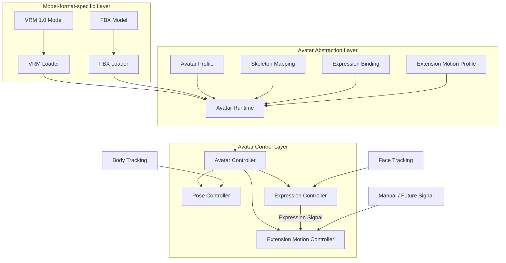

The arrows in the diagram do not represent class inheritance itself but mainly represent:

- data conversion
- passing of information
- flow of control requests

### Model-format-specific Layer

Loads model files such as VRM and FBX and interprets model-format-specific information.

VRM-specific APIs and FBX-specific APIs are, as a rule, confined to this layer.

### Avatar Abstraction Layer

Absorbs differences between model formats so that higher-level control processing can treat them as the same avatar.

Provides standard human bones, extension bones, expressions, extension bone motion settings, model settings, etc. in a format common to this system.

### Avatar Control Layer

Receives tracking results, etc. and applies poses, expressions, and extension bone motion to the abstracted avatar.

It is not aware of the concrete internal structure of VRM or FBX.

### Rationale

Directly connecting model loading to avatar control would require separate control processing for VRM and FBX, and processing would grow with the number of model formats.

Therefore, the boundary

**format-specific processing → common representation → control**

is established.

This limits the impact on other avatar control processing even when changes such as

- changing the VRM library
- changing how FBX is supported
- adding a new 3D model format
- adding new extension bone control

occur.

Clarifying the responsibility of each layer also makes it easier, when a failure occurs, to isolate whether the problem occurred in "loading," "mapping," "pose control," "expression control," or "extension bone control."

---

### Avatar Runtime

The `Avatar Runtime` is the runtime avatar representation used to actually control a loaded 3D model in this system.

It does not mean only the GameObject generated in Unity; it handles together

- the loaded model
- references to standard bones
- references to extension bones
- references to expressions
- the avatar profile
- extension motion settings
- the current avatar state

and so on.

Basically, one Avatar Runtime is created for each loaded avatar.

### Rationale

If only Unity GameObjects are treated as avatars, bone mapping, expression settings, extension bone settings, model-specific settings, etc. tend to be managed in separate places.

Grouping them into a single runtime unit allows

**"the information needed to control this avatar right now"**

to be obtained from one place.

Also, if multiple avatars are handled simultaneously in the future, this can be supported by creating multiple Avatar Runtimes, so the system does not need to assume a single avatar.

---

### Avatar Profile

The `Avatar Profile` is not the model file itself but persistent settings that represent

**how the model is used in this system**

For example, it holds:

- supplementary settings for bone mapping
- extension bone registration information
- expression mapping
- a reference to the extension motion profile
- model scale
- initial position
- initial rotation
- correction information for applying tracking
- model-specific control settings

### Rationale

Writing system-specific information into the model file itself would require modifying the original model.

Also, VRM and FBX differ in what information can be stored inside the model and how.

Therefore, the model file and system-specific settings are separated.

This makes it possible to:

- not modify the original model
- apply different settings to the same model
- change extension bone motion independently of the model file
- update the settings format on the application side alone
- use the same settings management approach regardless of model format

---

### Avatar Controller

The `Avatar Controller` is the high-level control entry point for operating an Avatar Runtime.

Other modules avoid directly operating on Transforms, BlendShapes, VRM APIs, etc. and pass control requests through the Avatar Controller.

Internally, it dispatches processing to the Pose Controller, Expression Controller, Extension Motion Controller, etc.

The Avatar Controller is not designed as a singleton that exists only once in the entire system.

### Rationale

If external modules can freely operate on Unity Transforms, etc., multiple processes may rewrite the same bones, and the processing order and dependencies may become unclear.

Providing a control entry point creates a structure that:

- limits the paths for changing the avatar
- makes control processing traceable
- makes it easy to add control processing in the future
- can support multiple avatars

---

## 7.3 3D Model Loading

Model loading processing is separated by model format.

A common model loading interface is provided, and format-specific loaders are placed as its implementations.

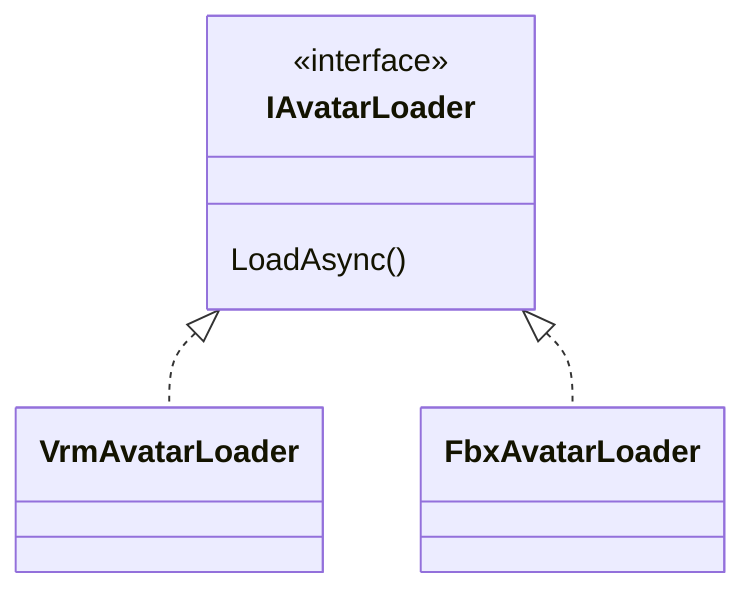

The initially supported formats are as follows.

| Format | Support policy |
|---|---|
| VRM | VRM 1.0 and later are targeted |
| FBX | Supported |

The runtime loading method for FBX, including the library used, is decided in the detailed design.

Loaders load not only standard human bones but also extension bones present in the model, in a state that subsequent processing can reference.

### Rationale

Writing loading processing for each model format directly into common processing would require changing existing code every time a format is added.

Making loaders independent per format allows a new format to be supported, as a rule, simply by adding a loader.

Limiting external dependencies such as the VRM library to the inside of loaders also limits the impact of external library updates.

---

## 7.4 Avatar Profile Management

Model files and system-specific settings are managed separately.

In this system design, these settings are called the **Avatar Profile**.

The name candidates were as follows.

| Name | Meaning / characteristics |
|---|---|
| Avatar Definition | Strongly implies defining the avatar itself and is easily taken to include the model data |
| Avatar Configuration | Clearly settings, but the scope is broad |
| Avatar Descriptor | Means information describing the avatar, but somewhat abstract |
| Avatar Mapping Profile | Expresses bone / expression mapping well, but makes it hard to include other settings |
| **Avatar Profile** | Expresses the full set of per-avatar usage settings well and is easy to distinguish from the model file |

This system adopts **Avatar Profile**.

### Rationale

The name `Definition` strongly suggests "data that defines what the avatar is," that is, including the model itself.

The information to be saved here is

**not the model itself but how the model is used in this system**

Therefore, `Profile`, which readily conveys the meaning of a set of settings, is adopted.

---

## 7.5 Bone Abstraction

Internal Transform structures of VRM, FBX, etc. are not referenced directly from the Tracking module, etc.

The basic human skeleton is based on the humanoid structure and converted into bone identifiers common to this system.

Examples:

- Head
- Neck
- Chest
- Spine
- Hips
- Shoulder
- UpperArm
- LowerArm
- Hand
- UpperLeg
- LowerLeg
- Foot
- each finger joint

On the other hand, the structure can also handle bones not included in the humanoid structure, such as:

- cat ears
- fox ears
- rabbit ears
- tails
- wings
- hair
- clothing
- accessories
- other model-specific bones

Therefore, bones are broadly managed as

- standard human bones
- extension bones

### Initially Supported Extension Bones

As an initial function, the following, which are frequently used in VTuber models, are supported as standard:

- cat ears
- tails

However, the internal implementation is not dedicated to cat ears and tails.

Cat ears and tails also use the common extension motion mechanism described later and are provided as its standard settings.

### User-defined Extension Bones

Any bone present in the model can be additionally registered by the user as an extension bone.

For example,

- fox ears
- rabbit ears
- wings
- ahoge (a single stray strand of hair)
- ribbons
- antennae
- special tails
- other unique accessories

and so on can be registered.

### Rationale

Defining common names for the body parts targeted by human tracking allows control without being aware of the internal structure of VRM or FBX.

On the other hand, forcing cat ears or tails into human bones mixes the meanings of the human skeleton and additional structures.

Therefore, the humanoid structure is made common as standard human bones, and everything else is handled separately as extension bones.

Furthermore, by allowing arbitrary bones to be registered instead of hardcoding only cat ears and tails, the structure can support model-specific features.

---

## 7.6 Pose Application and Absorbing Body Proportion Differences

The human pose obtained from the Tracking module is not applied directly to the model's Transforms.

Tracking results are treated as model-independent pose information and then retargeted to the target avatar.

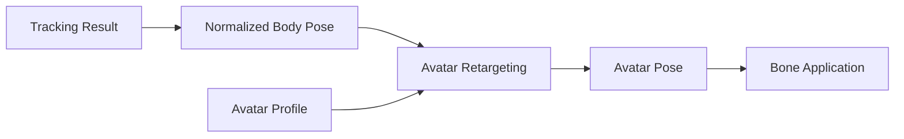

Each model differs in

- height
- arm length
- leg length
- shoulder width
- initial bone pose
- bone rotation axes
- overall model scale

and so on.

These differences are absorbed using model-specific information such as the avatar profile.

### Rationale

The proportions of the actual person and the avatar cannot be expected to match exactly.

Applying tracking values directly to the model may cause

- hands not reaching the correct position
- shoulders deforming unnaturally
- feet floating off the floor
- motion results differing per model

and so on.

Therefore,

**the observed human pose**

and

**the pose applied to the avatar**

are separated.

The concrete algorithm for proportion correction is decided in the detailed design.

Calibration processing, which was independent in an earlier proposal, is also treated as part of this retargeting processing.

---

## 7.7 Expression Control

Expression control is based not mainly on switching expression presets such as smiling or anger but on **continuous expression control through face tracking**.

For example,

- open/close amount of the left and right eyes
- blinking
- open/close amount of the mouth
- mouth shape
- eyebrow movement
- movement of cheeks, etc.

are obtained as continuous values.

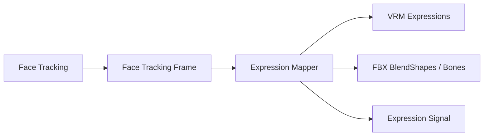

Differences in expression implementation between VRM and FBX are absorbed by expression mapping.

Also, expression presets such as

- Smile
- Angry
- Sad
- Surprised
- user-registered expressions

can be used as an auxiliary function.

The expression control function not only applies expressions to the avatar's face but also provides an **Expression Signal** that other avatar control functions can use.

The Expression Signal represents, for example, expression states such as Smile and Sad and continuous face tracking values for the eyes, mouth, etc. as input values independent of the model format.

### Rationale

For VTuber use, changing expressions continuously to follow actual face movements gives a more natural representation than switching expressions as simple on/off states.

On the other hand, for streaming performances, etc., one may want to switch immediately to a specific expression.

Therefore,

**face tracking is the basis**

while

**preset expressions are an auxiliary function**

and both can be used together.

Also, making it available to other control as an Expression Signal allows cat ears, tails, etc. to move in conjunction with expressions.

---

## 7.8 Extension Bone and Extension Motion Control

An **Extension Motion** mechanism is provided that allows setting motion for extension bones other than standard human bones in response to expressions and other inputs.

Extension motion separates

**what to move**

from

**what to react to and how to move**

```text
Extension Bone
  = what to move

Extension Motion Profile
  = what to react to and how to move
```

### Overall Structure of Extension Motion

Conceptually, the structure is as follows.

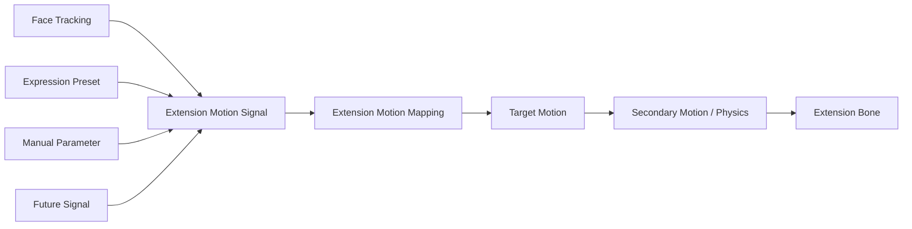

The Extension Motion Controller generates the motion of target extension bones based on input signals and the configured mappings.

---

### Linking with the Expression Signal

The initial function provides expression linking for cat ears and tails.

For example, the following can be used as input:

- Smile
- Angry
- Sad
- Surprised
- Eye Open
- Mouth Open
- other face tracking values
- expression presets
- manual parameters

Input values are handled as normalized signals, such as 0.0 to 1.0, where practical.

### Rationale

Hardcoding specific expression names inside the Extension Motion Controller makes it hard to add new expressions or input signals.

Handling input as common signals allows expression presets, continuous face tracking values, future external input, etc. to be handled by the same mechanism.

---

### Standard Cat Ear Motion

For cat ears, a standard motion profile linked to expressions is provided.

As initial settings, for example,

```text
Smile
 → raise the ears slightly

Sad
 → lay the ears down

Surprised
 → raise the ears strongly

Angry
 → turn the ears slightly backward
```

and so on are assumed.

However, these motions are not fixed specifications.

The user can change at least:

- target bones
- motion axes
- rotation amount
- position change amount
- initial offset
- left/right differences
- response speed
- smoothing
- which signals to react to
- motion amount relative to the signal

### Rationale

Even for the same cat ears, models differ in

- bone axes
- initial pose
- ear size
- preferred motion

The structure provides standard settings while allowing changes according to the model and the user's preference.

---

### Standard Tail Motion

For tails, a standard expression-linked motion profile is also provided.

As initial settings, for example,

```text
Smile
 → wag slowly from side to side

Sad
 → droop downward

Surprised
 → change toward standing up

Angry
 → move more strongly than usual
```

and so on are assumed.

For tails, the structure does not simply convert expressions into fixed angles but allows swaying and physical behavior to be added on top of the base pose and motion amount according to the expression, as in

```text
Expression Signal
      ↓
Base Pose / Motion Parameter
      ↓
Secondary Motion / Physics
      ↓
Final Tail Motion
```

### Rationale

Tails are often composed of multiple bones, and fixed rotations alone make natural motion hard to express.

Changing the base pose and wagging style according to the expression and applying secondary motion on top makes natural motion easier to achieve.

---

### Extension Motion Mapping

Extension motion settings are held as mappings.

Conceptual example:

```text
Extension Motion Mapping
├─ MappingId
├─ Target Extension Element
├─ Input Signal
├─ Input Range
├─ Response Curve
├─ Rotation
├─ Position
├─ Scale
├─ Response Speed
├─ Smoothing
└─ Secondary Motion Settings
```

The detailed data structure is decided in the detailed design.

The structure allows multiple mappings to be set for one extension element.

When multiple signals act on the same element simultaneously,

- blend
- priority
- weight

and so on are also defined in the detailed design.

---

### Extension Motion Profile

A set of extension motion mappings is managed as an **Extension Motion Profile**.

For example, it is held as

```text
Extension Motion Profile
├─ Cat Ear Settings
├─ Tail Settings
└─ User-defined Extension Settings
```

The extension motion profile can be referenced from the avatar profile.

The structure can be extended as needed to duplicate motion profiles, turn them into presets, import / export them, etc.

### Rationale

Separating the extension bones themselves from the motion settings makes it easier to apply different motions to the same model or to change and compare settings.

It also makes future sharing of motion profiles easier to support.

---

### User-defined Extension Elements

Extension elements other than cat ears and tails can also be added by the user from the setup UI.

Conceptually, the following information is set.

```text
Extension Element

Name:
  Fox Tail

Target Bones:
  Tail_01
  Tail_02
  Tail_03

Input:
  Smile

Motion:
  Rotation / Position / Secondary Motion

Response:
  User-defined Settings
```

Targeting bones in the model, the user can register

- extension element name
- target bone or bone chain
- input signal
- motion mapping

This allows

- fox ears
- rabbit ears
- wings
- ahoge
- antennae
- ribbons
- unique accessories

and so on to be added without changing the main code.

### Rationale

3D avatars have additional structures specific to each model.

It is not realistic to predefine every kind in the main application.

Therefore, standard settings are provided for frequently used cat ears and tails, and everything else can be added by the user using the common extension motion mechanism.

---

### Handling Extension Bone Control Failures

Even if a configured extension bone does not exist or there is a problem with a mapping, pose control of standard human bones and expression control are not stopped.

Only the problematic extension element is disabled, and the user is notified.

### Rationale

This prevents abnormal settings of an auxiliary extension element from making the entire avatar unusable.

---

## 7.9 Avatar Management and Switching

Avatars can be switched even during streaming.

The initial implementation mainly targets single-person use, but the internal design does not assume that only one avatar can exist.

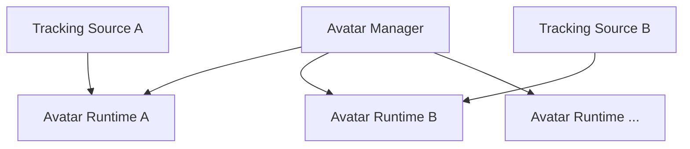

The initial version may limit the number of simultaneously used avatars to one.

### Rationale

Considering only currently needed functions, an implementation that holds a single `CurrentAvatar` is the simplest.

However, if the entire system depends on that structure, supporting multi-person streaming in the future would require a large-scale design change.

Therefore,

**using only one person as an initial function**

and

**the internal structure being dedicated to one person**

are considered separately.

The structure keeps future extensibility while not making the initial implementation more complex than necessary.

---

## 7.10 Scene Structure

Unity scenes are divided into the following two types.

### Persistent Scene

A scene that, as a rule, stays loaded while the application is running.

It mainly contains:

- application management functions
- Avatar Manager
- Avatar Runtime
- tracking-related functions
- audio-related functions
- camera
- UI
- other resident systems

### Stage Scene

Holds stage-specific objects such as backgrounds and 3D spaces.

Stage scenes are switched by additive load / unload.

### Rationale

If avatars, tracking, etc. are placed in the stage scene, they are destroyed and recreated every time the stage changes.

In that case,

- avatar reloading
- tracking reinitialization
- audio processing reinitialization
- loss of UI state
- loss of camera state

and so on may occur.

Therefore,

**systems that should continue regardless of the stage**

and

**the 3D environment replaced when the stage changes**

are separated per scene.

The persistent scene is treated as "the VTuber system itself," and the stage scene as "the stage."

The term `Persistent Scene` is defined within this system design and does not require prior knowledge of past documents.

---

## 7.11 Avatar Data Storage

Models registered by the user are not saved only as references to the original files but are copied into and managed in the system-managed area.

Using the Data Root defined in Chapter 6, they are conceptually stored as follows.

```text
DataRoot/
└─ Avatars/
    └─ <AvatarId>/
        ├─ model.vrm
        ├─ avatar-profile.json
        ├─ extension-motion-profile.json
        └─ thumbnail.png
```

For FBX, required related files are managed in the same way.

Whether the extension motion profile is saved directly inside the avatar profile or managed as a separate file is decided in the detailed design.

### Rationale

Saving only the path to the original file may make a registered avatar unusable due to

- moving the original file
- deletion
- renaming
- an external drive not being connected

and so on.

Copying into the integrated environment allows models to be managed entirely within this system after registration.

It also makes

- backup
- project migration
- export
- diagnostics
- reusing motion profiles
- future sharing functions

easier to implement.

The import source path may be saved as metadata, but it is not depended on at runtime.

---

## 7.12 Separating Setup and Runtime

Processing during avatar registration and configuration is separated from processing during streaming.

### Setup

- model import
- model format detection
- standard bone recognition
- standard bone assignment
- extension bone recognition
- checking cat ear / tail candidates
- registering user-defined extension bones
- expression recognition
- expression mapping
- extension motion mapping settings
- extension motion preview
- model-specific correction
- thumbnail settings
- saving the avatar profile
- saving the extension motion profile

### Runtime

- model loading
- loading the avatar profile
- loading the extension motion profile
- creating the Avatar Runtime
- connecting tracking
- applying poses
- applying expressions
- generating the Expression Signal
- applying extension motion

### Rationale

If bone analysis and extension motion configuration were performed every time during streaming, startup time would increase and user operation would become complex.

By completing analysis and configuration at setup time and saving them, the runtime can use the avatar simply by loading existing settings.

The purpose is to:

- simplify the procedure for starting a stream
- make runtime processing lightweight
- check extension motion in advance
- detect configuration mistakes in advance

---

## 7.13 Error Handling and Diagnostics

Error display for normal users and diagnostic logs for developers are separated.

For example, if model loading fails, the user is shown an easy-to-understand message such as

> Failed to load the avatar.

If there is a problem with the extension bone settings, the scope of impact is made clear, for example:

> The tail motion settings could not be applied. The avatar itself continues to work.

On the other hand, developer logs record the following as needed:

- AvatarId
- model format
- loader
- target file
- missing bones
- missing expressions
- extension element
- extension bone
- extension motion mapping
- input signal
- extension motion application result
- exception
- stack trace

### Rationale

Normal users and developers need different information.

For example, the information

```text
NullReferenceException at VrmAvatarLoader.cs:183
```

is useful to developers but does not help general users solve the problem and gives an unnecessarily complex impression.

Conversely, the information

> Failed to load the model

alone is insufficient for OSS developers to investigate the cause from GitHub issues, etc.

Therefore, the roles are divided:

**the user UI shows "what happened" and "what the user should do"**

while

**developer logs record "what happened internally" in detail**

This ensures both clarity in normal use and failure analysis capability as OSS.

Separating the user-facing display from internal logs also makes it less likely that user messages are dragged along by the internal structure when the internal implementation changes in the future.

---

## 7.14 Internal Division of Responsibilities

The 3D avatar control function does not consolidate processing into a single giant controller but is divided by responsibility.

Conceptually, the following structure is assumed.

```text
Avatar/
├─ Core/
│  ├─ AvatarProfile
│  ├─ AvatarRuntime
│  ├─ AvatarState
│  └─ AvatarBone
│
├─ Loading/
│  ├─ IAvatarLoader
│  ├─ VrmAvatarLoader
│  └─ FbxAvatarLoader
│
├─ Skeleton/
│  ├─ SkeletonMapping
│  └─ ExtensionBone
│
├─ Pose/
│  ├─ AvatarPose
│  ├─ PoseRetargeting
│  └─ PoseController
│
├─ Expression/
│  ├─ FaceTrackingFrame
│  ├─ ExpressionSignal
│  ├─ ExpressionMapping
│  └─ ExpressionController
│
├─ Extension/
│  ├─ ExtensionElement
│  ├─ ExtensionMotionProfile
│  ├─ ExtensionMotionMapping
│  ├─ ExtensionMotionSignal
│  ├─ SecondaryMotionProcessor
│  └─ ExtensionMotionController
│
├─ Runtime/
│  ├─ AvatarController
│  └─ AvatarManager
│
└─ Setup/
   └─ AvatarSetupController
```

### Rationale

Consolidating all processing into one controller makes

- model loading
- pose processing
- expression control
- extension motion
- saving settings
- avatar management

and so on depend on each other, so a change in one place tends to affect other functions.

Separating by responsibility aims to:

- clarify the role of each function
- limit test targets
- reduce the scope of change impact
- make the causes of defects easier to track
- make it easier to add new model formats
- make it easier to add new extension bones
- make it easier to add new extension motion approaches

The directory structure and class names shown here illustrate the approach to dividing responsibilities, and details are adjusted during implementation.


---

---

# 8. Tracking

## 8.1 Basic Policy

The tracking function obtains body, face, and hand/finger movements from cameras, external tracking devices, etc. and converts them into tracking information that can be used in common within this system.

The initial implementation targets camera-based tracking using MediaPipe.

The structure allows external tracking devices such as mocopi and other tracking libraries to be added in the future.

The tracking function does not depend on a specific 3D model format or avatar structure.

### Rationale

If the data format output by tracking libraries such as MediaPipe is passed directly to the Avatar module, the avatar control side depends on MediaPipe-specific landmark structures and coordinate systems.

In that state, switching to mocopi, etc. in the future would require changing the avatar control side as well.

Therefore, a tracking representation common to this system is placed between

**the tracking input method**

and

**the avatar control method**

---

## 8.2 Overall Tracking Structure

Tracking processing conceptually consists of the following flow.

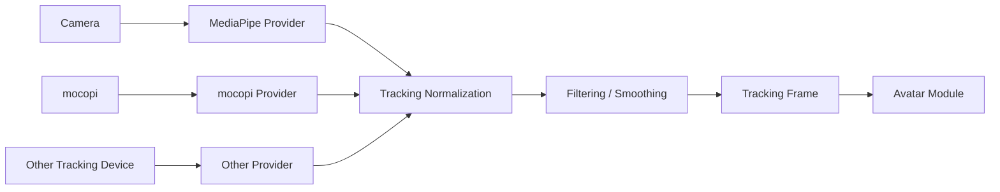

The arrows in the diagram mainly indicate the flow of obtaining, converting, and passing data.

### Rationale

Confining input-device- and library-specific processing inside providers and making subsequent processing common limits the impact of adding or changing input methods.

Separating normalization, smoothing, etc. as common processing also avoids implementing the same processing repeatedly in each provider.

---

## 8.3 Tracking Input Methods

Tracking input is separated into providers by input method.

Conceptually, the structure is as follows.

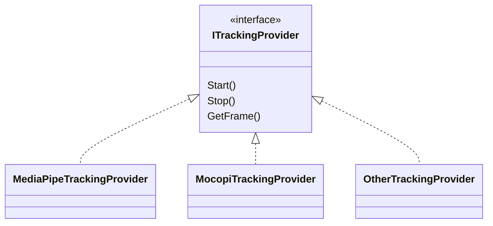

The initial implementation uses MediaPipe.

In the future,

- mocopi
- other camera-based tracking
- motion capture devices
- tracking input over a network

and so on can be added.

### Rationale

Making tracking input a common interface removes the need for higher-level processing to be aware of the library used.

Also, considering the possibility of using multiple input methods simultaneously, providers are not treated as singletons that exist only once in the entire system.

---

## 8.4 Common Tracking Data Format

Information obtained from each provider is converted into `TrackingFrame`, which is common to this system.

TrackingFrame conceptually has the following information:

- body tracking
- hand tracking
- face tracking
- timestamp
- tracking confidence
- tracking source
- tracking status

Body, hand, and face can each be held as independent data structures.

Conceptual example:

```text
TrackingFrame
├─ Timestamp
├─ Body
├─ LeftHand
├─ RightHand
├─ Face
└─ Status
```

### Rationale

Body, hands/fingers, and face may differ in how they are obtained, update frequency, and conditions under which data is missing.

Fixing everything into one giant structure makes it hard to support input methods that use only some tracking.

Therefore, TrackingFrame is a common container that holds the various kinds of tracking information separately inside it.

---

## 8.5 Body Tracking

Body tracking obtains pose information for the head, torso, arms, legs, etc.

The tracking side does not convert this into the specific skeleton structure of an avatar but holds the pose information as observed for a human body.

For example,

- Head
- Neck
- Shoulder
- Elbow
- Wrist
- Hips
- Knee
- Ankle

and so on are treated as human body parts common to this system.

### Rationale

The responsibility of the Tracking module is

**to obtain what pose the person is in**

and not

**how to apply that pose to a specific avatar's skeleton**

Absorbing differences in proportions and bone lengths is done by retargeting on the 3D avatar control side.

This clearly separates the responsibilities of the Tracking module and the Avatar module.

---

## 8.6 Hand and Finger Tracking

Hand and finger tracking obtains the pose of the left and right hands and each finger joint.

When available, joint information for

- wrist
- thumb
- index finger
- middle finger
- ring finger
- little finger

is held.

For input methods where hand/finger tracking is not available, the system can work with body tracking alone.

### Rationale

The amount of information available differs by input method, so making hand/finger tracking a requirement would limit the supported providers.

Therefore, body, hand, and face are treated as independent capabilities, and the structure uses only the information that is available.

---

## 8.7 Face Tracking

Face tracking obtains not only the face direction but also movements of the eyes, mouth, eyebrows, etc.

Basically, as continuous values,

- open/close amount of the left and right eyes
- open/close amount of the mouth
- mouth shape
- eyebrow movement
- face direction
- other available facial features

are held.

The Tracking module outputs these as model-independent face information, and conversion into VRM expressions, FBX blend shapes, etc. is done on the Avatar module side.

### Rationale

Converting face tracking information directly into VRM expression names, etc. would make the Tracking module depend on the model format.

Therefore, the Tracking module represents only "how the person's face is moving," and how to express that movement on the model is left to the Avatar module.

---

## 8.8 Coordinate Systems and Pose Representation

Coordinate systems obtained from each provider are not passed as-is to higher-level processing but are converted into the coordinate system common to this system.

Because each provider may differ in

- right-handed / left-handed systems
- axis directions
- origin position
- units
- quaternion definitions

and so on, these are unified within the provider or normalization processing.

### Rationale

Leaving coordinate system conversion to the Avatar module side would require individual processing for each combination of provider and avatar.

Unifying the coordinate system at the point of tracking output allows the Avatar module to process data without being aware of the input source.

---

## 8.9 Handling Confidence and Missing Data

Tracking data can hold confidence and tracking state for each body part.

For example, states such as

- Tracked
- LowConfidence
- Lost
- NotSupported

can be represented.

When the tracking target is temporarily lost, invalid values are not forcibly applied; holding the previous value, fading, stopping control, etc. can be chosen.

### Rationale

In camera-based tracking, some landmarks may become unavailable due to occlusion or moving out of the field of view.

If missing data is not distinguished from normal values, the avatar may suddenly move into an unnatural pose.

Therefore, not only position and rotation values but also whether those values are reliable are handled as common data.

---

## 8.10 Filtering and Smoothing

Smoothing is performed as needed to suppress small jitter and noise in tracking values.

Smoothing is separated from provider-specific processing and placed as tracking processing common to this system.

Targets assumed include

- position
- rotation
- facial expression values
- hand/finger pose

and so on.

### Rationale

Reflecting tracking results directly on the avatar may make the model constantly tremble slightly due to tiny fluctuations in detected values.

On the other hand, too much smoothing increases control latency.

Therefore, smoothing is made independent, and the structure allows its targets and strength to be adjusted.

The specific filter method is decided in the detailed design.

---

## 8.11 Calibration

The Tracking module handles calibration related to the tracking input itself.

For example,

- setting the forward direction
- reference pose relative to the camera position
- origin setting
- sensor-specific correction

and so on are covered.

On the other hand, absorbing differences such as

- avatar height
- arm length
- shoulder width
- model-specific initial pose

is handled on the Avatar module side.

### Rationale

The word "calibration" tends to include both correction of the input device and correction of avatar proportion differences.

Combining these into the same function makes responsibilities ambiguous.

Therefore,

**correction to observe the input system correctly**

belongs to the Tracking module, and

**correction to fit the observed results to the target avatar**

belongs to the Avatar module.

---

## 8.12 Support for Multi-person Tracking

The initial implementation mainly targets use by one person.

However, the internal design of TrackingFrame, providers, etc. does not assume that only one person can exist.

In the future, the structure can be extended to handle multiple targets, as in

```text
Tracking Session
├─ Person A
│  └─ TrackingFrame
├─ Person B
│  └─ TrackingFrame
└─ Person ...
```

### Rationale

Fully implementing multi-person tracking from the initial stage increases complexity.

On the other hand, a structure that can hold only a single global TrackingFrame would require major changes to support multiple people later.

Therefore, the policy is

**one person as the initial function**

while

**the design is not dedicated to one person**

---

## 8.13 Separating Setup and Runtime

Setup and runtime are also separated for tracking.

### Setup

Mainly handles:

- selecting the provider to use
- selecting the camera
- calibration
- checking the tracking range
- smoothing settings
- debug display
- enabling / disabling each tracking function

### Runtime

Mainly performs:

- starting the provider
- obtaining tracking
- converting to the common format
- normalization
- smoothing
- outputting TrackingFrame

### Rationale

If the input method and detailed parameters had to be configured every time during streaming, operation would become complex.

The structure saves the required settings at setup time and uses the saved settings at runtime to start tracking quickly.

---

## 8.14 Error Handling and Diagnostics

Display for normal users and developer logs are separated.

Normal users are shown easy-to-understand states such as

- the camera cannot be found
- tracking cannot be started
- the target person cannot be detected

and so on.

Developer logs record, as needed,

- provider name
- provider version
- input device
- frame rate
- detection state
- tracking confidence
- reason for initialization failure
- exception
- stack trace

and so on.

### Rationale

Showing internal library errors, etc. directly to normal users rarely helps solve the problem.

On the other hand, investigating failures as OSS requires internal state and error details.

Therefore, as with 3D avatar control,

**actionable information for users**

and

**information allowing cause analysis for developers**

are provided.

---

## 8.15 Internal Division of Responsibilities

The tracking function separates input, normalization, smoothing, state management, etc. by responsibility.

Conceptually, the following structure is assumed.

```text
Tracking/
├─ Core/
│  ├─ TrackingFrame
│  ├─ BodyTrackingData
│  ├─ HandTrackingData
│  ├─ FaceTrackingData
│  └─ TrackingStatus
│
├─ Providers/
│  ├─ ITrackingProvider
│  ├─ MediaPipeTrackingProvider
│  └─ MocopiTrackingProvider
│
├─ Processing/
│  ├─ CoordinateNormalizer
│  ├─ TrackingFilter
│  └─ ConfidenceProcessor
│
├─ Calibration/
│  └─ TrackingCalibration
│
├─ Runtime/
│  └─ TrackingManager
│
└─ Setup/
   └─ TrackingSetupController
```

### Rationale

Consolidating provider-specific processing, coordinate conversion, smoothing, etc. into a single class widens the scope of changes when adding input methods.

Separating by responsibility makes it easier to independently

- add providers
- change filter methods
- change coordinate systems
- add debugging functions

and so on.

The class names and directory structure shown here illustrate the approach to dividing responsibilities, and details are adjusted during implementation.


---

---

