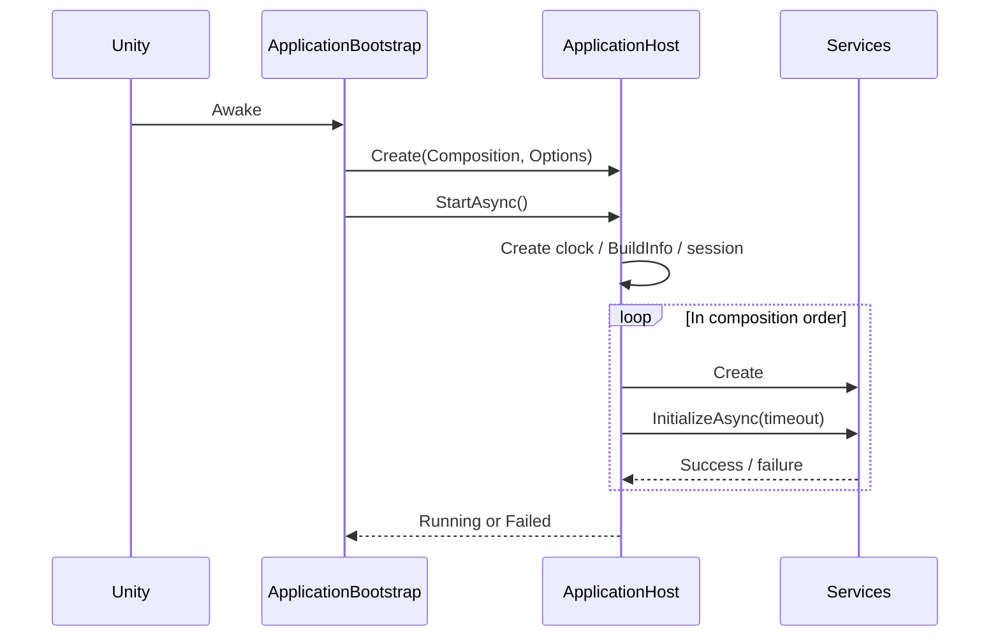
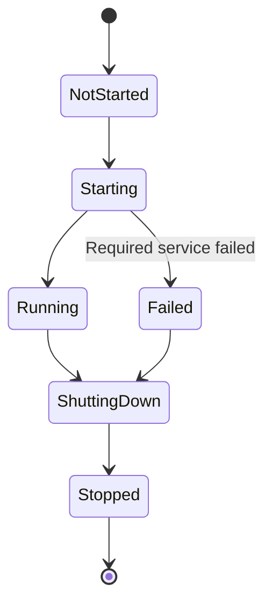

# Application Foundation Detailed Design

## 1. Purpose

This document defines the detailed design of the application foundation that all modules rely on.

It covers:

- application lifecycle (startup and shutdown)
- composition root (creating, wiring, and disposing services)
- persistent scene
- common basic elements (clock, main thread dispatch, session, build information)
- minimal resolution of the Data Root

Logging (system design Chapter 5), performance measurement (5.13, 15.2–15.4), and the UI foundation (Chapter 14) are built on this foundation as separate detailed designs.

Related system design sections:

- 2.4 Module Division Policy
- 2.5 Inter-module Cooperation
- 5.6 Session Identification
- 5.28 Startup and Exit Logs
- 5.29 Version Information
- 6.7–6.10 Data Storage Areas, Data Root
- 7.10 / 11.2 Scene Structure
- 9.11 / 15.7 Separating Real-time Processing from the Main Thread
- 15.10–15.13 Stability, Failure Isolation, Graceful Degradation

---

## 2. Responsibilities

| Responsibility | Owner |
|---|---|
| Controlling the order of application startup and shutdown | Application |
| Creating and wiring the services provided by each module | Application (composition root) |
| Deciding degradation or fatal errors on startup failure | Application |
| Basic contracts such as clock and main thread dispatch | Core |
| Session ID and detecting abnormal termination of the previous session | Application |
| Providing version information | Application |
| Resolving and creating the Data Root | ProjectData |

This foundation does not implement the functions of each module.

Application manages only the creation order and lifetime of services and is not involved in the internal processing of each service.

---

## 3. Module Boundaries

```text
VirtualVessel.Application   Composition root. May reference all modules
        ↓
VirtualVessel.ProjectData   Data Root resolution (minimal scope in this document)
        ↓
VirtualVessel.Core          Basic contracts independent of modules
```

Assemblies, namespaces, and reference directions follow `docs/en/development/unity-project-structure.md`.

Feature modules do not reference Application. Dependencies that a feature module needs are passed by Application as constructor arguments at creation.

Because Diagnostics is an assembly below ProjectData, it does not reference `IDataRoot`. Application obtains the log output directory from the Data Root and passes it as a path when creating the logging service.

No static service locator or global context that holds all services and allows arbitrary retrieval is provided. When components in the persistent scene need dependencies, the composition explicitly calls their initialization methods to pass them.

---

## 4. Main Classes and Interfaces

### 4.1 Core

| Name | Kind | Summary |
|---|---|---|
| `IApplicationService` | Interface | Contract for services whose lifetime the application manages |
| `IMonotonicClock` | Interface | Monotonically increasing high-resolution time |
| `ISystemClock` | Interface | Wall-clock time (UTC) |
| `IMainThreadDispatcher` | Interface | Passes work from any thread to the main thread |

### 4.2 Application

| Name | Kind | Summary |
|---|---|---|
| `ApplicationBootstrap` | MonoBehaviour | The single entry point placed in the persistent scene. Connects the Unity lifecycle with `ApplicationHost` |
| `ApplicationHost` | Internal class | Manages the startup / shutdown order and state of services |
| `ApplicationComposition` | Internal class | Explicitly describes which services are created, in what order, and with which dependencies |
| `ApplicationServiceDescriptor` | Internal class | Service name, criticality, and creation logic |
| `ApplicationState` | Enum | State of the whole application |
| `SessionInfo` | Public class | Session ID, start time, and whether the previous session terminated abnormally |
| `BuildInfo` | Public class | Application version, Unity version, build identifier |
| `UnityMainThreadDispatcher` | Internal class | Unity implementation of `IMainThreadDispatcher` |
| `StopwatchMonotonicClock` / `UtcSystemClock` | Internal class | Clock implementations |

### 4.3 ProjectData

| Name | Kind | Summary |
|---|---|---|
| `IDataRoot` | Interface | Provides the resolved Data Root path and standard subdirectories |
| `DataRootResolver` | Internal class | Determines the Data Root from `bootstrap.json`, etc., and checks creation and writability |

---

## 5. Public API

### 5.1 IApplicationService

```csharp
public interface IApplicationService : IDisposable
{
    string Name { get; }

    Task InitializeAsync(CancellationToken cancellationToken);

    Task ShutdownAsync(CancellationToken cancellationToken);
}
```

- `InitializeAsync` is called exactly once at application startup.
- `ShutdownAsync` is called only for services that started successfully, in reverse startup order.
- `Dispose` is called last regardless of whether `ShutdownAsync` succeeded.

### 5.2 Clock

```csharp
public interface IMonotonicClock
{
    long GetTimestamp();

    long Frequency { get; }

    TimeSpan GetElapsed(long startTimestamp, long endTimestamp);
}

public interface ISystemClock
{
    DateTimeOffset UtcNow { get; }
}
```

- `IMonotonicClock` is used for computing time differences, such as processing time measurement, performance measurement, and A/V synchronization.
- `ISystemClock` is used for human-readable time, such as log timestamps.
- `ISystemClock` is not used to compute time differences.

### 5.3 IMainThreadDispatcher

```csharp
public interface IMainThreadDispatcher
{
    bool IsMainThread { get; }

    void Post(Action action);
}
```

- `Post` can be called from any thread and does not block the caller.
- Posted work runs in order on the main thread within the next Unity frame.
- High-frequency processing such as the audio thread does not call `Post` every time; it is used only on state changes.

### 5.4 IDataRoot

```csharp
public interface IDataRoot
{
    string RootPath { get; }

    string GetDirectory(DataRootDirectory directory);
}
```

`DataRootDirectory` is an enum representing the standard directories of system design 6.10 (Projects, Profiles, Avatars, Logs, Cache, etc.).

---

## 6. Data Model

### 6.1 ApplicationState

```text
NotStarted
Starting
Running
ShuttingDown
Stopped
Failed
```

Even if some optional services fail, the state is `Running`; per-service state is held separately (see 8.3).

### 6.2 Service Criticality

| Criticality | Handling on failure |
|---|---|
| Required | The application becomes `Failed`, and subsequent services are not started |
| Optional | The service is marked unavailable, and startup continues (graceful degradation) |

Required is limited to services without which neither diagnosis nor recovery is possible.

In the initial stage, Data Root resolution and logging are required.

### 6.3 bootstrap.json

The format of `%LOCALAPPDATA%\VirtualVesselStudio\bootstrap.json` from system design 6.8 is as follows.

```json
{
  "schemaVersion": 1,
  "dataRoot": "D:\\VirtualVesselStudioData"
}
```

- `dataRoot` is optional.
- Unknown properties are preserved and not discarded (CLAUDE.md 25).

### 6.4 Session Marker

```text
<Data Root>/Logs/session.lock
```

```json
{
  "sessionId": "<id>",
  "startedAtUtc": "<ISO 8601>",
  "applicationVersion": "<version>"
}
```

---

## 7. State / Lifecycle

### 7.1 Startup



1. Create the clock and build information.
2. Generate the session ID.
3. Resolve the Data Root.
4. Check whether a previous session marker exists; if it remains, determine that the previous session terminated abnormally.
5. Write a new session marker.
6. Create services in the order described in the composition and call `InitializeAsync`.
7. Become `Running` when all required services succeed.

### 7.2 Shutdown

1. On Unity's `Application.wantsToQuit`, return `false` the first time and start shutdown.
2. Call `ShutdownAsync` on services that started successfully, in reverse startup order.
3. `Dispose` all services.
4. Delete the session marker (recording a normal exit).
5. Set the state to `Stopped` and call `Application.Quit()` again.

A timeout is set for the whole shutdown; if exceeded, the remaining processing is abandoned and the application exits. Services that timed out are recorded.

The same shutdown is performed when exiting Play Mode in the Editor.

### 7.3 State Transitions



Even in the `Failed` state, shutdown runs normally and stops services that had started successfully.

---

## 8. Main Sequences

### 8.1 Required Service Failure

1. Detect the exception or timeout.
2. Record the failed service name, exception, and elapsed time.
3. Do not create subsequent services.
4. Stop started services in reverse order.
5. Enter the `Failed` state and notify the user that the application cannot start.

The user-facing notification screen is defined in the UI foundation detailed design. Until then, the failure is recorded in the Unity console and, if available, in the log.

### 8.2 Optional Service Failure

1. Record the failure.
2. Register the service as unavailable.
3. Do not create services that depend on it (the composition makes dependencies explicit).
4. Continue startup.

### 8.3 Exposing Service State

`ApplicationHost` holds the following for each service and makes it available to diagnostics:

- service name
- criticality
- state (NotCreated / Initializing / Running / Failed / Stopped)
- startup duration
- failure reason

---

## 9. Threading / async

- Startup and shutdown processing in `ApplicationHost` runs on the main thread.
- If heavy processing is done in `InitializeAsync` / `ShutdownAsync`, each service is responsible for moving it to a worker thread.
- Application passes a `CancellationToken` shared by all services and cancels it when shutdown starts.
- `async void` is not used. The entry point called from Unity is limited to `ApplicationBootstrap`, which always catches exceptions.
- `UnityMainThreadDispatcher` only adds to an internal queue and does not block the calling thread. The per-frame drain has an item limit to avoid concentrating load in one frame.

---

## 10. Configuration

Startup behavior is specified with `ApplicationStartupOptions`.

| Item | Default | Purpose |
|---|---|---|
| Data Root override | None | Use a temporary directory for tests and development |
| Service initialize timeout | Per service (default 10 seconds) | Prevent indefinite waiting at startup |
| Shutdown timeout | 10 seconds | Prevent indefinite waiting at shutdown |

The Data Root override can also be specified with the command-line argument `--data-root <path>`. It is not shown in the normal user UI.

---

## 11. Storage

| Target | Location |
|---|---|
| `bootstrap.json` | `%LOCALAPPDATA%\VirtualVesselStudio\` |
| Session marker | `<Data Root>/Logs/session.lock` |

### Data Root Resolution Order

1. The Data Root override in `ApplicationStartupOptions`
2. `dataRoot` in `bootstrap.json`
3. The default `%LOCALAPPDATA%\VirtualVesselStudio\Data`

After resolution, the standard directories of system design 6.10 that the foundation uses (Logs, Cache) are created, and writability is checked.

Changing and migrating the Data Root (system design 6.26) is out of scope for this document.

---

## 12. Error Handling and Recovery

| Event | Handling |
|---|---|
| `bootstrap.json` is corrupted | Use the default Data Root; keep the file without overwriting it. Record a warning |
| The specified Data Root is not writable | Required failure, `Failed`. Prompt the user to check the Data Root |
| The session marker cannot be written | Continue startup and record a warning |
| Optional service failure | Degrade and continue as in 8.2 |
| Shutdown timeout | Record it and continue exiting |

---

## 13. Logging and Diagnostics

This foundation records the following. The concrete output method is defined in the logging detailed design.

- At startup: application version, Unity version, OS, Data Root, session ID, and whether the previous session terminated abnormally (system design 5.28)
- Startup results and durations of each service
- At shutdown: normal exit, shutdown duration, and what timed out

Records produced before the logging service starts are kept in memory and output after logging starts.

---

## 14. Testing Strategy

| Kind | Target |
|---|---|
| EditMode | Startup order, reverse-order shutdown, behavior on required / optional failure, timeout, guaranteed dispose (using fake services) |
| EditMode | Data Root resolution order, corrupted `bootstrap.json`, unwritable directory (using temporary directories) |
| EditMode | Detecting abnormal termination of the previous session with the session marker |
| EditMode | Ordering guarantee and item limit of the main thread dispatcher |
| PlayMode | Loading the persistent scene, reaching `Running`, and shutting down normally |

`ApplicationHost` is implemented without depending on UnityEngine so that it can be tested quickly in EditMode.

---

## 15. Performance

- The duration of the whole startup and of each service is recorded so that startup time regressions can be detected.
- `IMonotonicClock.GetTimestamp` does not allocate.
- `IMainThreadDispatcher.Post` does not block for long periods on locks.

---

## 16. Directory / Namespace

```text
Assets/VirtualVessel/
├─ Core/
│  ├─ Runtime/                      VirtualVessel.Core
│  │  ├─ Lifecycle/IApplicationService.cs
│  │  ├─ Time/IMonotonicClock.cs, ISystemClock.cs
│  │  └─ Threading/IMainThreadDispatcher.cs
│  └─ Tests/EditMode/
│
├─ Application/
│  ├─ Runtime/                      VirtualVessel.Application
│  │  ├─ ApplicationBootstrap.cs
│  │  ├─ Hosting/ApplicationHost.cs, ApplicationComposition.cs, ...
│  │  ├─ Session/SessionInfo.cs, SessionMarker.cs
│  │  ├─ Build/BuildInfo.cs
│  │  ├─ Time/StopwatchMonotonicClock.cs, UtcSystemClock.cs
│  │  └─ Threading/UnityMainThreadDispatcher.cs
│  └─ Tests/EditMode/, Tests/PlayMode/
│
└─ ProjectData/
   ├─ Runtime/                      VirtualVessel.ProjectData
   │  └─ DataRoot/IDataRoot.cs, DataRootResolver.cs, BootstrapSettings.cs
   └─ Tests/EditMode/

Assets/Scenes/
└─ Persistent.unity                 Build index 0
```

The `SampleScene` remaining from the URP template is removed from the build settings and deleted when `Persistent.unity` is created.

When Play Mode is started in the Editor from a scene other than the persistent scene, a development-only editor process loads the persistent scene first.

---

## 17. Open Issues

| Item | Planned handling |
|---|---|
| User-facing screen on startup failure | UI foundation detailed design |
| Embedding the build identifier (Git commit, etc.) | When CI is introduced |
| Preventing multiple instances from running at the same time (conflicting use of the same Data Root) | Designed separately after confirming the need |
| Changing and migrating the Data Root | Project / Data detailed design |
