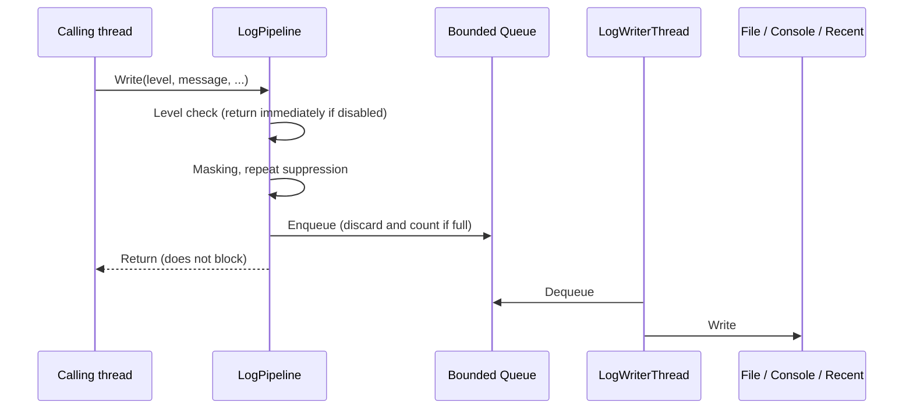

# Logging Detailed Design

## 1. Purpose

This document defines the detailed design of the logging function of the Diagnostics module.

It covers:

- a common logging API used by all modules
- structured logs (module, category, context, properties)
- log file output, rotation, and retention
- asynchronous writing that never blocks the caller
- masking secrets and suppressing repeated logs
- capturing Unity's own logs and unhandled exceptions
- keeping recent logs in memory (a prerequisite for the log viewer and diagnostics snapshot)
- taking over the startup logs of the application foundation

Performance measurement (system design 5.13, 15.2–15.4), the log viewer UI (5.19), and diagnostics export (5.21) are out of scope for this document and are built separately on the API defined here.

Related system design sections:

- 5.1–5.5 Basic policy, separating notifications from logs, log levels, structured logging, per-module logs
- 5.6–5.7 Session, correlation
- 5.8 Log output location
- 5.23 Prohibiting secrets in logs
- 5.25–5.27 Log rotation, controlling high-frequency logs, suppressing repeated errors
- 5.28–5.29 Startup and exit logs, version information
- 5.35 Limiting the runtime impact of diagnostics
- 15.7 Limiting main thread load

---

## 2. Responsibilities

| Responsibility | Owner |
|---|---|
| Providing the logging API and level checks | Diagnostics (Logging) |
| Attaching context (session ID, RunId, etc.) | Diagnostics (Logging) |
| File output, rotation, and retention | Diagnostics (Logging) |
| Masking secrets (as a safety net) | Diagnostics (Logging) |
| Capturing Unity logs and unhandled exceptions | Diagnostics (Logging) |
| Deciding which events to record at which level | Each module |
| User-facing notifications | Each module and the UI (out of scope) |

Logging does not generate user notifications. Separating user notifications from developer logs (system design 5.2) is achieved by each module issuing them separately.

---

## 3. Module Boundaries

```text
VirtualVessel.Application   Creates the logging service and passes ILogProvider to each module
        ↓
Feature modules             Use only ILogProvider / ILog
        ↓
VirtualVessel.Diagnostics   Logging implementation
        ↓
VirtualVessel.Core
```

- Modules do not reference logging implementation classes; they use only `ILogProvider` and `ILog`.
- Diagnostics does not reference the Data Root. Application passes the log output directory as a path (application foundation detailed design, Chapter 3).
- No static logger (a global logger callable from anywhere) is provided. `ILogProvider` is passed from the composition root as a constructor argument.

### Rationale

A static logger is convenient but hard to replace in tests and keeps state when domain reload is disabled. As with the application foundation, dependencies are passed explicitly.

---

## 4. Main Classes and Interfaces

| Name | Kind | Summary |
|---|---|---|
| `LogLevel` | Enum | Trace / Debug / Information / Warning / Error / Critical |
| `ILogProvider` | Interface | Obtains an `ILog` for a module and category |
| `ILog` | Interface | Logging API |
| `LogProperty` | Struct | Key / value of a structured log |
| `LoggingService` | Internal class | `IApplicationService`. Starts, flushes, and stops logging as a whole |
| `LogPipeline` | Internal class | Level check → masking → repeat suppression → enqueue |
| `LogWriterThread` | Internal class | Writes from the queue to sinks on a dedicated thread |
| `ILogSink` | Internal interface | Output destination |
| `JsonLinesFileSink` | Internal class | File output in JSON Lines format, with rotation |
| `UnityConsoleSink` | Internal class | Output to the Unity console |
| `RecentLogBuffer` | Internal class | Ring buffer that keeps recent logs |
| `SecretMasker` | Internal class | Masks strings that look like secrets |
| `RepeatSuppressor` | Internal class | Aggregates the same log repeated within a short time |
| `UnityLogCapture` | Internal class | Captures Unity logs and unhandled exceptions |
| `LogFileRetention` | Internal class | Deletes old log files |

The name `ILogger` is not used because it collides with UnityEngine's `ILogger`.

---

## 5. Public API

### 5.1 ILogProvider

```csharp
public interface ILogProvider
{
    ILog GetLog(string module, string category = null);
}
```

- `module` is a module name from system design 5.5 (e.g. `Avatar`, `Voice`, `VoiceLab`).
- `category` is a processing category within the module (e.g. `RvcTraining`).

### 5.2 ILog

```csharp
public interface ILog
{
    bool IsEnabled(LogLevel level);

    void Write(LogLevel level, string message, Exception exception = null);

    void Write(LogLevel level, string message, IReadOnlyList<LogProperty> properties, Exception exception = null);

    ILog WithContext(string key, string value);
}
```

Extension methods per level (`Information`, `Warning`, `Error`, etc.) are provided.

- `IsEnabled` does not allocate. In places that may be called frequently, check `IsEnabled` before building the message.
- `WithContext` does not modify the original `ILog`; it returns a new `ILog` with the context added. It is used to attach identifiers shared by a series of operations, such as a training run's `RunId` (system design 5.7).

### 5.3 LogProperty

```csharp
public readonly struct LogProperty
{
    public LogProperty(string key, object value);

    public string Key { get; }

    public object Value { get; }
}
```

### 5.4 Usage Example

```csharp
ILog log = logProvider.GetLog("VoiceLab", "RvcTraining").WithContext("RunId", runId);

log.Information("Training started.", new[]
{
    new LogProperty("DatasetId", datasetId),
    new LogProperty("Epochs", epochs),
});
```

---

## 6. Data Model

### 6.1 LogEntry

| Item | Content |
|---|---|
| Timestamp | UTC wall-clock time (`ISystemClock`) |
| ElapsedMs | Elapsed time since session start (`IMonotonicClock`). Used for time-series analysis unaffected by wall-clock changes |
| Level | Log level |
| Module / Category | Source |
| Message | Message |
| Properties | Structured properties |
| Context | Key / values attached by `WithContext` |
| Exception | Exception type, message, and stack trace |
| ThreadId | Source thread |
| RepeatCount | Number of occurrences aggregated by repeat suppression |

The session ID is recorded per file and not included in each line (see 7.3).

### 6.2 Log File Format

The JSON Lines format, one JSON object per line, is used.

```json
{"ts":"2026-10-10T12:00:00.123Z","ms":1532,"lvl":"Warning","mod":"Tracking","cat":"MediaPipe","msg":"Tracking confidence dropped.","ctx":{"RunId":"..."},"props":{"Confidence":0.31},"thr":12}
```

The first line of each file is a header with session information.

```json
{"header":true,"sessionId":"...","applicationVersion":"...","unityVersion":"...","os":"...","schemaVersion":1}
```

### Rationale

Free-text logs are hard to search and aggregate later by module, run, level, etc. (system design 5.4).

JSON Lines can be appended and parsed line by line, and lines before an interrupted write remain valid.

JSON is generated by a minimal writer within Diagnostics, without external libraries.

---

## 7. State / Lifecycle

### 7.1 Startup

The logging service starts first as a required service in the application composition.

1. Delete old log files according to the retention settings (Chapter 10).
2. Create a new log file and write the header.
3. Start the writer thread.
4. Start capturing Unity logs and unhandled exceptions.
5. Output the startup logs that the application foundation kept in memory (`BufferedApplicationLog`) with their original timestamps.
6. From then on, forward the application foundation's logs to the logging service.

### 7.2 Shutdown

1. Stop capturing Unity logs.
2. Write out the logs remaining in the queue (flush). If the timeout is exceeded, discard the rest and output the number discarded to the Unity console.
3. Close the file.

Because the logging service starts first, it stops last. Logs produced while other services shut down are also recorded.

### 7.3 Files

- A new file is created per session.
- When a file exceeds the size limit (default 10 MB), output switches to the next file of the same session.
- File name: `<start date-time>_<first 8 characters of the session ID>_<sequence number>.jsonl`

```text
<Data Root>/Logs/
├─ session.lock
├─ Application/                       Runs of the built application
│  ├─ 20261010-120000_3f2a9c1b_001.jsonl
│  └─ 20261010-120000_3f2a9c1b_002.jsonl
└─ Editor/                            Play Mode in the Unity Editor
   └─ 20261010-130512_9b04d2e7_001.jsonl
```

Runs in Play Mode in the Unity Editor write to `Logs/Editor/`, and runs of the built application write to `Logs/Application/`. The retention settings (Chapter 10) apply per directory.

Play Mode is started frequently during development, so writing to the same directory would push logs from real use out of the retention limits. Mixing both also makes the relevant logs hard to find during investigation.

Application decides which directory to use and passes only the directory path to the logging service. Logging is not aware of whether it runs in the Editor.

Logs specific to external processes and Voice Lab training runs (system design 5.8, 5.9) are defined as separate directories under `Logs/` in their respective detailed designs.

---

## 8. Main Sequences

### 8.1 Writing a Log



### 8.2 Suppressing Repeated Logs (system design 5.27)

- When a log with the same module, category, level, and message repeats within a set time (default 5 seconds), occurrences after the first are not recorded but counted.
- When the time elapses or a different log arrives, one aggregated log with `RepeatCount` is output.
- Logs with different exception types are treated as different logs.

### 8.3 Capturing Unity Logs

- Subscribe to `UnityEngine.Application.logMessageReceivedThreaded` and record as module `Unity`.
- To avoid capturing logs that `UnityConsoleSink` itself wrote to the Unity console again, a per-thread writing flag excludes them.
- Unity's `LogType.Exception` and `LogType.Assert` are recorded as Error.

### 8.4 Unhandled Exceptions

- `AppDomain.CurrentDomain.UnhandledException` is recorded as Critical.
- `TaskScheduler.UnobservedTaskException` is recorded as Error.

---

## 9. Threading / async

- `ILog.Write` can be called from any thread and does not block the caller.
- The queue is lock-free with an upper limit (default 10,000 entries). Beyond the limit, new logs are discarded and the number discarded is counted. The fact that logs were discarded is recorded as a Warning once writing becomes possible again.
- Writing happens on a dedicated background thread. File I/O is not done on the main thread, audio thread, or tracking thread (system design 15.7).
- Real-time processing such as audio callbacks must not log every time; it logs only on state changes (system design 5.26, CLAUDE.md Chapter 20).
- Calling `ILog.Write` allocates a `LogEntry`. It is therefore assumed not to be called from high-frequency processing, and `IsEnabled` and `Write` do not allocate when the level is disabled.

---

## 10. Configuration

| Item | Default | Description |
|---|---|---|
| Minimum level | Information | Changeable in Developer Mode (system design 5.3). Changeable at runtime |
| Per-module minimum level | None | Set only a specific module to Trace, etc. |
| Minimum level for Unity console output | Information | |
| File size limit | 10 MB | |
| Number of files retained | 50 | |
| Retention period | 14 days | |
| Total retained size | 500 MB | |
| Queue limit | 10,000 entries | |
| Repeat suppression window | 5 seconds | |
| Flush timeout at shutdown | 3 seconds | |

Old files are deleted, oldest first, as soon as any retention limit is exceeded.

In the initial stage these are code defaults; a settings UI is added after the UI foundation.

---

## 11. Storage

- Logs are saved in `<Data Root>/Logs/Application/` (system design 5.8, 6.25). Runs in Play Mode in the Unity Editor are saved in `<Data Root>/Logs/Editor/` (7.3).
- Old files are deleted at startup according to the retention settings (Chapter 10) (system design 5.25).
- The current session's files are never deleted.

---

## 12. Secrets and Privacy

- Not outputting secrets to logs is the responsibility of each module (system design 5.23, CLAUDE.md Chapter 20).
- As a safety net, `SecretMasker` replaces the following patterns in messages, properties, and exception messages with `********`:
  - `Authorization: Bearer <token>`
  - values following keys such as `stream key`, `streamkey`, `password`, `token`, `api key`, `apikey`, and `secret` (separated by `=` or `:`)
  - the stream key part of RTMP / RTMPS URLs
  - properties whose key names match the above
- Masking is not a complete safeguard. Adding masking patterns is not a reason to allow secrets in logs.
- Masking personal information in file paths (system design 5.24) is done in the diagnostics export for external sharing and is out of scope for this document.
- Media such as microphone audio and camera video are not written to logs.

---

## 13. Error Handling and Recovery

| Event | Handling |
|---|---|
| The log file cannot be created at startup | Logging service initialization fails (required). The application becomes `Failed` |
| I/O error while writing | Stop the file sink and write an Error to the Unity console. The console sink and recent buffer continue |
| Exception in a sink | Stop only that sink; other sinks continue |
| Queue full | Discard new logs and record the number discarded later |
| Failure deleting old files | Record a Warning and continue startup |

Logging failures do not stop the whole application (except file creation failure at startup).

---

## 14. Logging and Diagnostics

The logging service's own state is available to diagnostics:

- current log file path
- number of entries written
- number discarded (queue full)
- number suppressed (repeated logs)
- sink states (Active / Failed)

`RecentLogBuffer` keeps the most recent logs (default 2,000 entries) and is referenced by the log viewer (system design 5.19) and the diagnostics snapshot (5.20).

---

## 15. Testing Strategy

| Kind | Target |
|---|---|
| EditMode | Level checks, per-module levels, `IsEnabled` |
| EditMode | Immutability of `WithContext` and attaching context |
| EditMode | JSON Lines output content, string escaping |
| EditMode | Each `SecretMasker` pattern |
| EditMode | Repeat suppression (using a fake clock) |
| EditMode | Queue limit and discard count |
| EditMode | Switching files by size, deletion by retention settings |
| EditMode | Flush at shutdown, continuing after a sink failure |
| EditMode | Preventing re-capture when capturing Unity logs |
| EditMode | Taking over startup logs (keeping original timestamps) |
| PlayMode | Logs from application startup to shutdown are written to a file |
| Performance | `Write` does not allocate when the level is disabled, and the cost of calling `Write` (the `tests/performance/` foundation is defined in the performance measurement detailed design) |

---

## 16. Performance

- The caller's cost of `Write` is limited to the level check, masking, and enqueueing; it does not include file I/O.
- Nothing is allocated when the level is disabled.
- The writer thread waits while the queue is empty and does not consume CPU.
- Writes are buffered and not flushed per entry. However, Error and above are flushed immediately so that logs just before an abnormal termination are less likely to be lost.

---

## 17. Directory / Namespace

```text
Assets/VirtualVessel/Diagnostics/
├─ Runtime/                         VirtualVessel.Diagnostics
│  └─ Logging/                      VirtualVessel.Diagnostics.Logging
│     ├─ LogLevel.cs, ILog.cs, ILogProvider.cs, LogProperty.cs, LogExtensions.cs
│     ├─ LoggingService.cs, LoggingSettings.cs
│     ├─ Pipeline/LogEntry.cs, LogPipeline.cs, RepeatSuppressor.cs, SecretMasker.cs
│     ├─ Writing/LogWriterThread.cs, ILogSink.cs, JsonLinesFileSink.cs, LogFileRetention.cs, JsonWriter.cs
│     ├─ Unity/UnityConsoleSink.cs, UnityLogCapture.cs
│     └─ Recent/RecentLogBuffer.cs
└─ Tests/EditMode/, Tests/PlayMode/
```

Application creates `LoggingService` in the composition and passes `ILogProvider` to subsequent services. After logging starts, the application foundation's `IApplicationLog` is switched to an adapter that forwards to `ILog`.

---

## 18. Open Issues

| Item | Planned handling |
|---|---|
| Log viewer UI | After the UI foundation |
| Diagnostics export and path masking | Diagnostics export detailed design |
| Logging settings UI | After the UI foundation |
| Log placement for external processes / training runs | Each module's detailed design |
| Allocation-free logging API for high-frequency code | Considered once the need is confirmed |
