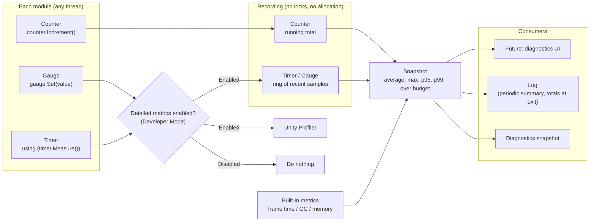
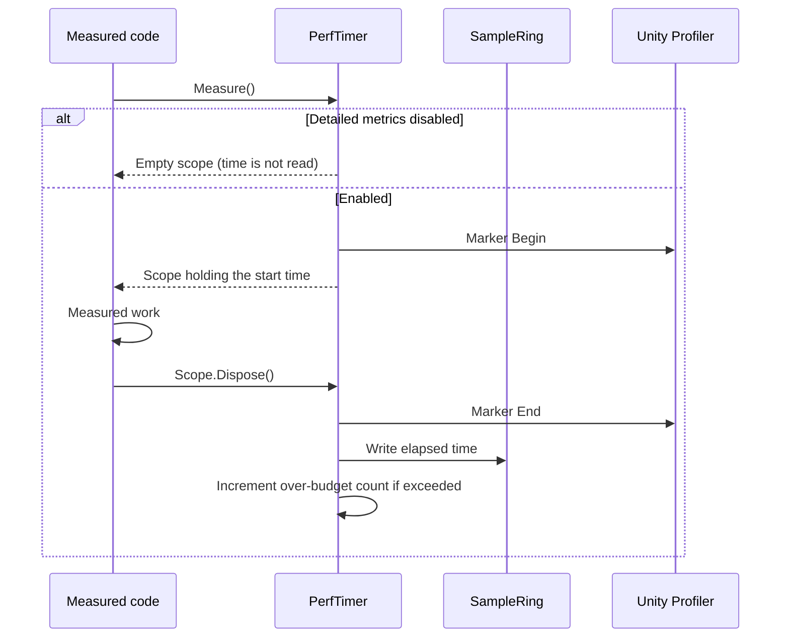

# Performance Metrics Detailed Design

## 1. Purpose

This document defines the detailed design of the performance metrics function of the Diagnostics module.

It covers:

- a measurement API used by all modules (Timer, Counter, Gauge)
- statistics (current value, average, maximum, 95th / 99th percentiles, over-budget count)
- enabling and disabling measurement according to Developer Mode
- integration with the Unity Profiler
- built-in measurements such as frame time, GC, and memory
- a foundation for performance tests

The diagnostics UI that displays measurements (system design 5.16, 5.18) is out of scope for this document and is built separately on the snapshot API defined here.

Related system design sections:

- 5.13 Performance diagnostics
- 5.14 Audio pipeline diagnostics
- 5.35 Limiting the runtime impact of diagnostics
- 15.2–15.5 Performance, real-time behavior, real-time audio and video performance
- 15.21 Performance regression tests
- 15.34 Observability

### Overview



Counters are always recorded; timers and gauges are recorded only when detailed metrics are enabled (Chapter 7).

---

## 2. Responsibilities

| Responsibility | Owner |
|---|---|
| Providing the measurement API, recording, and computing statistics | Diagnostics (Performance) |
| Switching detailed metrics on and off | Diagnostics (Performance). The switch is operated from the UI (Developer Mode) |
| Built-in measurements such as frame time, GC, and memory | Diagnostics (Performance) |
| What to measure under which name, and what budget to use | Each module |
| Time measurement needed for functionality (such as A/V sync offset correction) | Each module (out of scope) |

This function is for observation only. Measurements needed for the application's behavior itself, such as A/V sync corrections or buffer size adjustments, are done by each module on its own and must not be affected by whether detailed metrics are enabled.

---

## 3. Module Boundaries

- Each module uses only timers, counters, and gauges obtained from `IPerformanceMetrics`.
- Like logging's `ILogProvider`, `IPerformanceMetrics` is passed from the composition root as a constructor argument. There is no static access.
- Each class obtains its timers, etc. in its constructor, keeps them in fields, and uses those fields where it measures.

### Rationale

Using the same handover as logging makes each class's dependencies clear and makes measurements easy to replace in tests. The measuring code itself is a single line, so usability is not lost.

---

## 4. Main Classes and Interfaces

| Name | Kind | Summary |
|---|---|---|
| `IPerformanceMetrics` | Interface | Obtains timers, counters, and gauges; exposes whether detailed metrics are enabled |
| `PerfTimer` | Class | Measures processing time |
| `PerfTimer.Scope` | Struct | Measures a section with `using` |
| `PerfCounter` | Class | Counts occurrences |
| `PerfGauge` | Class | Records a value at a point in time |
| `MetricSnapshot` | Class | Statistics of one measurement |
| `PerformanceSnapshot` | Class | Statistics of all measurements |
| `PerformanceMetricsService` | Public class | `IApplicationService`. Registration, enabling / disabling, built-in metrics, periodic summary |
| `SampleRing` | Internal class | Fixed-length ring of recent samples |
| `BuiltinMetricsCollector` | Internal class | Frame time, GC, and memory via Unity `ProfilerRecorder` |

---

## 5. Public API

### 5.1 IPerformanceMetrics

```csharp
public interface IPerformanceMetrics
{
    bool IsDetailedEnabled { get; }

    PerfTimer Timer(string module, string name, TimeSpan? budget = null);

    PerfCounter Counter(string module, string name);

    PerfGauge Gauge(string module, string name, string unit = null);

    PerformanceSnapshot GetSnapshot();
}
```

- Requesting the same module and name returns the same instance, so multiple classes can share a measurement.
- A timer with a `budget` counts how many times the budget was exceeded (for example the processing deadline in system design 15.4).

### 5.2 PerfTimer

```csharp
public sealed class PerfTimer
{
    public Scope Measure();

    public long Begin();

    public void End(long beginToken);

    public void Record(TimeSpan duration);

    public readonly struct Scope : IDisposable
    {
        public void Dispose();
    }
}
```

| Usage | Purpose |
|---|---|
| `using (timer.Measure()) { ... }` | A section within one method. Use this by default |
| `long t = timer.Begin(); ... timer.End(t);` | A section whose start and end are in different methods or callbacks |
| `timer.Record(duration)` | Recording a duration obtained elsewhere (GPU time, etc.) |

### 5.3 PerfCounter

```csharp
public sealed class PerfCounter
{
    public void Increment();

    public void Add(long value);

    public long Value { get; }
}
```

### 5.4 PerfGauge

```csharp
public sealed class PerfGauge
{
    public void Set(double value);
}
```

### 5.5 Usage Example

```csharp
internal sealed class RvcVoiceConverter
{
    private readonly PerfTimer _inferenceTime;
    private readonly PerfCounter _deadlineMisses;

    public RvcVoiceConverter(IPerformanceMetrics metrics, ...)
    {
        _inferenceTime = metrics.Timer("Voice", "RvcInference", budget: TimeSpan.FromMilliseconds(200));
        _deadlineMisses = metrics.Counter("Voice", "DeadlineMiss");
    }

    public void Process(...)
    {
        using (_inferenceTime.Measure())
        {
            RunInference();
        }
    }
}
```

---

## 6. Data Model

### 6.1 Kinds of Measurement

| Kind | What is recorded | When detailed metrics are disabled |
|---|---|---|
| Timer | Processing time (milliseconds) | Not recorded |
| Counter | Running total | **Recorded** |
| Gauge | Value at a point in time, with unit | Not recorded |

### 6.2 MetricSnapshot

| Item | Timer | Counter | Gauge |
|---|---|---|---|
| Module / Name / Unit | ○ | ○ | ○ |
| Last (current value) | ○ | ○ (total) | ○ |
| Average | ○ | | ○ |
| Max | ○ | | ○ |
| P95 / P99 | ○ | | ○ |
| SampleCount (samples used for statistics) | ○ | | ○ |
| TotalCount (number of recordings in total) | ○ | | ○ |
| Budget / OverBudgetCount | ○ (when set) | | |

- Average, Max, P95, and P99 are computed from the most recent samples (512 by default), because a long-running average hides temporary degradation (system design 15.3).
- OverBudgetCount is a running total.

---

## 7. State / Lifecycle

### 7.1 Enabling and Disabling Detailed Metrics

- Detailed metrics are switched at runtime together with Developer Mode (system design 14.22). No restart is needed.
- Until the Developer Mode settings UI exists, detailed metrics are enabled by default in the Unity Editor and disabled in built applications.
- Recording starts when switching from disabled to enabled. Switching from enabled to disabled keeps the statistics gathered so far.

### 7.2 Why Counters Are Always Recorded

- Recording a counter only increments a number, which is negligible.
- Counts of audio dropouts, frame drops, reconnects, etc. cannot be recovered retroactively by enabling Developer Mode after a problem is reported. Counting them at all times allows them to be included in the diagnostics snapshot of a problem report.

### 7.3 Service

- `PerformanceMetricsService` is an optional service started right after logging.
- Obtaining and recording timers, etc. is possible before `InitializeAsync`. `InitializeAsync` starts the built-in measurements and the periodic summary.
- At shutdown, the values of non-zero counters are written to the log at Information level. When detailed metrics are enabled, timer statistics are written as well.

---

## 8. Main Sequences

### 8.1 Measuring with a Timer



### 8.2 Periodic Summary

While detailed metrics are enabled, timer and gauge statistics are written to the log at Debug level at a fixed interval (30 seconds by default). This makes performance trends visible from the log even before a diagnostics UI exists.

---

## 9. Threading / async

- Timers, counters, and gauges can be called from any thread.
- Recording uses no locks. Counters add with `Interlocked`. The write position of a SampleRing advances with `Interlocked`.
- If multiple threads write to the same SampleRing simultaneously, statistics may be slightly inaccurate. This is acceptable for diagnostics; avoiding lock delays takes priority.
- Statistics are computed by the caller of `GetSnapshot` (the diagnostics UI or log output), not on the recording side.
- Unity Profiler markers must begin and end on the same thread. Markers are used only by the `Measure()` scope, not by `Begin()` / `End()`.

---

## 10. Configuration

| Item | Default | Description |
|---|---|---|
| Detailed metrics | Editor: enabled / Player: disabled | Switched at runtime with Developer Mode |
| Samples used for statistics | 512 | Per timer / gauge |
| Periodic summary interval | 30 seconds | 0 disables it |
| Built-in metrics | Enabled | Active only when detailed metrics are enabled |

Values are consolidated in `PerformanceSettings` and, as with logging (`LoggingSettings`), passed in by Application at creation.

---

## 11. Storage

- Measurements are kept only in memory and are not saved to files directly.
- Information that must persist goes through the log (periodic summary, totals at exit) and the diagnostics export.

---

## 12. Built-in Metrics

When detailed metrics are enabled, the following are obtained from Unity's `ProfilerRecorder`.

| Module | Name | Content |
|---|---|---|
| Application | MainThreadFrameTime | Main thread processing time per frame |
| Application | GcAllocatedInFrame | GC allocation per frame |
| Application | GcReservedMemory | Memory reserved by the GC |
| Application | SystemUsedMemory | Memory used by the whole process |

`ProfilerRecorder` keeps its own samples, so no per-frame work is added; values are read when a snapshot is taken.

Environment-dependent measurements such as GPU usage and GPU memory are added in the detailed design of the corresponding module.

---

## 13. Error Handling

- Measurement failures never stop the application or the measured work.
- If a built-in measurement is unavailable on the platform, only that measurement is excluded, and this is recorded in the log.
- Requesting a different kind of measurement (such as Timer and Counter) under the same module and name is treated as a development mistake and throws an exception.

---

## 14. Logging and Diagnostics

- The periodic summary (8.2) and the totals at exit (7.3) are written to the log.
- `GetSnapshot` is used by the future diagnostics UI (system design 5.16) and diagnostics snapshot (5.20).

---

## 15. Testing Strategy

### 15.1 Unit Tests (EditMode)

| Target |
|---|
| Computing average, maximum, and percentiles |
| Over-budget counts |
| Timers / gauges do not record when detailed metrics are disabled, while counters do |
| Switching enabled / disabled at runtime |
| The same name returns the same instance, and a kind mismatch throws |
| Measuring calls (`Measure`, `Increment`, `Set`) do not allocate |

### 15.2 Performance Tests

Performance tests use Unity's official **Performance Testing Extension** (`com.unity.test-framework.performance`).

- It is a package used only during development and testing, referenced only from test assemblies, and is not included in built applications.
- In Unity 6.6 it is a core package bundled with the Unity Editor (`6.6.0`). Its version is pinned by the Unity Editor version in `ProjectVersion.txt`.
- Its license is the Unity Companion License (the bundled Perfolizer is MIT).

Within the scope of this document, the following are measured:

- the cost of calling `Measure()` (with detailed metrics enabled and disabled)
- the cost of calling `ILog.Write` (logging)

### 15.3 Placement of Performance Tests

Unity tests can only be placed in assemblies inside the Unity project. Therefore, performance tests are placed as follows.

| Location | Content |
|---|---|
| `Assets/VirtualVessel/<Module>/Tests/Performance/` | Performance tests that run in Unity (`VirtualVessel.<Module>.Tests.Performance`) |
| `tests/performance/` (repository root) | Scripts for running on hardware CI, baselines for comparison, and result history |

---

## 16. Performance

- When detailed metrics are disabled, `Measure()` only checks the flag; it does not read the time, use profiler markers, or record.
- A counter's `Increment()` is only `Interlocked.Increment`.
- Measuring code does not allocate. `Scope` is a struct and is used with `using` in a way that does not box.

---

## 17. Directory / Namespace

```text
Assets/VirtualVessel/Diagnostics/
├─ Runtime/
│  └─ Performance/                  VirtualVessel.Diagnostics.Performance
│     ├─ IPerformanceMetrics.cs, Metric.cs, PerfTimer.cs, PerfCounter.cs, PerfGauge.cs
│     ├─ MetricSnapshot.cs, PerformanceSnapshot.cs
│     ├─ PerformanceMetricsService.cs, PerformanceSettings.cs
│     ├─ Recording/SampleRing.cs, MetricRegistry.cs, DetailedSwitch.cs
│     └─ Builtin/BuiltinMetricsCollector.cs
└─ Tests/
   ├─ EditMode/
   └─ Performance/                  VirtualVessel.Diagnostics.Tests.Performance
```

---

## 18. Open Issues

| Item | Planned handling |
|---|---|
| Connecting to the Developer Mode UI | UI foundation |
| Diagnostics UI and overlay that display measurements | After the UI foundation |
| Environment-dependent measurements such as GPU usage and GPU memory | Each module's detailed design |
| Criteria for performance regressions on hardware CI | When hardware CI is introduced |
