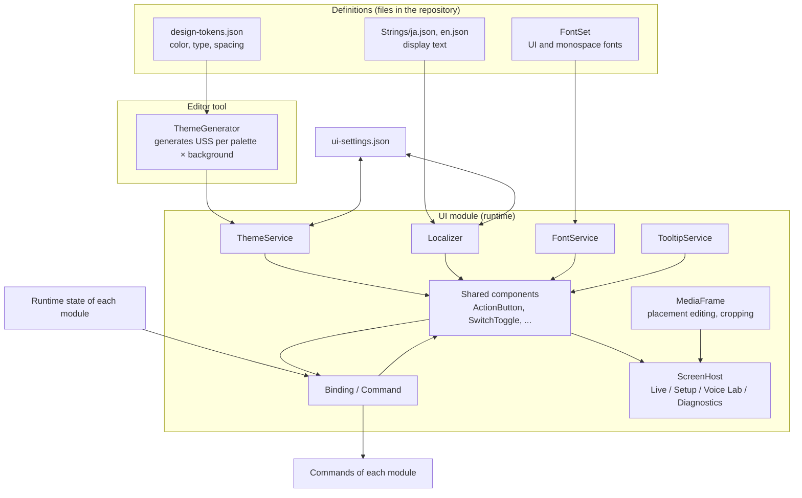
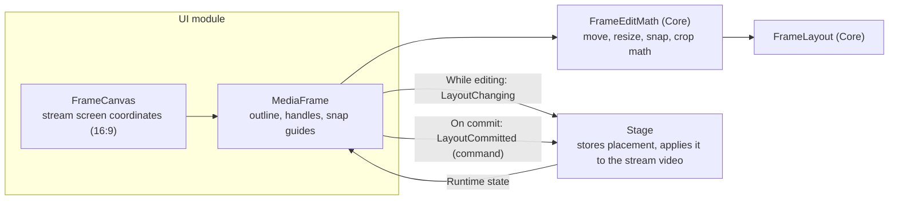

# UI Foundation Detailed Design

## 1. Purpose

This document defines the detailed design of the foundation of the UI module.

It covers:

- easy-to-use shared components (project-owned parts built on UI Toolkit)
- theme (palette, dark or light, UI scale, reduced motion)
- managing and switching fonts as a whole
- localization (a lightweight project-owned mechanism)
- tooltips
- displaying runtime state and operating through commands
- a panel for editing placement on the stream screen and cropping (`MediaFrame`)
- screen switching and Developer Mode
- storing UI-specific settings
- checking the display with screenshots

Visual values and component specifications are defined in the following documents. This document defines how they are realized in Unity.

- `docs/en/ui/design-system.md`
- `docs/en/ui/components.md`
- `docs/en/ui/ui-guidelines.md`

Related system design: Chapter 14 (UI and operation), 6.8 (storing basic settings), 16.14 (UI locale extension), 16.15 (UI theme extension)

### Overview



---

## 2. Responsibilities

| Responsibility | Owner |
|---|---|
| Shared components, tooltips, binding, command execution | UI |
| Switching theme, fonts, and language | UI |
| Screen switching, switching Developer Mode | UI |
| Contents of UI-specific settings (`ui-settings.json`) | UI |
| Reading and writing settings files (schema version, atomic write, keeping unknown fields) | ProjectData |
| Placement editing math (move, resize, snap, crop) | Core (`FrameEditMath`, no Unity dependency) |
| Storing placement data (`FrameLayout`) and applying it to the stream video | Stage (when implemented). The UI requests changes through commands |
| State and operations of each function | Each module. The UI only displays state and calls commands |

---

## 3. Module Boundaries

- The UI receives each module's runtime state as `IReadOnlyObservable<T>` and displays it. UI state is not treated as runtime state (system design 14.29).
- Operations from the UI reach each module through `IUiCommand`. The UI does not operate other modules' internal classes directly.
- `MediaFrame` does not draw video. Compositing the stream video is the responsibility of Stage and Video (CLAUDE.md Chapter 6); `MediaFrame` only edits placement data.
- The dependency direction is `Application → UI → each module → Diagnostics → Core`. UI parts do not depend on other modules. Screens depend only on the public interfaces of the modules.

---

## 4. Pain Points of Stock Unity UI and Remedies

Using UI Toolkit as is has the following problems. The shared components and surrounding mechanisms solve them.

| Problem | Remedy |
|---|---|
| Event registration and unregistration are written by hand; a missed unregistration causes leaks or calls after disposal | Bindings unregister automatically when the element leaves the panel (7.3) |
| No way to show tooltips at runtime (the `tooltip` attribute is editor-only) | `TooltipService` (7.6) |
| Localizing display text requires code every time | Specifying `text-key` in UXML is enough for language switching (7.4) |
| Visual variants are specified by class-name strings, and typos go unnoticed | Variants are enum properties (for example `variant="Primary"`) |
| Setting a value from code also raises the change event, making it hard to tell from user input | Display updates use `SetValueWithoutNotify`, and only user input goes to commands (7.3) |
| No standard way to tell why something cannot be pressed | Commands carry the reason; the button is disabled and shows it in a tooltip (7.5) |
| Label position and spacing differ between controls | Shared components have the structure and spacing defined in `components.md` |

---

## 5. Main Classes and Interfaces

| Name | Kind | Summary |
|---|---|---|
| `UiRoot` | MonoBehaviour | Entry point of the UI in the persistent scene. Holds the `UIDocument` and UI assets and connects the services |
| `UiAssets` | ScriptableObject | References to PanelSettings, generated themes, font sets, string tables, and screen UXML |
| `ThemeService` | Class | Applies palette, background, scale, and reduced motion |
| `FontService` | Class | Switches font sets |
| `FontSet` | ScriptableObject | UI and monospace font assets, fallback |
| `Localizer` / `ILocalizer` | Class / Interface | Gets display text and switches language |
| `TooltipService` | Class | Shows tooltips |
| `IUiCommand` | Interface | An operation run from the UI |
| `IReadOnlyObservable<T>` / `ObservableValue<T>` | Interface / Class (Core) | A value that notifies changes |
| Shared components | VisualElement | The parts in `components.md` (Chapter 6) |
| `MediaFrame` / `FrameCanvas` | VisualElement | Placement editing and cropping (Chapter 9) |
| `FrameLayout` / `FrameEditMath` | Struct / static class (Core) | Placement data and editing math |
| `ScreenHost` | VisualElement | Screen switching |
| `DeveloperModeService` | Class | Switches Developer Mode and propagates it to related functions |
| `UiSettings` | Class | Contents of the UI-specific settings |
| `ConfigFileStore` | Class (ProjectData) | Reads and writes settings files |
| `ThemeGenerator` | Editor | Generates USS for each theme from the tokens |
| `UiScreenshotCapture` | Editor | Writes screens to PNG |

---

## 6. Shared Components

### 6.1 List

Each part in `components.md` is implemented as a class derived from `VisualElement`, usable from both UXML and C#.

| Part | Class | UXML example |
|---|---|---|
| Button | `ActionButton` | `<vv:ActionButton variant="Primary" text-key="live.start" tooltip-key="tip.live.start" />` |
| Icon Button | `IconButton` | `<vv:IconButton icon="Mic" toggle="true" tooltip-key="tip.mute" shortcut="Ctrl+M" />` |
| Toggle | `SwitchToggle` | `<vv:SwitchToggle text-key="voice.convert" />` |
| Slider | `ValueSlider` | `<vv:ValueSlider low-value="-60" high-value="0" unit="dB" />` |
| Level Meter | `LevelMeter` | `<vv:LevelMeter segments="24" />` |
| Dropdown | `SelectField` | `<vv:SelectField label-key="audio.mic.device" />` |
| Text Field | `TextInput` | `<vv:TextInput label-key="stream.title" />` |
| Numeric Field | `NumberInput` | `<vv:NumberInput label-key="audio.sampleRate" unit="Hz" />` |
| Tab | `TabBar` | `<vv:TabBar />` |
| Setting Row | `SettingRow` | `<vv:SettingRow name-key="audio.noise" description-key="audio.noise.desc">…</vv:SettingRow>` |
| Card | `Card` | `<vv:Card title-key="voice.title">…</vv:Card>` |
| Dialog | `ConfirmDialog` | Shown from C# with `ConfirmAsync` (6.4) |
| Status Indicator | `StatusChip` | `<vv:StatusChip status="Success" text-key="trk.good" />` |
| Notification | `Notice` | Shown from C# through `NotificationService` |
| Progress Bar | `ProgressMeter` | `<vv:ProgressMeter label-key="lab.training" />` |
| Navigation Item | `NavItem` | `<vv:NavItem icon="Live" text-key="nav.live" />` |
| Preview | `StreamPreview` | `<vv:StreamPreview />` |
| Panel | `MediaFrame` | Chapter 9 |

The UXML namespace is `VirtualVessel.UI.Controls` with the prefix `vv`. Classes are defined with `[UxmlElement]` and `[UxmlAttribute]` (Unity 6).

### 6.2 Common Attributes

Every shared component has the following attributes.

| Attribute | Contents |
|---|---|
| `*-key` such as `text-key` | String key of the display text. Updated automatically when the language changes |
| `tooltip-key` | String key of the tooltip |
| `shortcut` | Shortcut notation shown with the tooltip |

Attributes that set display text directly (such as `text`) are not used on user-facing screens.

### 6.3 Building from C#

For building without UXML, a short factory is provided.

```csharp
var start = Ui.Button("live.start", ButtonVariant.Primary)
    .WithTooltip("tip.live.start", "Ctrl+Enter")
    .Bind(_startStreaming);
```

### 6.4 Dialogs and Confirmation

Actions that are hard to undo run only after confirmation.

```csharp
bool confirmed = await _dialogs.ConfirmAsync(
    titleKey: "live.end.confirm.title",
    bodyKey: "live.end.confirm.body",
    confirmKey: "live.end",
    style: ConfirmStyle.Danger);
```

A command registered as a `DangerCommand` shows the confirmation dialog automatically when run from an `ActionButton`.

### 6.5 Style

- Each part's USS lives in `Assets/VirtualVessel/UI/Styles/Components/`, and every color, spacing, and radius refers to tokens with `var()`.
- States are expressed with USS pseudo-classes (`:hover`, `:focus`, `:disabled`, `:checked`) and classes added by the part (such as `vv-status-success`).

---

## 7. Mechanisms

### 7.1 Theme

**Source of tokens**

`Assets/VirtualVessel/UI/Theme/design-tokens.json` holds the values from `design-system.md` (palettes, neutral S/L, status colors, type, spacing, radius). It is the single source on the Unity side.

**Generating USS**

USS cannot compute colors with `color-mix()` or HSL. The editor tool `ThemeGenerator` therefore generates the following USS from the tokens.

```text
Assets/VirtualVessel/UI/Theme/Generated/
├─ tokens-common.uss              spacing, radius, text sizes (theme-independent values)
├─ theme-lavender-dark.uss         color custom properties (precomputed values)
├─ theme-lavender-light.uss
├─ …                               6 palettes × 2 backgrounds = 12 files
```

- The generated USS is committed to the repository. Builds do not need to generate it.
- An EditMode test confirms that the generated output matches the tokens (end of 7.1).

**Applying a theme**

`ThemeService` swaps the theme USS attached to the root `VisualElement`. Every part refers to `var(--color-primary)` and similar, so swapping changes the colors everywhere.

| Setting | How it is applied |
|---|---|
| Palette, background | Swap the theme USS |
| UI scale | `PanelSettings.scale` (100%, 110%, 125%, 150%) |
| Reduced motion | Add the `vv-reduced-motion` class to the root; each part's USS stops transitions and blinking |

**Token tests**

- The committed USS matches the result of regenerating from `design-tokens.json`.
- Every palette and background meets the contrast in `design-system.md` 9.2 (body text at least 4.5:1, `On Accent` on Primary at least 4.5:1, `Accent Line` on backgrounds at least 3:1).
- The palette values written in `docs/assets/ui/styleboard.html` match `design-tokens.json`.

### 7.2 Fonts

**FontSet**

Fonts are handled as a set in a `FontSet` (ScriptableObject).

| Item | Contents |
|---|---|
| UI font | Font assets for body, headings, buttons (Regular, Medium, Bold) |
| Mono font | Font asset for numbers and logs |
| Fallback | Order of font assets used when glyphs are missing |

The default font set is `NotoSans` (Noto Sans JP + Noto Sans Mono).

**How bulk changes work**

- All text decides its font through typography classes (`vv-text-heading`, `vv-text-body`, `vv-text-mono`, and so on).
- Typography classes refer to the font through a custom property, as in `-unity-font-definition: var(--font-ui)`.
- For each font set, `ThemeGenerator` generates a small USS (`fonts-<FontSet>.uss`) that defines `--font-ui` and `--font-mono`.
- `FontService` swaps this USS. Swapping it changes the font of the whole application at once.

This enables two kinds of bulk change.

| Situation | Method |
|---|---|
| Changing the default font during development | Replace the contents of the default font set. Screen UXML and USS do not change |
| A user changes it in settings | Change `fontSet` in `ui-settings.json`. It switches while running |

**Language and fonts**

- Each language in the string tables (7.4) can name a preferred font set. This is for future languages that the Japanese font cannot display.
- Fallback is set in the PanelSettings text settings so that no glyphs are missing (system design 14.9).
- Japanese has many characters, so font assets are dynamic (glyphs are added to the atlas at runtime as needed).

**Font files**

- Font files are placed unmodified in `Assets/ThirdParty/NotoSansJP/` and `Assets/ThirdParty/NotoSansMono/`, together with the OFL license text.
- `*.ttf` and `*.otf` are added to `.gitattributes` as binary.

### 7.3 Binding and Runtime State

**Observable**

Each module exposes the state it shows to the UI as `IReadOnlyObservable<T>` (Core).

```csharp
public interface IReadOnlyObservable<T>
{
    T Value { get; }

    IDisposable Subscribe(Action<T> onChanged);
}
```

**Writing bindings**

```csharp
_voiceToggle.BindValue(_voice.ConversionEnabled, onUserChange: _setConversion);
_latencyChip.BindText(_voice.InferenceLatency, latency => $"{latency.TotalMilliseconds:F0} ms");
```

- `BindValue` shows the runtime value with `SetValueWithoutNotify` and passes only user input to the `onUserChange` command. If the command fails or is rejected, the display returns to the runtime value.
- A binding subscribes when the part is added to a panel and unsubscribes when it leaves (`AttachToPanelEvent`, `DetachFromPanelEvent`). No manual unsubscription is needed.
- When state changes on a thread other than the main thread, `IMainThreadDispatcher` moves the update to the main thread.
- Frequently changing values, such as the volume meter, update the display at a fixed interval (30 Hz by default) instead of on every change.

### 7.4 Localization

The purpose of system design 14.6 (separating display text from code and making languages easy to add) is achieved with a lightweight project-owned mechanism. The Unity Localization package is not used (12.1).

**String tables**

```text
Assets/VirtualVessel/UI/Strings/
├─ ja.json
└─ en.json
```

```json
{
  "schemaVersion": 1,
  "locale": "en",
  "displayName": "English",
  "fontSet": "NotoSans",
  "strings": {
    "live.start": "Start streaming",
    "live.elapsed": "Live {time}",
    "tip.live.start": "Starts sending to the streaming site"
  }
}
```

- Keys have the form `<area>.<item>` in lowercase with dots. Tooltip keys start with `tip.`.
- `{name}` in a value is a named placeholder.
- When English needs singular and plural, provide `.one` and `.other` keys and pick with `Localizer.Plural(key, count)`.

**Getting and switching**

```csharp
string text = _localizer.Get("live.elapsed", ("time", elapsed));
```

- `ILocalizer.LocaleChanged` notifies language changes. Parts with `*-key` attributes update automatically.
- When a key is missing, the English string is used. If English also lacks it, the key is shown as `[live.start]` and a developer warning is recorded once.

**Adding a language**

Adding `<locale>.json` is enough for it to appear in the language options. No code changes are needed (system design 16.14).

**Tests**

- Every language has the same set of keys.
- Placeholders (`{name}`) of each key match across languages.
- `*-key` attributes in UXML and string key constants in C# exist in the string tables.

### 7.5 Commands

```csharp
public interface IUiCommand
{
    bool CanExecute { get; }

    /// <summary>String key of why it cannot run, or null when it can.</summary>
    string DisabledReasonKey { get; }

    event Action CanExecuteChanged;

    Task ExecuteAsync(CancellationToken cancellationToken);
}
```

- `ActionButton.Bind(command)` handles the enabled state, the tooltip with the disabled reason, and preventing double presses while running.
- While running, the part is disabled, and a loading indication appears when it takes time (system design 14.30).
- Exceptions are split into a user-facing notification and a developer log. If a command throws an exception carrying a user-facing string key (`UserFacingException`), that text is shown; otherwise a generic failure text is shown.

### 7.6 Tooltip

- Each panel has one tooltip element shared by all parts.
- It appears when the pointer rests on a part with `tooltip-key` for about 0.45 seconds, or on keyboard focus. It disappears when the pointer leaves, on press, and on scroll.
- It is placed above the part, or below when there is no room above, and never extends beyond the screen edge.
- On a disabled part, it shows the text of `DisabledReasonKey`.

### 7.7 Screens and Developer Mode

- `ScreenHost` switches between the Live, Setup, Voice Lab, and Diagnostics screens. A screen is created the first time it opens and kept afterwards.
- The Diagnostics navigation item is shown only while Developer Mode is enabled (system design 14.22).
- `DeveloperModeService` propagates Developer Mode changes to related functions such as `PerformanceMetricsService.SetDetailedEnabled`.
- The first screens built are:
  - Diagnostics: a table of performance metrics (`PerformanceSnapshot`).
  - Component Gallery (Developer Mode only): the same parts as `styleboard.html`, laid out in Unity for display checks.

---

## 8. Data Model

### 8.1 UiSettings

`%LOCALAPPDATA%\VirtualVesselStudio\Config\ui-settings.json` (system design 6.8)

```json
{
  "schemaVersion": 1,
  "language": "ja",
  "palette": "lavender",
  "background": "dark",
  "uiScale": 1.0,
  "reducedMotion": "system",
  "fontSet": "NotoSans",
  "developerMode": false,
  "lastScreen": "live"
}
```

| Item | Default | Notes |
|---|---|---|
| `language` | `ja` if the OS language is Japanese, otherwise `en` | Only languages with a string table |
| `palette` | `lavender` | |
| `background` | `dark` | |
| `uiScale` | `1.0` | 1.0, 1.1, 1.25, 1.5 |
| `reducedMotion` | `system` | `system`, `on`, `off` |
| `fontSet` | `NotoSans` | |
| `developerMode` | `false` | |
| `lastScreen` | `live` | |

- ProjectData's `ConfigFileStore` reads and writes the file (8.3).
- Unknown values (such as a palette name that does not exist) are treated as the default, and the file keeps its value until overwritten.

### 8.2 FrameLayout

Represents the placement of one video (game screen, second monitor, and so on) on the stream screen. It is a Unity-independent value in Core, used by both UI and Stage.

| Item | Type | Contents |
|---|---|---|
| `Placement` | `NormalizedRect` | Position and size on the stream screen, with the whole stream screen as 0 to 1 |
| `Crop` | `NormalizedRect` | The part of the video to show, with the whole video as 0 to 1. Defaults to the whole video |
| `FlipHorizontal` | `bool` | Horizontal flip |
| `Locked` | `bool` | Disallows moving and resizing |
| `AllowOutside` | `bool` | Allows extending beyond the stream screen |
| `Order` | `int` | Stacking order; larger is in front |

Position and size are stored as ratios so that the values do not depend on the stream resolution.

### 8.3 ConfigFileStore (ProjectData)

- Always has `schemaVersion`; older versions are migrated on load (CLAUDE.md Chapter 25).
- Writes go to a temporary file that then replaces the original (atomic write).
- Fields unknown to the current version are kept as read and written back.
- A broken file is moved aside to `<name>.broken-<timestamp>.json`, and the application starts with defaults. Moving it aside is recorded as a warning.
- Reading and writing JSON requires a library that handles a JSON DOM. The candidate is `com.unity.nuget.newtonsoft-json` (maintained by Unity, MIT License). User approval is obtained when it is introduced.

---

## 9. MediaFrame (Placement Editing and Cropping)

### 9.1 Purpose

Lets the user edit, intuitively with mouse and keyboard, where on the stream screen a game screen or second-monitor video appears, how large it is, and which part of the video is shown.

It carries over the operations whose usability was confirmed in the earlier prototype (`ImageMover`, `Resize`, and `RightClickMenu` in `E:\VirtualVessel\benchmarks\GameCaptureUnityPlugin`).

| Prototype operation | How it is carried over |
|---|---|
| Drag near the center to move | Drag inside the frame to move |
| Drag an edge to resize keeping the aspect ratio, with the opposite side fixed | Resize with corner and edge handles; keeps the aspect ratio and fixes the opposite side by default |
| Minimum width (200px) | Minimum width is 5% of the stream screen width |
| Whether it may extend off screen (`CanStickOutScreen`) | `AllowOutside` |
| Horizontal flip | `FlipHorizontal` |
| Locking operations | `Locked` |
| Settings panel on right click | Right-click menu (9.4) |
| Slider for stacking order | Bring to front, send to back (9.4) |

The prototype was written with uGUI `RectTransform` and `Input`, reading the mouse every frame. This design receives operations through UI Toolkit pointer events and separates the math into `FrameEditMath`.

### 9.2 Structure



- `FrameCanvas` is a transparent layer over the stream preview (`StreamPreview`). It converts between stream screen coordinates and on-screen coordinates.
- `MediaFrame` draws the outline, handles, and guides. The video itself already appears in the stream preview, so `MediaFrame` does not draw it.
- When used on its own, for example on a setup screen, a `Texture` can be given to `MediaFrame` to show the video. Cropping is then expressed with UI Toolkit's `Image.uv` and flipping with `scale`, without copying the video.

### 9.3 Operations

**Selection**

- Click to select. A selected frame shows eight handles at the corners and edges and an outline.
- Clicking an empty area clears the selection. `Tab` selects the next frame.

**Moving**

- Drag inside the frame.
- Arrow keys move by 1px, `Shift`+arrow keys by 10px (1px at the stream resolution).

**Resizing**

- Corner handles: keep the aspect ratio and fix the opposite corner.
- Edge handles: move only that edge while keeping the aspect ratio (the center of the opposite edge stays fixed).
- With `Shift`: do not keep the aspect ratio.
- With `Alt`: resize around the fixed center.

**Snapping**

- Snaps to the stream screen's edges and center lines and to other frames' edges and center lines within 8px (on-screen distance).
- Lines being snapped to are shown as guides.
- Holding `Ctrl` disables snapping.

**Cropping (enlarging part of the video)**

- Turning the mouse wheel over a selected frame zooms the video inside without changing the frame size, centered on the pointer.
- A zoomed video can be panned by dragging with the middle button, or by dragging while holding `Space`.
- Dragging an edge handle with `Alt` crops that edge (the same as OBS).
- The crop range never goes outside the video.

**Feedback during operations**

- While dragging, position and size are shown at the stream resolution (for example `1280 × 720 · 320, 180`).
- While cropping, the zoom level is shown (for example `200%`).

**Undo**

- Each drag or key operation is recorded as one unit; `Ctrl+Z` undoes and `Ctrl+Y` redoes.
- The history is kept only while the placement editing screen is open.

### 9.4 Right-click Menu

| Item | Contents |
|---|---|
| Flip horizontally | Toggles `FlipHorizontal` |
| Lock | Toggles `Locked`. While locked, moving, resizing, and cropping are not accepted |
| Allow outside the screen | Toggles `AllowOutside` |
| Fit to screen | Largest size that fits in the stream screen, keeping the aspect ratio |
| Fill screen | Size that covers the stream screen, keeping the aspect ratio |
| Center | Moves to the center of the stream screen |
| Reset crop | Returns `Crop` to the whole video |
| Bring to front / Send to back | Changes `Order` |

Each menu item also shows a tooltip and its shortcut.

### 9.5 Commit and Runtime State

- While dragging, `LayoutChanging` is sent, and Stage applies it to the stream preview immediately, so the video follows the operation without lag.
- When the drag ends, `LayoutCommitted` is sent as a command, and Stage stores it.
- `MediaFrame` ultimately displays Stage's runtime state (the committed `FrameLayout`). If Stage rejects a change, the frame returns to the previous placement (system design 14.29).
- Placement editing does not change the structure of the stream output (Stream Render Target) (system design 14.23).

### 9.6 Separating the Math

`FrameEditMath` (Core) holds the following calculations as pure functions without Unity dependencies:

- moving (including limits on extending outside)
- resizing with corners and edges (aspect-ratio lock, fixed opposite side, fixed center, minimum size)
- snapping (candidate lines and distances)
- zooming and panning the crop (zoom centered on the pointer, range limits)
- fit to screen, fill screen

This allows the results of operations to be checked thoroughly with EditMode tests.

---

## 10. State and Lifecycle

1. After `ApplicationBootstrap` starts the application services, `UiRoot` builds the UI.
2. `UiRoot` reads `ui-settings.json`, applies theme, font, and language, and then shows the first screen.
3. Setting changes apply immediately and are saved to `ui-settings.json` after collecting them for about 0.5 seconds.
4. On exit, unsaved settings are saved and then the UI is destroyed.

A failure to build the UI does not stop the application services. It is recorded in the developer log, and a minimal error screen is shown.

---

## 11. Threading / async

- All UI operations run on the main thread.
- State changes from other threads are moved to the main thread with `IMainThreadDispatcher`.
- Commands run `async` and do not block the UI. A running command is cancelled with a `CancellationToken` when its screen closes.

---

## 12. Decision Records

### 12.1 Not Using the Unity Localization Package

System design 14.6 specified the Unity Localization package. With the user's approval, this is changed to a project-owned mechanism.

| Aspect | Unity Localization | Project-owned |
|---|---|---|
| Dependencies | Requires Addressables and Newtonsoft JSON | None added (JSON reading shared with 8.3) |
| Build | Adds Addressables setup and build steps | Nothing added |
| Initialization | Asynchronous | Synchronous (loaded at startup) |
| Editing | Tables in the editor | Edit JSON files directly (easy for translators) |
| Features | Rich: plurals, smart strings, pseudo-localization, and more | Placeholders and simple singular/plural only |

What this application needs is getting strings, placeholders, and switching language while running; a project-owned mechanism is enough. If advanced features become necessary, the `ILocalizer` implementation can be replaced.

System design 3.4, 14.6, 14.42, 16.14 and CLAUDE.md Chapter 19 are updated accordingly.

### 12.2 Generating USS from Tokens

USS cannot compute colors, so precomputed values are generated for each palette × background combination. Setting the color of every element from C# at runtime is not adopted, because the work grows with the number of elements and it combines poorly with USS pseudo-classes such as `:hover`.

---

## 13. Error Handling

| Situation | Handling |
|---|---|
| `ui-settings.json` is broken | Move it aside and start with defaults (8.3) |
| A string key is missing | Show English, then the key, instead, and record a warning once |
| A font asset cannot be loaded | Return to the default font set and record an error |
| A command fails | Show a user-facing notification and record details in the developer log |
| Building a screen fails | Show an error in place of that screen and keep other screens usable |

---

## 14. Logging and Diagnostics

- Changes of theme, font, language, and Developer Mode are recorded at Information.
- Missing string keys and font loading failures are recorded as Warning or Error.
- No log is written for each UI draw or operation (CLAUDE.md Chapter 20).

---

## 15. Tests

| Kind | Target |
|---|---|
| EditMode | Generated tokens match, contrast ratios, agreement with `styleboard.html` (7.1) |
| EditMode | Keys and placeholders of string tables match; behavior when a key is missing (7.4) |
| EditMode | Automatic unbinding, moving to the main thread, display via `SetValueWithoutNotify` (7.3) |
| EditMode | Command disabled reasons, double-press prevention, exception handling (7.5) |
| EditMode | Each calculation of `FrameEditMath` (9.6) |
| EditMode | `ConfigFileStore` read/write, migration, keeping unknown fields, moving broken files aside (8.3) |
| PlayMode | Pointer operations of `MediaFrame` (move, resize, snap, crop, undo), reproduced with the UI Test Framework bundled with Unity 6.6 |
| PlayMode | Tooltip display and position, display on focus |
| Display check | `UiScreenshotCapture` writes images for combinations of dark/light, Japanese/English, and scale for review (system design 14.35) |
| Performance | Binding updates and level meter updates do not allocate (performance tests) |

`UiScreenshotCapture` draws a screen into the PanelSettings `targetTexture` and saves it as PNG. It runs in batch mode as long as `-nographics` is not given.

---

## 16. Performance

- The UI has lower priority than streaming work (audio, tracking, video). UI updates never make streaming work wait.
- Frequently changing values are displayed at a fixed interval (30 Hz by default).
- Binding and display updates avoid per-update allocations.
- While dragging a `MediaFrame`, only the style for the frame's position and size is updated. Video is not copied.

---

## 17. Directory / Namespace

```text
Assets/VirtualVessel/
├─ Core/Runtime/
│  ├─ State/IReadOnlyObservable.cs, ObservableValue.cs          VirtualVessel.Core.State
│  └─ Geometry/NormalizedRect.cs, FrameLayout.cs, FrameEditMath.cs  VirtualVessel.Core.Geometry
├─ ProjectData/Runtime/
│  └─ Config/ConfigFileStore.cs                                  VirtualVessel.ProjectData.Config
└─ UI/
   ├─ Runtime/                                                    VirtualVessel.UI
   │  ├─ UiRoot.cs, UiAssets.cs
   │  ├─ Controls/          shared components                    VirtualVessel.UI.Controls
   │  ├─ Frames/            MediaFrame, FrameCanvas               VirtualVessel.UI.Frames
   │  ├─ Binding/, Commands/, Tooltips/, Dialogs/, Notifications/
   │  ├─ Theme/             ThemeService, FontService, FontSet
   │  ├─ Localization/      Localizer
   │  ├─ Screens/           ScreenHost, screens
   │  └─ Settings/          UiSettings, DeveloperModeService
   ├─ Styles/Components/    USS of each part
   ├─ Theme/                design-tokens.json, Generated/*.uss
   ├─ Strings/              ja.json, en.json
   ├─ Uxml/                 screen UXML
   ├─ Editor/               ThemeGenerator, UiScreenshotCapture   VirtualVessel.UI.Editor
   └─ Tests/
      ├─ EditMode/
      ├─ PlayMode/
      └─ Performance/

Assets/ThirdParty/
├─ NotoSansJP/              font files and OFL
└─ NotoSansMono/
```

---

## 18. Implementation Order

Each step is one branch and includes its tests (CLAUDE.md 29.2).

1. Core: `IReadOnlyObservable<T>`, `NormalizedRect`, `FrameLayout`, `FrameEditMath`
2. ProjectData: `ConfigFileStore` (obtain approval for introducing the JSON library)
3. UI: assembly, tokens, `ThemeGenerator`, `ThemeService`, fonts, `FontService`
4. UI: `Localizer` and string tables
5. UI: shared components, binding, commands, tooltips, dialogs, notifications
6. UI: `MediaFrame` and `FrameCanvas`
7. UI: `UiRoot`, `ScreenHost`, Developer Mode, Diagnostics screen, Component Gallery, `UiScreenshotCapture`

---

## 19. Open Issues

| Item | Planned handling |
|---|---|
| Introducing the JSON library (`com.unity.nuget.newtonsoft-json`) | Obtain approval when starting implementation step 2 |
| Source of icons (own SVGs or a license-compatible icon set) | Decide when starting implementation step 5 |
| How Stage stores `FrameLayout` and applies it to the stream video | Stage detailed design |
| Rotation (rotating a `MediaFrame`) | Consider when needed |
| Specifications of each screen (`docs/<lang>/ui/screens/`) | When each screen is designed |
