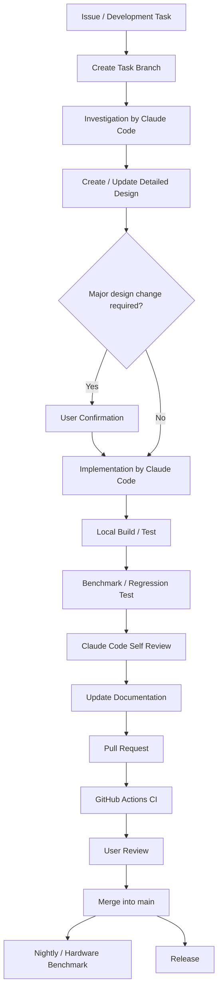
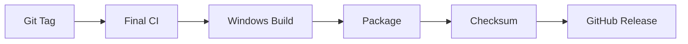

# Virtual Vessel Studio Development Workflow

## 1. Purpose

This document defines how Virtual Vessel Studio will be developed, managed, verified, and released.

The system design defined "how the system is structured." Building on that system design, this document defines:

- how Git / GitHub are used
- how far Claude Code is used
- who creates detailed designs
- how implementation, testing, and review proceed
- how CI/CD is structured
- how benchmarked code is handled
- at which points a human makes decisions
- what counts as development completion

In this project, Claude Code is used not merely as a code generation tool but as a **development agent that understands the repository and carries out detailed design, implementation, testing, review, and documentation updates**.

The user makes the final decisions on the system design, product direction, UX, major architecture decisions, acceptance of performance criteria, and similar matters.

---

# 2. Development Overview

Development normally proceeds in the following cycle.



Not every task needs every step at the same depth.

Small bug fixes may skip creating a new detailed design or running benchmarks. Changes affecting real-time processing, native plugins, module boundaries, public APIs, storage formats, and similar areas must not skip investigation, design, or performance verification.

---

# 3. Roles and Responsibilities

## 3.1 User

The user is mainly responsible for:

- deciding product goals
- the system design
- major architecture decisions
- final UX decisions
- deciding whether to adopt new external dependencies
- accepting benchmark results
- evaluating real-world usability, audio quality, video quality, etc.
- final review of pull requests
- release decisions

The user does not need to design every class or private method.

## 3.2 Claude Code

Claude Code is mainly responsible for:

- repository investigation
- checking the system design
- analyzing existing code
- analyzing benchmarks / prototypes
- creating and updating detailed designs
- class / interface / data model design
- implementation
- unit tests
- integration tests
- builds
- running benchmarks
- self review
- refactoring
- logging / diagnostics implementation
- documentation updates
- UI design / UI implementation
- writing pull request descriptions

Implementation details are broadly delegated to Claude Code.

However, Claude Code must not change architecture decisions fixed by the system design on its own judgment.

## 3.3 GitHub / CI

GitHub is responsible for:

- the authoritative source code
- issue / task management
- branch / pull request management
- review history
- CI
- storing build artifacts
- releases
- version management

CI mechanically verifies whether a change is acceptable for the repository, not whether Claude Code said it was done.

---

# 4. Basic Repository Structure

Conceptually, the repository is structured as follows.

```text
virtual-vessel-studio/
├─ CLAUDE.md
├─ README.md
├─ .editorconfig
├─ .gitignore
├─ .gitattributes
│
├─ .github/
│  ├─ workflows/
│  ├─ ISSUE_TEMPLATE/
│  └─ pull_request_template.md
│
├─ docs/
│  ├─ ja/
│  │  ├─ architecture/
│  │  │  └─ system-design.md
│  │  ├─ detailed-design/
│  │  ├─ development/
│  │  │  └─ development-workflow.md
│  │  ├─ decisions/
│  │  └─ ui/
│  └─ en/
│     └─ (same structure as ja)
│
├─ unity/
│  └─ VirtualVesselStudio/
├─ native/
├─ services/
├─ tools/
└─ tests/
   └─ performance/
```

The completed system design is placed at `docs/ja/architecture/system-design.md` / `docs/en/architecture/system-design.md`.

This document is placed at `docs/ja/development/development-workflow.md` / `docs/en/development/development-workflow.md`.

Product performance measurements (benchmarks executed by nightly / hardware CI, etc.) are placed under `tests/performance/`.

Historical benchmark / prototype implementations are treated as reference snapshots outside the repository and are not copied into this repository (see Chapter 12).

---

# 5. Role of CLAUDE.md

The `CLAUDE.md` at the repository root contains **project-wide fixed rules** that should not need to be re-explained to Claude Code every time.

`CLAUDE.md` and this document divide responsibilities as follows.

- `CLAUDE.md`: rules that Claude Code must always follow. This includes content that directly constrains Claude Code's actions, such as Git operating procedures and restrictions, and the handling of commits, pushes, and pull requests.
- This document: background and rationale for humans, roles and responsibilities, CI / release structure, the plan for gradually introducing operational practices, etc.

The root `CLAUDE.md` mainly contains:

- the most important architecture rules
- documents to reference
- the standard procedure at task start
- handling of benchmarks
- Git workflow (branches, commits, pushes, prohibited operations)
- minimum requirements for testing / review
- changes requiring user confirmation

However, `CLAUDE.md` must not become a huge detailed design document.

Detailed module designs are separated into `docs/<lang>/detailed-design/`.

This ensures that the rules Claude Code must always follow are reliably loaded, while module-specific details do not make the context unnecessarily large.

---

# 6. Git Operations

## 6.1 Basic Policy

`main` is the only integration branch.

No long-lived `develop` branch is maintained.

A short-lived branch is created for each piece of work and merged into `main` through a pull request.

```text
main
 ↑
Pull Request
 ↑
feature/capture-module
fix/audio-underrun
refactor/avatar-runtime
docs/update-architecture
```

## 6.2 Branch Naming

| Type | Prefix | Example |
|---|---|---|
| New feature | `feature/` | `feature/capture-module` |
| Bug fix | `fix/` | `fix/audio-underrun` |
| Refactoring | `refactor/` | `refactor/avatar-runtime` |
| Documentation | `docs/` | `docs/update-workflow` |
| CI / Build | `chore/` | `chore/github-actions` |

## 6.3 Handling of main

`main` is normally kept in a state that satisfies the following.

- It can be built.
- Required tests pass.
- There are no major known regressions.
- Version-controlled configuration and documents are consistent.

Direct pushes to `main` are not part of normal operation.

Changes are merged through pull requests.

## 6.4 Pull Requests

A pull request is normally limited to one purpose.

A pull request describes at least the following (identical to `CLAUDE.md` Chapter 30).

```text
Summary
Related issue
Design
Changes
Commits
Tests
Benchmarks
UI verification
Compatibility / Migration
Documentation
Remaining issues
```

Related system design and detailed design are described under `Design`.

The template is `.github/pull_request_template.md`.

## 6.5 Merge Method

A normal merge (merge commit) is the default.

Commits within a branch are created as verified logical units according to `CLAUDE.md` Chapter 29. They are kept as-is on `main` so that the commit history shows the steps by which a feature was built.

If the commit history within a branch has become confusing, propose cleanup before pushing. Published history is not rewritten without explicit user approval.

---


# 7. Coding Conventions and Language Policy

## 7.1 C# Coding Conventions

Project-owned C# code that is newly created or changed in this project follows the coding style of the `.NET Runtime` repository below.

https://github.com/dotnet/runtime/blob/main/docs/coding-guidelines/coding-style.md

This document is the authoritative C# coding convention.

The main rules include:

- use Allman-style braces
- indent with 4 spaces and do not use tabs
- private / internal instance fields use `_camelCase`
- private / internal static fields use the `s_` prefix
- thread-static fields use the `t_` prefix
- do not omit access modifiers
- place `using` directives at the top of the file, with `System.*` first
- use C# keywords such as `int` instead of `Int32` and `string` instead of `String`
- use `nameof(...)` instead of string literals where appropriate
- new project-owned files follow this convention

External OSS, third-party source, and similar code keep their upstream style.

Do not reformat entire external sources merely to match this project's conventions.

---

## 7.2 EditorConfig

An `.editorconfig` is placed at the repository root to apply the coding style mechanically wherever possible.

Conceptually, it has the following role.

```text
.editorconfig
   ↓
IDE / Editor
   ↓
Claude Code
   ↓
CI Style Check
```

The coding style should be detectable by tooling, not dependent only on the memory of humans or Claude Code.

Formatting / style checks such as `dotnet format` are added to CI as needed.

They are applied after confirming compatibility with the C# version and analyzers used by Unity.

---

## 7.3 Language in Source Code

Developer-facing content in source code is, as a rule, **entirely in English**.

This includes:

- identifiers such as classes, methods, and variables
- code comments
- XML documentation comments
- TODO / FIXME
- test names
- test descriptions
- assertion messages
- developer-facing exception messages
- developer log messages
- diagnostic messages
- annotations and internal explanatory strings

For example, Japanese comments such as the following are not used.

```csharp
// マイクを初期化する
InitializeMicrophone();
```

Write the following instead.

```csharp
// Initialize the selected microphone device before starting the audio pipeline.
InitializeMicrophone();
```

Comments should not merely translate the operation into English; for non-obvious code, they should prioritize explaining **why the operation is necessary**.

---

## 7.4 User-facing Text

Text shown to normal users is not hardcoded directly in source code.

Unity Localization is used, and at least

- Japanese
- English

are provided.

Therefore, avoid code such as

```csharp
statusLabel.text = "マイクを開始しています";
```

and display text through localization keys.

Japanese support in the user-facing UI and the rule that "source code is in English" are considered separately.

---

## 7.5 Documentation Language

Project documentation is provided in **both Japanese and English**.

The base directories are as follows.

```text
docs/
├─ ja/
│  ├─ architecture/
│  ├─ detailed-design/
│  ├─ development/
│  ├─ decisions/
│  └─ ui/
│
└─ en/
   ├─ architecture/
   ├─ detailed-design/
   ├─ development/
   ├─ decisions/
   └─ ui/
```

The same document uses the same relative path under `ja` and `en`.

Example:

```text
docs/ja/detailed-design/capture.md
docs/en/detailed-design/capture.md
```

The two are translations of each other and represent the same:

- architecture decisions
- interfaces
- data models
- diagrams
- file paths
- versions
- constraints
- benchmark conditions

---

## 7.6 Documentation Update Rules

In a task that changes documentation, Claude Code updates the Japanese and English versions within the same task.

Basic procedure:

```text
Design change
  ↓
Update Japanese document
  ↓
Update English document
  ↓
Check Japanese/English consistency
  ↓
PR
```

Do not complete a task with only one language out of date.

In the future, CI may add checks that verify at least:

- that corresponding Japanese and English files exist
- that there are no major differences in heading structure, etc.

Because CI alone cannot guarantee a complete translation match, consistency is also checked during Claude Code self review and pull request review.

---

## 7.7 Developer-facing Text in Git

Branch names, code identifiers, CI job names, internal script names, etc. are in English by default.

Commit messages and pull request titles are also in English by default, so that OSS contributors can easily understand them.

Pull request bodies are in English by default, but supplementary Japanese explanations may be added as needed.

---


# 8. Git Management of the Unity Project

The following are the defaults for Unity.

- Asset Serialization: Force Text
- Version Control Mode: Visible Meta Files
- `.meta` files are managed in Git
- generated directories such as `Library/` are not committed
- user Data Roots and voice datasets are not committed

Git LFS is used as needed for large binary assets used in development.

However, VRMs registered by users, RVC training datasets, generated voice models, training artifacts, runtime logs, etc. are not normally managed in the repository.

---

# 9. Starting a Task

## 9.1 Create an Issue / Task

For changes of a certain size or larger, first write down the task.

Example:

```text
Implement the Capture module.

In scope:
- GameCapture
- SubScreenCapture
- Capture source abstraction

Out of scope:
- Redesign of the entire Stage UI
- Streaming encoder changes

Completion criteria:
- Textures can be obtained from capture sources
- Device disconnects are handled
- No major benchmark regressions
- Integration tests pass
```

## 9.2 Create a Branch

```bash
git switch main
git pull
git switch -c feature/capture-module
```

Claude Code works within this branch.

---

# 10. Development with Claude Code

## 10.1 Starting a Session

Start Claude Code from the repository root.

The root `CLAUDE.md` is automatically loaded by Claude Code.

For large tasks, start in Plan Mode and have Claude Code investigate before changing code.

## 10.2 Investigate First

For large tasks, do not ask for "implement it" from the start.

Example:

```text
We are starting implementation of the Capture module.

Do not change any code yet.

Please check the following:

- CLAUDE.md
- docs/en/architecture/system-design.md
- related existing code
- GameCapture benchmark / prototype
- SubScreenCapture benchmark / prototype
- related tests

Then organize:
- the current state
- reusable code
- required responsibilities
- proposed main interfaces
- thread / resource lifecycle
- performance characteristics to preserve
- test strategy
- open issues

If anything contradicts the system design, point it out instead of implementing.
```

---

# 11. Detailed Design

## 11.1 Claude Code Creates Detailed Designs

The system design has already decided the module boundaries and basic approaches.

Therefore, instead of a human creating every class design first, Claude Code investigates the existing repository and benchmarks and creates the detailed design from the results.

Location:

```text
docs/ja/detailed-design/<module>.md
docs/en/detailed-design/<module>.md
```

## 11.2 Contents of a Detailed Design

As a rule, a detailed design includes:

1. Purpose and responsibilities
2. Module boundaries
3. Main classes
4. Interfaces / public API
5. Data models / DTOs / enums
6. State / lifecycle
7. Main sequences
8. Threading / async / update timing
9. Resource lifecycle
10. Configuration and storage formats
11. Errors / recovery
12. Logging / diagnostics
13. Test strategy
14. Benchmarks / performance
15. Directory / namespace
16. Open issues

Private methods do not need to be designed in advance.

## 11.3 When User Confirmation Is Required

If Claude Code determines that any of the following changes is necessary, it confirms with the user before implementation.

- changes to the system design
- changes to module boundaries
- changes to the responsibilities of major public interfaces
- adding a new major external dependency
- patching external OSS itself
- adding an external service dependency to the streaming runtime
- replacing a benchmarked approach
- breaking storage format compatibility
- new security / privacy decisions
- major UX changes

Implementation details such as class names and internal DTOs are left to Claude Code.

---

# 12. Handling Benchmarks / Prototypes

Benchmarked code is not treated as mere old code.

It is treated as a **reference implementation / performance baseline**.

This applies in particular to:

- RVC realtime runtime
- audio I/O
- RVC index
- GameCapture
- SubScreenCapture
- other performance-validated code

Claude Code analyzes the benchmark code before changing related functionality.

Examples of what to analyze:

- threading
- buffering
- memory allocation
- memory copies
- native APIs
- GPU / CPU boundaries
- audio thread
- render thread
- blocking operations

Do not remove proven optimizations merely to make the architecture cleaner.

---

# 13. Implementation

If the detailed design is consistent with the system design, implementation is delegated to Claude Code.

Example request:

```text
Please implement according to docs/en/detailed-design/capture.md.

- Strictly follow CLAUDE.md.
- Preserve the performance characteristics established by the benchmarks.
- Do not include unrelated changes.
- Add the required tests.
- Also implement logging / diagnostics.
- Run the build and tests.
- For performance-related changes, also run benchmarks.
- Finally, perform a self review.
- If the implementation diverges from the detailed design, update the document as well.
```

---

# 14. Local Testing

Before creating a pull request, run local tests as far as practical.

Depending on the change, do the following.

## Unit Test

- mapping
- validation
- state transitions
- serialization
- data conversion

## Integration Test

Examples:

- Tracking → Avatar
- Capture → Stage
- Voice → Audio
- Project → Runtime
- Voice Lab → External Service

## Build Test

- Unity compile
- Windows build
- native plugin build
- Python tests

## Manual / System Test

Use real devices as needed.

---

# 15. Self Review by Claude Code

After implementation is complete, have Claude Code review the changes from a different perspective.

Review targets:

- violations of the system design
- violations of module boundaries
- thread safety
- resource leaks
- native handles
- dispose
- cancellation
- error recovery
- blocking in real-time paths
- allocation
- logging
- security
- privacy
- missing tests
- inconsistencies with documentation

If problems are found, fix them within the task scope before proceeding to the pull request.

---

# 16. Documentation Updates

Documentation is maintained in both Japanese and English.

When something under `docs/ja/` is changed, the corresponding `docs/en/` is updated in the same task, and vice versa.


Do not intentionally let code and design documents diverge.

Update documents when any of the following changes:

- public interfaces
- data models
- module structure
- directory structure
- JSON schemas
- database schemas
- external components
- UI
- setup procedures
- benchmark conditions

A detailed design is not "written once before implementation and then finished"; it is kept in sync with the implementation.

---

# 17. Pull Requests and CI

After verifying locally, push the branch and create a pull request.

```text
Local development
      ↓
Push
      ↓
Pull Request
      ↓
GitHub Actions
      ↓
Review
      ↓
Merge
```

Claude Code's "tests passed" and GitHub Actions' "CI passed" are treated as separate verifications.

---

# 18. CI Structure

CI is divided according to load and purpose.

## 18.1 PR CI

Relatively lightweight checks are run for each pull request.

Examples:

- compile
- C# unit tests
- Unity EditMode tests
- native plugin build
- Python tests
- static checks
- secret scan
- dependency check
- documentation check

As a rule, changes with failing PR CI are not merged.

## 18.2 main Build

After merging into `main`, the integrated state is built.

Examples:

- Windows application build
- integration tests
- native plugin packaging
- build artifact generation

Build artifacts are kept for a certain period.

## 18.3 Nightly / Hardware CI

Hardware-dependent processing such as RVC and capture cannot be sufficiently verified with ordinary cloud runners alone.

Therefore, a dedicated Windows PC will be used as a self-hosted runner in the future.

Examples:

- RVC latency benchmark
- GameCapture benchmark
- SubScreenCapture benchmark
- GPU usage
- real capture boards
- multi-monitor
- audio devices
- long-run tests

Nightly CI monitors not only correctness but also **performance regressions**.

## 18.4 Self-hosted Runner Safety

For a public OSS repository, untrusted PRs submitted from outside are not run directly on development PCs or hardware benchmark PCs.

```text
External PR
  ↓
GitHub-hosted CI

main / trusted code
  ↓
Self-hosted Hardware CI
```

Self-hosted runners only run trusted code.

---

# 19. Protecting the main Branch

`main` is protected on GitHub.

At minimum, the policy is to configure:

- require pull requests
- require status checks
- normally prohibit force pushes
- prohibit branch deletion
- require conversation resolution as needed

In the early stage of solo development, requiring "one approval from someone else" may prevent merging one's own work, so requiring review approval may be introduced once there are more contributors.

The current settings are:

- require pull requests (required approvals: 0)
- apply protection to administrators as well (administrators also do not push directly to `main`)
- prohibit force pushes
- prohibit branch deletion
- require conversation resolution
- required status checks are added when CI is introduced

## 19.1 Merge Permission

Only people with write access (Write or higher) to the repository can merge pull requests.

Currently, only the repository owner has write access, and this state is maintained so that no one other than the owner can merge pull requests.

When adding collaborators, they are, as a rule, given Triage or lower permission.

If it becomes necessary to grant Write or higher permission, CODEOWNERS and required reviews are considered together.

---

# 20. Difference Between CI and Performance Testing

## CI

What it verifies:

**Does it build and behave correctly?**

Examples:

- it compiles
- tests pass
- serialization works
- module integration is not broken

## Performance / Hardware CI

What it verifies:

**Has it become slower than before, and does it work on real hardware?**

Examples:

- RVC latency
- frame drops
- capture FPS
- audio underruns
- GPU memory
- long-run stability

The quality of real-time features is confirmed only when both pass.

---

# 21. Release

Releases are based on Git tags.

Examples:

```text
v0.1.0
v0.2.0
v1.0.0
```

Creating a tag triggers the release workflow.



Example artifacts:

```text
VirtualVesselStudio-v0.1.0-win-x64.zip
SHA256SUMS.txt
```

---

# 22. Versioning

Semantic Versioning is the default.

During development:

```text
0.1.0
0.2.0
0.3.0
```

Stable:

```text
1.0.0
```

Guidelines:

- PATCH: bug fixes
- MINOR: backward-compatible feature additions
- MAJOR: major incompatible changes

Project schemas and similar formats do not need to match the application version exactly and have their own `schemaVersion`.

---

# 23. Claude Code Session Management

The conversation with Claude Code itself is not the project's only memory.

Principle:

**Make the repository remember, not the chat.**

Important information is recorded in:

- `CLAUDE.md`
- the system design
- detailed designs
- ADRs / decisions
- issues
- pull requests
- tests
- benchmark results

When a task is complete, a new session may be started for a new module.

---

# 24. What to Write and Not Write in CLAUDE.md

## Write

- the most important architecture rules
- documents that must be read
- handling of benchmarks
- task start procedure
- Git workflow (branches, commits, pushes, prohibited operations)
- testing / review principles
- conditions requiring user confirmation
- conventions Claude Code must always follow, such as coding style and documentation

## Do Not Write

- detailed class structure of all modules
- the full text of the long system design
- instructions specific to individual tasks
- details of temporary bugs
- the full history of benchmark results
- background explanations for humans, details of CI / release structure

Detailed information is separated into the appropriate documents.

---

# 25. Simplified Flow for Small Bug Fixes

```text
Task
 ↓
Branch
 ↓
Claude investigation
 ↓
Fix
 ↓
Test
 ↓
Self Review
 ↓
PR
 ↓
CI
 ↓
Merge
```

For example, null checks, display text corrections, simple conditional expressions, log messages, and similar changes do not need a new detailed design.

---

# 26. Standard Flow for Large Features

```text
Task / Issue
   ↓
Feature Branch
   ↓
Repository investigation by Claude
   ↓
Benchmark / prototype analysis
   ↓
Detailed design
   ↓
User design confirmation if needed
   ↓
Implementation
   ↓
Unit / Integration Test
   ↓
Benchmark
   ↓
Claude Self Review
   ↓
Documentation update
   ↓
Pull Request
   ↓
PR CI
   ↓
User Review
   ↓
Merge
   ↓
Nightly Hardware Benchmark
```

---

# 27. Initial Development Phases

It is not necessary to complete all CI/CD and automation from the start.

## Phase 1: Repository Foundation

- GitHub repository
- `.gitignore`
- `.gitattributes`
- `CLAUDE.md`
- place the system design
- place this development workflow document
- branch / PR rules

## Phase 2: Minimum CI

- Unity compile / test
- C# tests
- native plugin build
- Python tests
- PR required checks

## Phase 3: Take One Module Through to Completion

For example, with the Capture module, go through

```text
Investigation
→ Detailed design
→ Implementation
→ Test
→ Benchmark
→ PR
→ CI
→ Merge
```

once.

Use the results to revise `CLAUDE.md` and CI.

## Phase 4: Hardware Benchmark CI

- Windows self-hosted runner
- RVC benchmark
- capture benchmark
- long-run tests

## Phase 5: Release Automation

- tag
- build
- package
- GitHub release

---

# 28. Definition of Done

A task is not complete when the code has been written.

Confirm that the following are complete to the extent required by the task.

- implementation
- build
- tests
- benchmarks
- self review
- documentation
- pull request
- CI

The completion report states the following explicitly.

```text
Changes:
Design decisions:
Changed files:
Tests:
Benchmarks:
Documentation:
Remaining issues:
```

---

# 29. Basic Development Principles

1. Humans manage the system design.
2. Actively delegate implementation details to Claude Code.
3. For large changes, have Claude Code create the detailed design itself.
4. Treat benchmarked code as a performance baseline.
5. Create a short-lived branch for each task.
6. Do not push directly to `main`.
7. Use pull requests and CI as the merge gate.
8. Do not accept changes based solely on Claude's self-report.
9. Separate CI from hardware benchmarks.
10. Do not run external untrusted code on self-hosted runners.
11. Keep documentation in sync with code.
12. Record development knowledge in the repository, not in chat.
13. Keep small tasks lightweight; take large tasks through design and benchmarks.
14. Do not build excessive automation from the start; strengthen it while running the development cycle.
15. The user makes the final product / architecture decisions.

---

# Appendix A. Recommended Pull Request Template

The actual template is `.github/pull_request_template.md`, aligned with the sections in `CLAUDE.md` Chapter 30.

```markdown
## Summary

## Related issue

## Design

## Changes

## Commits

## Tests

## Benchmarks

## UI verification

## Compatibility / Migration

## Documentation

## Remaining issues
```

---

# Appendix B. Standard Requests to Claude Code

## Starting a Large Task

```text
For this task, please investigate first without implementing.

Check:

1. CLAUDE.md
2. the related system design
3. the related detailed design
4. the existing implementation
5. benchmarks / prototypes
6. tests

Then organize the current state, the change approach, reusable parts, the main design,
the test strategy, performance considerations, and open issues.

If a change to the system design is required, present it first instead of implementing.
```

## Starting Implementation

```text
Please implement according to the investigation results and the detailed design.

- Strictly follow CLAUDE.md
- Do not include unrelated changes
- Add the required tests
- Also implement logging / diagnostics
- Run the build / tests
- Run benchmarks if needed
- Perform a self review
- Keep documentation in sync

When finished, report the changes, tests, benchmarks, documentation, and remaining issues.
```

## Review

```text
Please review the current changes from the perspective of a different implementer.

In particular, check
architecture,
module boundaries,
thread safety,
resource lifecycle,
real-time performance,
security / privacy,
logging,
tests,
and documentation.

If there are problems, fix them within the task scope and test again.
```
