# Virtual Vessel Studio 方式設計

## 目次

1. システム概要
2. システム全体方式
3. 開発・運用方式
4. 外部サービス管理方式
5. ログ・診断方式
6. Project・設定・データ管理方式
7. 3Dアバター制御方式
8. トラッキング方式
9. 音声変換方式
10. 映像入力・カメラ・映像出力方式
11. ステージ管理方式
12. BGM・SE・音響管理方式
13. 音声モデル学習・Voice Lab方式
14. UI・操作方式
15. 非機能方式
16. 今後の拡張方針
    
---

# 1. システム概要

## 1.1 目的

本システムは、3Dアバター、リアルタイムトラッキング、音声変換、ステージ、BGM・SE、映像生成、ライブ配信、音声モデル作成等の機能を統合し、**1つのアプリケーションからVTuber配信に必要な一連の操作を行える統合環境**を提供することを目的とする。

一般的なVTuber配信環境では、

- 3Dアバター表示
- Face / Body Tracking
- Voice Conversion
- Audio Mixing
- Streaming
- Recording
- Voice Model Training
- 外部ツール

等が別々のApplicationやScriptとして構成される場合がある。

その場合、利用者は複数Applicationの起動、設定、Device Routing、Window管理、外部Process管理等を行う必要がある。

本システムではこれらを可能な限り統合し、利用者から見た操作対象を**単一のVTuber Application（Virtual Vessel Studio）**へ集約する。

また、単に複数機能を1つのApplicationへ詰め込むのではなく、

- 機能単位で責務を分離する
- 外部OSSとの依存関係を限定する
- 配信RuntimeとSetup / Trainingを分離する
- 将来的なTracking、Voice、Streaming等の技術変更へ対応可能とする
- OSSとして継続的に開発・保守できる構造とする

ことも目的とする。

### 採用理由

VTuber配信では、利用する技術やDeviceが多く、各機能を個別Applicationとして構成すると、利用者が内部構成を理解して運用する必要が生じる。

本システムでは、

**複雑な内部構成をApplication側で吸収し、利用者には統合された操作環境を提供する**

ことを基本的な価値とする。

---

## 1.2 対象範囲

本システムでは、主に以下の機能を対象とする。

### 3Dアバター

- VRM 1.0以降
- FBX
- Avatar登録
- Avatar切り替え
- Pose制御
- Expression制御
- Extension Bone制御
- 猫耳・尻尾等の拡張要素

### Tracking

- Cameraを利用したTracking
- Face Tracking
- Body Tracking
- Hand Tracking
- MediaPipe
- 将来的なmocopi等のTracking Provider

### Voice Conversion

- Microphone Input
- RVCによるリアルタイムVoice Conversion
- Pitch等のPost Processing
- Voice Model選択
- 仮想Microphone等へのOutput

### Voice Lab

- 音声生成
- Voice Clone
- Dataset作成
- Voice Analysis
- RVC Training
- Training History
- Model Evaluation
- Runtime用Voice Model登録

### Stage

- 3D Stage
- Stage切り替え
- Camera Point
- Avatar Spawn Point
- Lighting
- Stage Effect
- Capture Textureを表示するScreen Surface

### Audio

- Voice
- BGM
- SE
- Game / Capture Audio
- Audio Mixing
- Monitor Output
- Stream Audio

### Capture

- GameCaptureによるCapture Board映像・音声入力
- SubScreenCaptureによるサブモニタ映像入力
- Capture SourceのPreview・ON/OFF
- Stage上のScreen Surfaceへの映像供給

### Camera / Video

- Main Camera
- Camera Point切り替え
- Streaming Render Target
- Diagnostic Camera
- Video Encoding
- Recording

### Streaming

- YouTube Live
- Audio / Video Synchronization
- RTMPS等による配信
- Streaming State管理

### Project / Data

- Project
- Profile
- Asset
- Data Root
- Backup
- Import / Export
- Migration
- Credential管理

### Developer / Diagnostics

- Logging
- Runtime Diagnostics
- Performance Monitoring
- External Process Monitoring
- Diagnostic Camera
- Diagnostics Export

---

本システムの対象外または初期実装の必須対象外とするものについては、将来拡張として扱う。

例：

- 複数人同時配信
- 完全なPlugin SDK
- 多数のStreaming Serviceへの同時対応
- すべての3D Model形式への対応
- すべてのMotion Capture Deviceへの対応

### 採用理由

初期段階から将来機能をすべて実装すると、現在必要な機能に対して過剰な複雑性を持つシステムとなる。

そのため、現在必要な機能を中心に実装しつつ、将来変更が想定される箇所には拡張可能な境界を設ける。

---

## 1.3 基本方針

本システムの基本方針を以下とする。

### 単一Applicationとして提供する

通常利用者から見たシステムは、1つのUnity Applicationとして提供する。

内部でPython Serviceや外部OSSを利用する場合でも、通常利用者へ、

- Command Prompt
- Python
- venv
- Port
- Git
- 外部OSSの内部構造

等を意識させない。

---

### UnityをRuntimeの中心とする

配信中に必要となる主要機能はUnityを中心に実行する。

対象例：

- Avatar
- Tracking
- Voice Conversion
- Audio
- Camera
- Stage
- Streaming
- UI

特にRVCによるリアルタイムVoice ConversionはUnity Runtime内で実行し、配信時にPython Serviceを必須としない。

---

### PythonはSetup・Training・Analysisを中心に使用する

Pythonは主に以下で利用する。

- Voice Generation
- Voice Clone
- RVC Training
- Voice Analysis
- Model Conversion
- External OSS Setup

これらは必要時のみ起動する。

---

### SetupとRuntimeを分離する

各機能について、

- 登録
- 解析
- Training
- Mapping
- 詳細設定

等はSetup側で実施する。

配信Runtimeでは、Setup済みのAssetやProfileを読み込み、可能な限り軽量な処理のみを行う。

---

### 外部OSSを直接Application設計へ露出させない

RVC、VoxCPM2等の外部OSSは、Adapter / Wrapper等の境界を介して利用する。

外部OSS本体への改変は可能な限り避ける。

---

### モジュール単位で責務を分離する

Application全体を巨大なManagerへ集約しない。

Avatar、Tracking、Voice、Streaming等を独立したModuleとして扱い、明確なInterfaceおよびData Contractを介して連携する。

---

### 通常利用者とDeveloper向け情報を分離する

通常利用者には必要な状態と操作のみを表示する。

Developerには、

- 詳細Log
- Performance
- Internal State
- External Process
- Version
- Exception

等を十分に観測可能とする。

---

### 将来拡張を考慮する

初期実装を過度に複雑化しない範囲で、

- 新Tracking Provider
- 新Voice Converter
- 新Avatar形式
- 新Streaming Service
- 新Locale
- 複数Avatar

等へ拡張可能な構造を維持する。

---

### OSSとして保守可能な構成とする

本システムはGitHub等でのOSS公開を想定する。

そのため、

- Module境界
- Documentation
- Test
- Logging
- External Dependency
- Version管理
- Migration

等を設計段階から考慮する。

---

## 1.4 想定利用形態

本システムでは、大きく以下の利用形態を想定する。

### 通常配信

利用者が既に登録済みの、

- Avatar
- Tracking Profile
- Voice Model
- Stage
- Streaming Profile

等をProjectから読み込み、配信を開始する。

基本的な流れを以下とする。


通常配信時には、PythonやVoice Lab環境を起動する必要はない。

---

### 配信前Setup

Avatar、Tracking、Voice、Stage、Streaming等を設定する。

例：

```text
Avatar Import
Tracking Setup
Voice Setup
Stage Setup
Camera Setup
Audio Setup
Streaming Setup
Project Save
```

各Setup画面では可能な範囲でPreviewやTestを提供する。

---

### Voice Lab

新しいVoice Modelを作成する場合に使用する。

基本的な流れを以下とする。

```text
Generate
   ↓
Clone
   ↓
Dataset
   ↓
Train RVC
   ↓
Evaluate
   ↓
Register for Runtime
```

Voice Lab利用時のみ、VoxCPM2、Voice Analysis、RVC Training等の外部Service / Processを必要に応じて起動する。

---

### Developer / Diagnostics

Developer Modeでは、

- Runtime State
- Logging
- Diagnostic Camera
- Tracking情報
- Audio情報
- Streaming情報
- External Service状態

等を確認する。

通常利用者がこれらの内部構成を理解することは要求しない。

---

---

# 2. システム全体方式

## 2.1 全体アーキテクチャ

本システムは、Unity Applicationを中心として構成する。

Unity内部に配信Runtimeの主要機能を配置し、Training、Generation、Analysis等については必要に応じてローカル外部Service / Processを利用する。

概念的な全体構成を以下に示す。

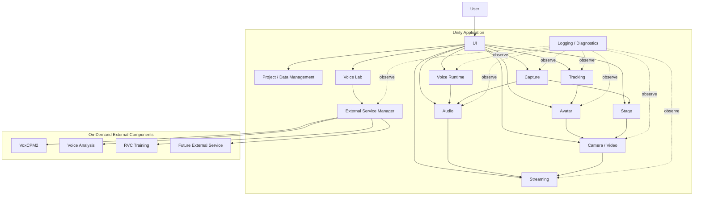

図中の矢印は主に、

- 制御要求
- データの受け渡し
- 状態参照

を示すものであり、必ずしもクラス間の直接参照を意味しない。

### 採用理由

UnityをApplicationの中心へ置くことで、

- 3D Rendering
- Tracking
- Audio
- UI
- Streaming

等、配信中に連携する機能を同一Runtime上で扱える。

一方、Training等の重いSetup処理を外部Serviceへ分離することで、配信Runtimeへ不要なPython依存を持ち込まずに済む。

---

## 2.2 Unityと外部サービスの役割分担

UnityとExternal Serviceの責務を明確に分離する。

### Unity側

主に以下を担当する。

- Application Lifecycle
- UI
- Project管理
- Avatar
- Tracking
- Runtime Voice Conversion
- Audio Mixing
- GameCapture / SubScreenCapture等の映像入力
- Stage
- Camera
- Rendering
- Streaming
- Recording
- Diagnostics
- External Service Lifecycle管理

### External Service / Process側

主に以下を担当する。

- Voice Generation
- Voice Clone
- Voice Analysis
- RVC Training
- Dataset Processing
- Model Conversion
- その他Setup / Analysis系処理

### 基本原則

外部Serviceでしか実行できない処理を除き、配信中の主要Runtimeを外部Serviceへ依存させない。

### 採用理由

配信RuntimeとTraining環境を分離することで、

- Python環境障害
- External Service障害
- Dependency Error

等が発生しても、登録済みAssetによる通常配信への影響を抑えられる。

---

## 2.3 単一アプリUX・内部マルチサービス構成

利用者から見たシステムは単一Applicationとする。

内部的には、

- Unity Runtime
- VoxCPM2 Service
- Voice Analysis Service
- RVC Training Process

等、複数Processが存在してもよい。

ただし、通常利用者がそれらを個別に起動・停止する必要はない。

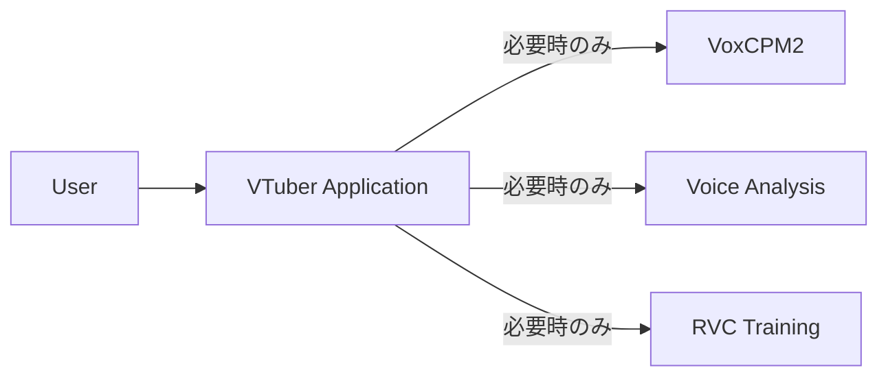

通常UIでは、

- Port
- PID
- venv
- Python Command

等を表示しない。

例えばVoice Generationを開始した場合、

```text
音声生成サービスを準備しています
        ↓
利用可能
        ↓
音声生成
```

という利用者向け状態として表示する。

### 採用理由

内部構成が複雑でも、Applicationとしての利用方法まで複雑にする必要はない。

単一Application UXを維持することで、利用者の環境構築・運用負担を抑える。

---

## 2.4 モジュール分割方針

システム内部を責務単位のModuleへ分割する。

主要Moduleとして以下を想定する。

```text
Application
Project / Data
Avatar
Tracking
Voice
Audio
Capture
Stage
Video
Streaming
VoiceLab
ExternalServices
Diagnostics
UI
```

各Moduleは、自身の責務に必要な内部実装を管理する。

例えばAvatar Moduleであれば、

- Avatar Loading
- Avatar Runtime
- Skeleton
- Pose
- Expression
- Extension Motion

等を内部に持つ。

Tracking Moduleであれば、

- Provider
- Normalization
- Filtering
- Calibration

等を管理する。

Capture Moduleであれば、

- Capture Source
- GameCapture Adapter
- SubScreenCapture Adapter
- Capture State
- Capture Texture / Audioの受け渡し

等を管理する。

### Module分割原則

以下を基本とする。

1. 1つのModuleが複数機能の内部実装を直接管理しない。
2. 他Moduleの内部Classへ自由に依存しない。
3. 外部へ公開するInterfaceを限定する。
4. Module内部変更を他Moduleへ波及させない。
5. 巨大なGlobal Managerを作らない。

### 採用理由

すべてを1つのApplication Manager等へ集約すると、

- 責務が不明確になる
- Unit Testしにくくなる
- 変更影響範囲が大きくなる
- Claude Codeによる変更時にも対象範囲を判断しにくくなる

ためである。

---

## 2.5 モジュール間連携方式

Module間連携では、用途に応じて以下を使い分ける。

- Interface
- Data Contract
- Command
- Event
- Service
- Runtime State

Module内部の具体Classを直接参照することを基本とはしない。

---

### Interface

他Moduleから機能を利用するための安定した境界として使用する。

例：

```text
IAvatarLoader
ITrackingProvider
IVoiceConverter
IVideoCaptureSource
IAudioCaptureSource
IVideoEncoder
IStreamPublisher
```

### Data Contract

Module間でデータを受け渡す際に使用する。

例：

```text
TrackingFrame
AvatarPose
ExpressionSignal
CaptureSourceInfo
CaptureFrameInfo
FinalStreamAudio
```

### Command

利用者操作や外部入力からRuntimeへ操作要求を渡す。

例：

```text
SwitchAvatarCommand
SwitchCameraCommand
PlaySeCommand
ToggleMuteCommand
```

### Event

状態変化等を複数のModuleへ通知する必要がある場合に使用する。

例：

```text
ProjectChanged
AvatarChanged
StageChanged
StreamingStateChanged
```

### Runtime State

現在状態をUIやDiagnosticsへ公開する際に使用する。

UIがModule内部変数を直接参照しない構成とする。

---

### 直接依存の抑制

例えばUIから、

```text
Button
  ↓
VrmAvatarLoader
```

のように具体実装を直接呼び出さない。

代わりに、

```text
Button
  ↓
Command
  ↓
Avatar Module
  ↓
内部実装
```

とする。

### 採用理由

UI、External Device、Automation等、異なる入力手段から同じ処理を再利用可能にするためである。

また、具体Classへの依存を減らすことで、内部実装変更の影響を限定する。

---

## 2.6 共通データ形式・抽象化方針

Module間で使用するデータは、特定のLibraryや外部OSS固有形式を可能な限り直接使用しない。

システム共通のData Contractへ変換してから利用する。

### Tracking

例えばMediaPipe固有のLandmark情報をAvatar Moduleへ直接渡さない。

```text
MediaPipe Data
      ↓
Tracking Provider
      ↓
TrackingFrame
      ↓
Avatar Module
```

### Avatar

VRMやFBX固有のBone構造をTracking Moduleへ公開しない。

```text
VRM / FBX
   ↓
Skeleton Mapping
   ↓
Common Avatar Bone
```

### Expression

VRM ExpressionやFBX BlendShapeをFace Tracking側で直接扱わない。

```text
Face Tracking
      ↓
Expression Signal
      ↓
Expression Mapping
      ↓
VRM / FBX
```

### Voice

RVC固有処理をAudio Mixer等へ露出させない。

```text
Audio Input
    ↓
IVoiceConverter
    ↓
Converted Audio
    ↓
Audio Processing
```

### Capture

GameCaptureUnityPluginやDXGI Desktop Duplication等の具体的なCapture実装を、StageやVideo Moduleへ直接露出させない。

```text
Capture Board / DXGI Desktop Duplication
      ↓
Capture Adapter
      ↓
IVideoCaptureSource / IAudioCaptureSource
      ↓
Capture Texture / Capture Audio
      ↓
Stage / Audio Module
```

GameCaptureは映像と音声を提供可能なCapture Sourceとして扱い、SubScreenCaptureは初期実装では映像のみを提供する。

Capture Sourceは映像取得のみを担当し、取得映像をStage上のどこへ表示するかはStage Module、最終映像をどのように配信・録画するかはVideo / Streaming Moduleの責務とする。

### Streaming

配信Service固有処理をRenderingへ露出させない。

```text
Render / Audio
      ↓
Encoder
      ↓
Encoded Stream
      ↓
IStreamPublisher
```

---

### 共通データ形式の原則

共通Data Contractは、

- Model Format
- Tracking Library
- Voice Engine
- Capture Backend
- Streaming Service

等の具体技術から可能な限り独立させる。

また、必要に応じて、

- Timestamp
- Confidence
- State
- Version

等を含める。

### 採用理由

外部Libraryの型をそのままModule境界で利用すると、そのLibraryを変更した際に多数のModuleを変更する必要がある。

具体技術から共通表現へ一度変換することで、変更範囲を限定する。

---

---

# 3. 開発・運用方式

## 3.1 開発基本方針

本システムは、長期的な機能追加およびOSS公開を前提として開発する。

開発では、

- 設計
- 実装
- Test
- Review
- Documentation
- Refactoring

を継続的に実施する。

単に機能を追加するだけでなく、Module境界やDesign Ruleを維持することを重視する。

また、Claude Code等の開発Agentを積極的に利用する。

### 基本原則

1. 方式設計を基準として実装する。
2. Module責務を守る。
3. 外部OSSへの変更を最小限にする。
4. 実装と同時にTestを追加する。
5. Logging / Diagnosticsを機能実装の一部として扱う。
6. 仕様変更時はDocumentationも更新する。
7. Performance Regressionを考慮する。
8. Security / PrivacyをReview対象とする。
9. 巨大ClassやGlobal Singletonへの集中を避ける。
10. 自動化可能な作業は開発Agentへ委譲する。

### 採用理由

機能数が多いシステムでは、その場限りの実装を繰り返すと設計が崩れやすい。

実装規則と設計文書を開発プロセスへ組み込むことで、機能追加による品質低下を防ぐ。

---

## 3.2 Claude Codeを用いた開発自動化

Claude Codeを本システムの主要な開発Agentとして利用する。

Claude Codeには、単純なコード生成だけでなく、以下の作業を担当させる。

- 既存設計の確認
- 実装計画作成
- Code実装
- Refactoring
- Unit Test
- Integration Test
- Build確認
- Code Review
- Performance確認
- Logging / Diagnostics確認
- Documentation更新
- UI Design
- UI実装
- Visual Review
- 不具合修正

概念的な開発サイクルを以下とする。

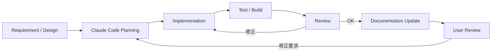

### 採用理由

本システムでは、

- Unity
- C#
- Python
- External OSS
- Voice Model
- UI
- Streaming

等、多数の技術領域が存在する。

開発Agentに設計ルールを共有し、実装・Test・Review・Documentationまで一貫して実行させることで、開発作業の効率化を図る。

ただし、Claude Codeの生成結果を無条件に採用しない。

アーキテクチャ、主要仕様、UI、体感品質等についてはユーザー自身も確認する。

---

## 3.3 リポジトリ構成

Repositoryは、機能責務およびRuntime / External Serviceの境界が分かりやすい構成とする。

概念例を以下に示す。

```text
virtual-vessel-studio/
├─ CLAUDE.md
├─ README.md
│
├─ docs/
│  ├─ ja/
│  │  ├─ architecture/
│  │  ├─ detailed-design/
│  │  ├─ development/
│  │  ├─ decisions/
│  │  └─ ui/
│  │     ├─ design-system.md
│  │     ├─ ui-guidelines.md
│  │     ├─ components.md
│  │     └─ screens/
│  │
│  └─ en/
│     └─ (jaと同一の構成)
│
├─ unity/
│  └─ VirtualVesselStudio/
│     ├─ Assets/
│     │  └─ VirtualVessel/
│     │     ├─ Core/
│     │     ├─ Application/
│     │     ├─ ProjectData/
│     │     ├─ Avatar/
│     │     ├─ Tracking/
│     │     ├─ Voice/
│     │     ├─ Audio/
│     │     ├─ Capture/
│     │     ├─ Stage/
│     │     ├─ Video/
│     │     ├─ Streaming/
│     │     ├─ VoiceLab/
│     │     ├─ ExternalServices/
│     │     ├─ Diagnostics/
│     │     └─ UI/
│     ├─ Packages/
│     └─ ProjectSettings/
│
├─ native/
│
├─ services/
│  ├─ voxcpm/
│  ├─ voice-analysis/
│  └─ adapters/
│
├─ tests/
│  ├─ unit/
│  ├─ integration/
│  ├─ system/
│  └─ performance/
│
└─ tools/
```

実際のUnity Project構造等については実装時に調整する。

重要なのは、Directory自体ではなく、責務の境界がRepository構造から把握できることである。

---

### docs

設計・仕様・判断理由等を保持する。

日本語版を`docs/ja/`、英語版を`docs/en/`へ配置し、同じ文書は同じRelative Pathを使用する。

### unity

Unity Applicationの本体を保持する。

Unity Projectのルートは`unity/VirtualVesselStudio/`とする。

機能Moduleごとに責務を分離する。

### native

本システムが所有するNative Windowsコード、Native Pluginを保持する。

### services

本システム側で管理するExternal Service用Wrapper、Adapter、Launcher等を保持する。

外部OSSそのものを自作コードと混在させない。

### tests

Unit、Integration、System Testを目的別に管理する。

RVC Latency、Capture性能、長時間運用等の製品の性能計測は`tests/performance/`へ配置する。

過去のBenchmark / Prototype実装はRepository外の参照用Snapshotとし、本Repositoryへコピーしない。

### tools

Build、Setup、Conversion、Development Support等の補助Toolを管理する。

### 採用理由

Repository構造とArchitecture構造を近づけることで、開発者およびClaude Codeが変更対象を判断しやすくする。

---

## 3.4 CLAUDE.md

Repository Rootに`CLAUDE.md`を配置し、Claude Codeが開発時に必ず従う共通ルールを定義する。

`CLAUDE.md`には少なくとも以下を記載する。

### Architecture Rule

- Unity中心のApplicationであること
- SetupとRuntimeを分離すること
- Module境界を守ること
- 外部OSSはAdapter / Wrapper越しに利用すること
- Module内部実装へ他Moduleから直接依存しないこと

### Code Rule

- 巨大Managerを作らない
- 不要なSingletonを作らない
- Interface / Data Contractを優先する
- Public APIを必要最小限にする
- 非自明な処理には設計意図が分かるCommentを付ける

### External OSS Rule

- 外部OSS本体を可能な限り変更しない
- 必要なCustom処理はApplication側へ配置する
- Versionを固定・管理する
- 独自Patchが必要な場合は理由をDocumentationへ残す

### Test Rule

- 新機能には必要なTestを追加する
- Bug Fix時には可能な範囲でRegression Testを追加する
- Module単位Testを優先する
- Performance重要処理では性能劣化を確認する

### Diagnostics Rule

- Error時に十分なDeveloper Contextを残す
- User NotificationとDeveloper Logを分離する
- SecretをLogへ出力しない
- 高頻度処理で過剰Logを出さない

### UI Rule

- Design Systemへ従う
- 既存Componentを優先して利用する
- Unity Localizationを利用する
- 日本語 / Englishで確認する
- Fontを個別指定しない
- ScreenshotによるVisual Reviewを行う

### Documentation Rule

- Architecture変更時には関連文書を更新する
- 新しいDesign Patternを導入した場合はDocumentationへ追加する
- 実装と文書の不一致を放置しない

### 採用理由

Claude Codeへ個別PromptごとにArchitecture Ruleを説明すると、指示漏れや判断の不一致が発生しやすい。

Repository内へ永続的な開発Ruleとして配置することで、変更時の一貫性を高める。

---

## 3.5 テスト・レビュー・ドキュメント更新

機能実装完了の条件を、Codeが動作することだけとはしない。

原則として、

```text
Implementation
      ↓
Build
      ↓
Test
      ↓
Review
      ↓
Documentation
      ↓
User確認
```

までを1つの開発Cycleとする。

---

### Unit Test

個々のClassやAlgorithmを検証する。

対象例：

- Data Conversion
- Profile Validation
- Mapping
- State Transition
- Command

---

### Integration Test

Module間の連携を検証する。

対象例：

```text
Tracking → Avatar
Voice → Audio
GameCapture → Capture / Audio
SubScreenCapture → Capture / Stage
Audio → Streaming
Project → Runtime
Voice Lab → External Service
```

---

### System Test

Unity Application全体として検証する。

対象例：

- Application起動
- Project Load
- Avatar表示
- Tracking
- Voice Conversion
- Stage
- Streaming
- Recording

---

### Performance Test

Realtime処理については必要に応じて性能も検証する。

対象例：

- RVC Latency
- Tracking Processing Time
- Frame Time
- Encoding Time

---

### Review

Claude CodeによるSelf Reviewでは、少なくとも以下を確認する。

- Architecture準拠
- Module境界
- Code Quality
- Error Handling
- Diagnostics
- Security
- Privacy
- Performance
- Test Coverage
- Documentation

---

### UI Review

UIについては実際の画面をScreenshot等で確認し、

- Spacing
- Alignment
- Visual Hierarchy
- 日本語
- English
- Font
- Design System準拠

等をClaude Code自身でもReviewする。

最終的にはユーザー自身もUIを確認する。

---

### Documentation更新

以下に変更がある場合、関連Documentも更新する。

- Interface
- Data Format
- Directory Structure
- Setup方式
- UI
- External Component
- Project Format
- Architecture

### 採用理由

実装だけを更新しDocumentationが古い状態になると、後続の開発者やClaude Codeが誤った前提で変更を行う可能性がある。

DocumentationもSystemの構成要素として扱う。

---

## 3.6 OSSとしての開発方針

本システムはOSSとして公開可能な構成を前提とする。

そのため、特定の開発環境や開発者しか理解できない状態を可能な限り避ける。

---

### 外部依存の明示

利用する外部Library、OSS、Toolについて、

- 名称
- Version
- License
- 利用目的

を把握可能とする。

---

### 外部OSSとの分離

RVC、VoxCPM2等の外部OSS本体と本システム独自実装を明確に分離する。

独自機能は原則として、

- Adapter
- Wrapper
- Launcher
- Application-side Processing

として実装する。

### 採用理由

外部OSSを直接大量改変すると、上流Versionへの追従が困難になるためである。

---

### 再現可能な開発・配布環境

Pythonを利用するExternal Componentについては、**開発環境**と**通常利用者向け配布環境**を分離して管理する。

開発環境では、Componentごとに、

- External OSS Version / Commit
- Python Version
- Dependency Definition / Lock
- venv
- Build手順
- Test手順

を明示し、開発者ごとのGlobal Python Environmentへ過度に依存しない。

通常利用者向けには、開発環境からBuild Pipelineによって生成した、

- Runtime Package Version
- Python Runtime Version
- Dependency Version
- External OSS Version / Commit
- Adapter Version
- Build Id
- Package Hash

等を識別可能なPortable Runtime PackageまたはStandalone Executableを提供する。

通常利用者にPython本体、venv、pip等の導入・操作を要求しない。

venvは主として開発・Test・Build用の環境とし、通常利用者向け配布物の実行方式とは分離する。

また、標準の開発・配布方式としてDockerを必須依存としない。

---

### Issue調査可能性

利用者からの障害報告に対応できるよう、

- Application Version
- External Component Version
- Logs
- Diagnostics
- Environment

等を確認可能とする。

秘密情報を含まないDiagnostics Exportを提供可能とする。

---

### Contributorが理解しやすい構成

Repository内で、

- Architecture
- Module責務
- Setup
- Build
- Test
- Coding Rule
- External Dependency

を確認できる状態を目指す。

---

### SecretのRepository混入防止

以下をRepositoryへCommitしない。

- Stream Key
- OAuth Token
- Password
- API Key
- 個人Credential

Application Runtimeでも秘密情報を通常設定FileやLogへ保存しない。

---

### Patch管理

外部OSSへ独自Patchが必要となった場合、

- Patch内容
- Patch理由
- 対象Version
- Upstreamとの差分
- 将来的な削除可能性

をDocumentationへ残す。

### 採用理由

将来外部OSSをUpdateする際に、独自変更が必要なのか判断できるようにする。

---

### 開発判断の記録

重要なArchitecture変更については必要に応じて、

```text
docs/<lang>/decisions/
```

等へ設計判断を記録する。

対象例：

- なぜUnity RuntimeでRVCを動かすか
- なぜPythonを配信Runtimeへ依存させないか
- なぜ外部OSSを改変しないか
- なぜUI Toolkitを採用したか

### 採用理由

時間が経過すると「なぜこの構造になっているか」が失われやすい。

最終的な構造だけでなく、主要な判断理由を残すことで、将来の変更判断を行いやすくする。

---

### OSS開発の基本原則

本システムでは、OSSとしての開発について以下を基本原則とする。

1. ArchitectureおよびModule責務を文書化する。
2. 外部OSSと独自実装を明確に分離する。
3. 外部OSSへの直接改変を最小限にする。
4. External DependencyのVersionを管理する。
5. Globalな開発環境依存を減らす。
6. Test可能なModule構造を維持する。
7. Logging / Diagnosticsを十分に提供する。
8. Secret情報をRepository・Log・Diagnosticsへ含めない。
9. Architecture変更時はDocumentationを更新する。
10. Claude Codeによる変更も同じ開発Ruleへ従わせる。
11. Claude Codeによる自動Reviewだけでなく、必要に応じてユーザー自身も結果を確認する。
12. 将来のContributorが理解・変更可能な構造を維持する。


---

---

# 4. 外部サービス管理方式

## 4.1 基本方針

本システムでは、Unityアプリケーション単体では実行しない一部の処理について、Python等で実装されたローカルサービスまたは外部プロセスを利用する。

対象例として以下を想定する。

- VoxCPM2
- Voice Analysis
- RVC学習処理
- 音声解析処理
- モデル変換処理
- その他将来追加される外部ツール

ただし、通常利用者に、

- Pythonのインストール
- Pythonの起動
- venvの作成・Activation
- pip等による依存パッケージ導入
- コマンド入力
- Port番号
- Process ID
- 外部OSSのディレクトリ構造

等を意識させない。

Pythonを利用するComponentは、通常利用者向けにはBuild済みのPortable Runtime PackageまたはStandalone Executableとして配布することを基本とする。

Unityアプリケーション側から必要な処理を要求した場合に、インストール済みのRuntime Packageを確認し、必要な外部サービスまたは外部プロセスを自動的に準備・起動して利用可能な状態にする。

開発者は同一SourceとDependency Definition / Lockを用いて、Native Python + venv環境から各Componentを直接実行・Test可能とする。

また、配信Runtimeでは不要な外部サービスを常時起動しない。

### 採用理由

本システムは利用者から見ると1つのアプリケーションとして動作することを目的とする。

内部実装上Pythonや外部OSSを利用していても、その構成を利用者へ露出すると、

- 起動手順が複雑になる
- Python環境の知識が必要になる
- 起動忘れや順序間違いが発生する
- PortやProcess管理が必要になる

等、利用負担が大きくなる。

そのため、外部サービスのLifecycleをアプリケーション側で管理する。

---

## 4.2 外部処理の分類

外部処理を大きく以下の2種類に分類する。

### Managed Local Service

一定時間起動状態を維持し、Unityから複数回Requestを受け付けるローカルサービス。

対象例：

- VoxCPM2 Service
- Voice Analysis Service
- 将来追加される解析Service

主にHTTP等のローカルIPCを利用する。

### Managed External Process

特定の処理を行うために起動し、処理完了後に終了する外部Process。

対象例：

- RVC Training
- Dataset Preprocess
- Model Conversion
- Setup Script
- その他Batch処理

### 採用理由

長時間稼働するServiceと、一度の処理で終了するProcessではLifecycleが異なる。

両者を同一方式で無理に管理せず、

- Service Lifecycle
- Process Execution

を分離して扱う。

---

## 4.3 配信Runtimeとの分離

Python Local Serviceは、通常の配信Runtimeに必須としない。

通常配信時には、

- Avatar
- Tracking
- RVC Runtime
- Audio
- Stage
- Camera
- Streaming

等、Unity Runtime上で必要な機能のみを利用する。

特にRVCによるリアルタイム音声変換はUnity側Runtimeで実行し、Python Serviceへ依存しない。

一方、

- Voice Lab
- RVC学習
- Voice Clone
- Voice Analysis
- 外部OSS Setup

等を利用する場合のみ、必要なServiceまたはProcessを起動する。

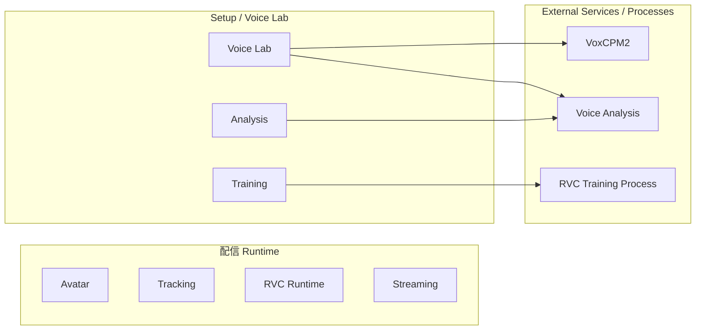

### 採用理由

Voice Labや学習環境に問題が発生した場合でも、すでに登録済みのモデルを利用した通常配信を継続可能とするためである。

---

## 4.4 External Service Manager

外部サービスのLifecycle管理を行う共通機能として、`External Service Manager`を設ける。

External Service Managerは主に以下を担当する。

- Service登録情報の管理
- 必要なServiceの起動要求
- 既起動Serviceの検出
- Service再利用
- Port確認
- Process起動
- Health Check
- Ready待機
- Service状態管理
- Service停止
- 異常検出

各機能Moduleが直接Python Processを起動する構成とはしない。

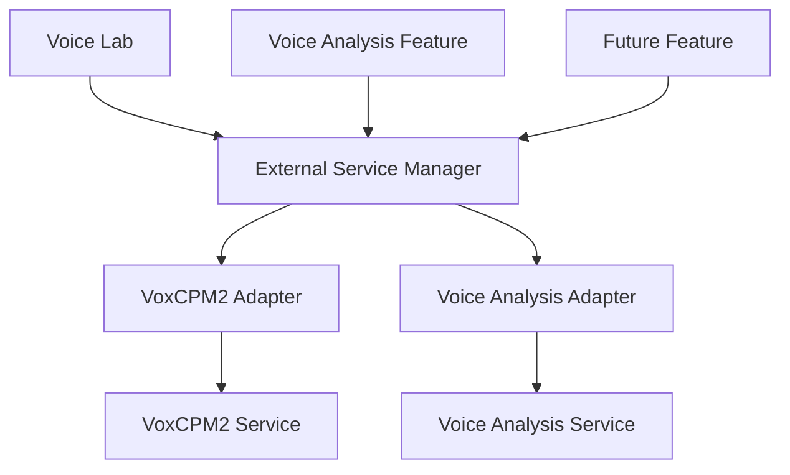

### 採用理由

各Moduleが個別に、

- Process起動
- Port確認
- Health Check
- Shutdown

を実装すると、同じ処理が重複し、異なるLifecycle管理が混在する。

共通Managerへ集約することで、Service管理方式を統一する。

---

## 4.5 Service Adapter方式

External Service Managerが、各外部サービス固有のAPIや内部仕様を直接認識しすぎない構成とする。

サービス固有処理はAdapterへ分離する。

概念的には以下のInterfaceを想定する。

```text
IExternalServiceAdapter

- GetServiceInfo()
- StartAsync()
- CheckHealthAsync()
- StopAsync()
- GetStatusAsync()
```

具体的な実装として、

- VoxCpmServiceAdapter
- VoiceAnalysisServiceAdapter
- FutureServiceAdapter

等を配置する。

### 採用理由

各外部サービスでは、

- 起動方法
- Health Check
- API仕様
- Version取得方法
- Shutdown方法

等が異なる。

これらをExternal Service Managerへ直接記述すると、Service追加のたびにManagerを修正する必要がある。

Service固有処理をAdapterへ閉じ込めることで、外部サービス追加時の影響を限定する。

---

## 4.6 Service Descriptor

各外部サービスについて、管理に必要な情報をService Descriptorとして保持する。

想定する情報は以下とする。

| 項目 | 内容 |
|---|---|
| ServiceId | サービス識別子 |
| DisplayName | 表示名称 |
| ComponentId | 対応する外部Component |
| SupportedVersion | 対応Version |
| AdapterVersion | Adapter Version |
| Executable | 起動対象 |
| WorkingDirectory | Working Directory |
| DefaultPort | 既定Port |
| HealthEndpoint | Health Check先 |
| InfoEndpoint | Service情報取得先 |
| StartupTimeout | 起動待機上限 |
| ShutdownPolicy | 終了方式 |

具体的な保存形式については詳細設計で決定する。

### 採用理由

Service情報をC#コードへ分散して記述すると、Versionや起動方法の変更時に修正箇所が増える。

Service管理情報を明確な単位として保持することで、管理・診断を容易にする。

---

## 4.7 Service Lifecycle

Managed Local Serviceは、概念的に以下の状態を持つ。

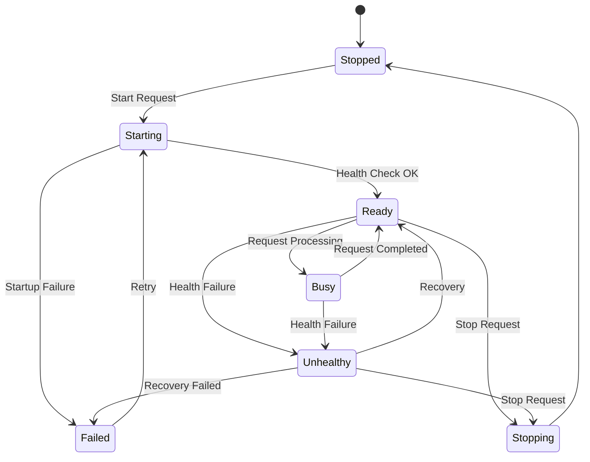

UI側には、この内部状態を必要に応じて簡略化して表示する。

### 採用理由

単なるRunning / Stoppedだけでは、

- Process起動中
- API準備中
- 処理中
- Processは存在するが応答不能

等を区別できない。

Service Lifecycleを明示することで、状態管理および障害診断を容易にする。

---

## 4.8 Service起動フロー

Serviceを必要とする機能から起動要求を受けた場合、概念的に以下の順序で処理する。

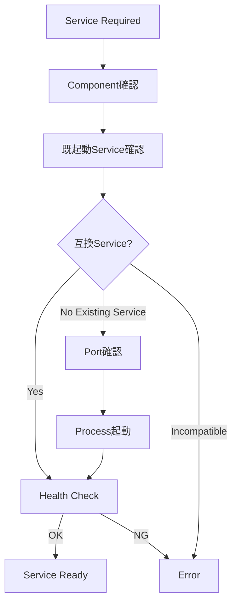

主な処理は以下とする。

1. 必要なExternal Componentが利用可能か確認する
2. 対象Serviceがすでに起動していないか確認する
3. 既起動Serviceが互換性を持つか確認する
4. 必要なPortが利用可能か確認する
5. Service Processを起動する
6. Health Checkを繰り返す
7. Ready状態になったことを確認する
8. 呼び出し元へ利用可能状態を返す

### 採用理由

Process起動直後にRequestを送信すると、Service内部のModel Load等が完了していない可能性がある。

単にProcessを起動するだけでなく、実際にRequestを処理可能な状態になるまで確認する。

---

## 4.9 既起動Serviceの再利用

対象Serviceがすでに起動している場合、直ちに新しいProcessを起動しない。

まず、

- Service Identity
- Version
- API Compatibility
- Health
- 対象Port

等を確認する。

互換性のあるServiceであれば、そのServiceを再利用可能とする。

### 採用理由

同一Serviceを複数起動すると、

- Port競合
- GPU Memoryの重複使用
- Modelの重複Load
- 不要なMemory消費

等が発生する。

既存Serviceを安全に再利用することでResource消費を抑える。

---

## 4.10 Service Identity確認

Portが使用中であることだけを理由に、対象Serviceが起動していると判断しない。

可能な場合、Serviceへ問い合わせて、

- ServiceId
- Version
- API Version
- Health

等を確認する。

例えば、

```text
/health
/info
```

等のEndpointをService Adapter経由で利用する。

### 採用理由

対象Portを別Applicationが利用している可能性がある。

「Portが開いている = 対象Serviceが存在する」と判断すると、誤ったServiceへRequestを送信する危険がある。

---

## 4.11 Port管理

各Serviceには既定Portを割り当て可能とする。

現行構成では例として、

| Service | 既定Port |
|---|---:|
| VoxCPM2 Reference Service | 8765 |
| Voice Analysis Service | 8766 |

を使用する。

ただし、通常利用者にPort番号を直接設定させることを基本とはしない。

Port番号はService DescriptorまたはApplication設定として管理する。

### 採用理由

Port番号は内部実装上必要である一方、通常利用者にとって意味のある設定ではない。

内部構造として管理し、必要な場合のみDeveloper Diagnosticsから確認可能とする。

---

## 4.12 Port競合

使用予定Portが別Processに利用されている場合、対象Processが互換Serviceか確認する。

互換Serviceでない場合、勝手にProcessを終了させたり別Applicationを操作したりしない。

通常利用者には例えば、

> 音声生成サービスを開始できませんでした。  
> 必要な通信ポートが他のアプリケーションで使用されています。

等を表示する。

Developer Diagnosticsには、

- ServiceId
- Port
- 対象Process情報
- Health Check結果
- Service Identity判定

等を記録する。

### 採用理由

Port競合を解決するために無関係なProcessを終了すると、他Applicationへ影響する可能性がある。

安全側に倒し、競合状態として利用者へ通知する。

---

## 4.13 Process Ownership

External Service Managerは、

**自分が起動したProcess**

と、

**起動済みだったため再利用したProcess**

を区別する。

Process起動時には必要に応じて、

- PID
- Application Session
- ServiceId
- 起動時刻

等を記録する。

### 採用理由

既存Serviceを再利用した場合、そのProcessは別Applicationや別Sessionが起動した可能性がある。

そのServiceを本アプリケーション終了時に勝手に停止してはならない。

---

## 4.14 Service停止方式

アプリケーションから起動したServiceについては、利用終了時またはApplication終了時に停止可能とする。

停止時は可能であれば、

1. Graceful Shutdown要求
2. Process終了待機
3. 必要に応じた強制終了

の順で行う。

ただし、既起動Serviceを再利用しただけの場合は、原則として停止しない。

### 採用理由

本システムが所有していないProcessへ影響を与えないようにするためである。

また、強制終了を最初から利用すると、Serviceが保存中のデータ等を破損する可能性がある。

---

## 4.15 On-Demand起動

External Serviceは、アプリケーション起動時にすべて開始しない。

必要になった時点で起動する。

例：

- Voice Clone画面を利用する → VoxCPM2起動
- 音声解析を開始する → Voice Analysis起動
- RVC Trainingを開始する → Training Process起動

### 採用理由

すべてを常時起動すると、

- Startup時間増加
- Memory消費
- GPU Memory消費
- 不要なProcess増加

につながる。

特に通常配信では利用しないServiceが多いため、必要時のみ起動する。

---

## 4.16 Serviceの遅延停止

Service利用終了直後に必ず終了するのではなく、必要に応じて一定期間再利用可能な状態を維持する方式も許容する。

例えばVoice Labで、

- 音声生成
- 試聴
- 再生成
- 別Prompt生成

を繰り返す場合、毎回VoxCPM2を再起動しない。

具体的な停止TimingはServiceごとの特性を考慮して詳細設計で決定する。

### 採用理由

Model Load等に時間のかかるServiceでは、毎回起動・終了すると操作性が大きく低下する。

On-Demand起動と再利用を組み合わせる。

---

## 4.17 External Process実行方式

RVC Training等の一時的な処理については、Managed External Processとして実行する。

Process実行では少なくとも以下を管理する。

- Process ID
- Command
- Working Directory
- Environment
- Start Time
- End Time
- Exit Code
- stdout
- stderr
- Cancellation State

外部Processを直接UIから起動するのではなく、対象機能のAdapterまたはManagerを介する。

### 採用理由

外部Process実行もApplicationの処理の一部として状態管理する必要がある。

単純なProcess起動だけでは、進捗や失敗理由をApplicationから追跡できない。

---

## 4.18 Python実行環境

Pythonを利用するExternal Service / Processは、13章で管理される実行環境を明示的に指定して起動する。

OSのGlobal Pythonや、Shellで現在Activateされている環境へ依存しない。

通常利用者向けの配布環境では、Runtime Packageの`manifest.json`が示すLauncher / Executableを起動する（13.6、13.7参照）。

```text
External/<Component>/<RuntimePackageVersion>/manifest.json
        ↓
Launcher / Executable
```

開発環境では、Componentごと・Versionごとの開発用venvのPythonを明示的に指定して起動できる。

```text
<ExternalComponent>/<Version>/.venv/Scripts/python.exe
```

どちらの場合も、起動に使用した実行環境のPathおよびVersionをDiagnosticsから確認可能とする。

### 採用理由

Global Pythonへ依存すると、利用者環境によって、

- Python Version
- Package Version
- CUDA対応
- Dependency

が変化し、再現性が失われる。

Applicationが管理する環境を明示的に使用する。

---

## 4.19 External Component管理との責務分離

External Service Managerは、基本的に**インストール済みComponentの実行Lifecycle**を担当する。

以下は13章のExternal Component管理側の責務とする。

- External OSS / Source Version管理
- Dependency Definition / Lock管理
- 開発者向けvenv構築手順
- Runtime Package Build情報管理
- Runtime Package取得
- Package Hash / Integrity確認
- Runtime Package展開・登録
- Update
- Rollback
- Capability / Dependency Verification

通常利用者向けSetupでは、Sourceからvenvを構築することを基本とはせず、Build済みRuntime Packageを導入する。

External Service ManagerからComponentが見つからない場合は、Setup機能へ処理を誘導する。

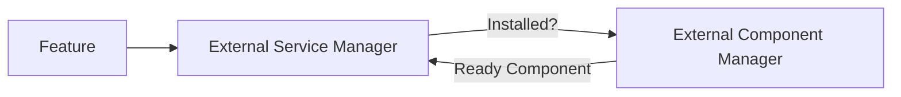

### 採用理由

「環境を作る責務」と「作られた環境を起動する責務」を分離することで、管理処理を単純化する。

---

## 4.20 Version互換性

External Serviceを利用する前に、本ApplicationおよびAdapterが対応しているVersionか確認する。

少なくとも、

- External Component Version
- API Version
- Adapter Version

等の互換性を確認可能とする。

対応外Versionを検出した場合、無条件に利用しない。

### 採用理由

Processが正常起動しても、API仕様や出力形式が変更されている場合には正しく動作しない可能性がある。

「起動できること」と「互換性があること」を分離する。

---

## 4.21 Service Health Check

Managed Local Serviceについて、Health Check機構を設ける。

Health Checkでは必要に応じて以下を確認する。

- Processの存在
- API応答
- Service Identity
- Service Version
- 内部初期化状態
- 必須ModelのLoad状態

Health Check結果は、

- Ready
- Busy
- Unhealthy
- Failed

等の共通状態へ変換する。

### 採用理由

Processが存在していても、

- Model Load失敗
- GPU初期化失敗
- Dependency Error

等によってRequestを処理できない場合がある。

そのため、Process存在だけではなくServiceとしての利用可能性を確認する。

---

## 4.22 起動Timeout

Service起動処理にはTimeoutを設ける。

Model Load等に時間がかかるServiceについては、Serviceごとに適切なStartup Timeoutを設定可能とする。

Timeout発生時には、

- Process State
- Health Check結果
- stdout
- stderr

等を診断情報へ残す。

### 採用理由

外部Serviceが応答しない場合に、Unity側が無期限に待機し続けることを防止する。

---

## 4.23 異常終了検出

Applicationから起動したExternal Service / Processが予期せず終了した場合、その状態を検出する。

例えば以下を記録する。

- Process ID
- Exit Time
- Exit Code
- 最後のstdout
- 最後のstderr
- 実行中だった処理

### 採用理由

外部Processが異常終了した場合、Unity側で単に通信エラーとして扱うだけでは原因を特定しにくい。

Process Lifecycleと通信状態を関連付けて管理する。

---

## 4.24 自動復旧

一時的な障害について、自動復旧可能なServiceでは再起動を試行可能とする。

ただし、

- 無制限再起動
- 短時間での連続再起動

は行わない。

再試行回数や条件はServiceごとに管理する。

学習処理等、再起動によって処理結果に影響するExternal Processについては、自動再実行を原則としない。

### 採用理由

Service型処理では一時的な異常から自動復旧できる場合がある一方、Training等を勝手に再実行すると重複処理やArtifact不整合が発生する可能性がある。

処理特性に応じてRecovery方針を分ける。

---

## 4.25 同時要求制御

External Serviceが複数Requestの同時処理に対応しているとは限らない。

Serviceごとに、

- Concurrent
- Serialized
- Single Job

等の実行特性を定義可能とする。

必要に応じてApplication側でRequest Queueを管理する。

### 採用理由

特にGPU Modelを利用するServiceでは、複数処理を同時実行すると、

- GPU Memory不足
- 処理速度低下
- Service Crash

等が発生する可能性がある。

Service能力に応じて並列度を制御する。

---

## 4.26 Request Cancellation

長時間Requestについては、対象Serviceが対応可能な場合、Cancellationを扱える構成とする。

Cancellation不能な外部処理については、UI上でそのことを明確にする。

Processを強制終了してCancellationとみなす処理は、データ破損の可能性を考慮して個別に判断する。

### 採用理由

Unity側でCancellation要求を受けても、外部Service側が安全に停止できるとは限らない。

Cancellationの意味をServiceごとに明確にする。

---

## 4.27 UIへの内部構造非公開

通常UIには、

- Port番号
- PID
- Runtime Package Path / Developer venv Path
- Python Command
- Health Endpoint

等を原則として表示しない。

通常UIでは、

- 準備中
- 利用可能
- 処理中
- セットアップが必要
- エラー

等の利用者向け状態へ変換する。

Developer Modeでは詳細情報を表示可能とする。

### 採用理由

通常利用者に必要なのは、内部Service構造ではなく「その機能を利用できるか」である。

内部情報は5章で定義したDeveloper Diagnosticsへ分離する。

---

## 4.28 Service Setup導線

必要なExternal Componentが未セットアップの場合、通常利用者へPythonやGitの手動操作を要求しない。

例えば、

> 音声生成機能の初期セットアップが必要です。

等を表示し、Setup UIから環境構築を開始できるようにする。

### 採用理由

内部依存関係を理解しなくても利用開始できることを重視する。

---

## 4.29 セキュリティ

Managed Local Serviceは、原則としてLocalhostのみで待ち受ける。

外部Networkからアクセス可能な状態を既定としない。

また、外部Serviceへ渡すPath、Parameter等について必要なValidationを行う。

### 採用理由

Voice Lab用Service等を外部Networkへ公開する必要は通常ない。

不要なAttack Surfaceを増やさない。

---

## 4.30 Secret情報

External Service / Processへ秘密情報を渡す必要が生じた場合、Command LineやLogへ平文出力しない方式を優先する。

秘密情報については6章で定義するCredential管理方式に従う。

5章で定義するDeveloper Logについても秘密情報を記録しない。

### 採用理由

Process CommandやLogは障害調査等で外部へ共有される可能性があるためである。

---

## 4.31 ログ・診断との連携

External Service ManagerおよびExternal Process管理機能は、5章で定義した共通Logging / Diagnostics方式を利用する。

主な診断情報として以下を扱う。

- ServiceId
- Component Version
- Adapter Version
- Python Version
- venv
- Process ID
- Port
- Process State
- Service Health
- Start / Stop Time
- Exit Code
- stdout
- stderr
- Health Check結果
- Exception

通常利用者向け表示では必要な情報だけを簡潔に表示する。

### 採用理由

外部Process障害ではUnity内部だけの情報では原因を特定できないため、外部環境まで含めて観測可能とする。

---

## 4.32 Application終了時の処理

Application終了時には、本Application Sessionが所有しているExternal Serviceについて停止処理を行う。

既存Serviceを再利用していただけの場合は、原則として停止しない。

外部Processが処理中の場合は、そのProcessの性質に応じて、

- 正常終了を待つ
- Cancellationする
- 終了確認を行う

等を選択する。

### 採用理由

Application終了時に無関係なProcessまで停止しないこと、および処理中データの破損を防ぐことを目的とする。

---

## 4.33 Application異常終了後のService

Applicationが異常終了した場合、外部Serviceだけが残る可能性がある。

次回起動時には、

- 対象Port
- Service Identity
- Health
- Version

等を確認し、互換性がある場合は再利用可能とする。

ただし、再利用したServiceを自動的に現在Session所有とみなさない。

### 採用理由

異常終了後に残った正常Serviceを毎回強制終了する必要はない。

一方で、所有権を誤認すると他SessionのProcessを終了する可能性があるため、Lifecycle上のOwnershipを分離する。

---

## 4.34 外部サービス追加方式

新しいExternal Serviceを追加する場合、原則として以下を追加する。

1. External Component定義
2. Service Descriptor
3. Service Adapter
4. Health Check
5. Version Compatibility定義
6. Setup情報
7. Diagnostics情報

既存External Service Managerの主要ロジックを変更せず追加できる構造を目標とする。

### 採用理由

外部サービス追加のたびに共通Lifecycle処理を変更すると、既存ServiceへRegressionを発生させやすい。

---

## 4.35 SetupとRuntimeの責務分離

外部サービス関連処理についてもSetupとRuntimeを分離する。

### Setup

通常利用者向けSetupでは主に以下を行う。

- External Component Manifest確認
- Version選択
- Build済みRuntime Package取得
- Package Hash / Integrity確認
- Runtime Package展開・登録
- 必要なModel / Asset取得
- Capability / Environment Verification
- Service起動Test
- Health Check Test

開発者向け環境では、これとは別にNative Python + venvを利用してSourceから直接実行・Test可能とする。

### Runtime / Voice Lab利用時

- 必要Serviceの検出
- 起動
- 既起動Service再利用
- Health Check
- Request
- 状態監視
- 必要に応じた停止

### 採用理由

通常利用時に環境構築処理まで実行すると、機能開始までの処理が複雑になる。

環境構築と実際のService利用を分離する。

---

## 4.36 内部責務分割

概念的には以下の構成を想定する。

```text
ExternalServices/
├─ Core/
│  ├─ ServiceDescriptor
│  ├─ ServiceState
│  ├─ ServiceInstance
│  └─ ServiceId
│
├─ Management/
│  ├─ ExternalServiceManager
│  ├─ ServiceRegistry
│  ├─ ServiceLifecycleManager
│  └─ ServiceRequestCoordinator
│
├─ Process/
│  ├─ ExternalProcessRunner
│  ├─ ProcessOwnership
│  └─ ProcessResult
│
├─ Network/
│  ├─ PortChecker
│  └─ ServiceIdentityChecker
│
├─ Health/
│  ├─ HealthChecker
│  └─ ServiceHealth
│
├─ Adapters/
│  ├─ VoxCpmServiceAdapter
│  ├─ VoiceAnalysisServiceAdapter
│  └─ FutureServiceAdapter
│
└─ Diagnostics/
   └─ ExternalServiceDiagnostics
```

なお、外部OSSのSource、venv、Version、Update等については13章のExternal Component管理機能へ分離する。

### 採用理由

Process起動、Port管理、Health Check、Service固有API、Version管理等を1つの巨大なManagerへ集中させると責務が不明確になる。

共通LifecycleとService固有処理を分離することで保守性を確保する。

---

## 4.37 外部サービス管理方式の基本原則

本システムでは、外部サービス管理について以下を基本原則とする。

1. 通常利用者にPythonやPort等の内部構造を意識させない。
2. 配信RuntimeはPython Local Serviceへ依存しない。
3. External Serviceは必要時のみOn-Demandで起動する。
4. Serviceと一時的External Processを区別する。
5. Service LifecycleはExternal Service Managerで共通管理する。
6. Service固有処理はAdapterへ分離する。
7. Process起動だけでなくHealth Check完了までを起動処理とする。
8. 既起動Serviceが互換であれば再利用する。
9. Port使用中だけで対象Serviceと判断しない。
10. Service IdentityおよびVersionを確認する。
11. Port番号は通常利用者へ原則として露出しない。
12. Port競合時に他Applicationを勝手に終了しない。
13. 自分が起動したProcessと再利用Processを区別する。
14. 所有していないProcessを勝手に停止しない。
15. PythonはApplicationが管理する実行環境（配布時はRuntime Package、開発時は開発用venv）を明示して実行する。
16. External Componentの取得・更新とService Lifecycleを分離する。
17. Service VersionとAdapter Versionの互換性を確認する。
18. Process存在とService Healthを区別する。
19. Service起動にはTimeoutを設ける。
20. External Processのstdout / stderr / Exit Codeを取得する。
21. Service型処理とBatch処理でRecovery方式を分ける。
22. Service能力に応じて同時Request数を制御する。
23. Managed Local Serviceは原則としてLocalhostのみで公開する。
24. Secret情報をCommandやLogへ不用意に出力しない。
25. 外部Serviceの詳細情報はDeveloper Diagnosticsから確認可能とする。
26. 新しいServiceはDescriptorとAdapterを追加する方式を基本とする。
27. Setupと実際のService利用Lifecycleを分離する。


---

---

# 5. ログ・診断方式

## 5.1 基本方針

本システムでは、通常利用者向けの状態表示・エラー通知と、開発者向けの詳細ログ・診断情報を分離する。

基本方針を以下とする。

**通常利用者には内部構造を意識させず、開発者には内部状態を十分に観測可能とする。**

通常利用者向けには、

- 現在何が起きているか
- どの機能に影響しているか
- 何を確認・操作すればよいか

を中心に表示する。

一方、開発者向けには、

- Module
- 処理段階
- 設定値
- Version
- Timing
- Process
- External Component
- Exception
- Stack Trace

等を詳細に記録する。

### 採用理由

一般利用者に、

```text
NullReferenceException
CUDA error
HTTP 500
Port 8765 bind failed
```

等の内部情報をそのまま表示しても、問題解決にはつながりにくい。

一方で、OSSとして開発・保守する場合には、単に「失敗しました」という情報だけでは原因を特定できない。

そのため、利用者向け情報と開発者向け情報を別の責務として扱う。

---

## 5.2 ログとユーザー通知の分離

内部で発生した1つの事象について、

- User Notification
- Developer Log

をそれぞれ生成可能な構成とする。

概念的には以下とする。

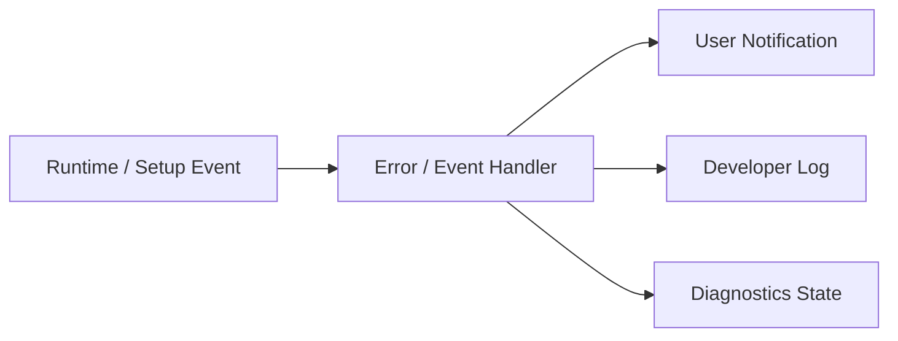

例えばMicrophone初期化に失敗した場合、通常UIでは、

> マイクを使用できませんでした。  
> 選択した入力デバイスが接続されているか確認してください。

等を表示する。

一方、開発者向けには、

- Device Name
- Device ID
- Sample Rate
- Buffer Size
- Audio Backend
- Exception
- Stack Trace

等を記録する。

### 採用理由

内部ログの構造をそのままUIへ流用すると、内部実装変更によって利用者向け表示まで変化しやすくなる。

通知とログを分離することで、双方をそれぞれの用途に適した形で設計可能とする。

---

## 5.3 ログレベル

ログは少なくとも以下のLevelを持つ。

| Level | 用途 |
|---|---|
| Trace | 非常に詳細な処理追跡 |
| Debug | 開発・デバッグに必要な内部状態 |
| Information | 正常な主要処理の記録 |
| Warning | 処理は継続可能だが注意が必要な状態 |
| Error | 特定処理・機能が失敗した状態 |
| Critical | アプリケーション全体へ重大な影響を与える状態 |

通常運用では、不要なTrace / Debugログを大量出力しない。

Developer Modeや診断設定によって、必要に応じて詳細度を変更可能とする。

### 採用理由

すべての内部情報を常時記録すると、

- Log容量増大
- File I/O増加
- 必要な情報の埋没

等が発生する。

一方、障害再現時には詳細なログが必要となるため、ログレベルを切り替え可能とする。

---

## 5.4 Structured Logging方式

主要ログについては、単純な自由文だけではなく、可能な範囲で構造化された情報を付与する。

概念例：

```text
Timestamp
Level
Module
Category
EventId
SessionId
ProjectId
AvatarId
RunId
Message
Properties
Exception
```

すべての項目が必須という意味ではなく、対象処理に応じて必要なContextを付与する。

例えばVoice LabのTraining処理では、

```text
Module      = VoiceLab
Category    = RvcTraining
RunId       = ...
DatasetId   = ...
RvcVersion  = ...
State       = Training
```

等を記録可能とする。

### 採用理由

自由文だけのログでは、後から特定Run、Avatar、Project等のログを検索しにくい。

Context情報を持たせることで、障害範囲を特定しやすくする。

---

## 5.5 Module別ログ

各主要Moduleは共通Logging機構を利用しつつ、Module名またはCategoryを付与する。

対象例：

- Application
- Project
- Avatar
- Tracking
- Voice
- Audio
- Capture
- Video
- Streaming
- Stage
- VoiceLab
- ExternalComponent
- UI
- Diagnostics

概念例：

```text
[Information][Avatar] Avatar loaded.
[Warning][Tracking] Tracking confidence dropped.
[Error][Streaming] Connection failed.
```

### 採用理由

複数機能が同時に動作するシステムでは、時系列だけではどの機能のログか判断しにくい。

Module単位で分類することで、対象機能だけを絞り込んで確認可能とする。

---

## 5.6 Session単位の識別

アプリケーション起動ごとに、必要に応じてSessionを識別可能とする。

例えばSessionIdを生成し、

- Application Start
- Project Load
- Runtime Start
- Streaming Start
- Application Exit

等を同一Sessionとして追跡可能にする。

### 採用理由

複数回の起動ログが同じFileへ存在する場合、どの起動時に発生した問題か分からなくなる可能性がある。

Session単位で識別可能にすることで、時系列解析を容易にする。

---

## 5.7 処理単位のCorrelation

長時間処理や複数Componentを跨ぐ処理について、必要に応じて共通IDを使用して追跡可能とする。

対象例：

- Project Load
- Avatar Import
- Voice Model Registration
- Training Run
- External Component Setup
- Streaming Session

例えばTraining Runでは13章で定義した`RunId`をそのまま診断Contextとして利用する。

### 採用理由

1つの処理が、

```text
UI
 ↓
Manager
 ↓
Adapter
 ↓
Python Process
 ↓
Artifact Collection
```

等の複数層を通過する場合でも、同一処理としてログを追跡できるようにする。

---

## 5.8 Log出力先

ログは6章で定義したData Rootまたはアプリケーション管理領域内のLogs領域へ保存する。

概念例：

```text
DataRoot/
└─ Logs/
   ├─ Application/
   ├─ VoiceLab/
   ├─ ExternalServices/
   └─ Diagnostics/
```

実際の配置については全体のData Root構成と整合させる。

通常Runtimeログと、特定Training Run等に属するログは必要に応じて分離する。

例えばTraining Run固有ログは、

```text
VoiceLab/
└─ TrainingRuns/
   └─ <RunId>/
      └─ logs/
```

へ保持できる。

### 採用理由

すべてのログを1つの巨大Fileへ集約すると、機能単位・処理単位での調査が困難になる。

用途に応じて保存場所を分離する。

---

## 5.9 External Processログ

Python Serviceや外部OSS等のExternal Processについては、

- stdout
- stderr
- Process Start
- Process Exit
- Exit Code

を取得・保存可能とする。

対象例：

- RVC
- VoxCPM2
- Voice Analysis
- その他将来のExternal Component

通常利用者向けUIにはstdout / stderrを直接表示しない。

Developer Diagnosticsから必要に応じて確認可能とする。

### 採用理由

外部Process内部で発生した障害はUnity側のExceptionだけでは原因を特定できない場合がある。

External Processの標準出力・標準エラーを保持することで、外部OSSの問題も調査可能とする。

---

## 5.10 External Process起動情報

External Process起動時には、必要に応じて以下を記録する。

- Component Name
- Component Version
- Source Version / Commit
- Adapter Version
- Execution Mode（Portable Runtime / Developer venv）
- Runtime Package Version / Build Id
- Python Version
- Runtime Package Path / venv Path
- Process ID
- 起動時刻
- Port
- Working Directory
- Command
- Health Check結果

ただし、Command Line中に秘密情報が含まれる場合はMaskingを行う。

### 採用理由

外部OSS障害では、「どのVersion・どのPython環境で実行されていたか」が原因調査に重要となる。

---

## 5.11 Service状態診断

External Serviceについて、単にProcessが存在するかだけでなく、利用可能な状態か確認可能とする。

状態例：

```text
Not Installed
Stopped
Starting
Ready
Busy
Unhealthy
Failed
```

Health Check APIが存在する場合は、その結果を利用する。

### 採用理由

Processが起動していても、初期化失敗等によって実際には要求を処理できない可能性がある。

Process StateとService Healthを分離して扱う。

---

## 5.12 Runtime診断情報

Developer Diagnosticsでは、主要Runtime Moduleの状態を確認可能とする。

対象例：

### Avatar

- AvatarId
- Model Format
- Loaded State
- Missing Bone
- Missing Expression
- Extension Motion状態

### Tracking

- Provider
- Tracking State
- Tracking FPS
- Confidence
- Lost Parts
- Filtering状態

### Voice

- Input Device
- Sample Rate
- Buffer Size
- Voice Model
- Backend
- Voice Conversion State
- Latency
- Underrun / Overrun

### Capture

- Capture Source種類
- Capture Device / Monitor
- Capture State
- Input Resolution
- Input Frame Rate
- Capture Frame Time
- Dropped / Missed Frame
- GameCapture Audio State
- SubScreenCapture Backend
- Native Plugin / Adapter状態

### Video

- Render Resolution
- Target FPS
- Actual FPS
- Frame Time
- Encoder
- Encode Time
- Dropped Frame

### Streaming

- Connection State
- Bitrate
- Reconnect State
- Queue
- A/V Offset

### Audio

- Output Device
- Mixer State
- Peak
- Clipping
- Routing

### 採用理由

リアルタイムシステムでは、問題が必ずExceptionとして現れるとは限らない。

内部状態を観測可能にすることで、性能劣化や一時的な状態異常を特定しやすくする。

---

## 5.13 性能診断

性能情報については、必要に応じて以下を測定可能とする。

- Main Thread Frame Time
- Render Frame Time
- Tracking Processing Time
- Voice Processing Time
- RVC Inference Time
- Pitch Estimation Time
- Video Encoding Time
- Memory Usage
- GPU Memory Usage
- CPU Usage
- GPU Usage

単純な平均値だけでなく、必要に応じて、

- 現在値
- 平均
- 最大
- Drop回数

等を扱う。

### 採用理由

平均処理時間が正常でも、一時的なSpikeによって音切れやFrame Dropが発生する場合がある。

そのため、瞬間的な性能異常も診断可能な構成とする。

---

## 5.14 音声Pipeline診断

音声変換については、9章で定義したPipeline単位で処理時間を確認可能とする。

対象例：

```text
Audio Input
   ↓
Input Buffer
   ↓
Feature Extraction
   ↓
Pitch Estimation
   ↓
RVC Inference
   ↓
Post Processing
   ↓
Audio Output
```

必要に応じて各段階の処理時間を記録する。

### 採用理由

End-to-End遅延だけでは、どの処理がボトルネックか判断できない。

処理段階ごとのTimingを取得可能にすることで、性能改善箇所を特定しやすくする。

---

## 5.15 Streaming診断

Streamingについては、必要に応じて以下を確認可能とする。

- Publisher State
- Connection State
- Reconnect Count
- Encoder State
- Actual Bitrate
- Dropped Frames
- Encoding Queue
- Network Error
- A/V Offset
- Stream Start Time

### 採用理由

Streaming障害は、

- Rendering
- Encoder
- Network
- 配信先Service

等、複数箇所が原因となり得る。

各段階の状態を分離して観測可能にする。

---

## 5.16 Developer Mode

通常利用では不要な診断機能を表示するため、14章で定義したDeveloper Modeを利用する。

Developer Modeでは例えば以下を利用可能とする。

- 詳細Log Viewer
- Runtime State Viewer
- Performance Metrics
- Diagnostic Camera
- Tracking Visualization
- External Service State
- Version情報
- Developer Actions

Developer ModeをOFFにしていても必要なログ記録自体は行えるものとし、主にUI表示範囲を変更する。

### 採用理由

通常UIへ大量の内部情報を表示すると使いにくくなる。

一方で、開発・障害調査時には即座に内部状態を確認できる必要がある。

---

## 5.17 Diagnostic Camera

10章および14章で定義したDiagnostic CameraをDeveloper Diagnosticsの一部として扱う。

表示可能な内容の例を以下とする。

- Camera Input
- Tracking Landmark
- Skeleton
- Face Landmark
- Avatar
- Tracking Confidence
- Debug Text

必要に応じて入力映像とアバターを同時に確認可能とする。

Diagnostic CameraはStreaming Pipelineへ接続しない。

### 採用理由

例えばアバターの腕が不自然な場合、

- Camera Inputが正しいか
- Tracking結果が正しいか
- Normalizationが正しいか
- Retargetingが正しいか
- Avatar Bone Mappingが正しいか

を視覚的に切り分けやすくする。

また、実写Camera映像が誤って配信されることを構造的に防ぐ。

---

## 5.18 Diagnostic Overlay

必要に応じて、Developer Mode中のみAvatar View等へ診断Overlayを表示可能とする。

対象例：

- Bone Name
- Joint Position
- Tracking Confidence
- Extension Bone
- FPS
- Frame Time

通常Streaming Render TargetへDiagnostic Overlayを含めないことを基本とする。

### 採用理由

診断表示が意図せず配信映像へ混入することを避ける。

---

## 5.19 Log Viewer

Developer / Diagnostics UIから、Application Logを確認可能とする。

必要に応じて以下の絞り込みを提供する。

- Log Level
- Module
- Category
- Session
- Keyword
- RunId等のContext

### 採用理由

ログファイルを外部Editorで毎回開かなくても、アプリケーション上で基本的な障害確認を行えるようにする。

---

## 5.20 Diagnostics Snapshot

障害発生時の状態をまとめた**Diagnostics Snapshot**を生成可能とする。

Snapshotには必要に応じて以下を含める。

- Application Version
- OS
- Unity / Runtime情報
- Project基本情報
- Module状態
- Avatar形式
- Tracking Provider
- Voice Model情報
- Encoder情報
- External Component Version
- Python Version
- Performance Metrics
- Recent Logs
- Exception情報

### 採用理由

問題報告時に利用者へ多数の情報を手作業で確認してもらうことを避ける。

---

## 5.21 診断情報Export

Developer Diagnosticsから、障害報告に必要な情報をまとめてExport可能とする。

概念例：

```text
diagnostics-<timestamp>/
├─ system-info.json
├─ runtime-state.json
├─ versions.json
├─ recent-logs/
└─ errors.json
```

必要に応じてZIP等の単一Packageへまとめる。

### 採用理由

GitHub Issue等で問題を報告する場合、必要な診断情報を簡単に共有可能にするためである。

---

## 5.22 診断情報ExportのPrivacy

Diagnostics Exportへ秘密情報や不要な個人データを含めない。

少なくとも以下は除外またはMaskingする。

- Stream Key
- OAuth Token
- API Key
- Password
- Credential
- Microphone音声
- Voice Dataset本体
- Camera画像・映像
- その他秘密情報

Pathにユーザー名等が含まれる場合は、必要に応じてMaskingする。

### 採用理由

診断PackageはGitHub Issue等へ公開される可能性がある。

利用者が内容を細かく確認しなくても安全に共有しやすい構成とする。

---

## 5.23 Logへの秘密情報出力禁止

秘密情報については、Debug Levelを含めてLogへ出力しない。

特に以下を禁止する。

```text
Stream Key = xxxx
OAuth Token = xxxx
Authorization: Bearer xxxx
Password = xxxx
```

必要な場合でも、

```text
Stream Key = ********
```

等のMasking済み情報のみを表示する。

### 採用理由

Log Fileは障害調査やIssue報告で外部へ共有される可能性がある。

「Developer Logだから秘密情報を出してよい」とはしない。

---

## 5.24 ファイルPathの扱い

開発者向けLogには障害調査のためFile Pathが必要となる場合がある。

ただし、

- 診断Export
- 外部共有用Log

については個人識別情報を含むPathを必要に応じて正規化・Masking可能とする。

例：

```text
C:\Users\UserName\...
```

を、

```text
%USERPROFILE%\...
```

等として扱うことを検討する。

### 採用理由

File Path自体にユーザー名等の個人情報が含まれる場合があるためである。

---

## 5.25 Log Rotation

Log Fileが無制限に増加しないようにする。

少なくとも以下のいずれかまたは組み合わせを利用する。

- File SizeによるRotation
- 日付によるRotation
- 保持世代数
- 保存期間
- 古いLogの自動削除

### 採用理由

長期間利用するアプリケーションでは、LogだけでStorageを圧迫する可能性がある。

---

## 5.26 高頻度ログの制御

Frame単位、Audio Buffer単位等の高頻度処理では、通常運用中に毎回Log出力しない。

例えばTracking Confidence等は、

- State変化時のみ
- 一定間隔
- Developer Trace時のみ

等の方式で記録する。

### 採用理由

毎Frame File I/Oを発生させると、Performanceへ影響するだけでなく、重要ログが大量の情報に埋もれる。

---

## 5.27 同一エラーの抑制

短時間に同一Errorが大量発生する場合、必要に応じて重複Logを抑制する。

例えば、

```text
Camera frame unavailable.
Camera frame unavailable.
Camera frame unavailable.
...
```

を無制限に記録するのではなく、

```text
Camera frame unavailable. repeated 128 times.
```

等として扱える構成を検討する。

### 採用理由

Root Causeとなる最初のErrorが大量の重複ログによって埋もれることを防ぐ。

---

## 5.28 起動・終了ログ

ApplicationのLifecycleについて、少なくとも以下を記録する。

### 起動時

- Application Version
- Build情報
- OS
- Graphics Device
- Audio Device
- Data Root
- Developer Mode
- 起動時刻

### 終了時

- 正常終了
- 終了時刻
- 必要に応じたResource Cleanup結果

異常終了の場合は、次回起動時に前回Sessionが正常終了しなかったことを識別できる方式を検討する。

### 採用理由

障害発生時に、環境情報およびApplication Lifecycleを確認可能にする。

---

## 5.29 Version情報

Diagnosticsから、システムを構成する主要ComponentのVersionを確認可能とする。

対象例：

- Application Version
- Unity Version
- Avatar Library
- MediaPipe関連Version
- RVC Version / Commit
- VoxCPM2 Version / Commit
- Voice Analysis Version
- Adapter Version
- Python Version
- PyTorch Version
- CUDA Version

### 採用理由

同じコードに見えても、External Component Versionの差によって挙動が異なる可能性がある。

Version情報は障害再現に重要である。

---

## 5.30 Configuration診断

必要に応じて現在利用している設定の概要をDiagnosticsから確認可能とする。

ただし秘密情報は除外する。

対象例：

- ProjectId
- ProfileId
- AvatarId
- Tracking Provider
- Voice Model
- Stage
- Encoder
- Resolution
- Sample Rate

### 採用理由

「どの設定で問題が発生したか」をログだけでなく現在状態からも確認できるようにする。

---

## 5.31 起動時Validationとの連携

起動時またはProject Load時に検出した、

- Missing Asset
- Invalid Profile
- Unsupported Version
- Missing External Component
- Invalid Credential Reference

等をDiagnosticsへ記録する。

通常利用者には、利用に必要な内容だけを簡潔に通知する。

### 採用理由

Validation Errorは実際のRuntime Errorになる前の重要な診断情報である。

---

## 5.32 Error Recoveryログ

自動復旧処理についても結果を記録する。

例えばStreamingの場合、

```text
Connection lost.
Reconnect attempt 1 started.
Reconnect attempt 1 failed.
Reconnect attempt 2 started.
Connection restored.
```

等を追跡可能とする。

対象例：

- Streaming Reconnect
- Device Reinitialize
- Tracking Provider Restart
- External Service Restart
- Voice Model Reload

### 採用理由

最終的に復旧した場合でも、その直前に何が発生していたかを後から確認可能にする。

---

## 5.33 User Actionログ

障害解析に必要な主要操作については、必要に応じてInformation Levelで記録する。

対象例：

- Project切り替え
- Avatar切り替え
- Stage切り替え
- Voice Model切り替え
- Streaming開始・終了
- Recording開始・終了
- External Service起動

ただし、Keyboard入力やText入力内容等を無差別に記録しない。

### 採用理由

障害直前にどの操作が行われたか分かることで、再現条件を特定しやすくなる。

一方で不要なユーザー入力を記録しないことでPrivacyを保護する。

---

## 5.34 開発者向け診断操作

Developer Modeでは、必要に応じて診断用操作を提供可能とする。

例：

- Tracking Provider再初期化
- External Service再起動
- Voice Model再読み込み
- Diagnostics Snapshot取得
- Log Directoryを開く
- Performance Counter Reset

ただし、通常利用者が誤って操作しないようDeveloper UIへ限定する。

### 採用理由

障害調査のたびにApplication全体を再起動する必要を減らす。

---

## 5.35 診断機能のRuntime影響抑制

診断機能そのものによってRuntime性能が大幅に変化しないようにする。

特に、

- 高頻度Trace Log
- Tracking Overlay
- Performance Sampling
- Diagnostic Camera

等については、必要時のみ有効化する。

### 採用理由

診断機能を有効にしたことで現象が消える、または逆に性能問題が発生する状態を可能な限り避ける。

---

## 5.36 障害調査フロー

障害発生時の基本的な調査フローを以下とする。

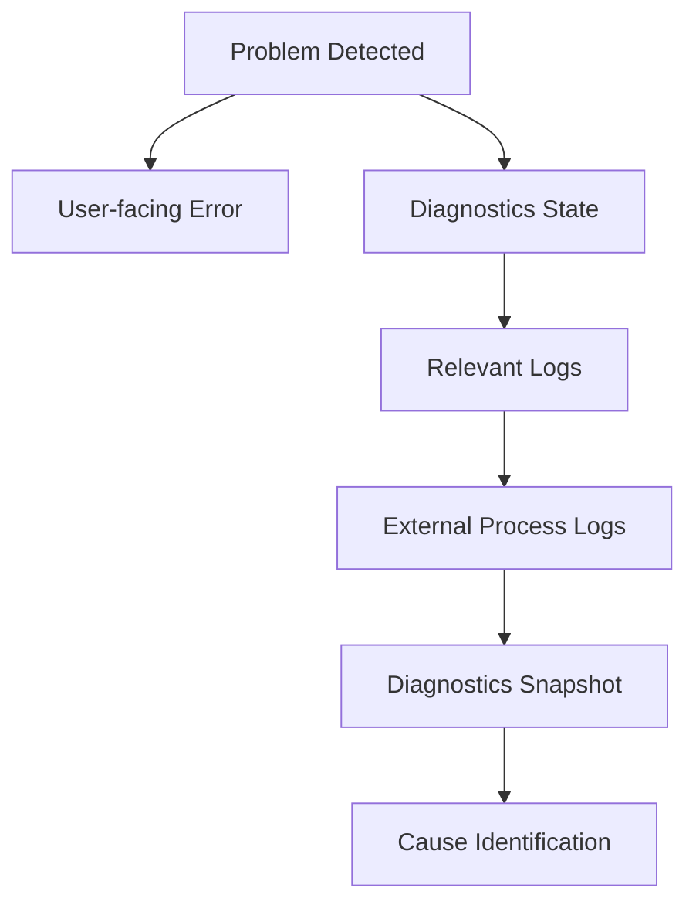

すべての障害で必ずこの順序を要求するものではないが、調査経路を一定化する。

### 採用理由

Moduleごとに異なる調査方法を取ると、OSS開発者が障害調査方法を把握しにくい。

共通の診断経路を用意する。

---

## 5.37 Claude Codeによるログ・診断実装

Claude Codeが新しい機能を実装する場合、正常系処理だけでなくログ・診断についても実装対象とする。

少なくとも以下を確認する。

- 適切なModule / CategoryでLogを出しているか
- Error時に十分なContextがあるか
- User NotificationとDeveloper Logを分離しているか
- Secretを出力していないか
- 外部Processの場合stdout / stderrを取得しているか
- Runtime状態をDiagnosticsから観測可能か
- 高頻度処理で過剰Logを出していないか

これらの規則は`CLAUDE.md`等へ記載する。

### 採用理由

新機能追加時にDiagnosticsを後回しにすると、障害が発生して初めて調査手段が不足していることに気付きやすい。

Logging / Diagnosticsも機能実装の一部として扱う。

---

## 5.38 内部責務分割

概念的には以下の構成を想定する。

```text
Diagnostics/
├─ Logging/
│  ├─ Logger
│  ├─ LogEntry
│  ├─ LogContext
│  ├─ LogWriter
│  └─ LogRotation
│
├─ Runtime/
│  ├─ RuntimeDiagnostics
│  ├─ ModuleDiagnostics
│  └─ PerformanceMetrics
│
├─ External/
│  ├─ ProcessLogCollector
│  ├─ ServiceHealthMonitor
│  └─ VersionCollector
│
├─ Snapshot/
│  ├─ DiagnosticsSnapshot
│  └─ DiagnosticsExporter
│
├─ Privacy/
│  ├─ SecretMasker
│  └─ DiagnosticsSanitizer
│
└─ UI/
   └─ DiagnosticsController
```

### 採用理由

Logging、Runtime Monitoring、External Process、Export、Privacy処理を分離することで、単一の巨大なDiagnostics Managerへ責務が集中することを防ぐ。

---

## 5.39 ログ・診断方式の基本原則

本システムでは、ログ・診断について以下を基本原則とする。

1. 通常利用者向け通知とDeveloper Logを分離する。
2. 利用者には内部実装ではなく、影響と対処方法を示す。
3. 開発者向けには障害解析可能なContextを十分に残す。
4. Log Levelを用途に応じて使い分ける。
5. Module / Category単位でログを識別可能とする。
6. 必要に応じてSessionやRun等のCorrelation情報を付与する。
7. External Processのstdout / stderrを取得可能とする。
8. External ComponentのVersionおよび実行環境を記録可能とする。
9. Process StateとService Healthを区別する。
10. Runtime状態およびPerformanceをDeveloper Diagnosticsから観測可能とする。
11. Diagnostic CameraをStreaming Pipelineから構造的に分離する。
12. 診断Overlayを通常配信映像へ含めない。
13. 障害報告用Diagnostics Exportを生成可能とする。
14. Secret情報をLogおよびDiagnostics Exportへ出力しない。
15. 必要に応じて個人情報を含むPathをMaskingする。
16. Logを無制限に保存しない。
17. 高頻度処理では過剰なLog出力を避ける。
18. 同一Errorの大量出力を必要に応じて抑制する。
19. Application VersionおよびExternal Component Versionを確認可能とする。
20. Recovery処理についても履歴を残す。
21. 診断機能自体によるRuntime性能への影響を抑える。
22. Logging / Diagnosticsを各機能実装の一部として扱う。
23. Claude Codeによる実装時もLogging・DiagnosticsをReview対象とする。


---

---

# 6. Project・設定・データ管理方式

## 6.1 基本方針

本システムでは、配信に必要な複数の設定を個別に管理するだけでなく、関連する設定をまとめた**Project**という単位を設ける。

Projectは、特定の配信構成を再現するために必要な情報をまとめて保持する。

例えば以下を関連付ける。

- Avatar
- Tracking設定
- Voice Model
- Voice設定
- Stage
- Camera設定
- Capture設定
- BGM / SE設定
- Streaming設定
- Audio Routing
- その他配信固有設定

概念的には以下の構成とする。

```text
Project
├─ Avatar
├─ Tracking Profile
├─ Voice Profile
├─ Stage
├─ Camera Profile
├─ Capture Profile
├─ Audio Profile
└─ Streaming Profile
```

### 採用理由

各機能の設定を完全に独立して管理すると、配信開始時に毎回、

- アバターを選択する
- 音声モデルを選択する
- ステージを選択する
- カメラを設定する
- 音量を調整する
- 配信設定を選択する

といった作業が必要となる。

Projectとして一括管理することで、過去の配信構成を簡単に再現できるようにする。

---

## 6.2 ProjectとProfileの分離

Projectは、各機能の設定値をすべて直接保持するのではなく、原則として各機能が管理するProfileを参照する。

概念的には以下の関係とする。

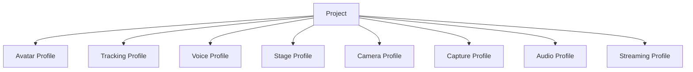

### 採用理由

Project内部へすべての設定値をコピーすると、同じ設定を複数Projectで利用した場合に重複が発生する。

例えば同じTracking Profileを複数Projectで利用している場合、Tracking設定を変更するたびに複数Projectを更新する必要が生じる。

そのため、

**各機能固有の再利用可能な設定はProfile**

**Profileの組み合わせをProject**

として扱う。

---

## 6.3 Profile管理方式

各機能は、その機能固有の設定をProfileとして管理可能とする。

初期段階では以下を想定する。

| Profile | 主な設定 |
|---|---|
| Avatar Profile | ボーン、表情、体格補正等 |
| Tracking Profile | Provider、カメラ、平滑化、キャリブレーション等 |
| Voice Profile | Voice Model、Pitch、後処理等 |
| Camera Profile | Camera Point、FOV、切り替え設定等 |
| Capture Profile | GameCapture Device、SubScreen Monitor、Capture Source設定等 |
| Audio Profile | Bus音量、Routing、Effect等 |
| Streaming Profile | 解像度、FPS、Encoder、Bitrate等 |

Stageについては、Stage自身にStage Profile相当の情報を持たせてもよい。

### 採用理由

機能ごとに設定のライフサイクルが異なるためである。

例えばTracking設定だけを変更したい場合に、Project全体を作り直す必要がない構成とする。

---

## 6.4 Projectデータ構成

Projectには少なくとも以下の情報を保持する。

```text
Project
├─ ProjectId
├─ DisplayName
├─ CreatedAt
├─ UpdatedAt
├─ AvatarId
├─ TrackingProfileId
├─ VoiceProfileId
├─ StageId
├─ CameraProfileId
├─ CaptureProfileId
├─ AudioProfileId
├─ StreamingProfileId
└─ Project-specific Settings
```

Project固有でのみ必要な設定については、Project自身に保持可能とする。

### 採用理由

すべてをProfileへ分離すると、Projectにしか意味を持たない設定までProfileとして管理する必要があり、かえって管理構造が複雑になる。

そのため、

- 再利用したい設定 → Profile
- そのProjectだけで意味を持つ設定 → Project

として分ける。

---

## 6.5 設定データ保存形式

ProjectやProfile等の設定データについては、人間および開発者が内容を確認しやすいテキスト形式を基本とする。

初期実装ではJSONを基本形式とする。

SQLiteは、13章のTraining Run履歴等、検索・履歴管理が重要なデータに使用する。

### 採用理由

すべての設定をSQLiteへ格納すると、利用者や開発者が設定内容を直接確認しにくくなる。

一方、履歴や大量レコードの検索にはDBが適している。

そのため、

**設定・構成情報はJSON等のファイル**

**履歴・検索性が重要な情報はSQLite**

という役割分担とする。

---

## 6.6 IDによる参照方式

Projectや各Profile間の関連付けには、表示名やファイルパスではなく、一意なIDを使用する。

例：

```text
Project
  AvatarId = avatar_001
  VoiceProfileId = voice_profile_003
  StageId = stage_room_001
```

表示名は利用者向け情報として別に保持する。

### 採用理由

表示名はユーザーが変更する可能性がある。

また、ファイルパスを直接参照すると、保存場所変更によって設定が壊れる可能性がある。

そのため、内部参照には安定したIDを使用する。

---

## 6.7 データ保存領域の基本方針

本システムのデータは、用途に応じて大きく以下の3種類に分けて保存する。

1. **アプリケーション基本設定**
2. **ユーザーデータ・Project・Asset**
3. **秘密情報**

それぞれ保存先を分離する。

### 採用理由

設定、ユーザーデータ、秘密情報では、

- 更新頻度
- サイズ
- 可搬性
- セキュリティ要件
- バックアップ方法

が異なる。

すべてを同一フォルダや同一ファイル形式で扱わず、役割に応じて分離する。

---

## 6.8 アプリケーション基本設定の保存方式

アプリケーション起動に必要な小規模設定については、OS標準のユーザーデータ領域へ保存する。

Windowsを主対象とする場合、初期配置先として以下を想定する。

```text
%LOCALAPPDATA%/
└─ VirtualVesselStudio/
   ├─ bootstrap.json
   └─ Config/
      ├─ app-settings.json
      └─ ui-settings.json
```

対象例：

- Data Rootの保存先
- UI設定
- Developer Mode
- 既定デバイス
- アプリケーション全体設定

### 採用理由

アプリケーション実行ファイルと同じ場所や`Program Files`配下へユーザー設定を保存すると、

- 書き込み権限
- アプリ更新
- 再インストール
- バージョン差し替え

等の影響を受けやすい。

そのため、OS標準のユーザーデータ領域を利用する。

---

## 6.9 Data Root方式

Project、Avatar、Stage、Voice Model、Dataset等のユーザーデータについては、**Data Root**と呼ぶ専用の管理領域へ保存する。

初期値は例えば以下とする。

```text
%LOCALAPPDATA%\VirtualVesselStudio\Data
```

ただし、Data Rootはユーザーが変更可能とする。

例：

```text
D:\VirtualVesselStudioData
```

Data Rootの実際の場所は、OS標準領域に配置した`bootstrap.json`等から参照する。

概念的には以下とする。

```text
%LOCALAPPDATA%\VirtualVesselStudio\
        ↓
bootstrap.json
        ↓
Data Root
        ↓
D:\VirtualVesselStudioData
```

### 採用理由

Avatar、Stage、Voice Model、Dataset、Training Run、録画データ等は容量が大きくなる可能性がある。

これらを常に`%LOCALAPPDATA%`へ保存すると、システムドライブ容量を圧迫する可能性がある。

そのため、小規模な起動設定だけをOS標準領域へ残し、大容量データについては保存先を変更可能とする。

---

## 6.10 Data Root内部構成

Data Rootは概念的に以下のように構成する。

```text
DataRoot/
├─ Projects/
│  └─ <ProjectId>/
│     └─ project.json
│
├─ Profiles/
│  ├─ Tracking/
│  ├─ Voice/
│  ├─ Camera/
│  ├─ Capture/
│  ├─ Audio/
│  └─ Streaming/
│
├─ Avatars/
│  └─ <AvatarId>/
│     ├─ model.vrm
│     ├─ avatar-profile.json
│     └─ thumbnail.png
│
├─ Stages/
│
├─ VoiceModels/
│
├─ Audio/
│  ├─ BGM/
│  └─ SE/
│
├─ VoiceLab/
│  ├─ voice-lab.db
│  ├─ Datasets/
│  ├─ TrainingRuns/
│  └─ Models/
│
├─ Cache/
└─ Logs/
```

RVC、VoxCPM2等の外部OSSについては、13章で定義したExternal管理領域として別途管理する。

### 採用理由

用途別にディレクトリを分離することで、

- バックアップ
- 障害調査
- データ削除
- Import / Export
- 容量確認

を行いやすくする。

---

## 6.11 AssetとProfileの配置方針

特定Assetに強く紐付くProfileについては、そのAssetと同じ管理領域へ配置可能とする。

例えばAvatar Profileは、

```text
Avatars/
└─ <AvatarId>/
   ├─ model.vrm
   ├─ avatar-profile.json
   └─ thumbnail.png
```

のように保存する。

一方、複数AssetやProjectから再利用されるProfileについては、

```text
Profiles/
├─ Tracking/
├─ Voice/
├─ Camera/
├─ Audio/
└─ Streaming/
```

等の共通領域へ保存する。

### 採用理由

すべてのProfileを一律に同じ場所へ配置すると、特定Asset専用設定と再利用可能設定の区別が分かりにくくなる。

そのため、

**Asset固有設定はAssetと同じ場所**

**再利用可能設定は共通Profile領域**

とする。

---

## 6.12 アプリケーション管理領域への取り込み

本システムへ登録されたAssetは、原則としてData Root配下へコピーして管理する。

対象例：

- Avatar Model
- Stage
- Voice Model
- BGM
- SE
- Dataset
- Training Run成果物

元ファイルへのパスは必要に応じてメタデータとして保持してもよいが、Runtime時の必須参照先とはしない。

### 採用理由

外部ファイルへの参照のみを保存すると、元ファイルの移動、名称変更、削除等によってProjectを再現できなくなる可能性がある。

本システム管理領域へ取り込むことで、登録後は本システム内だけでデータを完結して管理できる。

---

## 6.13 秘密情報管理方式

以下のような秘密情報は、ProjectやProfileの通常JSONへ直接保存しない。

- YouTube Stream Key
- OAuth Token
- API Key
- その他認証情報

秘密情報は、OSが提供するCredential Store等の安全な保存方式を利用する。

ProjectやStreaming Profileからは、必要に応じてCredential IDを参照する。

```text
Streaming Profile
        ↓
CredentialId
        ↓
OS Credential Store
```

### 採用理由

ProjectやProfileは、

- バックアップ
- Import / Export
- GitHub Issue
- ユーザー間共有

等によって外部へ持ち出される可能性がある。

秘密情報を同じファイルへ保存すると、意図せず外部へ流出する危険があるためである。

---

## 6.14 設定スキーマバージョン管理

ProjectやProfileには設定形式のSchema Versionを持たせる。

例：

```json
{
  "schemaVersion": 3,
  "projectId": "project_001"
}
```

アプリケーション更新によって設定構造が変更された場合、旧設定から新設定へ変換可能とする。

### 採用理由

OSSとして継続的にアップデートする場合、設定項目やデータ構造が変更される可能性が高い。

Schema Versionを明示することで、旧データの形式を判別できるようにする。

---

## 6.15 Migration方式

設定スキーマ変更時には、旧形式から新形式へのMigration処理を提供する。

概念的には以下の流れとする。

```text
Load Data
    ↓
Check Schema Version
    ↓
Old Version?
    ├─ No → Load
    │
    └─ Yes
         ↓
      Migration
         ↓
      Validation
         ↓
        Load
```

Migrationは可能な限り段階的に行う。

```text
v1 → v2 → v3
```

### 採用理由

各旧Versionから最新版への専用変換処理をすべて用意すると、Version増加に伴ってMigration処理が増大する。

段階的Migrationにより管理を単純化する。

---

## 6.16 データ検証方式

ProjectやProfile読み込み時には、設定値および参照先を検証する。

対象例：

- AvatarIdが存在するか
- StageIdが存在するか
- Voice Modelが存在するか
- Profile形式が正しいか
- 必須項目が存在するか
- Schema Versionが対応しているか
- Credential参照が有効か

不正な設定をそのままRuntimeへ渡さない。

### 採用理由

設定ファイルは、

- アプリ更新
- 手動編集
- ファイル破損
- Import
- Asset削除

等によって不整合が発生する可能性がある。

Runtime開始後にエラーとなるより、読み込み段階で問題を検出した方が原因を明確に提示できる。

---

## 6.17 Project読み込み方式

Project読み込み時には、関連するProfileやAssetを解決し、Runtimeへ適用する。

```text
Project Load
    ↓
Project Validation
    ↓
Profile Resolution
    ↓
Asset Validation
    ↓
Runtime Configuration
    ↓
Avatar / Tracking / Voice / Stage / Camera / Audio
```

個々の設定適用は各Moduleへ委譲する。

### 採用理由

Project Manager自身がAvatar、Tracking、Voice等の内部実装を直接操作すると、Project管理機能が全Moduleへ強く依存する。

Project Managerは、

**何を利用するかを解決する**

ところまでを担当し、

**どう適用するか**

については各Moduleへ任せる。

---

## 6.18 Project切り替え方式

配信中のProject切り替えについては、すべてを無条件に一括再初期化する方式とはしない。

Projectを構成する設定を、

- Runtime中に安全に変更可能なもの
- 再初期化を必要とするもの

に分類し、必要な処理を順序立てて適用する。

例：

- Avatar切り替え
- Stage切り替え
- Voice Model切り替え
- Camera設定変更
- Audio設定変更

### 採用理由

Project変更によってStreaming Encoder等まで不用意に再初期化すると、配信停止につながる可能性がある。

そのため、各Moduleで定義された安全なRuntime変更方式を利用する。

---

## 6.19 自動保存方式

Setup画面等で設定を変更した場合、必要に応じて自動保存を利用可能とする。

ただし、すべての編集操作を即座に確定データとして保存するのではなく、

- 編集中状態
- 確定済み状態

を分離可能とする。

### 採用理由

すべてを即時保存すると、試行中の設定や誤操作まで永続化される可能性がある。

一方、明示的な保存のみでは異常終了時に変更内容が失われる可能性がある。

そのため、対象機能に応じて自動保存と確定保存を使い分ける。

---

## 6.20 バックアップ方式

Project、Profile、SQLite DB等の重要データについて、バックアップ可能な構成とする。

主な保護対象は以下とする。

- Projects
- Profiles
- Avatar Profile
- Voice Model情報
- Voice Lab SQLite DB
- その他再作成コストの高い設定

必要に応じて世代バックアップを行える構成とする。

### 採用理由

Project設定や学習履歴には、再作成に時間がかかる情報が含まれる。

ファイル破損やMigration失敗によってすべて失われることを防ぐ。

---

## 6.21 Import / Export方式

Projectおよび関連データについて、Import / Export可能な構成とする。

Exportでは必要に応じて以下をまとめられるようにする。

- Project
- Profile
- Avatar
- Voice Model
- Stage
- Audio素材

秘密情報はExport対象から除外する。

対象外例：

- YouTube Stream Key
- OAuth Token
- API Key

### 採用理由

Projectを別PCへ移行したり、バックアップしたりする需要が想定される。

一方で認証情報まで同梱すると、意図せず秘密情報が共有される可能性がある。

そのため、可搬データと秘密情報を分離する。

---

## 6.22 Project削除方式

Projectを削除しても、参照しているAvatar、Voice Model、Stage等を自動削除しないことを基本とする。

### 採用理由

同一AssetやProfileが複数Projectから参照されている可能性がある。

Project削除時にAssetまで削除すると、他Projectが使用不能になる可能性がある。

---

## 6.23 Asset削除方式

Avatar、Voice Model、Stage等を削除する場合は、そのAssetを参照しているProjectやProfileを確認する。

参照されている場合は、利用者へ影響範囲を通知する。

### 採用理由

参照関係を確認せずAssetを削除すると、既存Projectが不完全な状態になるためである。

---

## 6.24 Cache管理方式

再生成可能な一時データについてはCache領域へ保存する。

対象例：

- サムネイル一時データ
- 一時変換ファイル
- Preview用データ
- 一時解析結果

Cacheは必要に応じて削除・再生成可能とする。

### 採用理由

永続データと一時データを混在させると、バックアップ対象や削除可否が分かりにくくなる。

再生成可能なデータをCacheへ分離することで、容量管理を容易にする。

---

## 6.25 Logs管理方式

アプリケーションログについては、ユーザーデータとは分離したLogs領域へ保存する。

ログの詳細方式についてはログ・診断方式の章で定義する。

### 採用理由

ProjectやAssetのバックアップ時に大量のログまで含まれることを避ける。

また、障害調査時にログを一箇所から取得しやすくする。

---

## 6.26 Data Root変更方式

ユーザーはData Rootを変更可能とする。

変更時には、既存データを新しいData Rootへ移行するか、空のData Rootとして使用するかを選択可能な構成を検討する。

移行時には、コピー完了およびデータ整合性を確認してから、新Data Rootを有効化する。

### 採用理由

単にData Root設定だけを変更すると、既存ProjectやAssetが見つからなくなる可能性がある。

そのため、保存先変更とデータ移行を明確に区別し、安全に切り替えられる構成とする。

---

## 6.27 SetupとRuntimeの分離

### Setup

以下を扱う。

- Project作成
- Project編集
- Profile作成・編集
- Asset登録
- Data Root設定
- Import / Export
- Backup
- Migration
- データ管理

### Runtime

以下を扱う。

- Project読み込み
- Profile解決
- Runtimeへの設定適用
- 安全な設定切り替え
- Runtime状態保持

### 採用理由

ファイル操作、Migration、データ移行等の処理をリアルタイムRuntimeから分離し、配信処理へ影響させないためである。

---

## 6.28 エラー処理・診断方式

通常利用者には例えば以下を表示する。

- Projectを読み込めません
- 必要なアバターが見つかりません
- 音声モデルが見つかりません
- Data Rootへアクセスできません
- 設定データが古いため更新します
- 設定ファイルが壊れています
- データ移行に失敗しました

Developer Diagnosticsでは必要に応じて以下を記録する。

- ProjectId
- ProfileId
- AssetId
- Schema Version
- Migration Version
- Data Root
- Data Path
- Missing Reference
- Validation Result
- Migration Result
- Exception
- Stack Trace

秘密情報は出力しない。

### 採用理由

Project読み込みやデータ移行のエラーは、複数Module、Profile、Asset、ファイルシステム等の参照関係から発生する可能性がある。

通常利用者には復旧に必要な情報を提示し、開発者にはどの処理で問題が発生したか追跡可能な情報を提供する。

---

## 6.29 内部責務分割

概念的には以下の構成を想定する。

```text
DataManagement/
├─ Bootstrap/
│  ├─ BootstrapSettings
│  └─ DataRootResolver
│
├─ Project/
│  ├─ ProjectProfile
│  ├─ ProjectManager
│  └─ ProjectValidator
│
├─ Profiles/
│  ├─ ProfileRepository
│  └─ ProfileResolver
│
├─ Assets/
│  ├─ AssetManager
│  └─ AssetRegistry
│
├─ Serialization/
│  └─ JsonSerializer
│
├─ Migration/
│  └─ DataMigrationManager
│
├─ Backup/
│  └─ BackupManager
│
├─ Transfer/
│  ├─ ImportManager
│  └─ ExportManager
│
├─ Credentials/
│  └─ CredentialStore
│
├─ Cache/
│  └─ CacheManager
│
└─ Runtime/
   └─ ProjectRuntimeLoader
```

### 採用理由

Project管理、Profile管理、Asset管理、Data Root、Migration、Import / Export等を単一クラスへ集約すると、データ構造変更時の影響範囲が大きくなる。

責務ごとに分離することで、

- Profile追加
- 新しいAsset追加
- Schema変更
- Data Root変更
- Migration追加
- Import / Export拡張

等を独立して行いやすくする。

---

## 6.30 データ管理の基本原則

本システムでは、Project・設定・データ管理について以下を基本原則とする。

1. 配信構成はProject単位で管理する。
2. 再利用可能な機能設定はProfileとしてProjectから分離する。
3. 内部参照には表示名やファイルパスではなく一意なIDを使用する。
4. 登録Assetは原則として本システム管理領域へ取り込む。
5. アプリケーション基本設定はOS標準のユーザーデータ領域へ保存する。
6. 大容量ユーザーデータは変更可能なData Rootへ保存する。
7. Data Rootの場所はbootstrap設定から解決する。
8. 秘密情報はProjectやProfileとは分離し、OS Credential Store等へ保存する。
9. 設定データにはSchema Versionを持たせる。
10. 旧データはMigrationによって新形式へ変換可能とする。
11. Runtimeへ適用する前に設定および参照先を検証する。
12. 大容量AssetをSQLiteへ格納しない。
13. 履歴管理等、DBが適した情報にはSQLiteを使用する。
14. Project削除とAsset削除を別操作として扱う。
15. Import / Export時には秘密情報を含めない。
16. Cacheと永続データを分離する。
17. 配信中のProject変更は各Moduleの安全な変更方式を利用する。
18. Data Root変更時には既存データの整合性を確認してから切り替える。


---

---

# 7. 3Dアバター制御方式

## 7.1 目的

3Dアバター制御機能では、VTuberとして使用する3Dモデルの読み込み、登録、切り替え、姿勢制御、表情制御、拡張ボーン制御、およびモデル固有設定の管理を行う。

本機能では、VRMやFBX等のモデル形式固有の情報を、トラッキング機能やアプリケーションの他機能から直接扱わない構成とする。

モデル形式とアバター制御処理の間に**アバター抽象層**を設け、VRM、FBXおよび将来追加されるモデル形式を、上位機能から可能な限り同一の方法で扱える構成とする。

また、Humanoid標準骨格に含まれない猫耳、尻尾等についても、拡張ボーンとしてモデル形式から独立して扱う。

初期機能として猫耳および尻尾の表情連動動作を提供し、動作内容はユーザーが変更可能とする。

さらに、猫耳・尻尾以外の任意の拡張要素についても、ユーザーが対象ボーンと動作条件を登録することで追加可能な構成とする。

### 採用理由

3Dモデル形式ごとにボーン取得方法、表情制御方法、メタデータ構造等が異なる。

これらの違いをTracking ModuleやUI等まで露出させると、モデル形式を追加するたびに複数機能を修正する必要が生じる。

そのため、モデル形式固有処理を限定された領域へ閉じ込め、その上に共通のアバター表現を設ける。

また、猫耳や尻尾等をモデルごとの専用コードとして実装すると、新しいモデルや拡張要素を追加するたびにプログラム修正が必要となる。

そのため、拡張ボーンについても共通の制御方式を設ける。

これにより、モデル形式、標準人体骨格、拡張要素の違いによる変更範囲を小さくし、システム全体の保守性と拡張性を確保する。

---

## 7.2 アバター制御アーキテクチャ

3Dアバター制御は、大きく以下の3層に分離する。

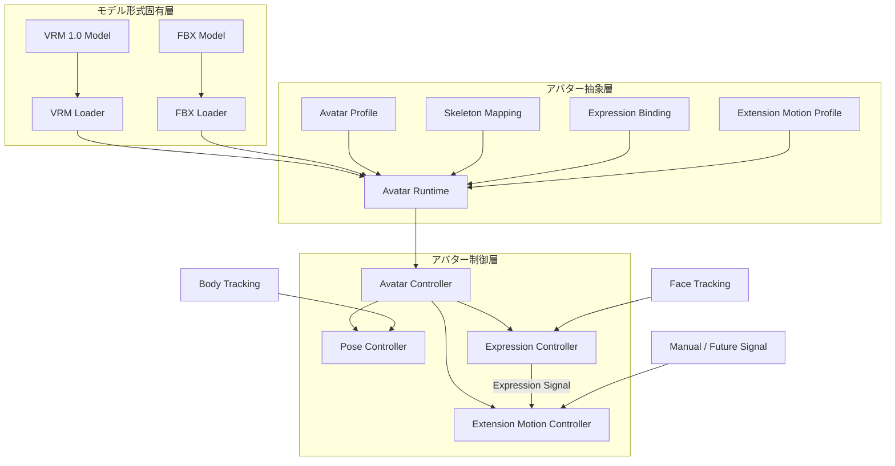

図中の矢印は、クラス継承そのものを意味するものではなく、主として以下を表す。

- データの変換
- 情報の受け渡し
- 制御要求の流れ

### モデル形式固有層

VRM、FBX等のモデルファイルを読み込み、モデル形式固有の情報を解釈する。

VRM固有APIやFBX固有APIは、原則としてこの層に閉じ込める。

### アバター抽象層

モデル形式の違いを吸収し、上位の制御処理から同一のアバターとして扱えるようにする。

標準人体ボーン、拡張ボーン、表情、拡張ボーン動作設定、モデル設定等を、本システム共通の形式として提供する。

### アバター制御層

トラッキング結果等を受け取り、抽象化されたアバターへ姿勢、表情および拡張ボーン動作を適用する。

VRMやFBXの具体的な内部構造については認識しない。

### 採用理由

モデル読み込み処理とアバター制御処理を直接接続すると、例えばVRM用の制御処理とFBX用の制御処理がそれぞれ必要となり、モデル形式の数に応じて処理が増加する。

そこで、

**形式固有処理 → 共通表現 → 制御**

という境界を設ける。

これにより、

- VRMライブラリを変更する
- FBX対応方法を変更する
- 新しい3Dモデル形式を追加する
- 新しい拡張ボーン制御を追加する

といった変更が発生しても、他のアバター制御処理への影響を抑えられる。

また、各層の責務を明確にすることで、障害発生時に「読み込み処理」「マッピング処理」「姿勢制御」「表情制御」「拡張ボーン制御」のどこで問題が発生したかを切り分けやすくする。

---

### Avatar Runtime

`Avatar Runtime`は、読み込まれた3Dモデルを本システム上で実際に制御するための実行時アバター表現である。

Unity上に生成されたGameObjectだけを意味するものではなく、

- 読み込まれたモデル
- 標準ボーンへの参照
- 拡張ボーンへの参照
- 表情への参照
- Avatar Profile
- Extension Motion設定
- 現在のアバター状態

等をまとめて扱う。

基本的に、1体の読み込まれたアバターに対して1つのAvatar Runtimeを生成する。

### 採用理由

UnityのGameObjectだけをアバターとして扱うと、ボーンマッピング、表情設定、拡張ボーン設定、モデル固有設定等が別々の場所で管理されやすくなる。

これらを実行時の1つの単位としてまとめることで、

**「現在このアバターを制御するために必要な情報」**

を一箇所から取得できるようにする。

また、将来的に複数アバターを同時に扱う場合でも、Avatar Runtimeを複数生成することで対応できるため、システム全体で唯一のAvatarを前提とせずに済む。

---

### Avatar Profile

`Avatar Profile`は、モデルファイルそのものではなく、

**そのモデルを本システム上でどのように利用するか**

を表す永続設定である。

例えば以下を保持する。

- ボーンマッピングに関する補足設定
- 拡張ボーン登録情報
- 表情マッピング
- Extension Motion Profileへの参照
- モデルのスケール
- 初期位置
- 初期回転
- トラッキング適用時の補正情報
- モデル固有の制御設定

### 採用理由

モデルファイルそのものへ本システム固有情報を書き込むと、元モデルを変更する必要が生じる。

また、VRMとFBXではモデル内部へ保存できる情報や方法も異なる。

そこで、モデルファイルと本システム固有設定を分離する。

これにより、

- 元モデルを変更しない
- 同じモデルに異なる設定を適用できる
- 拡張ボーンの動きをモデルファイルから独立して変更できる
- アプリケーション側だけで設定形式を更新できる
- モデル形式によらず同じ設定管理方式を利用できる

ようにする。

---

### Avatar Controller

`Avatar Controller`は、Avatar Runtimeを操作するための上位制御窓口とする。

他モジュールがTransform、BlendShape、VRM API等を直接操作することは避け、Avatar Controllerを介して制御要求を渡す。

内部ではPose Controller、Expression Controller、Extension Motion Controller等へ処理を振り分ける。

Avatar Controllerをシステム全体で1つだけ存在するSingletonとしては設計しない。

### 採用理由

外部モジュールからUnity Transform等を自由に操作可能にすると、複数の処理が同じボーンを書き換え、処理順序や依存関係が分からなくなる可能性がある。

制御窓口を設けることで、

- アバターへの変更経路を限定する
- 制御処理を追跡可能にする
- 将来制御処理を追加しやすくする
- 複数アバターにも対応できる

構成とする。

---

## 7.3 3Dモデル読み込み方式

モデル読み込み処理はモデル形式ごとに分離する。

共通のモデル読み込みインターフェイスを設け、その実装として形式別Loaderを配置する。

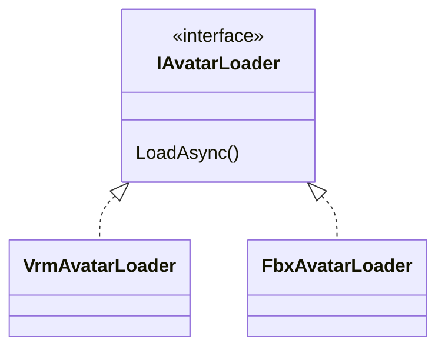

初期対応形式は以下とする。

| 形式 | 対応方針 |
|---|---|
| VRM | VRM 1.0以降を対象とする |
| FBX | 対応対象とする |

FBXのランタイム読み込み方法については、使用ライブラリ等を詳細設計時に決定する。

Loaderは標準人体ボーンだけでなく、モデル内に存在する拡張ボーンについても後続処理から参照可能な状態で読み込む。

### 採用理由

モデル形式ごとの読み込み処理を共通処理へ直接記述すると、形式追加のたびに既存コードを変更する必要がある。

Loaderを形式ごとに独立させることで、新しい形式を追加する場合は原則としてLoaderの追加だけで対応可能とする。

また、VRMライブラリ等の外部依存をLoader内部に限定することで、外部ライブラリ更新による影響範囲も限定する。

---

## 7.4 アバタープロファイル管理方式

モデルファイルと、本システム固有の設定情報を分離して管理する。

本方式設計では、この設定情報を**Avatar Profile**と呼ぶ。

名称候補は以下の通りである。

| 名称 | 意味・特徴 |
|---|---|
| Avatar Definition | アバター自体の定義という意味が強く、モデルデータまで含むように受け取られやすい |
| Avatar Configuration | 設定情報であることは明確だが対象範囲が広い |
| Avatar Descriptor | アバターを記述する情報という意味だが、やや抽象的 |
| Avatar Mapping Profile | ボーン・表情マッピングを表現しやすいが、それ以外の設定を含めにくい |
| **Avatar Profile** | アバターごとの利用設定一式を表しやすく、モデルファイルと区別しやすい |

本システムでは**Avatar Profile**を採用する。

### 採用理由

`Definition`という名称では、「アバターとは何かを定義するデータ」、すなわちモデルそのものまで含む印象が強い。

今回保存したい情報は、

**モデルそのものではなく、本システム上でそのモデルをどう使用するか**

である。

そのため、設定一式という意味を持たせやすい`Profile`を採用する。

---

## 7.5 ボーン抽象化方式

VRM、FBX等の内部Transform構造をTracking Module等から直接参照しない。

人体の基本骨格についてはHumanoid構造を基本とし、本システム共通のボーン識別子へ変換する。

対象例：

- Head
- Neck
- Chest
- Spine
- Hips
- Shoulder
- UpperArm
- LowerArm
- Hand
- UpperLeg
- LowerLeg
- Foot
- 指各関節

一方、Humanoid構造に含まれない以下のようなボーンも扱える構成とする。

- 猫耳
- 狐耳
- うさ耳
- 尻尾
- 翼
- 髪
- 衣服
- 装飾
- その他モデル固有ボーン

そのため、ボーンは大きく、

- 標準人体ボーン
- 拡張ボーン

として管理する。

### 初期対応する拡張ボーン

初期機能として、VTuberモデルで利用頻度が高い以下を標準対応対象とする。

- 猫耳
- 尻尾

ただし、内部実装を猫耳・尻尾専用にはしない。

猫耳・尻尾についても後述する共通のExtension Motion機構を使用し、その標準設定として提供する。

### ユーザー定義拡張ボーン

モデル内に存在する任意のボーンについて、ユーザーが拡張ボーンとして追加登録可能とする。

例えば、

- 狐耳
- うさ耳
- 翼
- アホ毛
- リボン
- 触角
- 特殊な尻尾
- その他独自装飾

等を登録可能とする。

### 採用理由

人体トラッキングの対象となる身体部位については共通名称を定義することで、VRMやFBXの内部構造を意識せず制御できる。

一方、猫耳や尻尾をHuman Boneへ無理に組み込むと、人体骨格と追加構造の意味が混在する。

そのため、Humanoidは標準人体ボーンとして共通化し、それ以外は拡張ボーンとして別に扱う。

さらに、猫耳や尻尾だけをプログラムへ固定実装せず、任意ボーンを登録可能にすることで、モデル固有の特徴にも対応できる構成とする。

---

## 7.6 姿勢適用・体格差吸収方式

Tracking Moduleから取得した人体姿勢をモデルのTransformへ直接適用しない。

トラッキング結果をモデル非依存の姿勢情報として扱い、その後対象アバターへリターゲティングする。

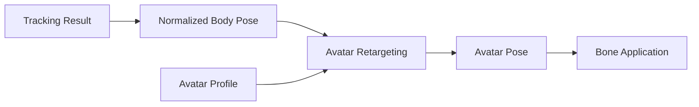

モデルごとに、

- 身長
- 腕の長さ
- 脚の長さ
- 肩幅
- ボーン初期姿勢
- ボーン回転軸
- モデル全体のスケール

等が異なる。

これらについてAvatar Profile等のモデル固有情報を用いて差異を吸収する。

### 採用理由

実際の人間とアバターの体格が完全に一致することは期待できない。

トラッキング値をそのままモデルへ適用すると、

- 手が正しい位置へ届かない
- 肩が不自然に変形する
- 足が床から浮く
- モデルごとに動作結果が異なる

等が起こり得る。

そのため、

**観測された人体姿勢**

と

**アバターへ適用する姿勢**

を分離する。

体格差補正の具体的なアルゴリズムについては詳細設計で決定する。

旧案で独立していたキャリブレーション処理についても、このリターゲティング処理の一部として扱う。

---

## 7.7 表情制御方式

表情制御では、笑顔や怒り等の表情プリセット切り替えを主方式とはせず、**顔トラッキングによる連続的な表情制御**を基本とする。

例えば、

- 左右の目の開閉量
- 瞬き
- 口の開閉量
- 口形状
- 眉の動き
- 頬等の動き

を連続値として取得する。

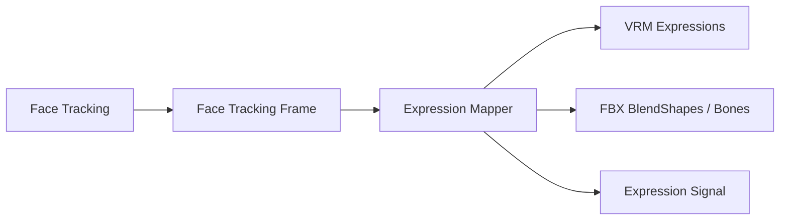

VRMとFBXにおける表情実装の違いはExpression Mappingで吸収する。

また、

- Smile
- Angry
- Sad
- Surprised
- 任意登録表情

等の表情プリセットも補助的に利用可能とする。

表情制御機能は、アバターの顔へ表情を適用するだけでなく、他のアバター制御機能から利用可能な**Expression Signal**を提供する。

Expression Signalは、例えばSmile、Sad等の表情状態や、目・口等の連続的な顔トラッキング値を、モデル形式に依存しない入力値として表現する。

### 採用理由

VTuber用途では、表情を単純なON/OFF状態として切り替えるより、実際の顔の動きに追従して連続的に変化させる方が自然な表現となる。

一方、配信演出等では特定の表情へ即座に切り替えたい場合もある。

そのため、

**顔トラッキングを基本**

としつつ、

**プリセット表情を補助機能**

として併用可能とする。

また、Expression Signalとして他の制御から利用可能にすることで、猫耳や尻尾等を表情と連動して動かすことができる。

---

## 7.8 拡張ボーン・Extension Motion制御方式

標準人体ボーン以外の拡張ボーンについて、表情やその他の入力に応じた動作を設定できる**Extension Motion**機構を設ける。

Extension Motionでは、

**何を動かすか**

と

**何に反応して、どのように動かすか**

を分離する。

```text
Extension Bone
  = 何を動かすか

Extension Motion Profile
  = 何に反応して、どう動かすか
```

### Extension Motion全体構成

概念的には以下の構成とする。

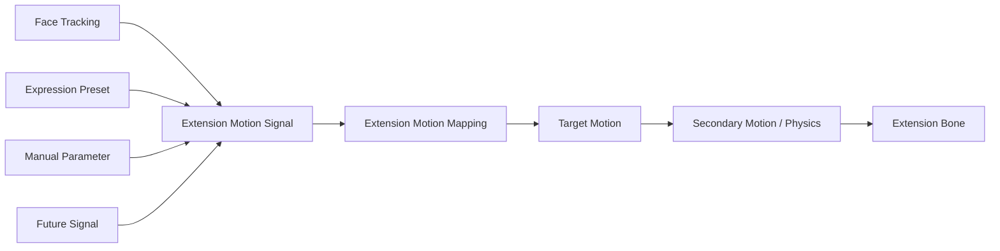

Extension Motion Controllerは、入力Signalと設定されたMappingに基づいて対象拡張ボーンの動作を生成する。

---

### Expression Signalとの連動

初期機能では、猫耳および尻尾について表情との連動を提供する。

入力として例えば以下を利用可能とする。

- Smile
- Angry
- Sad
- Surprised
- Eye Open
- Mouth Open
- その他Face Tracking値
- Expression Preset
- Manual Parameter

入力値は可能な範囲で0.0～1.0等の正規化されたSignalとして扱う。

### 採用理由

特定の表情名をExtension Motion Controller内部へハードコードすると、新しい表情や入力Signalを追加しにくい。

入力を共通Signalとして扱うことで、表情プリセット、連続的な顔トラッキング値、将来の外部入力等を同じ仕組みで扱えるようにする。

---

### 猫耳の標準Motion

猫耳については、表情に連動する標準Motion Profileを提供する。

初期設定例として、

```text
Smile
 → 耳をやや立てる

Sad
 → 耳を伏せる

Surprised
 → 耳を強く立てる

Angry
 → 耳をやや後方へ向ける
```

等を想定する。

ただし、これらの動作内容を固定仕様とはしない。

ユーザーは少なくとも以下を変更可能とする。

- 対象ボーン
- 動作軸
- 回転量
- Position変化量
- 初期Offset
- 左右差
- 反応速度
- Smoothing
- どのSignalに反応するか
- Signalに対する動作量

### 採用理由

同じ猫耳であってもモデルによって、

- ボーン軸
- 初期姿勢
- 耳の大きさ
- 好ましい動き

が異なる。

標準設定を提供しつつ、モデルおよび利用者の好みに応じて変更できる構成とする。

---

### 尻尾の標準Motion

尻尾についても表情連動の標準Motion Profileを提供する。

初期設定例として、

```text
Smile
 → ゆっくり左右に振る

Sad
 → 下方向へ垂らす

Surprised
 → 立ち上がる方向へ変化する

Angry
 → 通常より強い動作を行う
```

等を想定する。

尻尾については、単純に表情から固定角度へ変換するだけでなく、

```text
Expression Signal
      ↓
Base Pose / Motion Parameter
      ↓
Secondary Motion / Physics
      ↓
Final Tail Motion
```

のように、表情に応じた基準姿勢や動作量の上へ揺れや物理挙動を加えられる構成とする。

### 採用理由

尻尾は複数ボーンで構成される場合が多く、固定回転だけでは自然な動きを表現しにくい。

表情によって基準となる姿勢や振り方を変更し、その上にSecondary Motionを適用することで自然な動作を実現しやすくする。

---

### Extension Motion Mapping

Extension Motionの設定はMappingとして保持する。

概念例：

```text
Extension Motion Mapping
├─ MappingId
├─ Target Extension Element
├─ Input Signal
├─ Input Range
├─ Response Curve
├─ Rotation
├─ Position
├─ Scale
├─ Response Speed
├─ Smoothing
└─ Secondary Motion Settings
```

詳細なデータ構造については詳細設計で決定する。

1つのExtension Elementに複数のMappingを設定可能な構成とする。

複数Signalが同一要素へ同時に作用する場合の、

- Blend
- Priority
- Weight

等についても詳細設計で定義する。

---

### Extension Motion Profile

Extension Motion Mappingの集合を**Extension Motion Profile**として管理する。

例えば、

```text
Extension Motion Profile
├─ Cat Ear Settings
├─ Tail Settings
└─ User-defined Extension Settings
```

のように保持する。

Extension Motion ProfileはAvatar Profileから参照可能とする。

必要に応じてMotion Profileの複製、Preset化、Import / Export等へ拡張可能な構成とする。

### 採用理由

拡張ボーンそのものと動作設定を分離することで、同じモデルに異なる動きを適用したり、設定を変更して比較したりしやすくする。

また、将来的なMotion Profile共有にも対応しやすくなる。

---

### ユーザー定義Extension Element

猫耳および尻尾以外の拡張要素についても、ユーザーがSetup UIから追加可能とする。

概念的には以下の情報を設定する。

```text
Extension Element

Name:
  Fox Tail

Target Bones:
  Tail_01
  Tail_02
  Tail_03

Input:
  Smile

Motion:
  Rotation / Position / Secondary Motion

Response:
  User-defined Settings
```

ユーザーはモデル内のボーンを対象として、

- Extension Element名
- 対象ボーンまたはボーン列
- Input Signal
- Motion Mapping

を登録可能とする。

これにより、

- 狐耳
- うさ耳
- 翼
- アホ毛
- 触角
- リボン
- 独自装飾

等を、本体コードの変更なしに追加可能とする。

### 採用理由

3Dアバターにはモデルごとに固有の追加構造が存在する。

あらゆる種類を本体側で事前定義することは現実的ではない。

そのため、頻繁に使用される猫耳・尻尾については標準設定を提供し、それ以外については共通Extension Motion機構を利用してユーザーが追加可能とする。

---

### 拡張ボーン制御失敗時の扱い

設定された拡張ボーンが存在しない場合やMappingに問題がある場合でも、標準人体ボーンの姿勢制御や表情制御を停止させない。

問題のあるExtension Elementのみを無効化し、利用者へ通知する。

### 採用理由

補助的な拡張要素の設定異常によってアバター全体が利用不能になることを避ける。

---

## 7.9 アバター管理・切り替え方式

配信中であってもアバターを切り替え可能とする。

初期実装では1人での利用を主対象とするが、内部設計上は1体のアバターしか存在できないことを前提としない。

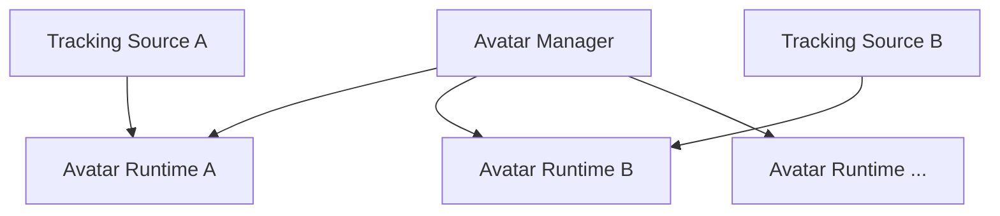

初期バージョンでは同時に利用するアバター数を1体に制限してもよい。

### 採用理由

現在必要な機能だけを考えると、単一の`CurrentAvatar`を保持する実装が最も簡単である。

しかし、その構造にシステム全体が依存すると、将来複数人配信へ対応するときに大規模な設計変更が必要となる。

そのため、

**初期機能として1人しか使わないこと**

と、

**内部構造が1人専用であること**

を分けて考える。

将来の拡張可能性を残しながら、初期実装を必要以上に複雑化しない構成とする。

---

## 7.10 Scene構成方式

UnityのSceneを以下の2種類に分ける。

### Persistent Scene

アプリケーション起動中、原則として読み込み状態を維持するSceneとする。

主に以下を配置する。

- アプリケーション管理機能
- Avatar Manager
- Avatar Runtime
- Tracking関連機能
- Audio関連機能
- Camera
- UI
- その他常駐システム

### Stage Scene

背景や3D空間等、ステージ固有のオブジェクトを保持する。

Stage SceneはAdditive Load / Unloadによって切り替える。

### 採用理由

アバターやTracking等をStage Sceneへ配置すると、ステージを変更するたびにそれらも破棄・再生成される。

その場合、

- アバター再読み込み
- トラッキング再初期化
- 音声処理再初期化
- UI状態消失
- カメラ状態消失

等が発生する可能性がある。

そこで、

**ステージと無関係に継続すべきシステム**

と、

**ステージ変更時に入れ替える3D環境**

をScene単位で分離する。

Persistent Sceneを「VTuberシステム本体」、Stage Sceneを「舞台」として扱う。

なお、`Persistent Scene`という用語は本方式設計内で定義するものであり、過去文書の前提知識を要求しないものとする。

---

## 7.11 アバターデータ保存方式

ユーザーが登録したモデルについては、元ファイルへの参照のみを保存せず、本システム管理領域へコピーして管理する。

6章で定義したData Rootを利用し、概念的には以下のように保存する。

```text
DataRoot/
└─ Avatars/
    └─ <AvatarId>/
        ├─ model.vrm
        ├─ avatar-profile.json
        ├─ extension-motion-profile.json
        └─ thumbnail.png
```

FBXについても、必要な関連ファイルを同様に管理する。

Extension Motion Profileについて、Avatar Profile内部へ直接保存するか別ファイルとして管理するかは詳細設計で決定する。

### 採用理由

元ファイルへのパスだけを保存すると、

- 元ファイルの移動
- 削除
- ファイル名変更
- 外付けドライブの未接続

等によって、登録済みアバターが使用不能になる可能性がある。

統合環境側へコピーすることで、登録完了後は本システム内だけでモデルを完結して管理できる。

また、

- バックアップ
- Project移行
- エクスポート
- 診断
- Motion Profile再利用
- 将来的な共有機能

も実装しやすくなる。

インポート元パスについてはメタデータとして保存してもよいが、実行時には依存しない。

---

## 7.12 SetupとRuntimeの分離

アバター登録・設定時の処理と、配信中の処理を分離する。

### Setup

- モデルインポート
- モデル形式判定
- 標準ボーン認識
- 標準ボーン割り当て
- 拡張ボーン認識
- 猫耳・尻尾候補確認
- ユーザー定義拡張ボーン登録
- 表情認識
- 表情マッピング
- Extension Motion Mapping設定
- Extension Motion Preview
- モデル固有補正
- サムネイル設定
- Avatar Profile保存
- Extension Motion Profile保存

### Runtime

- モデル読み込み
- Avatar Profile読み込み
- Extension Motion Profile読み込み
- Avatar Runtime生成
- Tracking接続
- 姿勢適用
- 表情適用
- Expression Signal生成
- Extension Motion適用

### 採用理由

配信中にボーン解析やExtension Motion設定を毎回行う構成にすると、起動時間が長くなり、ユーザー操作も複雑になる。

Setup時に解析・設定を完了して保存しておくことで、Runtimeでは既存設定を読み込むだけでアバターを利用可能とする。

これにより、

- 配信開始手順を簡単にする
- Runtime処理を軽量化する
- Extension Motionを事前確認する
- 設定ミスを事前に検出する

ことを目的とする。

---

## 7.13 エラー処理・診断方式

通常利用者向けのエラー表示と、開発者向けの診断ログを分離する。

例えば、モデル読み込みに失敗した場合、利用者には、

> アバターの読み込みに失敗しました。

等の理解しやすいメッセージを表示する。

拡張ボーン設定に問題がある場合は、例えば、

> 尻尾の動作設定を適用できませんでした。アバター本体の動作は継続します。

等、問題の影響範囲が分かるようにする。

一方で、開発者向けログには必要に応じて以下を記録する。

- AvatarId
- モデル形式
- Loader
- 対象ファイル
- Missing Bone
- Missing Expression
- Extension Element
- Extension Bone
- Extension Motion Mapping
- Input Signal
- Extension Motion適用結果
- Exception
- Stack Trace

### 採用理由

通常利用者と開発者では必要な情報が異なる。

例えば、

```text
NullReferenceException at VrmAvatarLoader.cs:183
```

という情報は開発者には有用だが、一般利用者にとっては問題の解決につながらず、不必要に複雑な印象を与える。

逆に、

> モデルの読み込みに失敗しました

という情報だけでは、OSS開発者がGitHub Issue等から原因を調査するには不足する。

そのため、

**利用者向けUIでは「何が起きたか」「利用者がどうすればよいか」を示す**

一方で、

**開発者向けログでは「内部で何が起きたか」を詳細に記録する**

という役割分担とする。

これにより、通常利用時の分かりやすさと、OSSとしての障害解析能力の両方を確保する。

また、利用者向け表示と内部ログを分離することで、将来内部実装を変更しても、ユーザー向けメッセージまで内部構造に引きずられにくくする。

---

## 7.14 内部責務分割

3Dアバター制御機能は、単一の巨大なControllerへ処理を集約せず、責務単位で分割する。

概念的には以下の構成を想定する。

```text
Avatar/
├─ Core/
│  ├─ AvatarProfile
│  ├─ AvatarRuntime
│  ├─ AvatarState
│  └─ AvatarBone
│
├─ Loading/
│  ├─ IAvatarLoader
│  ├─ VrmAvatarLoader
│  └─ FbxAvatarLoader
│
├─ Skeleton/
│  ├─ SkeletonMapping
│  └─ ExtensionBone
│
├─ Pose/
│  ├─ AvatarPose
│  ├─ PoseRetargeting
│  └─ PoseController
│
├─ Expression/
│  ├─ FaceTrackingFrame
│  ├─ ExpressionSignal
│  ├─ ExpressionMapping
│  └─ ExpressionController
│
├─ Extension/
│  ├─ ExtensionElement
│  ├─ ExtensionMotionProfile
│  ├─ ExtensionMotionMapping
│  ├─ ExtensionMotionSignal
│  ├─ SecondaryMotionProcessor
│  └─ ExtensionMotionController
│
├─ Runtime/
│  ├─ AvatarController
│  └─ AvatarManager
│
└─ Setup/
   └─ AvatarSetupController
```

### 採用理由

すべての処理を1つのControllerへ集約すると、

- モデル読み込み
- 姿勢処理
- 表情制御
- Extension Motion
- 設定保存
- アバター管理

等が相互に依存し、1箇所の変更が別機能へ影響しやすくなる。

責務ごとに分離することで、

- 各機能の役割を明確化する
- テスト対象を限定する
- 変更影響範囲を小さくする
- 不具合原因を追跡しやすくする
- 新しいモデル形式を追加しやすくする
- 新しい拡張ボーンを追加しやすくする
- 新しいExtension Motion方式を追加しやすくする

ことを目的とする。

なお、ここで示すディレクトリ構造やクラス名は責務分割の考え方を示すものであり、実装時に詳細を調整する。


---

---

# 8. トラッキング方式

## 8.1 基本方針

トラッキング機能では、カメラや外部トラッキング機器等から人体・顔・手指の動きを取得し、本システム内部で共通利用できるトラッキング情報へ変換する。

初期実装ではMediaPipeを利用したカメラベースのトラッキングを対象とする。

将来的にはmocopi等の外部トラッキング機器や、別のトラッキングライブラリを追加可能な構成とする。

トラッキング機能は、特定の3Dモデル形式やアバター構造には依存しない。

### 採用理由

MediaPipe等のトラッキングライブラリが出力するデータ形式を、そのままAvatar Moduleへ渡すと、アバター制御側がMediaPipe固有のランドマーク構造や座標系へ依存する。

この状態では、将来的にmocopi等へ切り替える際に、アバター制御側まで変更する必要が生じる。

そのため、

**トラッキング入力方式**

と

**アバター制御方式**

の間に、本システム共通のトラッキング表現を設ける。

---

## 8.2 トラッキング全体構成

トラッキング処理は、概念的に以下の流れで構成する。

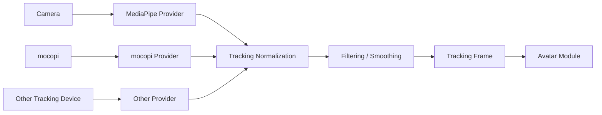

図中の矢印は、主としてデータの取得・変換・受け渡しの流れを示す。

### 採用理由

入力デバイスやライブラリ固有処理をProvider内部へ閉じ込め、その後の処理を共通化することで、入力方式の追加・変更による影響を限定できる。

また、正規化や平滑化等を共通処理として分離することで、Providerごとに同じ処理を重複実装することを避ける。

---

## 8.3 トラッキング入力方式

トラッキング入力は、入力方式ごとにProviderとして分離する。

概念的には以下の構成とする。

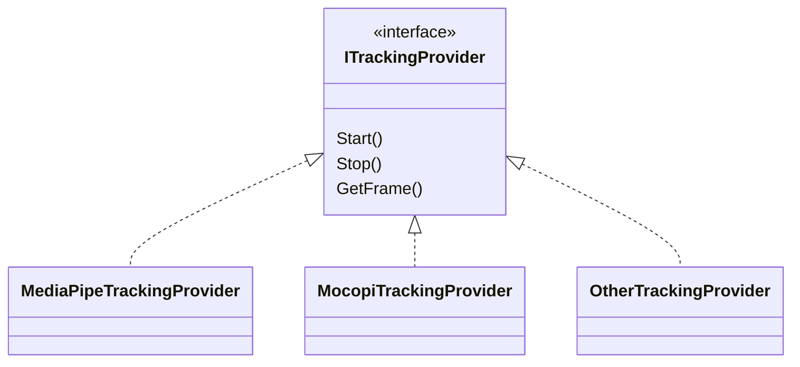

初期実装ではMediaPipeを利用する。

将来的に、

- mocopi
- 別のカメラベーストラッキング
- モーションキャプチャ機器
- ネットワーク経由のトラッキング入力

等を追加可能とする。

### 採用理由

トラッキング入力を共通インターフェイス化することで、上位処理が使用ライブラリを意識する必要をなくす。

また、複数入力方式を同時に利用する可能性も考慮し、Providerをシステム全体で1つだけ存在するSingletonとしては扱わない。

---

## 8.4 共通トラッキングデータ形式

各Providerから取得した情報は、本システム共通の `TrackingFrame` へ変換する。

TrackingFrameは概念的に以下の情報を持つ。

- Body Tracking
- Hand Tracking
- Face Tracking
- Timestamp
- Tracking Confidence
- Tracking Source
- Tracking Status

Body、Hand、Faceについては、それぞれ独立したデータ構造として保持可能とする。

概念例：

```text
TrackingFrame
├─ Timestamp
├─ Body
├─ LeftHand
├─ RightHand
├─ Face
└─ Status
```

### 採用理由

身体、手指、顔では取得方法や更新頻度、欠損条件が異なる場合がある。

すべてを1つの巨大な構造へ固定的に持たせると、一部トラッキングしか利用しない入力方式へ対応しにくい。

そのため、TrackingFrameを共通コンテナとし、その内部に各種トラッキング情報を分離して保持する。

---

## 8.5 身体トラッキング方式

身体トラッキングでは、頭部、胴体、腕、脚等の姿勢情報を取得する。

トラッキング側では、アバターの具体的な骨格構造へ変換せず、人体として観測された姿勢情報を保持する。

例えば、

- Head
- Neck
- Shoulder
- Elbow
- Wrist
- Hips
- Knee
- Ankle

等を本システム共通の人体部位として扱う。

### 採用理由

Tracking Moduleの責務は、

**人間がどのような姿勢をしているかを取得すること**

であり、

**その姿勢を特定アバターの骨格へどう適用するか**

ではない。

体格差やボーン長差の吸収については、3Dアバター制御側のリターゲティング処理で行う。

これにより、Tracking ModuleとAvatar Moduleの責務を明確に分離する。

---

## 8.6 手・指トラッキング方式

手・指トラッキングでは、左右の手および各指関節の姿勢を取得する。

取得可能な場合は、

- 手首
- 親指
- 人差し指
- 中指
- 薬指
- 小指

の各関節情報を保持する。

手指トラッキングが利用できない入力方式については、Body Trackingのみでも動作可能とする。

### 採用理由

入力方式によって取得可能な情報量が異なるため、手指トラッキングを必須条件にすると対応可能なProviderが制限される。

そのため、Body、Hand、Faceを独立した能力として扱い、利用可能な情報だけを使用できる構成とする。

---

## 8.7 顔トラッキング方式

顔トラッキングでは、顔の向きだけでなく、目、口、眉等の動きを取得する。

基本的には連続値として、

- 左右の目の開閉量
- 口の開閉量
- 口形状
- 眉の動き
- 顔の向き
- その他取得可能な顔特徴

を保持する。

Tracking Moduleではこれらをモデル非依存の顔情報として出力し、VRM ExpressionやFBX BlendShape等への変換はAvatar Module側で行う。

### 採用理由

顔トラッキング情報をVRM Expression名等へ直接変換すると、Tracking Moduleがモデル形式へ依存してしまう。

そのため、Tracking Moduleは「人の顔がどう動いているか」だけを表現し、その動きをモデル上でどう表現するかはAvatar Moduleへ委ねる。

---

## 8.8 座標系・姿勢表現方式

各Providerから取得した座標系は、そのまま上位処理へ渡さず、本システム共通の座標系へ変換する。

Providerごとに、

- 右手系 / 左手系
- 軸方向
- 原点位置
- 単位
- Quaternionの定義

等が異なる可能性があるため、Providerまたは正規化処理内で統一する。

### 採用理由

座標系変換をAvatar Module側へ任せると、ProviderとAvatarの組み合わせごとに個別処理が必要となる。

トラッキング出力時点で座標系を統一することで、Avatar Moduleは入力元を意識せず処理できる。

---

## 8.9 信頼度・欠損データの扱い

トラッキングデータには、各部位の信頼度や追跡状態を保持できる構成とする。

例えば、

- Tracked
- LowConfidence
- Lost
- NotSupported

等の状態を表現可能とする。

トラッキング対象を一時的に見失った場合、無効な値を強制的に適用せず、直前値の保持やフェード、制御停止等を選択可能とする。

### 採用理由

カメラベースのトラッキングでは、遮蔽や画角外への移動によって一部ランドマークを取得できなくなることがある。

欠損を通常値と区別しないと、アバターが突然不自然な姿勢へ移動する可能性がある。

そのため、位置や回転値だけでなく、その値が信頼できるかどうかも共通データとして扱う。

---

## 8.10 フィルタリング・平滑化方式

トラッキング値に含まれる細かな揺れやノイズを抑えるため、必要に応じて平滑化処理を行う。

平滑化処理はProvider固有処理とは分離し、本システム共通のTracking Processingとして配置する。

対象として、

- 位置
- 回転
- 顔表情値
- 手指姿勢

等を想定する。

### 採用理由

トラッキング結果を直接アバターへ反映すると、検出値の微小な変動によってモデルが常に細かく震える可能性がある。

一方で平滑化を強くしすぎると操作遅延が増える。

そのため、平滑化処理を独立させ、対象や強度を調整可能な構成とする。

具体的なフィルタ方式については詳細設計で決定する。

---

## 8.11 キャリブレーション方式

Tracking Moduleでは、トラッキング入力そのものに関するキャリブレーションを扱う。

例えば、

- 正面方向の設定
- カメラ位置に対する基準姿勢
- 原点設定
- センサー固有補正

等を対象とする。

一方、

- アバターの身長
- 腕の長さ
- 肩幅
- モデル固有の初期姿勢

等の差異吸収はAvatar Module側で扱う。

### 採用理由

「キャリブレーション」という言葉には、入力機器の補正とアバター体格差の補正の両方が含まれやすい。

これらを同じ機能へまとめると責務が曖昧になる。

そのため、

**入力系を正しく観測するための補正**

をTracking Module、

**観測結果を対象アバターへ合わせる補正**

をAvatar Module

として分離する。

---

## 8.12 複数人トラッキングへの対応

初期実装では1人の利用を主対象とする。

ただし、TrackingFrameやProvider等の内部設計は、1人しか存在できないことを前提としない。

将来的には、

```text
Tracking Session
├─ Person A
│  └─ TrackingFrame
├─ Person B
│  └─ TrackingFrame
└─ Person ...
```

のように複数対象を扱える構成へ拡張可能とする。

### 採用理由

初期段階から複数人トラッキングを完全実装すると複雑性が増す。

一方、単一のGlobal TrackingFrameしか持てない構造にすると、後から複数人対応する際に大幅な変更が必要となる。

そのため、

**初期機能は1人**

としつつ、

**設計上は1人専用にしない**

方針とする。

---

## 8.13 SetupとRuntimeの分離

トラッキングに関しても、SetupとRuntimeを分離する。

### Setup

主に以下を扱う。

- 使用するProvider選択
- カメラ選択
- キャリブレーション
- トラッキング範囲確認
- 平滑化設定
- デバッグ表示
- 各トラッキング機能の有効・無効設定

### Runtime

主に以下を行う。

- Provider起動
- トラッキング取得
- 共通形式への変換
- 正規化
- 平滑化
- TrackingFrame出力

### 採用理由

配信中に入力方式や詳細パラメータを毎回設定する必要があると、操作が複雑になる。

Setup時に必要な設定を保存し、Runtimeでは保存済み設定を使用して速やかにトラッキングを開始できる構成とする。

---

## 8.14 エラー処理・診断方式

通常利用者向けの表示と開発者向けログを分離する。

通常利用者には、

- カメラが見つからない
- トラッキングを開始できない
- 対象人物を検出できない

等、利用者が理解しやすい状態を表示する。

開発者向けログには必要に応じて、

- Provider名
- Providerバージョン
- 入力デバイス
- フレームレート
- 検出状態
- Tracking Confidence
- 初期化失敗理由
- Exception
- Stack Trace

等を記録する。

### 採用理由

通常ユーザーにライブラリ内部エラー等を直接表示しても問題解決につながりにくい。

一方、OSSとして障害を調査する際には、内部状態やエラー詳細が必要となる。

そのため、3Dアバター制御方式と同様に、

**利用者向けには行動可能な情報**

を、

**開発者向けには原因解析可能な情報**

を提供する。

---

## 8.15 内部責務分割

トラッキング機能は、入力、正規化、平滑化、状態管理等を責務単位で分離する。

概念的には以下の構成を想定する。

```text
Tracking/
├─ Core/
│  ├─ TrackingFrame
│  ├─ BodyTrackingData
│  ├─ HandTrackingData
│  ├─ FaceTrackingData
│  └─ TrackingStatus
│
├─ Providers/
│  ├─ ITrackingProvider
│  ├─ MediaPipeTrackingProvider
│  └─ MocopiTrackingProvider
│
├─ Processing/
│  ├─ CoordinateNormalizer
│  ├─ TrackingFilter
│  └─ ConfidenceProcessor
│
├─ Calibration/
│  └─ TrackingCalibration
│
├─ Runtime/
│  └─ TrackingManager
│
└─ Setup/
   └─ TrackingSetupController
```

### 採用理由

Provider固有処理、座標変換、平滑化等を単一クラスへ集約すると、入力方式追加時の変更範囲が大きくなる。

責務単位で分離することで、

- Provider追加
- フィルタ方式変更
- 座標系変更
- デバッグ機能追加

等を互いに独立して行いやすくする。

なお、ここで示すクラス名やディレクトリ構造は責務分割の考え方を示すものであり、詳細は実装時に調整する。


---

---

# 9. 音声変換方式

## 9.1 基本方針

音声変換機能では、ユーザーのマイク音声をリアルタイムに取得し、RVC等の音声変換モデルを用いて別の声質へ変換した上で、モニタリングおよび配信用音声として出力する。

配信中のリアルタイム音声変換処理は、原則としてUnityアプリケーション内部で完結させ、PythonプロセスやローカルPythonサービスには依存しない構成とする。

Pythonを必要とする処理は、モデル学習、音声解析、音声生成等のSetup用途に限定する。

### 採用理由

配信中にPythonサービスへ依存すると、

- Pythonプロセスの異常終了
- Python環境の破損
- ポート競合
- IPCやHTTP通信の遅延
- サービス起動待ち
- Python・CUDAライブラリ間の依存関係問題

等が、そのまま配信中の音声停止につながる。

リアルタイム音声変換はVTuber配信における主要機能であり、配信中に外部サービス障害の影響を受けにくいことが重要である。

そのため、学習環境と推論環境を分離し、配信時推論についてはUnity内部で実行する。

---

## 9.2 音声処理全体構成

音声処理は、概念的に以下のPipelineとして構成する。

```mermaid
flowchart LR

    Mic["Microphone Input"]
    Input["Audio Input"]
    Pre["Pre Processing"]
    VC["Voice Conversion"]
    Post["Post Processing"]
    Monitor["Monitor Output"]
    Stream["Virtual Microphone / Stream Output"]

    Mic --> Input
    Input --> Pre
    Pre --> VC
    VC --> Post

    Post --> Monitor
    Post --> Stream
```

主な処理段階を以下とする。

1. マイク音声取得
2. 入力音声の前処理
3. 音声変換
4. 変換後音声の後処理
5. モニタリング出力
6. 配信用音声出力

### 採用理由

マイク入力、RVC、ピッチ変更、音量調整、出力等を1つの処理へまとめると、特定処理だけを無効化・交換することが難しくなる。

Audio Pipelineとして段階を分離することで、

- 音声変換のみ無効化する
- 後処理だけ変更する
- 別のVoice Conversion方式へ変更する
- 入力デバイスを変更する
- 出力方式を変更する

といった変更を他処理から独立して行えるようにする。

---

## 9.3 Audio Pipeline抽象化方式

各音声処理は、可能な限り共通の音声データを入力・出力として扱う。

概念上、音声処理を以下のように接続可能とする。

```text
Audio Input
    ↓
Noise / Input Processing
    ↓
Voice Conversion
    ↓
Pitch Processing
    ↓
EQ / Gain
    ↓
Audio Output
```

各処理を独立したAudio Processorとして扱える構成とする。

音声変換を無効化した場合は、Voice Conversion処理をPass Throughへ切り替えることで、音声Pipelineそのものは維持する。

### 採用理由

RVCの有効・無効によってAudio I/Oそのものを作り直す構造にすると、切り替え時に音声が途切れたり、デバイスを再初期化する必要が生じる。

常に同一Pipelineを維持し、処理段階のみを差し替えることで、

- Voice Conversion ON/OFF
- モデル切り替え
- エフェクト追加
- デバッグ用Pass Through

等を実装しやすくする。

---

## 9.4 音声入出力方式

音声入力はユーザーが選択したマイクデバイスから取得する。

出力先については、少なくとも以下を分離して扱う。

- ユーザー自身が確認するためのモニター出力
- OBS等の配信ソフトへ渡すための出力

配信用出力については、仮想マイク等を利用して他アプリケーションから通常の音声入力デバイスとして利用できる方式を基本とする。

### 採用理由

モニター出力と配信出力では用途が異なる。

両者を同一出力として固定すると、

- 自分には聞きたいが配信には流したくない
- 配信には流したいが自分へのモニターは不要
- 音量を別々に調整したい

といった要求へ対応しにくい。

そのため、Audio Pipelineの終端で出力先を分離する。

---

## 9.5 リアルタイム音声変換方式

リアルタイム音声変換にはRVCを使用する。

推論処理はUnity内で実行し、Python版RVCへリアルタイムに処理を依頼する方式とはしない。

Unity側では推論用モデルを読み込み、必要な前処理、特徴量抽出、F0推定、RVC推論等を実行する。

現行構成では、Unity Inference Engine（旧Unity Sentis）による推論を基本とする。

### 採用理由

RVCのPython実装をそのまま配信時に使用すると、Python RuntimeやPyTorch環境への依存が大きくなる。

一方、学習済みモデルを推論専用形式へ変換しUnity側で扱えば、

- Python環境を配信PC上で常時起動する必要がない
- Unityアプリ単体で配信処理を実行できる
- Python側RVCの更新からRuntimeをある程度分離できる
- 一般ユーザーがPython環境を意識せず利用できる

という利点がある。

---

## 9.6 音声変換エンジンの抽象化

初期実装ではRVCを使用するが、上位Audio PipelineがRVC固有実装へ直接依存しない構成とする。

概念的には、

```mermaid
classDiagram

    class IVoiceConverter {
        <<interface>>
        Process()
        LoadModel()
        Enable()
        Disable()
    }

    class RvcVoiceConverter
    class PassThroughVoiceConverter
    class FutureVoiceConverter

    IVoiceConverter <|.. RvcVoiceConverter
    IVoiceConverter <|.. PassThroughVoiceConverter
    IVoiceConverter <|.. FutureVoiceConverter
```

のように音声変換エンジンを抽象化する。

### 採用理由

現在RVCが適していても、将来的により高品質または低遅延なVoice Conversion方式が利用可能になる可能性がある。

Audio PipelineそのものをRVC専用にすると、音声変換方式変更時に入出力処理まで変更する必要がある。

そのため、Audio PipelineとVoice Conversion Engineを分離する。

---

## 9.7 音声モデル管理方式

配信時に使用するRVCモデルは、学習環境上のモデルを直接参照するのではなく、本システムへ登録された推論用モデルとして管理する。

概念的には、

```text
Voice Model
├─ Model Metadata
├─ RVC Model
├─ Feature Model / Index
├─ Pitch Settings
└─ Runtime Settings
```

のような単位として扱う。

Runtimeは、学習時のフォルダ構成やPython版RVCの内部ディレクトリ構造を認識しない。

### 採用理由

学習環境とRuntimeを同じファイル構造へ依存させると、RVC側の更新や学習ツール変更によって配信機能まで影響を受ける。

そのため、

**学習成果物**

と

**配信用に登録されたモデル**

を分離する。

モデル登録時にRuntimeで必要な形式へ変換・検証し、配信中は登録済みモデルだけを利用する。

---

## 9.8 モデル切り替え方式

配信中に使用するVoice Modelを切り替え可能とする。

モデル切り替え時には、可能な限りAudio I/Oを停止せず、Voice Conversion Engine内部の推論モデルのみを切り替える。

切り替え処理中は必要に応じて、

- Pass Through
- 直前モデルの維持
- 一時的なMute

等を選択可能な構成とする。

### 採用理由

モデル切り替えのたびにマイクデバイスやAudio Outputまで再初期化すると、配信音声が長時間途切れる可能性がある。

Audio PipelineとModel Lifecycleを分離することで、配信中のモデル切り替えによる影響を最小化する。

---

## 9.9 Pitch・音声後処理方式

RVC変換後の音声に対して、Unity側で追加の後処理を適用可能とする。

対象例として、

- Pitch
- Gain
- EQ
- Limiter
- その他の音声調整

等を想定する。

RVCモデル自体の音声変換設定と、最終的な配信用音声調整は別設定として管理する。

### 採用理由

RVCによって声質を変換した後でも、実際の配信環境やユーザーの声に合わせて最終的な調整が必要になる場合がある。

これをRVC推論処理の内部へ組み込むと、単純なPitch変更等のためにもVoice Conversion実装を変更する必要がある。

そのため、Voice ConversionとPost Processingを分離する。

---

## 9.10 低遅延処理方式

リアルタイム音声変換では、音質だけでなくEnd-to-Endの遅延を重要な品質指標として扱う。

処理時間は概念的に、

```text
Microphone Input
      +
Audio Buffering
      +
Feature Extraction
      +
Pitch Estimation
      +
Voice Conversion
      +
Post Processing
      +
Audio Output
```

の合計として評価する。

各処理について可能な限り独立して処理時間を計測可能とする。

### 採用理由

総遅延だけを計測しても、性能低下が発生した場合に原因を特定しにくい。

処理段階ごとの時間を観測可能にすることで、

- Audio I/Oが遅い
- F0推定が遅い
- RVC推論が遅い
- GPU Backendが期待通り利用されていない

といった原因を切り分けられるようにする。

また、音質改善によって処理時間が増加した場合も、品質と遅延のトレードオフを評価可能とする。

---

## 9.11 リアルタイム処理とUI処理の分離

音声処理は、UI描画や通常のUnityゲームループによる一時的な処理負荷の影響を可能な限り受けない構成とする。

Audio I/O、推論、UI更新等について、それぞれの処理責務を分離する。

UIは、

- 現在モデル
- Voice Conversion ON/OFF
- 音量
- Pitch
- 処理状態

等を表示・変更するが、UIコード自身が音声バッファ処理を担当しない。

### 採用理由

リアルタイム音声では一定周期で音声を供給し続ける必要がある。

UI描画、Sceneロード、その他Unity処理によって音声処理が長時間停止すると、

- 音切れ
- ノイズ
- バッファ不足
- 遅延増加

につながる。

そのため、Audio RuntimeとUIを明確に分離する。

---

## 9.12 GPU利用方式

RVC等の推論処理については、利用可能な環境ではGPUを利用する。

一方で、特定GPUベンダーや特定Execution Backendへの依存をAudio Pipeline全体へ露出させない。

推論Backendの選択やGPU利用可否はVoice Conversion Engine内部で扱う。

### 採用理由

GPU環境はユーザーごとに異なる。

GPU固有処理をUIやAudio I/Oまで広げると、Backend変更時の影響範囲が大きくなる。

そのため、ハードウェア差異については推論実装内部で可能な限り吸収する。

---

## 9.13 障害時の動作方式

リアルタイム音声変換中に推論処理で異常が発生した場合でも、アプリケーション全体を停止させない構成とする。

異常の種類に応じて、

- Voice Conversionを無効化しPass Throughへ移行
- 一時的にMute
- モデル再読み込み
- 利用者へエラー通知

等を行う。

### 採用理由

配信中に音声変換処理だけの障害によって、アバター表示、トラッキング、配信画面等まで停止することは避けるべきである。

また、音声変換に失敗した際に必ず無音になるより、ユーザーが許可している場合は元音声をPass Throughする方が配信を継続しやすい。

そのため、音声変換機能の障害をシステム全体から隔離する。

なお、Pass Throughを自動使用するかMuteするかについては、プライバシー上の意味が異なるため、ユーザー設定可能とする。

---

## 9.14 SetupとRuntimeの分離

音声変換についても、設定・準備処理と配信中処理を分離する。

### Setup

主に以下を扱う。

- マイク選択
- モニター出力選択
- 配信用出力選択
- Voice Model登録
- Voice Model選択
- Pitch等の調整
- テスト再生
- 推論Backend確認
- 遅延確認

### Runtime

主に以下を行う。

- Audio Device開始
- 登録済みVoice Model読み込み
- 音声変換
- 後処理
- モニター出力
- 配信用出力

### 採用理由

モデル変換や詳細診断等の処理を配信開始時に毎回実行すると、起動時間が長くなり障害発生箇所も増える。

Setup段階でRuntime利用可否を確認しておき、Runtimeでは検証済み設定を読み込むだけとすることで、配信開始を簡潔かつ安定させる。

---

## 9.15 エラー処理・診断方式

通常利用者向けUIと開発者向け診断情報を分離する。

利用者向けには例えば、

- マイクを利用できない
- 音声モデルを読み込めない
- 音声変換を開始できない
- 出力デバイスが利用できない

等の、利用者が理解・対処しやすい情報を表示する。

開発者向けには必要に応じて、

- Input Device
- Output Device
- Sample Rate
- Buffer Size
- Voice Model
- Inference Backend
- Feature Extraction Time
- Pitch Estimation Time
- Inference Time
- Total Processing Time
- Buffer Underrun
- Exception
- Stack Trace

等を記録する。

### 採用理由

一般利用者に推論Backend名や内部バッファ状態を表示しても、通常は問題解決につながらない。

一方、OSSとして音切れや遅延問題を調査する際には、これらの内部情報が非常に重要となる。

そのため、

**利用者には利用継続・復旧のための情報**

を、

**開発者には性能・障害原因を解析するための情報**

を提供する。

---

## 9.16 内部責務分割

音声変換機能は、Audio I/O、音声変換、後処理、モデル管理等を責務単位で分離する。

概念的には以下の構成を想定する。

```text
Voice/
├─ Core/
│  ├─ AudioFrame
│  ├─ VoiceState
│  └─ VoiceModelProfile
│
├─ Input/
│  ├─ IAudioInput
│  └─ MicrophoneInput
│
├─ Conversion/
│  ├─ IVoiceConverter
│  ├─ RvcVoiceConverter
│  └─ PassThroughVoiceConverter
│
├─ Processing/
│  ├─ PitchProcessor
│  ├─ GainProcessor
│  └─ AudioProcessorPipeline
│
├─ Model/
│  ├─ VoiceModelManager
│  └─ VoiceModelLoader
│
├─ Output/
│  ├─ MonitorOutput
│  └─ StreamOutput
│
├─ Runtime/
│  └─ VoiceRuntime
│
└─ Setup/
   └─ VoiceSetupController
```

### 採用理由

リアルタイム音声処理を単一クラスへ集約すると、Audio Device変更、RVC変更、Pitch処理変更等が互いに影響しやすくなる。

責務単位で分離することで、

- RVC以外の変換方式追加
- Audio I/O方式変更
- 後処理追加
- モデル管理方式変更
- 性能計測

をそれぞれ独立して行いやすくする。

なお、ここで示すクラス名やディレクトリ構造は責務分割の考え方を示すものであり、実装時に詳細を調整する。


---

---

# 10. 映像入力・カメラ・映像出力方式

## 10.1 基本方針

映像入力・カメラ・映像出力機能では、GameCaptureやSubScreenCapture等から外部映像を取得し、Unity上に構築されたアバター、ステージ、各種映像要素と組み合わせた上で、アプリケーション内で配信用映像を生成する。

外部映像入力は共通のCapture Sourceとして扱い、Stage上のScreen Surface等へ割り当て可能とする。最終的に生成した映像は、以下の用途へ出力可能な構成とする。

- アプリケーション内プレビュー
- YouTube等へのライブ配信
- 動画ファイルへの録画
- 将来的な外部アプリケーションへの映像出力

本システムでは、OBS等の外部配信ソフトウェアを必須とせず、**映像入力、Unity上での映像合成、映像エンコード、音声との同期、ライブ配信までを本アプリケーション内で完結可能な構成**を基本とする。

### 採用理由

OBS等を必須とした場合、利用者は本アプリケーションとは別に、

- 映像キャプチャ設定
- 音声入力設定
- 解像度設定
- 配信先設定
- シーン設定

等を行う必要がある。

本システムはVTuber活動に必要な機能を統合することを目的としているため、通常の配信についてはアプリケーション単体で開始できる方が利用者の設定負担を小さくできる。

一方で、将来的に外部アプリケーションと連携したい利用者のため、Spout等による外部映像出力を追加可能な構成は維持する。

---

## 10.2 全体構成

映像出力処理は、概念的に以下の構成とする。

```mermaid
flowchart LR

    GameDevice["Capture Board / Game Device"]
    SubMonitor["Sub Monitor"]

    GameCapture["GameCapture Source"]
    ScreenCapture["SubScreenCapture Source"]
    CaptureTexture["Capture Texture"]
    CaptureAudio["Game / Capture Audio"]

    StageSurface["Stage Screen Surface"]
    Scene["Unity Scene"]
    Camera["Main Camera"]
    Render["Stream Render Target"]
    Preview["Application Preview"]

    VideoEncoder["Video Encoder"]

    Audio["Final Stream Audio"]
    AudioEncoder["Audio Encoder"]

    Sync["A/V Synchronization"]
    Mux["Stream Muxer"]

    Publisher["Stream Publisher"]
    YouTube["YouTube"]

    Recorder["Recorder"]
    External["External Video Output"]

    GameDevice --> GameCapture
    SubMonitor --> ScreenCapture

    GameCapture --> CaptureTexture
    ScreenCapture --> CaptureTexture
    GameCapture --> CaptureAudio

    CaptureTexture --> StageSurface
    StageSurface --> Scene
    CaptureAudio --> Audio

    Scene --> Camera
    Camera --> Render

    Render --> Preview
    Render --> VideoEncoder

    Audio --> AudioEncoder

    VideoEncoder --> Sync
    AudioEncoder --> Sync

    Sync --> Mux
    Mux --> Publisher
    Publisher --> YouTube
    Mux --> Recorder
    Render --> External
```

図中の矢印は、映像・音声データおよび制御情報の流れを示す。

映像入力、Stage上での表示、映像生成、エンコード、音声同期、配信先への送信をそれぞれ独立した責務として扱う。

GameCapture / SubScreenCaptureから取得した映像を直接Video Encoderへ送信することは基本とせず、Unity Scene上の表示要素として扱った後、Main Cameraから最終配信映像を生成する。

### 採用理由

カメラ制御とYouTube配信処理を直接結合すると、配信方式を変更した際にカメラ制御まで変更する必要が生じる。

そのため、

**映像を生成する処理**

と、

**生成された映像をどのように利用するか**

を分離する。

これにより、同一の映像を、

- プレビュー
- 配信
- 録画
- 外部出力

へ利用できる。

---

## 10.3 カメラ管理方式

VTuber映像を生成するための基準カメラとして、**Main Camera**を設ける。

Main Cameraはステージ切り替えによって破棄されない領域に配置し、原則としてアプリケーション実行中継続して使用する。

ステージ側にはカメラそのものではなく、カメラの配置候補を示す**Camera Point**を配置する。

Camera Pointは例えば以下の情報を持つ。

- Position
- Rotation
- Field of View
- Camera Point名
- 必要に応じた追加カメラ設定

Main Cameraを選択されたCamera Pointへ移動することで、ステージごとのカメラ位置を実現する。

```mermaid
flowchart LR

    Stage["Stage Scene"]

    Stage --> CP1["Camera Point: Front"]
    Stage --> CP2["Camera Point: Close"]
    Stage --> CP3["Camera Point: Wide"]

    CP1 --> Main["Main Camera"]
    CP2 --> Main
    CP3 --> Main

    Main --> Output["Video Output"]
```

### 採用理由

ステージごとにCameraコンポーネントを持たせると、

- カメラ設定がステージごとに異なる
- 出力対象カメラの切り替えが必要になる
- Post Processing等の設定が重複する
- 配信処理が現在有効なCameraを追跡する必要がある

といった問題が生じる。

Main Camera自体は共通化し、Stage SceneにはCamera Pointだけを持たせることで、

**「どのカメラを使うか」ではなく「カメラをどこへ置くか」**

という構成にする。

これにより、映像出力先は常に同じMain Cameraを参照できる。

---

## 10.4 カメラ切り替え方式

配信中であってもCamera Pointを変更可能とする。

カメラ切り替え方式として、少なくとも以下を扱える構成とする。

- 即時切り替え
- 補間による移動
- 将来的な演出付き切り替え

Camera Point切り替え処理と配信処理は独立させ、カメラ移動中であっても映像出力Pipeline自体は停止しない。

### 採用理由

カメラ切り替えのたびにRender TargetやVideo Encoderを再初期化すると、一時的な映像停止や配信切断につながる可能性がある。

Main Cameraを維持したままTransform等だけを変更することで、映像Pipelineを継続した状態でカメラ演出を行える。

---

## 10.5 映像生成方式

Main Cameraの描画結果は、直接画面表示のみに使用せず、配信用映像として利用可能なRender Targetへ出力する。

UnityではRenderTexture等を利用し、以下のような共通映像源として扱うことを想定する。

```text
Main Camera
     ↓
Render Target
     ├─ Application Preview
     ├─ Video Encoder
     ├─ Recorder
     └─ External Output
```

Render Targetの解像度は、配信設定から管理できる構成とする。

例えば、

- 1280 × 720
- 1920 × 1080
- 2560 × 1440

等を選択可能とする。

### 採用理由

Game Viewやディスプレイの解像度をそのまま配信映像として扱うと、アプリケーションウィンドウサイズによって配信解像度が変化する可能性がある。

配信用Render Targetを独立させることで、

**アプリケーションUIの表示サイズ**

と

**実際に配信する映像サイズ**

を分離する。

これにより、ユーザーがアプリケーションウィンドウをリサイズしても配信映像へ影響しない構成とする。

---

## 10.6 プレビュー表示方式

生成した配信用映像は、アプリケーション内でプレビュー可能とする。

プレビューには、原則として実際にVideo Encoderへ送信する映像と同じRender Targetを使用する。

### 採用理由

UnityのScene Viewや別Cameraをプレビューとして使用すると、

**利用者が見ている映像**

と

**実際に配信されている映像**

が異なる可能性がある。

実際の配信映像源と同じ映像をプレビューすることで、

「画面に表示されている内容がそのまま配信される」

という分かりやすい動作とする。

---

## 10.7 映像エンコード方式

配信用映像は、Video Encoderによってリアルタイムエンコードする。

初期実装では、YouTubeとの互換性を考慮し、H.264を基本映像コーデックとして想定する。

YouTube Liveは現在、RTMP/RTMPS配信においてH.264、H.265、AV1等をサポートしている。初期実装では対応環境が広いH.264を基本とし、将来的に他コーデックを追加可能な構成とする。

Video Encoderについては抽象化し、特定のEncoder実装を映像Pipeline全体へ露出させない。

概念的には以下の構成とする。

```text
IVideoEncoder
├─ HardwareVideoEncoder
└─ SoftwareVideoEncoder
```

利用可能な環境では、GPU等が提供するハードウェアエンコードを優先して利用できる構成とする。

### 採用理由

VTuberアプリケーションでは、

- Unityによる3D描画
- トラッキング
- 音声変換
- その他リアルタイム処理

を同時に実行する。

映像エンコードまでCPUのみで処理すると、他のリアルタイム処理へ影響する可能性がある。

そのため、利用可能な環境ではハードウェアエンコードを利用できるようにする。

一方、GPUや利用可能なEncoderはPCごとに異なるため、特定GPUベンダーの実装をシステム全体へ直接依存させない。

---

## 10.8 配信用音声入力方式

ライブ配信へ送信する音声は、音声変換機能で生成された**最終配信用音声**を使用する。

概念的には以下の流れとする。

```text
Microphone
    ↓
Voice Conversion
    ↓
Post Processing
    ↓
Final Stream Audio
    ↓
Audio Encoder
    ↓
Streaming
```

カメラ・映像出力機能側でRVC等の音声変換処理を行わない。

### 採用理由

音声変換方式と映像配信方式を分離することで、配信機能は、

**「最終的に配信すべき音声」**

だけを受け取ればよい。

これにより、RVCから別のVoice Conversion方式へ変更した場合でも、Streaming側を変更する必要がない。

---

## 10.9 音声・映像同期方式

ライブ配信では、映像と音声を共通の時間軸に基づいて同期させる。

特に、本システムではリアルタイム音声変換によって音声側に処理遅延が発生するため、必要に応じて映像側へ遅延を追加し、最終的な映像と音声の同期を調整可能とする。

概念的には以下の構成とする。

```text
Video
Camera
 ↓
Video Buffer ─────────┐
                      │
                      ├─ A/V Synchronization
                      │
Audio                 │
Voice Runtime         │
 ↓                    │
Audio Buffer ─────────┘
          ↓
      Stream Output
```

映像・音声にはTimestampを付与し、同期処理が両者の時間関係を管理する。

### 採用理由

RVC等のリアルタイム音声処理には一定の処理時間が必要である。

映像を即座に配信し、音声だけが遅れて配信されると、アバターの口の動きと実際の音声が一致しなくなる。

そのため、単純に映像と音声を別々に送信するのではなく、最終出力直前で同期を管理する。

また、音声処理方式を変更して遅延量が変わった場合にも対応できる構成とする。

---

## 10.10 ライブ配信方式

ライブ配信については、外部配信アプリケーションを経由せず、本システムから配信サービスへ直接送信可能とする。

初期対象サービスとしてYouTube Liveを想定する。

YouTubeへの送信にはRTMPSを基本とする。

YouTubeはRTMPSによるライブ入力をサポートしており、RTMPSはRTMP通信をTLSで暗号化した方式である。YouTubeも通常のライブ配信ではRTMPSの利用を推奨している。

概念的には以下の構成とする。

```text
Video Encoder
      \
       \
        → A/V Muxer
       /
      /
Audio Encoder
       ↓
Stream Publisher
       ↓
RTMPS
       ↓
YouTube Live
```

### 採用理由

配信サービスへの接続処理をVideo Encoderへ直接実装すると、YouTube以外の配信先を追加する場合にEncoderまで変更する必要がある。

そのため、

- Encode
- Multiplex
- Publish

を分離する。

これにより、映像・音声の生成方法を変えずに配信先を追加可能とする。

---

## 10.11 YouTube連携方式

初期段階では、YouTube側で作成した配信設定から、

- RTMPS Ingestion URL
- Stream Key

を取得し、本システムへ登録して配信する方式を基本とする。

YouTube Live Streaming APIからRTMPS Ingestion URL等を取得することも可能である。

将来的にはYouTube APIとの連携により、アプリケーション内から、

- YouTubeアカウント認証
- 配信枠作成
- タイトル設定
- 公開範囲設定
- 配信状態取得
- 配信開始・終了管理

等を行える構成への拡張を検討する。

### 採用理由

初期実装からYouTube API認証や配信枠管理まで実装すると、OAuth認証、API権限管理、配信状態管理等が必要となり、映像配信機能そのものとは別の複雑性が生じる。

まずはStream URLとStream Keyを利用した直接配信を成立させることで、

**映像生成 → エンコード → RTMPS送信**

という中核機能を先に完成させる。

その後、ユーザー操作をさらに簡略化するための機能としてYouTube API連携を追加する。

---

## 10.12 配信認証情報の管理方式

Stream Key等の配信認証情報は秘密情報として扱う。

以下を原則とする。

- ソースコードへ記載しない
- Gitリポジトリへ保存しない
- 通常ログへ出力しない
- Developer Diagnosticsでも値をそのまま表示しない
- UI上では原則としてマスク表示する
- 診断情報エクスポートへ含めない

### 採用理由

本システムはOSSとしてGitHub上で公開することを想定している。

Stream Keyがログ、設定サンプル、Issue添付ファイル等を通じて外部へ流出すると、第三者によって不正に配信される可能性がある。

そのため、

**開発者向けに十分な診断情報を提供すること**

と、

**秘密情報を出力すること**

を明確に区別する。

例えばログには、

```text
Publisher     : YouTube RTMPS
Server        : Connected
Authentication: Configured
Stream Key    : ********
```

等の状態情報のみを記録する。

---

## 10.13 録画方式

ライブ配信用に生成した映像・音声を利用して、ローカル動画ファイルへの録画を可能とする。

録画処理はライブ配信処理とは独立させ、

- 配信のみ
- 録画のみ
- 配信 + 録画

を選択可能な構成とする。

### 採用理由

映像・音声の生成処理自体は配信と録画で共通である。

一方で、ネットワーク障害によってライブ配信が停止しても、ローカル録画まで停止する必要はない。

そのため、共通のエンコード結果または映像・音声源を利用しつつ、出力先としてStreamingとRecordingを分離する。

---

## 10.14 外部映像出力方式

OBS等の外部ソフトウェアは本システムの必須構成とはしない。

ただし、他アプリケーションとの連携を目的として、将来的にSpout等による映像出力を利用可能な構成とする。

外部出力はMain CameraのRender Targetから分岐させ、ライブ配信機能とは独立させる。

### 採用理由

通常利用者については本システム内で配信を完結させることを目指す一方、高度な配信環境では外部ミキサー、特殊な配信ソフトウェア、別PCへの映像転送等が必要になる可能性がある。

そのため、

**外部連携を必須にはしないが、閉じたシステムにもならない**

構成とする。

---

## 10.15 配信中の設定変更方式

配信中であっても、安全に変更可能な設定については変更を許可する。

例えば、

- Camera Point
- カメラFOV
- 一部の画質設定
- 配信音量

等を想定する。

一方、

- 解像度
- Video Codec
- Encoder
- 一部の配信プロトコル設定

等、変更時にEncoderや通信接続の再初期化を必要とする設定については、配信中の変更を制限する。

### 採用理由

すべての設定を配信中に変更可能にすると、Encoder再生成やネットワーク再接続によって配信が意図せず切断される可能性がある。

そのため、設定を、

**Runtime中に安全に変更可能な設定**

と

**配信停止後にのみ変更可能な設定**

に分類する。

---

## 10.16 障害時の動作方式

映像出力・ライブ配信処理で障害が発生した場合でも、3Dアバター、トラッキング、音声変換等の他機能を可能な限り停止させない。

例えば、

- YouTube接続失敗
- ネットワーク切断
- Encoder初期化失敗
- Encoder処理異常
- 録画ファイル書き込み失敗

等を個別に検出する。

ライブ配信接続が失われた場合には、

- 再接続
- 利用者への通知
- ローカル録画の継続

等を可能な構成とする。

### 採用理由

ライブ配信機能の障害によってVTuberアプリケーション全体を停止すると、アバター状態やトラッキング状態まで失われる。

各出力機能の障害を他機能から隔離することで、問題解決後に配信のみ再開しやすい構成とする。

---

## 10.17 SetupとRuntimeの分離

カメラ・映像出力機能についても、事前設定と配信中処理を分離する。

### Setup

主に以下を扱う。

- 配信解像度
- Frame Rate
- Video Encoder
- Video Codec
- Bitrate
- Audio Codec
- Camera Point設定
- YouTube接続設定
- Stream Key登録
- 録画設定
- 配信テスト

### Runtime

主に以下を行う。

- Main Camera描画
- Render Target生成
- Video Encode
- Audio Encode
- A/V Synchronization
- Live Streaming
- Recording
- Preview

### 採用理由

配信開始時にEncoderや配信先設定を毎回構築するのではなく、Setup段階で設定と利用可否を確認しておくことで、Runtimeでは配信開始操作を簡潔にする。

また、設定画面とリアルタイム映像処理を分離することで、UI処理による配信処理への影響を抑える。

---

## 10.18 エラー処理・診断方式

通常利用者向けUIと、開発者向け診断情報を分離する。

利用者向けには例えば、

- 配信を開始できませんでした
- YouTubeへ接続できません
- 録画を開始できません
- 映像Encoderを利用できません

等の理解しやすいメッセージを表示する。

必要に応じて、設定変更や再接続等の利用者が取るべき行動を提示する。

開発者向けログには必要に応じて、

- Resolution
- Frame Rate
- Render Format
- Video Encoder
- Video Codec
- Video Bitrate
- Audio Codec
- Encode Time
- Dropped Frames
- A/V Sync Offset
- Publisher
- Connection State
- Reconnection Count
- Exception
- Stack Trace

等を記録する。

Stream Key等の秘密情報は出力しない。

### 採用理由

通常利用者にEncoder内部エラーやネットワークライブラリのStack Traceを表示しても問題解決にはつながりにくい。

一方、本システムはOSSとして公開するため、

- 映像がカクつく
- 音声と映像がずれる
- 特定GPUでEncoderが動作しない
- YouTubeへ接続できない

といった環境依存問題を調査できる情報が必要となる。

そのため、

**利用者向けには問題の概要と対処方法**

を、

**開発者向けには内部状態と原因解析情報**

を提供する。

---

## 10.19 内部責務分割

カメラ・映像出力機能は、カメラ制御、映像生成、エンコード、同期、配信等を責務単位で分離する。

概念的には以下の構成を想定する。

```text
Video/
├─ Camera/
│  ├─ CameraManager
│  ├─ MainCameraController
│  └─ CameraPoint
│
├─ RenderCapture/
│  └─ StreamRenderTarget
│
├─ Encoding/
│  ├─ IVideoEncoder
│  ├─ VideoEncoder
│  └─ AudioEncoder
│
├─ Synchronization/
│  └─ AvSynchronizer
│
├─ Streaming/
│  ├─ IStreamPublisher
│  ├─ RtmpsPublisher
│  └─ StreamMuxer
│
├─ Recording/
│  └─ VideoRecorder
│
├─ ExternalOutput/
│  └─ ExternalVideoOutput
│
├─ Runtime/
│  └─ VideoRuntime
│
└─ Setup/
   └─ VideoSetupController
```

### 採用理由

カメラ制御からYouTube通信までを単一のクラスへ集約すると、

- Camera方式変更
- Encoder変更
- YouTube以外への配信追加
- 録画機能追加
- 外部映像出力追加

等が相互に影響する。

それぞれを独立した責務として分離することで、機能の追加・変更による影響範囲を限定する。

GameCapture / SubScreenCapture等の映像・音声取得は、Video Moduleではなく、2.4で定義した独立した**Capture Module**が担当する。

Capture Moduleは概念的に以下の構成を想定する。

```text
Capture/
├─ Core/
│  ├─ IVideoCaptureSource
│  ├─ IAudioCaptureSource
│  ├─ CaptureSourceInfo
│  ├─ CaptureFrameInfo
│  └─ CaptureState
│
├─ Sources/
│  ├─ GameCaptureSource
│  └─ SubScreenCaptureSource
│
├─ Adapters/
│  ├─ GameCaptureAdapter
│  └─ DesktopDuplicationAdapter
│
├─ Runtime/
│  └─ CaptureSourceManager
│
├─ Diagnostics/
│  └─ CaptureDiagnostics
│
└─ Setup/
   └─ CaptureSetupController
```

Video ModuleはCapture Sourceを直接参照せず、Stage上のScreen Surfaceを含むUnity SceneをMain Cameraから描画した結果のみを扱う（10.23参照）。

なお、ここで示すクラス名やディレクトリ構造は責務分割の考え方を示すものであり、詳細な実装構造については後続の設計および実装時に決定する。

---

## 10.20 Capture Source共通方式

GameCaptureおよびSubScreenCapture等の外部映像入力は、上位機能から共通の**Capture Source**として扱う。

映像入力については概念的に`IVideoCaptureSource`を設け、少なくとも以下を扱える構成とする。

- Start / Stop
- Source情報取得
- Capture状態取得
- Input Resolution
- Frame Rate
- Unityで利用可能な映像Textureの取得

音声を提供するCapture Sourceについては、映像Interfaceへ音声責務を混在させず、別途`IAudioCaptureSource`等の境界を利用する。

```text
GameCaptureSource
├─ IVideoCaptureSource
└─ IAudioCaptureSource

SubScreenCaptureSource
└─ IVideoCaptureSource
```

### 採用理由

GameCaptureとSubScreenCaptureでは、入力DeviceやNative実装が異なる。

これらをStageやUIが直接扱うと、Capture方式を変更するたびに上位機能まで修正する必要がある。

Capture Sourceとして抽象化することで、Stage側は「どの映像Textureを表示するか」だけを扱える構成とする。

---

## 10.21 GameCapture方式

GameCaptureは、Capture Boardを利用してNintendo Switch等の外部ゲーム機器から映像・音声を取得し、Unity上で利用する機能とする。

初期実装には既存の`GameCaptureUnityPlugin`を利用する。

- Repository: https://github.com/Yupopyoi/GameCaptureUnityPlugin

概念的には以下の構成とする。

```text
Game Device
    ↓
Capture Board
    ↓
GameCaptureUnityPlugin
    ↓
GameCapture Adapter
    ├─ Video → Capture Texture
    └─ Audio → Audio Module
```

GameCaptureUnityPlugin固有のAPIをStage、Audio、UI等から直接利用せず、`GameCaptureAdapter`内部へ閉じ込める。

GameCapture映像は直接配信Encoderへ送らず、Capture TextureとしてUnity Sceneへ渡す。

GameCapture音声は12章で定義するAudio Mixerへ入力し、Voice、BGM、SE等と同様に最終配信音声へMixする。

### 採用理由

ゲーム映像をUnity Scene内へ取り込むことで、

- 3Dアバター
- Stage
- Game画面
- Overlay
- その他演出

をUnity上で一体として構成できる。

また、映像・音声取得Pluginへの依存をAdapter内部に限定することで、将来Plugin実装を変更した場合の影響を小さくする。

---

## 10.22 SubScreenCapture方式

SubScreenCaptureは、PCのサブモニタに表示されている映像を取得し、Unity Scene上で利用する機能とする。

初期実装ではWindowsのD3D11 / DXGI Desktop Duplicationを利用する。

現行実装では、概念的に以下の処理を行う。

```text
Selected Monitor
      ↓
DXGI Desktop Duplication
      ↓
D3D11 Texture
      ↓
Capture Backend
      ↓
Unity側Capture Adapter
      ↓
Capture Texture
```

現行Native実装では`monitorIndex`によって対象Outputを選択し、Desktop Duplication APIによってFrameを取得する。

Native側内部ではCPU ReadbackやShared Memory等を利用してもよいが、その具体方式を`SubScreenCaptureSource`より上位へ露出させない。

初期SubScreenCaptureでは**映像のみ**を対象とし、Desktop Audioの取得は必須機能としない。

### 採用理由

Native Capture方式は性能改善等によって変更される可能性がある。

例えば将来的にShared Memory方式からGPU Texture共有方式へ変更した場合でも、Capture Sourceの外部Interfaceを維持することでStageやUIを変更せずに済む。

---

## 10.23 Capture映像のStage連携方式

Capture Moduleは映像を取得する責務のみを持ち、取得した映像を画面上のどこへ配置するかはStage Moduleの責務とする。

```text
Capture Source
     ↓
Capture Texture
     ↓
Stage Screen Surface
     ↓
Main Camera
     ↓
Stream Render Target
```

Stage側では、Screen Surface等へ`CaptureSourceId`またはそれに相当する参照を設定可能とする。

これにより、同じGameCapture映像を、

- 背景全面
- Stage内の大型Monitor
- アバター横のScreen

等、Stageごとに異なる形で利用可能とする。

### 採用理由

映像取得処理に表示位置やStage構造を持たせると、Capture ModuleとStage Moduleが密結合になる。

**Capture = 映像を取得する**、**Stage = 取得映像をどこへ表示するか決める**、**Video = Scene全体から最終映像を生成する**という責務分離を維持する。

---

## 10.24 Capture状態管理方式

Capture Sourceは少なくとも以下の状態を持てる構成とする。

```text
Stopped
Starting
Ready
Capturing
Unavailable
Error
```

GameCaptureではCapture Boardの接続状態、SubScreenCaptureでは対象MonitorやDesktop Duplicationの利用可否等を確認する。

Capture Sourceの異常によって、Avatar、Tracking、Voice、Streaming等の他機能を停止させない。

### 採用理由

Capture Deviceの切断やDisplay構成変更は配信中にも発生し得る。

入力映像の障害をApplication全体の障害へ波及させない構成とする。

---

## 10.25 Capture Setup方式

Setupでは少なくとも以下を設定・確認可能とする。

### GameCapture

- Capture Device
- Video Input
- Input Resolution
- Frame Rate
- Audio Input状態
- Preview

### SubScreenCapture

- 対象Monitor
- Input Resolution
- Capture状態
- Preview

設定完了後はProject / Capture Profile等から復元可能とする。

### 採用理由

配信開始後に初めてCapture Deviceの誤選択や映像取得失敗へ気付くことを防ぐ。

---

## 10.26 Capture診断方式

Developer Diagnosticsでは、必要に応じて以下を確認可能とする。

- Capture Source種別
- Device / Monitor識別情報
- Backend
- Input Resolution
- Frame Rate
- Capture Frame Time
- Missed / Dropped Frame
- Native Plugin状態
- GameCapture Audio状態
- Exception

通常利用者には、

- 利用可能
- Device未接続
- Monitorが見つからない
- Capture開始失敗

等の理解しやすい状態へ変換して表示する。

### 採用理由

Capture処理はDevice、Driver、GPU、Display構成等の環境差の影響を受けるため、OSSとして障害を調査できる情報を保持する必要がある。

---

## 10.27 Capture方式の基本原則

Capture機能では以下を基本原則とする。

1. GameCaptureとSubScreenCaptureを共通のCapture Sourceとして扱う。
2. 映像と音声の責務を必要に応じて分離する。
3. GameCaptureは映像・音声、SubScreenCaptureは初期段階では映像を提供する。
4. Capture実装固有APIをAdapter内部へ閉じ込める。
5. Raw Capture映像を直接Streaming Encoderへ送らず、原則としてUnity Sceneを経由する。
6. Captureは映像取得、Stageは表示位置、Videoは最終映像生成を担当する。
7. Capture障害を他Runtime Moduleへ波及させない。
8. Capture Device / Monitorの選択とPreviewをSetupから行えるようにする。
9. Backend変更によって上位Moduleを変更しない構造を維持する。
10. Capture性能・状態をDeveloper Diagnosticsから確認可能とする。


---

---

# 11. ステージ管理方式

## 11.1 基本方針

ステージ管理機能では、VTuber配信時に使用する3D背景、照明、カメラ配置情報、アバター配置位置等を管理する。

本システムでは、アバター、トラッキング、音声処理、UI等のシステム本体と、配信時に使用するステージ環境を分離する。

ステージはUnity Sceneとして管理し、必要に応じてAdditive Load / Unloadする。

### 採用理由

アバターやトラッキング等とステージを同一Sceneへ配置すると、ステージ変更時にシステム本体まで再生成される可能性がある。

そのため、

**VTuberシステム本体**

と

**配信時の舞台**

をScene単位で分離する。

これにより、アバターやトラッキング状態を維持したままステージのみを変更可能とする。

---

## 11.2 Scene構成方式

Unity Sceneを大きく以下の2種類に分類する。

### Persistent Scene

アプリケーション実行中、原則として読み込み状態を維持するScene。

以下のようなシステム本体を配置する。

- Application管理
- Avatar Manager
- Tracking
- Voice Runtime
- Camera
- UI
- Streaming
- Audio管理

### Stage Scene

配信時の舞台として使用するScene。

以下のようなステージ固有要素を配置する。

- 背景オブジェクト
- 建物
- 家具
- 小物
- Lighting
- Environment
- Camera Point
- Avatar Spawn Point
- ステージ固有演出

```mermaid
flowchart TB

    subgraph Persistent["Persistent Scene"]
        App["Application"]
        Avatar["Avatar"]
        Tracking["Tracking"]
        Voice["Voice"]
        Camera["Main Camera"]
        UI["UI"]
    end

    subgraph Stage["Stage Scene"]
        Environment["Environment"]
        Lighting["Lighting"]
        CameraPoints["Camera Points"]
        SpawnPoints["Avatar Spawn Points"]
        Effects["Stage Effects"]
    end

    Persistent --- Stage
```

### 採用理由

Sceneの役割を明確に分けることで、

- ステージ変更
- アバター変更
- トラッキング再初期化
- UI状態
- 音声状態

等を互いに独立して扱いやすくする。

---

## 11.3 Stage Scene読み込み方式

Stage SceneはAdditive LoadによってPersistent Sceneへ追加する。

ステージ切り替え時には、原則として以下の処理を行う。

1. 新しいStage Sceneの読み込み
2. Stage情報の取得
3. Camera Point等の初期化
4. Avatar Spawn Pointの確認
5. 新しいStageの表示開始
6. 旧Stage SceneのUnload

必要に応じて、旧Stageを破棄する前に新Stageを読み込むことで、切り替え中の無表示時間を抑える。

### 採用理由

通常のScene切り替えによってPersistent Sceneまで破棄すると、アバターや音声等を再初期化する必要が生じる。

Additive Loadを使用することで、システム本体を維持したまま舞台だけを交換できる。

---

## 11.4 Stage定義方式

Stage Sceneには、そのSceneを本システム上でステージとして扱うための情報を持たせる。

概念的に以下の情報を管理する。

```text
Stage
├─ StageId
├─ DisplayName
├─ Version
├─ Camera Points
├─ Avatar Spawn Points
├─ Environment Settings
└─ Stage-specific Settings
```

ステージ管理機能はScene内部の任意GameObjectを直接探索するのではなく、Stage Root等の明示的な入口からステージ情報を取得する。

### 採用理由

Scene内を名前検索等によって探索すると、

- GameObject名変更
- 階層変更
- オブジェクト追加

によってステージ読み込み処理が壊れやすい。

Stageとして必要な情報を明示的に登録することで、Scene内部構造への依存を減らす。

---

## 11.5 Camera Point管理方式

Stage SceneにはMain Cameraの配置候補となるCamera Pointを配置する。

Camera Pointは少なくとも以下を保持可能とする。

- ID
- 表示名
- Position
- Rotation
- Field of View

必要に応じて追加のカメラ設定を保持可能とする。

Main Camera自体はPersistent Scene側に存在し、選択されたCamera Pointの情報を利用して配置する。

### 採用理由

Stage SceneごとにCameraを生成するのではなく、配置情報のみをStage側へ持たせることで、映像出力Pipelineは常に同一のMain Cameraを利用できる。

これにより、Camera切り替えとStreaming処理を分離できる。

---

## 11.6 Avatar Spawn Point管理方式

Stage Sceneには、アバターを配置する基準位置としてAvatar Spawn Pointを設定可能とする。

Spawn Pointは少なくとも以下を保持する。

- ID
- 表示名
- Position
- Rotation

将来的な複数人対応を考慮し、1つのStageに複数のSpawn Pointを配置可能とする。

例：

```text
Stage
├─ SpawnPoint_A
├─ SpawnPoint_B
└─ SpawnPoint_C
```

初期実装では1つのみ使用してもよい。

### 採用理由

アバター位置をStageごとの固定座標としてコードへ直接記述すると、ステージ追加のたびにプログラム修正が必要になる。

Spawn PointとしてStage側へ定義することで、ステージ制作者がUnity Editor上で配置を調整できる。

また、複数Spawn Pointを許容することで、将来的な複数アバター対応にも備える。

---

## 11.7 Lighting・Environment管理方式

照明や環境表現については、原則としてStage Scene側で管理する。

対象例：

- Directional Light
- Point Light
- Spot Light
- Environment Lighting
- Skybox
- Reflection Probe
- Fog
- Post Processing関連設定

ただし、アプリケーション全体で統一して管理すべき描画設定についてはPersistent側または共通Rendering設定で管理する。

### 採用理由

照明はステージの見た目そのものを構成する要素であり、ステージごとに異なる。

一方で、Render Pipeline設定等まで各Stageが自由に変更すると、Stage切り替え時に描画条件が大きく変化し、互換性問題が発生しやすい。

そのため、

**ステージ演出として変更すべきもの**

と

**システム全体で統一すべき描画設定**

を分離する。

---

## 11.8 ステージ固有演出

Stage Sceneには必要に応じてステージ固有演出を持たせることができる。

例：

- ライト点灯
- パーティクル
- 背景アニメーション
- オブジェクト移動
- 天候表現

ただし、ステージ固有スクリプトからAvatar Runtime、Tracking Runtime等を直接操作することは避ける。

必要な連携は、公開されたイベントや制御インターフェイスを介して行う。

### 採用理由

Stage固有スクリプトからシステム内部へ自由にアクセスできる構造にすると、Stage追加によってシステム本体が壊れる可能性がある。

特に将来的にユーザー作成Stage等を扱う場合、依存関係の制限が重要となる。

---

## 11.9 ステージ切り替え方式

配信中でもStageを切り替え可能とする。

Stage切り替え中も可能な限り以下を維持する。

- Avatar Runtime
- Tracking
- Voice Runtime
- Streaming
- Main Camera
- UI

必要に応じて画面フェード等の演出を利用可能とする。

### 採用理由

Stage切り替えを配信機能停止と結びつけると、背景変更だけのために音声やStreamingまで再初期化する必要が生じる。

Stageを独立した単位として扱うことで、配信を継続したまま舞台のみを変更できる。

---

## 11.10 ステージデータ管理方式

ユーザーが追加したStageについては、本システムが管理可能な単位で登録する。

概念的には以下のような情報を管理する。

```text
Stages/
└─ <StageId>/
    ├─ Stage Data
    ├─ stage-profile.json
    └─ thumbnail.png
```

具体的なUnity SceneやAssetBundle等の配布・読み込み方式については詳細設計で決定する。

### 採用理由

Stageを単なるUnity Sceneファイルとして扱うだけでは、

- 表示名
- バージョン
- サムネイル
- 対応アプリバージョン
- 作者情報

等の管理が難しい。

そのため、Stageを本システム上の管理対象として扱う。

---

## 11.11 SetupとRuntimeの分離

### Setup

主に以下を扱う。

- Stage登録
- Camera Point設定
- Spawn Point設定
- Lighting確認
- ステージ設定
- サムネイル設定
- 動作確認

### Runtime

主に以下を行う。

- Stage Scene読み込み
- Camera Point取得
- Spawn Point取得
- Stage切り替え
- Stage固有演出実行
- Stage Scene解放

### 採用理由

Stageの編集と、配信時のStage利用を分離することで、Runtimeでは登録済みStageを選択するだけで利用できる構成とする。

---

## 11.12 エラー処理・診断方式

通常利用者には以下のような理解しやすい情報を表示する。

- ステージを読み込めません
- ステージデータが壊れています
- Camera Pointが設定されていません
- 対応していないステージです

開発者向けログには必要に応じて以下を記録する。

- StageId
- Stage Version
- Scene
- Load Time
- Camera Point数
- Spawn Point数
- Missing Object
- Exception
- Stack Trace

### 採用理由

Stage追加やStage制作を将来的に外部へ開放した場合、環境依存やデータ不備による問題が発生しやすくなる。

利用者向けメッセージと開発者向け診断情報を分離することで、通常利用時の分かりやすさとOSS開発時の調査性を両立する。

---

## 11.13 内部責務分割

概念的には以下の構成を想定する。

```text
Stage/
├─ Core/
│  ├─ StageProfile
│  └─ StageState
│
├─ Loading/
│  └─ StageLoader
│
├─ Camera/
│  └─ CameraPoint
│
├─ Avatar/
│  └─ AvatarSpawnPoint
│
├─ Runtime/
│  └─ StageManager
│
└─ Setup/
   └─ StageSetupController
```

### 採用理由

Stage読み込み、Camera設定、Avatar配置等を単一クラスへ集約せず、責務単位で分離することで、Stage機能追加時の変更範囲を限定する。

---


## 11.14 Capture Screen Surface方式

Stage Sceneには、GameCaptureやSubScreenCapture等から取得したCapture Textureを表示するためのScreen Surfaceを配置可能とする。

Screen SurfaceはStage固有の表示要素であり、Capture処理そのものは行わない。

概念的には以下とする。

```text
Capture Module
    ↓
Capture Texture
    ↓
Stage Screen Surface
    ↓
Main Camera
```

Screen Surfaceは必要に応じて、表示対象となる`CaptureSourceId`等を指定可能とする。

これにより、Stageごとに、

- Game画面を背景全面へ表示する
- 大型Monitorへ表示する
- SubScreenを小型Screenへ表示する

等の構成を変更可能とする。

### 採用理由

Capture側へStage上の位置やMaterial構成を持たせると、映像入力とStage表現が密結合になる。

Capture Moduleは映像取得、Stage Moduleは映像配置という責務分離を維持する。

---

---

# 12. BGM・SE・音響管理方式

## 12.1 基本方針

BGM・SE・音響管理機能では、配信時に使用するBGM、SEおよびその他の音声素材を管理し、必要に応じて再生・停止・音量調整・配信音声への合成を行う。

音声素材の再生処理は、RVC等のVoice Conversionとは独立した機能として管理する。

最終的には、

- 変換済みマイク音声
- BGM
- SE
- Game / Capture Audio
- その他の音声源

を配信用音声へ合成する。

---

## 12.2 音声構成

概念的には以下のAudio Mixer構成とする。

```mermaid
flowchart LR

    Voice["Voice Runtime"]
    BGM["BGM"]
    SE["SE"]
    Game["Game / Capture Audio"]
    Other["Other Audio"]

    Mixer["Audio Mixer"]

    Monitor["Monitor Output"]
    Stream["Final Stream Audio"]
    Recording["Recording Audio"]

    Voice --> Mixer
    BGM --> Mixer
    SE --> Mixer
    Game --> Mixer
    Other --> Mixer

    Mixer --> Monitor
    Mixer --> Stream
    Mixer --> Recording
```

### 採用理由

Voice、BGM、SEをそれぞれ直接配信出力へ送信すると、音量バランスやMute状態を一元管理できない。

最終的なAudio Mixerを設けることで、各音声源を統一的に管理する。

---

## 12.3 Audio Bus方式

音声源を用途別のAudio Busへ分類する。

初期構成では例えば以下を想定する。

```text
Master
├─ Voice
├─ Game / Capture
├─ BGM
├─ SE
└─ System
```

各Busについて以下を個別管理可能とする。

- Volume
- Mute
- 必要に応じたAudio Effect

### 採用理由

個々のAudioSourceごとに音量設定を管理すると、配信全体の音声バランス調整が困難になる。

用途単位のBusを設けることで、

「BGMだけ少し下げる」

「SEだけMuteする」

等を容易にする。

---

## 12.4 BGM管理方式

ユーザーは使用するBGMファイルを本システムへ登録できるものとする。

BGMについて少なくとも以下を管理する。

- ID
- 表示名
- 音声ファイル
- 音量
- Loop設定

必要に応じて将来的に以下を追加可能とする。

- Playlist
- Shuffle
- Fade In
- Fade Out
- Repeat

### 採用理由

音声ファイルのパスを直接指定して再生する構造では、ファイル移動等によって設定が壊れる可能性がある。

そのため、アプリケーション内で音声素材として登録・管理する。

---

## 12.5 SE管理方式

SEについても本システムへ登録し、配信中に即時再生可能とする。

SEは例えば以下から再生可能な構成を想定する。

- UIボタン
- Keyboard Shortcut
- 将来的な外部デバイス
- 将来的なイベント連携

複数SEの同時再生を許容する。

### 採用理由

SEはBGMと異なり、配信中の操作に対して低遅延で再生されることが重要である。

BGM再生処理と完全に同一の制御方式へ限定せず、短時間音声を即座に再生できる構成とする。

---

## 12.6 音声素材保存方式

登録したBGM・SEについては、元ファイルへの参照だけでなく、本システム管理領域へのコピーを基本とする。

概念例：

```text
Data/
└─ Audio/
    ├─ BGM/
    │  └─ <AudioId>/
    │      ├─ audio.*
    │      └─ audio-profile.json
    │
    └─ SE/
       └─ <AudioId>/
           ├─ audio.*
           └─ audio-profile.json
```

### 採用理由

アバターモデルと同様、元ファイルの移動・削除によって配信設定が壊れることを防止する。

また、Projectのバックアップや移行も行いやすくなる。

---

## 12.7 モニター音声と配信音声の分離

各Audio Busについて、必要に応じて、

- ユーザー自身へのモニター
- 配信音声への出力

を分離して制御可能とする。

例えば、

```text
BGM
├─ Monitor : OFF
└─ Stream  : ON
```

のような構成を可能とする。

### 採用理由

ユーザー自身が常にすべての音を聞く必要があるとは限らない。

例えばBGMを配信には流したいが、自分のヘッドホンでは聞きたくない場合がある。

そのため、音声源と物理出力先を直接結び付けず、Routingによって制御する。

---

## 12.8 配信用音声の生成方式

Audio Mixerで合成された最終配信用音声を、10章のカメラ・映像出力機能へ渡す。

```text
Voice
BGM
SE
 ↓
Audio Mixer
 ↓
Final Stream Audio
 ↓
Streaming Module
```

Streaming Module側では、Voice、BGM、SEそれぞれを認識せず、完成した`Final Stream Audio`のみを受け取る。

### 採用理由

Streaming Moduleが各音声源の構成を認識すると、BGMやSE追加時にStreaming側まで変更する必要がある。

そのため、音声構成の責務をAudio側へ集約する。

---

## 12.9 音量管理方式

音量は少なくとも以下の階層で管理する。

- Master Volume
- Voice Volume
- BGM Volume
- SE Volume
- Monitor Volume

必要に応じて個別音源単位のGainも設定可能とする。

### 採用理由

Master音量だけでは、声とBGMのバランス調整ができない。

一方で細かすぎる設定だけを提供すると操作が複雑になる。

そのため、用途別Busを基本単位とし、必要な場合のみ個別設定を行える構成とする。

---

## 12.10 音声エフェクト方式

BGM・SE・Voice等に対して必要に応じてAudio Effectを適用可能な構成とする。

例：

- Gain
- EQ
- Compressor
- Limiter

ただし、RVC推論等のVoice Conversion処理とは分離する。

### 採用理由

Audio Mixer上の音量・音質調整と、Voice Conversion自体は目的が異なる。

両者を分離することで、Voice Conversion方式変更時にも配信全体のAudio Mixing処理を維持できる。

---

## 12.11 配信中の操作方式

配信中に少なくとも以下を操作可能とする。

- BGM再生
- BGM停止
- BGM変更
- SE再生
- Bus音量変更
- Mute / Unmute

操作によってAudio Pipeline自体を再初期化しない構成とする。

### 採用理由

BGMやSEは配信中に頻繁に操作される機能であるため、再生操作によってVoice RuntimeやStreaming Audioが停止する構成は避ける。

---

## 12.12 音声クリッピング防止

複数音声源を同時に合成した場合でも、最終出力で極端なクリッピングが発生しにくい構成とする。

必要に応じてMaster BusにLimiter等を適用可能とする。

### 採用理由

Voice、BGM、SEが同時に大音量で再生されると、合成後の信号が許容範囲を超え、音割れが発生する可能性がある。

最終出力段階で保護処理を行える構成を用意する。

---

## 12.13 SetupとRuntimeの分離

### Setup

主に以下を扱う。

- BGM登録
- SE登録
- 音量設定
- Loop設定
- Audio Routing
- Audio Effect設定
- テスト再生

### Runtime

主に以下を行う。

- BGM再生
- SE再生
- Mixer処理
- 音量変更
- Mute
- Monitor Output
- Final Stream Audio生成

### 採用理由

音声素材登録やRouting設定を配信中の通常操作から分離し、Live UIを複雑化させないためである。

---

## 12.14 エラー処理・診断方式

通常利用者には以下のような理解しやすいエラーを表示する。

- 音声ファイルを読み込めません
- BGMを再生できません
- 出力デバイスを利用できません

開発者向けログには必要に応じて以下を記録する。

- AudioId
- Audio Format
- Sample Rate
- Channels
- Playback State
- Output Device
- Audio Bus
- Buffer状態
- Exception
- Stack Trace

### 採用理由

音声障害はファイル形式、Audio Device、Routing等の複数要因で発生する可能性がある。

通常利用者には対処可能な情報を表示し、開発者向けには原因調査に必要な内部情報を記録する。

---

## 12.15 内部責務分割

概念的には以下の構成を想定する。

```text
Audio/
├─ Core/
│  ├─ AudioProfile
│  └─ AudioState
│
├─ BGM/
│  └─ BgmPlayer
│
├─ SE/
│  └─ SePlayer
│
├─ Mixer/
│  ├─ AudioBus
│  └─ AudioMixerController
│
├─ Routing/
│  └─ AudioRouter
│
├─ Runtime/
│  └─ AudioRuntime
│
└─ Setup/
   └─ AudioSetupController
```

### 採用理由

BGM再生、SE再生、Mixing、Routing等を責務単位で分離することで、将来的な音響機能追加による影響範囲を限定する。

なお、本章で示すクラス名やディレクトリ構造は責務分割の考え方を示すものであり、実装時に詳細を調整する。

---

## 12.16 Game / Capture Audio方式

GameCaptureが提供するゲーム音声は、Capture Pluginから直接Streamingへ送信せず、Audio Moduleへ入力する。

概念的には以下とする。

```text
Capture Board
     ↓
GameCapture Source
     ↓
Game / Capture Audio Bus
     ↓
Audio Mixer
     ├─ Monitor Output
     ├─ Final Stream Audio
     └─ Recording Audio
```

Game / Capture Audioについて少なくとも以下を制御可能とする。

- Volume
- Mute
- Monitor Routing
- Stream Routing
- Recording Routing
- 必要に応じたEffect

SubScreenCaptureについては初期実装では映像のみを対象とし、Desktop Audioを自動的に取得する機能は必須としない。

### 採用理由

ゲーム音声を映像Capture機能から直接配信へ送ると、Voice、BGM、SEとの音量バランスやRoutingを一元管理できない。

Audio Mixerへ統合することで、ゲーム音声についても他の音声源と同じ方式で管理可能とする。


---

---

# 13. 音声モデル学習・Voice Lab方式

## 13.1 基本方針

音声モデル学習・Voice Lab機能では、VTuber配信で使用する音声変換モデルの作成、評価、調整、およびRuntime用モデルへの登録を行う。

本機能は、配信中のリアルタイム音声変換とは分離し、主としてSetup用途として提供する。

RVC学習、VoxCPM2による音声生成、音声解析等、Python環境を必要とする処理については、Unityアプリケーション内部へ直接組み込まず、必要に応じてローカルサービスまたは外部プロセスとして起動する。

配信時には、これらのPythonサービスを必要としない構成とする。

また、RVC、VoxCPM2等の外部OSSについては、**本システム固有のコードを可能な限り外部OSS本体へ追加しない**ことを基本方針とする。

学習履歴についてはMLflow等の外部実験管理システムを使用せず、本システム側のSQLiteデータベースで管理する。

### 採用理由

音声モデル学習環境は、

- Python
- PyTorch
- CUDA
- RVC
- VoxCPM2
- 各種音声処理ライブラリ

等、多数の外部依存を持つ。

これらをUnityアプリケーションへ直接組み込むと、学習環境の変更が配信Runtimeへ影響しやすくなる。

また、RVC等の外部OSS内部へ、

- 学習履歴保存
- DBアクセス
- UI連携
- 独自API
- モデル管理処理

等を直接追加すると、上流OSS更新時に独自変更との差分を解消する必要が生じる。

そのため、

**配信Runtimeと学習環境を分離すること**

および、

**外部OSSを変更するのではなく、その外側から利用すること**

を基本とする。

---

## 13.2 全体構成

音声モデル学習・Voice Lab機能は、概念的に以下の構成とする。

```mermaid
flowchart LR

    UI["Unity Application / Voice Lab UI"]
    Manager["Voice Lab Manager"]

    Service["Local Service Layer"]

    RvcAdapter["RVC Adapter"]
    VoxAdapter["VoxCPM2 Adapter"]
    AnalysisAdapter["Voice Analysis Adapter"]

    RVC["RVC"]
    Vox["VoxCPM2"]
    Analysis["Voice Analysis"]

    DB["SQLite Training History DB"]
    Storage["Dataset / Model Storage"]

    UI --> Manager
    Manager --> Service

    Service --> RvcAdapter
    Service --> VoxAdapter
    Service --> AnalysisAdapter

    RvcAdapter --> RVC
    VoxAdapter --> Vox
    AnalysisAdapter --> Analysis

    Manager --> DB
    Manager --> Storage

    RVC --> Storage
    Vox --> Storage
    Analysis --> Manager
```

Unity側は、RVCやVoxCPM2等の内部実装を直接操作せず、Adapterまたはローカルサービスを介して利用する。

### 採用理由

Unity側が外部OSSのCLI、Python API、内部ディレクトリ構造等へ直接依存すると、外部OSS更新時の影響がUnity側まで波及する。

Adapter層を設けることで、

- コマンドライン引数変更
- Python API変更
- 出力先変更
- ファイル名変更
- バージョン差異

等を限定された箇所で吸収する。

---

## 13.3 外部OSS非改変方針

RVC、VoxCPM2等の外部OSSについては、原則として本体ソースコードを変更せず利用する。

本システム固有処理は、以下のような外部コンポーネントとして配置する。

- Wrapper
- Adapter
- Launcher
- API Server
- Post Processing
- 学習前後の管理処理
- ファイル監視
- 結果収集

やむを得ず外部OSSを変更する場合は、変更箇所を最小限とし、変更理由および上流との差分を明示する。

### 採用理由

外部OSS本体を直接改変すると、その時点では実装が容易でも、将来の上流更新への追従コストが高くなる。

特にRVCは、

- 前処理
- 学習
- F0処理
- Index生成
- 推論
- WebUI

等、複数機能が密接に関係している。

独自処理を内部へ追加すると、RVC側の構造変更によって本システム固有コードまで修正する必要が生じる。

そのため、外部OSSと自作コードの境界を明確に保つ。

---

## 13.4 外部OSS・Runtime Package取得方式

RVC、VoxCPM2等のPythonを利用するExternal Componentについて、通常利用者へGit操作、Python導入、venv作成、pip操作等の手動セットアップを要求しない。

開発時にはExternal OSSのSourceを取得し、固定したVersion / CommitおよびDependency Definition / Lockを用いて検証する。

通常利用者向けには、これらのSourceと依存環境からBuild Pipelineによって生成した**Component Runtime Package**を配布することを基本とする。

Component Runtime PackageにはComponentの特性に応じて、

- 実行用Python Runtime
- Python Dependency
- 本システム側Service / Adapter実装
- 実行に必要なExternal OSS Code
- Launcher / Executable
- Runtime Package Manifest

等を含める。

Model Weight、Dataset、Training Artifact等の大容量DataはRuntime Packageそのものと分離して管理可能とし、必要に応じて別途取得・登録する。

通常利用者向けの導入フローは概念的に以下とする。

```text
Voice Lab初回起動
        ↓
必要コンポーネント確認
        ↓
Component Manifest確認
        ↓
未導入Runtime Package検出
        ↓
Runtime Package取得
        ↓
Package Hash / Integrity確認
        ↓
Application管理領域へ展開
        ↓
Capability / Environment確認
        ↓
Service起動確認
        ↓
Health Check
        ↓
Voice Lab利用可能
```

通常利用者が、

```text
git clone ...
python -m venv ...
pip install ...
```

等を手動実行することを通常の利用手順とはしない。

### 採用理由

本システムの目的はVTuber統合環境（Virtual Vessel Studio）を提供することであり、一般利用者へGitやPython環境構築の知識を要求することは望ましくない。

また、利用者環境でSourceからDependencyを毎回構築すると、

- Python Version
- PyTorch Version
- CUDA関連Library
- Package Resolution
- External OSS Version

等の差異が発生しやすく、不具合の再現性が低下する。

動作確認済みのRuntime Packageを配布単位とすることで、通常利用者のSetup負担を減らしつつ、開発・Test時に確認した環境との差異を抑える。

---

## 13.5 外部OSSバージョン管理方式

外部OSSについて、GitHub上の最新コードを無条件に取得する方式とはしない。

本システム側で動作確認を行った、

- Release
- Tag
- Commit

等を明示的に指定して取得する。

外部コンポーネントの対応情報は、Manifest等によって管理する。

概念例：

```text
External Components Manifest

RVC
  SourceVersion: <supported version>
  Commit: <commit>
  AdapterVersion: <version>
  RuntimePackageVersion: <version>
  PythonRuntimeVersion: <version>
  DependencyLockVersion: <version>
  BuildId: <build id>
  PackageHash: <hash>

VoxCPM2
  SourceVersion: <supported version>
  Commit: <commit>
  AdapterVersion: <version>
  RuntimePackageVersion: <version>
  PythonRuntimeVersion: <version>
  DependencyLockVersion: <version>
  BuildId: <build id>
  PackageHash: <hash>

VoiceAnalysis
  SourceVersion: <version>
  RuntimePackageVersion: <version>
  BuildId: <build id>
  PackageHash: <hash>
```

必要に応じて、取得ファイルのHash等を利用して内容を検証可能とする。

### 採用理由

外部OSSの最新版が、本システムと常に互換性を持つとは限らない。

利用者環境で自動的に最新版へ更新すると、外部OSS側の変更によって突然Voice Labが動作しなくなる可能性がある。

そのため、

**上流OSSの最新版**

と

**本システムが対応確認したバージョン**

を区別する。

---

## 13.6 Python開発・配布環境方式

Pythonを使用するExternal Componentについて、**開発者向け実行環境**と**通常利用者向け配布環境**を分離する。

### 開発者向け環境

開発者はNative Python + `venv`を用いて、Sourceから各Componentを直接実行・Test可能とする。

原則として、External Componentごと、かつVersionごとに環境を分離する。

概念的には以下の構成とする。

```text
Development/
├─ RVC/
│  └─ <Version>/
│     ├─ source/
│     └─ .venv/
│
├─ VoxCPM2/
│  └─ <Version>/
│     ├─ source/
│     └─ .venv/
│
└─ VoiceAnalysis/
   └─ <Version>/
      ├─ source/
      └─ .venv/
```

Dependencyは`pyproject.toml`、requirements系File、Lock File等の明示的な定義によって管理し、未固定のGlobal Environmentへ依存しない。

開発者はvenvを利用して、

- Debug
- Unit Test
- Integration Test
- Compatibility Test
- Build
- Benchmark

を実行可能とする。

標準の開発方式としてDockerを必須としない。

### 通常利用者向け環境

通常利用者にはPython本体やvenvを要求しない。

Build Pipelineで生成したPortable Runtime PackageまたはStandalone ExecutableをApplication管理領域へ配置し、Unity ApplicationはそのLauncher / Executableを明示的に起動する。

概念的には以下の構成を想定する。

```text
External/
├─ RVC/
│  └─ <RuntimePackageVersion>/
│     ├─ runtime/
│     ├─ component/
│     └─ manifest.json
│
├─ VoxCPM2/
│  └─ <RuntimePackageVersion>/
│     ├─ runtime/
│     ├─ component/
│     └─ manifest.json
│
└─ VoiceAnalysis/
   └─ <RuntimePackageVersion>/
      ├─ runtime/
      ├─ component/
      └─ manifest.json
```

`runtime/`はComponentの方式に応じて、

- 埋め込み用Python Runtime
- 必要なPython Package
- Native Library
- その他実行時Dependency

等を含む。

通常利用者がvenvをActivateしたり、`pip install`を実行したりする構成とはしない。

### 開発環境と配布環境の対応

開発用venvと配布用Runtime Packageは別物とするが、可能な限り同一の、

- Source Version / Commit
- Python Version
- Dependency Definition / Lock
- Adapter / Service Code
- Test

を基準として生成する。

これにより、

```text
Source + Dependency Lock
          ↓
   Developer venv
          ↓
      Test / Build
          ↓
 Runtime Package
          ↓
      End User
```

という関係を維持する。

### 採用理由

RVC、VoxCPM2、Voice Analysisでは、それぞれ要求するPython、PyTorch、CUDA関連Library、NumPy、Audio Library等のVersionが異なる可能性がある。

開発者にはSourceから検証可能な環境を提供しつつ、通常利用者には環境構築を要求しないことで、

- 開発時のDebug容易性
- 通常利用者の導入容易性
- Dependency再現性
- Component単位の更新・Rollback

を両立する。

---

## 13.7 Python Component Build・配布方式

Python Componentは、開発用Sourceから通常利用者向けRuntime Packageを生成可能なBuild Pipelineを持つ。

概念的なBuild Flowを以下とする。

```text
Source
  +
External OSS Version / Commit
  +
Dependency Definition / Lock
        ↓
Developer venv
        ↓
Build / Unit Test / Integration Test
        ↓
Runtime Package生成
        ↓
Package起動Test
        ↓
Health Check / Compatibility Test
        ↓
Hash生成
        ↓
Manifest更新
        ↓
Release Artifact
```

### 軽量Component

依存関係が比較的単純なService / Toolについては、PyInstaller等を用いたStandalone Bundleを採用可能とする。

基本的には展開Directoryを持つ方式を優先し、単一Executable化を必須としない。

### 重量級Component

PyTorch、CUDA関連Library、多数のDynamic Import等を含むVoxCPM2やRVC Training等については、Python RuntimeとDependencyをComponent単位でまとめたPortable Runtime方式を採用可能とする。

Pythonを完全に単一Executableへ押し込むことをArchitecture上の必須要件とはしない。

### Build Toolの選択

具体的なBuild ToolはComponentごとの特性を考慮して詳細設計で決定する。

候補例：

- PyInstaller
- CPython Embedded Distributionを利用したPortable Runtime
- その他Standalone / Portable Packaging方式

方式設計として固定するのは特定Toolではなく、

1. 通常利用者へPython Installationを要求しない
2. Build成果物単位でVersionを識別できる
3. Source / Dependencyとの対応を追跡できる
4. Component単位で更新・Rollbackできる
5. DiagnosticsからRuntime Versionを確認できる

ことである。

### Model / Datasetとの分離

Model Weight、Dataset、Training Artifact等はRuntime Packageと分離して管理する。

Runtime Package更新のたびに大容量ModelやDatasetを再配布する構成を避ける。

### 採用理由

軽量ServiceとPyTorch / CUDAを含む重量級Componentでは、適したPackaging方式が異なる。

すべてを同じ形式へ強制するのではなく、利用者から見た実行方式とVersion管理方式を統一しつつ、Component内部のPackaging方法には適切な選択肢を残す。

---

## 13.8 External Component更新方式

インストール済みExternal Componentを更新する場合、既存Runtime Packageへ直接上書きしないことを基本とする。

例えば、

```text
RVC/
├─ RuntimePackageA/
│  ├─ runtime/
│  ├─ component/
│  └─ manifest.json
│
└─ RuntimePackageB/
   ├─ runtime/
   ├─ component/
   └─ manifest.json
```

のように、新Versionを別Directoryへ展開する。

更新時には概念的に以下を行う。

1. 新Runtime Package情報を取得する
2. PackageをDownloadする
3. Hash / Integrityを確認する
4. 新Version用Directoryへ展開する
5. Capability / Environmentを確認する
6. Service起動確認を行う
7. Health Checkを行う
8. Adapter / API互換性を確認する
9. 利用Versionを切り替える

問題が発生した場合は、旧Runtime Packageへ戻せる構成とする。

開発者向けのSource / venv更新は、通常利用者向けRuntime Package更新とは別の開発作業として扱う。

### 採用理由

既存環境へ直接Updateを適用すると、更新失敗時にそれまで動作していたVoice Labまで利用不能になる可能性がある。

Runtime PackageをVersion単位で分離することで、

- Update失敗の隔離
- Rollback
- A/B比較
- Compatibility Test

を行いやすくする。

---

## 13.9 RVC学習方式

RVC学習はPython環境で実行する。

Unityアプリケーション自身がRVC学習アルゴリズムを実装するのではなく、RVC学習環境をローカルサービスまたは外部プロセスとして起動し、学習要求を送信する。

概念的には以下の流れとする。

```text
Voice Lab UI
    ↓
Training Request
    ↓
RVC Adapter
    ↓
RVC Training Process
    ↓
Training Artifacts
    ↓
Result Collection
    ↓
Training History DB
```

RVC Adapterは、RVC本体のCLI、学習スクリプト、出力ファイル構造等と本システムとの境界を担当する。

### 採用理由

RVC学習ロジックをUnity側へ移植すると、RVC本体更新時に実装差異を追従する必要がある。

RVCをできる限りそのまま利用し、Adapter経由で起動することで、上流更新への追従を容易にする。

---

## 13.10 学習処理のオンデマンド起動

RVC学習サービス、VoxCPM2、Voice Analysis等のPythonサービスは常時起動せず、必要な機能を使用するときのみ起動する。

処理完了後は必要に応じて停止可能とする。

### 採用理由

これらの環境では、

- Python Process
- GPU Memory
- PyTorch
- CUDA
- 一時ファイル

等、多くのリソースを使用する可能性がある。

配信時には不要であるため、常時起動するメリットが少ない。

また、Python環境の障害をRuntimeから隔離できる。

---

## 13.11 Dataset管理方式

RVC学習に使用する音声Datasetは、本システム側で管理する。

概念的に以下のような情報を保持する。

```text
Dataset
├─ DatasetId
├─ Name
├─ CreatedAt
├─ Source
├─ Audio Files
├─ Preprocess Settings
└─ Metadata
```

DatasetはTraining Runとは別の管理単位とし、同一Datasetを複数の学習で再利用可能とする。

### 採用理由

Datasetと学習結果を一体化すると、同じDatasetで異なる学習条件を比較するたびに音声データが重複する。

Datasetを独立管理することで、

- 同一Datasetでの条件比較
- 再学習
- Dataset更新
- Dataset品質確認

を行いやすくする。

---

## 13.12 学習履歴DB方式

学習履歴管理には**SQLiteを採用する**。

学習1回を1つの`Training Run`として管理する。

SQLiteには少なくとも以下を保存する。

- RunId
- 実行日時
- DatasetId
- 使用したRVCバージョン
- 使用したAdapterバージョン
- 学習設定
- Epoch数
- Batch Size
- Sample Rate
- F0方式
- 使用GPU等の実行環境
- Python Version
- PyTorch Version
- CUDA Version
- 学習開始時刻
- 学習終了時刻
- 学習状態
- 出力モデルへの参照
- Indexファイルへの参照
- Logファイルへの参照
- 評価結果
- エラー情報
- ユーザーコメント

Python側からSQLiteを直接操作することは原則として行わない。

学習結果を本システム側が受け取り、Repository等を介してSQLiteへ保存する。

### 採用理由

モデルが増えると、

**どのDataset、設定、外部OSSバージョンで作ったモデルなのか**

が分からなくなりやすい。

一方、MLflow等を使用するためにRVC内部へログ処理を追加すると、外部OSSへの独自変更が増え、更新追従が難しくなる。

SQLiteであれば、

- DBサーバが不要
- ローカルアプリで完結する
- 導入が容易
- バックアップが容易
- C#から扱いやすい

という利点がある。

そのため、必要十分な学習履歴管理を本システム側で実装する。

---

## 13.13 学習履歴DBと成果物の分離

モデル、Dataset、ログ等の大容量ファイルそのものはSQLiteへ格納しない。

SQLiteには、

- メタデータ
- 状態
- 設定
- 成果物への参照

を保存する。

実ファイルはファイルシステム上で管理する。

概念例：

```text
VoiceLab/
├─ voice-lab.db
│
├─ Datasets/
│
├─ TrainingRuns/
│
└─ Models/
```

### 採用理由

モデルやDataset等の大容量データをSQLiteへ格納すると、

- DBサイズ増大
- バックアップ負荷増加
- DB破損時の影響増大
- ファイル操作の複雑化

につながる。

そのため、SQLiteは管理情報に限定する。

---

## 13.14 Training Runディレクトリ方式

Training Runごとに専用の管理ディレクトリを作成する。

概念例：

```text
TrainingRuns/
└─ <RunId>/
    ├─ run.json
    ├─ logs/
    ├─ checkpoints/
    ├─ output/
    │  ├─ model.pth
    │  └─ model.index
    └─ diagnostics/
```

RVC本体の出力ディレクトリと異なる場合は、学習終了後に必要な成果物を本システム管理領域へ収集またはコピーする。

### 採用理由

RVCの内部ディレクトリ構造は将来変更される可能性がある。

外部OSSの内部構造をそのまま永続管理方式として採用せず、本システム側で安定した管理形式へ整理する。

---

## 13.15 学習状態管理方式

Training Runには、本システム共通の学習状態を持たせる。

例：

```text
Pending
Preparing
Preprocessing
Training
PostProcessing
Completed
Failed
Cancelled
```

Unity UIでは、RVC内部のログ文字列をそのまま状態表示へ使用せず、共通のTraining Stateへ変換する。

### 採用理由

外部OSSごとにログ形式や進捗表現が異なる。

外部OSSの生ログへUIを依存させると、バージョン変更によってUI側まで修正が必要になる。

そのため、外部状態を本システム共通状態へ変換する。

---

## 13.16 学習ログ取得方式

RVC学習プロセスの標準出力および標準エラーを取得し、Training Run単位でログとして保存する。

通常利用者向けUIでは、

- 前処理中
- 学習中
- モデル生成中
- 完了
- 失敗

等の簡潔な情報を表示する。

Developer Diagnosticsでは詳細なPythonおよびRVCログを確認可能とする。

### 採用理由

RVC学習失敗の原因調査には詳細なPythonログが必要である。

一方、通常利用者へすべてのログを表示すると、UIが複雑になり必要な情報が分かりにくくなる。

そのため、利用者向け状態表示と開発者向け生ログを分離する。

---

## 13.17 学習結果評価方式

Training Run完了後、必要に応じてモデル評価を実行可能とする。

評価処理はRVC学習本体へ埋め込まず、学習完了後の独立処理として実行する。

評価結果はTraining Runへ関連付けてSQLiteへ保存する。

評価対象として、将来的に以下を利用可能とする。

- Reference Similarity
- Pitch特性
- Silence Ratio
- ノイズ量
- 音声品質指標
- テストPromptによる比較
- ユーザーによる主観評価

### 採用理由

評価ロジックをRVC学習本体へ組み込むと、RVC更新への追従が難しくなる。

学習と評価を分離することで、

- 評価アルゴリズム変更
- 指標追加
- 過去モデル再評価

をRVC本体へ手を加えず実行できる。

---

## 13.18 VoxCPM2連携方式

VoxCPM2は、Voice Labにおける参照音声生成、音声クローン等の用途で利用する。

VoxCPM2はPythonローカルサービスとして起動し、UnityからAPI経由で利用する。

Unity側はVoxCPM2のPython内部実装へ直接依存しない。

### 採用理由

VoxCPM2も外部OSSであり、モデルや実装方式が将来変更される可能性がある。

Adapter / Service境界を設けることで、外部変更の影響を局所化する。

---

## 13.19 Voice Analysis方式

音声解析処理についても独立したローカルサービスとして扱う。

対象例：

- 音声長
- Silence Ratio
- Pitch
- 音量
- Reference Similarity
- その他品質評価

解析結果は、

- Dataset品質確認
- Voice Lab UI
- Training Run評価
- 生成音声比較

等へ利用する。

### 採用理由

解析ロジックとRVC学習ロジックを分離することで、評価方式の変更を学習コードへ影響させない。

また、学習前Datasetや過去モデル出力にも同じ解析機能を再利用できる。

---

## 13.20 Voice Lab方式

Voice Labは、音声モデル作成に必要な作業を統合的に行うSetup機能として提供する。

対象例：

- 音声Dataset準備
- 参照音声生成
- 音声候補比較
- Dataset品質確認
- RVC学習
- Training Run確認
- モデル評価
- モデル試聴
- Runtime用モデル登録

Voice Labは配信中のLive UIとは分離する。

### 採用理由

音声モデル作成には多数の設定や試行錯誤が必要である。

これらをLive UIへ含めると通常配信時の操作が複雑になるため、独立した作業領域として提供する。

---

## 13.21 Runtime用モデル登録方式

学習完了したRVCモデルを、そのままRuntimeから使用することは原則としない。

Voice Labから明示的に**Runtime用モデルとして登録**する。

登録時に必要に応じて以下を行う。

- モデル検証
- 必須ファイル確認
- Index確認
- Runtime用形式への変換
- Unity Inference Engine（旧Unity Sentis）用モデル変換
- メタデータ生成
- 推奨Pitch等の設定
- Runtime管理領域へのコピー

概念的には以下の流れとする。

```text
Training Run
     ↓
Model Evaluation
     ↓
Register for Runtime
     ↓
Runtime Model Conversion
     ↓
Voice Model Library
     ↓
Voice Runtime
```

### 採用理由

学習環境上のモデルと配信Runtimeを直接結びつけると、RVC学習環境の更新、フォルダ変更、削除等によってRuntimeが動作しなくなる可能性がある。

Runtime用モデルを独立管理することで、学習環境と配信環境のライフサイクルを分離する。

---

## 13.22 学習キャンセル・異常終了方式

ユーザーは実行中のTraining Runをキャンセル可能とする。

キャンセルまたは異常終了した場合もRun情報を削除せず、

- Cancelled
- Failed

等の状態としてSQLiteへ残す。

必要に応じて途中生成されたログや成果物も保持可能とする。

### 採用理由

失敗した学習も、

- どの設定で失敗したか
- どこまで処理が進んだか
- 同じ失敗を繰り返していないか

を確認するための重要な履歴である。

成功Runだけを保存すると試行錯誤の履歴が失われる。

---

## 13.23 SetupとRuntimeの分離

### Setup / Voice Lab

以下を扱う。

- 外部OSSセットアップ
- Python環境構築
- Dataset管理
- RVC学習
- VoxCPM2
- Voice Analysis
- Training Run管理
- モデル比較
- モデル評価
- Runtimeモデル登録

### Runtime

RuntimeではVoice Lab用Pythonサービスを使用しない。

登録済みのVoice Modelのみを使用してリアルタイム音声変換を行う。

### 採用理由

学習環境は依存関係が多く、障害要因も多い。

これを配信Runtimeから分離することで、Python学習環境が壊れていても、既に登録済みのモデルを使用して配信できるようにする。

---

## 13.24 エラー処理・診断方式

通常利用者向けには、例えば以下のような情報を表示する。

- 必要なコンポーネントを取得できませんでした
- 必要なVoice Labコンポーネントを準備できませんでした
- Datasetに問題があります
- 学習を開始できませんでした
- 学習処理が失敗しました
- Runtimeモデルへの登録に失敗しました

Developer Diagnosticsでは、必要に応じて以下を確認可能とする。

- RunId
- 外部OSS名
- 外部OSS Version / Commit
- Adapter Version
- Execution Mode（Portable Runtime / Developer venv）
- Runtime Package Version / Build Id
- Python Version
- Runtime Package Path / venv Path
- PyTorch Version
- CUDA Version
- Package Version
- 実行コマンド
- Process ID
- Exit Code
- stdout
- stderr
- 学習時間
- 出力成果物
- Health Check結果
- Exception
- Stack Trace

### 採用理由

Python学習環境では、外部OSS、Python、GPU、依存ライブラリ等、多数の要因で障害が発生する。

一般利用者には復旧に必要な情報を提示し、OSS開発者には原因追跡に必要な情報を提供する。

---

## 13.25 内部責務分割

概念的には以下の構成を想定する。

```text
VoiceLab/
├─ Core/
│  ├─ TrainingRun
│  ├─ TrainingState
│  └─ DatasetProfile
│
├─ External/
│  ├─ ExternalComponentManager
│  ├─ ExternalComponentManifest
│  └─ PythonEnvironmentManager
│
├─ Dataset/
│  └─ DatasetManager
│
├─ Training/
│  ├─ TrainingManager
│  └─ RvcAdapter
│
├─ Generation/
│  └─ VoxCpmAdapter
│
├─ Analysis/
│  └─ VoiceAnalysisAdapter
│
├─ Evaluation/
│  └─ VoiceModelEvaluator
│
├─ History/
│  ├─ TrainingHistoryRepository
│  └─ SQLiteTrainingHistoryDatabase
│
├─ ModelRegistration/
│  └─ RuntimeModelRegistrar
│
├─ Services/
│  └─ VoiceLabServiceManager
│
└─ Setup/
   └─ VoiceLabSetupController
```

### 採用理由

外部OSS管理、Python環境管理、Dataset、学習、解析、評価、履歴管理、Runtime登録をそれぞれ分離することで、特定外部OSSの変更がシステム全体へ波及することを防ぐ。

特に、RVC等の外部OSSとSQLiteによる学習履歴管理を分離することで、外部OSSを更新しても過去のTraining Run情報を継続して管理できる。

---

## 13.26 外部OSS管理の基本原則

本システムでは、外部OSSおよびPython Componentについて以下を基本原則とする。

1. 外部OSS本体は可能な限り改変しない。
2. 本システム固有処理はAdapter / Wrapperとして外部へ配置する。
3. 一般利用者へGit操作を要求しない。
4. 一般利用者へPython Installation、venv作成・Activation、pip操作を要求しない。
5. 外部OSSは本システムが対応確認したVersion / Commitを使用する。
6. 開発者向けにはExternal Componentごと、かつVersionごとにNative Python + venvで検証可能な環境を用意する。
7. 通常利用者向けにはBuild済みRuntime PackageまたはStandalone Executableを提供する。
8. 開発用venvと配布用Runtime Packageは、可能な限り同一のSource Version、Python Version、Dependency Definition / Lockを基準とする。
9. Runtime PackageはComponent単位・Version単位で管理する。
10. External Component更新時には既存Runtime Packageへ直接上書きしない。
11. 更新失敗時には旧Runtime Packageへ戻せる構成とする。
12. Model Weight、Dataset、Training Artifact等の大容量DataはRuntime Packageと分離する。
13. 利用者向けUIにはPython、venv、Port、Process等の内部構造を必要以上に露出しない。
14. 開発者向けにはExternal OSS、Runtime Package、Python、Dependency、Process、Log等を十分に確認可能とする。
15. 学習履歴は外部OSS側ではなくSQLiteで管理する。
16. 大容量成果物はDBへ格納せず、File System上で管理する。
17. 学習環境と配信Runtimeを明確に分離する。
18. 標準の開発・配布方式としてDockerを必須依存としない。


---

---

# 14. UI・操作方式

## 14.1 基本方針

本システムのUIは、利用目的に応じて大きく以下の領域へ分離する。

- Live UI
- Setup UI
- Voice Lab UI
- Developer / Diagnostics UI

通常の配信中に使用する操作と、事前設定、音声モデル作成、開発・診断操作を同一画面へ混在させない。

概念的には以下の構成とする。

```mermaid
flowchart TB

    App["VTuber Application"]

    Live["Live UI"]
    Setup["Setup UI"]
    VoiceLab["Voice Lab UI"]
    Diagnostics["Developer / Diagnostics UI"]

    App --> Live
    App --> Setup
    App --> VoiceLab
    App --> Diagnostics
```

### 採用理由

本システムは、

- Avatar
- Tracking
- Voice Conversion
- Streaming
- Stage
- Audio
- Voice Lab
- Developer Diagnostics

等、多数の機能を持つ。

すべてを1画面へ表示すると、通常配信時には不要な設定まで表示され、操作が複雑になる。

そのため、利用目的に応じて画面を分離し、必要な操作へ集中できる構成とする。

---

## 14.2 UIの基本分類

### Live UI

配信中に頻繁に使用する操作を扱う。

主な対象は以下とする。

- 配信開始・終了
- 録画開始・終了
- Avatar切り替え
- Stage切り替え
- Camera切り替え
- GameCapture / SubScreenCapture ON・OFF
- Capture Source状態確認
- Voice Model切り替え
- Voice Conversion ON / OFF
- BGM / SE操作
- 音量
- Mute
- Tracking状態
- Streaming状態

### Setup UI

配信前の設定や各機能の登録・調整を扱う。

主な対象は以下とする。

- Project
- Avatar
- Tracking
- Voice
- Stage
- Camera
- Capture
- Audio
- Streaming
- External Components
- Application
- Data Root

### Voice Lab UI

音声モデル作成に関する作業を扱う。

主な対象は以下とする。

- 音声生成
- Voice Clone
- Dataset
- Voice Analysis
- RVC学習
- Training Run
- Model Evaluation
- Runtime Model登録

### Developer / Diagnostics UI

開発者向けの診断・内部状態確認を扱う。

主な対象は以下とする。

- 詳細ログ
- Diagnostic Camera
- Tracking Overlay
- Skeleton表示
- Face Tracking値
- FPS
- Frame Time
- Audio Buffer
- RVC推論時間
- Streaming状態
- Python Service状態
- 外部OSS情報
- venv情報

### 採用理由

機能の種類ではなく、**どの場面で使用するか**によってUIを分けることで、操作体系を理解しやすくする。

---

## 14.3 UI実装方式

本システムの通常ランタイムUIには、原則として**Unity UI Toolkit**を使用する。

UIについて以下の責務を分離する。

```text
UXML
  └─ UI構造

USS / Theme Style Sheet
  └─ レイアウト・色・フォント等の見た目

C#
  └─ 状態管理・Command・Runtime連携
```

UI Builderについても、画面構造やレイアウト確認のために利用可能とする。

### 採用理由

画面構造、Visual Design、Runtime処理を分離することで、

- UIの見た目だけを変更する
- レイアウトを変更する
- Themeを変更する
- Runtime処理を変更する

といった作業を互いに独立して行いやすくする。

また、多数の設定画面で共通スタイルを利用しやすい。

---

## 14.4 Design System方式

各画面の実装時に、その画面だけの独自デザインを作成する方式とはしない。

アプリケーション共通の**Design System**を定義する。

Design Systemでは少なくとも以下を管理する。

### Color

- Background
- Surface
- Primary
- Secondary
- Text
- Disabled
- Success
- Warning
- Error

### Typography

- Heading
- Body
- Caption
- Button
- Numeric
- Monospace

### Spacing

- XS
- S
- M
- L
- XL

### Shape

- Corner Radius
- Border
- Divider

### UI Component

- Primary Button
- Secondary Button
- Icon Button
- Toggle
- Slider
- Dropdown
- Text Field
- Numeric Field
- Tab
- Card
- Dialog
- Notification
- Status Indicator
- Progress Bar
- Navigation Item
- Setting Row

概念的には以下とする。

```text
Design Tokens
      ↓
USS / Theme
      ↓
Common UI Components
      ↓
Application Screens
```

### 採用理由

画面単位でデザインを作成すると、

- Button形状が統一されない
- Marginが画面ごとに違う
- Font Sizeが不統一になる
- Status色の意味が変わる

等が発生しやすい。

Design Systemを共通化することで、アプリケーション全体のデザイン品質を一定に保つ。

---

## 14.5 共通UIコンポーネント方式

頻繁に使用するUIは、再利用可能な共通Componentとして実装する。

概念例：

```text
UI/
└─ Components/
   ├─ PrimaryButton
   ├─ SecondaryButton
   ├─ SettingRow
   ├─ SectionHeader
   ├─ StatusBadge
   ├─ DeviceSelector
   ├─ ModelSelector
   ├─ ProgressPanel
   ├─ ErrorPanel
   └─ ConfirmDialog
```

各画面は可能な限り共通Componentを組み合わせて構築する。

### 採用理由

画面ごとにButtonやSetting Row等を一から実装すると、見た目だけでなく動作にも差異が生じる。

共通Component化することで、Visual Design、操作性、保守性を統一する。

---

## 14.6 UI多言語対応方式

UIは初期対応言語として以下を提供する。

- 日本語
- English

多言語対応には**Unity Localization package**を使用する。

実装上は日本語と英語のみを前提とはせず、将来新しいLocaleを追加可能な構成とする。

UI文字列をC#やUXMLへ直接記述することは原則として避け、Localization Keyを使用する。

概念的には以下とする。

```text
UI Element
    ↓
Localization Key
    ↓
String Table
    ├─ ja
    ├─ en
    └─ Future Locale
```

例：

```text
ui.streaming.start

ja:
配信開始

en:
Start Streaming
```

言語はアプリケーション実行中に切り替え可能とし、切り替え後はUIを対応Localeへ更新する。

### 採用理由

UIコード内部へ表示文字列を直接記述すると、言語追加のたびにプログラム変更が必要となる。

Localization Tableへ分離することで、翻訳追加と機能実装を分離する。

---

## 14.7 多言語を考慮したレイアウト方式

UIレイアウトは日本語だけを基準として作成しない。

以下を考慮する。

- 英語による文字列長の増加
- 将来追加する言語
- UI Scale
- Font変更
- OS表示スケール

固定幅Labelの多用を避け、可能な範囲で可変レイアウトを使用する。

### 採用理由

日本語では短く表示できるラベルでも、英語では大きく長くなる場合がある。

Locale追加のたびに画面を再設計することを避けるため、初期段階から文字列長の変化を考慮する。

---

## 14.8 フォント管理方式

UI要素へFontを直接個別指定しない。

UI ToolkitのFont Asset、およびUSS / Theme Style Sheetを用いて共通管理する。

概念的には以下とする。

```text
Theme
   ↓
Typography
   ├─ Heading
   ├─ Body
   ├─ Caption
   ├─ Button
   ├─ Numeric
   └─ Monospace
        ↓
     UI Elements
```

各UI要素は具体的なFont名ではなく、共通Typography Styleを使用する。

これによりThemeやTypography設定を変更することで、アプリケーション全体のFontを一括変更可能とする。

また、必要に応じてLocaleごとにFont AssetまたはTheme Style Sheetを切り替え可能とする。

### 採用理由

各UI要素にFontを直接指定すると、Font変更時に多数のUXML / USSを修正する必要がある。

共通Themeへ集約することで、

- Font変更
- Font Size変更
- Weight変更
- Locale別Font
- Theme変更

を一括して行えるようにする。

---

## 14.9 Font Fallback方式

使用Fontがすべての文字Glyphを持つことを前提としない。

必要に応じてFallback Fontを設定する。

概念例：

```text
Primary Font
      ↓
Japanese Fallback
      ↓
Symbol / Other Language Fallback
```

### 採用理由

将来的な言語追加や記号表示において、Fontが必要Glyphを持たない場合でも文字欠けを防止するためである。

---

## 14.10 Live UI方式

Live UIは、配信中に必要な操作を少ない手順で実行できることを優先する。

詳細設定を多数表示するのではなく、頻繁に変更する項目を中心とする。

主な対象は以下とする。

- Streaming State
- Recording State
- Avatar
- Stage
- Camera
- Voice
- BGM
- SE
- Volume
- Mute
- Tracking State

### 採用理由

配信中は、利用者が会話やゲーム等にも注意を向ける。

そのため、設定画面のような複雑な操作を要求せず、主要操作を即座に実行できる構成とする。

---

## 14.11 Live UIとSetup UIの分離

Live UIから詳細なパラメータを直接変更することは原則として避ける。

例えば以下はSetup UIで扱う。

- Tracking Filter係数
- Encoder詳細設定
- Audio Device設定
- External Component設定

Live UIでは主に以下を扱う。

- 選択
- 切り替え
- ON / OFF
- Volume
- Mute

### 採用理由

配信中に詳細設定を変更すると、機能の再初期化や予期しない停止につながる可能性がある。

そのため、通常操作と詳細設定を分離する。

---

## 14.12 Setup UI方式

Setup UIでは、配信前に各機能を設定・検証する。

概念例：

```text
Setup
├─ Project
├─ Avatar
├─ Tracking
├─ Voice
├─ Stage
├─ Camera
├─ Capture
├─ Audio
├─ Streaming
├─ External Components
└─ Application
```

各Setup画面には可能な範囲でテスト機能を用意する。

例：

- Avatar Preview
- Tracking Preview
- Microphone Test
- Voice Conversion Test
- Camera Preview
- Capture Preview
- Audio Test
- Streaming Connection Test

### 採用理由

設定値を入力しただけでは、実際に正常動作するか判断できない場合がある。

配信前に機能単位で確認可能とすることで、本番中のトラブルを減らす。

---

## 14.13 Voice Labの基本UI方式

Voice Labは、RVC学習機能だけを単独で表示するのではなく、**最終的なRuntime用Voice Modelを作成するまでの一連の流れ**を明確に表示する。

基本フローを以下とする。

```text
音声生成
   ↓
Voice Clone
   ↓
候補音声選定
   ↓
Dataset作成
   ↓
Dataset確認・解析
   ↓
RVC学習
   ↓
モデル評価・試聴
   ↓
Runtime Model登録
```

UI上ではWorkflowまたはStepとして表示する。

概念例：

```text
Voice Lab

[1. Generate]
      ↓
[2. Clone]
      ↓
[3. Dataset]
      ↓
[4. Train RVC]
      ↓
[5. Evaluate]
      ↓
[6. Register]
```

各Stepから詳細画面へ移動可能とする。

### 採用理由

音声生成、Voice Clone、Dataset、RVCを独立した機能として並べるだけでは、利用者が次に何を行うべきか理解しにくい。

本システムでは、最終的なRuntime Voice Modelの作成までを一つの作業として扱う。

---

## 14.14 Voice Lab ― 音声生成UI

音声生成Stepでは主に以下を扱う。

- Prompt入力
- Prompt管理
- VoxCPM2による音声生成
- Seed等の生成条件
- style_instruction
- 複数候補生成
- 生成音声試聴

### 採用理由

Dataset作成以前の音声候補生成を一つの作業領域としてまとめ、生成条件と結果の関係を確認しやすくする。

---

## 14.15 Voice Lab ― Clone・候補選定UI

Clone Stepでは主に以下を扱う。

- Reference音声選択
- Voice Clone実行
- 複数候補比較
- Reference Similarity
- Hard Gate結果
- 採用候補
- 試聴
- Corpusへの採用

### 採用理由

多数の生成候補から良質な音声を選ぶ処理を独立した画面として提供することで、生成と選定の責務を明確にする。

---

## 14.16 Voice Lab ― Dataset UI

Dataset Stepでは主に以下を扱う。

- 音声一覧
- 採用・除外
- Silence Ratio
- Pitch等の解析結果
- 音声長
- Dataset情報
- Dataset作成
- Dataset履歴

### 採用理由

RVC学習開始前に、実際に使用するDatasetの品質を確認可能とする。

---

## 14.17 Voice Lab ― RVC学習UI

RVC学習Stepでは主に以下を扱う。

- Dataset選択
- 学習設定
- 学習開始
- Training State
- Progress
- Training Run
- 学習キャンセル
- 結果確認

通常利用者にはRVC内部のPython操作を要求しない。

### 採用理由

RVCを直接操作するのではなく、本システム側のTraining Workflowとして提供することで、学習環境の内部構造を意識せず利用可能とする。

---

## 14.18 Voice Lab ― 評価・Runtime登録UI

評価Stepでは主に以下を扱う。

- 学習済みModel一覧
- モデル試聴
- Reference Similarity
- Pitch
- その他評価指標
- Model比較
- ユーザー評価

最終的に利用するModelについて、Runtime Model登録を行えるようにする。

### 採用理由

学習完了と実際のRuntime採用を分離することで、複数の学習結果を比較した上で採用Modelを決定できる。

---

## 14.19 Project選択方式

アプリケーション起動後、利用するProjectを選択可能とする。

前回利用したProjectを初期候補として表示してもよい。

Project選択後、6章で定義した関連ProfileやAssetを読み込む。

### 採用理由

毎回すべての設定を個別に選択するのではなく、Projectを起点として配信環境を復元するためである。

---

## 14.20 状態表示方式

主要機能について、現在の状態を利用者が容易に確認できるようにする。

対象例：

- Tracking
- Microphone
- Voice Conversion
- Streaming
- Recording
- Python Service
- External Component

内部実装上の状態をそのまま表示するのではなく、利用者向け状態へ変換する。

例：

```text
Tracking
  Ready
  Tracking
  Person Lost
  Error
```

```text
Streaming
  Offline
  Connecting
  Live
  Reconnecting
  Error
```

### 採用理由

利用者が必要としているのは内部クラス名ではなく、現在機能を使用できるかどうかである。

---

## 14.21 エラー通知方式

エラーや通知は重要度によって分類する。

- Information
- Warning
- Error
- Critical

通常利用者向けエラーでは原則として以下を示す。

1. 何が起きたか
2. どの機能に影響するか
3. 何を試せるか

ExceptionやStack Trace等はDeveloper Diagnosticsへ記録する。

### 採用理由

利用者向け情報と開発者向け情報では必要な詳細度が異なる。

---

## 14.22 Developer Mode方式

通常利用では必要のない開発機能を表示するためDeveloper Modeを設ける。

Developer Modeを有効にすることでDeveloper / Diagnostics UIへアクセス可能とする。

Developer ModeのON / OFFはUI固有設定として保存する。

### 採用理由

OSSとしての開発・保守には詳細な内部状態確認が必要である一方、通常利用者には不要だからである。

---

## 14.23 Developer ModeによるRuntimeへの影響

Developer Modeを有効にしても、通常のRuntime Pipeline自体を変更しないことを基本とする。

例えばDiagnostic Cameraを表示しても、

- Stream Render Target
- Streaming Pipeline
- Voice Runtime
- Tracking Pipeline

の構造を変更しない。

### 採用理由

診断機能を有効化したこと自体によって、通常Runtimeと異なる挙動になることを避ける。

---

## 14.24 Diagnostic Camera UI

Diagnostic CameraはDeveloper / Diagnostics UIから利用する。

必要に応じて以下を同時表示可能とする。

- 実写Camera Input
- Avatar Preview
- Skeleton
- Tracking Overlay
- Face Landmarks
- Tracking Confidence

Diagnostic Cameraおよび実写Camera映像はStreaming Pipelineへ接続しない。

### 採用理由

入力映像とアバター出力を比較することで、

- Tracking
- Normalization
- Retargeting
- Avatar Control

のどこで問題が発生しているか確認しやすくする。

---

## 14.25 長時間処理のUI方式

以下のような長時間処理については、処理状態をUIへ表示する。

- 外部OSS取得
- Python環境構築
- Dataset前処理
- RVC学習
- Model Conversion
- Import / Export

必要に応じて以下を表示する。

- 現在の処理段階
- Progress
- 開始時刻
- キャンセル可否
- Error State

通常画面へ外部OSSの生ログを大量表示することは避ける。

### 採用理由

処理が正常に進行しているか利用者が判断できるようにするとともに、内部ログと利用者向け状態表示を分離する。

---

## 14.26 配信中の操作制御

配信中であることをUI全体で認識する。

Runtime中の変更が危険な設定については、

- 操作禁止
- Warning
- 配信終了後に適用

等を行う。

対象例：

- Encoder変更
- 配信解像度変更
- Audio Device再初期化
- Data Root変更

一方、Runtime中に安全な変更方式が用意されている以下についてはLive UIから操作可能とする。

- Avatar
- Stage
- Camera Point
- Voice Model
- BGM
- SE
- Volume
- Mute

### 採用理由

UIから操作できることと、Runtime中に安全に変更できることは別である。

各Moduleの設計上の制約をUI側でも守る。

---

## 14.27 操作ショートカット方式

配信中に頻繁に使用する操作について、Keyboard Shortcut等を割り当て可能な構成とする。

対象例：

- SE再生
- BGM操作
- Camera切り替え
- Stage切り替え
- Mute
- Expression Preset
- Avatar切り替え

将来的に外部入力デバイスからも同じ操作を実行可能な構成とする。

---

## 14.28 操作Commandの抽象化

UI ButtonやKeyboard ShortcutからRuntime処理を直接呼び出さず、操作をCommand等の共通表現へ変換する。

```text
UI Button
Keyboard Shortcut
External Device
       ↓
     Command
       ↓
Application Runtime
```

例：

```text
SwitchCameraCommand
PlaySeCommand
ToggleMuteCommand
SwitchAvatarCommand
```

### 採用理由

操作入力と実際の機能を分離することで、新しい入力方法を追加してもRuntime側を変更する必要を減らす。

---

## 14.29 UI状態とRuntime状態の分離

UI上の表示をシステム状態そのものとして扱わない。

Runtime側の状態を正とし、その状態をUIへ反映する。

```text
User Operation
     ↓
Command
     ↓
Runtime
     ↓
Runtime State
     ↓
UI Update
```

### 採用理由

UI上ではONになっているが、実際の機能起動には失敗している、といった状態不一致を防止する。

---

## 14.30 非同期UI方式

時間のかかる処理によってUI全体を停止させない。

対象例：

- Avatar読み込み
- Stage読み込み
- Project読み込み
- Python Service起動
- 外部OSS取得
- Training Run開始

UI自体は応答可能な状態を維持し、必要な機能のみ操作を制限する。

### 採用理由

UI処理によってTracking、Voice、Streaming等のRuntime処理へ影響することを避ける。

---

## 14.31 設定変更の適用方式

設定の性質に応じて以下を使い分ける。

### 即時反映

例：

- Volume
- Preview設定
- 一部Tracking Filter

### Apply操作で反映

複数設定をまとめて適用したい場合。

### 再初期化時に反映

例：

- Audio Device
- Encoder
- 一部External Component設定

### 採用理由

すべての設定変更を同じ方式で扱うと、操作性または安全性が低下するためである。

---

## 14.32 初回セットアップ方式

初回起動時には、通常利用に必要な最低限の設定を順番に案内可能とする。

概念例：

1. Data Root
2. Avatar登録
3. Camera / Tracking
4. Microphone
5. Voice
6. Streaming
7. Project作成

Optional機能についてはSkip可能とする。

### 採用理由

機能数が多いため、初回利用時に何から設定すればよいか分からない状態を防ぐ。

---

## 14.33 UIデザイン開発方式

UIの情報設計、Wireframe、Visual Design、Design System、共通ComponentおよびUnity UI実装については、**Claude Codeを主要な開発エージェントとして利用する**。

Claude CodeはUI要件を基に、以下を実施する。

- Information Architecture設計
- Navigation設計
- Wireframe作成
- Visual Design
- Design System整備
- 共通Component設計
- UXML実装
- USS実装
- C#連携
- Localization対応
- Font / Theme対応
- レスポンシブレイアウト調整
- Screenshotによるデザインレビュー
- UI改善

### 採用理由

UI作成を人手で一画面ずつ実装するより、Design Systemおよび画面仕様を明文化した上でClaude Codeによる実装・レビューを繰り返すことで、開発速度と一貫性の両立を図る。

ただし、Claude Codeが各画面を自由なデザインで実装することは認めず、共通Design SystemおよびUI Guidelinesへの準拠を必須とする。

---

## 14.34 UIデザイン仕様の管理

UIデザインルールはUnity実装だけに保持せず、リポジトリ内のドキュメントとして管理する。

概念例：

```text
docs/<lang>/
└─ ui/
   ├─ design-system.md
   ├─ ui-guidelines.md
   ├─ components.md
   │
   └─ screens/
      ├─ live-ui.md
      ├─ setup-ui.md
      ├─ voice-lab-ui.md
      └─ diagnostics-ui.md
```

### design-system.md

主に以下を定義する。

- Color
- Typography
- Spacing
- Shape
- Theme
- Status Color
- Icon方針

### components.md

共通ComponentのVisual Designおよび使用方法を定義する。

### screens/

各画面について以下を管理する。

- 目的
- 表示内容
- 主要操作
- Navigation
- Layout
- 使用Component
- 状態変化
- Error表示

### 採用理由

UI仕様をUXML / USSのみで管理すると、画面の設計意図やDesign Ruleを把握しにくい。

ドキュメントとしてDesign Systemを保持することで、Claude Codeによる継続的な画面追加でも品質を維持しやすくする。

---

## 14.35 Claude CodeによるUIレビュー方式

UI実装後は、実際にUnity上で画面を表示し、Screenshot等を利用してVisual Reviewを行う。

概念的な開発サイクルを以下とする。

```text
UI Requirement
      ↓
Claude Codeによる設計
      ↓
UXML / USS / C#実装
      ↓
Unity上で表示
      ↓
Screenshot取得
      ↓
Claude CodeによるVisual Review
      ↓
UI修正
      ↓
再確認
```

Claude CodeによるReviewでは、例えば以下を確認する。

- Spacingの一貫性
- Visual Hierarchy
- Buttonの優先順位
- 情報量
- Alignment
- Font Size
- 日本語表示
- 英語表示
- 文字切れ
- Status表現
- Design System準拠
- 画面間の一貫性

### 採用理由

UIコード上では問題がなくても、実際に表示したときにレイアウトやデザイン上の問題が発生する場合がある。

実表示を確認するReview Cycleを設けることで、実際の見た目を基準に改善可能とする。

---

## 14.36 ユーザーによるUIレビュー

Claude Codeによる自動設計・実装・レビューだけでUIを最終確定しない。

主要画面および大きなUI変更については、**ユーザー自身が実際の画面を確認し、最終的なデザインおよび操作性をレビューする**。

ユーザーレビューでは、例えば以下を確認する。

- 見た目
- 情報の分かりやすさ
- 操作のしやすさ
- 配信中の使いやすさ
- 必要な情報が適切に表示されているか
- 不要な情報が多すぎないか
- 画面遷移が自然か
- Voice LabのWorkflowが理解しやすいか

必要に応じて修正要求を出し、Claude Codeが再実装する。

概念的には以下とする。

```text
Claude Code
  設計・実装・自己レビュー
          ↓
      UI Candidate
          ↓
      User Review
          ↓
   OK          修正
                ↓
           Claude Code
                ↓
            再レビュー
```

### 採用理由

デザイン品質や操作性には主観的な要素があり、最終的には実際に利用するユーザーの判断が重要となる。

そのため、Claude Codeによる高度な自動化を行いつつ、最終的なUI判断は人間によるレビューを経て確定する。

---

## 14.37 Claude CodeへのUI開発ルール

Claude Codeが新しい画面やComponentを追加する際には、少なくとも以下を遵守する。

1. 既存Design Systemを確認する。
2. 既存の共通Componentを優先して利用する。
3. UI文字列を直接埋め込まずLocalizationを使用する。
4. Fontを個別指定せず共通Typographyを使用する。
5. 日本語および英語双方で表示確認する。
6. Runtime StateとUI Stateを混同しない。
7. UIからRuntime機能を直接操作せずCommand等の境界を利用する。
8. Error表示は利用者向けとDeveloper向けを分離する。
9. 新しいDesign Patternを導入した場合はDesign Systemへ反映する。
10. 実装後はScreenshot等を用いてVisual Reviewを行う。

これらのルールは`CLAUDE.md`およびUI設計ドキュメントへ記載する。

### 採用理由

Claude Codeへデザインを任せる場合でも、画面ごとに独自判断を行わせるのではなく、システム共通の制約の中で設計させることで、長期的な一貫性を確保する。

---

## 14.38 UI固有設定の保存

UI自身に関する設定は、6章で定義したアプリケーション基本設定として保存する。

対象例：

- UI Language
- Window位置
- Windowサイズ
- UI Scale
- Developer Mode
- Theme
- Font設定
- 最後に開いていた画面

これらはProject設定とは分離する。

### 採用理由

UI LanguageやWindow Size等は配信Projectの内容ではなく、アプリケーションの利用環境に属する設定である。

---

## 14.39 アクセシビリティ方式

可能な範囲で以下を考慮する。

- UI Scale
- 十分な文字サイズ
- 色だけに依存しない状態表示
- Keyboard操作
- Tooltip
- 明確なLabel
- Localization時の文字切れ防止

### 採用理由

本システムは多数の情報を扱うため、視認性と操作性を確保する必要がある。

---

## 14.40 内部責務分割

概念的には以下の構成を想定する。

```text
UI/
├─ DesignSystem/
│  ├─ Theme/
│  ├─ Typography/
│  ├─ Colors/
│  ├─ Spacing/
│  └─ Components/
│
├─ Localization/
│  ├─ Japanese/
│  ├─ English/
│  └─ LocaleManager
│
├─ Screens/
│  ├─ Live/
│  ├─ Setup/
│  ├─ VoiceLab/
│  └─ Diagnostics/
│
├─ Commands/
│  ├─ CommandDispatcher
│  └─ ShortcutManager
│
├─ Notifications/
│  ├─ NotificationManager
│  └─ ErrorPresenter
│
├─ State/
│  └─ RuntimeStatePresenter
│
└─ Core/
   ├─ UiState
   └─ Navigation
```

### 採用理由

Visual Design、Localization、画面、Command、Runtime Stateを分離することで、

- デザイン変更
- Font変更
- 言語追加
- Component改善
- Runtime処理変更

を独立して行いやすくする。

---


## 14.41 Capture UI方式

Capture機能については、詳細設定をSetup UI、配信中に必要な操作をLive UIへ分離する。

### Capture Setup UI

GameCaptureでは主に以下を扱う。

- Capture Board / Device選択
- Video Input状態
- Input Resolution
- Frame Rate
- Game Audio状態
- Preview

SubScreenCaptureでは主に以下を扱う。

- 対象Monitor選択
- Input Resolution
- Capture状態
- Preview

通常利用者向けUIでは、DXGI、D3D11、Shared Memory等のBackend内部情報を表示しない。

### Live UI

配信中は主に以下を操作可能とする。

- Capture Source ON / OFF
- Capture状態確認
- Game / Capture Audio Volume
- Game / Capture Audio Mute

Capture Sourceの詳細なDevice設定やBackend設定はSetup UIへ分離する。

### 採用理由

Capture DeviceやMonitorの選択は配信前にPreviewしながら確認する必要がある一方、配信中は頻繁に変更するものではない。

SetupとLiveを分離することで、配信中の操作を簡潔に保つ。

---

## 14.42 UI・操作方式の基本原則

本システムでは、UI・操作について以下を基本原則とする。

1. Live、Setup、Voice Lab、Developer / Diagnosticsを分離する。
2. 通常配信時に必要な操作をLive UIへ集約する。
3. 詳細設定はSetup UIへ分離する。
4. Voice Labでは、音声生成からRuntime Voice Model登録までのWorkflowを明示する。
5. UI実装にはUnity UI Toolkitを基本として使用する。
6. Visual Designは共通Design Systemによって管理する。
7. 共通Componentを優先して再利用する。
8. 日本語および英語を初期対応言語とする。
9. 多言語対応にはUnity Localization packageを利用する。
10. 将来のLocale追加を考慮した構造とする。
11. FontはUI ToolkitのFont AssetおよびUSS / Theme Style Sheetで一括管理する。
12. LocaleやThemeに応じてFontを切り替え可能とする。
13. UI表示ではなくRuntime Stateを正とする。
14. UI入力はCommand等を介してRuntimeへ渡す。
15. Developer Modeを有効化してもRuntime Pipeline自体は可能な限り変更しない。
16. 長時間処理によってUI全体を停止させない。
17. 配信中に危険な操作はUI側でも防止する。
18. 利用者向けErrorとDeveloper向け詳細情報を分離する。
19. UIの設計・Visual Design・実装・自己レビューにはClaude Codeを積極的に利用する。
20. Claude Codeは既存Design SystemおよびUI Guidelinesへ従う。
21. 実装後は実画面を用いたVisual Reviewを行う。
22. 主要UIは最終的にユーザー自身も確認・レビューする。
23. ユーザーのレビュー結果を反映してUIを確定する。
24. Capture Device / Monitor選択はSetup UIでPreview可能とする。
25. Capture Backendの内部技術を通常利用者へ露出しない。


---

---

# 15. 非機能方式

## 15.1 基本方針

本システムは、3Dアバター制御、リアルタイムトラッキング、音声変換、映像生成、ライブ配信等を同時に実行するリアルタイムアプリケーションである。

そのため、単に各機能が動作するだけでなく、以下を重要な非機能要件として扱う。

- 性能
- リアルタイム性
- 安定性
- 障害分離
- 拡張性
- 保守性
- セキュリティ
- プライバシー
- データ保全性
- 互換性
- 可観測性
- 利用者環境への導入容易性

各機能は独立して最適化するだけではなく、システム全体のCPU、GPU、Memory、Audio、Storage、Network等の利用状況を考慮する。

### 採用理由

本システムでは、

- Unity Rendering
- Tracking
- RVC
- Video Encoding
- Audio Processing
- Streaming

等の高負荷処理が同時に動作する。

個々の機能だけを基準に性能設計すると、単体では正常でも統合時にFrame Dropや音切れが発生する可能性がある。

そのため、システム全体を一つのリアルタイムPipelineとして扱う。

---

## 15.2 性能方式

性能は、単純な処理速度だけではなく、各Runtime Pipelineが必要な時間内に処理を完了できることを基準とする。

主な監視対象として以下を扱う。

- Rendering Frame Time
- Tracking Processing Time
- Voice Conversion Processing Time
- Capture Processing Time / Capture Frame Rate
- Audio Buffer状態
- Video Encoding Time
- Streaming Queue
- Memory使用量
- GPU使用量
- CPU使用量

Developer Diagnosticsから必要に応じて確認可能とする。

### 採用理由

CPU使用率等の単一指標だけでは、リアルタイム処理の品質を判断できない。

例えばCPU使用率が低くても、一部処理だけが瞬間的に遅延すれば音切れが発生する。

そのため、Pipeline単位の処理時間も測定する。

---

## 15.3 リアルタイム性

以下の処理については特にリアルタイム性を重視する。

- Tracking
- Avatar Pose
- Face Expression
- Voice Conversion
- Audio Mixing
- GameCapture / SubScreenCapture
- Rendering
- Video Encoding

各処理では、平均処理時間だけでなく、処理時間のばらつきも考慮する。

### 採用理由

リアルタイム配信では、平均性能が十分でも、特定Frameだけ極端に遅い状態が繰り返されると品質が低下する。

そのため、

- 平均値
- 最大値
- 遅延分布
- Drop発生

等を確認可能な構成とする。

---

## 15.4 音声リアルタイム性能

音声処理は、映像処理以上に瞬間的な処理停止の影響を受けやすいため、優先的にリアルタイム性を確保する。

RVCを含む音声変換Pipelineでは、End-to-End遅延を主要な性能指標として扱う。

現行設計では、リアルタイム音声変換の処理Deadlineとして**200 ms以内**を一つの基準とする。

ただし、単純に総遅延のみを計測するのではなく、

- Input Buffer
- Feature Extraction
- Pitch Estimation
- RVC Inference
- Post Processing
- Output Buffer

等へ分解して計測可能とする。

### 採用理由

遅延原因を特定可能にすることで、性能低下時にどの処理を改善すべきか判断しやすくする。

また、音声処理が他のUI処理やScene処理によって停止しない構成を維持する。

---

## 15.5 映像リアルタイム性能

GameCapture / SubScreenCapture、Rendering、Video Encoding、Streamingについては、設定されたFrame Rateを継続的に維持することを目標とする。

Frame生成が間に合わない場合には、その状態を検出し、

- Capture Dropped / Missed Frame
- Dropped Frame
- Encode遅延
- Streaming Queue増大

等をDeveloper Diagnosticsへ記録する。

### 採用理由

映像処理の遅延が蓄積すると、配信が実時間から徐々に遅れていく可能性がある。

そのため、処理遅延を蓄積し続ける構成ではなく、リアルタイム性を維持することを優先する。

---

## 15.6 AudioとVideoの同期

音声と映像は共通の時間基準に基づいて同期する。

Voice Conversion等によってAudio側に遅延が発生する場合には、10章で定義したA/V Synchronization機能によって必要に応じて映像側を遅延させる。

同期状態についてはA/V Offsetを測定可能とする。

### 採用理由

個別にAudioとVideoがリアルタイム処理されていても、それぞれの遅延量が異なると視聴者には口の動きと音声のずれとして認識される。

そのため、個別性能だけでなく最終的な同期品質も非機能要件として扱う。

---

## 15.7 Main Thread負荷抑制

時間のかかる処理をUnity Main Threadへ集中させない。

対象例：

- ファイルI/O
- 外部OSSダウンロード
- Python Service起動
- Model Load
- Dataset処理
- ネットワーク通信
- 長時間解析

可能な処理については非同期処理または適切なWorker処理へ分離する。

### 採用理由

Main Threadが長時間占有されると、

- UI停止
- Rendering停止
- Tracking更新停止

等が発生する。

特に配信Runtimeでは、一つの重い処理がシステム全体の停止につながらないようにする。

---

## 15.8 Resource管理方式

CPU、GPU、Memory等のResource使用量を考慮して各機能を設計する。

特にGPUについては、

- Unity Rendering
- Tracking
- RVC
- Video Encoding

等で同時利用する可能性がある。

各機能が個別にGPU Resourceを大量確保し続けないようにする。

### 採用理由

本システムではGPUを複数用途で共有するため、単一機能の最適化だけではシステム全体の性能を保証できない。

必要に応じてResource使用状況をDeveloper Diagnosticsへ表示可能とする。

---

## 15.9 不要Resourceの解放

以下のような使用していないResourceは、適切なタイミングで解放可能とする。

- 未使用Avatar
- Unload済みStage
- 使用終了したVoice Model
- Diagnostic Render Target
- Capture Texture / Native Capture Resource
- Python Service
- Temporary Audio Buffer
- Preview用Resource

### 採用理由

長時間配信するアプリケーションでは、小さなResource Leakでも数時間後には大きな問題となる可能性がある。

短時間の正常動作だけではなく、長時間運用を前提とする。

---

## 15.10 安定性

一部の機能に異常が発生しても、可能な限りアプリケーション全体を停止させない。

例えば、

- Streaming接続失敗
- Recording失敗
- Voice Conversion失敗
- Tracking Lost
- Python Service停止

等を個別に扱う。

### 採用理由

配信中に単一機能の失敗によってアプリケーション全体が終了すると影響が大きい。

そのため、各Moduleの障害を可能な限りそのModule内に閉じ込める。

---

## 15.11 障害分離方式

主要Module間は、直接内部状態を書き換えるのではなく、明確なInterfaceやデータ境界を介して連携する。

概念的には以下のように扱う。

```text
Tracking Failure
      ↓
Tracking Module Error
      ↓
Avatar Runtimeは継続可能

Streaming Failure
      ↓
Streaming Module Error
      ↓
Avatar / Voice / Recordingは継続可能
```

### 採用理由

Module間が密結合すると、一つのExceptionが複数機能へ連鎖しやすくなる。

責務境界を明確にすることで、障害影響範囲を限定する。

---

## 15.12 Graceful Degradation

一部機能が利用できない場合でも、可能であれば縮退動作を行う。

例：

- RVC使用不能 → Pass ThroughまたはMute
- Hand Tracking不能 → Body Trackingのみ
- Face Tracking不能 → Body Trackingのみ
- YouTube接続失敗 → Local Recording継続
- Capture Device切断 → 対象Capture Sourceのみ停止
- Diagnostic機能失敗 → 通常Runtime継続

縮退方法についてユーザー選択が必要な場合は設定可能とする。

### 採用理由

すべての機能が完全正常でなければアプリケーションを利用できない構造を避ける。

---

## 15.13 Recovery方式

復旧可能な障害については、アプリケーション全体再起動を必要としない復旧方法を可能な範囲で用意する。

例：

- Streaming再接続
- Tracking Provider再初期化
- Audio Device再初期化
- Voice Model再読み込み
- Python Service再起動

### 採用理由

長時間の配信中に一時障害が発生した場合でも、可能な限り影響範囲を限定して復旧できるようにする。

---

## 15.14 長時間運用

本システムは数時間以上の連続配信を想定する。

長時間運用時には以下を考慮する。

- Memory Leak
- GPU Memory Leak
- Buffer蓄積
- Log容量増加
- Temporary File増加
- Network再接続
- Device切断・再接続

### 採用理由

短時間のテストでは検出できない問題が、長時間運用によって顕在化する可能性がある。

そのため、System Testでは長時間動作試験も実施する。

---

## 15.15 拡張性

新しい機能追加によって既存Moduleを大幅変更しない構成を基本とする。

対象例：

- 新3Dモデル形式
- 新Tracking Provider
- 新Voice Conversion Engine
- 新Streaming Service
- 新Video Encoder
- 新Locale
- 新Stage形式
- 新外部入力デバイス

### 採用理由

本システムでは将来対応する外部技術が増えることが想定される。

そのため、現在利用する具体技術そのものをシステム中心に置かない。

---

## 15.16 Interface・Adapter方式

外部技術との境界には、必要に応じてInterfaceまたはAdapterを設ける。

例：

```text
IAvatarLoader
ITrackingProvider
IVoiceConverter
IVideoEncoder
IStreamPublisher
```

外部OSSについてもAdapter / Wrapperを基本とする。

### 採用理由

外部技術の変更をシステム全体へ波及させないためである。

---

## 15.17 外部OSS更新耐性

外部OSS本体への独自改変は可能な限り避ける。

RVC等については13章で定義した、

- Version固定
- Adapter
- Source + venvのVersion分離
- 新Versionの並行導入
- Rollback

を利用する。

### 採用理由

外部OSSを大量に改変すると、上流更新への追従が困難になる。

外部コードと自作コードの境界を明確に維持する。

---

## 15.18 保守性

機能ごとに責務を分離し、巨大なManagerやControllerへ処理を集中させない。

Module間の依存方向を明確にする。

可能な限り、

- Core Data
- Interface
- Runtime
- Setup
- Adapter
- UI

等を分離する。

### 採用理由

機能追加や修正時に影響範囲を把握しやすくするためである。

---

## 15.19 コード可読性

コードは、単に動作することだけでなく、後から責務および設計意図を理解できることを重視する。

特に、

- Classの責務
- Public API
- 複雑な制御
- 非自明な処理
- 外部OSSとの境界

については必要なCommentおよびDocumentationを残す。

### 採用理由

OSSとして複数の開発者がコードを読む可能性があり、自動開発エージェントによる継続的な変更も想定しているためである。

---

## 15.20 テスト容易性

各Moduleを可能な範囲で独立してテスト可能な構造とする。

テストを大きく以下に分類する。

```text
tests/
├─ unit/
├─ integration/
├─ system/
└─ performance/
```

特定のComponentやUnity Assemblyへ自然に属するテストは、そのComponent側へ配置してもよい。上記はそれ以外のテストの配置先を示す（3.3参照）。

### Unit Test

個々の処理を検証する。

### Integration Test

複数Module間の連携を検証する。

### System Test

実際のUnity Applicationとして、

- Tracking
- Avatar
- Voice
- Streaming

等を統合して検証する。

### Performance Test

RVC Latency、Capture性能、Frame Time、長時間運用等、リアルタイム処理の性能を計測する。

15.21の性能回帰テストに加え、実機依存の計測は開発運用方針で定義する夜間・実機CI（Self-hosted Runner）で実行する。

過去のBenchmark / Prototype実装は参照用としてRepository外に置き、`tests/performance/`には製品コードを計測するテストのみを置く。

### 採用理由

すべてをUnityアプリケーション全体でしか検証できない構造では、障害原因の切り分けが困難になる。

また、性能計測を正しさのテストと分離することで、通常のPR CIと実機を必要とする性能計測を別々に実行できる。

---

## 15.21 性能回帰テスト

リアルタイム性が重要な処理について、機能が正しく動作するだけでなく性能劣化も検出可能とする。

対象例：

- Voice Conversion Latency
- Tracking Processing Time
- Render Frame Time
- Video Encoding Time

### 採用理由

リファクタリングや機能追加によって、結果は同じでも処理時間だけ悪化する可能性がある。

リアルタイムアプリケーションでは性能低下もRegressionとして扱う。

---

## 15.22 セキュリティ基本方針

外部入力および秘密情報を信頼しないことを基本とする。

対象例：

- Project Import
- Avatar File
- Stage
- Audio File
- External Component Download
- Streaming Credential
- Python Process
- Local API

入力値およびファイルについて必要なValidationを行う。

### 採用理由

OSSとして配布されるアプリケーションであり、利用者が外部から取得したファイルを読み込む可能性がある。

不正または破損した入力によってシステム全体が不安定になることを防ぐ。

---

## 15.23 秘密情報保護

以下の情報は秘密情報として扱う。

- Stream Key
- OAuth Token
- API Key
- その他Credential

秘密情報は、

- 通常JSON
- Log
- Diagnostic Export
- Screenshot向け表示
- Git Repository

へ出力しない。

保存には6章で定義したOS Credential Store等を利用する。

### 採用理由

OSS開発では、ログや設定ファイルがIssue等へ添付される可能性がある。

秘密情報を通常データと分離することで、漏洩リスクを低減する。

---

## 15.24 外部ダウンロードの安全性

RVC等の外部コンポーネントを自動取得する場合、取得元およびVersionをManifestで管理する。

必要に応じてHash等による検証を行う。

### 採用理由

自動セットアップでは、利用者が実際に何を取得しているか意識しない。

そのため、アプリケーション側が意図したComponentを取得していることを確認可能にする。

---

## 15.25 Local Serviceの公開範囲

Python Local Service等は、原則として外部ネットワークからアクセス可能な状態にしない。

必要な場合を除き、Localhostでのみ待ち受ける構成とする。

### 採用理由

学習・解析用サービスをLANやInternetへ公開する必要は通常ない。

不要なAttack Surfaceを増やさない。

---

## 15.26 プライバシー基本方針

本システムは、

- Camera映像
- GameCapture / SubScreenCaptureで取得する画面映像
- Microphone音声
- Voice Dataset
- Voice Model
- Tracking Data

等、利用者にとって重要なデータを扱う。

これらについて、意図しない外部送信を行わないことを基本とする。

### 採用理由

特に実写Camera映像や音声Datasetは、外部へ送信されることによる影響が大きい。

ローカル処理可能な機能についてはローカル処理を基本とする。

---

## 15.27 Diagnostic Cameraのプライバシー

Diagnostic CameraやCamera Input映像は、10章および14章で定義した通りStreaming Pipelineから構造的に分離する。

### 採用理由

実写Camera映像やTracking Debug表示が、操作ミスによってYouTubeへ送信されることを防止する。

単なる設定ではなくPipeline構造によって分離する。

---

## 15.28 診断情報のプライバシー

Developer Diagnosticsおよび診断情報Exportでは、以下をそのまま出力しない。

- Stream Key
- OAuth Token
- API Key
- Password
- 不要なCamera画像
- 不要なMicrophone音声

必要なPath等についても、将来的に個人情報を含み得る場合はMaskingを検討する。

### 採用理由

OSSのIssueへ診断情報を添付する際、利用者が内容を詳細確認せず公開する可能性があるためである。

---

## 15.29 データ保全性

Project、Profile、Voice Lab DB等の重要データを更新する場合、処理途中でアプリケーションが終了しても可能な限り破損しにくい方式を採用する。

設定ファイル更新では必要に応じて、

```text
Temporary File
      ↓
Validation
      ↓
Atomic Replace
```

等を利用する。

### 採用理由

設定ファイル書き込み途中でアプリケーションが終了すると、元データまで失われる可能性がある。

---

## 15.30 Backup・Migration安全性

MigrationやData Root移動等、大量データを変更する処理では、既存データを即座に破棄しない。

変換・コピー・Validation完了後に新データへ切り替える。

### 採用理由

Migration失敗によって、正常に利用できていた既存データまで失うことを防止する。

---

## 15.31 互換性

アプリケーション更新後も、可能な範囲で旧VersionのProject、Profile等を読み込める構成とする。

6章で定義したSchema VersionおよびMigrationを利用する。

### 採用理由

アプリ更新のたびに既存Projectを作り直す必要がある構成は利用者負担が大きい。

---

## 15.32 外部環境互換性

以下の環境差異を考慮する。

- GPU
- GPU Driver
- Display Resolution
- Audio Device
- Camera Device
- Capture Board
- Display / Monitor構成
- Desktop Duplication対応可否
- CUDA環境
- Python環境
- 外部OSS Version

特定環境にしか存在しない機能を利用する場合は、起動時またはSetup時にCapabilityを確認する。

### 採用理由

開発環境で動作した構成が、すべての利用者環境で利用可能とは限らない。

機能使用時に初めて失敗するのではなく、可能な範囲で事前検出する。

---

## 15.33 Capability Detection方式

HardwareやRuntime機能について、利用可能性を検出可能とする。

対象例：

- GPU利用可否
- Hardware Video Encoder
- Camera
- Microphone
- Capture Board
- SubScreenCapture / Desktop Duplication
- Tracking Provider
- Python Service
- External Component

UIでは、利用できない機能を単に失敗させるのではなく、

- 利用不可
- 未セットアップ
- 非対応

等の状態として表示する。

### 採用理由

環境依存機能を明示的に管理することで、利用者が問題原因を理解しやすくする。

---

## 15.34 可観測性

システム内部の重要状態を、Developer Diagnosticsから観測可能とする。

対象例：

- Frame Time
- Tracking FPS
- Tracking Confidence
- Voice Latency
- Audio Buffer
- Encoder Time
- Dropped Frames
- A/V Offset
- Memory
- GPU
- External Service State

### 採用理由

リアルタイムシステムの問題は、単純なExceptionとして現れない場合が多い。

内部状態を観測可能にすることで、性能問題や一時的な異常を分析しやすくする。

---

## 15.35 Logging方式

Logは少なくとも以下のLevelを持つ。

```text
Trace
Debug
Information
Warning
Error
Critical
```

通常Runtimeでは必要以上に大量のDebug Logを出力しない。

Developer Mode等で詳細度を変更可能とする。

### 採用理由

常時大量のLogを出力すると、Storage使用量およびI/O負荷が増える。

一方で障害解析には詳細Logが必要となるため、用途に応じて切り替える。

---

## 15.36 Log Rotation

Log Fileが無制限に増加しないようにする。

以下のような方式を利用可能とする。

- File SizeによるRotation
- 日付によるRotation
- 保持世代数
- 古いLogの自動削除

### 採用理由

長時間利用や長期間利用によってLogだけでStorageを圧迫することを防止する。

---

## 15.37 導入容易性

一般利用者へ、

- Git操作
- PythonのInstall / Version選択
- venv作成・Activation
- pip install
- RVC内部設定
- Port設定

等を通常利用手順として要求しない。

必要なPython ComponentはBuild済みRuntime Packageとして提供し、Application側のSetup機能から取得・検証・登録できる構成とする。

### 採用理由

システム内部では複数技術を利用していても、一般利用者にその複雑性を露出させないことを基本とする。

---

## 15.38 Runtime依存最小化

配信Runtimeは可能な限り少ない外部依存で動作可能とする。

特にVoice Lab用Python環境が利用できなくても、既に登録済みの、

- Avatar
- Stage
- Voice Model
- Project

を利用した通常配信が可能な構成を維持する。

### 採用理由

Setup環境や学習環境の問題によって通常配信までできなくなることを防止する。

---

## 15.39 Claude Codeによる品質維持

Claude Codeを用いた開発では、機能追加時に既存の非機能要件を確認する。

特に以下をReview対象とする。

- Module境界
- Main Thread Block
- Resource Leak
- Error Handling
- Security
- Secret出力
- Localization
- Performance
- Test
- Documentation

必要な規則は`CLAUDE.md`および各設計ドキュメントへ記載する。

### 採用理由

自動化された開発でも、機能要件だけを満たして非機能要件が劣化することを防ぐ必要がある。

---

## 15.40 ユーザーによる品質確認

自動テストやClaude CodeによるReviewだけで、最終的な品質を判断しない。

実際の利用環境において、ユーザー自身も、

- Voice Quality
- Tracking Quality
- UI
- Latency
- Streaming
- Stability

等を確認する。

特に体感品質が重要な機能については、人間による評価を最終判断へ含める。

### 採用理由

音声品質、Avatarの自然さ、UI操作感等は数値指標だけでは完全に評価できないためである。

---

## 15.41 非機能テスト

Release前には必要に応じて以下を検証する。

- 長時間動作
- Memory使用量
- GPU Memory使用量
- Voice Latency
- Frame Rate
- A/V Sync
- GameCapture / SubScreenCaptureの連続取得
- Capture Device / Monitor切断時の動作
- Streaming再接続
- Device切断・再接続
- Project Migration
- Data Root移動
- External OSS Setup
- 日本語 / English UI
- Secret情報非出力

### 採用理由

単純な正常系の機能テストだけでは、実際の長時間配信や環境差による問題を検出できない。

---

## 15.42 非機能方式の基本原則

本システムでは、非機能要件について以下を基本原則とする。

1. 各機能単体ではなく、システム全体のリアルタイム性能を考慮する。
2. Audio、Tracking、Rendering等の時間制約がある処理をMain Thread上の重い処理から保護する。
3. Module単位で障害を分離する。
4. 一部機能障害時も可能な限り縮退動作する。
5. 長時間配信を前提としてResource Leakを防止する。
6. 外部技術はInterface / Adapterを介して利用する。
7. 外部OSS本体への変更を最小限にする。
8. Performance Regressionも不具合として扱う。
9. Projectや設定データの破損を防止する。
10. 秘密情報を通常設定・ログ・診断情報へ出力しない。
11. Camera、Microphone、Dataset等のプライバシーを保護する。
12. Local Serviceを不要に外部Networkへ公開しない。
13. 旧ProjectやProfileとの互換性をMigrationによって維持する。
14. Hardware / Device差異はCapability Detectionによって扱う。
15. Developer Diagnosticsによって内部状態を十分に観測可能とする。
16. Logを無制限に蓄積しない。
17. 一般利用者へGitやPython環境構築等の内部複雑性を要求しない。
18. 学習環境が利用できなくても通常配信Runtimeは利用可能とする。
19. Claude Codeによる実装でも非機能要件をReview対象とする。
20. 体感品質についてはユーザー自身による確認も行う。
21. Capture処理の負荷・Frame Drop・Device切断を非機能要件として扱う。
22. Capture Backend固有の制約をCapability DetectionおよびAdapter内部へ閉じ込める。

---

# 16. 今後の拡張方針

## 16.1 基本方針

本システムは、初期バージョンですべての機能を実装することを目的とせず、将来的な機能追加を前提として設計する。

ただし、将来利用する可能性のある機能をすべて初期段階から実装するのではなく、

**将来変更が予想される箇所に適切な境界を設け、必要になった時点で機能を追加できる構造とする**

ことを基本方針とする。

主な拡張対象として以下を想定する。

- 複数人・複数アバター
- 新しいTracking方式
- 複数Tracking Sourceの統合
- 新しい3Dモデル形式
- 新しいCapture Source / Capture Backend
- 拡張ボーン制御方式の追加
- 新しいVoice Conversion方式
- Voice Labの機能拡張
- 新しい配信サービス
- 複数配信先への同時出力
- 新しいVideo / Audio Codec
- 新しい外部入力デバイス
- 新しいStage機能
- 新しいLocale
- UI Theme
- Plugin機構
- 外部連携API

### 採用理由

将来機能を予測して初期段階からすべて実装すると、現在必要のない複雑性が増加する。

一方で、現在の機能だけを前提とした密結合な構造にすると、将来機能追加時に大規模な再設計が必要となる。

そのため、

**機能は必要になってから実装するが、拡張可能な境界はあらかじめ設ける**

という方針を採用する。

---

## 16.2 複数人・複数アバター対応

初期実装では1人の利用を主対象とするが、将来的に複数人を同時に扱える構成への拡張を想定する。

概念的には以下のような構成とする。

```text
Tracking Person A
      ↓
Avatar Runtime A

Tracking Person B
      ↓
Avatar Runtime B
```

将来的には以下を扱える構成を想定する。

- 複数Tracking Person
- 複数Avatar Runtime
- PersonとAvatarの割り当て
- 個別Spawn Point
- 個別Voice設定
- 個別Tracking Profile
- 個別Camera構成

### 採用理由

初期実装から複数人制御を完全実装すると複雑性が高くなる。

一方で、

- Global CurrentAvatar
- Global TrackingFrame

等、システム全体で1人しか存在できない構造を採用すると、後から複数人対応する際の変更範囲が大きくなる。

そのため、初期バージョンでは利用数を1つに制限しても、内部表現は複数Instanceを扱える構造を維持する。

---

## 16.3 新規Tracking Provider対応

初期実装ではMediaPipeを主なTracking方式として利用するが、将来的に異なるTracking Providerを追加可能とする。

対象例：

- mocopi
- その他モーションキャプチャ機器
- 別のCamera Tracking Library
- VR機器
- Network経由Tracking
- Smartphone Sensor

追加Providerは、8章で定義したTracking Provider境界を介して共通Tracking Dataへ変換する。

```text
New Tracking Device
        ↓
New Tracking Provider
        ↓
TrackingFrame
        ↓
Existing Avatar Pipeline
```

### 採用理由

Avatar Moduleを新しいTracking方式ごとに変更するのではなく、Provider追加だけで既存Pipelineを再利用できるようにするためである。

---

## 16.4 複数Tracking Sourceの統合

将来的には、複数のTracking Sourceを組み合わせる構成を可能とする。

例：

```text
Camera
  ↓
Face / Upper Body

mocopi
  ↓
Body

Hand Tracking Device
  ↓
Fingers
```

これらを統合し、1つのTracking Sessionとして扱う方式への拡張を可能とする。

複数Source間では、

- 時刻同期
- 座標系統一
- 信頼度
- 優先順位
- 欠損補完

等を扱う。

### 採用理由

単一Providerが身体、顔、手指のすべてを高精度に取得できるとは限らない。

複数入力を組み合わせることで、それぞれの長所を利用可能とする。

---

## 16.5 新規3Dモデル形式対応

初期対応形式はVRM 1.0以降およびFBXとする。

将来的に別の3D Avatar形式を追加する場合は、7章で定義したAvatar Loaderを追加することで対応する。

概念的には以下とする。

```text
IAvatarLoader
├─ VrmAvatarLoader
├─ FbxAvatarLoader
└─ FutureAvatarLoader
```

新しいLoaderは、モデル形式固有情報をAvatar RuntimeおよびAvatar Profileから利用可能な共通形式へ変換する。

### 採用理由

Pose、Expression、Tracking等の既存機能へモデル形式固有処理を追加しないことで、新形式追加時の変更範囲を限定する。

---

## 16.6 拡張ボーン制御方式の追加

初期機能で扱う拡張ボーンについて、将来的により多様な制御入力および動作方式を追加可能とする。

追加可能な入力例：

- Voice音量
- Pitch
- BGM
- SE
- Keyboard Shortcut
- 外部デバイス
- Streaming Event
- Network Event
- 任意Parameter

追加可能な動作方式例：

- Animation
- Physics
- Procedural Motion
- Timeline
- Script制御
- Event連動

### 採用理由

拡張ボーンは、標準Humanoid Boneと比べて用途の自由度が高い。

特定の制御方法だけに固定せず、将来的に新しいInput SignalやMotion方式を追加可能とする。

---

## 16.7 新規Voice Conversion方式対応

初期RuntimeではRVCを利用するが、将来的に別のリアルタイムVoice Conversion Engineを追加可能とする。

9章で定義したVoice Converter境界を利用する。

```text
IVoiceConverter
├─ RvcVoiceConverter
├─ PassThroughVoiceConverter
└─ FutureVoiceConverter
```

新しいVoice Conversion方式を追加しても、

- Audio Input
- Post Processing
- Audio Mixing
- Streaming

等の既存Pipelineを可能な限り再利用する。

### 採用理由

Voice Conversion技術は今後も変化する可能性が高い。

RVC自体をシステムの中心概念とせず、現在利用しているVoice Conversion Engineの一つとして扱う。

---

## 16.8 Voice Labの拡張

Voice Labについても、RVCおよびVoxCPM2専用の固定UIとしない。

将来的に以下を追加可能な構成とする。

- 新しいVoice Generation Engine
- 新しいVoice Clone方式
- 新しいTraining方式
- 新しい音声評価指標
- Dataset自動評価
- Model比較
- 自動Parameter Search
- Hyperparameter Search
- 学習条件推薦
- 過去Training Runとの比較

基本Workflowである、

```text
Generate
   ↓
Clone / Select
   ↓
Dataset
   ↓
Train
   ↓
Evaluate
   ↓
Register
```

を維持しつつ、各Stepの内部実装を拡張可能とする。

### 採用理由

音声生成・学習技術が変わっても、Voice Model作成という利用者の目的そのものは大きく変わらないためである。

---

## 16.9 新規配信サービス対応

初期対象はYouTube Liveとするが、Streaming Publisherを抽象化し、将来的に他の配信先を追加可能とする。

概念的には以下とする。

```text
IStreamPublisher
├─ YouTubePublisher
├─ FuturePublisherA
└─ FuturePublisherB
```

Streaming Pipelineの、

- Rendering
- Encoding
- A/V Synchronization
- Recording

は可能な限り配信サービスから独立させる。

### 採用理由

配信サービス追加のためにVideo Pipeline全体を作り直すことを避ける。

---

## 16.10 複数配信先への同時出力

将来的に、1つの配信映像を複数のPublisherへ送信する構成を検討可能とする。

概念的には以下とする。

```text
Encoded Stream
      ↓
Stream Distribution
   ├─ Publisher A
   └─ Publisher B
```

必要に応じて、

- 共通Encode
- 配信先別Encode
- 配信先別Bitrate
- 配信先別解像度

等を選択できる構成を検討する。

### 採用理由

配信サービスごとに要求仕様が異なる可能性があるため、単純な複製だけでなく配信先ごとの調整余地を残す。

---

## 16.11 Codec・Encoder拡張

映像・音声Encoderについて、将来的に新しいCodecやHardware Backendを追加可能とする。

対象例：

- H.264
- H.265
- AV1
- その他将来Codec

Hardware Encoderについても、特定GPUベンダーへPipeline全体を依存させず、Encoder実装内部へ閉じ込める。

### 採用理由

CodecおよびHardware Encoderは今後変化する可能性がある。

そのため、Streaming Pipelineの他部分を変更せずEncoderだけを追加・交換できる構成とする。

---

## 16.12 Stage機能の拡張

Stageについて、将来的に以下の機能追加を想定する。

- ユーザー作成Stage
- Stage Package
- 外部配布Stage
- Stage Animation
- Interactive Object
- Stage固有Effect
- Weather
- Time of Day
- Dynamic Lighting
- Event Trigger

ただし、StageからApplication内部を自由に操作できる構造にはしない。

Stageからシステムへ要求する操作については、公開されたInterface、EventまたはCommandを介する。

### 採用理由

外部作成Stageを扱う場合、Stage Scriptとシステム本体の境界が重要となる。

Stage追加によってTrackingやVoice等の内部状態が直接変更されない構造を維持する。

---

## 16.13 外部入力デバイス対応

将来的にKeyboard以外の操作デバイスを利用可能とする。

対象例：

- Stream Deck系デバイス
- MIDI Controller
- Game Controller
- Smartphone
- Network Controller
- その他Shortcut Device

14章で定義したCommand境界を利用する。

```text
UI
Keyboard
External Device
Network
      ↓
Command
      ↓
Runtime
```

### 採用理由

入力方法ごとにRuntime処理を再実装することを避ける。

---

## 16.14 UI Locale拡張

初期UI言語は、

- 日本語
- English

とする。

将来的な言語追加については、14章で定義したUnity LocalizationによるLocale追加で対応する。

新規言語追加時にRuntime処理や画面ロジックを変更しない構成とする。

必要に応じてLocaleごとに、

- Font Asset
- Theme Style Sheet
- Text Direction
- Layout

等を変更可能とする。

### 採用理由

多言語機能を日本語・英語専用実装とせず、Localization Resource追加によって対応言語を増やせるようにする。

---

## 16.15 UI Theme拡張

UI ToolkitのTheme Style SheetおよびDesign Systemを利用し、将来的にUI Themeを追加可能とする。

対象例：

- Dark Theme
- Light Theme
- High Contrast Theme
- Custom Theme

初期実装で多数のThemeを実装することは必須としない。

### 採用理由

UI Componentが共通Design Systemを利用していれば、各画面を個別変更せずにVisual Designを変更できるためである。

---

## 16.16 Plugin機構

将来的に、本システムの一部機能をPluginとして追加可能な構成を検討する。

Plugin化候補として以下を想定する。

- Tracking Provider
- Voice Converter
- Stream Publisher
- External Device
- Audio Processor
- Stage機能
- Developer Tool

概念的には以下とする。

```text
Application Core
       ↓
Plugin API
   ├─ Tracking Plugin
   ├─ Voice Plugin
   ├─ Streaming Plugin
   └─ Device Plugin
```

初期実装では完全なPlugin SDKを必須としない。

まずは内部Module間の境界を安定させ、必要になった段階で外部Plugin APIとして公開する。

### 採用理由

初期段階から汎用Plugin Systemを構築すると設計・互換性管理コストが大きい。

内部拡張点を先に安定させ、その後必要な範囲だけを外部公開する方が安全である。

---

## 16.17 PluginのVersion互換性

将来的にPlugin機構を導入する場合は、Plugin API Versionを明示する。

概念例：

```text
Plugin
├─ PluginId
├─ PluginVersion
├─ RequiredApiVersion
└─ Capabilities
```

互換性のないPluginをそのまま読み込まない構成とする。

### 採用理由

本体更新によってPlugin APIが変更された場合、旧PluginがApplication内部で予期しない動作をすることを防ぐ。

---

## 16.18 外部連携API

将来的に、外部アプリケーションから本システムを操作できるAPIの提供を検討する。

対象例：

- Avatar切り替え
- Stage切り替え
- Camera切り替え
- SE再生
- BGM操作
- Expression操作
- Runtime状態取得

外部APIからの操作も、14章で定義したCommand等の既存Runtime操作経路を利用する。

```text
External Application
        ↓
External API
        ↓
Command
        ↓
Runtime
```

### 採用理由

外部API専用の操作処理を作らず、既存のRuntime操作経路を再利用することで挙動を統一する。

---

## 16.19 外部APIの安全性

外部連携APIを提供する場合、無条件に外部Networkへ公開しない。

初期状態ではLocalhostのみとし、外部Networkからのアクセスを許可する場合には明示的な設定および必要な認証方式を用いる。

### 採用理由

便利な外部操作APIは同時にAttack Surfaceにもなるためである。

15章のSecurity方針に従って公開範囲を制御する。

---

## 16.20 Automation拡張

将来的に複数の操作を組み合わせたAutomationを実行可能な構成を検討する。

例：

```text
Scene Change Command
   ├─ Stage切り替え
   ├─ Camera切り替え
   ├─ BGM切り替え
   └─ Effect再生
```

また、

- 配信開始時
- 配信終了時
- Stage変更時
- 特定Shortcut
- External Event

等をTriggerとして利用可能とする。

### 採用理由

個々の機能がCommandとして統一されていれば、複数Commandを組み合わせた演出や自動化へ発展させやすい。

---

## 16.21 Project機能の拡張

6章で定義したProjectについて、将来的に以下を追加可能とする。

- Project Template
- Project複製
- Project共有
- Project Package
- Read-only Project
- Project差分
- Profile共有

### 採用理由

設定やAssetが増加すると、新しいProjectを一から構築する負担が大きくなる。

既存Projectを再利用できる仕組みを追加可能とする。

---

## 16.22 Asset配布・共有

将来的に以下のAssetを他ユーザーと共有可能な構成を検討する。

- Stage
- Profile
- UI Theme
- Extension Motion設定
- Audio設定
- その他Preset

共有データには、

- Version
- Author
- Compatibility
- Dependency

等のMetadataを持たせる。

秘密情報や個人データは共有Packageへ含めない。

### 採用理由

OSSとして利用者や開発者が設定やAssetを共有できるようになることで、システムの拡張性を高められる。

---

## 16.23 Extension Motion共有

将来的に、拡張ボーンに対するMotion設定をPresetとして保存・共有可能とする。

例えば、

- 耳の動き
- 尻尾の動き
- 翼の動き
- アホ毛
- 装飾

等について、モデルごとに調整されたMotion Profileを保存できる構成を想定する。

### 採用理由

拡張ボーンの動きは利用者ごとの好みやモデル構造によって異なる。

動作設定をモデルデータそのものから分離することで、調整・再利用・共有を容易にする。

---

## 16.24 Developer Tool拡張

Developer / Diagnosticsについて、将来的に以下を追加可能とする。

- Performance Profiler
- Tracking Visualizer
- Audio Analyzer
- Stream Statistics
- Runtime Object Inspector
- Extension Motion Debugger
- Plugin Inspector

### 採用理由

機能増加に伴い、内部状態の確認手段も拡張する必要がある。

Developer Toolも通常Runtimeから分離された拡張可能な機能として扱う。

---

## 16.25 AIを利用したSetup支援

将来的に、設定作業の一部を自動化または補助する機能を検討可能とする。

対象例：

- Avatar Bone Mapping候補
- Extension Bone分類
- Tracking調整値推薦
- Voice Model比較支援
- Training Parameter推薦
- UI設定支援

ただし、自動結果を無条件に適用せず、利用者が結果を確認・修正可能とする。

### 採用理由

設定項目が増えるとSetup作業の負担も増加する。

自動化によって負担を減らしつつ、最終的な判断を利用者が行える構成を維持する。

---

## 16.26 Backward Compatibility

将来機能追加時も、可能な範囲で既存の、

- Project
- Profile
- Avatar
- Voice Model
- Stage
- Training History

を継続利用可能とする。

6章で定義したSchema VersionおよびMigration方式を使用する。

### 採用理由

機能追加によって既存ユーザーデータが利用不能になることを避ける。

---

## 16.27 Deprecation方式

将来的に古い機能やInterfaceを廃止する必要が生じた場合、即座に削除せず、一定期間Deprecatedとして扱うことを基本とする。

必要に応じて、

- Deprecated警告
- Migration手段
- 代替機能
- 削除予定Version

を明示する。

### 採用理由

OSSとして外部Pluginやユーザーデータが存在する可能性があり、突然の削除は影響が大きいためである。

---

## 16.28 拡張機能とCoreの分離

将来機能を追加する場合でも、Application Coreへ機能を集中させない。

概念的には以下を維持する。

```text
Application Core
      ↓
Stable Interfaces
      ↓
Feature Modules
      ↓
Adapters / Plugins / External Services
```

### 採用理由

機能追加のたびにCoreへ依存関係を増やすと、最終的にすべてのModuleが相互依存する構造になる。

Coreは可能な限り安定した共通機能へ限定する。

---

## 16.29 将来機能の採用判断

将来機能について、単に実装可能であることだけを理由に追加しない。

追加時には少なくとも以下を確認する。

- 利用価値
- 実装・保守コスト
- Runtime負荷
- UI複雑性
- Security
- Privacy
- 外部依存
- 既存設計への影響

### 採用理由

機能数が増えること自体を目的とせず、統合環境としての使いやすさと保守性を維持するためである。

---


## 16.30 Capture Source・Capture Backend拡張

初期実装では、Capture Boardを利用するGameCaptureおよびDXGI Desktop Duplicationを利用するSubScreenCaptureを提供する。

将来的には、同じCapture Source境界を利用して以下のような映像入力方式を追加可能とする。

- Window Capture
- 別方式のDesktop Capture
- Spout Input
- Network Video Input
- その他Video Device / Capture Backend

新しいCapture方式を追加する場合も、上位のStageやVideo PipelineへBackend固有APIを露出させない。

```text
New Capture Backend
        ↓
Capture Adapter
        ↓
IVideoCaptureSource / IAudioCaptureSource
        ↓
Existing Stage / Audio / Video Pipeline
```

### 採用理由

Capture技術はOS、GPU API、Device等によって実装方式が異なる。

Capture Source境界を維持することで、入力技術を追加・変更しても既存のStage表示、Audio Mixing、Streaming Pipelineを再利用できるようにする。

---

## 16.31 今後の拡張における設計原則

今後の機能追加では、以下を基本原則とする。

1. 将来機能を初期段階から過剰実装しない。
2. ただし、将来変更が想定される箇所には明確な拡張境界を設ける。
3. 初期実装が1人利用でも、内部構造を1人専用に固定しない。
4. Tracking方式はProviderとして追加する。
5. 複数Tracking Sourceを将来的に統合可能とする。
6. 3Dモデル形式はLoaderとして追加する。
7. 拡張ボーン制御は新しいInput SignalやMotion方式を追加可能とする。
8. Voice Conversion Engineは交換可能な構造を維持する。
9. Voice Labは特定のAIモデルだけに固定しない。
10. Streaming ServiceはPublisherとして追加する。
11. Encoder / Codecを交換可能とする。
12. StageからApplication内部へ直接依存させない。
13. 新しい操作入力はCommand境界を利用する。
14. 新しいLocaleはLocalization Resourceとして追加する。
15. UI ThemeはDesign Systemを介して追加する。
16. Plugin機構は内部拡張点が安定してから段階的に公開する。
17. 外部APIは既存Command経路を再利用する。
18. 外部APIを不用意にNetworkへ公開しない。
19. ProjectおよびAssetの再利用・共有を可能にする方向で拡張する。
20. 既存データとのBackward Compatibilityを可能な範囲で維持する。
21. 旧機能廃止時にはMigrationおよびDeprecation期間を設ける。
22. Coreを巨大化させず、追加機能は独立Moduleとして実装する。
23. 新機能追加時には性能・Security・Privacy・UI複雑性も評価する。
24. 最終的な機能採用は実際の利用価値を基準として判断する。
25. 新しい映像入力方式はCapture Source / Adapterとして追加する。
