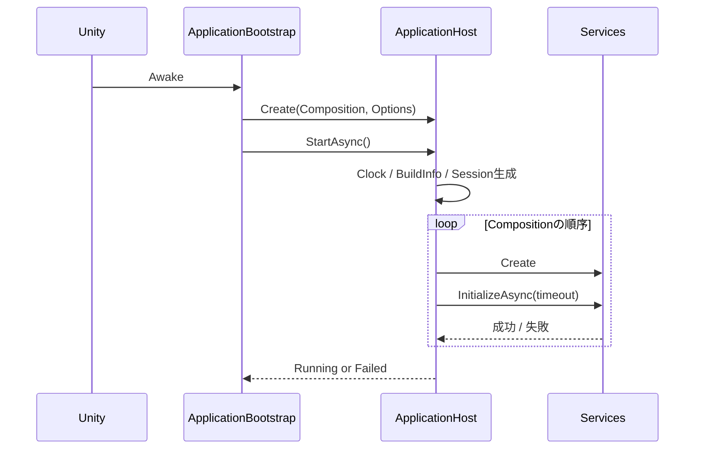
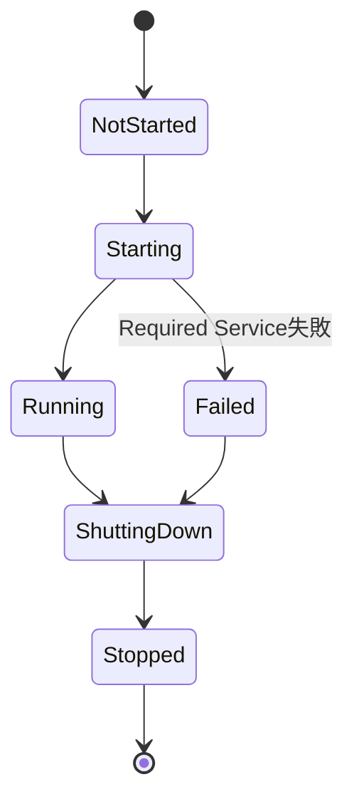

# Application基盤 詳細設計

## 1. 目的

本書は、すべてのModuleが前提とするApplication基盤の詳細設計を定義する。

対象は以下とする。

- Application Lifecycle（起動・終了）
- Composition Root（Serviceの生成・接続・破棄）
- Persistent Scene
- 共通基本要素（Clock、Main Thread Dispatch、Session、Build Information）
- Data Rootの最小解決

ログ（方式設計5章）、性能計測（5.13、15.2〜15.4）、UI基盤（14章）は本基盤の上に別の詳細設計として構築する。

関連する方式設計：

- 2.4 モジュール分割方針
- 2.5 モジュール間連携方式
- 5.6 Session単位の識別
- 5.28 起動・終了ログ
- 5.29 Version情報
- 6.7〜6.10 データ保存領域、Data Root
- 7.10 / 11.2 Scene構成方式
- 9.11 / 15.7 リアルタイム処理とMain Threadの分離
- 15.10〜15.13 安定性、障害分離、Graceful Degradation

---

## 2. 責務

| 責務 | 担当 |
|---|---|
| Applicationの起動・終了順序の制御 | Application |
| 各Moduleが提供するServiceの生成と接続 | Application（Composition Root） |
| 起動失敗時の縮退・致命的エラーの判定 | Application |
| 時刻、Main Thread Dispatch等の基本Contract | Core |
| Session ID、前回異常終了の検出 | Application |
| Version情報の提供 | Application |
| Data Rootの解決と作成 | ProjectData |

本基盤は、各Moduleの機能そのものを実装しない。

ApplicationはServiceの生成順序と寿命だけを管理し、各Serviceの内部処理には関与しない。

---

## 3. Module境界

```text
VirtualVessel.Application   Composition Root。全Moduleを参照してよい
        ↓
VirtualVessel.ProjectData   Data Root解決（本書では最小範囲のみ）
        ↓
VirtualVessel.Core          Moduleに依存しない基本Contract
```

Assembly、Namespace、参照方向は`docs/ja/development/unity-project-structure.md`に従う。

Feature ModuleはApplicationを参照しない。Feature Moduleが必要とする依存は、Applicationが生成時にConstructor引数として渡す。

DiagnosticsはProjectDataより下位のAssemblyであるため、`IDataRoot`を参照しない。ログ出力先DirectoryはApplicationがData Rootから取得し、Logging Service生成時にPathとして渡す。

Static Service Locatorや、全Serviceを保持して任意に取得できるGlobal Contextは設けない。Persistent Scene上のComponentが依存を必要とする場合も、Compositionが明示的に初期化Methodを呼んで渡す。

---

## 4. 主要ClassとInterface

### 4.1 Core

| 名称 | 種別 | 概要 |
|---|---|---|
| `IApplicationService` | Interface | Applicationが寿命を管理するServiceのContract |
| `IMonotonicClock` | Interface | 単調増加する高分解能時刻 |
| `ISystemClock` | Interface | 壁時計（UTC） |
| `IMainThreadDispatcher` | Interface | 任意のThreadからMain Threadへ処理を渡す |
| `StopwatchMonotonicClock` / `UtcSystemClock` | Class | Clockの実装 |
| `MainThreadDispatcher` | Class | Queueによる`IMainThreadDispatcher`の実装。Main Threadの所有者が毎Frame`Drain`を呼ぶ |

Clockおよび`MainThreadDispatcher`はUnityEngineに依存しない純粋な.NETコードであり、特定Moduleにも属さないためCoreへ配置する。これにより、EditModeでの高速なテストおよび他Moduleのテストでの再利用が可能となる。

### 4.2 Application

| 名称 | 種別 | 概要 |
|---|---|---|
| `ApplicationBootstrap` | MonoBehaviour | Persistent Sceneに1つだけ配置する入口。Unity Lifecycleと`ApplicationRuntime`を接続し、毎Frame`MainThreadDispatcher.Drain`を呼ぶ |
| `ApplicationRuntime` | Internal Class | 起動・終了の一連の手順（Data Root解決、Session、Composition、Host）を実行する。UnityEngineに依存しない部分をEditModeでテストするために`ApplicationBootstrap`から分離する |
| `ApplicationHost` | Internal Class | Serviceの起動・終了順序と状態を管理する |
| `ApplicationComposition` | Internal Class | どのServiceをどの順序で、どの依存関係で生成するかを明示的に記述する |
| `ApplicationServiceDescriptor` | Internal Class | Service名、重要度、依存Service、初期化Timeout、生成処理 |
| `ApplicationStartupOptions` | Public Class | Data Root Override、終了Timeout等の開発者向け起動設定 |
| `BufferedApplicationLog` | Internal Class | Logging Service起動前後の基盤ログをMemoryへ保持し、Unity Consoleへも出力する |
| `ApplicationState` | Enum | Application全体の状態 |
| `SessionInfo` | Public Class | Session ID、開始時刻、前回異常終了の有無 |
| `SessionMarker` | Internal Class | Session Markerの読み書き |
| `BuildInfo` | Public Class | Application Version、Unity Version、Build識別子 |
| `PersistentScenePlayModeStarter` | Editor | Editor上で常にPersistent SceneからPlay Modeを開始する |

### 4.3 ProjectData

| 名称 | 種別 | 概要 |
|---|---|---|
| `IDataRoot` | Interface | 解決済みData RootのPathと標準Sub Directoryを提供する |
| `DataRootResolver` | Internal Class | `bootstrap.json`等からData Rootを決定し、作成・書き込み可否を確認する |

---

## 5. Public API

### 5.1 IApplicationService

```csharp
public interface IApplicationService : IDisposable
{
    string Name { get; }

    Task InitializeAsync(CancellationToken cancellationToken);

    Task ShutdownAsync(CancellationToken cancellationToken);
}
```

- `InitializeAsync`はApplication起動時に1回だけ呼ばれる。
- `ShutdownAsync`は起動に成功したServiceに対してのみ、起動と逆順で呼ばれる。
- `Dispose`は`ShutdownAsync`の成否にかかわらず最後に呼ばれる。
- 両MethodはMain Thread上で開始される。
- Editor上でPlay Modeを終了する場合、HostはMain Thread上で`ShutdownAsync`の完了を同期的に待つ（7.2参照）。そのため、`ShutdownAsync`は終了処理の開始後にMain Threadへ戻る処理をawaitしてはならない。Main Threadでの後始末を先に同期的に行い、残りの待機には`ConfigureAwait(false)`を使用する。

### 5.2 Clock

```csharp
public interface IMonotonicClock
{
    long GetTimestamp();

    long Frequency { get; }

    TimeSpan GetElapsed(long startTimestamp, long endTimestamp);
}

public interface ISystemClock
{
    DateTimeOffset UtcNow { get; }
}
```

- `IMonotonicClock`は処理時間計測、性能計測、A/V同期等の時間差計算に使用する。
- `ISystemClock`はログのTimestamp等、人が読む時刻に使用する。
- 時間差の計算に`ISystemClock`を使用しない。

### 5.3 IMainThreadDispatcher

```csharp
public interface IMainThreadDispatcher
{
    bool IsMainThread { get; }

    void Post(Action action);
}
```

- `Post`は任意のThreadから呼び出し可能とし、呼び出し側をBlockしない。
- 渡された処理は次のUnity Frame内でMain Threadから順に実行される。
- Audio Thread等の高頻度処理から毎回`Post`しない。状態変化時のみ利用する。

### 5.4 IDataRoot

```csharp
public interface IDataRoot
{
    string RootPath { get; }

    string GetDirectory(DataRootDirectory directory);
}
```

`DataRootDirectory`は方式設計6.10の標準Directory（Projects、Profiles、Avatars、Logs、Cache等）を表すEnumとする。

---

## 6. Data Model

### 6.1 ApplicationState

```text
NotStarted
Starting
Running
ShuttingDown
Stopped
Failed
```

一部のOptional Serviceが失敗した場合も`Running`とし、Serviceごとの状態は別途保持する（8.3参照）。

### 6.2 Service重要度

| 重要度 | 失敗時の扱い |
|---|---|
| Required | Applicationを`Failed`とし、以降のServiceを起動しない |
| Optional | 当該Serviceを利用不可とし、起動を継続する（Graceful Degradation） |

Requiredとするのは、それなしでは診断も復旧もできないServiceに限定する。

初期段階でRequiredとするServiceは、Data Root解決およびLoggingとする。

### 6.3 bootstrap.json

方式設計6.8の`%LOCALAPPDATA%\VirtualVesselStudio\bootstrap.json`の形式を以下とする。

```json
{
  "schemaVersion": 1,
  "dataRoot": "D:\\VirtualVesselStudioData"
}
```

- `dataRoot`は省略可能とする。
- 未知のPropertyは保持し、破棄しない（CLAUDE.md 25）。

### 6.4 Session Marker

```text
<Data Root>/Logs/session.lock
```

```json
{
  "sessionId": "<id>",
  "startedAtUtc": "<ISO 8601>",
  "applicationVersion": "<version>"
}
```

---

## 7. State / Lifecycle

### 7.1 起動



1. Clock、Build Informationを生成する。
2. Session IDを生成する。
3. Data Rootを解決する。
4. 前回Session Markerの有無を確認し、残っていれば前回が異常終了したと判定する。
5. 新しいSession Markerを書き込む。
6. Compositionに記述された順序でServiceを生成し、`InitializeAsync`を呼ぶ。
7. すべてのRequired Serviceが成功した場合に`Running`とする。

### 7.2 終了

1. Unityの`Application.wantsToQuit`を受けて、初回は`false`を返し終了処理を開始する。
2. 起動に成功したServiceの`ShutdownAsync`を起動と逆順で呼ぶ。
3. 全Serviceを`Dispose`する。
4. Session Markerを削除する（正常終了の記録）。
5. 状態を`Stopped`とし、改めて`Application.Quit()`を呼ぶ。

終了処理全体にTimeoutを設け、超過した場合は残りの処理を中断して終了する。Timeoutが発生したServiceは記録する。

Editor上でPlay Modeを終了した場合、Unityは`Application.wantsToQuit`を発生させず、非同期処理の完了も待たない。そのため`OnApplicationQuit`で同じ手順を同期的に実行する。このとき各Serviceの`ShutdownAsync`はMain Thread上で同期的に待機され、終了Timeoutの範囲で打ち切られる。

起動処理の途中で終了した場合、初期化中のServiceは`ShutdownAsync`を呼ばれずに`Dispose`される。

### 7.3 状態遷移



`Failed`状態でも終了処理は通常どおり行い、起動に成功していたServiceを停止する。

---

## 8. 主要Sequence

### 8.1 Required Serviceの失敗

1. 例外またはTimeoutを検出する。
2. 失敗したService名、例外、経過時間を記録する。
3. 以降のServiceを生成しない。
4. 起動済みServiceを逆順に停止する。
5. `Failed`状態とし、利用者へ起動できない旨を通知する。

利用者向けの通知画面はUI基盤の詳細設計で定義する。それまではUnity Consoleおよび利用可能であればログへ記録する。

### 8.2 Optional Serviceの失敗

1. 失敗を記録する。
2. 当該Serviceを利用不可として登録する。
3. 当該Serviceに依存するServiceは生成しない（Compositionで依存関係を明示する）。
4. 起動を継続する。

### 8.3 Service状態の公開

`ApplicationHost`は各Serviceについて以下を保持し、Diagnosticsから参照可能とする。

- Service名
- 重要度
- 状態（NotCreated / Initializing / Running / Failed / Stopped）
- 起動所要時間
- 失敗理由

---

## 9. Thread / async

- `ApplicationHost`の起動・終了処理はMain Thread上で実行する。
- `InitializeAsync` / `ShutdownAsync`内で重い処理を行う場合は、各Serviceの責任でWorker Threadへ移す。
- Applicationは全Serviceに共通の`CancellationToken`を渡し、終了開始時にCancelする。
- `async void`は使用しない。Unityから呼び出す入口は`ApplicationBootstrap`に限定し、例外を必ず捕捉する。
- `UnityMainThreadDispatcher`は内部Queueへ追加するのみで、呼び出しThreadをBlockしない。毎FrameのDrain処理は件数上限を設け、1Frameへの負荷集中を避ける。

---

## 10. 設定

起動時の挙動は`ApplicationStartupOptions`で指定する。

| 項目 | 既定値 | 用途 |
|---|---|---|
| Data Root Override | なし | テスト・開発時に一時Directoryを使用する |
| Service Initialize Timeout | Serviceごとに指定（既定10秒） | 起動の無期限待機防止 |
| Shutdown Timeout | 10秒 | 終了の無期限待機防止 |

Data Root Overrideは以下から指定可能とする。通常利用者向けUIには表示しない。

1. Command Line引数`--data-root <path>`
2. 環境変数`VIRTUAL_VESSEL_DATA_ROOT`

両方が指定された場合はCommand Line引数を優先する。環境変数は、PlayMode TestやCIが開発者の実際のData Rootを使用しないために利用する。

---

## 11. 保存

| 対象 | 保存先 |
|---|---|
| `bootstrap.json` | `%LOCALAPPDATA%\VirtualVesselStudio\` |
| Session Marker | `<Data Root>/Logs/session.lock` |

### Data Root解決順序

1. `ApplicationStartupOptions`のData Root Override
2. `bootstrap.json`の`dataRoot`
3. 既定値`%LOCALAPPDATA%\VirtualVesselStudio\Data`

解決後、方式設計6.10の標準Directoryのうち、基盤が使用するもの（Logs、Cache）を作成し、書き込み可能か確認する。

Data Rootの変更・移行機能（方式設計6.26）は本書の対象外とする。

---

## 12. エラー処理・復旧

| 事象 | 扱い |
|---|---|
| `bootstrap.json`が壊れている | 既定Data Rootを使用し、ファイルは上書きせず保持する。警告を記録する |
| 指定Data Rootへ書き込めない | Required失敗とし`Failed`。利用者へData Rootの確認を促す |
| Session Markerを書き込めない | 起動は継続し、警告を記録する |
| Optional Service失敗 | 8.2のとおり縮退して継続 |
| 終了処理のTimeout | 記録して終了を継続 |

---

## 13. ログ・診断

本基盤は以下を記録する。具体的な出力方式はLogging詳細設計で定義する。

- 起動時：Application Version、Unity Version、OS、Data Root、Session ID、前回異常終了の有無（方式設計5.28）
- 各Serviceの起動結果と所要時間
- 終了時：正常終了、終了所要時間、Timeoutしたもの

Logging Serviceの起動前に発生した記録は、Memory上に保持し、Logging起動後に出力する。

---

## 14. テスト方針

| 種別 | 対象 |
|---|---|
| EditMode | 起動順序、逆順の終了、Required / Optional失敗時の挙動、Timeout、Dispose保証（Fake Serviceを使用） |
| EditMode | Data Root解決順序、壊れた`bootstrap.json`、書き込み不可（一時Directoryを使用） |
| EditMode | Session Markerによる前回異常終了の判定 |
| EditMode | Main Thread Dispatcherの順序保証と件数上限 |
| PlayMode | Persistent Sceneを読み込み、`Running`へ到達し、正常に終了できること |

`ApplicationHost`はUnityEngineに依存しない形で実装し、EditModeで高速にテストできるようにする。

---

## 15. 性能

- 起動処理全体の所要時間とService別の所要時間を記録し、起動時間の悪化を検出可能とする。
- `IMonotonicClock.GetTimestamp`はAllocationを発生させない。
- `IMainThreadDispatcher.Post`はLockによる長時間Blockを発生させない。

---

## 16. Directory / Namespace

```text
Assets/VirtualVessel/
├─ Core/
│  ├─ Runtime/                      VirtualVessel.Core（noEngineReferences）
│  │  ├─ Lifecycle/IApplicationService.cs
│  │  ├─ Time/IMonotonicClock.cs, ISystemClock.cs, StopwatchMonotonicClock.cs, UtcSystemClock.cs
│  │  └─ Threading/IMainThreadDispatcher.cs, MainThreadDispatcher.cs
│  └─ Tests/EditMode/
│
├─ Application/
│  ├─ Runtime/                      VirtualVessel.Application
│  │  ├─ ApplicationBootstrap.cs
│  │  ├─ Hosting/ApplicationHost.cs, ApplicationServiceDescriptor.cs, ...
│  │  ├─ Startup/ApplicationRuntime.cs, ApplicationComposition.cs, ApplicationStartupOptions.cs
│  │  ├─ Logging/ApplicationLog.cs
│  │  ├─ Session/SessionInfo.cs, SessionMarker.cs
│  │  └─ Build/BuildInfo.cs
│  ├─ Editor/                       VirtualVessel.Application.Editor
│  │  └─ PersistentScenePlayModeStarter.cs
│  └─ Tests/EditMode/, Tests/PlayMode/
│
└─ ProjectData/
   ├─ Runtime/                      VirtualVessel.ProjectData
   │  └─ DataRoot/IDataRoot.cs, DataRootResolver.cs, BootstrapSettings.cs, ...
   └─ Tests/EditMode/

Assets/Scenes/
└─ Persistent.unity                 Build Index 0
```

URP Templateから残っている`SampleScene`は、`Persistent.unity`作成時にBuild Settingsから外し削除する。

Editor上でPersistent Scene以外のSceneからPlay Modeを開始した場合も、`PersistentScenePlayModeStarter`が`EditorSceneManager.playModeStartScene`を設定し、Persistent Sceneから開始する。

PlayMode TestもPlay Modeへ入るため、Test実行中およびBatch Modeではこの設定を解除する。テストが実際のApplicationを開発者のData Rootで起動することを防ぐためである。

---

## 17. 未決事項

| 項目 | 対応予定 |
|---|---|
| 起動失敗時の利用者向け画面 | UI基盤の詳細設計 |
| Build識別子（Git Commit等）の埋め込み | CI導入時 |
| 複数Instance同時起動の防止（同一Data Rootの競合） | 必要性を確認後に別途設計 |
| Data Root変更・移行 | Project / Data詳細設計 |
| 初回セットアップでのData Root選択（既定値を表示し、変更可能とする。容量についても説明する） | UI基盤およびProject / Data詳細設計（方式設計14.32） |
| Setup画面からData Rootをエクスプローラーで開く機能 | UI基盤およびProject / Data詳細設計 |

既定のData Rootは`%LOCALAPPDATA%`配下（隠しフォルダ）であり、利用者が場所を見つけにくい。そのため、既定値は変更せず、上記2機能によって利用者が保存場所を意識・確認できるようにする。

「ドキュメント」フォルダはOneDrive等と同期されている場合があり、大容量のDatasetやSQLiteの同期による問題が生じ得るため、既定値としない。
