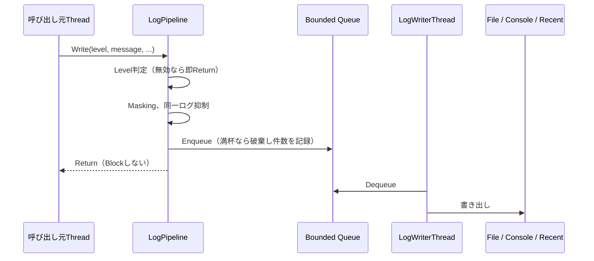

# Logging 詳細設計

## 1. 目的

本書は、Diagnostics ModuleのうちLogging機能の詳細設計を定義する。

対象は以下とする。

- 全Moduleが使用する共通Logging API
- 構造化ログ（Module、Category、Context、Properties）
- ログのファイル出力、ローテーション、保持
- 呼び出し元を停止させない非同期書き出し
- 秘密情報のMasking、同一ログの抑制
- Unity自身のログおよび未処理例外の取り込み
- 最近のログのMemory保持（Log Viewer、Diagnostics Snapshotの前提）
- Application基盤の起動時ログの引き継ぎ

性能計測（方式設計5.13、15.2〜15.4）、Log Viewer UI（5.19）、Diagnostics Export（5.21）は本書の対象外とし、本書で定義するAPIの上に別途構築する。

関連する方式設計：

- 5.1〜5.5 基本方針、通知とログの分離、Log Level、Structured Logging、Module別ログ
- 5.6〜5.7 Session、Correlation
- 5.8 Log出力先
- 5.23 Logへの秘密情報出力禁止
- 5.25〜5.27 Log Rotation、高頻度ログの制御、同一エラーの抑制
- 5.28〜5.29 起動・終了ログ、Version情報
- 5.35 診断機能のRuntime影響抑制
- 15.7 Main Thread負荷抑制

---

## 2. 責務

| 責務 | 担当 |
|---|---|
| ログAPIの提供、Level判定 | Diagnostics（Logging） |
| Context（Session ID、RunId等）の付与 | Diagnostics（Logging） |
| ファイル出力、ローテーション、保持 | Diagnostics（Logging） |
| 秘密情報のMasking（安全網） | Diagnostics（Logging） |
| Unityログ、未処理例外の取り込み | Diagnostics（Logging） |
| どの事象をどのLevelで記録するか | 各Module |
| 利用者向け通知 | 各ModuleおよびUI（本書の対象外） |

LoggingはUser Notificationを生成しない。利用者向け通知とDeveloper Logの分離（方式設計5.2）は、各Moduleが両者を別々に発行することで実現する。

---

## 3. Module境界

```text
VirtualVessel.Application   Logging Serviceを生成し、各Moduleへ ILogProvider を渡す
        ↓
各Feature Module            ILogProvider / ILog のみを使用する
        ↓
VirtualVessel.Diagnostics   Logging実装
        ↓
VirtualVessel.Core
```

- 各ModuleはLogging実装Classを参照せず、`ILogProvider`と`ILog`のみを使用する。
- DiagnosticsはData Rootを参照しない。ログ出力DirectoryはApplicationがPathとして渡す（Application基盤 詳細設計 3章）。
- Static Logger（どこからでも呼べるGlobal Logger）は設けない。`ILogProvider`はComposition RootからConstructor引数で渡す。

### 採用理由

Static Loggerは便利だが、テスト時の差し替えが難しく、Domain Reload無効時に状態が残る原因となる。Application基盤と同じく、依存は明示的に渡す。

---

## 4. 主要ClassとInterface

| 名称 | 種別 | 概要 |
|---|---|---|
| `LogLevel` | Enum | Trace / Debug / Information / Warning / Error / Critical |
| `ILogProvider` | Interface | Module・Categoryを指定して`ILog`を取得する |
| `ILog` | Interface | ログ出力API |
| `LogProperty` | Struct | 構造化ログのKey / Value |
| `LoggingService` | Internal Class | `IApplicationService`。Logging全体の起動・Flush・終了 |
| `LogPipeline` | Internal Class | Level判定 → Masking → 同一ログ抑制 → Queue投入 |
| `LogWriterThread` | Internal Class | 専用ThreadでQueueからSinkへ書き出す |
| `ILogSink` | Internal Interface | 出力先 |
| `JsonLinesFileSink` | Internal Class | JSON Lines形式のファイル出力、ローテーション |
| `UnityConsoleSink` | Internal Class | Unity Consoleへの出力 |
| `RecentLogBuffer` | Internal Class | 最近のログを保持するRing Buffer |
| `SecretMasker` | Internal Class | 秘密情報らしき文字列のMasking |
| `RepeatSuppressor` | Internal Class | 短時間に繰り返される同一ログの集約 |
| `UnityLogCapture` | Internal Class | Unityログ、未処理例外の取り込み |
| `LogFileRetention` | Internal Class | 古いログファイルの削除 |

`ILogger`という名称はUnityEngineの`ILogger`と衝突するため使用しない。

---

## 5. Public API

### 5.1 ILogProvider

```csharp
public interface ILogProvider
{
    ILog GetLog(string module, string category = null);
}
```

- `module`は方式設計5.5のModule名（例：`Avatar`、`Voice`、`VoiceLab`）とする。
- `category`はModule内の処理分類（例：`RvcTraining`）とする。

### 5.2 ILog

```csharp
public interface ILog
{
    bool IsEnabled(LogLevel level);

    void Write(LogLevel level, string message, Exception exception = null);

    void Write(LogLevel level, string message, IReadOnlyList<LogProperty> properties, Exception exception = null);

    ILog WithContext(string key, string value);
}
```

LevelごとのExtension Method（`Information`、`Warning`、`Error`等）を提供する。

- `IsEnabled`はAllocationを発生させない。高頻度に呼ばれる可能性がある箇所では、メッセージ生成前に`IsEnabled`を確認する。
- `WithContext`は元の`ILog`を変更せず、Contextを追加した新しい`ILog`を返す。Training Runの`RunId`等、一連の処理に共通する識別子（方式設計5.7）の付与に使用する。

### 5.3 LogProperty

```csharp
public readonly struct LogProperty
{
    public LogProperty(string key, object value);

    public string Key { get; }

    public object Value { get; }
}
```

### 5.4 使用例

```csharp
ILog log = logProvider.GetLog("VoiceLab", "RvcTraining").WithContext("RunId", runId);

log.Information("Training started.", new[]
{
    new LogProperty("DatasetId", datasetId),
    new LogProperty("Epochs", epochs),
});
```

---

## 6. Data Model

### 6.1 LogEntry

| 項目 | 内容 |
|---|---|
| Timestamp | UTCの壁時計時刻（`ISystemClock`） |
| ElapsedMs | Session開始からの経過時間（`IMonotonicClock`）。壁時計の変更に影響されない時系列解析に使用する |
| Level | Log Level |
| Module / Category | 出力元 |
| Message | メッセージ |
| Properties | 構造化Properties |
| Context | `WithContext`で付与されたKey / Value |
| Exception | 例外の型、メッセージ、Stack Trace |
| ThreadId | 出力元Thread |
| RepeatCount | 同一ログ抑制で集約された回数 |

Session IDはファイル単位で記録し、各行には含めない（7.3参照）。

### 6.2 ログファイル形式

1行1JSONのJSON Lines形式とする。

```json
{"ts":"2026-10-10T12:00:00.123Z","ms":1532,"lvl":"Warning","mod":"Tracking","cat":"MediaPipe","msg":"Tracking confidence dropped.","ctx":{"RunId":"..."},"props":{"Confidence":0.31},"thr":12}
```

各ファイルの先頭行には、Session情報を持つHeaderを出力する。

```json
{"header":true,"sessionId":"...","applicationVersion":"...","unityVersion":"...","os":"...","schemaVersion":1}
```

### 採用理由

自由文のログでは、後からModule、Run、Level等で検索・集計しにくい（方式設計5.4）。

JSON Linesは1行単位で追記・解析でき、書き込み途中で終了しても直前までの行は有効である。

JSON生成は外部Libraryを使用せず、Diagnostics内の最小限のWriterで行う。

---

## 7. State / Lifecycle

### 7.1 起動

Logging ServiceはApplication CompositionのRequired Serviceとして最初に起動する。

1. 古いログファイルを保持設定に従って削除する（10章）。
2. 新しいログファイルを作成し、Headerを書き込む。
3. 書き出しThreadを開始する。
4. Unityログおよび未処理例外の取り込みを開始する。
5. Application基盤がMemoryに保持していた起動時ログ（`BufferedApplicationLog`）を、元のTimestampのまま出力する。
6. 以降、Application基盤のログはLogging Serviceへ転送する。

### 7.2 終了

1. Unityログ取り込みを停止する。
2. Queueに残ったログを書き出す（Flush）。Timeoutを超えた場合は残りを破棄し、破棄件数をUnity Consoleへ出力する。
3. ファイルを閉じる。

Logging Serviceは最初に起動するため、終了は最後になる。他Serviceの終了処理中のログも記録される。

### 7.3 ファイル

- ファイルはSessionごとに新規作成する。
- 1ファイルの上限サイズ（既定10 MB）を超えた場合は、同一Sessionの次のファイルへ切り替える。
- ファイル名：`<開始日時>_<SessionId先頭8文字>_<連番>.jsonl`

```text
<Data Root>/Logs/
├─ session.lock
├─ Application/                       ビルドしたApplicationの実行
│  ├─ 20261010-120000_3f2a9c1b_001.jsonl
│  └─ 20261010-120000_3f2a9c1b_002.jsonl
└─ Editor/                            Unity Editor上のPlay Mode
   └─ 20261010-130512_9b04d2e7_001.jsonl
```

Unity Editor上のPlay Modeによる実行は`Logs/Editor/`、ビルドしたApplicationの実行は`Logs/Application/`へ出力し、保持設定（10章）もDirectoryごとに適用する。

開発中は頻繁にPlay Modeを開始するため、同一Directoryへ出力すると、実際の利用時のログが開発中のログによって保持上限から押し出される。また、両者が混在すると調査時に目的のログを探しにくい。

どちらのDirectoryへ出力するかはApplicationが判定し、Logging ServiceにはDirectoryのPathのみを渡す。LoggingはEditorかどうかを認識しない。

External Process、Voice Lab Training Run固有のログ（方式設計5.8、5.9）は、それぞれの詳細設計で`Logs/`配下の別Directoryとして定義する。

---

## 8. 主要Sequence

### 8.1 ログ出力



### 8.2 同一ログの抑制（方式設計5.27）

- Module、Category、Level、Messageが同一のログが、一定時間（既定5秒）内に繰り返された場合、2回目以降は記録せず件数のみ数える。
- 時間経過後、または異なるログが来た時点で`RepeatCount`付きの集約ログを1件出力する。
- Exceptionの種類が異なる場合は別のログとして扱う。

### 8.3 Unityログの取り込み

- `UnityEngine.Application.logMessageReceivedThreaded`を購読し、Module名`Unity`として記録する。
- `UnityConsoleSink`自身がUnity Consoleへ出力したログを再度取り込まないよう、Thread単位の書き込み中Flagで除外する。
- Unityの`LogType.Exception`および`LogType.Assert`はErrorとして記録する。

### 8.4 未処理例外

- `AppDomain.CurrentDomain.UnhandledException`をCriticalとして記録する。
- `TaskScheduler.UnobservedTaskException`をErrorとして記録する。

---

## 9. Thread / async

- `ILog.Write`は任意のThreadから呼び出し可能とし、呼び出し元をBlockしない。
- QueueはLock-freeのQueueに上限件数（既定10,000件）を設ける。上限を超えた場合は新しいログを破棄し、破棄件数を数える。破棄が発生したことは、次に書き出し可能になった時点でWarningとして記録する。
- 書き出しは専用のBackground Threadで行う。File I/OをMain Thread、Audio Thread、Tracking Thread上で行わない（方式設計15.7）。
- Audio Callback等のリアルタイム処理では、毎回のログ出力を禁止し、状態変化時のみ出力する（方式設計5.26、CLAUDE.md 20章）。
- `ILog.Write`の呼び出しは`LogEntry`のAllocationを伴う。そのため高頻度処理から呼ばないことを前提とし、Level無効時の`IsEnabled`と`Write`はAllocationを発生させない。

---

## 10. 設定

| 項目 | 既定値 | 説明 |
|---|---|---|
| 最小Level | Information | Developer Modeで変更可能（方式設計5.3）。実行中に変更可能 |
| Module別最小Level | なし | 特定ModuleのみTrace等にする |
| Unity Console出力の最小Level | Information | |
| 1ファイルの上限サイズ | 10 MB | |
| 保持ファイル数 | 50 | |
| 保持期間 | 14日 | |
| 保持合計サイズ | 500 MB | |
| Queue上限 | 10,000件 | |
| 同一ログ抑制時間 | 5秒 | |
| 終了時Flush Timeout | 3秒 | |

保持設定はいずれかの上限を超えた時点で古いファイルから削除する。

初期段階ではCode上の既定値とし、設定UIはUI基盤以降で追加する。

---

## 11. 保存

- ログは`<Data Root>/Logs/Application/`へ保存する（方式設計5.8、6.25）。Unity Editor上のPlay Modeによる実行は`<Data Root>/Logs/Editor/`へ保存する（7.3）。
- 保持設定（10章）に従い、起動時に古いファイルを削除する（方式設計5.25）。
- 現在のSessionのファイルは削除対象としない。

---

## 12. 秘密情報とPrivacy

- 秘密情報をログへ出力しないことは、各Moduleの責務である（方式設計5.23、CLAUDE.md 20章）。
- `SecretMasker`は安全網として、メッセージ、Properties、Exceptionメッセージに含まれる以下のパターンを`********`へ置換する。
  - `Authorization: Bearer <token>`
  - `stream key`、`streamkey`、`password`、`token`、`api key`、`apikey`、`secret`等のKeyに続く値（`=`または`:`区切り）
  - RTMP / RTMPS URLのStream Key部分
  - Key名が上記に該当するProperty
- Maskingは完全な防止策ではない。Masking対象を増やすことで秘密情報の出力を許容する運用とはしない。
- File Pathの個人情報Masking（方式設計5.24）は、外部共有用のDiagnostics Exportで行い、本書の対象外とする。
- マイク音声、カメラ映像等のMediaはログへ出力しない。

---

## 13. エラー処理・復旧

| 事象 | 扱い |
|---|---|
| 起動時にログファイルを作成できない | Logging Serviceの初期化失敗（Required）。Applicationは`Failed`となる |
| 書き込み中のI/Oエラー | File Sinkを停止し、Unity ConsoleへErrorを出力する。Console SinkおよびRecent Bufferは継続する |
| Sink内の例外 | 当該Sinkのみ停止し、他のSinkは継続する |
| Queue満杯 | 新しいログを破棄し、破棄件数を後で記録する |
| 古いファイルの削除失敗 | Warningを記録し、起動は継続する |

Loggingの失敗によってApplication全体を停止させない（起動時のファイル作成失敗を除く）。

---

## 14. ログ・診断

Logging Service自身の状態をDiagnosticsから参照可能とする。

- 現在のログファイルPath
- 書き出し件数
- 破棄件数（Queue満杯）
- 抑制件数（同一ログ）
- Sinkの状態（Active / Failed）

`RecentLogBuffer`は直近のログ（既定2,000件）を保持し、Log Viewer（方式設計5.19）およびDiagnostics Snapshot（5.20）から参照する。

---

## 15. テスト方針

| 種別 | 対象 |
|---|---|
| EditMode | Level判定、Module別Level、`IsEnabled` |
| EditMode | `WithContext`の不変性とContextの付与 |
| EditMode | JSON Linesの出力内容、文字列Escape |
| EditMode | `SecretMasker`の各パターン |
| EditMode | 同一ログ抑制（Fake Clockを使用） |
| EditMode | Queue上限と破棄件数 |
| EditMode | ファイルサイズによる切り替え、保持設定による削除 |
| EditMode | 終了時Flush、Sink失敗時の継続 |
| EditMode | Unityログ取り込み時の再取り込み防止 |
| EditMode | 起動時ログの引き継ぎ（元のTimestampを維持） |
| PlayMode | Application起動から終了までのログがファイルへ出力されること |
| Performance | Level無効時の`Write`がAllocationを発生させないこと、`Write`の呼び出しコスト（`tests/performance/`の基盤は性能計測の詳細設計で定義する） |

---

## 16. 性能

- `Write`の呼び出し元のコストは、Level判定、Masking、Queue投入のみとし、File I/Oを含めない。
- Level無効時はAllocationを発生させない。
- 書き出しThreadはQueueが空の間は待機し、CPUを消費しない。
- 書き出しはBufferingし、1件ごとにFlushしない。ただしError以上は即時Flushし、異常終了直前のログを失いにくくする。

---

## 17. Directory / Namespace

```text
Assets/VirtualVessel/Diagnostics/
├─ Runtime/                         VirtualVessel.Diagnostics
│  └─ Logging/                      VirtualVessel.Diagnostics.Logging
│     ├─ LogLevel.cs, ILog.cs, ILogProvider.cs, LogProperty.cs, LogExtensions.cs
│     ├─ LoggingService.cs, LoggingSettings.cs
│     ├─ Pipeline/LogEntry.cs, LogPipeline.cs, RepeatSuppressor.cs, SecretMasker.cs
│     ├─ Writing/LogWriterThread.cs, ILogSink.cs, JsonLinesFileSink.cs, LogFileRetention.cs, JsonWriter.cs
│     ├─ Unity/UnityConsoleSink.cs, UnityLogCapture.cs
│     └─ Recent/RecentLogBuffer.cs
└─ Tests/EditMode/, Tests/PlayMode/
```

ApplicationはComposition内で`LoggingService`を生成し、`ILogProvider`を後続のServiceへ渡す。Application基盤の`IApplicationLog`は、Logging起動後に`ILog`へ転送するAdapterへ切り替える。

---

## 18. 未決事項

| 項目 | 対応予定 |
|---|---|
| Log Viewer UI | UI基盤以降 |
| Diagnostics ExportおよびPathのMasking | Diagnostics Exportの詳細設計 |
| ログ設定のUI | UI基盤以降 |
| External Process / Training Runのログ配置 | 各Moduleの詳細設計 |
| 高頻度箇所向けのAllocationなしログAPI | 必要性が確認された時点で検討する |
