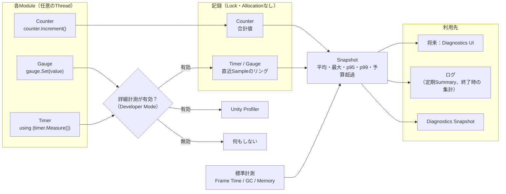
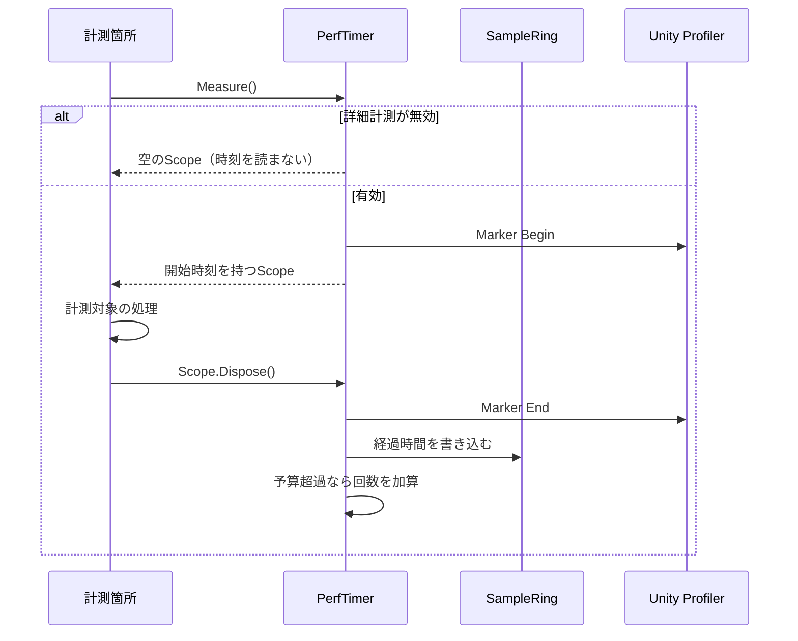

# 性能計測 詳細設計

## 1. 目的

本書は、Diagnostics Moduleのうち性能計測（Performance Metrics）機能の詳細設計を定義する。

対象は以下とする。

- 全Moduleが使用する計測API（Timer、Counter、Gauge）
- 統計値（現在値、平均、最大、95 / 99パーセンタイル、予算超過回数）
- Developer Modeに応じた計測の有効・無効
- Unity Profilerとの連携
- Frame Time、GC、Memory等の標準計測
- 性能テストの基盤

計測結果を表示するDiagnostics UI（方式設計5.16、5.18）は本書の対象外とし、本書で定義するSnapshot APIの上に別途構築する。

関連する方式設計：

- 5.13 性能診断
- 5.14 音声Pipeline診断
- 5.35 診断機能のRuntime影響抑制
- 15.2〜15.5 性能、リアルタイム性、音声・映像リアルタイム性能
- 15.21 性能回帰テスト
- 15.34 可観測性

### 全体像



Counterは常に記録し、TimerとGaugeは詳細計測が有効な場合のみ記録する（7章）。

---

## 2. 責務

| 責務 | 担当 |
|---|---|
| 計測APIの提供、記録、統計計算 | Diagnostics（Performance） |
| 詳細計測の有効・無効の切り替え | Diagnostics（Performance）。切り替えの操作はUI（Developer Mode） |
| Frame Time、GC、Memory等の標準計測 | Diagnostics（Performance） |
| 何をどの名前で計測するか、予算をいくつにするか | 各Module |
| 機能として必要な時間計測（A/V同期のOffset補正等） | 各Module（本書の対象外） |

本機能は観測専用である。A/V同期の補正量やBufferサイズの調整等、Applicationの動作そのものに必要な計測は各Moduleが独自に行い、詳細計測の有効・無効に影響されてはならない。

---

## 3. Module境界

- 各Moduleは`IPerformanceMetrics`から取得したTimer、Counter、Gaugeのみを使用する。
- `IPerformanceMetrics`はLoggingの`ILogProvider`と同じく、Composition RootからConstructor引数で渡す。Static Accessは設けない。
- 各ClassはConstructorでTimer等を取得してFieldに保持し、計測箇所ではそのFieldを使用する。

### 採用理由

Loggingと同じ受け渡し方とすることで、各Classの依存が明確になり、テスト時に計測を差し替えやすくなる。計測箇所での記述は1行で済み、使い勝手を損なわない。

---

## 4. 主要ClassとInterface

| 名称 | 種別 | 概要 |
|---|---|---|
| `IPerformanceMetrics` | Interface | Timer、Counter、Gaugeの取得、詳細計測の状態 |
| `PerfTimer` | Class | 処理時間の計測 |
| `PerfTimer.Scope` | Struct | `using`で区間を計測する |
| `PerfCounter` | Class | 回数の計測 |
| `PerfGauge` | Class | その時点の値の記録 |
| `MetricSnapshot` | Class | 1つの計測の統計値 |
| `PerformanceSnapshot` | Class | 全計測の統計値 |
| `PerformanceMetricsService` | Public Class | `IApplicationService`。計測の登録、有効・無効、標準計測、定期Summary |
| `SampleRing` | Internal Class | 直近Sampleの固定長リング |
| `BuiltinMetricsCollector` | Internal Class | Unity `ProfilerRecorder`によるFrame Time、GC、Memoryの計測 |

---

## 5. Public API

### 5.1 IPerformanceMetrics

```csharp
public interface IPerformanceMetrics
{
    bool IsDetailedEnabled { get; }

    PerfTimer Timer(string module, string name, TimeSpan? budget = null);

    PerfCounter Counter(string module, string name);

    PerfGauge Gauge(string module, string name, string unit = null);

    PerformanceSnapshot GetSnapshot();
}
```

- 同じModuleと名前で取得した場合は、同じInstanceを返す。複数のClassが同じ計測を共有できる。
- `budget`を指定したTimerは、予算を超えた回数を数える（方式設計15.4の処理Deadline等）。

### 5.2 PerfTimer

```csharp
public sealed class PerfTimer
{
    public Scope Measure();

    public long Begin();

    public void End(long beginToken);

    public void Record(TimeSpan duration);

    public readonly struct Scope : IDisposable
    {
        public void Dispose();
    }
}
```

| 使い方 | 用途 |
|---|---|
| `using (timer.Measure()) { ... }` | 1つのMethod内の区間。基本はこれを使用する |
| `long t = timer.Begin(); ... timer.End(t);` | 開始と終了が別のMethodやCallbackにまたがる区間 |
| `timer.Record(duration)` | 外部から得た時間（GPU処理時間等）の記録 |

### 5.3 PerfCounter

```csharp
public sealed class PerfCounter
{
    public void Increment();

    public void Add(long value);

    public long Value { get; }
}
```

### 5.4 PerfGauge

```csharp
public sealed class PerfGauge
{
    public void Set(double value);
}
```

### 5.5 使用例

```csharp
internal sealed class RvcVoiceConverter
{
    private readonly PerfTimer _inferenceTime;
    private readonly PerfCounter _deadlineMisses;

    public RvcVoiceConverter(IPerformanceMetrics metrics, ...)
    {
        _inferenceTime = metrics.Timer("Voice", "RvcInference", budget: TimeSpan.FromMilliseconds(200));
        _deadlineMisses = metrics.Counter("Voice", "DeadlineMiss");
    }

    public void Process(...)
    {
        using (_inferenceTime.Measure())
        {
            RunInference();
        }
    }
}
```

---

## 6. Data Model

### 6.1 計測の種類

| 種類 | 記録内容 | 詳細計測無効時 |
|---|---|---|
| Timer | 処理時間（ミリ秒） | 記録しない |
| Counter | 累計回数 | **記録する** |
| Gauge | その時点の値と単位 | 記録しない |

### 6.2 MetricSnapshot

| 項目 | Timer | Counter | Gauge |
|---|---|---|---|
| Module / Name / Unit | ○ | ○ | ○ |
| Last（現在値） | ○ | ○（累計） | ○ |
| Average | ○ | | ○ |
| Max | ○ | | ○ |
| P95 / P99 | ○ | | ○ |
| SampleCount（統計に使ったSample数） | ○ | | ○ |
| TotalCount（累計記録回数） | ○ | | ○ |
| Budget / OverBudgetCount | ○（指定時） | | |

- Average、Max、P95、P99は、直近のSample（既定512件）から計算する。長時間の累計平均では一時的な悪化が埋もれるためである（方式設計15.3）。
- OverBudgetCountは累計とする。

---

## 7. State / Lifecycle

### 7.1 詳細計測の有効・無効

- 詳細計測は、Developer Mode（方式設計14.22）に連動して実行中に切り替える。再起動は不要とする。
- Developer Modeの設定UIが実装されるまでの既定値は、Unity Editor上の実行では有効、ビルドしたApplicationでは無効とする。
- 無効から有効へ切り替えた時点から記録を開始する。有効から無効へ切り替えても、それまでの統計は保持する。

### 7.2 Counterを常に記録する理由

- Counterの記録は数値を1つ増やすだけであり、無視できるコストである。
- 音切れ、Frame Drop、再接続等の回数は、不具合報告を受けてからDeveloper Modeを有効にしても遡って得られない。常に数えておくことで、不具合報告時のDiagnostics Snapshotに含められる。

### 7.3 Service

- `PerformanceMetricsService`はLoggingの次に起動するOptional Serviceとする。
- Timer等の取得と記録は`InitializeAsync`より前から可能とする。`InitializeAsync`では標準計測と定期Summaryを開始する。
- 終了時に、0でないCounterの値をInformationとしてログへ出力する。詳細計測が有効な場合は、Timerの統計も出力する。

---

## 8. 主要Sequence

### 8.1 Timerの計測



### 8.2 定期Summary

詳細計測が有効な間、一定間隔（既定30秒）でTimerとGaugeの統計をDebug Levelでログへ出力する。Diagnostics UIがない段階でも、ログから性能の推移を確認できるようにするためである。

---

## 9. Thread / async

- Timer、Counter、Gaugeは任意のThreadから呼び出し可能とする。
- 記録はLockを使用しない。Counterは`Interlocked`で加算する。SampleRingの書き込み位置は`Interlocked`で進める。
- 複数Threadが同時に同じSampleRingへ書き込んだ場合、統計がわずかに不正確になる可能性がある。診断用途であり、Lockによる遅延を避けることを優先する。
- 統計計算は`GetSnapshot`の呼び出し側（Diagnostics UIやログ出力）で行い、記録側では行わない。
- Unity ProfilerのMarkerは同一Thread上で開始・終了する必要がある。`Measure()`のScopeでのみMarkerを使用し、`Begin()` / `End()`ではMarkerを使用しない。

---

## 10. 設定

| 項目 | 既定値 | 説明 |
|---|---|---|
| 詳細計測 | Editor：有効 / Player：無効 | Developer Modeで実行中に切り替え |
| 統計に使うSample数 | 512 | Timer / Gaugeごと |
| 定期Summaryの間隔 | 30秒 | 0で無効 |
| 標準計測 | 有効 | 詳細計測が有効な場合のみ動作 |

値は`PerformanceSettings`に集約し、Logging（`LoggingSettings`）と同じく生成時にApplicationから渡す。

---

## 11. 保存

- 計測値はMemory上にのみ保持し、ファイルへ直接保存しない。
- 永続的に残す必要がある情報は、ログ（定期Summary、終了時の集計）およびDiagnostics Exportを経由する。

---

## 12. 標準計測

詳細計測が有効な場合、以下をUnityの`ProfilerRecorder`から取得する。

| Module | Name | 内容 |
|---|---|---|
| Application | MainThreadFrameTime | Main Threadの1Frameの処理時間 |
| Application | GcAllocatedInFrame | 1FrameあたりのGC Allocation量 |
| Application | GcReservedMemory | GC管理Memoryの予約量 |
| Application | SystemUsedMemory | Process全体のMemory使用量 |

`ProfilerRecorder`は自身でSampleを保持するため、毎Frameの処理を追加せず、Snapshot取得時に値を読む。

GPU使用率、GPU Memory等、環境依存の計測は、対応するModuleの詳細設計で追加する。

---

## 13. エラー処理

- 計測の失敗によってApplicationや計測対象の処理を停止させない。
- 標準計測の対象がPlatformで利用できない場合は、その計測のみを除外し、ログへ記録する。
- 同じModuleと名前で種類の異なる計測（TimerとCounter等）を取得しようとした場合は、開発時の誤りとして例外を投げる。

---

## 14. ログ・診断

- 定期Summary（8.2）および終了時の集計（7.3）をログへ出力する。
- `GetSnapshot`は、将来のDiagnostics UI（方式設計5.16）およびDiagnostics Snapshot（5.20）から使用する。

---

## 15. テスト方針

### 15.1 Unit Test（EditMode）

| 対象 |
|---|
| 平均、最大、パーセンタイルの計算 |
| 予算超過回数 |
| 詳細計測無効時にTimer / Gaugeが記録しないこと、Counterは記録すること |
| 実行中の有効・無効の切り替え |
| 同じ名前で同じInstanceが返ること、種類の不一致で例外となること |
| 計測箇所（`Measure`、`Increment`、`Set`）がAllocationを発生させないこと |

### 15.2 性能テスト

性能テストにはUnity公式の**Performance Testing Extension**（`com.unity.test-framework.performance`）を使用する。

- 開発・テスト時のみ使用するPackageであり、Test Assemblyからのみ参照する。ビルドしたApplicationには含まれない。
- Unity 6.6ではUnity Editorに同梱されたCore Package（`6.6.0`）である。Versionは`ProjectVersion.txt`のUnity Editor Versionで固定される。
- LicenseはUnity Companion License（同梱のPerfolizerはMIT）である。

本書の範囲では、以下を計測する。

- `Measure()`の呼び出しコスト（詳細計測の有効時・無効時）
- `ILog.Write`の呼び出しコスト（Logging）

### 15.3 性能テストの配置

UnityのTestはUnity Project内のAssemblyにのみ配置できる。そのため、性能テストの配置を以下とする。

| 配置 | 内容 |
|---|---|
| `Assets/VirtualVessel/<Module>/Tests/Performance/` | Unity上で実行する性能テスト本体（`VirtualVessel.<Module>.Tests.Performance`） |
| `tests/performance/`（Repository直下） | Hardware CIでの実行Script、比較用の基準値、結果の履歴 |

---

## 16. 性能

- 詳細計測が無効な場合、`Measure()`は有効判定のみを行い、時刻の取得、Profiler Marker、記録を行わない。
- Counterの`Increment()`は`Interlocked.Increment`のみとする。
- 計測箇所ではAllocationを発生させない。`Scope`はStructとし、`using`でBoxingが発生しない形で使用する。

---

## 17. Directory / Namespace

```text
Assets/VirtualVessel/Diagnostics/
├─ Runtime/
│  └─ Performance/                  VirtualVessel.Diagnostics.Performance
│     ├─ IPerformanceMetrics.cs, Metric.cs, PerfTimer.cs, PerfCounter.cs, PerfGauge.cs
│     ├─ MetricSnapshot.cs, PerformanceSnapshot.cs
│     ├─ PerformanceMetricsService.cs, PerformanceSettings.cs
│     ├─ Recording/SampleRing.cs, MetricRegistry.cs, DetailedSwitch.cs
│     └─ Builtin/BuiltinMetricsCollector.cs
└─ Tests/
   ├─ EditMode/
   └─ Performance/                  VirtualVessel.Diagnostics.Tests.Performance
```

---

## 18. 未決事項

| 項目 | 対応予定 |
|---|---|
| Developer Mode UIとの接続 | UI基盤 |
| 計測値を表示するDiagnostics UI、Overlay | UI基盤以降 |
| GPU使用率、GPU Memory等の環境依存計測 | 各Moduleの詳細設計 |
| Hardware CIでの性能回帰の判定基準 | Hardware CI導入時 |
