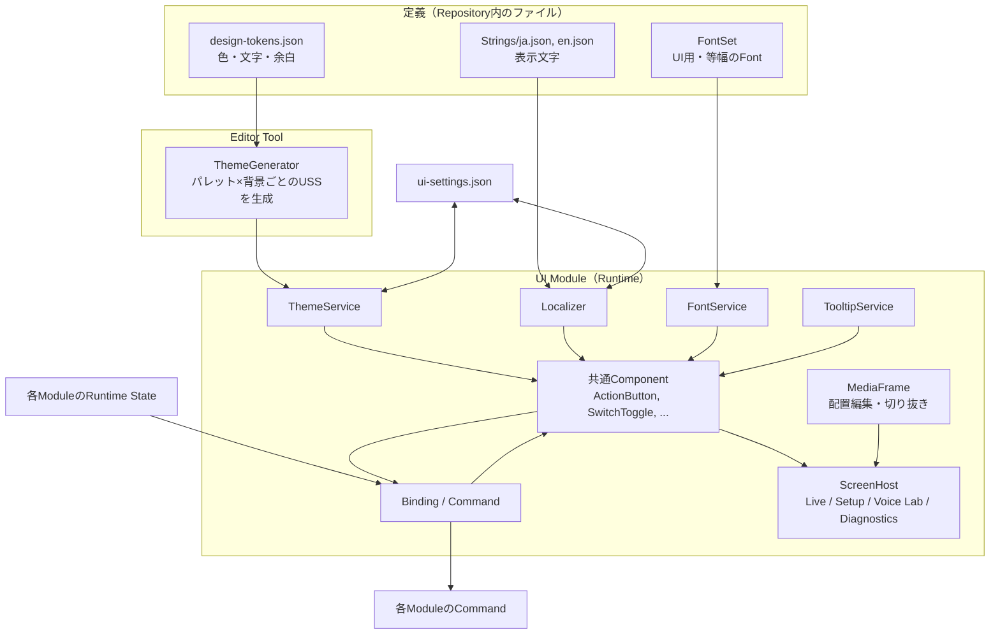
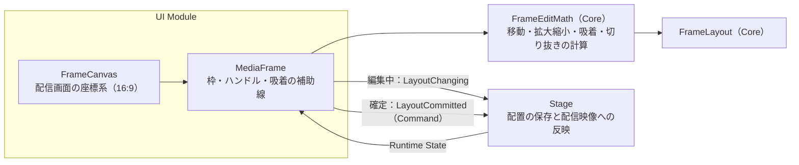

# UI基盤 詳細設計

## 1. 目的

本書は、UI Moduleの基盤部分の詳細設計を定める。

対象は次のとおりである。

- 使いやすい共通Component（UI Toolkitの上に作るProject独自の部品）
- Theme（パレット、ダーク／ライト、UIの拡大縮小、動きを減らす設定）
- Fontの一括管理と切り替え
- 多言語対応（Project独自の軽量な仕組み）
- Tooltip
- Runtime Stateの表示とCommandによる操作
- 配信画面上の配置編集と切り抜きを行うPanel（`MediaFrame`）
- 画面の切り替え、Developer Mode
- UI固有設定の保存
- スクリーンショットによる表示確認

見た目の値と部品の仕様は次の文書で定める。本書はそれをUnityでどう実現するかを定める。

- `docs/ja/ui/design-system.md`
- `docs/ja/ui/components.md`
- `docs/ja/ui/ui-guidelines.md`

関連する方式設計：14章（UI・操作方式）、6.8（基本設定の保存）、16.14（UI Locale拡張）、16.15（UI Theme拡張）

### 全体像



---

## 2. 責務

| 責務 | 担当 |
|---|---|
| 共通Component、Tooltip、Binding、Command実行の仕組み | UI |
| Theme、Font、多言語の切り替え | UI |
| 画面の切り替え、Developer Modeの切り替え | UI |
| UI固有設定（`ui-settings.json`）の内容 | UI |
| 設定ファイルの読み書き（Schema Version、Atomic Write、不明な項目の保持） | ProjectData |
| 配置編集の計算（移動、拡大縮小、吸着、切り抜き） | Core（`FrameEditMath`、Unityに依存しない） |
| 配置データ（`FrameLayout`）の保存と、配信映像への反映 | Stage（実装時）。UIはCommandで変更を依頼する |
| 各機能の状態と操作 | 各Module。UIは状態を表示し、Commandを呼ぶだけ |

---

## 3. Module境界

- UIは各ModuleのRuntime Stateを`IReadOnlyObservable<T>`で受け取り、表示する。UI上の状態をRuntimeの状態として扱わない（方式設計14.29）。
- UIからの操作は`IUiCommand`を通して各Moduleへ渡す。UIが各Moduleの内部Classを直接操作しない。
- `MediaFrame`は映像を描画しない。配信映像の合成はStageとVideoの責務であり（CLAUDE.md 6章）、`MediaFrame`は配置データの編集だけを行う。
- 依存方向は`Application → UI → 各Module → Diagnostics → Core`とする。UIの部品は各Moduleに依存しない。画面（Screens）は各Moduleの公開Interfaceにのみ依存する。

---

## 4. Unity標準UIの使いにくさと対策

UI Toolkitをそのまま使うと、次の問題がある。共通Componentと周辺の仕組みで解決する。

| 問題 | 対策 |
|---|---|
| Eventの登録と解除を手で書く必要があり、解除漏れでMemory Leakや破棄後の呼び出しが起きる | Bindingは画面から外れたときに自動で解除する（7.3） |
| 実行時にTooltipを出す仕組みがない（`tooltip`属性はEditor専用） | `TooltipService`（7.6） |
| 表示文字の多言語化を毎回コードで書く必要がある | UXMLで`text-key`を指定するだけで切り替わる（7.4） |
| 見た目の種類をClass名の文字列で指定し、誤字に気づけない | 種類はEnumのProperty（例：`variant="Primary"`）で指定する |
| プログラムから値を設定しても変更Eventが発生し、利用者の操作と区別しにくい | 表示の更新は`SetValueWithoutNotify`で行い、利用者の操作だけをCommandへ渡す（7.3） |
| 押せない理由を示す標準の方法がない | Commandが押せない理由を持ち、ボタンを無効にしてTooltipへ表示する（7.5） |
| ラベルの位置や余白が部品ごとに異なる | 共通Componentが`components.md`どおりの構造と余白を持つ |

---

## 5. 主要Classとインターフェース

| 名前 | 種別 | 概要 |
|---|---|---|
| `UiRoot` | MonoBehaviour | Persistent Sceneに置くUIの入口。`UIDocument`とUI用Assetを保持し、Serviceを接続する |
| `UiAssets` | ScriptableObject | PanelSettings、生成済みTheme、FontSet、文字列表、画面のUXMLへの参照 |
| `ThemeService` | Class | パレット、背景、拡大縮小、動きを減らす設定を適用する |
| `FontService` | Class | FontSetを切り替える |
| `FontSet` | ScriptableObject | UI用と等幅のFont Asset、Fallback |
| `Localizer` / `ILocalizer` | Class / Interface | 表示文字の取得と言語の切り替え |
| `TooltipService` | Class | Tooltipの表示 |
| `IUiCommand` | Interface | UIから実行する操作 |
| `IReadOnlyObservable<T>` / `ObservableValue<T>` | Interface / Class（Core） | 変化を通知する値 |
| 共通Component | VisualElement | `components.md`の各部品（6章） |
| `MediaFrame` / `FrameCanvas` | VisualElement | 配置編集と切り抜き（9章） |
| `FrameLayout` / `FrameEditMath` | Struct / Static Class（Core） | 配置データと編集の計算 |
| `ScreenHost` | VisualElement | 画面の切り替え |
| `DeveloperModeService` | Class | Developer Modeの切り替えと関連機能への反映 |
| `UiSettings` | Class | UI固有設定の内容 |
| `ConfigFileStore` | Class（ProjectData） | 設定ファイルの読み書き |
| `ThemeGenerator` | Editor | Tokenから各ThemeのUSSを生成する |
| `UiScreenshotCapture` | Editor | 画面をPNGへ書き出す |

---

## 6. 共通Component

### 6.1 一覧

`components.md`の各部品を、`VisualElement`を継承したClassとして実装する。UXMLでもC#でも使える。

| 部品 | Class | UXML例 |
|---|---|---|
| Button | `ActionButton` | `<vv:ActionButton variant="Primary" text-key="live.start" tooltip-key="tip.live.start" />` |
| Icon Button | `IconButton` | `<vv:IconButton icon="Mic" toggle="true" tooltip-key="tip.mute" shortcut="Ctrl+M" />` |
| Toggle | `SwitchToggle` | `<vv:SwitchToggle text-key="voice.convert" />` |
| Slider | `ValueSlider` | `<vv:ValueSlider low-value="-60" high-value="0" unit="dB" />` |
| Level Meter | `LevelMeter` | `<vv:LevelMeter segments="24" />` |
| Dropdown | `SelectField` | `<vv:SelectField label-key="audio.mic.device" />` |
| Text Field | `TextInput` | `<vv:TextInput label-key="stream.title" />` |
| Numeric Field | `NumberInput` | `<vv:NumberInput label-key="audio.sampleRate" unit="Hz" />` |
| Tab | `TabBar` | `<vv:TabBar />` |
| Setting Row | `SettingRow` | `<vv:SettingRow name-key="audio.noise" description-key="audio.noise.desc">…</vv:SettingRow>` |
| Card | `Card` | `<vv:Card title-key="voice.title">…</vv:Card>` |
| Dialog | `ConfirmDialog` | C#から`ConfirmAsync`で表示（6.4） |
| Status Indicator | `StatusChip` | `<vv:StatusChip status="Success" text-key="trk.good" />` |
| Notification | `Notice` | C#から`NotificationService`で表示 |
| Progress Bar | `ProgressMeter` | `<vv:ProgressMeter label-key="lab.training" />` |
| Navigation Item | `NavItem` | `<vv:NavItem icon="Live" text-key="nav.live" />` |
| Preview | `StreamPreview` | `<vv:StreamPreview />` |
| Panel | `MediaFrame` | 9章 |

UXMLの名前空間は`VirtualVessel.UI.Controls`、接頭辞は`vv`とする。Classは`[UxmlElement]`と`[UxmlAttribute]`（Unity 6）で定義する。

### 6.2 共通の属性

すべての共通Componentは次の属性を持つ。

| 属性 | 内容 |
|---|---|
| `text-key`等の`*-key` | 表示文字の文字列Key。言語が切り替わると自動で更新する |
| `tooltip-key` | Tooltipの文字列Key |
| `shortcut` | Tooltipに添えるショートカット表記 |

表示文字を直接指定する属性（`text`等）は、利用者向けの画面では使わない。

### 6.3 C#から組み立てる場合

UXMLを使わずに組み立てる場合のため、短く書けるFactoryを用意する。

```csharp
var start = Ui.Button("live.start", ButtonVariant.Primary)
    .WithTooltip("tip.live.start", "Ctrl+Enter")
    .Bind(_startStreaming);
```

### 6.4 Dialogと確認

取り消しにくい操作は、確認を経てから実行する。

```csharp
bool confirmed = await _dialogs.ConfirmAsync(
    titleKey: "live.end.confirm.title",
    bodyKey: "live.end.confirm.body",
    confirmKey: "live.end",
    style: ConfirmStyle.Danger);
```

`DangerCommand`として登録したCommandは、`ActionButton`から実行するときに自動で確認Dialogを出す。

### 6.5 Style

- 各部品のUSSは`Assets/VirtualVessel/UI/Styles/Components/`に置き、色・余白・角丸はすべてTokenの`var()`で参照する。
- 状態はUSSの擬似Class（`:hover`、`:focus`、`:disabled`、`:checked`）と、部品が付けるClass（`vv-status-success`等）で表す。

---

## 7. 仕組み

### 7.1 Theme

**Tokenの定義元**

`Assets/VirtualVessel/UI/Theme/design-tokens.json`に、`design-system.md`の値（パレット、ニュートラルのS/L、状態色、文字、余白、角丸）を記述する。これがUnity側の唯一の定義元である。

**USSの生成**

USSは`color-mix()`やHSLの計算に対応しない。そこで、Editor Toolの`ThemeGenerator`が、Tokenから次のUSSを生成する。

```text
Assets/VirtualVessel/UI/Theme/Generated/
├─ tokens-common.uss              余白、角丸、文字サイズ（Themeに依存しない値）
├─ theme-lavender-dark.uss         色のCustom Property（計算済みの値）
├─ theme-lavender-light.uss
├─ …                               6パレット × 2背景 = 12ファイル
```

- 生成したUSSはRepositoryに含める。Build時に生成を必要としない。
- 生成結果がTokenと一致していることをEditMode Testで確認する（7.1の最後）。

**Themeの適用**

`ThemeService`は、Rootの`VisualElement`に付けたTheme用USSを差し替える。各部品は`var(--color-primary)`等を参照しているため、差し替えるだけで全体の色が変わる。

| 設定 | 適用方法 |
|---|---|
| パレット、背景 | Theme用USSの差し替え |
| UIの拡大縮小 | `PanelSettings.scale`（100%、110%、125%、150%） |
| 動きを減らす | Rootに`vv-reduced-motion` Classを付け、各部品のUSSで遷移と点滅を止める |

**Tokenに関するTest**

- 生成済みUSSが`design-tokens.json`から再生成した結果と一致すること。
- すべてのパレットと背景で、`design-system.md` 9.2のコントラスト比を満たすこと（本文4.5:1以上、`On Accent`とPrimaryの組み合わせ4.5:1以上、`Accent Line`と背景3:1以上）。
- `docs/assets/ui/styleboard.html`に書かれたパレットの値が`design-tokens.json`と一致すること。

### 7.2 Font

**FontSet**

Fontは`FontSet`（ScriptableObject）で一組として扱う。

| 項目 | 内容 |
|---|---|
| UI Font | 本文、見出し、ボタン用のFont Asset（Regular、Medium、Bold） |
| Mono Font | 数値、ログ用のFont Asset |
| Fallback | 文字が足りない場合に使うFont Assetの順序 |

既定のFontSetは`NotoSans`（Noto Sans JP + Noto Sans Mono）とする。

**一括変更の仕組み**

- すべての文字は、Typography Class（`vv-text-heading`、`vv-text-body`、`vv-text-mono`等）を通してFontを決める。
- Typography Classは`-unity-font-definition: var(--font-ui)`のように、FontをCustom Propertyで参照する。
- FontSetごとに、`--font-ui`と`--font-mono`を定義した小さなUSS（`fonts-<FontSet>.uss`）を`ThemeGenerator`が生成する。
- `FontService`はこのUSSを差し替える。差し替えるだけで、Application全体のFontが一度に変わる。

これにより、次の2つの一括変更ができる。

| 場面 | 方法 |
|---|---|
| 開発時に既定のFontを変える | 既定のFontSetの中身を差し替える。各画面のUXMLやUSSは変更しない |
| 利用者が設定で変える | `ui-settings.json`の`fontSet`を変える。実行中に切り替わる |

**言語とFont**

- 文字列表（7.4）の各言語は、推奨するFontSetを指定できる。将来、日本語Fontで表示できない言語を追加する場合に使う。
- FallbackはPanelSettingsのText Settingsに設定し、文字が欠けないようにする（方式設計14.9）。
- 日本語は文字数が多いため、Font AssetはDynamic（必要な文字を実行時にAtlasへ追加）とする。

**Fontファイル**

- Font本体は`Assets/ThirdParty/NotoSansJP/`、`Assets/ThirdParty/NotoSansMono/`に改変せずに置き、OFLのLicense文を同梱する。
- `.gitattributes`に`*.ttf`、`*.otf`をBinaryとして追加する。

### 7.3 BindingとRuntime State

**Observable**

各Moduleは、UIへ見せる状態を`IReadOnlyObservable<T>`（Core）として公開する。

```csharp
public interface IReadOnlyObservable<T>
{
    T Value { get; }

    IDisposable Subscribe(Action<T> onChanged);
}
```

**Bindingの書き方**

```csharp
_voiceToggle.BindValue(_voice.ConversionEnabled, onUserChange: _setConversion);
_latencyChip.BindText(_voice.InferenceLatency, latency => $"{latency.TotalMilliseconds:F0} ms");
```

- `BindValue`は、Runtimeの値を`SetValueWithoutNotify`で表示し、利用者の操作だけを`onUserChange`のCommandへ渡す。Commandが失敗した場合や拒否された場合、表示はRuntimeの値に戻る。
- Bindingは、部品がPanelに追加されたときに購読し、外れたときに解除する（`AttachToPanelEvent`、`DetachFromPanelEvent`）。手で解除する必要はない。
- 状態がMain Thread以外で変化した場合は、`IMainThreadDispatcher`でMain Threadへ移してから表示を更新する。
- 音量Meterのように頻繁に変わる値は、変化のたびではなく一定間隔（既定30Hz）でまとめて表示を更新する。

### 7.4 多言語対応

方式設計14.6の目的（表示文字をコードから分離し、言語を追加しやすくする）を、Project独自の軽量な仕組みで実現する。Unity Localization packageは使わない（12.1）。

**文字列表**

```text
Assets/VirtualVessel/UI/Strings/
├─ ja.json
└─ en.json
```

```json
{
  "schemaVersion": 1,
  "locale": "ja",
  "displayName": "日本語",
  "fontSet": "NotoSans",
  "strings": {
    "live.start": "配信を開始",
    "live.elapsed": "配信中 {time}",
    "tip.live.start": "配信サイトへの送信を始めます"
  }
}
```

- Keyは`<領域>.<項目>`の形で、小文字とドットを使う。Tooltipは`tip.`で始める。
- 値の中の`{name}`は名前付きの差し込みとする。
- 英語の単数・複数が必要な場合は、`.one`と`.other`のKeyを用意し、`Localizer.Plural(key, count)`で選ぶ。

**取得と切り替え**

```csharp
string text = _localizer.Get("live.elapsed", ("time", elapsed));
```

- `ILocalizer.LocaleChanged`で言語の変更を通知する。`*-key`属性を持つ部品は自動で表示を更新する。
- Keyが見つからない場合は、英語の文字列を使う。英語にもない場合は`[live.start]`のようにKeyを表示し、開発者向けに1回だけWarningを記録する。

**言語の追加**

`<locale>.json`を追加するだけで、言語の選択肢に現れる。コードの変更は不要とする（方式設計16.14）。

**Test**

- すべての言語で、Keyの集合が一致すること。
- 同じKeyの差し込み（`{name}`）が、すべての言語で一致すること。
- UXMLの`*-key`属性とC#の文字列Key定数が、文字列表に存在すること。

### 7.5 Command

```csharp
public interface IUiCommand
{
    bool CanExecute { get; }

    /// <summary>押せない理由の文字列Key。押せる場合はnull。</summary>
    string DisabledReasonKey { get; }

    event Action CanExecuteChanged;

    Task ExecuteAsync(CancellationToken cancellationToken);
}
```

- `ActionButton.Bind(command)`で、押せる・押せないの表示、押せない理由のTooltip、実行中の二重押し防止をまとめて行う。
- 実行中は部品を無効にし、時間がかかる場合は読み込み中の表示を出す（方式設計14.30）。
- 例外は利用者向けのNotificationと開発者向けのLogに分けて扱う。Commandが利用者向けの文字列Keyを持つ例外（`UserFacingException`）を投げた場合はその文を表示し、それ以外は一般的な失敗の文を表示する。

### 7.6 Tooltip

- Panelごとに1つのTooltip要素を持ち、すべての部品で共有する。
- `tooltip-key`を持つ部品にPointerが約0.45秒留まったとき、またはキーボードでFocusしたときに表示する。Pointerが離れたとき、押したとき、Scrollしたときに消す。
- 表示位置は部品の上とし、上に余白がなければ下とする。画面の端からはみ出さない。
- 部品が無効な場合は、`DisabledReasonKey`の文を表示する。

### 7.7 画面とDeveloper Mode

- `ScreenHost`は、Live、Setup、Voice Lab、Diagnosticsの各画面を切り替える。画面は初めて開いたときに作り、以後は保持する。
- Diagnosticsのナビゲーション項目は、Developer Modeが有効なときだけ表示する（方式設計14.22）。
- `DeveloperModeService`は、Developer Modeの切り替えを`PerformanceMetricsService.SetDetailedEnabled`等の関連機能へ伝える。
- 最初に作る画面は次の2つとする。
  - Diagnostics：性能計測（`PerformanceSnapshot`）の表。
  - Component Gallery（Developer Modeのみ）：`styleboard.html`と同じ部品をUnity上で並べ、表示確認に使う。

---

## 8. データモデル

### 8.1 UiSettings

`%LOCALAPPDATA%\VirtualVesselStudio\Config\ui-settings.json`（方式設計6.8）

```json
{
  "schemaVersion": 1,
  "language": "ja",
  "palette": "lavender",
  "background": "dark",
  "uiScale": 1.0,
  "reducedMotion": "system",
  "fontSet": "NotoSans",
  "developerMode": false,
  "lastScreen": "live"
}
```

| 項目 | 既定 | 備考 |
|---|---|---|
| `language` | OSの言語が日本語なら`ja`、それ以外は`en` | 文字列表が存在する言語のみ |
| `palette` | `lavender` | |
| `background` | `dark` | |
| `uiScale` | `1.0` | 1.0、1.1、1.25、1.5 |
| `reducedMotion` | `system` | `system`、`on`、`off` |
| `fontSet` | `NotoSans` | |
| `developerMode` | `false` | |
| `lastScreen` | `live` | |

- 読み書きはProjectDataの`ConfigFileStore`が行う（8.3）。
- 知らない値（存在しないパレット名等）は既定値として扱い、ファイルの値は上書きするまで残す。

### 8.2 FrameLayout

配信画面上の1つの映像（ゲーム画面、サブモニター等）の配置を表す。Unityに依存しない値としてCoreに置き、UIとStageの双方が使う。

| 項目 | 型 | 内容 |
|---|---|---|
| `Placement` | `NormalizedRect` | 配信画面上の位置と大きさ。配信画面全体を0〜1とする |
| `Crop` | `NormalizedRect` | 映像のうち表示する範囲。映像全体を0〜1とする。既定は全体 |
| `FlipHorizontal` | `bool` | 左右反転 |
| `Locked` | `bool` | 移動と拡大縮小を禁止する |
| `AllowOutside` | `bool` | 配信画面の外へはみ出すことを許す |
| `Order` | `int` | 重なりの順序。大きいほど手前 |

配信画面の解像度に依存しない値とするため、位置と大きさは比率で持つ。

### 8.3 ConfigFileStore（ProjectData）

- `schemaVersion`を必ず持ち、古いVersionは読み込み時に移行する（CLAUDE.md 25章）。
- 書き込みは一時ファイルへ書いてから置き換える（Atomic Write）。
- 現在のVersionが知らない項目は、読み込んだまま保持して書き戻す。
- 壊れたファイルは`<name>.broken-<日時>.json`へ退避し、既定値で起動する。退避したことはWarningで記録する。
- JSONの読み書きにはJSONのDOMを扱えるLibraryが必要である。候補は`com.unity.nuget.newtonsoft-json`（Unity管理、MIT License）とする。導入時に利用者の承認を得る。

---

## 9. MediaFrame（配置編集と切り抜き）

### 9.1 目的

ゲーム画面やサブモニターの映像を、配信画面のどこに、どの大きさで、映像のどの部分を映すかを、マウスとキーボードで直感的に編集する。

過去の試作（`E:\VirtualVessel\benchmarks\GameCaptureUnityPlugin`の`ImageMover`、`Resize`、`RightClickMenu`）で使いやすさを確認した操作を引き継ぐ。

| 試作の操作 | 引き継ぎ方 |
|---|---|
| 中央付近をドラッグして移動 | 枠の内側をドラッグして移動 |
| 端をドラッグして縦横比を保って拡大縮小、反対側の角を固定 | 角と辺のハンドルで拡大縮小。既定で縦横比を保ち、反対側を固定 |
| 最小幅（200px） | 最小幅は配信画面の幅の5% |
| 画面外へのはみ出しの可否（`CanStickOutScreen`） | `AllowOutside` |
| 左右反転 | `FlipHorizontal` |
| 操作のロック | `Locked` |
| 右クリックで設定Panel | 右クリックMenu（9.4） |
| 重なり順のSlider | 最前面へ、最背面へ（9.4） |

試作はuGUIの`RectTransform`と`Input`で書かれており、毎フレームMouseを読んでいた。本設計では、UI ToolkitのPointer Eventで操作を受け、計算を`FrameEditMath`へ分離する。

### 9.2 構成



- `FrameCanvas`は、配信プレビュー（`StreamPreview`）の上に重ねる透明な層である。配信画面の座標と、画面上の座標を相互に変換する。
- `MediaFrame`は枠、ハンドル、補助線を描く。映像そのものは配信プレビューに映っているため、`MediaFrame`は映像を描かない。
- Setup画面などで単独で使う場合は、`MediaFrame`に`Texture`を渡して映像を表示できる。そのとき、切り抜きはUI Toolkitの`Image.uv`、左右反転は`scale`で表し、映像のCopyは行わない。

### 9.3 操作

**選択**

- クリックで選択する。選択した枠には、角と辺に8つのハンドルと外枠を表示する。
- 何もない場所をクリックすると選択を外す。`Tab`で次の枠を選択する。

**移動**

- 枠の内側をドラッグする。
- 矢印キーで1px、`Shift`+矢印キーで10px動かす（配信画面の解像度での1px）。

**拡大縮小**

- 角のハンドル：縦横比を保ち、反対側の角を固定する。
- 辺のハンドル：その辺だけを動かし、縦横比を保つ（反対側の辺の中央を固定する）。
- `Shift`を押しながら：縦横比を固定しない。
- `Alt`を押しながら：中心を固定して拡大縮小する。

**吸着**

- 配信画面の端と中央線、他の枠の端と中央線に、8px（画面上の距離）以内まで近づくと吸着する。
- 吸着している線を補助線として表示する。
- `Ctrl`を押している間は吸着しない。

**切り抜き（映像の一部を拡大）**

- 選択した枠の上でMouse Wheelを回すと、枠の大きさを変えずに中の映像を拡大・縮小する。Pointerの位置を中心に拡大する。
- 拡大している映像は、中ボタンでドラッグするか、`Space`を押しながらドラッグすると、見る位置を動かせる。
- `Alt`を押しながら辺のハンドルをドラッグすると、その辺を切り取る（OBSと同じ操作）。
- 切り抜きの範囲は映像の外へ出ない。

**操作中の表示**

- ドラッグ中は、位置と大きさを配信画面の解像度で表示する（例：`1280 × 720 · 320, 180`）。
- 切り抜き中は、拡大率を表示する（例：`200%`）。

**元に戻す**

- 1回のドラッグやキー操作を1つの単位として記録し、`Ctrl+Z`で元に戻し、`Ctrl+Y`でやり直す。
- 記録は配置編集の画面を開いている間だけ保持する。

### 9.4 右クリックMenu

| 項目 | 内容 |
|---|---|
| 左右反転 | `FlipHorizontal`を切り替える |
| ロック | `Locked`を切り替える。ロック中は移動、拡大縮小、切り抜きを受け付けない |
| 画面の外へのはみ出しを許可 | `AllowOutside`を切り替える |
| 画面に合わせる | 縦横比を保って、配信画面に収まる最大の大きさにする |
| 画面いっぱいに広げる | 縦横比を保って、配信画面を覆う大きさにする |
| 中央に配置 | 配信画面の中央へ移動する |
| 切り抜きを元に戻す | `Crop`を映像全体に戻す |
| 最前面へ／最背面へ | `Order`を変える |

Menuの各項目にもTooltipとショートカットを表示する。

### 9.5 確定とRuntime Stateの関係

- ドラッグ中は`LayoutChanging`を送り、Stageはそれを配信プレビューへ即座に反映する。これにより、操作と映像の動きがずれない。
- ドラッグを終えたときに`LayoutCommitted`をCommandとして送り、Stageが保存する。
- `MediaFrame`は最終的にStageのRuntime State（確定した`FrameLayout`）を表示する。Stageが変更を拒否した場合は、元の配置に戻る（方式設計14.29）。
- 配置編集の操作は、配信の出力先（Stream Render Target）の構造を変えない（方式設計14.23）。

### 9.6 計算の分離

`FrameEditMath`（Core）は、次の計算をUnityに依存しない純粋な関数として持つ。

- 移動（はみ出しの制限を含む）
- 角と辺による拡大縮小（縦横比の固定、反対側の固定、中心の固定、最小の大きさ）
- 吸着（候補の線と距離の計算）
- 切り抜きの拡大縮小と移動（Pointerの位置を中心とした拡大、範囲の制限）
- 画面に合わせる、画面いっぱいに広げる

これにより、操作の結果をEditMode Testで網羅的に確認できる。

---

## 10. 状態とライフサイクル

1. `ApplicationBootstrap`がApplication Serviceを起動した後、`UiRoot`がUIを構築する。
2. `UiRoot`は`ui-settings.json`を読み、Theme、Font、言語を適用してから最初の画面を表示する。
3. 設定の変更は即座に反映し、0.5秒程度まとめてから`ui-settings.json`へ保存する。
4. 終了時は、未保存の設定を保存してからUIを破棄する。

UIの構築に失敗しても、Application Serviceの動作は止めない。開発者向けのLogへ記録し、最小限のエラー画面を表示する。

---

## 11. Thread / async

- UIの操作はすべてMain Threadで行う。
- 他のThreadからの状態変化は`IMainThreadDispatcher`でMain Threadへ移す。
- Commandの実行は`async`とし、UIを止めない。実行中のCommandは、画面を閉じたときに`CancellationToken`で取り消す。

---

## 12. 判断の記録

### 12.1 多言語対応にUnity Localization packageを使わない

方式設計14.6はUnity Localization packageの使用を定めていた。利用者の承認を得て、Project独自の仕組みへ変更する。

| 観点 | Unity Localization | Project独自 |
|---|---|---|
| 依存 | Addressables、Newtonsoft JSONを必要とする | 追加なし（JSONの読み込みは8.3と共通） |
| Build | Addressablesの設定とBuild手順が増える | 追加なし |
| 初期化 | 非同期 | 同期（起動時に読み込む） |
| 編集 | Editor上の表 | JSONファイルを直接編集（翻訳者も扱いやすい） |
| 機能 | 複数形、Smart String、擬似翻訳等が豊富 | 差し込み、単純な単数・複数のみ |

本Applicationで必要な機能は、文字列の取得、差し込み、実行中の言語切り替えであり、独自の仕組みで十分である。将来、高度な機能が必要になった場合は、`ILocalizer`の実装を差し替えて対応する。

方式設計3.4、14.6、14.42、16.14と、CLAUDE.md 19章を合わせて更新する。

### 12.2 TokenからUSSを生成する

USSは色の計算に対応しないため、パレット×背景の組み合わせごとに計算済みの値を生成する。実行時にC#から全要素の色を設定する方法は、要素数に比例して処理が増え、USSの`:hover`等の擬似Classと組み合わせにくいため採用しない。

---

## 13. エラー処理

| 状況 | 対応 |
|---|---|
| `ui-settings.json`が壊れている | 退避して既定値で起動する（8.3） |
| 文字列Keyが見つからない | 英語、Keyの順で代わりに表示し、1回だけWarningを記録する |
| Font Assetが読み込めない | 既定のFontSetへ戻し、Errorを記録する |
| Commandが失敗した | 利用者向けのNotificationを出し、詳細を開発者向けLogへ記録する |
| 画面の構築に失敗した | その画面の代わりにエラー表示を出し、他の画面は使えるようにする |

---

## 14. Logと診断

- Theme、Font、言語、Developer Modeの変更をInformationで記録する。
- 文字列Keyの不足、Fontの読み込み失敗をWarningまたはErrorで記録する。
- UIの描画や操作の度にLogを出さない（CLAUDE.md 20章）。

---

## 15. Test

| 種類 | 対象 |
|---|---|
| EditMode | Tokenの生成結果の一致、コントラスト比、`styleboard.html`との一致（7.1） |
| EditMode | 文字列表のKeyと差し込みの一致、Keyが見つからない場合の動作（7.4） |
| EditMode | Bindingの自動解除、Main Threadへの移動、`SetValueWithoutNotify`による表示（7.3） |
| EditMode | Commandの押せない理由、二重押しの防止、例外の扱い（7.5） |
| EditMode | `FrameEditMath`の各計算（9.6） |
| EditMode | `ConfigFileStore`の読み書き、移行、不明な項目の保持、壊れたファイルの退避（8.3） |
| PlayMode | `MediaFrame`のPointer操作（移動、拡大縮小、吸着、切り抜き、元に戻す）。Unity 6.6同梱のUI Test Frameworkで操作を再現する |
| PlayMode | Tooltipの表示と位置、Focusでの表示 |
| 表示確認 | `UiScreenshotCapture`で、ダーク／ライト、日本語／英語、拡大率の組み合わせを画像に書き出し、確認する（方式設計14.35） |
| 性能 | Bindingの更新とLevel Meterの更新でAllocationが発生しないこと（Performance Test） |

`UiScreenshotCapture`は、画面をPanelSettingsの`targetTexture`へ描いてPNGに保存する。Batch Modeでも、`-nographics`を付けなければ実行できる。

---

## 16. 性能

- UIは配信の処理（音声、Tracking、映像）より優先度が低い。UIの更新が配信の処理を待たせない。
- 頻繁に変わる値の表示は一定間隔でまとめて更新する（既定30Hz）。
- Bindingと表示の更新では、毎回のAllocationを避ける。
- `MediaFrame`のドラッグ中は、枠の位置と大きさのStyleだけを更新する。映像のCopyは行わない。

---

## 17. Directory / Namespace

```text
Assets/VirtualVessel/
├─ Core/Runtime/
│  ├─ State/IReadOnlyObservable.cs, ObservableValue.cs          VirtualVessel.Core.State
│  └─ Geometry/NormalizedRect.cs, FrameLayout.cs, FrameEditMath.cs  VirtualVessel.Core.Geometry
├─ ProjectData/Runtime/
│  └─ Config/ConfigFileStore.cs                                  VirtualVessel.ProjectData.Config
└─ UI/
   ├─ Runtime/                                                    VirtualVessel.UI
   │  ├─ UiRoot.cs, UiAssets.cs
   │  ├─ Controls/          共通Component                         VirtualVessel.UI.Controls
   │  ├─ Frames/            MediaFrame, FrameCanvas               VirtualVessel.UI.Frames
   │  ├─ Binding/, Commands/, Tooltips/, Dialogs/, Notifications/
   │  ├─ Theme/             ThemeService, FontService, FontSet
   │  ├─ Localization/      Localizer
   │  ├─ Screens/           ScreenHost, 各画面
   │  └─ Settings/          UiSettings, DeveloperModeService
   ├─ Styles/Components/    各部品のUSS
   ├─ Theme/                design-tokens.json, Generated/*.uss
   ├─ Strings/              ja.json, en.json
   ├─ Uxml/                 画面のUXML
   ├─ Editor/               ThemeGenerator, UiScreenshotCapture   VirtualVessel.UI.Editor
   └─ Tests/
      ├─ EditMode/
      ├─ PlayMode/
      └─ Performance/

Assets/ThirdParty/
├─ NotoSansJP/              Font本体とOFL
└─ NotoSansMono/
```

---

## 18. 実装の順序

各段階を1つのBranchとし、それぞれにTestを含める（CLAUDE.md 29.2）。

1. Core：`IReadOnlyObservable<T>`、`NormalizedRect`、`FrameLayout`、`FrameEditMath`
2. ProjectData：`ConfigFileStore`（JSON Libraryの導入について承認を得る）
3. UI：Assembly、Token、`ThemeGenerator`、`ThemeService`、Font、`FontService`
4. UI：`Localizer`と文字列表
5. UI：共通Component、Binding、Command、Tooltip、Dialog、Notification
6. UI：`MediaFrame`と`FrameCanvas`
7. UI：`UiRoot`、`ScreenHost`、Developer Mode、Diagnostics画面、Component Gallery、`UiScreenshotCapture`

---

## 19. 未決事項

| 項目 | 対応予定 |
|---|---|
| JSON Library（`com.unity.nuget.newtonsoft-json`）の導入 | 実装順序2の着手時に承認を得る |
| アイコンの入手元（自作のSVGか、License互換のIcon Setか） | 実装順序5の着手時に決める |
| `FrameLayout`をStageがどう保存し、配信映像へ反映するか | Stageの詳細設計 |
| 回転（`MediaFrame`の回転操作） | 必要になった時点で検討する |
| 各画面の仕様（`docs/<lang>/ui/screens/`） | 各画面の設計時 |
