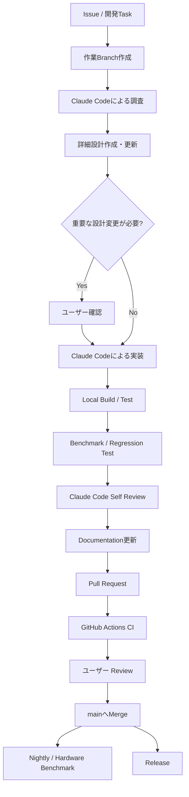
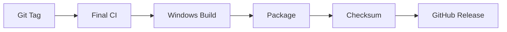

# Virtual Vessel Studio 開発運用方針

## 1. 目的

本書は、Virtual Vessel Studioを今後どのように開発・管理・検証・リリースしていくかを定義する。

方式設計では「システムをどのような構成にするか」を定義した。本書では、その方式設計を前提として、

- Git / GitHubをどのように使うか
- Claude Codeをどこまで利用するか
- 詳細設計を誰が作るか
- 実装・テスト・レビューをどう進めるか
- CI/CDをどう構成するか
- Benchmark済みコードをどう扱うか
- どの時点で人間が判断するか
- 何をもって開発完了とするか

を定義する。

本プロジェクトでは、Claude Codeを単なるコード生成ツールとしてではなく、**Repositoryを理解して詳細設計・実装・テスト・レビュー・文書更新まで行う開発Agent**として利用する。

一方、方式設計、製品としての方向性、UX、主要Architecture Decision、性能基準の受け入れ等はユーザーが最終判断する。

---

# 2. 開発全体像

開発は、原則として以下のCycleで進める。



すべてのTaskで全工程を同じ重さで実施する必要はない。

小規模なBug Fixでは詳細設計書の新規作成やBenchmarkを省略できる。一方、Realtime処理、Native Plugin、Module境界、Public API、保存形式等へ影響する変更では、調査・設計・性能確認を省略しない。

---

# 3. 役割分担

## 3.1 ユーザー

ユーザーは主に以下を担当する。

- Product Goalの決定
- 方式設計
- 主要Architecture Decision
- UXの最終判断
- 新しい外部依存を採用するかの判断
- Benchmark結果の受け入れ
- 実際の使用感・音質・映像品質等の評価
- Pull Requestの最終確認
- Release判断

ユーザーが全ClassやPrivate Methodまで設計する必要はない。

## 3.2 Claude Code

Claude Codeは主に以下を担当する。

- Repository調査
- 方式設計の確認
- 既存コードの分析
- Benchmark / Prototypeの分析
- 詳細設計の作成・更新
- Class / Interface / Data Model設計
- 実装
- Unit Test
- Integration Test
- Build
- Benchmark実行
- Self Review
- Refactoring
- Logging / Diagnostics実装
- Documentation更新
- UI Design / UI実装
- Pull Request説明文の作成

Claude Codeには実装詳細を広く任せる。

ただし、方式設計で確定しているArchitecture DecisionをClaude Codeが独自判断で変更してはならない。

## 3.3 GitHub / CI

GitHubは以下を担当する。

- Source Codeの正本
- Issue / Task管理
- Branch / Pull Request管理
- Review履歴
- CI
- Build Artifact保存
- Release
- Version管理

CIは「Claude Codeが完了と言ったか」ではなく、Repositoryとして変更を受け入れてよいかを機械的に確認する。

---

# 4. Repositoryの基本構成

概念的に以下の構成とする。

```text
virtual-vessel-studio/
├─ CLAUDE.md
├─ README.md
├─ .editorconfig
├─ .gitignore
├─ .gitattributes
│
├─ .github/
│  ├─ workflows/
│  ├─ ISSUE_TEMPLATE/
│  └─ pull_request_template.md
│
├─ docs/
│  ├─ ja/
│  │  ├─ architecture/
│  │  │  └─ system-design.md
│  │  ├─ detailed-design/
│  │  ├─ development/
│  │  │  └─ development-workflow.md
│  │  ├─ decisions/
│  │  └─ ui/
│  └─ en/
│     └─ (jaと同一の構成)
│
├─ unity/
│  └─ VirtualVesselStudio/
├─ native/
├─ services/
├─ tools/
└─ tests/
   └─ performance/
```

`docs/ja/architecture/system-design.md` / `docs/en/architecture/system-design.md`には、完成した方式設計書を配置する。

本書は、`docs/ja/development/development-workflow.md` / `docs/en/development/development-workflow.md`として配置する。

製品の性能計測（夜間・実機CIで実行するBenchmark等）は`tests/performance/`へ配置する。

過去のBenchmark / Prototype実装はRepository外の参照用Snapshotとして扱い、本Repositoryへコピーしない（12章参照）。

---

# 5. CLAUDE.mdの役割

Repository Rootの`CLAUDE.md`は、Claude Codeに毎回説明し直したくない**Project共通の固定ルール**を記載する。

`CLAUDE.md`と本書は、以下のように役割を分ける。

- `CLAUDE.md`: Claude Codeが常に守る必要があるルール。Git操作の手順や制約、Commit / Push / Pull Requestの扱い等、Claude Codeの行動を直接拘束する内容を含む。
- 本書: 人間向けの背景・理由、役割分担、CI / Release構成、運用の段階的な導入計画等。

Rootの`CLAUDE.md`には主に以下を置く。

- 最重要Architecture Rule
- 参照すべき文書
- Task開始時の標準手順
- Benchmarkの扱い
- Git Workflow（Branch、Commit、Push、禁止操作）
- Test / Reviewの最低条件
- ユーザー確認が必要な変更

ただし、`CLAUDE.md`を巨大な詳細設計書にはしない。

詳細なModule設計は`docs/<lang>/detailed-design/`へ分離する。

これにより、Claude Codeが必ず守るべきルールを確実に読み込ませつつ、Module固有の詳細でContextを必要以上に大きくしない。

---

# 6. Git運用

## 6.1 基本方針

`main`を唯一の統合Branchとする。

長期間維持する`develop` Branchは設けない。

作業ごとに短期間のBranchを作成し、Pull Requestを経由して`main`へMergeする。

```text
main
 ↑
Pull Request
 ↑
feature/capture-module
fix/audio-underrun
refactor/avatar-runtime
docs/update-architecture
```

## 6.2 Branch命名

| 種類 | Prefix | 例 |
|---|---|---|
| 新機能 | `feature/` | `feature/capture-module` |
| Bug Fix | `fix/` | `fix/audio-underrun` |
| Refactoring | `refactor/` | `refactor/avatar-runtime` |
| 文書 | `docs/` | `docs/update-workflow` |
| CI / Build | `chore/` | `chore/github-actions` |

## 6.3 mainの扱い

`main`は原則として以下を満たす状態を維持する。

- Build可能
- 必須Testが成功
- 重大な既知Regressionがない
- Version管理対象の設定や文書が整合している

`main`への直接Pushを通常運用では行わない。

Pull Request経由でMergeする。

## 6.4 Pull Request

1 Pull Requestは原則として1つの目的に限定する。

Pull Requestには最低限以下を記載する（`CLAUDE.md` 30章と同一）。

```text
Summary
Related issue
Design
Changes
Commits
Tests
Benchmarks
UI verification
Compatibility / Migration
Documentation
Remaining issues
```

関連する方式設計・詳細設計は`Design`へ記載する。

Templateは`.github/pull_request_template.md`とする。

## 6.5 Merge方式

通常のMerge（Merge Commit）を基本とする。

Branch内のCommitは、`CLAUDE.md` 29章に従って検証済みの論理単位として作成する。それらを`main`上にもそのまま残し、機能がどのような手順で構築されたかをCommit履歴から追えるようにする。

Branch内のCommit履歴が分かりにくくなった場合は、Push前に整理を提案する。公開済みの履歴は、ユーザーの明示的な承認なしに書き換えない。

---


# 7. コーディング規約・言語方針

## 7.1 C#コーディング規約

本プロジェクトで新規作成・変更するProject-ownedなC#コードは、`.NET Runtime` Repositoryの以下のCoding Styleを基準とする。

https://github.com/dotnet/runtime/blob/main/docs/coding-guidelines/coding-style.md

この文書をC#コーディング規約の正とする。

主な規則として、以下を含む。

- Allman StyleのBraceを使用する
- インデントは4 Spacesとし、Tabを使用しない
- private / internalのInstance Fieldは`_camelCase`
- private / internalのStatic Fieldは`s_` Prefix
- Thread Static Fieldは`t_` Prefix
- Access Modifierを省略しない
- `using`はFile上部へ配置し、`System.*`を先に配置する
- `Int32`等より`int`、`String`等より`string`のようなC# Keywordを使用する
- 適切な場合は文字列Literalより`nameof(...)`を使用する
- 新規Project-owned Fileでは本規約へ従う

External OSS、Third-party Source等については、上流のStyleを維持する。

本プロジェクトの規約へ合わせるためだけにExternal Source全体をFormattingし直さない。

---

## 7.2 EditorConfig

Repository Rootに`.editorconfig`を配置し、可能な範囲でCoding Styleを機械的に適用する。

概念的には以下の役割を持つ。

```text
.editorconfig
   ↓
IDE / Editor
   ↓
Claude Code
   ↓
CI Style Check
```

Coding Styleを人間やClaude Codeの記憶だけへ依存させず、Toolingでも検出可能にする。

必要に応じて`dotnet format`等によるFormatting / Style CheckをCIへ組み込む。

Unityが利用するC# VersionやAnalyzerとの互換性を確認した上で適用する。

---

## 7.3 Source Code内の言語

Source Code内の開発者向け記述は、原則として**すべて英語**とする。

対象には以下を含む。

- Class / Method / Variable等のIdentifier
- Code Comment
- XML Documentation Comment
- TODO / FIXME
- Test Name
- Test Description
- Assertion Message
- Developer向けException Message
- Developer Log Message
- Diagnostic Message
- Annotationや内部説明用String

例えば以下のような日本語Commentは使用しない。

```csharp
// マイクを初期化する
InitializeMicrophone();
```

以下のように記述する。

```csharp
// Initialize the selected microphone device before starting the audio pipeline.
InitializeMicrophone();
```

Commentは単に処理を英訳するだけではなく、非自明な処理について**なぜその処理が必要なのか**を優先して記述する。

---

## 7.4 User-facing Text

通常利用者へ表示するTextはSource Codeへ直接Hardcodeしない。

Unity Localizationを利用し、少なくとも、

- Japanese
- English

を用意する。

したがって、

```csharp
statusLabel.text = "マイクを開始しています";
```

のような記述を避け、Localization Keyを介して表示する。

User-facing UIの日本語対応と、「Source Code内は英語」という規則は分離して考える。

---

## 7.5 ドキュメントの言語

Project Documentationは**日本語版と英語版の両方**を用意する。

基本Directoryを以下とする。

```text
docs/
├─ ja/
│  ├─ architecture/
│  ├─ detailed-design/
│  ├─ development/
│  ├─ decisions/
│  └─ ui/
│
└─ en/
   ├─ architecture/
   ├─ detailed-design/
   ├─ development/
   ├─ decisions/
   └─ ui/
```

同じDocumentは、`ja`と`en`以下で同じRelative Pathを使用する。

例:

```text
docs/ja/detailed-design/capture.md
docs/en/detailed-design/capture.md
```

両者は翻訳関係にあり、同一の、

- Architecture Decision
- Interface
- Data Model
- Diagram
- File Path
- Version
- Constraint
- Benchmark条件

を表す。

---

## 7.6 Documentation更新Rule

Documentationを変更するTaskでは、Claude Codeは日本語版・英語版を同一Task内で更新する。

基本手順:

```text
設計変更
  ↓
日本語Document更新
  ↓
英語Document更新
  ↓
日英の内容整合確認
  ↓
PR
```

片方の言語だけが古い状態でTaskを完了しない。

CIでは将来的に少なくとも、

- 対応する日英Fileが存在するか
- Heading構造等に重大な差異がないか

を検証する仕組みを追加可能とする。

完全な翻訳一致をCIだけで保証することは困難であるため、Claude CodeのSelf ReviewおよびPull Request Reviewでも整合性を確認する。

---

## 7.7 Git上の開発者向けText

Branch名、Code Identifier、CI Job名、内部Script名等はEnglishを基本とする。

Commit MessageおよびPull Request TitleについてもEnglishを基本とし、OSS Contributorが内容を理解しやすい状態を維持する。

Pull Request本文についてはEnglishを基本とするが、必要に応じて補助的にJapanese説明を併記してもよい。

---


# 8. Unity ProjectのGit管理

Unityでは以下を基本とする。

- Asset Serialization: Force Text
- Version Control Mode: Visible Meta Files
- `.meta` FileをGit管理する
- `Library/`等の生成DirectoryをCommitしない
- 利用者のData RootやVoice DatasetをCommitしない

大容量の開発用Binary Assetについては必要に応じてGit LFSを利用する。

ただし、ユーザーが登録するVRM、RVC学習Dataset、生成Voice Model、Training Artifact、Runtime Log等は通常のRepository管理対象とはしない。

---

# 9. Taskの開始

## 9.1 Issue / Taskを作る

ある程度以上の変更では、まずTaskを明文化する。

例:

```text
Capture Moduleを実装する。

対象:
- GameCapture
- SubScreenCapture
- Capture Source abstraction

非対象:
- Stage UI全体の再設計
- Streaming Encoder変更

完了条件:
- Capture SourceからTextureを取得できる
- Device disconnectを処理できる
- Benchmarkに重大Regressionがない
- Integration Testが成功する
```

## 9.2 Branchを作る

```bash
git switch main
git pull
git switch -c feature/capture-module
```

Claude CodeはこのBranch内で作業させる。

---

# 10. Claude Codeによる開発

## 10.1 Session開始

Repository RootからClaude Codeを開始する。

Rootの`CLAUDE.md`はClaude Codeによって自動的に読み込まれる。

大きなTaskではPlan Modeから開始し、コードを変更する前に調査させる。

## 10.2 最初に調査させる

大きなTaskでは、最初から「実装して」と依頼しない。

例:

```text
Capture Moduleの実装を開始します。

まだコードを変更しないでください。

以下を確認してください。

- CLAUDE.md
- docs/ja/architecture/system-design.md
- 関係する既存コード
- GameCaptureのBenchmark / Prototype
- SubScreenCaptureのBenchmark / Prototype
- 関係するTest

その上で、
- 現状
- 再利用可能なコード
- 必要な責務
- 主要Interface案
- Thread / Resource Lifecycle
- 性能上維持すべき点
- Test方針
- 未決事項

を整理してください。

方式設計と矛盾する場合は実装せず指摘してください。
```

---

# 11. 詳細設計

## 11.1 詳細設計はClaude Codeが作成する

方式設計でModule境界や基本方式はすでに決定している。

したがって、人間が全Class設計を先に作成するのではなく、Claude Codeに既存RepositoryとBenchmarkを調査させ、その結果から詳細設計を作成させる。

保存先:

```text
docs/ja/detailed-design/<module>.md
docs/en/detailed-design/<module>.md
```

## 11.2 詳細設計に含める内容

原則として以下を含める。

1. 目的・責務
2. Module境界
3. 主要Class
4. Interface / Public API
5. Data Model / DTO / Enum
6. State / Lifecycle
7. 主要Sequence
8. Thread / async / Updateタイミング
9. Resource Lifecycle
10. 設定・保存形式
11. Error / Recovery
12. Logging / Diagnostics
13. Test方針
14. Benchmark / Performance
15. Directory / Namespace
16. 未決事項

Private Methodまで事前設計する必要はない。

## 11.3 ユーザー確認が必要な場合

Claude Codeが以下の変更を必要と判断した場合は、実装前にユーザーへ確認する。

- 方式設計の変更
- Module境界変更
- 主要Public Interfaceの責務変更
- 新しい主要External Dependency追加
- 外部OSS本体へのPatch
- 配信RuntimeへのExternal Service依存追加
- Benchmark済み方式の置き換え
- 保存形式の互換性破壊
- Security / Privacy上の新規判断
- UXの大幅な変更

Class名や内部DTO等の実装詳細についてはClaude Codeへ任せる。

---

# 12. Benchmark / Prototypeの扱い

Benchmark済みコードは単なる旧コードとして扱わない。

**Reference Implementation / Performance Baseline**として扱う。

特に以下を対象とする。

- RVC Realtime Runtime
- Audio I/O
- RVC Index
- GameCapture
- SubScreenCapture
- その他性能検証済みコード

Claude Codeは関連機能を変更する前にBenchmarkコードを分析する。

分析対象例:

- Threading
- Buffering
- Memory Allocation
- Memory Copy
- Native API
- GPU / CPU境界
- Audio Thread
- Render Thread
- Blocking処理

Architectureを綺麗にすることだけを理由として、成立済みの高速化を削除しない。

---

# 13. 実装

詳細設計が方式設計と整合していれば、Claude Codeへ実装を任せる。

依頼例:

```text
docs/ja/detailed-design/capture.md に従って実装してください。

- CLAUDE.mdを厳守してください。
- Benchmarkで成立している性能特性を維持してください。
- 無関係な変更を含めないでください。
- 必要なTestを追加してください。
- Logging / Diagnosticsも実装してください。
- BuildとTestを実行してください。
- Performanceに関係する変更ではBenchmarkも実行してください。
- 最後にSelf Reviewしてください。
- 詳細設計と実装が変わった場合は文書も更新してください。
```

---

# 14. Local Test

Pull Requestを作る前に、可能な範囲でLocal Testを実行する。

変更内容に応じて以下を行う。

## Unit Test

- Mapping
- Validation
- State Transition
- Serialization
- Data Conversion

## Integration Test

例:

- Tracking → Avatar
- Capture → Stage
- Voice → Audio
- Project → Runtime
- Voice Lab → External Service

## Build Test

- Unity Compile
- Windows Build
- Native Plugin Build
- Python Test

## Manual / System Test

必要に応じて実際のDeviceを利用する。

---

# 15. Claude CodeによるSelf Review

実装完了後、Claude Codeに変更内容を別視点でReviewさせる。

確認対象:

- 方式設計違反
- Module境界違反
- Thread Safety
- Resource Leak
- Native Handle
- Dispose
- Cancellation
- Error Recovery
- Realtime PathのBlocking
- Allocation
- Logging
- Security
- Privacy
- Test不足
- Documentationとの不整合

問題が見つかった場合は、Task範囲内で修正してからPull Requestへ進む。

---

# 16. Documentation更新

Documentationは日本語版と英語版の両方を維持する。

`docs/ja/`以下を変更した場合は対応する`docs/en/`を、`docs/en/`以下を変更した場合は対応する`docs/ja/`を同一Task内で更新する。


Codeと設計文書を意図的に乖離させない。

以下が変わった場合は文書も更新する。

- Public Interface
- Data Model
- Module構成
- Directory構造
- JSON Schema
- Database Schema
- External Component
- UI
- Setup手順
- Benchmark条件

詳細設計は「実装前に一度書いて終わり」ではなく、実装と同期させる。

---

# 17. Pull RequestとCI

Localで確認後、BranchをPushしPull Requestを作成する。

```text
Local development
      ↓
Push
      ↓
Pull Request
      ↓
GitHub Actions
      ↓
Review
      ↓
Merge
```

Claude Codeの「テスト成功」とGitHub Actionsの「CI成功」は別の確認として扱う。

---

# 18. CI構成

CIは負荷と目的に応じて分ける。

## 18.1 PR CI

Pull Requestごとに比較的軽量な確認を行う。

対象例:

- Compile
- C# Unit Test
- Unity EditMode Test
- Native Plugin Build
- Python Test
- Static Check
- Secret Scan
- Dependency Check
- Documentation Check

PR CIが失敗している変更は原則Mergeしない。

## 18.2 main Build

`main`へMerge後、統合された状態でBuildする。

対象例:

- Windows Application Build
- Integration Test
- Native Plugin Packaging
- Build Artifact生成

Build Artifactを一定期間保存する。

## 18.3 Nightly / Hardware CI

RVCやCapture等の実機依存処理は通常のCloud Runnerだけでは十分検証できない。

そのため、将来的に専用Windows PCをSelf-hosted Runnerとして利用する。

対象例:

- RVC Latency Benchmark
- GameCapture Benchmark
- SubScreenCapture Benchmark
- GPU利用
- Capture Board実機
- Multi Monitor
- Audio Device
- Long Run Test

Nightly CIでは、正しさだけでなく**性能Regression**を監視する。

## 18.4 Self-hosted Runnerの安全性

公開OSS Repositoryの場合、外部から送られた未信頼PRを開発PCや実機Benchmark PC上で直接実行しない。

```text
外部PR
  ↓
GitHub-hosted CI

main / trusted code
  ↓
Self-hosted Hardware CI
```

Self-hosted Runnerは信頼済みCodeを対象とする。

---

# 19. main Branchの保護

GitHub側で`main`を保護する。

最低限、以下を設定する方針とする。

- Pull Requestを必須とする
- Required Status Checksを必須とする
- Force Pushを通常禁止する
- Branch削除を禁止する
- 必要に応じてConversation Resolutionを必須とする

一人開発の初期段階では「他者から1 Approval必須」とすると自分でMergeできなくなる場合があるため、Review Approvalの必須化はContributorが増えてから導入してもよい。

現在の設定は以下とする。

- Pull Request必須（必要Approval数は0）
- 管理者にも保護を適用する（管理者も`main`へ直接Pushしない）
- Force Push禁止
- Branch削除禁止
- Conversation Resolution必須
- Required Status ChecksはCI導入時に追加する

## 19.1 Merge権限

Pull RequestをMergeできるのは、Repositoryへの書き込み権限（Write以上）を持つ者に限られる。

現在の書き込み権限保持者はRepository Ownerのみとし、Owner以外がPull RequestをMergeできない状態を維持する。

Collaboratorを追加する場合は、原則としてTriage以下の権限を付与する。

Write以上の権限を付与する必要が生じた場合は、CODEOWNERSおよびReview必須化を併せて検討する。

---

# 20. CIと性能試験の違い

## CI

確認すること:

**正しくBuild・動作するか**

例:

- Compileできる
- Testが通る
- Serializationできる
- Module連携が壊れていない

## Performance / Hardware CI

確認すること:

**前より遅くなっていないか、実機環境で成立するか**

例:

- RVC Latency
- Frame Drop
- Capture FPS
- Audio Underrun
- GPU Memory
- Long Run Stability

両方をPassして初めてRealtime機能の品質を確認できる。

---

# 21. Release

ReleaseはGit Tagを基準とする。

例:

```text
v0.1.0
v0.2.0
v1.0.0
```

Tag作成をTriggerとしてRelease Workflowを実行する。



生成物例:

```text
VirtualVesselStudio-v0.1.0-win-x64.zip
SHA256SUMS.txt
```

---

# 22. Versioning

Semantic Versioningを基本とする。

開発中:

```text
0.1.0
0.2.0
0.3.0
```

安定版:

```text
1.0.0
```

目安:

- PATCH: Bug Fix
- MINOR: 後方互換な機能追加
- MAJOR: 大きな非互換変更

Project Schema等はApplication Versionと完全に同一である必要はなく、独自の`schemaVersion`を持たせる。

---

# 23. Claude CodeのSession運用

Claude CodeとのConversationそのものをProjectの唯一の記憶場所にはしない。

原則:

**Chatに覚えさせるのではなく、Repositoryに覚えさせる。**

重要な情報は以下へ残す。

- `CLAUDE.md`
- 方式設計
- 詳細設計
- ADR / Decision
- Issue
- Pull Request
- Test
- Benchmark Result

Taskが完了したら、新しいModuleでは新しいSessionを開始してよい。

---

# 24. CLAUDE.mdに書くもの / 書かないもの

## 書く

- 最重要Architecture Rule
- 必ず読むDocument
- Benchmarkの扱い
- Task開始手順
- Git Workflow（Branch、Commit、Push、禁止操作）
- Test / Review原則
- User confirmationが必要な条件
- Coding Style、Documentation等、Claude Codeが常に守るべき規約

## 書かない

- 全Moduleの詳細Class構成
- 長大な方式設計本文
- 個別Task専用の指示
- 一時的なBugの内容
- Benchmark結果の全履歴
- 人間向けの背景説明、CI / Release構成の詳細

詳細情報は適切な文書へ分離する。

---

# 25. 小規模Bug Fixの簡略フロー

```text
Task
 ↓
Branch
 ↓
Claude調査
 ↓
Fix
 ↓
Test
 ↓
Self Review
 ↓
PR
 ↓
CI
 ↓
Merge
```

例えば、Null Check、表示Text修正、単純な条件式、Log Message等では新しい詳細設計書を作る必要はない。

---

# 26. 大規模機能の標準フロー

```text
Task / Issue
   ↓
Feature Branch
   ↓
ClaudeによるRepository調査
   ↓
Benchmark / Prototype解析
   ↓
詳細設計
   ↓
必要ならユーザー設計確認
   ↓
実装
   ↓
Unit / Integration Test
   ↓
Benchmark
   ↓
Claude Self Review
   ↓
Documentation更新
   ↓
Pull Request
   ↓
PR CI
   ↓
ユーザーReview
   ↓
Merge
   ↓
Nightly Hardware Benchmark
```

---

# 27. 最初の開発フェーズ

最初から全CI/CDや全自動化を完成させる必要はない。

## Phase 1: Repository基盤

- GitHub Repository
- `.gitignore`
- `.gitattributes`
- `CLAUDE.md`
- 方式設計配置
- 本開発運用文書配置
- Branch / PRルール

## Phase 2: 最低限のCI

- Unity Compile / Test
- C# Test
- Native Plugin Build
- Python Test
- PR Required Check

## Phase 3: 1 Moduleを完成まで回す

例えばCapture Moduleで、

```text
調査
→ 詳細設計
→ 実装
→ Test
→ Benchmark
→ PR
→ CI
→ Merge
```

を一度通す。

この結果から`CLAUDE.md`やCIを修正する。

## Phase 4: Hardware Benchmark CI

- Windows Self-hosted Runner
- RVC Benchmark
- Capture Benchmark
- Long Run Test

## Phase 5: Release Automation

- Tag
- Build
- Package
- GitHub Release

---

# 28. 開発完了の定義

Taskはコードを書いた時点では完了ではない。

対象Taskに必要な範囲で以下が完了していることを確認する。

- 実装
- Build
- Test
- Benchmark
- Self Review
- Documentation
- Pull Request
- CI

完了報告では以下を明示する。

```text
変更内容:
設計判断:
変更File:
Test:
Benchmark:
Documentation:
残課題:
```

---

# 29. 開発における基本原則

1. 方式設計は人間が管理する。
2. 実装詳細はClaude Codeへ積極的に任せる。
3. 大きな変更ではClaude Code自身に詳細設計を作らせる。
4. Benchmark済みコードはPerformance Baselineとして扱う。
5. 1 Taskごとに短命Branchを作る。
6. `main`へ直接Pushしない。
7. Pull RequestとCIをMerge Gateとする。
8. Claudeの自己申告だけで変更を受け入れない。
9. CIとHardware Benchmarkを分離する。
10. 外部未信頼CodeをSelf-hosted Runnerで実行しない。
11. DocumentationをCodeと同期させる。
12. 開発上の知識をChatではなくRepositoryへ残す。
13. 小さいTaskは軽量に、大きいTaskは設計・Benchmarkまで実施する。
14. 最初から過剰な自動化を作らず、開発Cycleを回しながら強化する。
15. 最終的なProduct / Architecture判断はユーザーが行う。

---

# 付録A. 推奨Pull Request Template

実際のTemplateは`.github/pull_request_template.md`とし、`CLAUDE.md` 30章の項目に合わせる。

```markdown
## Summary

## Related issue

## Design

## Changes

## Commits

## Tests

## Benchmarks

## UI verification

## Compatibility / Migration

## Documentation

## Remaining issues
```

---

# 付録B. Claude Codeへの標準依頼

## 大規模Task開始

```text
このTaskについて、まず実装せず調査してください。

1. CLAUDE.md
2. 関連する方式設計
3. 関連する詳細設計
4. 既存実装
5. Benchmark / Prototype
6. Test

を確認してください。

その上で現状、変更方針、再利用箇所、主要な設計、Test方針、
Performance上の注意、未決事項を整理してください。

方式設計の変更が必要な場合は、実装せず先に提示してください。
```

## 実装開始

```text
調査結果と詳細設計に従って実装してください。

- CLAUDE.mdを厳守
- 無関係な変更を含めない
- 必要なTestを追加
- Logging / Diagnosticsも実装
- Build / Testを実行
- 必要ならBenchmarkを実行
- Self Reviewを実施
- Documentationを同期

完了時に、変更内容、Test、Benchmark、Documentation、残課題を報告してください。
```

## Review

```text
現在の変更を別の実装者の視点でレビューしてください。

特に、
Architecture、
Module境界、
Thread Safety、
Resource Lifecycle、
Realtime Performance、
Security / Privacy、
Logging、
Test、
Documentation
を確認してください。

問題があればTask範囲内で修正し、再度Testしてください。
```
